# Data Management System

> **Relevant source files**
> * [js/app/lifecycleMixin.js](https://github.com/sallowayma-git/IELTS-practice/blob/92f64eb8/js/app/lifecycleMixin.js)
> * [js/components/DataIntegrityManager.js](https://github.com/sallowayma-git/IELTS-practice/blob/92f64eb8/js/components/DataIntegrityManager.js)
> * [js/core/practiceRecorder.js](https://github.com/sallowayma-git/IELTS-practice/blob/92f64eb8/js/core/practiceRecorder.js)
> * [js/core/scoreStorage.js](https://github.com/sallowayma-git/IELTS-practice/blob/92f64eb8/js/core/scoreStorage.js)
> * [js/script.js](https://github.com/sallowayma-git/IELTS-practice/blob/92f64eb8/js/script.js)
> * [js/utils/dataBackupManager.js](https://github.com/sallowayma-git/IELTS-practice/blob/92f64eb8/js/utils/dataBackupManager.js)
> * [js/utils/storage.js](https://github.com/sallowayma-git/IELTS-practice/blob/92f64eb8/js/utils/storage.js)

The data management system provides a comprehensive architecture for capturing, persisting, validating, and backing up practice session data. The system consists of three primary layers: (1) **data collection and normalization** through `PracticeRecorder` and `ScoreStorage`, (2) **storage abstraction** through repository interfaces, and (3) **backup and import/export** through `DataBackupManager`. Data flows from practice sessions through multi-stage validation pipelines before being persisted to browser storage.

**Related pages:** Storage Architecture & Repositories (4.1), Data Backup & Import/Export (4.2), Data Normalization & Quality (4.3), Legacy Compatibility & State Bridges (4.4)

## Architecture Overview

The data management system orchestrates data flow from practice sessions through normalization, validation, and persistence layers. The architecture ensures data integrity through defensive validation at multiple stages while maintaining backward compatibility with legacy code.

### System Components and Data Flow

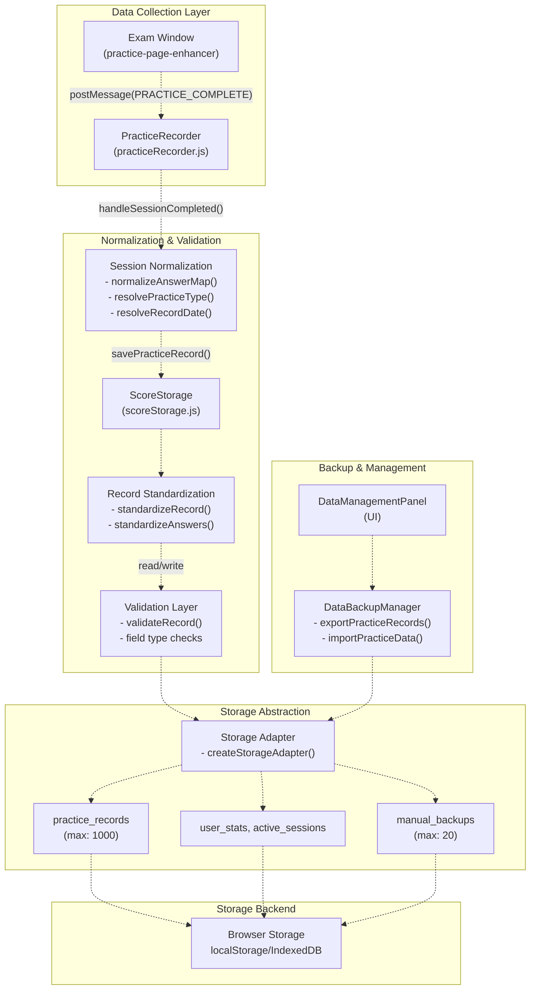
```mermaid
flowchart TD

ExamWindow["Exam Window<br>(practice-page-enhancer)"]
PracticeRecorder["PracticeRecorder<br>(practiceRecorder.js)"]
SessionNormalization["Session Normalization<br>- normalizeAnswerMap()<br>- resolvePracticeType()<br>- resolveRecordDate()"]
ScoreStorage["ScoreStorage<br>(scoreStorage.js)"]
StandardizeRecord["Record Standardization<br>- standardizeRecord()<br>- standardizeAnswers()"]
ValidationLayer["Validation Layer<br>- validateRecord()<br>- field type checks"]
StorageAdapter["Storage Adapter<br>- createStorageAdapter()"]
PracticeRepo["practice_records<br>(max: 1000)"]
MetaRepo["user_stats, active_sessions"]
BackupRepo["manual_backups<br>(max: 20)"]
DataBackupManager["DataBackupManager<br>- exportPracticeRecords()<br>- importPracticeData()"]
DataManagementPanel["DataManagementPanel<br>(UI)"]
BrowserStorage["Browser Storage<br>localStorage/IndexedDB"]

PracticeRecorder -.->|"handleSessionCompleted()"| SessionNormalization
ValidationLayer -.-> StorageAdapter
PracticeRepo -.-> BrowserStorage
MetaRepo -.-> BrowserStorage
BackupRepo -.-> BrowserStorage
DataBackupManager -.-> StorageAdapter

subgraph subGraph4 ["Storage Backend"]
    BrowserStorage
end

subgraph subGraph3 ["Backup & Management"]
    DataBackupManager
    DataManagementPanel
    DataManagementPanel -.-> DataBackupManager
end

subgraph subGraph2 ["Storage Abstraction"]
    StorageAdapter
    PracticeRepo
    MetaRepo
    BackupRepo
    StorageAdapter -.-> PracticeRepo
    StorageAdapter -.-> MetaRepo
    StorageAdapter -.-> BackupRepo
end

subgraph subGraph1 ["Normalization & Validation"]
    SessionNormalization
    ScoreStorage
    StandardizeRecord
    ValidationLayer
    SessionNormalization -.->|"savePracticeRecord()"| ScoreStorage
    ScoreStorage -.-> StandardizeRecord
    StandardizeRecord -.->|"read/write"| ValidationLayer
end

subgraph subGraph0 ["Data Collection Layer"]
    ExamWindow
    PracticeRecorder
    ExamWindow -.->|"postMessage(PRACTICE_COMPLETE)"| PracticeRecorder
end
```

**Sources:** [js/core/practiceRecorder.js L9-L31](https://github.com/sallowayma-git/IELTS-practice/blob/92f64eb8/js/core/practiceRecorder.js#L9-L31)

 [js/core/scoreStorage.js L5-L24](https://github.com/sallowayma-git/IELTS-practice/blob/92f64eb8/js/core/scoreStorage.js#L5-L24)

 [js/utils/dataBackupManager.js L5-L19](https://github.com/sallowayma-git/IELTS-practice/blob/92f64eb8/js/utils/dataBackupManager.js#L5-L19)

### Core Data Types and Storage

The system manages practice data through specialized storage layers with defined limits and validation rules:

| Storage Key | Owner | Max Records | Purpose | Critical Fields |
| --- | --- | --- | --- | --- |
| `practice_records` | `ScoreStorage` | 1000 | Practice session history | `id`, `examId`, `startTime`, `type` |
| `user_stats` | `ScoreStorage` | 1 object | Aggregated statistics | `totalPractices`, `streakDays`, `practiceDays` |
| `active_sessions` | `PracticeRecorder` | N/A | In-progress sessions | `sessionId`, `examId`, `status` |
| `manual_backups` | `DataBackupManager` | 20 | User-initiated backups | `timestamp`, `data`, `version` |

**Sources:** [js/core/practiceRecorder.js L10-L23](https://github.com/sallowayma-git/IELTS-practice/blob/92f64eb8/js/core/practiceRecorder.js#L10-L23)

 [js/core/scoreStorage.js L6-L23](https://github.com/sallowayma-git/IELTS-practice/blob/92f64eb8/js/core/scoreStorage.js#L6-L23)

 [js/utils/dataBackupManager.js L8-L16](https://github.com/sallowayma-git/IELTS-practice/blob/92f64eb8/js/utils/dataBackupManager.js#L8-L16)

## Data Collection and Recording

The `PracticeRecorder` class manages the complete lifecycle of practice sessions, from initiation through data collection to persistence via `ScoreStorage`.

### PracticeRecorder Initialization and Session Management

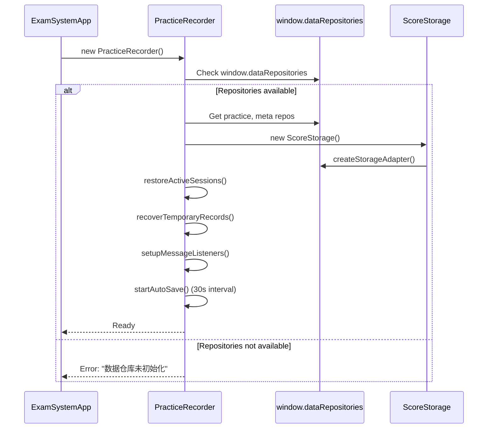
```mermaid
sequenceDiagram
  participant p1 as ExamSystemApp
  participant p2 as PracticeRecorder
  participant p3 as window.dataRepositories
  participant p4 as ScoreStorage

  p1->>p2: new PracticeRecorder()
  p2->>p3: Check window.dataRepositories
  alt Repositories available
    p2->>p3: Get practice, meta repos
    p2->>p4: new ScoreStorage()
    p4->>p3: createStorageAdapter()
    p2->>p2: restoreActiveSessions()
    p2->>p2: recoverTemporaryRecords()
    p2->>p2: setupMessageListeners()
    p2->>p2: startAutoSave() (30s interval)
    p2-->>p1: Ready
  else Repositories not available
    p2-->>p1: Error: "数据仓库未初始化"
  end
```

**Sources:** [js/core/practiceRecorder.js L9-L31](https://github.com/sallowayma-git/IELTS-practice/blob/92f64eb8/js/core/practiceRecorder.js#L9-L31)

 [js/core/scoreStorage.js L5-L24](https://github.com/sallowayma-git/IELTS-practice/blob/92f64eb8/js/core/scoreStorage.js#L5-L24)

### Session Completion and Data Normalization

When a practice session completes, `PracticeRecorder` performs extensive normalization before passing data to `ScoreStorage`:

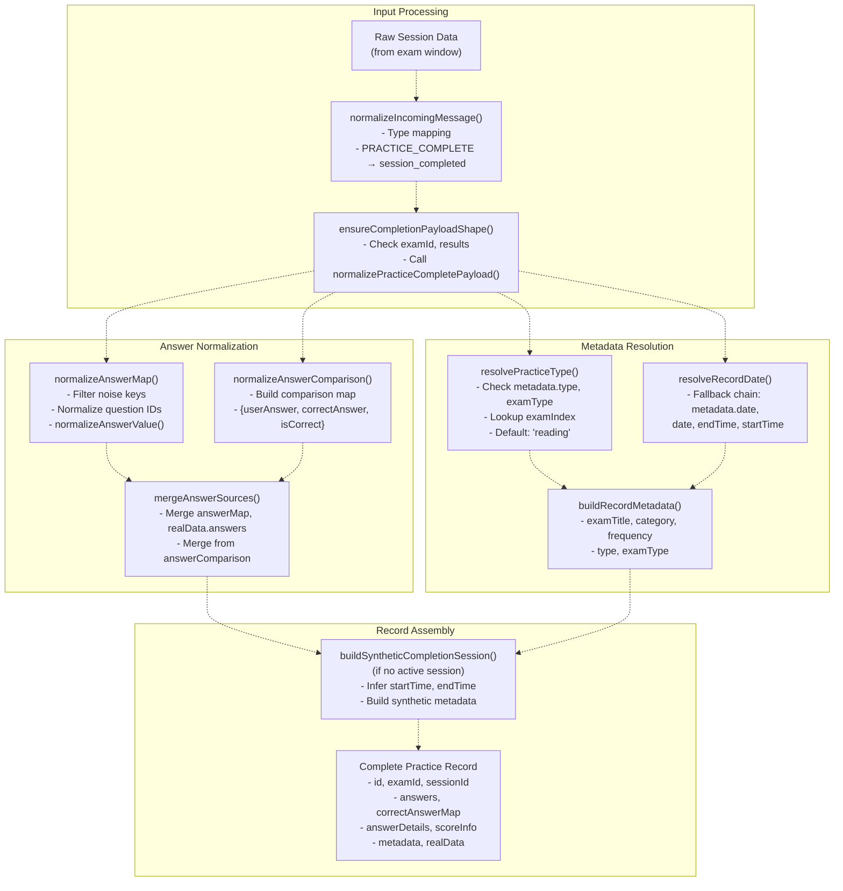
```mermaid
flowchart TD

RawData["Raw Session Data<br>(from exam window)"]
normalizeIncomingMessage["normalizeIncomingMessage()<br>- Type mapping<br>- PRACTICE_COMPLETE → session_completed"]
ensureCompletionPayloadShape["ensureCompletionPayloadShape()<br>- Check examId, results<br>- Call normalizePracticeCompletePayload()"]
normalizeAnswerMap["normalizeAnswerMap()<br>- Filter noise keys<br>- Normalize question IDs<br>- normalizeAnswerValue()"]
normalizeAnswerComparison["normalizeAnswerComparison()<br>- Build comparison map<br>- {userAnswer, correctAnswer, isCorrect}"]
mergeAnswerSources["mergeAnswerSources()<br>- Merge answerMap, realData.answers<br>- Merge from answerComparison"]
resolvePracticeType["resolvePracticeType()<br>- Check metadata.type, examType<br>- Lookup examIndex<br>- Default: 'reading'"]
resolveRecordDate["resolveRecordDate()<br>- Fallback chain: metadata.date,<br>  date, endTime, startTime"]
buildRecordMetadata["buildRecordMetadata()<br>- examTitle, category, frequency<br>- type, examType"]
buildSyntheticSession["buildSyntheticCompletionSession()<br>(if no active session)<br>- Infer startTime, endTime<br>- Build synthetic metadata"]
PracticeRecord["Complete Practice Record<br>- id, examId, sessionId<br>- answers, correctAnswerMap<br>- answerDetails, scoreInfo<br>- metadata, realData"]

ensureCompletionPayloadShape -.-> normalizeAnswerMap
ensureCompletionPayloadShape -.-> normalizeAnswerComparison
ensureCompletionPayloadShape -.-> resolvePracticeType
ensureCompletionPayloadShape -.-> resolveRecordDate
mergeAnswerSources -.-> buildSyntheticSession
buildRecordMetadata -.-> buildSyntheticSession

subgraph subGraph3 ["Record Assembly"]
    buildSyntheticSession
    PracticeRecord
    buildSyntheticSession -.-> PracticeRecord
end

subgraph subGraph2 ["Metadata Resolution"]
    resolvePracticeType
    resolveRecordDate
    buildRecordMetadata
    resolvePracticeType -.-> buildRecordMetadata
    resolveRecordDate -.-> buildRecordMetadata
end

subgraph subGraph1 ["Answer Normalization"]
    normalizeAnswerMap
    normalizeAnswerComparison
    mergeAnswerSources
    normalizeAnswerMap -.-> mergeAnswerSources
    normalizeAnswerComparison -.-> mergeAnswerSources
end

subgraph subGraph0 ["Input Processing"]
    RawData
    normalizeIncomingMessage
    ensureCompletionPayloadShape
    RawData -.-> normalizeIncomingMessage
    normalizeIncomingMessage -.-> ensureCompletionPayloadShape
end
```

**Sources:** [js/core/practiceRecorder.js L262-L296](https://github.com/sallowayma-git/IELTS-practice/blob/92f64eb8/js/core/practiceRecorder.js#L262-L296)

 [js/core/practiceRecorder.js L298-L350](https://github.com/sallowayma-git/IELTS-practice/blob/92f64eb8/js/core/practiceRecorder.js#L298-L350)

 [js/core/practiceRecorder.js L529-L554](https://github.com/sallowayma-git/IELTS-practice/blob/92f64eb8/js/core/practiceRecorder.js#L529-L554)

 [js/core/practiceRecorder.js L71-L94](https://github.com/sallowayma-git/IELTS-practice/blob/92f64eb8/js/core/practiceRecorder.js#L71-L94)

 [js/core/practiceRecorder.js L96-L105](https://github.com/sallowayma-git/IELTS-practice/blob/92f64eb8/js/core/practiceRecorder.js#L96-L105)

 [js/core/practiceRecorder.js L184-L199](https://github.com/sallowayma-git/IELTS-practice/blob/92f64eb8/js/core/practiceRecorder.js#L184-L199)

### Answer Value Normalization

The `normalizeAnswerValue()` method handles diverse input types and filters invalid data:

```python
// Key normalization logic from js/core/practiceRecorder.js:478-527
// - Filters undefined, null → empty string
// - Trims strings, filters "[object Object]" patterns
// - Converts numbers/booleans to strings
// - Arrays: map and join with comma
// - Objects: extract from {value, label, text, answer, content, innerText, textContent}
// - Logs warning for unextractable objects
```

The system also filters noise keys that don't represent actual answers:

```javascript
// Noise key patterns from js/core/practiceRecorder.js:556-598
const noiseKeys = [
    'playback-speed', 'volume-slider', 'audio-volume', 'audiocurrenttime',
    'settings', 'lastfocuselement', 'sessionid', 'examid', 'metadata'
];
const noisePatterns = [/playback/i, /volume/i, /slider/i, /audio/i];
// Question numbers must be 1-200
```

**Sources:** [js/core/practiceRecorder.js L478-L527](https://github.com/sallowayma-git/IELTS-practice/blob/92f64eb8/js/core/practiceRecorder.js#L478-L527)

 [js/core/practiceRecorder.js L556-L598](https://github.com/sallowayma-git/IELTS-practice/blob/92f64eb8/js/core/practiceRecorder.js#L556-L598)

</old_str>
<new_str>

## ScoreStorage and Record Persistence

The `ScoreStorage` class provides the final validation and persistence layer for practice records. It standardizes record formats, validates data integrity, and manages user statistics.

### ScoreStorage Initialization

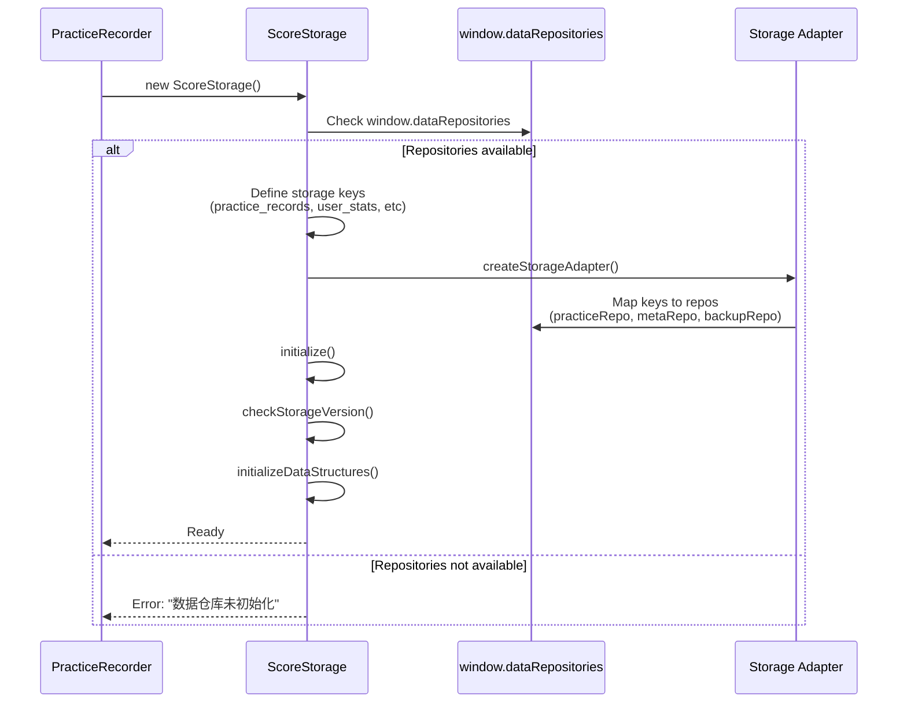
```mermaid
sequenceDiagram
  participant p1 as PracticeRecorder
  participant p2 as ScoreStorage
  participant p3 as window.dataRepositories
  participant p4 as Storage Adapter

  p1->>p2: new ScoreStorage()
  p2->>p3: Check window.dataRepositories
  alt Repositories available
    p2->>p2: Define storage keys<br/>(practice_records, user_stats, etc)
    p2->>p4: createStorageAdapter()
    p4->>p3: Map keys to repos<br/>(practiceRepo, metaRepo, backupRepo)
    p2->>p2: initialize()
    p2->>p2: checkStorageVersion()
    p2->>p2: initializeDataStructures()
    p2-->>p1: Ready
  else Repositories not available
    p2-->>p1: Error: "数据仓库未初始化"
  end
```

**Sources:** [js/core/scoreStorage.js L5-L24](https://github.com/sallowayma-git/IELTS-practice/blob/92f64eb8/js/core/scoreStorage.js#L5-L24)

 [js/core/scoreStorage.js L220-L287](https://github.com/sallowayma-git/IELTS-practice/blob/92f64eb8/js/core/scoreStorage.js#L220-L287)

 [js/core/scoreStorage.js L289-L303](https://github.com/sallowayma-git/IELTS-practice/blob/92f64eb8/js/core/scoreStorage.js#L289-L303)

### Storage Adapter Architecture

The `createStorageAdapter()` method provides a unified interface that maps logical storage keys to repository methods:

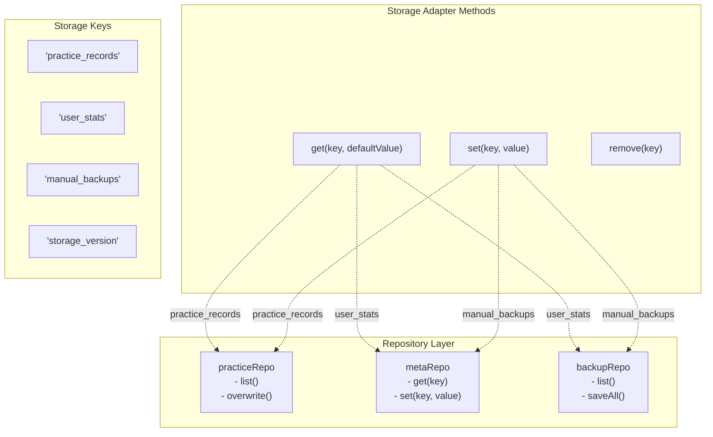
```mermaid
flowchart TD

PR_Key["'practice_records'"]
US_Key["'user_stats'"]
BU_Key["'manual_backups'"]
SV_Key["'storage_version'"]
Get["get(key, defaultValue)"]
Set["set(key, value)"]
Remove["remove(key)"]
PracticeRepo["practiceRepo<br>- list()<br>- overwrite()"]
MetaRepo["metaRepo<br>- get(key)<br>- set(key, value)"]
BackupRepo["backupRepo<br>- list()<br>- saveAll()"]

Get -.->|"practice_records"| PracticeRepo
Get -.->|"user_stats"| MetaRepo
Get -.->|"user_stats"| BackupRepo
Set -.->|"practice_records"| PracticeRepo
Set -.->|"manual_backups"| MetaRepo
Set -.->|"manual_backups"| BackupRepo

subgraph subGraph2 ["Repository Layer"]
    PracticeRepo
    MetaRepo
    BackupRepo
end

subgraph subGraph1 ["Storage Adapter Methods"]
    Get
    Set
    Remove
end

subgraph subGraph0 ["Storage Keys"]
    PR_Key
    US_Key
    BU_Key
    SV_Key
end
```

**Sources:** [js/core/scoreStorage.js L220-L287](https://github.com/sallowayma-git/IELTS-practice/blob/92f64eb8/js/core/scoreStorage.js#L220-L287)

### Record Standardization Pipeline

When `ScoreStorage` receives a record from `PracticeRecorder`, it applies a comprehensive standardization process:

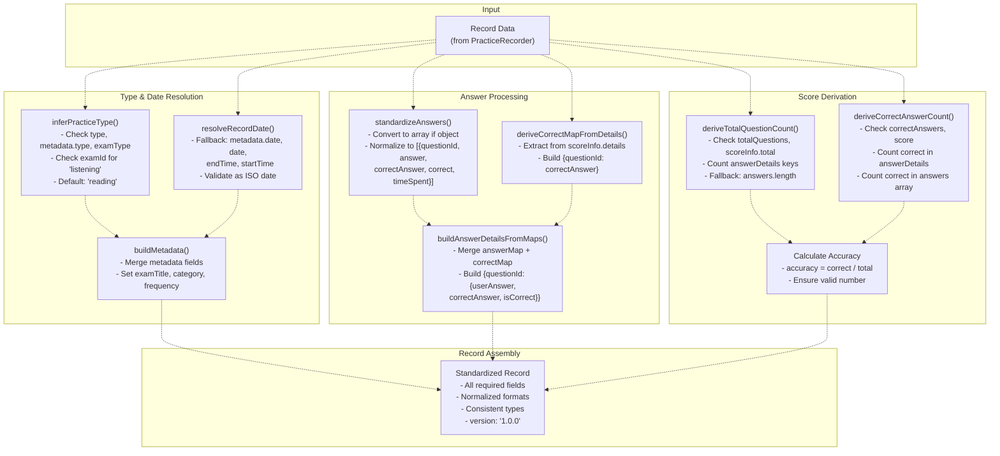
```mermaid
flowchart TD

RecordData["Record Data<br>(from PracticeRecorder)"]
inferPracticeType["inferPracticeType()<br>- Check type, metadata.type, examType<br>- Check examId for 'listening'<br>- Default: 'reading'"]
resolveRecordDate["resolveRecordDate()<br>- Fallback: metadata.date, date,<br>  endTime, startTime<br>- Validate as ISO date"]
buildMetadata["buildMetadata()<br>- Merge metadata fields<br>- Set examTitle, category, frequency"]
standardizeAnswers["standardizeAnswers()<br>- Convert to array if object<br>- Normalize to [{questionId, answer,<br>  correctAnswer, correct, timeSpent}]"]
deriveCorrectMap["deriveCorrectMapFromDetails()<br>- Extract from scoreInfo.details<br>- Build {questionId: correctAnswer}"]
buildAnswerDetailsFromMaps["buildAnswerDetailsFromMaps()<br>- Merge answerMap + correctMap<br>- Build {questionId: {userAnswer,<br>  correctAnswer, isCorrect}}"]
deriveTotalQuestionCount["deriveTotalQuestionCount()<br>- Check totalQuestions, scoreInfo.total<br>- Count answerDetails keys<br>- Fallback: answers.length"]
deriveCorrectAnswerCount["deriveCorrectAnswerCount()<br>- Check correctAnswers, score<br>- Count correct in answerDetails<br>- Count correct in answers array"]
calculateAccuracy["Calculate Accuracy<br>- accuracy = correct / total<br>- Ensure valid number"]
StandardizedRecord["Standardized Record<br>- All required fields<br>- Normalized formats<br>- Consistent types<br>- version: '1.0.0'"]

RecordData -.-> inferPracticeType
RecordData -.-> resolveRecordDate
RecordData -.-> standardizeAnswers
RecordData -.-> deriveCorrectMap
RecordData -.-> deriveTotalQuestionCount
RecordData -.-> deriveCorrectAnswerCount
buildMetadata -.-> StandardizedRecord
buildAnswerDetailsFromMaps -.-> StandardizedRecord
calculateAccuracy -.-> StandardizedRecord

subgraph subGraph4 ["Record Assembly"]
    StandardizedRecord
end

subgraph subGraph3 ["Score Derivation"]
    deriveTotalQuestionCount
    deriveCorrectAnswerCount
    calculateAccuracy
    deriveTotalQuestionCount -.-> calculateAccuracy
    deriveCorrectAnswerCount -.-> calculateAccuracy
end

subgraph subGraph2 ["Answer Processing"]
    standardizeAnswers
    deriveCorrectMap
    buildAnswerDetailsFromMaps
    standardizeAnswers -.-> buildAnswerDetailsFromMaps
    deriveCorrectMap -.-> buildAnswerDetailsFromMaps
end

subgraph subGraph1 ["Type & Date Resolution"]
    inferPracticeType
    resolveRecordDate
    buildMetadata
    inferPracticeType -.-> buildMetadata
    resolveRecordDate -.-> buildMetadata
end

subgraph Input ["Input"]
    RecordData
end
```

**Sources:** [js/core/scoreStorage.js L589-L707](https://github.com/sallowayma-git/IELTS-practice/blob/92f64eb8/js/core/scoreStorage.js#L589-L707)

 [js/core/scoreStorage.js L26-L43](https://github.com/sallowayma-git/IELTS-practice/blob/92f64eb8/js/core/scoreStorage.js#L26-L43)

 [js/core/scoreStorage.js L45-L63](https://github.com/sallowayma-git/IELTS-practice/blob/92f64eb8/js/core/scoreStorage.js#L45-L63)

 [js/core/scoreStorage.js L65-L79](https://github.com/sallowayma-git/IELTS-practice/blob/92f64eb8/js/core/scoreStorage.js#L65-L79)

 [js/core/scoreStorage.js L86-L120](https://github.com/sallowayma-git/IELTS-practice/blob/92f64eb8/js/core/scoreStorage.js#L86-L120)

 [js/core/scoreStorage.js L122-L187](https://github.com/sallowayma-git/IELTS-practice/blob/92f64eb8/js/core/scoreStorage.js#L122-L187)

 [js/core/scoreStorage.js L711-L732](https://github.com/sallowayma-git/IELTS-practice/blob/92f64eb8/js/core/scoreStorage.js#L711-L732)

### Record Validation and Persistence

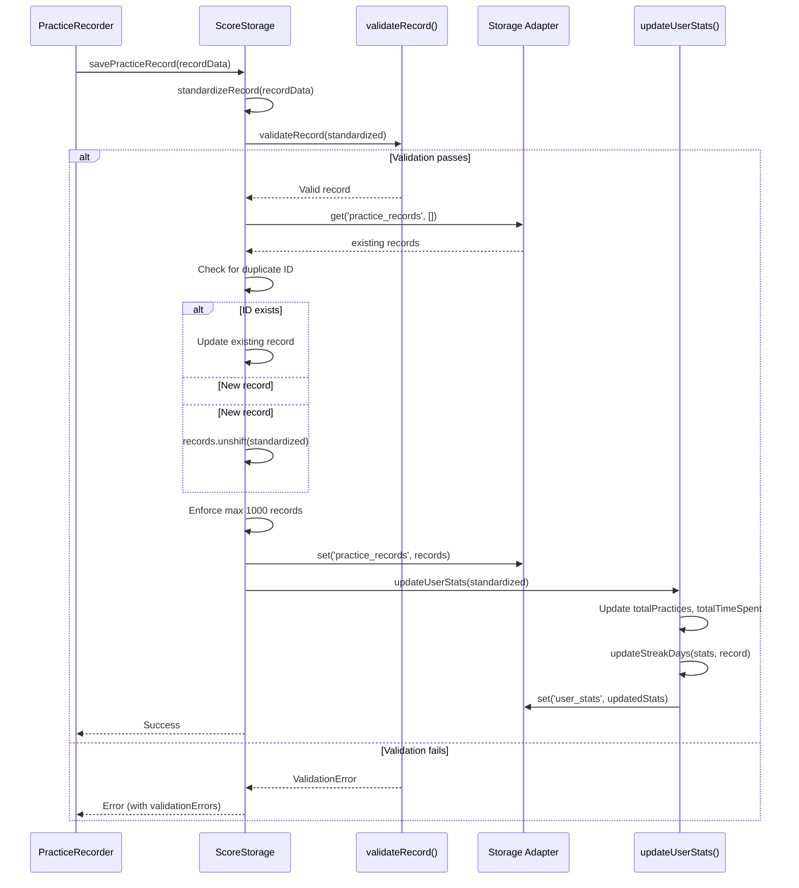
```mermaid
sequenceDiagram
  participant p1 as PracticeRecorder
  participant p2 as ScoreStorage
  participant p3 as validateRecord()
  participant p4 as Storage Adapter
  participant p5 as updateUserStats()

  p1->>p2: savePracticeRecord(recordData)
  p2->>p2: standardizeRecord(recordData)
  p2->>p3: validateRecord(standardized)
  alt Validation passes
    p3-->>p2: Valid record
    p2->>p4: get('practice_records', [])
    p4-->>p2: existing records
    p2->>p2: Check for duplicate ID
  alt ID exists
    p2->>p2: Update existing record
  else New record
  else New record
    p2->>p2: records.unshift(standardized)
  end
    p2->>p2: Enforce max 1000 records
    p2->>p4: set('practice_records', records)
    p2->>p5: updateUserStats(standardized)
    p5->>p5: Update totalPractices, totalTimeSpent
    p5->>p5: updateStreakDays(stats, record)
    p5->>p4: set('user_stats', updatedStats)
    p2-->>p1: Success
  else Validation fails
    p3-->>p2: ValidationError
    p2-->>p1: Error (with validationErrors)
  end
```

**Sources:** [js/core/scoreStorage.js L421-L487](https://github.com/sallowayma-git/IELTS-practice/blob/92f64eb8/js/core/scoreStorage.js#L421-L487)

 [js/core/scoreStorage.js L826-L900](https://github.com/sallowayma-git/IELTS-practice/blob/92f64eb8/js/core/scoreStorage.js#L826-L900)

## Data Backup and Export System

The `DataBackupManager` class provides comprehensive export, import, and backup functionality with support for JSON and CSV formats. It handles data normalization, validation, and merge strategies.

### Export Capabilities

The system supports flexible export options with filtering and format selection:

| Export Option | Type | Purpose | Default |
| --- | --- | --- | --- |
| `format` | `'json' \| 'csv'` | Output format | `'json'` |
| `includeStats` | `boolean` | Include user statistics | `true` |
| `includeBackups` | `boolean` | Include backup data | `false` |
| `dateRange` | `{startDate, endDate}` | Filter by date range | `null` |
| `categories` | `string[]` | Filter by exam categories | `null` |

**Sources:** [js/utils/dataBackupManager.js L49-L115](https://github.com/sallowayma-git/IELTS-practice/blob/92f64eb8/js/utils/dataBackupManager.js#L49-L115)

### Export Process Flow

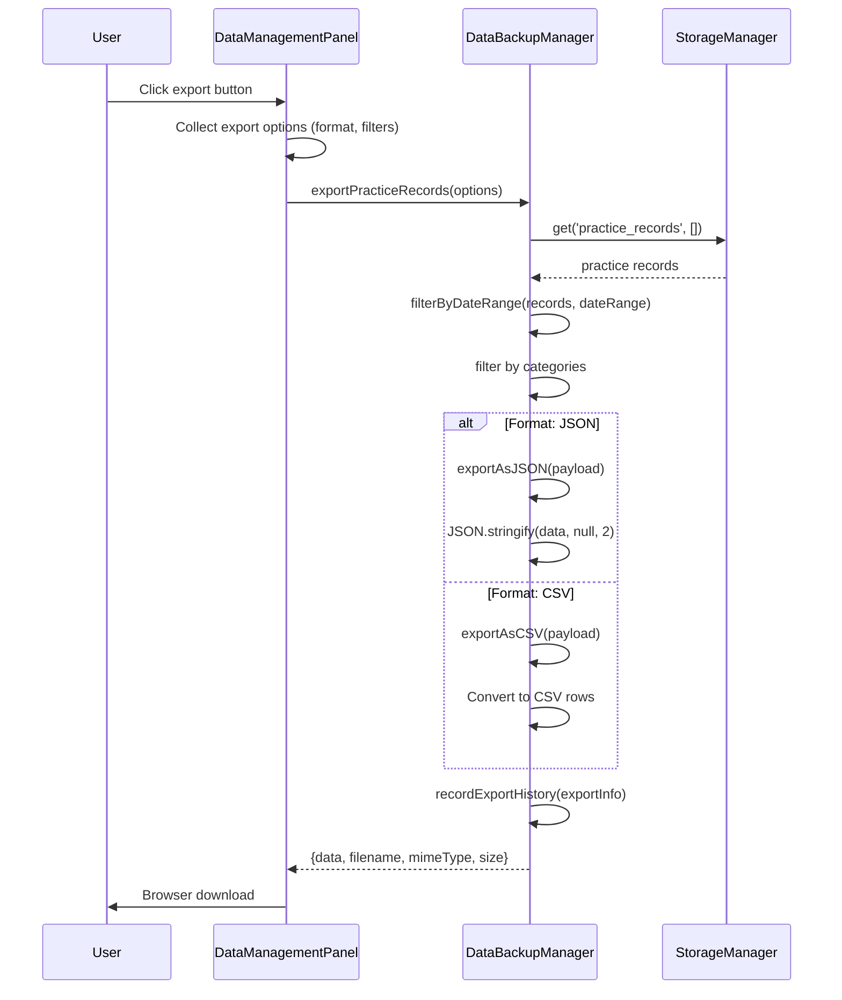
```mermaid
sequenceDiagram
  participant p1 as User
  participant p2 as DataManagementPanel
  participant p3 as DataBackupManager
  participant p4 as StorageManager

  p1->>p2: Click export button
  p2->>p2: Collect export options (format, filters)
  p2->>p3: exportPracticeRecords(options)
  p3->>p4: get('practice_records', [])
  p4-->>p3: practice records
  p3->>p3: filterByDateRange(records, dateRange)
  p3->>p3: filter by categories
  alt Format: JSON
    p3->>p3: exportAsJSON(payload)
    p3->>p3: JSON.stringify(data, null, 2)
  else Format: CSV
    p3->>p3: exportAsCSV(payload)
    p3->>p3: Convert to CSV rows
  end
  p3->>p3: recordExportHistory(exportInfo)
  p3-->>p2: {data, filename, mimeType, size}
  p2->>p1: Browser download
```

**Sources:** [js/utils/dataBackupManager.js L49-L175](https://github.com/sallowayma-git/IELTS-practice/blob/92f64eb8/js/utils/dataBackupManager.js#L49-L175)

 [js/components/dataManagementPanel.js L439-L473](https://github.com/sallowayma-git/IELTS-practice/blob/92f64eb8/js/components/dataManagementPanel.js#L439-L473)

### Import and Data Merging

The import system uses a sophisticated parsing and normalization pipeline that handles multiple data formats and structures.

#### Import Source Parsing

The `parseImportSource` method accepts multiple input types:

| Input Type | Handling | Notes |
| --- | --- | --- |
| `File` | Read as text, parse JSON | Via FileReader API |
| `Blob` | Read as text, parse JSON | Converted to text first |
| `string` (JSON) | Direct JSON.parse | Detected by `startsWith('{')` or `'<FileRef file-url="https://github.com/sallowayma-git/IELTS-practice/blob/92f64eb8/'` |

#### Import Normalization Pipeline

The `DataBackupManager` import system handles diverse input formats through a multi-stage normalization pipeline:

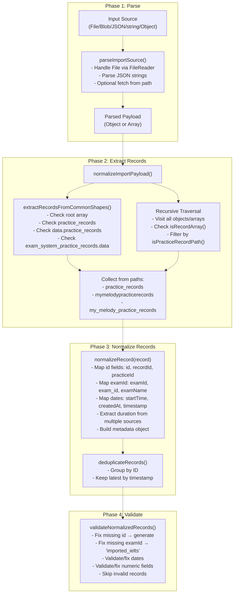
```mermaid
flowchart TD

InputSource["Input Source<br>(File/Blob/JSON/string/Object)"]
parseImportSource["parseImportSource()<br>- Handle File via FileReader<br>- Parse JSON strings<br>- Optional fetch from path"]
ParsedPayload["Parsed Payload<br>(Object or Array)"]
normalizeImportPayload["normalizeImportPayload()"]
FastPath["extractRecordsFromCommonShapes()<br>- Check root array<br>- Check practice_records<br>- Check data.practice_records<br>- Check exam_system_practice_records.data"]
GenericPath["Recursive Traversal<br>- Visit all objects/arrays<br>- Check isRecordArray()<br>- Filter by isPracticeRecordPath()"]
CollectRecords["Collect from paths:<br>- practice_records<br>- mymelodypracticerecords<br>- my_melody_practice_records"]
normalizeRecord["normalizeRecord(record)<br>- Map id fields: id, recordId, practiceId<br>- Map examId: examId, exam_id, examName<br>- Map dates: startTime, createdAt, timestamp<br>- Extract duration from multiple sources<br>- Build metadata object"]
DeduplicateRecords["deduplicateRecords()<br>- Group by ID<br>- Keep latest by timestamp"]
validateNormalizedRecords["validateNormalizedRecords()<br>- Fix missing id → generate<br>- Fix missing examId → 'imported_ielts'<br>- Validate/fix dates<br>- Validate/fix numeric fields<br>- Skip invalid records"]

ParsedPayload -.-> normalizeImportPayload
CollectRecords -.-> normalizeRecord
DeduplicateRecords -.-> validateNormalizedRecords

subgraph subGraph3 ["Phase 4: Validate"]
    validateNormalizedRecords
end

subgraph subGraph2 ["Phase 3: Normalize Records"]
    normalizeRecord
    DeduplicateRecords
    normalizeRecord -.-> DeduplicateRecords
end

subgraph subGraph1 ["Phase 2: Extract Records"]
    normalizeImportPayload
    FastPath
    GenericPath
    CollectRecords
    normalizeImportPayload -.-> FastPath
    normalizeImportPayload -.-> GenericPath
    FastPath -.-> CollectRecords
    GenericPath -.-> CollectRecords
end

subgraph subGraph0 ["Phase 1: Parse"]
    InputSource
    parseImportSource
    ParsedPayload
    InputSource -.-> parseImportSource
    parseImportSource -.-> ParsedPayload
end
```

**Sources:** [js/utils/dataBackupManager.js L271-L314](https://github.com/sallowayma-git/IELTS-practice/blob/92f64eb8/js/utils/dataBackupManager.js#L271-L314)

 [js/utils/dataBackupManager.js L316-L433](https://github.com/sallowayma-git/IELTS-practice/blob/92f64eb8/js/utils/dataBackupManager.js#L316-L433)

 [js/utils/dataBackupManager.js L729-L767](https://github.com/sallowayma-git/IELTS-practice/blob/92f64eb8/js/utils/dataBackupManager.js#L729-L767)

 [js/utils/dataBackupManager.js L789-L893](https://github.com/sallowayma-git/IELTS-practice/blob/92f64eb8/js/utils/dataBackupManager.js#L789-L893)

 [js/utils/dataBackupManager.js L450-L506](https://github.com/sallowayma-git/IELTS-practice/blob/92f64eb8/js/utils/dataBackupManager.js#L450-L506)

 [js/utils/dataBackupManager.js L666-L686](https://github.com/sallowayma-git/IELTS-practice/blob/92f64eb8/js/utils/dataBackupManager.js#L666-L686)

### Record Field Mapping and Duration Extraction

The `normalizeRecord()` method uses extensive fallback chains to handle diverse data structures:

```python
// From js/utils/dataBackupManager.js:789-893
// ID Resolution Priority:
sourceId = record.id ?? record.recordId ?? record.practiceId ?? 
           record.sessionId ?? record.timestamp ?? record.uuid

// Exam ID Resolution:
examId = record.examId ?? record.exam_id ?? record.examID ?? 
         record.examName ?? record.title ?? record.name

// Date Field Resolution:
startTimeRaw = record.startTime ?? record.start_time ?? 
               record.startedAt ?? record.createdAt ?? 
               record.timestamp ?? record.date

// Duration Extraction (from js/utils/dataBackupManager.js:825-842):
// Prefers positive values, then allows zero as fallback
candidates = [
    record.duration, record.realData?.duration,
    record.durationSeconds, record.duration_seconds,
    record.elapsedSeconds, record.elapsed_seconds,
    record.timeSpent, record.time_spent,
    record.scoreInfo?.duration
]
// First positive number wins; if none, first finite number
```

**Sources:** [js/utils/dataBackupManager.js L789-L893](https://github.com/sallowayma-git/IELTS-practice/blob/92f64eb8/js/utils/dataBackupManager.js#L789-L893)

 [js/utils/dataBackupManager.js L825-L842](https://github.com/sallowayma-git/IELTS-practice/blob/92f64eb8/js/utils/dataBackupManager.js#L825-L842)

#### Merge Strategies

The import system supports three merge modes when handling duplicate records:

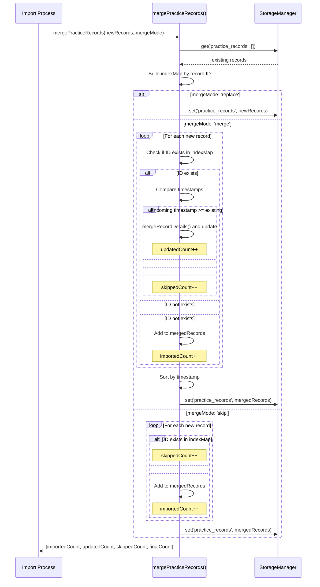
```mermaid
sequenceDiagram
  participant p1 as Import Process
  participant p2 as mergePracticeRecords()
  participant p3 as StorageManager

  p1->>p2: mergePracticeRecords(newRecords, mergeMode)
  p2->>p3: get('practice_records', [])
  p3-->>p2: existing records
  p2->>p2: Build indexMap by record ID
  alt mergeMode: 'replace'
    p2->>p3: set('practice_records', newRecords)
  else mergeMode: 'merge'
  loop For each new record
    p2->>p2: Check if ID exists in indexMap
  alt ID exists
    p2->>p2: Compare timestamps
  alt incoming timestamp >= existing
    p2->>p2: mergeRecordDetails() and update
    note over p2: updatedCount++
  else
  else
  else
    note over p2: skippedCount++
  end
  else ID not exists
  else ID not exists
    p2->>p2: Add to mergedRecords
    note over p2: importedCount++
  end
  end
    p2->>p2: Sort by timestamp
    p2->>p3: set('practice_records', mergedRecords)
  else mergeMode: 'skip'
  loop For each new record
  alt ID exists in indexMap
    note over p2: skippedCount++
  else
  else
    p2->>p2: Add to mergedRecords
    note over p2: importedCount++
  end
  end
    p2->>p3: set('practice_records', mergedRecords)
  end
  p2-->>p1: {importedCount, updatedCount, skippedCount, finalCount}
```

**Sources:** [js/utils/dataBackupManager.js L508-L578](https://github.com/sallowayma-git/IELTS-practice/blob/92f64eb8/js/utils/dataBackupManager.js#L508-L578)

 [js/utils/dataBackupManager.js L619-L664](https://github.com/sallowayma-git/IELTS-practice/blob/92f64eb8/js/utils/dataBackupManager.js#L619-L664)

### User Statistics Management

The `ScoreStorage` class maintains aggregated statistics including practice streaks:

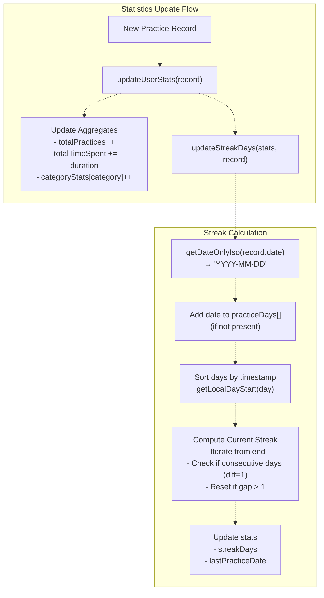
```mermaid
flowchart TD

NewRecord["New Practice Record"]
updateUserStats["updateUserStats(record)"]
UpdateAggregates["Update Aggregates<br>- totalPractices++<br>- totalTimeSpent += duration<br>- categoryStats[category]++"]
updateStreakDays["updateStreakDays(stats, record)"]
ExtractDate["getDateOnlyIso(record.date)<br>→ 'YYYY-MM-DD'"]
UpdatePracticeDays["Add date to practiceDays[]<br>(if not present)"]
SortDays["Sort days by timestamp<br>getLocalDayStart(day)"]
ComputeStreak["Compute Current Streak<br>- Iterate from end<br>- Check if consecutive days (diff=1)<br>- Reset if gap > 1"]
UpdateStats["Update stats<br>- streakDays<br>- lastPracticeDate"]

updateStreakDays -.-> ExtractDate

subgraph subGraph1 ["Streak Calculation"]
    ExtractDate
    UpdatePracticeDays
    SortDays
    ComputeStreak
    UpdateStats
    ExtractDate -.-> UpdatePracticeDays
    UpdatePracticeDays -.-> SortDays
    SortDays -.-> ComputeStreak
    ComputeStreak -.-> UpdateStats
end

subgraph subGraph0 ["Statistics Update Flow"]
    NewRecord
    updateUserStats
    UpdateAggregates
    updateStreakDays
    NewRecord -.-> updateUserStats
    updateUserStats -.-> UpdateAggregates
    updateUserStats -.-> updateStreakDays
end
```

**Sources:** [js/core/scoreStorage.js L826-L900](https://github.com/sallowayma-git/IELTS-practice/blob/92f64eb8/js/core/scoreStorage.js#L826-L900)

 [js/core/practiceRecorder.js L138-L182](https://github.com/sallowayma-git/IELTS-practice/blob/92f64eb8/js/core/practiceRecorder.js#L138-L182)

 [js/core/scoreStorage.js L189-L218](https://github.com/sallowayma-git/IELTS-practice/blob/92f64eb8/js/core/scoreStorage.js#L189-L218)

### Legacy Record Sanitization

When loading existing records, `ScoreStorage` automatically repairs legacy data with missing or invalid fields:

```python
// From js/core/scoreStorage.js:489-570
// needsRecordSanitization() checks for:
// - Missing type or metadata.type
// - Invalid numeric fields (score, totalQuestions, correctAnswers, accuracy, duration)
//
// normalizeLegacyRecord() repairs:
// - Infers practiceType from examId, metadata
// - Rebuilds metadata with buildMetadata()
// - Standardizes answers to array format
// - Derives correctAnswerMap from scoreInfo.details or answerDetails
// - Recalculates totalQuestions and correctAnswers if invalid
// - Ensures startTime, endTime, status fields exist
// - Rebuilds scoreInfo.details and realData if missing
```

**Sources:** [js/core/scoreStorage.js L489-L570](https://github.com/sallowayma-git/IELTS-practice/blob/92f64eb8/js/core/scoreStorage.js#L489-L570)

 [js/core/scoreStorage.js L572-L586](https://github.com/sallowayma-git/IELTS-practice/blob/92f64eb8/js/core/scoreStorage.js#L572-L586)

## Data Integrity Management

The `DataIntegrityManager` class provides automatic backup creation, consistency validation, and quota handling. It initializes alongside the repository layer and runs periodic maintenance tasks.

### Initialization and Repository Attachment

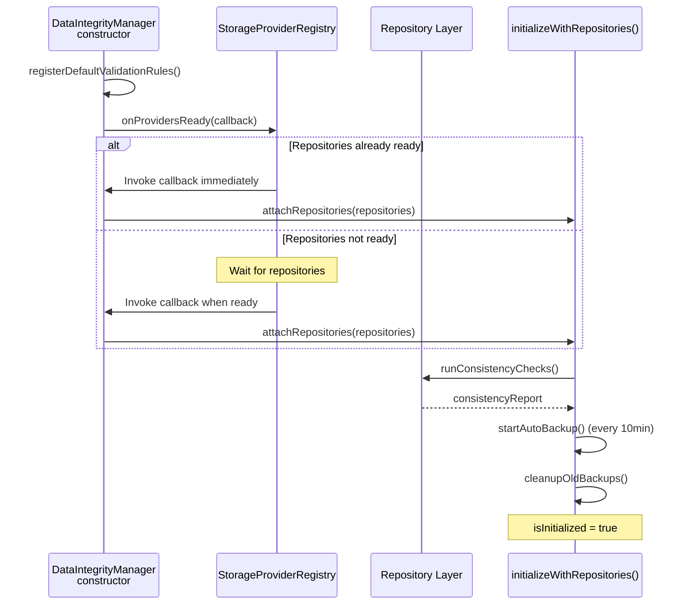
```mermaid
sequenceDiagram
  participant p1 as DataIntegrityManager<br/>constructor
  participant p2 as StorageProviderRegistry
  participant p3 as Repository Layer
  participant p4 as initializeWithRepositories()

  p1->>p1: registerDefaultValidationRules()
  p1->>p2: onProvidersReady(callback)
  alt Repositories already ready
    p2->>p1: Invoke callback immediately
    p1->>p4: attachRepositories(repositories)
  else Repositories not ready
    note over p2: Wait for repositories
    p2->>p1: Invoke callback when ready
    p1->>p4: attachRepositories(repositories)
  end
  p4->>p3: runConsistencyChecks()
  p3-->>p4: consistencyReport
  p4->>p4: startAutoBackup() (every 10min)
  p4->>p4: cleanupOldBackups()
  note over p4: isInitialized = true
```

**Sources:** [js/components/DataIntegrityManager.js L6-L87](https://github.com/sallowayma-git/IELTS-practice/blob/92f64eb8/js/components/DataIntegrityManager.js#L6-L87)

### Automatic Backup System

The system performs automatic backups every 10 minutes and maintains up to 5 backup snapshots:

| Configuration | Value | Purpose |
| --- | --- | --- |
| `backupInterval` | 600000ms (10 min) | Frequency of auto-backups |
| `maxBackups` | 5 | Maximum backup retention |
| `dataVersion` | '1.0.0' | Backup format version |

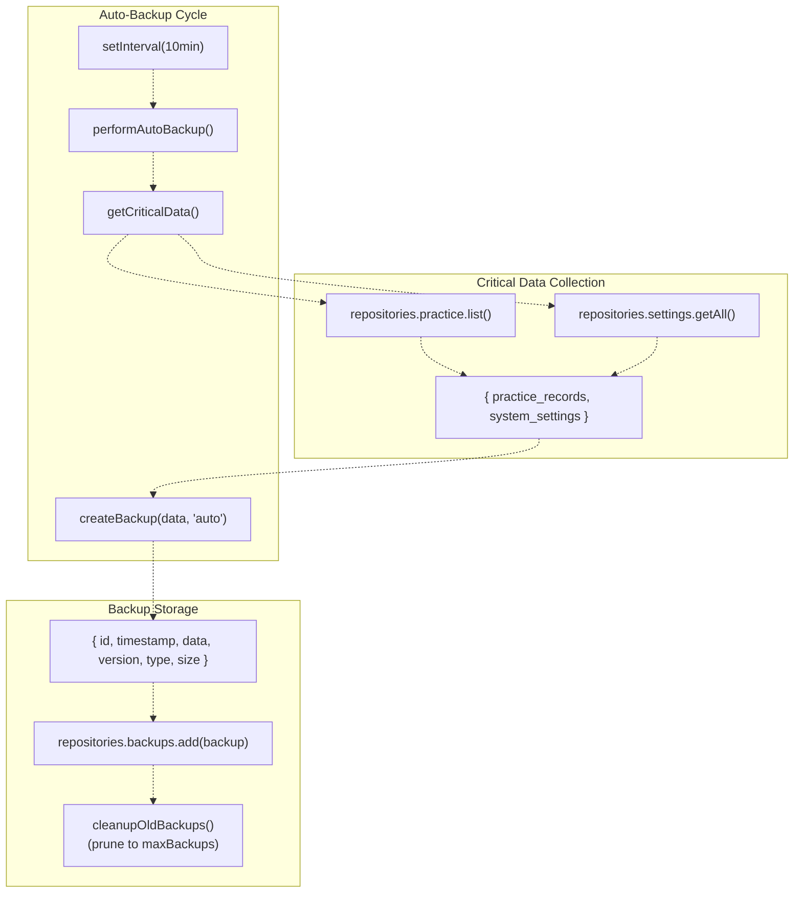
```mermaid
flowchart TD

Timer["setInterval(10min)"]
performAutoBackup["performAutoBackup()"]
getCriticalData["getCriticalData()"]
createBackup["createBackup(data, 'auto')"]
PracticeRecords["repositories.practice.list()"]
SystemSettings["repositories.settings.getAll()"]
CriticalDataObj["{ practice_records, system_settings }"]
BackupObject["{ id, timestamp, data, version, type, size }"]
BackupRepo["repositories.backups.add(backup)"]
CleanupOld["cleanupOldBackups()<br>(prune to maxBackups)"]

getCriticalData -.-> PracticeRecords
getCriticalData -.-> SystemSettings
CriticalDataObj -.-> createBackup
createBackup -.-> BackupObject

subgraph subGraph2 ["Backup Storage"]
    BackupObject
    BackupRepo
    CleanupOld
    BackupObject -.-> BackupRepo
    BackupRepo -.-> CleanupOld
end

subgraph subGraph1 ["Critical Data Collection"]
    PracticeRecords
    SystemSettings
    CriticalDataObj
    PracticeRecords -.-> CriticalDataObj
    SystemSettings -.-> CriticalDataObj
end

subgraph subGraph0 ["Auto-Backup Cycle"]
    Timer
    performAutoBackup
    getCriticalData
    createBackup
    Timer -.-> performAutoBackup
    performAutoBackup -.-> getCriticalData
end
```

**Sources:** [js/components/DataIntegrityManager.js L194-L224](https://github.com/sallowayma-git/IELTS-practice/blob/92f64eb8/js/components/DataIntegrityManager.js#L194-L224)

 [js/components/DataIntegrityManager.js L107-L137](https://github.com/sallowayma-git/IELTS-practice/blob/92f64eb8/js/components/DataIntegrityManager.js#L107-L137)

 [js/components/DataIntegrityManager.js L290-L324](https://github.com/sallowayma-git/IELTS-practice/blob/92f64eb8/js/components/DataIntegrityManager.js#L290-L324)

### Quota Exceeded Handling

When storage quota is exceeded during backup creation, the system automatically exports data as a downloadable file:

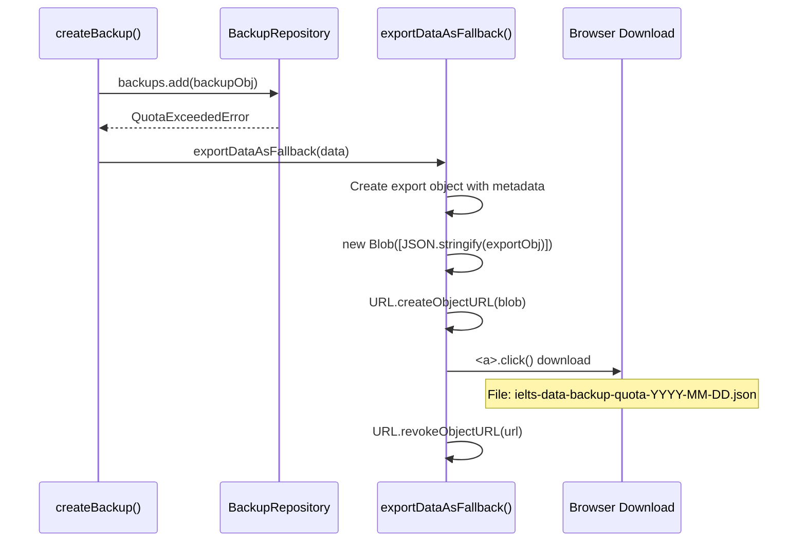
```mermaid
sequenceDiagram
  participant p1 as createBackup()
  participant p2 as BackupRepository
  participant p3 as exportDataAsFallback()
  participant p4 as Browser Download

  p1->>p2: backups.add(backupObj)
  p2-->>p1: QuotaExceededError
  p1->>p3: exportDataAsFallback(data)
  p3->>p3: Create export object with metadata
  p3->>p3: new Blob([JSON.stringify(exportObj)])
  p3->>p3: URL.createObjectURL(blob)
  p3->>p4: <a>.click() download
  note over p4: File: ielts-data-backup-quota-YYYY-MM-DD.json
  p3->>p3: URL.revokeObjectURL(url)
```

**Sources:** [js/components/DataIntegrityManager.js L107-L160](https://github.com/sallowayma-git/IELTS-practice/blob/92f64eb8/js/components/DataIntegrityManager.js#L107-L160)

### Validation Rules

The `DataIntegrityManager` registers default validation rules for critical data types:

```javascript
// From js/components/DataIntegrityManager.js:162-192
this.validationRules.set('practice_records', {
    required: ['id', 'startTime'],
    types: {
        id: 'string',
        startTime: 'string',
        endTime: 'string',
        duration: 'number',
        examId: 'string'
    },
    validators: {
        startTime: (value) => !isNaN(new Date(value).getTime()),
        duration: (value) => typeof value === 'number' && value >= 0,
        id: (value) => typeof value === 'string' && value.length > 0
    }
});

this.validationRules.set('system_settings', {
    types: {
        theme: 'string',
        language: 'string',
        autoSave: 'boolean',
        notifications: 'boolean'
    }
});
```

**Sources:** [js/components/DataIntegrityManager.js L162-L192](https://github.com/sallowayma-git/IELTS-practice/blob/92f64eb8/js/components/DataIntegrityManager.js#L162-L192)

## Legacy Compatibility Layer

The system provides backward compatibility with global variables through adapter and bridge classes. This allows incremental refactoring without breaking existing code.

### Legacy State Synchronization

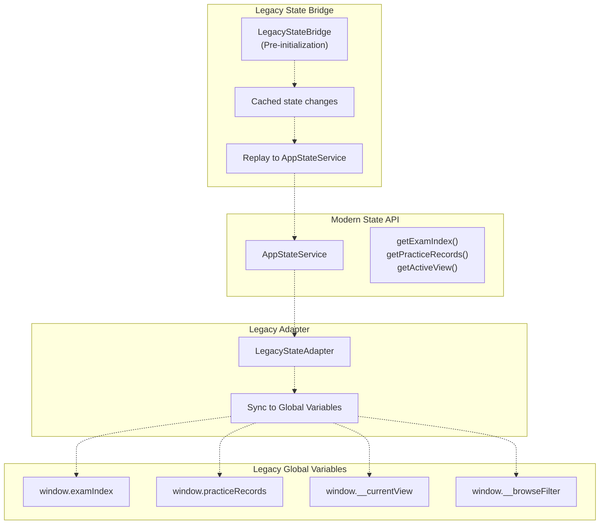
```mermaid
flowchart TD

AppStateService["AppStateService"]
StateGetters["getExamIndex()<br>getPracticeRecords()<br>getActiveView()"]
LegacyStateAdapter["LegacyStateAdapter"]
SyncToGlobals["Sync to Global Variables"]
examIndex["window.examIndex"]
practiceRecords["window.practiceRecords"]
currentView["window.__currentView"]
browseFilter["window.__browseFilter"]
LegacyStateBridge["LegacyStateBridge<br>(Pre-initialization)"]
CachedChanges["Cached state changes"]
ReplayChanges["Replay to AppStateService"]

AppStateService -.-> LegacyStateAdapter
SyncToGlobals -.-> examIndex
SyncToGlobals -.-> practiceRecords
SyncToGlobals -.-> currentView
SyncToGlobals -.-> browseFilter
ReplayChanges -.-> AppStateService

subgraph subGraph3 ["Legacy State Bridge"]
    LegacyStateBridge
    CachedChanges
    ReplayChanges
    LegacyStateBridge -.-> CachedChanges
    CachedChanges -.-> ReplayChanges
end

subgraph subGraph2 ["Legacy Global Variables"]
    examIndex
    practiceRecords
    currentView
    browseFilter
end

subgraph subGraph1 ["Legacy Adapter"]
    LegacyStateAdapter
    SyncToGlobals
    LegacyStateAdapter -.-> SyncToGlobals
end

subgraph subGraph0 ["Modern State API"]
    AppStateService
    StateGetters
end
```

**Sources:** Based on diagram 3 from the high-level architecture overview

### Legacy Fallback Runtime

The `LegacyFallback` system (in `js/script.js`) provides degraded-mode rendering when modern components fail to initialize:

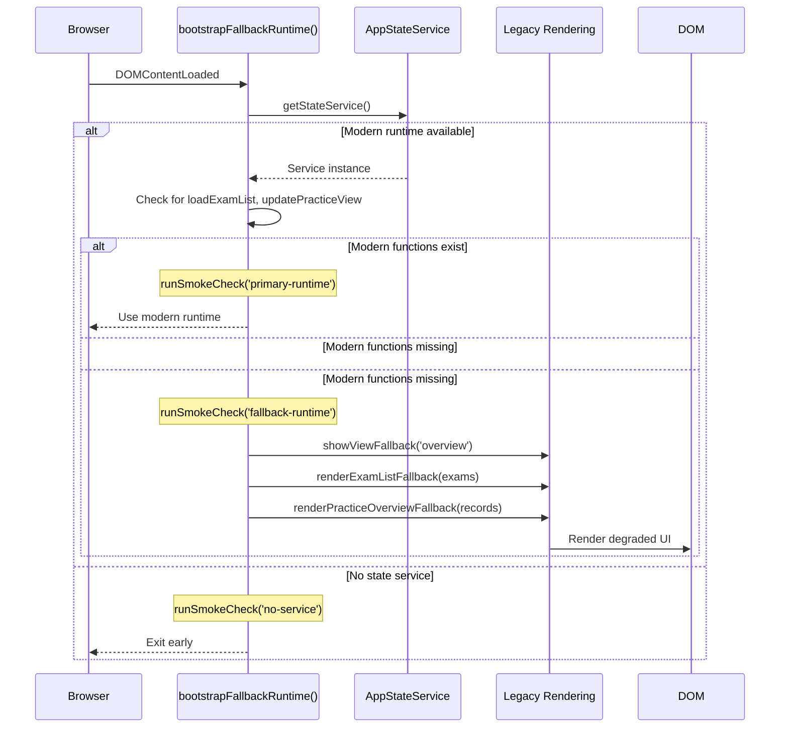
```mermaid
sequenceDiagram
  participant p1 as Browser
  participant p2 as bootstrapFallbackRuntime()
  participant p3 as AppStateService
  participant p4 as Legacy Rendering
  participant p5 as DOM

  p1->>p2: DOMContentLoaded
  p2->>p3: getStateService()
  alt Modern runtime available
    p3-->>p2: Service instance
    p2->>p2: Check for loadExamList, updatePracticeView
  alt Modern functions exist
    note over p2: runSmokeCheck('primary-runtime')
    p2-->>p1: Use modern runtime
  else Modern functions missing
  else Modern functions missing
    note over p2: runSmokeCheck('fallback-runtime')
    p2->>p4: showViewFallback('overview')
    p2->>p4: renderExamListFallback(exams)
    p2->>p4: renderPracticeOverviewFallback(records)
    p4->>p5: Render degraded UI
  end
  else No state service
    note over p2: runSmokeCheck('no-service')
    p2-->>p1: Exit early
  end
```

**Sources:** [js/script.js L107-L148](https://github.com/sallowayma-git/IELTS-practice/blob/92f64eb8/js/script.js#L107-L148)

### Simple Storage Wrapper

The `SimpleStorageWrapper` provides a legacy-compatible API wrapper around the repository layer:

```python
// From js/utils/simpleStorageWrapper.js:2-37
class SimpleStorageWrapper {
    constructor(repositories) { this.repos = repositories; }
    
    // Practice record methods
    async getPracticeRecords() { return await this.repos.practice.list(); }
    async savePracticeRecords(records) { await this.repos.practice.overwrite(records); }
    async addPracticeRecord(record) { await this.repos.practice.upsert(record); }
    async delete(id) { return await this.repos.practice.removeById(id); }
    
    // Settings methods
    async getUserSettings() { return await this.repos.settings.getAll(); }
    async setUserSetting(key, value) { await this.repos.settings.set(key, value); }
    
    // Backup methods
    async getBackups() { return await this.repos.backups.list(); }
    async addBackup(backup) { await this.repos.backups.add(backup); }
    
    // Meta storage
    async get(key, defaultValue) { return await this.repos.meta.get(key, defaultValue); }
    async set(key, value) { await this.repos.meta.set(key, value); }
}
```

The wrapper automatically connects to repositories when they become available via the `StorageProviderRegistry`.

**Sources:** [js/utils/simpleStorageWrapper.js L2-L64](https://github.com/sallowayma-git/IELTS-practice/blob/92f64eb8/js/utils/simpleStorageWrapper.js#L2-L64)

## Error Handling and Recovery

### Storage Error Management

The system implements multi-tier error handling for storage operations:

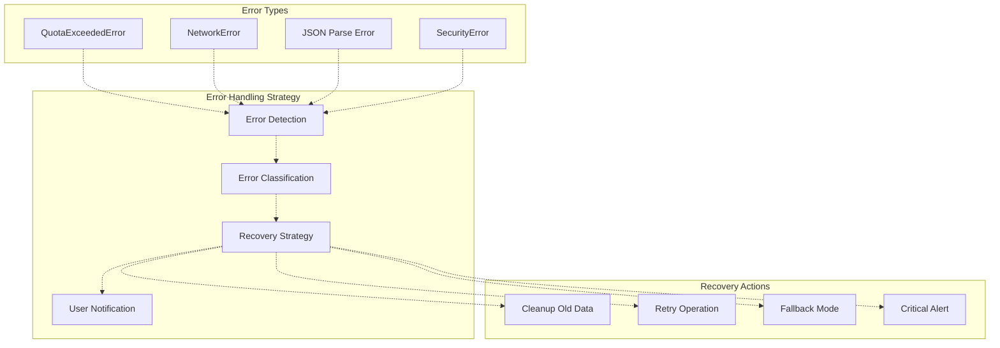
```mermaid
flowchart TD

QuotaError["QuotaExceededError"]
NetworkError["NetworkError"]
ParseError["JSON Parse Error"]
SecurityError["SecurityError"]
Detection["Error Detection"]
Classification["Error Classification"]
Recovery["Recovery Strategy"]
UserNotification["User Notification"]
CleanupOld["Cleanup Old Data"]
RetryOperation["Retry Operation"]
FallbackMode["Fallback Mode"]
CriticalAlert["Critical Alert"]

QuotaError -.-> Detection
NetworkError -.-> Detection
ParseError -.-> Detection
SecurityError -.-> Detection
Recovery -.-> CleanupOld
Recovery -.-> RetryOperation
Recovery -.-> FallbackMode
Recovery -.-> CriticalAlert

subgraph subGraph2 ["Recovery Actions"]
    CleanupOld
    RetryOperation
    FallbackMode
    CriticalAlert
end

subgraph subGraph1 ["Error Handling Strategy"]
    Detection
    Classification
    Recovery
    UserNotification
    Detection -.-> Classification
    Classification -.-> Recovery
    Recovery -.-> UserNotification
end

subgraph subGraph0 ["Error Types"]
    QuotaError
    NetworkError
    ParseError
    SecurityError
end
```

**Sources:** [improved-working-system.html L982-L998](https://github.com/sallowayma-git/IELTS-practice/blob/92f64eb8/improved-working-system.html#L982-L998)

 [improved-working-system.html L1000-L1016](https://github.com/sallowayma-git/IELTS-practice/blob/92f64eb8/improved-working-system.html#L1000-L1016)

### Quota Management

The storage system implements intelligent quota management:

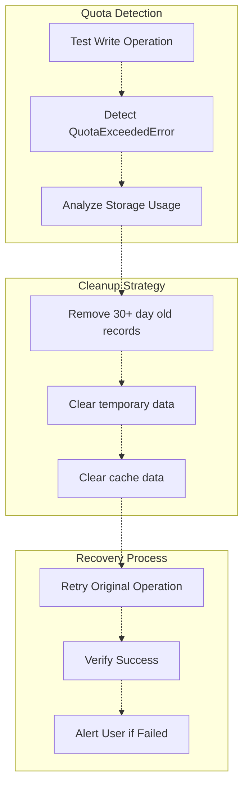
```mermaid
flowchart TD

TestWrite["Test Write Operation"]
QuotaCheck["Detect QuotaExceededError"]
SpaceAnalysis["Analyze Storage Usage"]
OldRecords["Remove 30+ day old records"]
TempData["Clear temporary data"]
CacheCleanup["Clear cache data"]
RetryWrite["Retry Original Operation"]
SuccessCheck["Verify Success"]
UserAlert["Alert User if Failed"]

SpaceAnalysis -.-> OldRecords
CacheCleanup -.-> RetryWrite

subgraph subGraph2 ["Recovery Process"]
    RetryWrite
    SuccessCheck
    UserAlert
    RetryWrite -.-> SuccessCheck
    SuccessCheck -.-> UserAlert
end

subgraph subGraph1 ["Cleanup Strategy"]
    OldRecords
    TempData
    CacheCleanup
    OldRecords -.-> TempData
    TempData -.-> CacheCleanup
end

subgraph subGraph0 ["Quota Detection"]
    TestWrite
    QuotaCheck
    SpaceAnalysis
    TestWrite -.-> QuotaCheck
    QuotaCheck -.-> SpaceAnalysis
end
```

**Sources:** [improved-working-system.html L1002-L1012](https://github.com/sallowayma-git/IELTS-practice/blob/92f64eb8/improved-working-system.html#L1002-L1012)

## Performance Optimization

### Caching Strategy

The application implements sophisticated caching through the `PerformanceOptimizer` class:

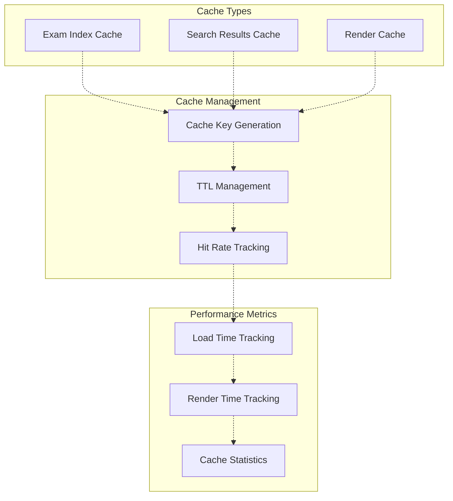
```mermaid
flowchart TD

ExamCache["Exam Index Cache"]
SearchCache["Search Results Cache"]
RenderCache["Render Cache"]
CacheKey["Cache Key Generation"]
TTLManager["TTL Management"]
HitRateTracking["Hit Rate Tracking"]
LoadTime["Load Time Tracking"]
RenderTime["Render Time Tracking"]
CacheStats["Cache Statistics"]

ExamCache -.-> CacheKey
SearchCache -.-> CacheKey
RenderCache -.-> CacheKey
HitRateTracking -.-> LoadTime

subgraph subGraph2 ["Performance Metrics"]
    LoadTime
    RenderTime
    CacheStats
    LoadTime -.-> RenderTime
    RenderTime -.-> CacheStats
end

subgraph subGraph1 ["Cache Management"]
    CacheKey
    TTLManager
    HitRateTracking
    CacheKey -.-> TTLManager
    TTLManager -.-> HitRateTracking
end

subgraph subGraph0 ["Cache Types"]
    ExamCache
    SearchCache
    RenderCache
end
```

**Sources:** [improved-working-system.html L1162-L1172](https://github.com/sallowayma-git/IELTS-practice/blob/92f64eb8/improved-working-system.html#L1162-L1172)

 [improved-working-system.html L1432-L1441](https://github.com/sallowayma-git/IELTS-practice/blob/92f64eb8/improved-working-system.html#L1432-L1441)

### Data Loading Optimization

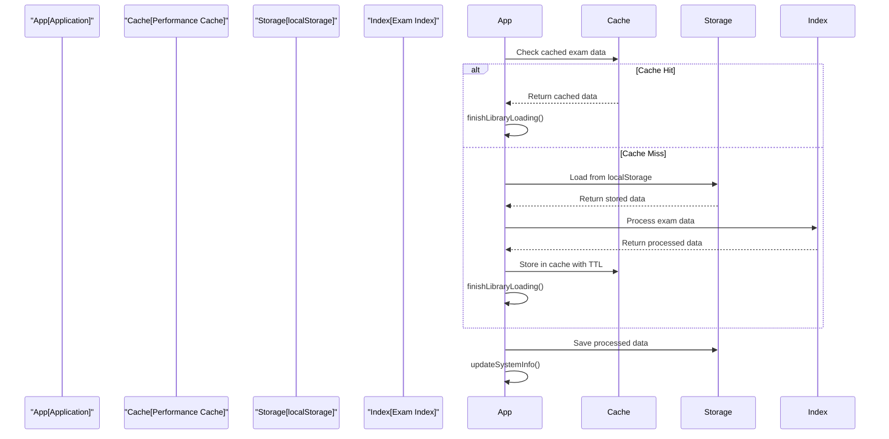
```mermaid
sequenceDiagram
  participant p1 as "App[Application]"
  participant p2 as "Cache[Performance Cache]"
  participant p3 as "Storage[localStorage]"
  participant p4 as "Index[Exam Index]"
  participant p5 as App
  participant p6 as Cache
  participant p7 as Storage
  participant p8 as Index

  p5->>p6: Check cached exam data
  alt Cache Hit
    p6-->>p5: Return cached data
    p5->>p5: finishLibraryLoading()
  else Cache Miss
    p5->>p7: Load from localStorage
    p7-->>p5: Return stored data
    p5->>p8: Process exam data
    p8-->>p5: Return processed data
    p5->>p6: Store in cache with TTL
    p5->>p5: finishLibraryLoading()
  end
  p5->>p7: Save processed data
  p5->>p5: updateSystemInfo()
```

**Sources:** [improved-working-system.html L1159-L1232](https://github.com/sallowayma-git/IELTS-practice/blob/92f64eb8/improved-working-system.html#L1159-L1232)

 [improved-working-system.html L1236-L1276](https://github.com/sallowayma-git/IELTS-practice/blob/92f64eb8/improved-working-system.html#L1236-L1276)

## Data Import and Export

### Export Functionality

The system provides comprehensive data export capabilities:

```mermaid
flowchart TD

PracticeExport["Practice Data Export"]
SystemExport["Complete System Export"]
BackupExport["Backup Export"]
DataCollection["Collect Data"]
Serialization["JSON Serialization"]
FileGeneration["Generate Download"]
Metadata["Export Metadata"]
Statistics["Practice Statistics"]
Records["Practice Records"]
SystemState["System State"]

PracticeExport -.-> DataCollection
SystemExport -.-> DataCollection
BackupExport -.-> DataCollection
FileGeneration -.-> Metadata
FileGeneration -.-> Statistics
FileGeneration -.-> Records
FileGeneration -.-> SystemState

subgraph subGraph2 ["Export Format"]
    Metadata
    Statistics
    Records
    SystemState
end

subgraph subGraph1 ["Export Process"]
    DataCollection
    Serialization
    FileGeneration
    DataCollection -.-> Serialization
    Serialization -.-> FileGeneration
end

subgraph subGraph0 ["Export Types"]
    PracticeExport
    SystemExport
    BackupExport
end
```

**Sources:** [improved-working-system.html L2489-L2513](https://github.com/sallowayma-git/IELTS-practice/blob/92f64eb8/improved-working-system.html#L2489-L2513)

 [improved-working-system.html L2027-L2041](https://github.com/sallowayma-git/IELTS-practice/blob/92f64eb8/improved-working-system.html#L2027-L2041)

### Import and Validation

```mermaid
sequenceDiagram
  participant p1 as User
  participant p2 as "FileInput[File Input]"
  participant p3 as "Validator[Data Validator]"
  participant p4 as "Storage[Storage System]"
  participant p5 as "UI[User Interface]"
  participant p6 as FileInput
  participant p7 as Validator
  participant p8 as Storage
  participant p9 as UI

  p1->>p6: Select import file
  p6->>p7: Validate file format
  p7->>p7: Check data structure
  p7->>p7: Verify compatibility
  alt Valid Data
    p7->>p8: Import data
    p8->>p8: Backup existing data
    p8->>p8: Apply new data
    p8-->>p9: Success response
    p9-->>p1: Show success message
    p9->>p9: location.reload()
  else Invalid Data
    p7-->>p9: Error response
    p9-->>p1: Show error message
  end
```

**Sources:** [improved-working-system.html L2044-L2077](https://github.com/sallowayma-git/IELTS-practice/blob/92f64eb8/improved-working-system.html#L2044-L2077)