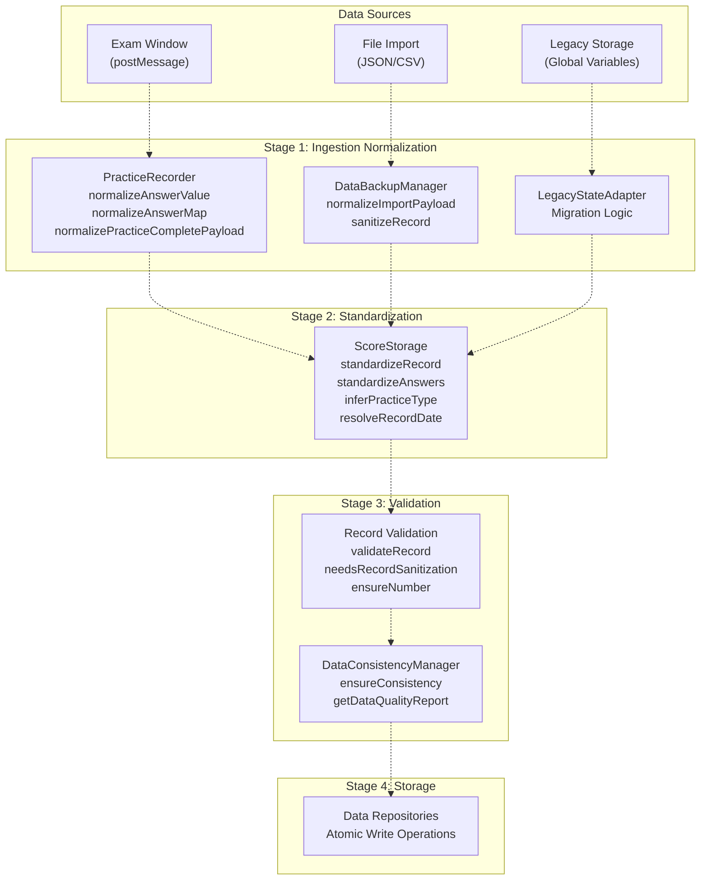
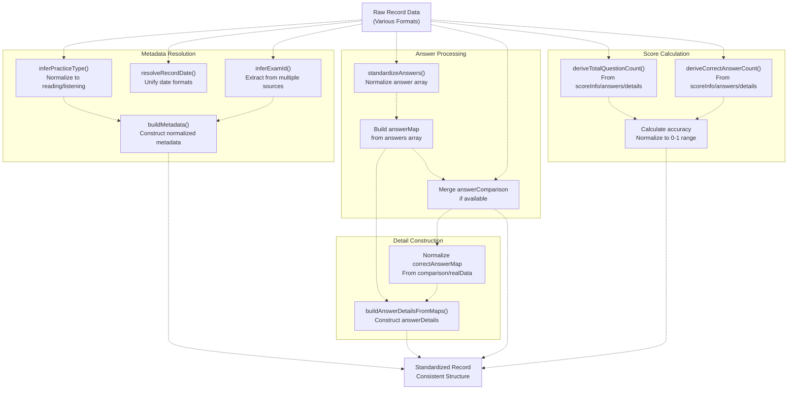
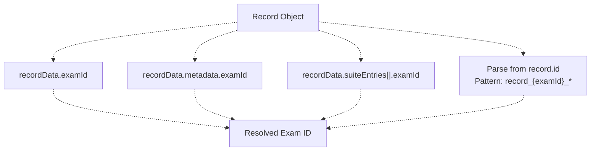
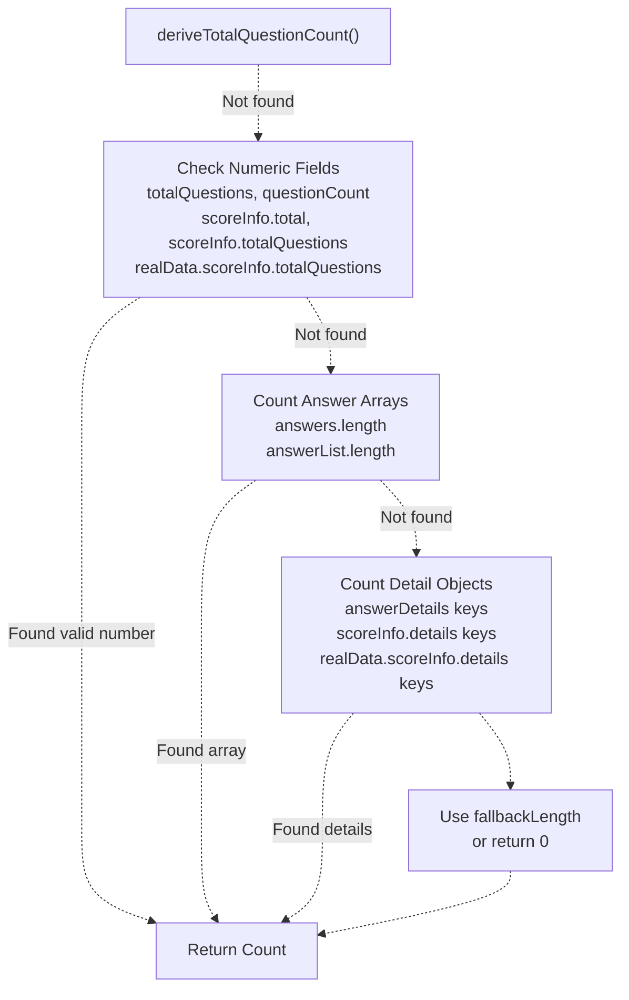
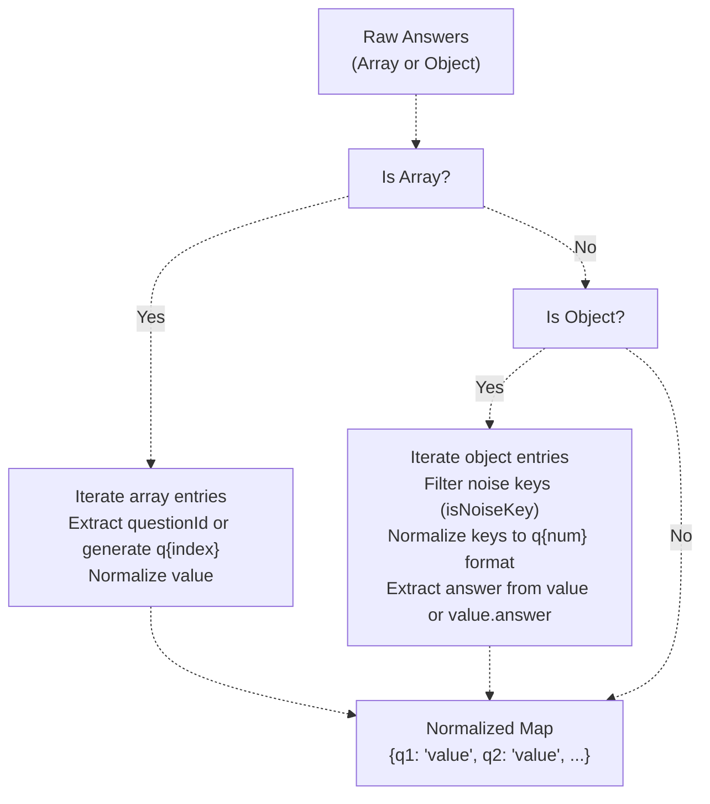
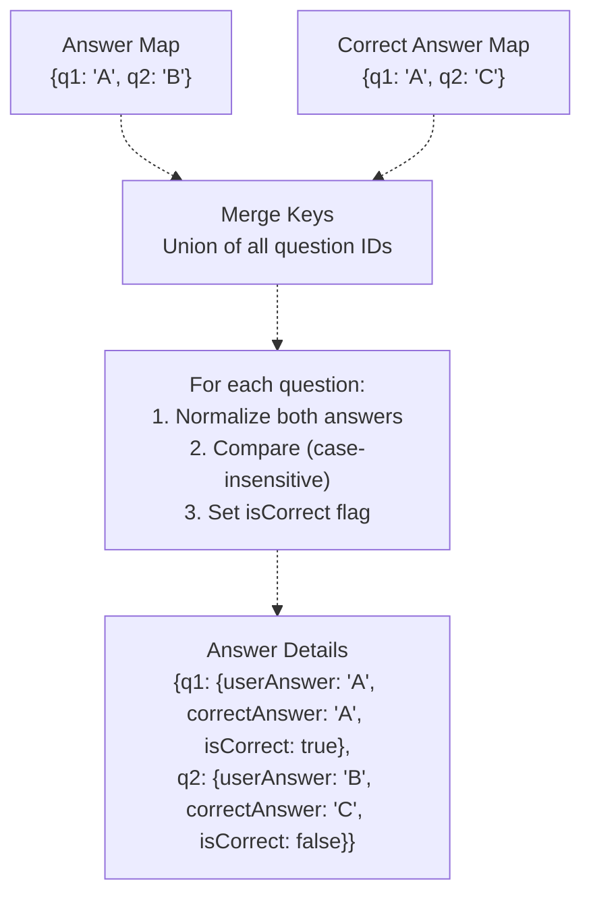
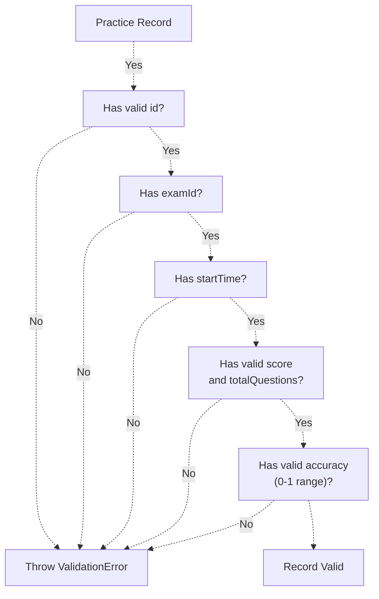
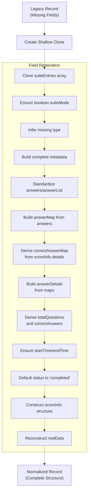
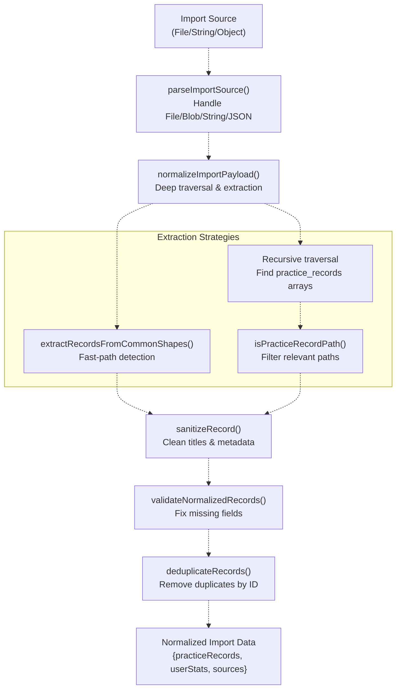
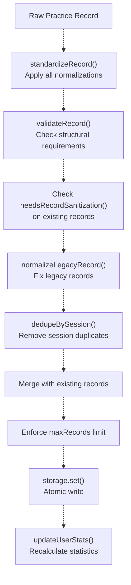

# Data Normalization & Quality Assurance

> **Relevant source files**
> * [js/app/lifecycleMixin.js](https://github.com/sallowayma-git/IELTS-practice/blob/92f64eb8/js/app/lifecycleMixin.js)
> * [js/components/DataIntegrityManager.js](https://github.com/sallowayma-git/IELTS-practice/blob/92f64eb8/js/components/DataIntegrityManager.js)
> * [js/components/practiceHistory.js](https://github.com/sallowayma-git/IELTS-practice/blob/92f64eb8/js/components/practiceHistory.js)
> * [js/components/practiceHistoryEnhancer.js](https://github.com/sallowayma-git/IELTS-practice/blob/92f64eb8/js/components/practiceHistoryEnhancer.js)
> * [js/components/practiceRecordModal.js](https://github.com/sallowayma-git/IELTS-practice/blob/92f64eb8/js/components/practiceRecordModal.js)
> * [js/core/practiceRecorder.js](https://github.com/sallowayma-git/IELTS-practice/blob/92f64eb8/js/core/practiceRecorder.js)
> * [js/core/scoreStorage.js](https://github.com/sallowayma-git/IELTS-practice/blob/92f64eb8/js/core/scoreStorage.js)
> * [js/data/dataSources/storageDataSource.js](https://github.com/sallowayma-git/IELTS-practice/blob/92f64eb8/js/data/dataSources/storageDataSource.js)
> * [js/data/index.js](https://github.com/sallowayma-git/IELTS-practice/blob/92f64eb8/js/data/index.js)
> * [js/script.js](https://github.com/sallowayma-git/IELTS-practice/blob/92f64eb8/js/script.js)
> * [js/utils/dataBackupManager.js](https://github.com/sallowayma-git/IELTS-practice/blob/92f64eb8/js/utils/dataBackupManager.js)
> * [js/utils/markdownExporter.js](https://github.com/sallowayma-git/IELTS-practice/blob/92f64eb8/js/utils/markdownExporter.js)
> * [js/utils/storage.js](https://github.com/sallowayma-git/IELTS-practice/blob/92f64eb8/js/utils/storage.js)

## Purpose and Scope

This document explains the comprehensive data normalization and quality assurance system that ensures consistency, validity, and compatibility of practice records throughout their lifecycle. The system handles data from multiple sources (exam windows, file imports, legacy storage), transforms it into a standardized format, validates it against defined rules, and maintains data quality during storage and retrieval operations.

For information about how normalized data is persisted, see [Storage Architecture & Multi-Backend System](/sallowayma-git/IELTS-practice/4.1-storage-architecture-and-multi-backend-system). For details on the practice session lifecycle that produces raw data, see [Practice Session Lifecycle & Management](/sallowayma-git/IELTS-practice/5.1-practice-session-lifecycle-and-management). For import/export operations that trigger normalization, see [Data Backup, Import & Export](/sallowayma-git/IELTS-practice/4.4-data-backup-import-and-export).

---

## Normalization Pipeline Overview

The system implements a multi-stage normalization pipeline that processes data at different points in its lifecycle:



**Diagram: Multi-Stage Data Normalization Pipeline**

The pipeline ensures that regardless of data source or format, all records are transformed into a consistent, validated structure before persistence.

**Sources:** [js/core/practiceRecorder.js L1-L1000](https://github.com/sallowayma-git/IELTS-practice/blob/92f64eb8/js/core/practiceRecorder.js#L1-L1000)

 [js/core/scoreStorage.js L1-L1500](https://github.com/sallowayma-git/IELTS-practice/blob/92f64eb8/js/core/scoreStorage.js#L1-L1500)

 [js/utils/dataBackupManager.js L1-L700](https://github.com/sallowayma-git/IELTS-practice/blob/92f64eb8/js/utils/dataBackupManager.js#L1-L700)

---

## Record Standardization

### ScoreStorage Standardization Entry Point

The `ScoreStorage` class provides the primary standardization logic through its `standardizeRecord()` method, which orchestrates multiple normalization operations:



**Diagram: ScoreStorage.standardizeRecord() Data Flow**

**Sources:** [js/core/scoreStorage.js L788-L933](https://github.com/sallowayma-git/IELTS-practice/blob/92f64eb8/js/core/scoreStorage.js#L788-L933)

### Field Normalization Methods

#### Practice Type Inference

The `normalizePracticeType()` and `inferPracticeType()` methods normalize practice type from various sources:

| Method | Input Examples | Output |
| --- | --- | --- |
| `normalizePracticeType()` | "Listen", "LISTENING", "listen" | "listening" |
|  | "Read", "READING", "read" | "reading" |
| `inferPracticeType()` | `recordData.type`, `metadata.examType` | "listening" or "reading" |
|  | `examId` containing "listening" | "listening" |
|  | fallback | "reading" |

**Sources:** [js/core/scoreStorage.js L49-L66](https://github.com/sallowayma-git/IELTS-practice/blob/92f64eb8/js/core/scoreStorage.js#L49-L66)

#### Date Resolution

The `resolveRecordDate()` method resolves dates from multiple candidate fields with fallback chain:

```
// Candidate priority order:
1. recordData.metadata?.date
2. recordData.date
3. recordData.endTime
4. recordData.completedAt
5. recordData.startTime
6. recordData.timestamp
7. Current ISO timestamp (fallback)
```

**Sources:** [js/core/scoreStorage.js L68-L86](https://github.com/sallowayma-git/IELTS-practice/blob/92f64eb8/js/core/scoreStorage.js#L68-L86)

#### Exam ID Inference

The `inferExamId()` method extracts exam IDs from multiple locations:



**Diagram: Exam ID Resolution Sources**

**Sources:** [js/core/scoreStorage.js L88-L112](https://github.com/sallowayma-git/IELTS-practice/blob/92f64eb8/js/core/scoreStorage.js#L88-L112)

#### Metadata Construction

The `buildMetadata()` method constructs complete metadata objects from partial data:

| Field | Source Priority | Fallback |
| --- | --- | --- |
| `examTitle` | `metadata.examTitle`, `metadata.title`, `recordData.title` | `examId` or "Unknown Exam" |
| `category` | `metadata.category`, `recordData.category` | "Unknown" |
| `frequency` | `metadata.frequency`, `recordData.frequency` | "unknown" |
| `type` | Passed parameter (normalized) | Required |
| `examType` | `metadata.examType` | `type` |

**Sources:** [js/core/scoreStorage.js L114-L128](https://github.com/sallowayma-git/IELTS-practice/blob/92f64eb8/js/core/scoreStorage.js#L114-L128)

### Numeric Field Normalization

The `ensureNumber()` method provides type coercion with fallback:

```javascript
ensureNumber(value, fallback = 0) {
    const num = Number(value);
    return Number.isFinite(num) ? num : fallback;
}
```

Used for: `score`, `totalQuestions`, `correctAnswers`, `accuracy`, `duration`

**Sources:** [js/core/scoreStorage.js L130-L133](https://github.com/sallowayma-git/IELTS-practice/blob/92f64eb8/js/core/scoreStorage.js#L130-L133)

### Question Count Derivation

The `deriveTotalQuestionCount()` method attempts multiple strategies to determine total questions:



**Diagram: Total Question Count Derivation Strategy**

**Sources:** [js/core/scoreStorage.js L135-L169](https://github.com/sallowayma-git/IELTS-practice/blob/92f64eb8/js/core/scoreStorage.js#L135-L169)

### Correct Answer Count Derivation

The `deriveCorrectAnswerCount()` method uses a similar multi-source strategy:

1. **Direct numeric fields**: `correctAnswers`, `correct`, `score`, `scoreInfo.correct`, etc.
2. **Boolean flags in objects**: Count entries where `correctAnswers[key].isCorrect === true`
3. **Computed from answer array**: Count `answers[]` where `correct === true` or `isCorrect === true`
4. **Detail object flags**: Count entries in `answerDetails` where `isCorrect === true`

**Sources:** [js/core/scoreStorage.js L171-L253](https://github.com/sallowayma-git/IELTS-practice/blob/92f64eb8/js/core/scoreStorage.js#L171-L253)

---

## Answer Normalization

### PracticeRecorder Answer Processing

The `PracticeRecorder` class handles answer normalization at the ingestion stage:

#### Value Normalization

The `normalizeAnswerValue()` method handles diverse input types:

| Input Type | Processing | Example Output |
| --- | --- | --- |
| `undefined`, `null` | Return empty string | `""` |
| String | Trim, filter `[object Object]` patterns | `"Paris"` |
| Number, Boolean | Convert to string | `"42"`, `"true"` |
| Array | Recursively normalize and join | `"A,B,C"` |
| Object | Extract from `.value`, `.label`, `.text`, `.answer`, `.content` | `"extracted value"` |

**Sources:** [js/core/practiceRecorder.js L483-L532](https://github.com/sallowayma-git/IELTS-practice/blob/92f64eb8/js/core/practiceRecorder.js#L483-L532)

#### Answer Map Normalization

The `normalizeAnswerMap()` method converts various answer formats into a consistent map structure:



**Diagram: Answer Map Normalization Flow**

**Sources:** [js/core/practiceRecorder.js L534-L559](https://github.com/sallowayma-git/IELTS-practice/blob/92f64eb8/js/core/practiceRecorder.js#L534-L559)

#### Noise Key Filtering

The `isNoiseKey()` method filters out non-question metadata:

**Filtered Patterns:**

* Audio controls: `playback-speed`, `volume-slider`, `audio-volume`, `audio-duration`
* Navigation: `nextexamid`, `previousexamid`, `sessionid`
* Configuration: `settings`, `config`, `metadata`, `practicesettings`
* Invalid question numbers: Numbers outside range 1-200

**Sources:** [js/core/practiceRecorder.js L561-L603](https://github.com/sallowayma-git/IELTS-practice/blob/92f64eb8/js/core/practiceRecorder.js#L561-L603)

### Answer Comparison Normalization

The `normalizeAnswerComparison()` method standardizes comparison structures:

```
// Input variations:
{
    q1: { userAnswer: "A", correctAnswer: "B", isCorrect: false },
    q2: { user: "C", correct: "C", isCorrect: true },
    q3: { answer: "D" }  // Missing correctAnswer
}

// Output (normalized):
{
    q1: { questionId: "q1", userAnswer: "A", correctAnswer: "B", isCorrect: false },
    q2: { questionId: "q2", userAnswer: "C", correctAnswer: "C", isCorrect: true },
    // q3 filtered out (no valid answers)
}
```

**Sources:** [js/core/practiceRecorder.js L656-L687](https://github.com/sallowayma-git/IELTS-practice/blob/92f64eb8/js/core/practiceRecorder.js#L656-L687)

### Answer Detail Construction

The `buildAnswerDetails()` method constructs detailed comparison structures:



**Diagram: Answer Detail Construction Process**

**Sources:** [js/core/practiceRecorder.js L733-L753](https://github.com/sallowayma-git/IELTS-practice/blob/92f64eb8/js/core/practiceRecorder.js#L733-L753)

---

## Data Validation Rules

### ScoreStorage Record Validation

The `validateRecord()` method in `ScoreStorage` enforces structural requirements:



**Diagram: Record Validation Flow**

**Validation Rules:**

| Field | Rule | Error Message |
| --- | --- | --- |
| `id` | Must be non-empty string | "Record must have a valid id" |
| `examId` | Must be non-empty string | "Record must have an examId" |
| `startTime` | Must be valid ISO date string | "Record must have a valid startTime" |
| `score` | Must be finite number ≥ 0 | "Record must have a valid score" |
| `totalQuestions` | Must be finite number ≥ 0 | "Record must have valid totalQuestions" |
| `accuracy` | Must be finite number 0 ≤ x ≤ 1 | "Record accuracy must be between 0 and 1" |

**Sources:** [js/core/scoreStorage.js L1413-L1479](https://github.com/sallowayma-git/IELTS-practice/blob/92f64eb8/js/core/scoreStorage.js#L1413-L1479)

### Type Validation

The `needsRecordSanitization()` method checks if a record requires normalization:

```javascript
needsRecordSanitization(record) {
    // Check structural integrity
    if (!record || typeof record !== 'object') return true;
    if (!record.type || !record.metadata || !record.metadata.type) return true;
    
    // Check numeric field types
    const numericFields = ['score', 'totalQuestions', 'correctAnswers', 'accuracy', 'duration'];
    return numericFields.some((field) => {
        if (!Object.prototype.hasOwnProperty.call(record, field)) return false;
        return typeof record[field] !== 'number' || Number.isNaN(record[field]);
    });
}
```

**Sources:** [js/core/scoreStorage.js L769-L783](https://github.com/sallowayma-git/IELTS-practice/blob/92f64eb8/js/core/scoreStorage.js#L769-L783)

### DataIntegrityManager Validation Rules

The `DataIntegrityManager` registers default validation rules for different data types:

**Practice Records Validation:**

| Rule Type | Fields | Validator |
| --- | --- | --- |
| Required | `id`, `startTime` | Must be present |
| Type Check | `id`, `startTime`, `endTime`, `examId`, `examTitle` | Must be string |
| Type Check | `duration` | Must be number |
| Type Check | `scoreInfo` | Must be object |
| Custom | `startTime`, `endTime`, `date` | Must be valid date (parseable) |
| Custom | `duration` | Must be number ≥ 0 |
| Custom | `id` | Must be non-empty string |

**Sources:** [js/components/DataIntegrityManager.js L162-L183](https://github.com/sallowayma-git/IELTS-practice/blob/92f64eb8/js/components/DataIntegrityManager.js#L162-L183)

---

## Legacy Data Handling

### Legacy Record Migration

The `normalizeLegacyRecord()` method in `ScoreStorage` handles historical data formats:



**Diagram: Legacy Record Normalization Pipeline**

**Key Fixes Applied:**

1. **Suite Mode Fields**: Clones `suiteEntries`, ensures `suiteMode` is boolean
2. **Type Inference**: Derives missing `type` and `metadata.type`
3. **Answer Normalization**: Standardizes `answers`/`answerList` to consistent format
4. **Map Construction**: Builds `answerMap` from answers, `correctAnswerMap` from details
5. **Detail Derivation**: Constructs `answerDetails` if missing from maps
6. **Numeric Derivation**: Derives `totalQuestions`, `correctAnswers`, `score`, `accuracy`
7. **Time Fields**: Ensures `startTime`/`endTime` have valid values
8. **Status Default**: Sets `status` to "completed" if missing
9. **Structure Completion**: Builds `scoreInfo` and `realData` structures

**Sources:** [js/core/scoreStorage.js L687-L767](https://github.com/sallowayma-git/IELTS-practice/blob/92f64eb8/js/core/scoreStorage.js#L687-L767)

### Suite Entry Standardization

The `standardizeSuiteEntries()` method normalizes suite practice entries:

```javascript
standardizeSuiteEntries(suiteEntries = []) {
    if (!Array.isArray(suiteEntries)) return [];
    
    return suiteEntries
        .map(entry => {
            if (!entry || typeof entry !== 'object') return null;
            
            return {
                examId: entry.examId || null,
                sessionId: entry.sessionId || null,
                startTime: entry.startTime || null,
                endTime: entry.endTime || null,
                duration: this.ensureNumber(entry.duration, 0),
                score: this.ensureNumber(entry.score, 0),
                totalQuestions: this.ensureNumber(entry.totalQuestions, 0),
                correctAnswers: this.ensureNumber(entry.correctAnswers, 0),
                accuracy: this.ensureNumber(entry.accuracy, 0),
                metadata: entry.metadata || {},
                answers: this.standardizeAnswers(entry.answers || []),
                // ... more fields
            };
        })
        .filter(Boolean);
}
```

**Sources:** [js/core/scoreStorage.js L1095-L1166](https://github.com/sallowayma-git/IELTS-practice/blob/92f64eb8/js/core/scoreStorage.js#L1095-L1166)

---

## Import Data Normalization

### DataBackupManager Import Pipeline

The `DataBackupManager` provides comprehensive import data normalization:



**Diagram: Import Data Normalization Pipeline**

**Sources:** [js/utils/dataBackupManager.js L221-L327](https://github.com/sallowayma-git/IELTS-practice/blob/92f64eb8/js/utils/dataBackupManager.js#L221-L327)

 [js/utils/dataBackupManager.js L329-L491](https://github.com/sallowayma-git/IELTS-practice/blob/92f64eb8/js/utils/dataBackupManager.js#L329-L491)

### Common Import Shapes Detection

The `extractRecordsFromCommonShapes()` method provides fast-path extraction for known formats:

**Recognized Structures:**

1. **Direct array**: `[{id: 'record_1', ...}, ...]`
2. **Wrapped array**: `{ practiceRecords: [...] }`
3. **Export format**: `{ exportInfo: {...}, practiceRecords: [...] }`
4. **Namespaced**: `{ exam_system_practice_records: { data: [...] } }`
5. **Data wrapper**: `{ data: { practice_records: [...] } }`
6. **Legacy globals**: `{ myMelodyPracticeRecords: [...] }`

**Sources:** [js/utils/dataBackupManager.js L557-L618](https://github.com/sallowayma-git/IELTS-practice/blob/92f64eb8/js/utils/dataBackupManager.js#L557-L618)

### Path-Based Record Detection

The `isPracticeRecordPath()` method identifies practice record arrays by path:

```javascript
isPracticeRecordPath(pathString) {
    if (!pathString) return false;
    
    const normalized = pathString.toLowerCase();
    return (
        normalized.includes('practice_records') ||
        normalized.includes('practicerecords') ||
        normalized.includes('exam_system_practice_records') ||
        normalized.includes('mymelodypracticerecords') ||
        normalized.includes('my_melody_practice_records')
    );
}
```

**Sources:** [js/utils/dataBackupManager.js L493-L506](https://github.com/sallowayma-git/IELTS-practice/blob/92f64eb8/js/utils/dataBackupManager.js#L493-L506)

### Record Sanitization

The `sanitizeRecord()` method cleans up record metadata:

**Title Sanitization:**

```javascript
sanitizeExamTitle(title) {
    // Remove verbose prefixes like "IELTS Listening Practice - Part 4 : "
    const pattern = /ielts\s+listening\s+practice\s*-\s*part\s*\d+\s*[:\-]?\s*(.+)$/i;
    const match = str.match(pattern);
    if (match && match[1]) return match[1].trim();
    
    // Extract last segment from " - " delimited titles
    if (str.includes(' - ')) {
        const segments = str.split(' - ').map(s => s.trim()).filter(Boolean);
        if (segments.length > 1) return segments[segments.length - 1];
    }
    
    return str;
}
```

Applied to: `metadata.examTitle`, `metadata.title`, `record.title`, `record.examTitle`

**Sources:** [js/utils/dataBackupManager.js L21-L57](https://github.com/sallowayma-git/IELTS-practice/blob/92f64eb8/js/utils/dataBackupManager.js#L21-L57)

### Import Validation

The `validateNormalizedRecords()` method fixes common issues in imported data:

| Issue | Fix Applied |
| --- | --- |
| Missing `id` | Generate: `imported_{date}_{random}` |
| Missing `examId` | Set to: `"imported_ielts"` |
| Invalid `startTime` | Set to current timestamp |
| Invalid `endTime` | Set to current timestamp |
| Non-numeric `duration` | Set to `0` |
| Non-numeric `score`, `totalQuestions`, `correctAnswers`, `accuracy` | Set to `0` |
| Invalid `date` | Parse from `startTime` or set to current |
| Missing `status` | Set to `"completed"` |
| Missing `createdAt` | Set to current timestamp |
| Non-array `answers` | Convert to empty array |

**Sources:** [js/utils/dataBackupManager.js L508-L600](https://github.com/sallowayma-git/IELTS-practice/blob/92f64eb8/js/utils/dataBackupManager.js#L508-L600)

---

## Consistency Checks

### DataConsistencyManager

The `DataConsistencyManager` (referenced but not fully detailed in provided files) provides consistency validation:

**Usage in Components:**

```javascript
// In PracticeRecordModal
if (window.DataConsistencyManager) {
    const manager = new DataConsistencyManager();
    processedRecord = manager.ensureConsistency(record);
}

// In MarkdownExporter
if (window.DataConsistencyManager) {
    const manager = new DataConsistencyManager();
    const qualityReport = manager.getDataQualityReport(practiceRecords);
    practiceRecords = practiceRecords.map(r => manager.ensureConsistency(r));
}
```

**Sources:** [js/components/practiceRecordModal.js L16-L19](https://github.com/sallowayma-git/IELTS-practice/blob/92f64eb8/js/components/practiceRecordModal.js#L16-L19)

 [js/utils/markdownExporter.js L225-L238](https://github.com/sallowayma-git/IELTS-practice/blob/92f64eb8/js/utils/markdownExporter.js#L225-L238)

### Pre-Save Validation

`ScoreStorage.savePracticeRecord()` performs multi-stage validation before persistence:



**Diagram: Pre-Save Validation & Normalization Flow**

**Sources:** [js/core/scoreStorage.js L571-L685](https://github.com/sallowayma-git/IELTS-practice/blob/92f64eb8/js/core/scoreStorage.js#L571-L685)

### Session Deduplication

The system prevents duplicate records for the same practice session:

```javascript
// Extract session ID from multiple locations
const extractSessionId = (record) => {
    return record.sessionId 
        || record.realData?.sessionId 
        || record.metadata?.sessionId 
        || null;
};

// Remove duplicates keeping the latest
const dedupeBySession = (list) => {
    const seen = new Set();
    return list.filter(item => {
        const sessionId = extractSessionId(item);
        if (!sessionId) return true; // Keep records without session ID
        if (seen.has(sessionId)) {
            console.warn(`Removed duplicate record (sessionId=${sessionId})`);
            return false;
        }
        seen.add(sessionId);
        return true;
    });
};
```

Applied at multiple stages: initial load, pre-save, post-insert.

**Sources:** [js/core/scoreStorage.js L584-L662](https://github.com/sallowayma-git/IELTS-practice/blob/92f64eb8/js/core/scoreStorage.js#L584-L662)

---

## Summary

The data normalization and quality assurance system ensures data integrity through:

1. **Multi-Stage Pipeline**: Ingestion → Standardization → Validation → Persistence
2. **Source Flexibility**: Handles exam windows, file imports, legacy storage uniformly
3. **Comprehensive Normalization**: Type inference, date resolution, metadata construction, answer formatting
4. **Robust Validation**: Structural checks, type enforcement, range validation
5. **Legacy Support**: Automatic migration of historical data formats
6. **Import Resilience**: Deep traversal, format detection, field repair
7. **Consistency Enforcement**: Session deduplication, pre-save validation, consistency checks

The system maintains a balance between strict validation (rejecting invalid data) and repair (fixing recoverable issues), ensuring both data quality and maximum data preservation.