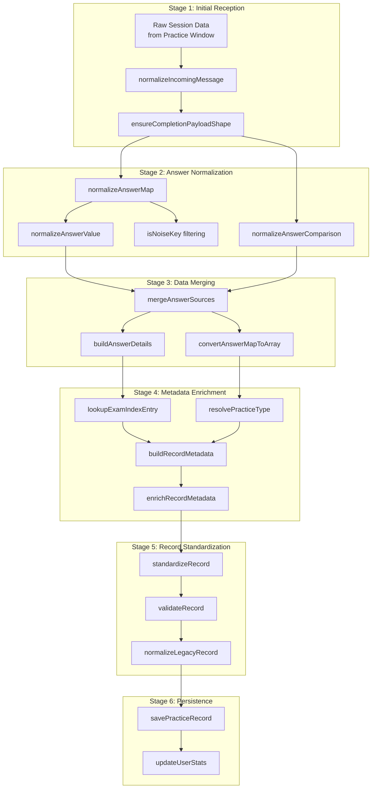
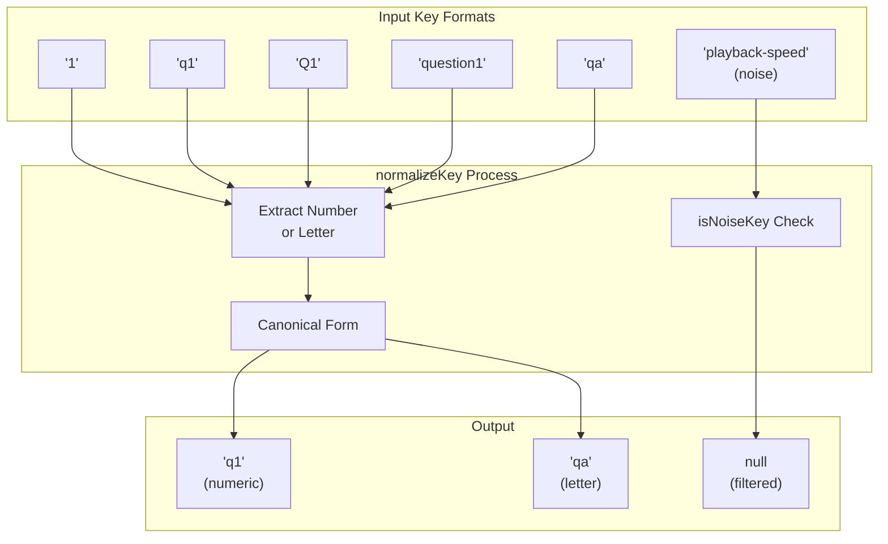
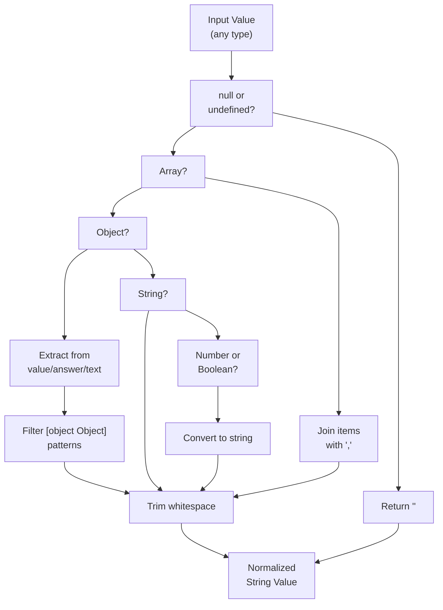
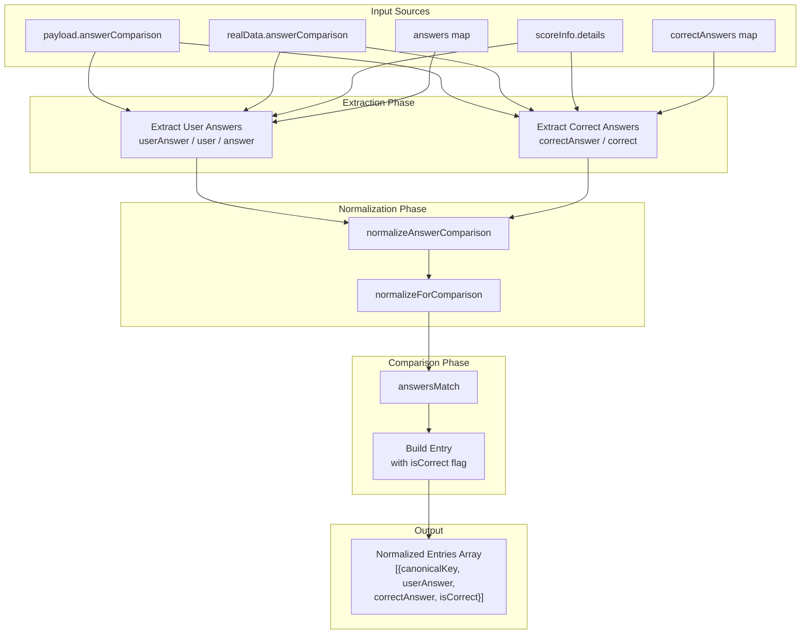
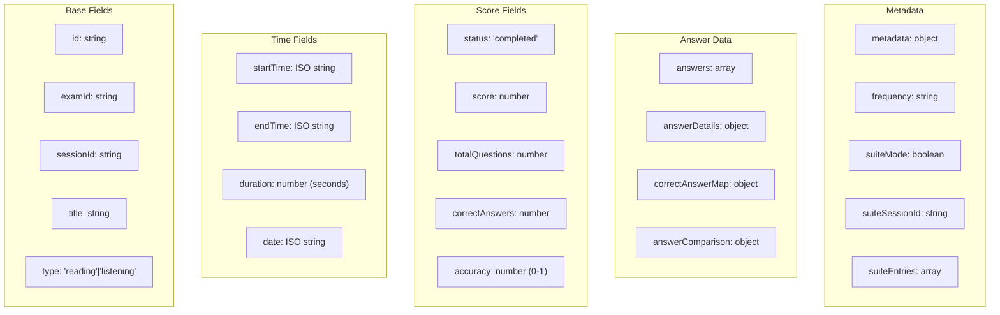
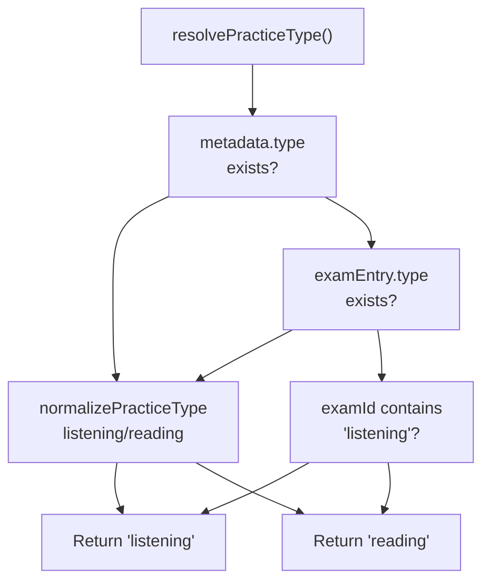
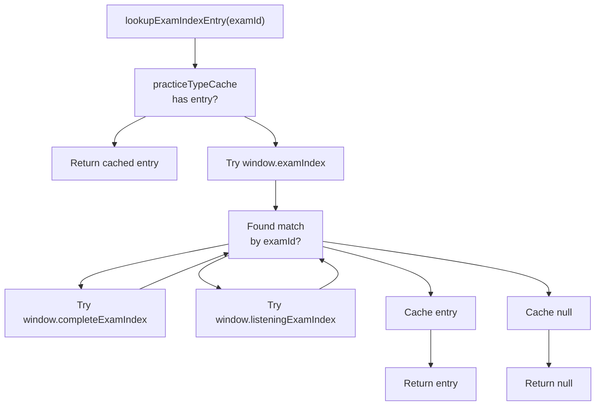
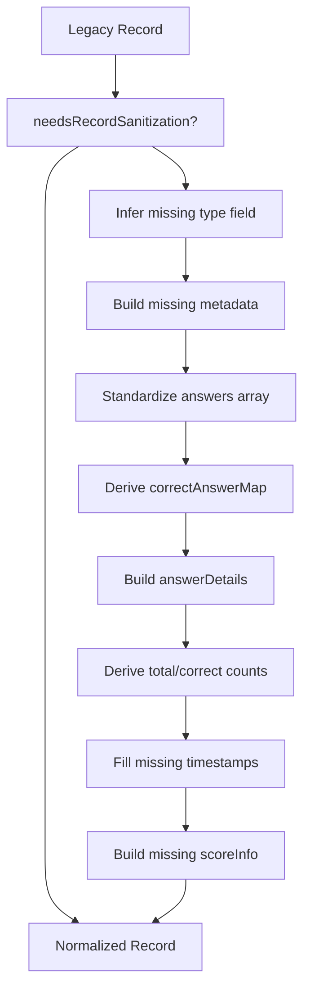
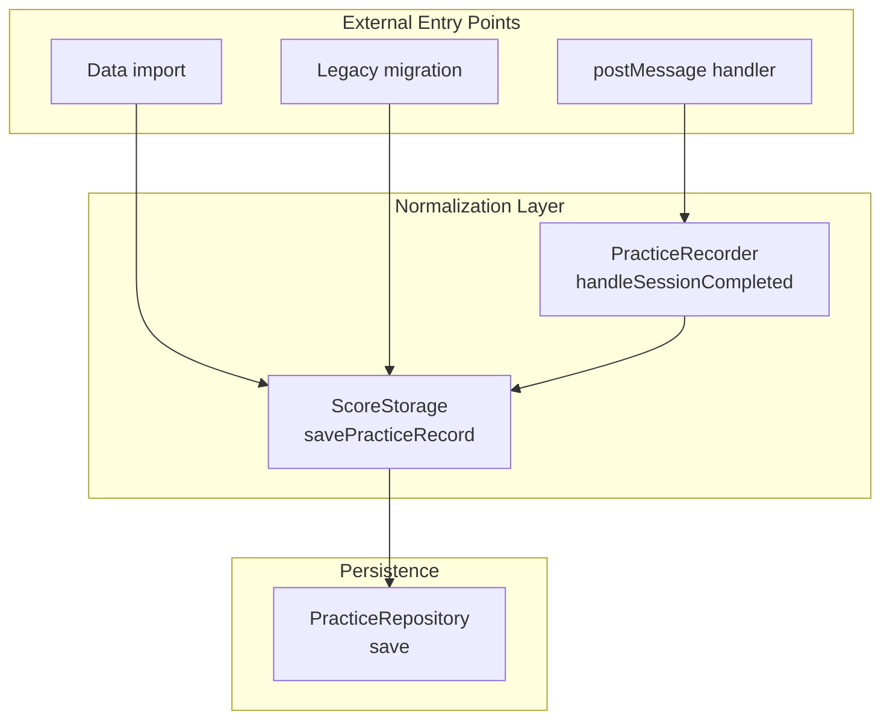

# Data Normalization & Quality

> **Relevant source files**
> * [js/components/practiceHistory.js](https://github.com/sallowayma-git/IELTS-practice/blob/68771116/js/components/practiceHistory.js)
> * [js/components/practiceHistoryEnhancer.js](https://github.com/sallowayma-git/IELTS-practice/blob/68771116/js/components/practiceHistoryEnhancer.js)
> * [js/components/practiceRecordModal.js](https://github.com/sallowayma-git/IELTS-practice/blob/68771116/js/components/practiceRecordModal.js)
> * [js/core/practiceRecorder.js](https://github.com/sallowayma-git/IELTS-practice/blob/68771116/js/core/practiceRecorder.js)
> * [js/core/scoreStorage.js](https://github.com/sallowayma-git/IELTS-practice/blob/68771116/js/core/scoreStorage.js)
> * [js/utils/answerComparisonUtils.js](https://github.com/sallowayma-git/IELTS-practice/blob/68771116/js/utils/answerComparisonUtils.js)
> * [js/utils/logger.js](https://github.com/sallowayma-git/IELTS-practice/blob/68771116/js/utils/logger.js)

## Purpose and Scope

This document describes the data normalization and quality assurance systems that ensure practice session data is consistent, accurate, and usable throughout the IELTS practice application. The normalization pipeline processes incoming data from various sources (practice pages, legacy systems, imports) and transforms it into a standardized format.

For information about how normalized data is persisted, see [Storage Architecture & Repositories](/sallowayma-git/IELTS-practice/4.1-storage-architecture-and-repositories). For details on the practice recording workflow that generates this data, see [PracticeRecorder & ScoreStorage](/sallowayma-git/IELTS-practice/5.1-practicerecorder-and-scorestorage).

The normalization system addresses several challenges:

* **Multiple data sources**: Practice pages, suite modes, legacy systems, and imports all produce different data formats
* **Schema evolution**: Older records lack fields present in newer ones
* **User input variations**: Answers may be strings, arrays, objects, or null values
* **Metadata gaps**: Exam titles, categories, and frequencies may be missing or incorrect
* **Noise and artifacts**: Data contains UI state keys (playback speed, volume settings) that must be filtered

---

## The Normalization Pipeline

The normalization process consists of multiple stages that progressively clean, validate, and enrich incoming data.



**Sources**: [js/core/practiceRecorder.js L265-L1060](https://github.com/sallowayma-git/IELTS-practice/blob/68771116/js/core/practiceRecorder.js#L265-L1060)

 [js/core/scoreStorage.js L424-L487](https://github.com/sallowayma-git/IELTS-practice/blob/68771116/js/core/scoreStorage.js#L424-L487)

 [js/utils/answerComparisonUtils.js L346-L490](https://github.com/sallowayma-git/IELTS-practice/blob/68771116/js/utils/answerComparisonUtils.js#L346-L490)

---

## Answer Data Normalization

Answer data arrives in highly inconsistent formats and must be normalized before storage and display.

### Answer Key Normalization

Question identifiers (keys) arrive in various formats that must be canonicalized:



The `normalizeKey` function extracts question numbers and produces canonical keys:

| Input | Canonical Key | Question Number | Notes |
| --- | --- | --- | --- |
| `"1"` | `"q1"` | `1` | Simple number |
| `"q1"` | `"q1"` | `1` | Already canonical |
| `"question1"` | `"q1"` | `1` | Verbose format |
| `"qa"` | `"qa"` | `null` | Letter-based question |
| `"q201"` | `null` | `null` | Out of range (max 200) |
| `"playback-speed"` | `null` | `null` | Noise key |

**Sources**: [js/utils/answerComparisonUtils.js L62-L123](https://github.com/sallowayma-git/IELTS-practice/blob/68771116/js/utils/answerComparisonUtils.js#L62-L123)

 [js/core/practiceRecorder.js L556-L598](https://github.com/sallowayma-git/IELTS-practice/blob/68771116/js/core/practiceRecorder.js#L556-L598)

### Answer Value Normalization

Answer values must be extracted from various container types and sanitized:



Key normalization rules:

* **Null/undefined** → empty string
* **Arrays** → comma-separated values
* **Objects** → extract from `value`, `answer`, `text`, or `content` fields
* **Invalid object strings** → filtered (e.g., `"[object Object]"`)
* **Primitives** → converted to trimmed strings

**Sources**: [js/core/practiceRecorder.js L478-L527](https://github.com/sallowayma-git/IELTS-practice/blob/68771116/js/core/practiceRecorder.js#L478-L527)

 [js/utils/answerComparisonUtils.js L125-L198](https://github.com/sallowayma-git/IELTS-practice/blob/68771116/js/utils/answerComparisonUtils.js#L125-L198)

### Noise Key Filtering

Noise keys (UI state, configuration) are systematically removed:

```

```

**Sources**: [js/core/practiceRecorder.js L556-L598](https://github.com/sallowayma-git/IELTS-practice/blob/68771116/js/core/practiceRecorder.js#L556-L598)

 [js/utils/answerComparisonUtils.js L101-L123](https://github.com/sallowayma-git/IELTS-practice/blob/68771116/js/utils/answerComparisonUtils.js#L101-L123)

---

## Answer Comparison Normalization

The `answerComparison` structure merges user answers and correct answers with correctness flags.

### Comparison Data Flow



### Answer Matching Logic

The `answersMatch` function performs case-insensitive comparison with special handling:

```

```

**Sources**: [js/utils/answerComparisonUtils.js L180-L198](https://github.com/sallowayma-git/IELTS-practice/blob/68771116/js/utils/answerComparisonUtils.js#L180-L198)

 [js/utils/answerComparisonUtils.js L44-L60](https://github.com/sallowayma-git/IELTS-practice/blob/68771116/js/utils/answerComparisonUtils.js#L44-L60)

 [js/core/practiceRecorder.js L651-L682](https://github.com/sallowayma-git/IELTS-practice/blob/68771116/js/core/practiceRecorder.js#L651-L682)

---

## Practice Record Standardization

Practice records undergo multi-stage standardization to ensure consistent structure.

### Record Structure

The standardized record schema:



**Sources**: [js/core/scoreStorage.js L591-L707](https://github.com/sallowayma-git/IELTS-practice/blob/68771116/js/core/scoreStorage.js#L591-L707)

 [js/core/practiceRecorder.js L990-L1026](https://github.com/sallowayma-git/IELTS-practice/blob/68771116/js/core/practiceRecorder.js#L990-L1026)

### Field Resolution Strategy

The system uses fallback chains to resolve missing fields:

| Field | Resolution Order | Fallback |
| --- | --- | --- |
| `totalQuestions` | `recordData.totalQuestions` → `scoreInfo.total` → `answers.length` → `0` |  |
| `correctAnswers` | `recordData.correctAnswers` → `scoreInfo.correct` → count from `answerDetails` → `0` |  |
| `date` | `metadata.date` → `date` → `endTime` → `startTime` → `now` |  |
| `type` | `metadata.type` → `examType` → infer from `examId` → `'reading'` |  |
| `examTitle` | `metadata.examTitle` → `title` → exam index lookup → `examId` |  |

**Sources**: [js/core/scoreStorage.js L86-L187](https://github.com/sallowayma-git/IELTS-practice/blob/68771116/js/core/scoreStorage.js#L86-L187)

 [js/core/practiceRecorder.js L96-L105](https://github.com/sallowayma-git/IELTS-practice/blob/68771116/js/core/practiceRecorder.js#L96-L105)

### Type Inference

Practice type is resolved through multiple strategies:



**Sources**: [js/core/practiceRecorder.js L71-L94](https://github.com/sallowayma-git/IELTS-practice/blob/68771116/js/core/practiceRecorder.js#L71-L94)

 [js/core/scoreStorage.js L26-L43](https://github.com/sallowayma-git/IELTS-practice/blob/68771116/js/core/scoreStorage.js#L26-L43)

---

## Metadata Enrichment

Metadata enrichment resolves missing information by looking up exam entries in global indexes.

### Exam Index Lookup



The system searches multiple exam index arrays in sequence:

1. `window.examIndex` - primary reading exams
2. `window.completeExamIndex` - full exam collection
3. `window.listeningExamIndex` - listening exams

Each entry contains `id`, `title`, `category`, `frequency`, and `type` fields used for enrichment.

**Sources**: [js/core/practiceRecorder.js L41-L69](https://github.com/sallowayma-git/IELTS-practice/blob/68771116/js/core/practiceRecorder.js#L41-L69)

 [js/utils/answerComparisonUtils.js L529-L661](https://github.com/sallowayma-git/IELTS-practice/blob/68771116/js/utils/answerComparisonUtils.js#L529-L661)

### Metadata Building

The `buildRecordMetadata` function constructs complete metadata:

```

```

**Sources**: [js/core/practiceRecorder.js L184-L199](https://github.com/sallowayma-git/IELTS-practice/blob/68771116/js/core/practiceRecorder.js#L184-L199)

 [js/core/scoreStorage.js L65-L79](https://github.com/sallowayma-git/IELTS-practice/blob/68771116/js/core/scoreStorage.js#L65-L79)

### Enhanced Metadata from AnswerComparisonUtils

The `enrichRecordMetadata` function in `answerComparisonUtils.js` provides additional enrichment:

* **ID matching**: Exact and fuzzy matching against exam indexes
* **URL path matching**: Matches exam paths from full database URLs
* **Title matching**: Exact and fuzzy title comparison with tag removal
* **Category inference**: Extracts P1/P2/P3 from IDs and titles

**Sources**: [js/utils/answerComparisonUtils.js L550-L757](https://github.com/sallowayma-git/IELTS-practice/blob/68771116/js/utils/answerComparisonUtils.js#L550-L757)

---

## Data Quality Assurance

### Legacy Record Repair

The `normalizeLegacyRecord` function repairs older records with missing or malformed data:



The repair process:

1. **Type inference**: Uses `inferPracticeType` to determine reading vs listening
2. **Metadata construction**: Calls `buildMetadata` to create complete metadata
3. **Answer standardization**: Converts various answer formats to standard array
4. **Correct answer derivation**: Extracts from `scoreInfo.details` or `answerDetails`
5. **Count derivation**: Uses `deriveTotalQuestionCount` and `deriveCorrectAnswerCount`
6. **Timestamp filling**: Ensures `startTime` and `endTime` are present
7. **ScoreInfo reconstruction**: Rebuilds missing `scoreInfo` structure

**Sources**: [js/core/scoreStorage.js L489-L570](https://github.com/sallowayma-git/IELTS-practice/blob/68771116/js/core/scoreStorage.js#L489-L570)

 [js/core/scoreStorage.js L572-L586](https://github.com/sallowayma-git/IELTS-practice/blob/68771116/js/core/scoreStorage.js#L572-L586)

### Validation Rules

The `validateRecord` function enforces data integrity constraints:

```

```

**Sources**: [js/core/scoreStorage.js L847-L893](https://github.com/sallowayma-git/IELTS-practice/blob/68771116/js/core/scoreStorage.js#L847-L893)

### Deduplication Strategy

The system prevents duplicate records using multiple ID checks:

```

```

**Sources**: [js/core/scoreStorage.js L434-L458](https://github.com/sallowayma-git/IELTS-practice/blob/68771116/js/core/scoreStorage.js#L434-L458)

---

## Implementation Reference

### Core Classes and Methods

| Class | Key Methods | Purpose |
| --- | --- | --- |
| `PracticeRecorder` | `normalizeAnswerMap``normalizeAnswerValue``normalizeAnswerComparison``buildAnswerDetails``resolvePracticeType``buildRecordMetadata` | Primary normalization engine for incoming session data |
| `ScoreStorage` | `standardizeRecord``normalizeLegacyRecord``validateRecord``inferPracticeType``deriveTotalQuestionCount``deriveCorrectAnswerCount` | Storage-layer standardization and validation |
| `AnswerComparisonUtils` | `getNormalizedEntries``normalizeKey``normalizeForComparison``enrichRecordMetadata``answersMatch` | Cross-source answer comparison normalization |
| `DataConsistencyManager` | `ensureConsistency` | High-level consistency enforcement wrapper |

**Sources**: [js/core/practiceRecorder.js L1-L1060](https://github.com/sallowayma-git/IELTS-practice/blob/68771116/js/core/practiceRecorder.js#L1-L1060)

 [js/core/scoreStorage.js L1-L1000](https://github.com/sallowayma-git/IELTS-practice/blob/68771116/js/core/scoreStorage.js#L1-L1000)

 [js/utils/answerComparisonUtils.js L1-L783](https://github.com/sallowayma-git/IELTS-practice/blob/68771116/js/utils/answerComparisonUtils.js#L1-L783)

### Normalization Entry Points



**Sources**: [js/core/practiceRecorder.js L866-L1060](https://github.com/sallowayma-git/IELTS-practice/blob/68771116/js/core/practiceRecorder.js#L866-L1060)

 [js/core/scoreStorage.js L424-L487](https://github.com/sallowayma-git/IELTS-practice/blob/68771116/js/core/scoreStorage.js#L424-L487)

### Fallback Mechanisms

The system implements defensive programming with fallback chains:

```

```

**Sources**: [js/core/practiceRecorder.js L959-L975](https://github.com/sallowayma-git/IELTS-practice/blob/68771116/js/core/practiceRecorder.js#L959-L975)

 [js/core/scoreStorage.js L65-L79](https://github.com/sallowayma-git/IELTS-practice/blob/68771116/js/core/scoreStorage.js#L65-L79)

---

## Quality Metrics

The normalization system provides several quality indicators:

### Completeness Metrics

```

```

### Data Source Tracking

Records track their data sources for debugging:

```

```

**Sources**: [js/core/practiceRecorder.js L1013-L1021](https://github.com/sallowayma-git/IELTS-practice/blob/68771116/js/core/practiceRecorder.js#L1013-L1021)

 [js/core/scoreStorage.js L688-L699](https://github.com/sallowayma-git/IELTS-practice/blob/68771116/js/core/scoreStorage.js#L688-L699)