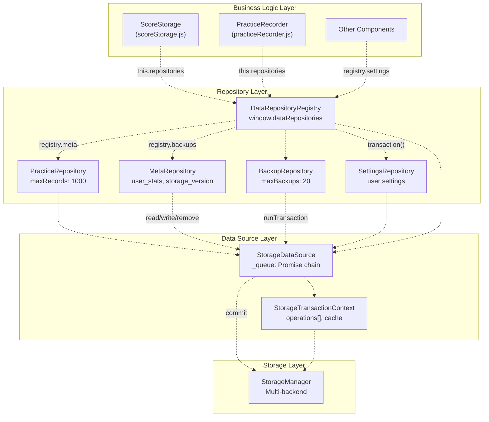
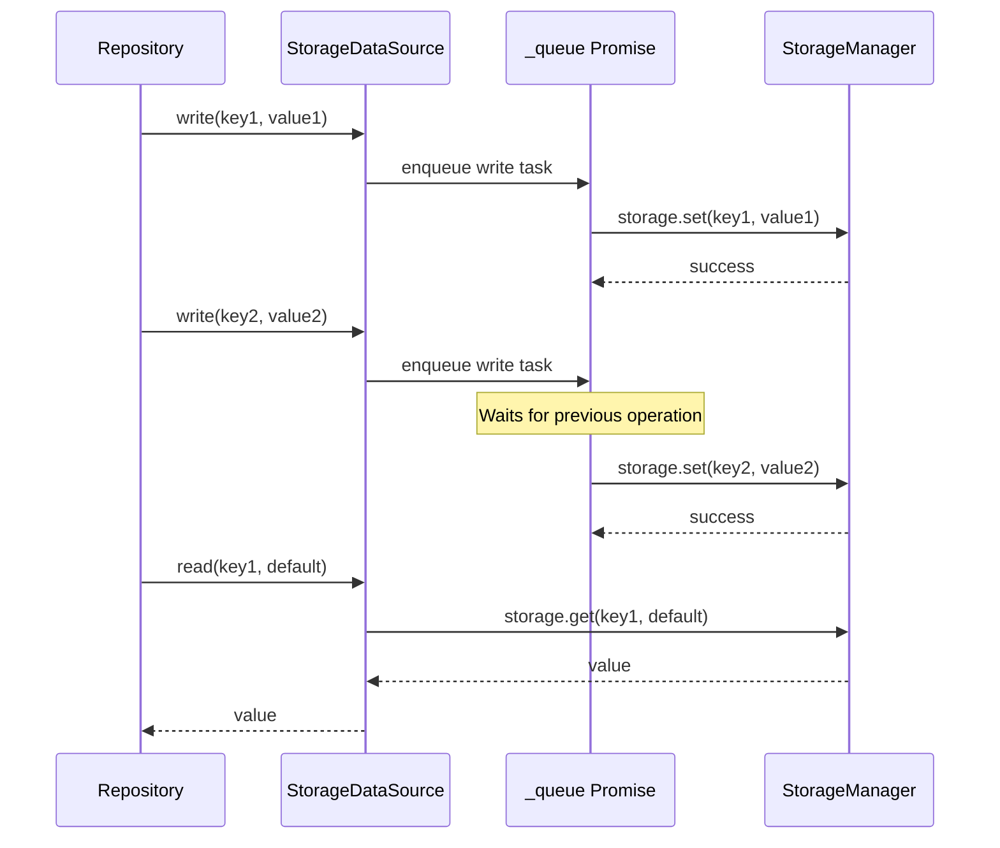
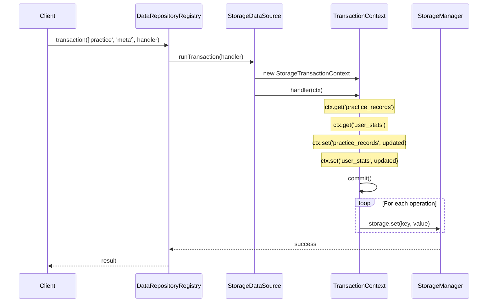
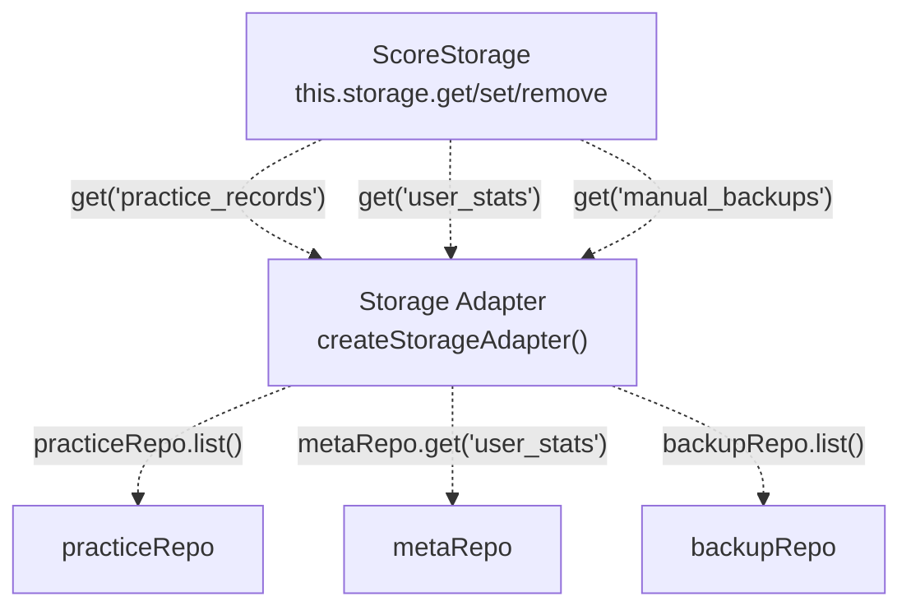
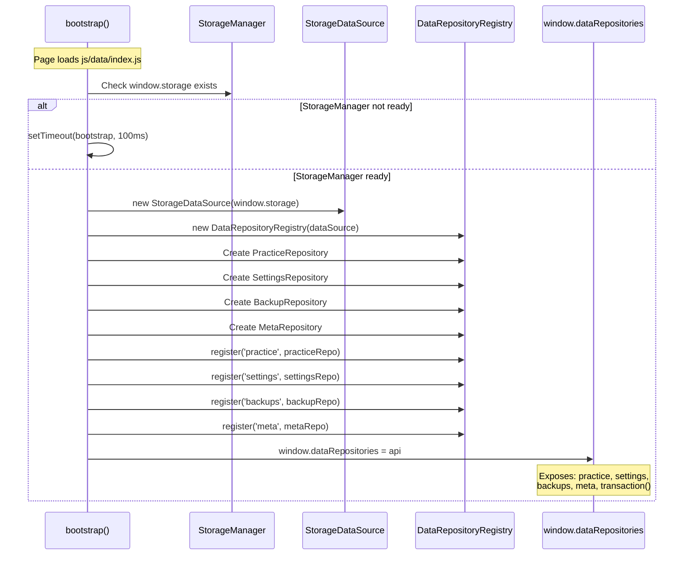

# Data Repositories & Transactions

> **Relevant source files**
> * [js/components/practiceHistory.js](https://github.com/sallowayma-git/IELTS-practice/blob/92f64eb8/js/components/practiceHistory.js)
> * [js/components/practiceHistoryEnhancer.js](https://github.com/sallowayma-git/IELTS-practice/blob/92f64eb8/js/components/practiceHistoryEnhancer.js)
> * [js/components/practiceRecordModal.js](https://github.com/sallowayma-git/IELTS-practice/blob/92f64eb8/js/components/practiceRecordModal.js)
> * [js/core/practiceRecorder.js](https://github.com/sallowayma-git/IELTS-practice/blob/92f64eb8/js/core/practiceRecorder.js)
> * [js/core/scoreStorage.js](https://github.com/sallowayma-git/IELTS-practice/blob/92f64eb8/js/core/scoreStorage.js)
> * [js/data/dataSources/storageDataSource.js](https://github.com/sallowayma-git/IELTS-practice/blob/92f64eb8/js/data/dataSources/storageDataSource.js)
> * [js/data/index.js](https://github.com/sallowayma-git/IELTS-practice/blob/92f64eb8/js/data/index.js)
> * [js/utils/dataBackupManager.js](https://github.com/sallowayma-git/IELTS-practice/blob/92f64eb8/js/utils/dataBackupManager.js)
> * [js/utils/markdownExporter.js](https://github.com/sallowayma-git/IELTS-practice/blob/92f64eb8/js/utils/markdownExporter.js)
> * [js/utils/storage.js](https://github.com/sallowayma-git/IELTS-practice/blob/92f64eb8/js/utils/storage.js)

This page describes the repository layer that provides structured, transactional access to persistent data. The repository system sits between high-level business logic components (`ScoreStorage`, `PracticeRecorder`) and the low-level multi-backend `StorageManager`. For information about the underlying storage backends, see [Storage Architecture & Multi-Backend System](/sallowayma-git/IELTS-practice/4.1-storage-architecture-and-multi-backend-system). For details on how practice records flow through the system, see [PracticeRecorder & ScoreStorage](/sallowayma-git/IELTS-practice/4.2-practicerecorder-and-scorestorage).

## Purpose and Architecture

The repository layer provides:

* **Type-safe data access** through specialized repository classes
* **Transaction support** for atomic multi-key operations
* **Queuing** to prevent concurrent write conflicts
* **Validation** with configurable rules per data key
* **Abstraction** over the `StorageManager` backend selection logic

The system consists of four main components:

| Component | Responsibility | File |
| --- | --- | --- |
| `StorageDataSource` | Queue management, transaction execution | `js/data/dataSources/storageDataSource.js` |
| `DataRepositoryRegistry` | Repository coordination, consistency checks | `js/data/index.js` (via `ExamData.registry`) |
| Specialized Repositories | Domain-specific CRUD operations | `js/data/index.js` |
| `StorageTransactionContext` | Transaction state isolation | `js/data/dataSources/storageDataSource.js` |

Sources: [js/data/index.js L1-L154](https://github.com/sallowayma-git/IELTS-practice/blob/92f64eb8/js/data/index.js#L1-L154)

 [js/data/dataSources/storageDataSource.js L1-L106](https://github.com/sallowayma-git/IELTS-practice/blob/92f64eb8/js/data/dataSources/storageDataSource.js#L1-L106)

## System Architecture



**System Architecture: Repository Layer Abstraction**

This diagram shows how `ScoreStorage` and `PracticeRecorder` access data through the repository registry rather than directly calling `StorageManager`. The `DataRepositoryRegistry` at `window.dataRepositories` provides a unified API, while `StorageDataSource` handles queuing and transaction coordination.

Sources: [js/core/scoreStorage.js L6-L34](https://github.com/sallowayma-git/IELTS-practice/blob/92f64eb8/js/core/scoreStorage.js#L6-L34)

 [js/core/practiceRecorder.js L9-L36](https://github.com/sallowayma-git/IELTS-practice/blob/92f64eb8/js/core/practiceRecorder.js#L9-L36)

 [js/data/index.js L30-L151](https://github.com/sallowayma-git/IELTS-practice/blob/92f64eb8/js/data/index.js#L30-L151)

## StorageDataSource and Queuing

The `StorageDataSource` class wraps `StorageManager` and provides a serialized operation queue to prevent race conditions during concurrent writes.

### Queue Implementation



**StorageDataSource Queue Coordination**

The `_queue` property ([js/data/dataSources/storageDataSource.js L54](https://github.com/sallowayma-git/IELTS-practice/blob/92f64eb8/js/data/dataSources/storageDataSource.js#L54-L54)

) is a Promise chain that ensures write operations execute sequentially. Read operations bypass the queue and access storage directly.

### Key Methods

| Method | Queued | Purpose | Implementation |
| --- | --- | --- | --- |
| `read(key, defaultValue)` | No | Fetch value from storage | [js/data/dataSources/storageDataSource.js L57-L61](https://github.com/sallowayma-git/IELTS-practice/blob/92f64eb8/js/data/dataSources/storageDataSource.js#L57-L61) |
| `write(key, value)` | Yes | Store value with serialization | [js/data/dataSources/storageDataSource.js L63-L68](https://github.com/sallowayma-git/IELTS-practice/blob/92f64eb8/js/data/dataSources/storageDataSource.js#L63-L68) |
| `remove(key)` | Yes | Delete key from storage | [js/data/dataSources/storageDataSource.js L70-L75](https://github.com/sallowayma-git/IELTS-practice/blob/92f64eb8/js/data/dataSources/storageDataSource.js#L70-L75) |
| `runTransaction(handler)` | Yes | Execute atomic multi-key operation | [js/data/dataSources/storageDataSource.js L77-L94](https://github.com/sallowayma-git/IELTS-practice/blob/92f64eb8/js/data/dataSources/storageDataSource.js#L77-L94) |

The `write` and `remove` methods pass `{ skipScoreStorageRedirect: true }` to prevent `StorageManager` from redirecting `practice_records` operations to `ScoreStorage`, as repositories are already the canonical data path.

Sources: [js/data/dataSources/storageDataSource.js L48-L101](https://github.com/sallowayma-git/IELTS-practice/blob/92f64eb8/js/data/dataSources/storageDataSource.js#L48-L101)

## Repository Types

### PracticeRepository

Manages the `practice_records` array with automatic deduplication and size limiting.

```javascript
// Initialization from js/data/index.js:44
const practiceRepo = new ExamData.PracticeRepository(dataSource, { 
    maxRecords: 1000 
});
```

**Key Operations:**

| Method | Description | Key |
| --- | --- | --- |
| `list()` | Fetch all practice records | `practice_records` |
| `add(record)` | Append new record, dedupe by ID | `practice_records` |
| `overwrite(records)` | Replace entire array | `practice_records` |
| `clear()` | Delete all records | `practice_records` |

Used by `ScoreStorage` via the storage adapter pattern at [js/core/scoreStorage.js L286-L353](https://github.com/sallowayma-git/IELTS-practice/blob/92f64eb8/js/core/scoreStorage.js#L286-L353)

Sources: [js/data/index.js L44](https://github.com/sallowayma-git/IELTS-practice/blob/92f64eb8/js/data/index.js#L44-L44)

### MetaRepository

Stores metadata keys with per-key validation rules and default value factories.

**Configuration Example:**

```javascript
// From js/data/index.js:48-117
const metaRepo = new ExamData.MetaRepository(dataSource, {
    user_stats: {
        defaultValue: createDefaultUserStats,  // Factory function
        validators: [
            (value) => (value && typeof value === 'object' && !Array.isArray(value)) 
                || 'user_stats must be an object'
        ]
    },
    storage_version: {
        defaultValue: () => null,
        validators: [
            (value) => value === null || typeof value === 'string' 
                || 'storage_version must be string or null'
        ],
        cloneOnRead: false  // Primitive value, no cloning needed
    },
    active_sessions: {
        defaultValue: () => [],
        validators: [
            (value) => Array.isArray(value) || 'active_sessions must be array'
        ]
    }
    // ... more keys
});
```

**Managed Keys:**

| Key | Default | Used By | Purpose |
| --- | --- | --- | --- |
| `user_stats` | `createDefaultUserStats()` | `ScoreStorage` | Aggregate statistics |
| `storage_version` | `null` | `ScoreStorage`, `StorageManager` | Schema version tracking |
| `active_sessions` | `[]` | `PracticeRecorder` | Session recovery |
| `temp_practice_records` | `[]` | `PracticeRecorder` | Crash recovery buffer |
| `exam_index` | `[]` | Various | Exam metadata cache |
| `legacy_practice_records_migrated` | `false` | `ScoreStorage` | One-time migration flag |

The `get(key, defaultValue)` method at [js/core/scoreStorage.js L294-L310](https://github.com/sallowayma-git/IELTS-practice/blob/92f64eb8/js/core/scoreStorage.js#L294-L310)

 delegates to `metaRepo.get()` for all non-array keys.

Sources: [js/data/index.js L47-L117](https://github.com/sallowayma-git/IELTS-practice/blob/92f64eb8/js/data/index.js#L47-L117)

 [js/core/scoreStorage.js L294-L310](https://github.com/sallowayma-git/IELTS-practice/blob/92f64eb8/js/core/scoreStorage.js#L294-L310)

### BackupRepository

Manages the `manual_backups` array with timestamp ordering and size limits.

```javascript
// From js/data/index.js:46
const backupRepo = new ExamData.BackupRepository(dataSource, { 
    maxBackups: 20 
});
```

**Key Operations:**

| Method | Description |
| --- | --- |
| `list()` | Fetch all backup entries |
| `saveAll(backups)` | Replace backup array, enforce maxBackups |
| `clear()` | Delete all backups |

Used by `ScoreStorage`'s storage adapter for the `manual_backups` key at [js/core/scoreStorage.js L306-L326](https://github.com/sallowayma-git/IELTS-practice/blob/92f64eb8/js/core/scoreStorage.js#L306-L326)

Sources: [js/data/index.js L46](https://github.com/sallowayma-git/IELTS-practice/blob/92f64eb8/js/data/index.js#L46-L46)

### SettingsRepository

Stores user configuration with validation and default value support. Typically accessed via the registry for settings-specific operations.

Sources: [js/data/index.js L45](https://github.com/sallowayma-git/IELTS-practice/blob/92f64eb8/js/data/index.js#L45-L45)

## Transaction System

The transaction system provides atomic multi-repository operations through `StorageTransactionContext`.

### Transaction Lifecycle

```css
#mermaid-dmygposipf7{font-family:ui-sans-serif,-apple-system,system-ui,Segoe UI,Helvetica;font-size:16px;fill:#333;}@keyframes edge-animation-frame{from{stroke-dashoffset:0;}}@keyframes dash{to{stroke-dashoffset:0;}}#mermaid-dmygposipf7 .edge-animation-slow{stroke-dasharray:9,5!important;stroke-dashoffset:900;animation:dash 50s linear infinite;stroke-linecap:round;}#mermaid-dmygposipf7 .edge-animation-fast{stroke-dasharray:9,5!important;stroke-dashoffset:900;animation:dash 20s linear infinite;stroke-linecap:round;}#mermaid-dmygposipf7 .error-icon{fill:#dddddd;}#mermaid-dmygposipf7 .error-text{fill:#222222;stroke:#222222;}#mermaid-dmygposipf7 .edge-thickness-normal{stroke-width:1px;}#mermaid-dmygposipf7 .edge-thickness-thick{stroke-width:3.5px;}#mermaid-dmygposipf7 .edge-pattern-solid{stroke-dasharray:0;}#mermaid-dmygposipf7 .edge-thickness-invisible{stroke-width:0;fill:none;}#mermaid-dmygposipf7 .edge-pattern-dashed{stroke-dasharray:3;}#mermaid-dmygposipf7 .edge-pattern-dotted{stroke-dasharray:2;}#mermaid-dmygposipf7 .marker{fill:#999;stroke:#999;}#mermaid-dmygposipf7 .marker.cross{stroke:#999;}#mermaid-dmygposipf7 svg{font-family:ui-sans-serif,-apple-system,system-ui,Segoe UI,Helvetica;font-size:16px;}#mermaid-dmygposipf7 p{margin:0;}#mermaid-dmygposipf7 defs #statediagram-barbEnd{fill:#999;stroke:#999;}#mermaid-dmygposipf7 g.stateGroup text{fill:#dddddd;stroke:none;font-size:10px;}#mermaid-dmygposipf7 g.stateGroup text{fill:#333;stroke:none;font-size:10px;}#mermaid-dmygposipf7 g.stateGroup .state-title{font-weight:bolder;fill:#333;}#mermaid-dmygposipf7 g.stateGroup rect{fill:#ffffff;stroke:#dddddd;}#mermaid-dmygposipf7 g.stateGroup line{stroke:#999;stroke-width:1;}#mermaid-dmygposipf7 .transition{stroke:#999;stroke-width:1;fill:none;}#mermaid-dmygposipf7 .stateGroup .composit{fill:#f4f4f4;border-bottom:1px;}#mermaid-dmygposipf7 .stateGroup .alt-composit{fill:#e0e0e0;border-bottom:1px;}#mermaid-dmygposipf7 .state-note{stroke:#e6d280;fill:#fff5ad;}#mermaid-dmygposipf7 .state-note text{fill:#333;stroke:none;font-size:10px;}#mermaid-dmygposipf7 .stateLabel .box{stroke:none;stroke-width:0;fill:#ffffff;opacity:0.5;}#mermaid-dmygposipf7 .edgeLabel .label rect{fill:#ffffff;opacity:0.5;}#mermaid-dmygposipf7 .edgeLabel{background-color:#ffffff;text-align:center;}#mermaid-dmygposipf7 .edgeLabel p{background-color:#ffffff;}#mermaid-dmygposipf7 .edgeLabel rect{opacity:0.5;background-color:#ffffff;fill:#ffffff;}#mermaid-dmygposipf7 .edgeLabel .label text{fill:#333;}#mermaid-dmygposipf7 .label div .edgeLabel{color:#333;}#mermaid-dmygposipf7 .stateLabel text{fill:#333;font-size:10px;font-weight:bold;}#mermaid-dmygposipf7 .node circle.state-start{fill:#999;stroke:#999;}#mermaid-dmygposipf7 .node .fork-join{fill:#999;stroke:#999;}#mermaid-dmygposipf7 .node circle.state-end{fill:#dddddd;stroke:#f4f4f4;stroke-width:1.5;}#mermaid-dmygposipf7 .end-state-inner{fill:#f4f4f4;stroke-width:1.5;}#mermaid-dmygposipf7 .node rect{fill:#ffffff;stroke:#dddddd;stroke-width:1px;}#mermaid-dmygposipf7 .node polygon{fill:#ffffff;stroke:#dddddd;stroke-width:1px;}#mermaid-dmygposipf7 #statediagram-barbEnd{fill:#999;}#mermaid-dmygposipf7 .statediagram-cluster rect{fill:#ffffff;stroke:#dddddd;stroke-width:1px;}#mermaid-dmygposipf7 .cluster-label,#mermaid-dmygposipf7 .nodeLabel{color:#333;}#mermaid-dmygposipf7 .statediagram-cluster rect.outer{rx:5px;ry:5px;}#mermaid-dmygposipf7 .statediagram-state .divider{stroke:#dddddd;}#mermaid-dmygposipf7 .statediagram-state .title-state{rx:5px;ry:5px;}#mermaid-dmygposipf7 .statediagram-cluster.statediagram-cluster .inner{fill:#f4f4f4;}#mermaid-dmygposipf7 .statediagram-cluster.statediagram-cluster-alt .inner{fill:#f8f8f8;}#mermaid-dmygposipf7 .statediagram-cluster .inner{rx:0;ry:0;}#mermaid-dmygposipf7 .statediagram-state rect.basic{rx:5px;ry:5px;}#mermaid-dmygposipf7 .statediagram-state rect.divider{stroke-dasharray:10,10;fill:#f8f8f8;}#mermaid-dmygposipf7 .note-edge{stroke-dasharray:5;}#mermaid-dmygposipf7 .statediagram-note rect{fill:#fff5ad;stroke:#e6d280;stroke-width:1px;rx:0;ry:0;}#mermaid-dmygposipf7 .statediagram-note rect{fill:#fff5ad;stroke:#e6d280;stroke-width:1px;rx:0;ry:0;}#mermaid-dmygposipf7 .statediagram-note text{fill:#333;}#mermaid-dmygposipf7 .statediagram-note .nodeLabel{color:#333;}#mermaid-dmygposipf7 .statediagram .edgeLabel{color:red;}#mermaid-dmygposipf7 #dependencyStart,#mermaid-dmygposipf7 #dependencyEnd{fill:#999;stroke:#999;stroke-width:1;}#mermaid-dmygposipf7 .statediagramTitleText{text-anchor:middle;font-size:18px;fill:#333;}#mermaid-dmygposipf7 :root{--mermaid-font-family:"trebuchet ms",verdana,arial,sans-serif;}registry.transaction(names, handler)handler(ctx) calledctx.set(key, value)ctx.get(key)handler returnshandler throwsctx.commit()all operations persistedoperations discardedCreatedExecutingCacheUpdatedReadingCacheCommittingRollingBackWritingStorage
```

**Transaction State Machine**

The `StorageTransactionContext` ([js/data/dataSources/storageDataSource.js L4-L46](https://github.com/sallowayma-git/IELTS-practice/blob/92f64eb8/js/data/dataSources/storageDataSource.js#L4-L46)

) maintains an in-memory cache and operation log. Changes are isolated until `commit()` writes them to `StorageManager`.

### Transaction Context API

**StorageTransactionContext Methods:**

| Method | Effect | Description |
| --- | --- | --- |
| `get(key, defaultValue)` | Read from cache or storage | Caches value for subsequent reads |
| `set(key, value)` | Update cache, log operation | Deferred write |
| `remove(key)` | Update cache, log operation | Deferred delete |
| `commit()` | Write operations to storage | Applies all logged operations |
| `rollback()` | Discard operations | Clears operation log |

**Implementation Details:**

```
// From js/data/dataSources/storageDataSource.js:22-25
set(key, value) {
    this.cache.set(key, value);
    this.operations.push({ type: 'set', key, value });
}
```

The `operations` array at [js/data/dataSources/storageDataSource.js L7](https://github.com/sallowayma-git/IELTS-practice/blob/92f64eb8/js/data/dataSources/storageDataSource.js#L7-L7)

 records all mutations. On `commit()`, the context iterates this array and calls `storage.set()` or `storage.remove()` for each operation at [js/data/dataSources/storageDataSource.js L32-L40](https://github.com/sallowayma-git/IELTS-practice/blob/92f64eb8/js/data/dataSources/storageDataSource.js#L32-L40)

Sources: [js/data/dataSources/storageDataSource.js L4-L46](https://github.com/sallowayma-git/IELTS-practice/blob/92f64eb8/js/data/dataSources/storageDataSource.js#L4-L46)

### Cross-Repository Transactions

The `DataRepositoryRegistry.transaction(names, handler)` method coordinates transactions across multiple repositories:



**Multi-Repository Transaction Flow**

The registry's `transaction()` method (referenced in [js/data/index.js L130-L132](https://github.com/sallowayma-git/IELTS-practice/blob/92f64eb8/js/data/index.js#L130-L132)

) delegates to `StorageDataSource.runTransaction()`, which creates an isolated context. All repository operations within the handler function use this shared context, ensuring atomicity.

Sources: [js/data/index.js L129-L135](https://github.com/sallowayma-git/IELTS-practice/blob/92f64eb8/js/data/index.js#L129-L135)

 [js/data/dataSources/storageDataSource.js L77-L94](https://github.com/sallowayma-git/IELTS-practice/blob/92f64eb8/js/data/dataSources/storageDataSource.js#L77-L94)

## Integration with ScoreStorage

`ScoreStorage` accesses repositories through a storage adapter that maps legacy storage keys to repository methods.

### Storage Adapter Pattern



**ScoreStorage Repository Adapter**

The `createStorageAdapter()` method at [js/core/scoreStorage.js L286-L353](https://github.com/sallowayma-git/IELTS-practice/blob/92f64eb8/js/core/scoreStorage.js#L286-L353)

 returns an object that intercepts storage calls and routes them to the appropriate repository:

**Adapter Method Mapping:**

| Storage Call | Repository Call | Implementation |
| --- | --- | --- |
| `storage.get('practice_records')` | `practiceRepo.list()` | [js/core/scoreStorage.js L296-L297](https://github.com/sallowayma-git/IELTS-practice/blob/92f64eb8/js/core/scoreStorage.js#L296-L297) |
| `storage.set('practice_records', array)` | `practiceRepo.overwrite(array)` | [js/core/scoreStorage.js L314-L316](https://github.com/sallowayma-git/IELTS-practice/blob/92f64eb8/js/core/scoreStorage.js#L314-L316) |
| `storage.get('user_stats')` | `metaRepo.get('user_stats')` | [js/core/scoreStorage.js L298-L302](https://github.com/sallowayma-git/IELTS-practice/blob/92f64eb8/js/core/scoreStorage.js#L298-L302) |
| `storage.set('user_stats', stats)` | `metaRepo.set('user_stats', stats)` | [js/core/scoreStorage.js L317-L319](https://github.com/sallowayma-git/IELTS-practice/blob/92f64eb8/js/core/scoreStorage.js#L317-L319) |
| `storage.get('manual_backups')` | `backupRepo.list()` | [js/core/scoreStorage.js L306-L307](https://github.com/sallowayma-git/IELTS-practice/blob/92f64eb8/js/core/scoreStorage.js#L306-L307) |
| `storage.set('manual_backups', array)` | `backupRepo.saveAll(array)` | [js/core/scoreStorage.js L324-L326](https://github.com/sallowayma-git/IELTS-practice/blob/92f64eb8/js/core/scoreStorage.js#L324-L326) |

All other keys delegate to `metaRepo.get(key, defaultValue)` and `metaRepo.set(key, value)` at [js/core/scoreStorage.js L309](https://github.com/sallowayma-git/IELTS-practice/blob/92f64eb8/js/core/scoreStorage.js#L309-L309)

 and [js/core/scoreStorage.js L328-L329](https://github.com/sallowayma-git/IELTS-practice/blob/92f64eb8/js/core/scoreStorage.js#L328-L329)

Sources: [js/core/scoreStorage.js L286-L353](https://github.com/sallowayma-git/IELTS-practice/blob/92f64eb8/js/core/scoreStorage.js#L286-L353)

## Integration with PracticeRecorder

`PracticeRecorder` accesses repositories directly through `window.dataRepositories`:

```
// From js/core/practiceRecorder.js:18-23
this.repositories = window.dataRepositories;
if (!this.repositories) {
    throw new Error('Data repositories not initialized');
}
this.practiceRepo = this.repositories.practice;
this.metaRepo = this.repositories.meta;
```

**Repository Usage:**

| Operation | Repository Method | Code Reference |
| --- | --- | --- |
| Restore active sessions | `metaRepo.get('active_sessions', [])` | [js/core/practiceRecorder.js L236](https://github.com/sallowayma-git/IELTS-practice/blob/92f64eb8/js/core/practiceRecorder.js#L236-L236) |
| Save active sessions | `metaRepo.set('active_sessions', sessions)` | Referenced in save logic |
| Fetch practice records | `practiceRepo.list()` | Via `ScoreStorage` adapter |
| Save practice record | Via `ScoreStorage.savePracticeRecord()` | [js/core/practiceRecorder.js L910-L950](https://github.com/sallowayma-git/IELTS-practice/blob/92f64eb8/js/core/practiceRecorder.js#L910-L950) |

`PracticeRecorder` primarily uses `metaRepo` for transient session state and delegates record persistence to `ScoreStorage`, which uses `practiceRepo` internally.

Sources: [js/core/practiceRecorder.js L16-L24](https://github.com/sallowayma-git/IELTS-practice/blob/92f64eb8/js/core/practiceRecorder.js#L16-L24)

 [js/core/practiceRecorder.js L233-L248](https://github.com/sallowayma-git/IELTS-practice/blob/92f64eb8/js/core/practiceRecorder.js#L233-L248)

## Bootstrap and Initialization

The repository system initializes in `js/data/index.js` using a bootstrap pattern that waits for `StorageManager` readiness:

### Initialization Sequence



**Repository Initialization Bootstrap**

The bootstrap function at [js/data/index.js L30-L153](https://github.com/sallowayma-git/IELTS-practice/blob/92f64eb8/js/data/index.js#L30-L153)

 polls for `window.storage` readiness before creating the repository hierarchy. Once initialized, `window.dataRepositories` provides a stable API for all components.

**Exported API Structure:**

```javascript
// From js/data/index.js:124-136
const api = {
    get practice() { return practiceRepo; },
    get settings() { return settingsRepo; },
    get backups() { return backupRepo; },
    get meta() { return metaRepo; },
    transaction(names, handler) {
        return registry.transaction(names, handler);
    },
    runConsistencyChecks(names) {
        return registry.runConsistencyChecks(names);
    }
};
```

The API object uses getters to access repositories and exposes `transaction()` for multi-repository operations and `runConsistencyChecks()` for validation.

Sources: [js/data/index.js L30-L153](https://github.com/sallowayma-git/IELTS-practice/blob/92f64eb8/js/data/index.js#L30-L153)

## Transaction Usage Examples

### Example 1: Atomic Record and Stats Update

```javascript
// Coordinated update across practice and meta repositories
await window.dataRepositories.transaction(['practice', 'meta'], async (ctx) => {
    // Read current state
    const records = await ctx.get('practice_records', []);
    const stats = await ctx.get('user_stats', {});
    
    // Compute updates
    const newRecord = standardizeRecord(rawData);
    records.push(newRecord);
    stats.totalPractices += 1;
    stats.averageScore = calculateAverage(records);
    
    // Write updates (deferred until commit)
    ctx.set('practice_records', records);
    ctx.set('user_stats', stats);
    
    // Implicit commit on return
});
```

This pattern is used by `ScoreStorage.savePracticeRecord()` at [js/core/scoreStorage.js L569-L684](https://github.com/sallowayma-git/IELTS-practice/blob/92f64eb8/js/core/scoreStorage.js#L569-L684)

 to ensure records and statistics remain synchronized.

### Example 2: Rollback on Validation Failure

```javascript
await window.dataRepositories.transaction(['practice'], async (ctx) => {
    const records = await ctx.get('practice_records', []);
    
    records.forEach(record => {
        if (!validateRecord(record)) {
            throw new Error('Invalid record detected');
        }
    });
    
    // If we reach here, all records valid
    ctx.set('practice_records', records);
    // Commits automatically
});
// If validation throws, rollback occurs and records unchanged
```

This pattern ensures data integrity by preventing partial updates when validation fails.

Sources: [js/data/dataSources/storageDataSource.js L77-L94](https://github.com/sallowayma-git/IELTS-practice/blob/92f64eb8/js/data/dataSources/storageDataSource.js#L77-L94)

 [js/core/scoreStorage.js L569-L684](https://github.com/sallowayma-git/IELTS-practice/blob/92f64eb8/js/core/scoreStorage.js#L569-L684)

## Consistency Checks

The `DataRepositoryRegistry` supports cross-repository consistency validation through `runConsistencyChecks(names)`:

**Typical Checks:**

* Verify `practice_records` array elements are valid objects with required fields
* Ensure `user_stats.totalPractices` matches `practice_records.length`
* Check that `active_sessions` references existing exam IDs
* Validate `manual_backups` timestamps are well-formed

The consistency check infrastructure is exposed at [js/data/index.js L133-L135](https://github.com/sallowayma-git/IELTS-practice/blob/92f64eb8/js/data/index.js#L133-L135)

 but implementation details are repository-specific.

Sources: [js/data/index.js L133-L135](https://github.com/sallowayma-git/IELTS-practice/blob/92f64eb8/js/data/index.js#L133-L135)