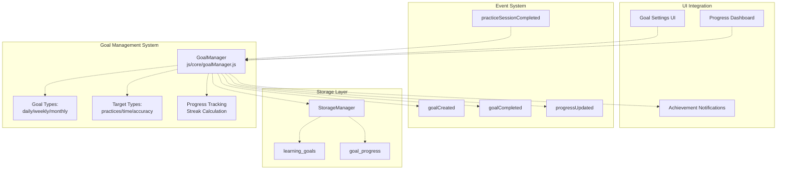
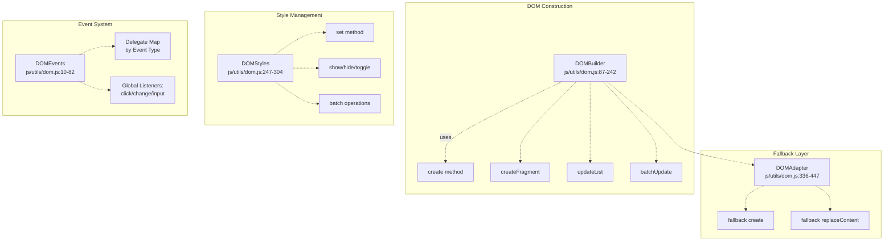

# Development Roadmap & Refactoring Tasks

> **Relevant source files**
> * [js/core/goalManager.js](https://github.com/sallowayma-git/IELTS-practice/blob/92f64eb8/js/core/goalManager.js)
> * [js/utils/dom.js](https://github.com/sallowayma-git/IELTS-practice/blob/92f64eb8/js/utils/dom.js)

This document provides a comprehensive overview of the ongoing and completed refactoring, optimization, and code quality improvement efforts in the IELTS Practice System codebase. It serves as the canonical reference for the project's technical debt reduction, architectural modernization, codebase hygiene initiatives, and planned feature enhancements.

**Scope:**

* Tracks all major refactoring phases, their goals, progress, and outcomes.
* Documents the mapping between high-level refactoring objectives and concrete code changes.
* Details the technical rationale, acceptance criteria, and verification methods for each task.
* Provides a bridge between system-level goals and specific code entities (files, classes, functions).

**Not in scope:**

* For details on the overall application architecture, see page 3.
* For data management and repository design, see page 4.
* For performance optimization patterns, see page 10.
* For testing infrastructure details, see page 12.1.

---

## Purpose and Structure

The refactoring roadmap is designed to:

* Reduce complexity and improve maintainability.
* Eliminate legacy anti-patterns (e.g., direct `innerHTML`, global state, synchronous storage).
* Unify state management and data access.
* Establish and enforce code standards and type safety.
* Provide a clear, testable migration path for all major subsystems.

The roadmap is organized into **phases** (urgent fixes, architecture, data, performance, code quality), each with granular tasks, status, and acceptance criteria.

**Sources:**
[developer/docs/optimization-task-tracker.md L1-L74](https://github.com/sallowayma-git/IELTS-practice/blob/92f64eb8/developer/docs/optimization-task-tracker.md#L1-L74)

---

## Refactoring Phases Overview

The refactoring effort is structured into six main phases, each targeting a specific set of technical issues:

| Phase | Focus Area | Status | Key Outcomes |
| --- | --- | --- | --- |
| 1 | Emergency Fixes | Complete | Debug code removal, memory leak fixes, error handling, critical bug fixes |
| 2 | Architecture Refactoring | Complete | Monolith split, state unification, legacy bridge, modularization |
| 3 | Data Layer Optimization | Complete | Repository pattern, transaction support, data integrity |
| 4 | Performance Remediation | Complete | Elimination of `innerHTML`, event delegation, batch DOM ops |
| 5 | Code Quality Improvements | Complete | Code deduplication, naming/type standards, static analysis |
| 6 | Test Coverage & CI | Ongoing | E2E, static, and regression test coverage |

**Sources:**
[developer/docs/optimization-task-tracker.md L5-L74](https://github.com/sallowayma-git/IELTS-practice/blob/92f64eb8/developer/docs/optimization-task-tracker.md#L5-L74)

---

## Diagram: Refactoring Phases to Code Entities

**Title:** Refactoring Phases and Key Code Entities

```mermaid
flowchart TD

Phase1["Phase 1: Emergency Fixes"]
AppJS["js/app.js"]
MainJS["js/main.js"]
DomUtils["js/utils/dom.js"]
PracticeHistoryEnh["js/components/practiceHistoryEnhancer.js"]
Phase2["Phase 2: Architecture Refactoring"]
StateMixin["js/app/stateMixin.js"]
ExamSessionMixin["js/app/examSessionMixin.js"]
LifecycleMixin["js/app/lifecycleMixin.js"]
LegacyAdapter["js/utils/legacyStateAdapter.js"]
LegacyBridge["js/core/legacyStateBridge.js"]
Phase3["Phase 3: Data Layer Optimization"]
DataIndex["js/data/index.js"]
PracticeRepo["js/data/repositories/practiceRepository.js"]
PracticeRecorder["js/core/practiceRecorder.js"]
ScoreStorage["js/core/scoreStorage.js"]
DataIntegrity["js/components/DataIntegrityManager.js"]
Phase4["Phase 4: Performance Remediation"]
SettingsPanel["js/components/settingsPanel.js"]
MaintenancePanel["js/components/systemMaintenancePanel.js"]
HPPortal["js/plugins/hp/hp-portal.js"]
Phase5["Phase 5: Code Quality"]
CodeStandards["js/utils/codeStandards.js"]
TypeChecker["js/utils/typeChecker.js"]
PerformanceUtils["js/utils/performance.js"]
Phase6["Phase 6: Test Coverage"]
E2ETests["developer/tests/js/e2e/appE2ETest.js"]
StaticSuite["developer/tests/ci/run_static_suite.py"]

Phase1 -.-> AppJS
Phase1 -.-> MainJS
Phase1 -.-> DomUtils
Phase1 -.-> PracticeHistoryEnh
Phase2 -.-> AppJS
Phase2 -.-> StateMixin
Phase2 -.-> ExamSessionMixin
Phase2 -.-> LifecycleMixin
Phase2 -.-> LegacyAdapter
Phase2 -.-> LegacyBridge
Phase3 -.-> DataIndex
Phase3 -.-> PracticeRepo
Phase3 -.-> PracticeRecorder
Phase3 -.-> ScoreStorage
Phase3 -.-> DataIntegrity
Phase4 -.-> DomUtils
Phase4 -.-> SettingsPanel
Phase4 -.-> MaintenancePanel
Phase4 -.-> HPPortal
Phase5 -.-> CodeStandards
Phase5 -.-> TypeChecker
Phase5 -.-> PerformanceUtils
Phase6 -.-> E2ETests
Phase6 -.-> StaticSuite
```

**Sources:**
[developer/docs/optimization-task-tracker.md L75-L74](https://github.com/sallowayma-git/IELTS-practice/blob/92f64eb8/developer/docs/optimization-task-tracker.md#L75-L74)

---

## Phase and Task Breakdown

### Phase 1: Emergency Fixes

* **Debug Code Removal:** All `console.log` statements removed except for error logging.
* **Memory Leak Fixes:** All `addEventListener` calls paired with `removeEventListener`.
* **Error Handling:** All empty `catch` blocks annotated or removed.
* **Critical Bug Fixes:** Practice record rendering and async storage compatibility.

| Task | Status | Key Files |
| --- | --- | --- |
| Clean debug code | ✅ | js/app.js, js/main.js |
| Fix memory leaks | ✅ | js/utils/dom.js |
| Simplify error handling | ✅ | js/app.js, js/main.js |
| Practice record rendering bug | ✅ | js/components/practiceHistoryEnhancer.js |

**Sources:**
[developer/docs/optimization-task-tracker.md L75-L152](https://github.com/sallowayma-git/IELTS-practice/blob/92f64eb8/developer/docs/optimization-task-tracker.md#L75-L152)

---

### Phase 2: Architecture Refactoring

* **Monolith Split:** `js/app.js` split into mixins (state, navigation, session, lifecycle).
* **State Unification:** All state access via `AppStateService` and `LegacyStateAdapter`.
* **Legacy Bridge:** `LegacyStateBridge` ensures legacy code and new app state remain in sync.
* **Component Modularization:** All major UI and logic modules refactored for testability.

| Task | Status | Key Files |
| --- | --- | --- |
| Split monolith | ✅ | js/app.js, js/app/stateMixin.js, js/app/examSessionMixin.js, js/app/lifecycleMixin.js |
| Unify state | ✅ | js/utils/legacyStateAdapter.js, js/core/legacyStateBridge.js, js/core/appStateService.js |
| Modularize components | ✅ | js/components/settingsPanel.js, js/components/systemMaintenancePanel.js |

The `lifecycleMixin.js` ([js/app/lifecycleMixin.js L6-L70](https://github.com/sallowayma-git/IELTS-practice/blob/92f64eb8/js/app/lifecycleMixin.js#L6-L70)

) implements a robust initialization sequence:

* Dependency checking and validation
* State management initialization via `initializeGlobalCompatibility()`
* Responsive features setup
* Component initialization with timeout protection
* Global error handling setup ([js/app/lifecycleMixin.js L109-L167](https://github.com/sallowayma-git/IELTS-practice/blob/92f64eb8/js/app/lifecycleMixin.js#L109-L167) )

**Sources:**
[developer/docs/optimization-task-tracker.md L196-L311](https://github.com/sallowayma-git/IELTS-practice/blob/92f64eb8/developer/docs/optimization-task-tracker.md#L196-L311)

 [js/app/lifecycleMixin.js L1-L607](https://github.com/sallowayma-git/IELTS-practice/blob/92f64eb8/js/app/lifecycleMixin.js#L1-L607)

---

### Phase 3: Data Layer Optimization

* **Repository Pattern:** All data access via repositories (Practice, Settings, Backup, Meta).
* **Transaction Support:** Atomic operations and batch updates.
* **Data Integrity:** `DataIntegrityManager` runs consistency checks and auto-backup.

| Task | Status | Key Files |
| --- | --- | --- |
| Implement repositories | ✅ | js/data/repositories/practiceRepository.js, js/data/index.js |
| Transactional storage | ✅ | js/data/dataSources/storageDataSource.js |
| Data integrity | ✅ | js/components/DataIntegrityManager.js |

**Sources:**
[developer/docs/optimization-task-tracker.md L413-L446](https://github.com/sallowayma-git/IELTS-practice/blob/92f64eb8/developer/docs/optimization-task-tracker.md#L413-L446)

---

### Phase 4: Performance Remediation

* **Eliminate `innerHTML`:** All major views and components now use `DOMBuilder` and `replaceContent`.
* **Event Delegation:** All UI events handled via `DOMEvents` delegation.
* **Batch DOM Operations:** Large lists and updates use `DocumentFragment` and batch rendering.

| Task | Status | Key Files |
| --- | --- | --- |
| Remove `innerHTML` | ✅ | js/utils/dom.js, js/components/settingsPanel.js, js/plugins/hp/hp-portal.js |
| Event delegation | ✅ | js/utils/dom.js |
| Batch DOM ops | ✅ | js/utils/dom.js |

**Sources:**
[developer/docs/optimization-task-tracker.md L447-L476](https://github.com/sallowayma-git/IELTS-practice/blob/92f64eb8/developer/docs/optimization-task-tracker.md#L447-L476)

---

### Phase 5: Code Quality Improvements

* **Deduplication:** All repeated code patterns replaced with utility classes (DOM, performance, type checking).
* **Naming and Type Standards:** Linus-style naming, JSDoc type annotations, and runtime type checks.
* **Static Analysis:** Code standards and complexity checks enforced.

| Task | Status | Key Files |
| --- | --- | --- |
| Remove duplicate code | ✅ | js/utils/dom.js, js/utils/performance.js |
| Enforce naming/type standards | ✅ | js/utils/codeStandards.js, js/utils/typeChecker.js |
| Static analysis | ✅ | developer/tests/ci/run_static_suite.py |

**Sources:**
[developer/docs/optimization-task-tracker.md L505-L683](https://github.com/sallowayma-git/IELTS-practice/blob/92f64eb8/developer/docs/optimization-task-tracker.md#L505-L683)

 [developer/docs/10-06 L43-L150](https://github.com/sallowayma-git/IELTS-practice/blob/92f64eb8/developer/docs/10-06 log.md#L43-L150)

---

## Diagram: Task Tracker to Code Entities

**Title:** Task Tracker Mapping to Code Entities

```mermaid
flowchart TD

Task11["Task 1.1: Clean Debug Code"]
AppJS["js/app.js"]
MainJS["js/main.js"]
Task12["Task 1.2: Fix Memory Leaks"]
DomUtils["js/utils/dom.js"]
LifecycleMixin["js/app/lifecycleMixin.js"]
Task14["Task 1.4: Practice Record Render Bug"]
PracticeHistoryEnh["js/components/practiceHistoryEnhancer.js"]
Task21["Task 2.1: Split Monolith"]
StateMixin["js/app/stateMixin.js"]
ExamSessionMixin["js/app/examSessionMixin.js"]
Task22["Task 2.2: Unify State"]
LegacyAdapter["js/utils/legacyStateAdapter.js"]
LegacyBridge["js/core/legacyStateBridge.js"]
AppStateService["js/core/appStateService.js"]
Task31["Task 3.1: Implement Repositories"]
PracticeRepo["js/data/repositories/practiceRepository.js"]
DataIndex["js/data/index.js"]
Task32["Task 3.2: Data Integrity"]
DataIntegrity["js/components/DataIntegrityManager.js"]
Task41["Task 4.1: Remove innerHTML"]
SettingsPanel["js/components/settingsPanel.js"]
HPPortal["js/plugins/hp/hp-portal.js"]
Task51["Task 5.1: Deduplication"]
PerformanceUtils["js/utils/performance.js"]
Task52["Task 5.2: Naming and Type Standards"]
CodeStandards["js/utils/codeStandards.js"]
TypeChecker["js/utils/typeChecker.js"]

Task11 -.-> AppJS
Task11 -.-> MainJS
Task12 -.-> DomUtils
Task12 -.-> LifecycleMixin
Task14 -.-> PracticeHistoryEnh
Task21 -.-> AppJS
Task21 -.-> StateMixin
Task21 -.-> ExamSessionMixin
Task21 -.-> LifecycleMixin
Task22 -.-> LegacyAdapter
Task22 -.-> LegacyBridge
Task22 -.-> AppStateService
Task31 -.-> PracticeRepo
Task31 -.-> DataIndex
Task32 -.-> DataIntegrity
Task41 -.-> DomUtils
Task41 -.-> SettingsPanel
Task41 -.-> HPPortal
Task51 -.-> DomUtils
Task51 -.-> PerformanceUtils
Task52 -.-> CodeStandards
Task52 -.-> TypeChecker
```

**Sources:**
[developer/docs/optimization-task-tracker.md L75-L683](https://github.com/sallowayma-git/IELTS-practice/blob/92f64eb8/developer/docs/optimization-task-tracker.md#L75-L683)

---

## Task Status Table

Below is a summary of all tracked tasks, their status, and verification method:

| Task ID | Description | Status | Verification |
| --- | --- | --- | --- |
| 1.1 | Clean debug code | ✅ | Static analysis, CI |
| 1.2 | Fix memory leaks | ✅ | Manual audit, E2E |
| 1.3 | Simplify error handling | ✅ | Code review |
| 1.4 | Practice record rendering bug | ✅ | E2E, CI |
| 1.5 | PracticeRecorder async storage | ✅ | E2E, CI |
| 2.1 | Split monolith | ✅ | File size, modularity, E2E |
| 2.2 | Unify state management | ✅ | Static analysis, E2E |
| 2.3 | Merge redundant components | ✅ | File count, code review |
| 2.4 | Overview view refactor | ✅ | E2E, code review |
| 2.5 | Legacy state bridge | ✅ | E2E, static analysis |
| 2.6 | Clean UI sync storage | ✅ | E2E, code review |
| 2.7 | Legacy plugin storage handshake | ✅ | E2E, code review |
| 2.8 | Async storage in core modules | ✅ | E2E, code review |
| 3.1 | Implement repositories | ✅ | Static analysis, E2E |
| 3.2 | Data integrity management | ✅ | E2E, CI |
| 4.1 | Remove innerHTML | ✅ | Static analysis, E2E |
| 4.2 | Performance optimization | ✅ | E2E, code review |
| 5.1 | Remove duplicate code | ✅ | Static analysis |
| 5.2 | Naming standards | ✅ | Static analysis |
| 5.3 | Add type checking | ✅ | Static analysis, IDE |
| 6.x | Test coverage | Ongoing | E2E, CI |

**Sources:**
[developer/docs/optimization-task-tracker.md L75-L683](https://github.com/sallowayma-git/IELTS-practice/blob/92f64eb8/developer/docs/optimization-task-tracker.md#L75-L683)

---

## Verification and Regression Safety

All major refactoring tasks are protected by a multi-layered verification strategy:

**Automated Testing:**

* **End-to-End (E2E) Tests:** Automated flows for navigation, practice, settings, and data export/import ([developer/tests/js/e2e/appE2ETest.js](https://github.com/sallowayma-git/IELTS-practice/blob/92f64eb8/developer/tests/js/e2e/appE2ETest.js) ).
* **Static Analysis:** CI scripts check for forbidden patterns (e.g., `innerHTML`, direct `addEventListener`), code standards, and type annotations ([developer/tests/ci/run_static_suite.py](https://github.com/sallowayma-git/IELTS-practice/blob/92f64eb8/developer/tests/ci/run_static_suite.py) ).
* **Regression Fixtures:** Practice templates and test data ensure that refactored flows remain functional.

**Runtime Protections:**

* **Dependency Checking:** `checkDependencies()` verifies all required components are loaded before initialization.
* **Error Boundaries:** Global error handlers capture and log errors without crashing the application ([js/app/lifecycleMixin.js L109-L167](https://github.com/sallowayma-git/IELTS-practice/blob/92f64eb8/js/app/lifecycleMixin.js#L109-L167) ).
* **Graceful Degradation:** `showFallbackUI()` provides degraded functionality when initialization fails ([js/app/lifecycleMixin.js L103](https://github.com/sallowayma-git/IELTS-practice/blob/92f64eb8/js/app/lifecycleMixin.js#L103-L103) ).

**Monitoring:**

* **Session Monitoring:** `startSessionMonitoring()` tracks active exam sessions.
* **Error Tracking:** `globalErrors` array maintains a sliding window of recent errors for frequency analysis ([js/app/lifecycleMixin.js L136-L150](https://github.com/sallowayma-git/IELTS-practice/blob/92f64eb8/js/app/lifecycleMixin.js#L136-L150) ).

**Sources:**
[developer/docs/optimization-task-tracker.md L214-L590](https://github.com/sallowayma-git/IELTS-practice/blob/92f64eb8/developer/docs/optimization-task-tracker.md#L214-L590)

 [developer/tests/js/e2e/appE2ETest.js](https://github.com/sallowayma-git/IELTS-practice/blob/92f64eb8/developer/tests/js/e2e/appE2ETest.js)

 [developer/tests/ci/run_static_suite.py](https://github.com/sallowayma-git/IELTS-practice/blob/92f64eb8/developer/tests/ci/run_static_suite.py)

 [js/app/lifecycleMixin.js L1-L607](https://github.com/sallowayma-git/IELTS-practice/blob/92f64eb8/js/app/lifecycleMixin.js#L1-L607)

---

## Key Technical Patterns and Tools

The refactoring effort introduced and standardized several key patterns:

**Initialization and Lifecycle:**

* **Staged Initialization:** `lifecycleMixin.initialize()` method implements a multi-stage boot sequence with progress messages ([js/app/lifecycleMixin.js L6-L70](https://github.com/sallowayma-git/IELTS-practice/blob/92f64eb8/js/app/lifecycleMixin.js#L6-L70) ).
* **Error Recovery:** `handleInitializationError()` provides fallback UI and recovery options ([js/app/lifecycleMixin.js L75-L104](https://github.com/sallowayma-git/IELTS-practice/blob/92f64eb8/js/app/lifecycleMixin.js#L75-L104) ).
* **Global Error Handling:** Centralized error capture for unhandled Promise rejections and JavaScript errors ([js/app/lifecycleMixin.js L109-L167](https://github.com/sallowayma-git/IELTS-practice/blob/92f64eb8/js/app/lifecycleMixin.js#L109-L167) ).

**DOM and Performance:**

* **Event Delegation:** All UI events are handled via `DOMEvents` ([js/utils/dom.js L10-L82](https://github.com/sallowayma-git/IELTS-practice/blob/92f64eb8/js/utils/dom.js#L10-L82) ).
* **DOM Construction:** All DOM updates use `DOMBuilder` and `replaceContent` ([js/utils/dom.js L87-L242](https://github.com/sallowayma-git/IELTS-practice/blob/92f64eb8/js/utils/dom.js#L87-L242) ).
* **Batch Operations:** Large DOM updates use `DocumentFragment` to minimize reflows.

**Data Access:**

* **Repository Pattern:** All persistent data access is routed through repositories ([js/data/repositories/practiceRepository.js](https://github.com/sallowayma-git/IELTS-practice/blob/92f64eb8/js/data/repositories/practiceRepository.js) ).
* **State Bridge:** `LegacyStateAdapter` and `LegacyStateBridge` synchronize legacy and modern state ([js/utils/legacyStateAdapter.js](https://github.com/sallowayma-git/IELTS-practice/blob/92f64eb8/js/utils/legacyStateAdapter.js)  [js/core/legacyStateBridge.js](https://github.com/sallowayma-git/IELTS-practice/blob/92f64eb8/js/core/legacyStateBridge.js) ).

**Code Quality:**

* **Type Checking:** JSDoc and runtime type checks via `typeChecker.js` ([js/utils/typeChecker.js](https://github.com/sallowayma-git/IELTS-practice/blob/92f64eb8/js/utils/typeChecker.js) ).
* **Code Standards:** Linus-style code standards enforced via `codeStandards.js` ([js/utils/codeStandards.js](https://github.com/sallowayma-git/IELTS-practice/blob/92f64eb8/js/utils/codeStandards.js) ).
* **Responsive Features:** `initializeResponsiveFeatures()` sets up `ResponsiveManager`, `TouchHandler`, `ThemeManager`, and `KeyboardShortcuts` ([js/app/lifecycleMixin.js L193-L228](https://github.com/sallowayma-git/IELTS-practice/blob/92f64eb8/js/app/lifecycleMixin.js#L193-L228) ).

**Sources:**
[developer/docs/optimization-task-tracker.md L75-L683](https://github.com/sallowayma-git/IELTS-practice/blob/92f64eb8/developer/docs/optimization-task-tracker.md#L75-L683)

 [js/app/lifecycleMixin.js L1-L607](https://github.com/sallowayma-git/IELTS-practice/blob/92f64eb8/js/app/lifecycleMixin.js#L1-L607)

 [js/utils/dom.js](https://github.com/sallowayma-git/IELTS-practice/blob/92f64eb8/js/utils/dom.js)

 [js/utils/legacyStateAdapter.js](https://github.com/sallowayma-git/IELTS-practice/blob/92f64eb8/js/utils/legacyStateAdapter.js)

 [js/core/legacyStateBridge.js](https://github.com/sallowayma-git/IELTS-practice/blob/92f64eb8/js/core/legacyStateBridge.js)

 [js/utils/typeChecker.js](https://github.com/sallowayma-git/IELTS-practice/blob/92f64eb8/js/utils/typeChecker.js)

 [js/utils/codeStandards.js](https://github.com/sallowayma-git/IELTS-practice/blob/92f64eb8/js/utils/codeStandards.js)

---

## Ongoing and Future Work

### Active Development Areas

**Long-tail Legacy Cleanup:**

* Remaining `innerHTML` usage in legacy modules scheduled for migration to `DOM.replaceContent()` pattern
* Direct `.style` property access to be replaced with `DOM.setStyle()` for consistency
* Direct event bindings to be migrated to `DOM.delegate()` event delegation system
* Target modules: legacy view components, HP theme plugins, vocabulary tools

**Test Coverage Expansion:**

* Additional E2E test scenarios for edge cases in suite practice mode
* Static analysis rules for new code patterns (e.g., forbidden global state access)
* Integration tests for data import/export with various formats
* Performance regression tests for large dataset operations

**Performance Monitoring:**

* Continued optimization of virtual scrolling for practice history ([js/utils/dom.js L219-L241](https://github.com/sallowayma-git/IELTS-practice/blob/92f64eb8/js/utils/dom.js#L219-L241) )
* Batch DOM operations using `requestAnimationFrame` scheduling ([js/utils/dom.js L297-L303](https://github.com/sallowayma-git/IELTS-practice/blob/92f64eb8/js/utils/dom.js#L297-L303) )
* Cache management for computed styles and fragment reuse ([js/utils/dom.js L247-L276](https://github.com/sallowayma-git/IELTS-practice/blob/92f64eb8/js/utils/dom.js#L247-L276) )

### Planned Feature Enhancements

**Learning Goal System:**
A comprehensive goal management system is in development to support structured learning progress tracking:

**Title:** Goal Management Architecture

**Key Components:**

* **GoalManager Class:** Central controller for goal lifecycle ([js/core/goalManager.js L5-L391](https://github.com/sallowayma-git/IELTS-practice/blob/92f64eb8/js/core/goalManager.js#L5-L391) )
* **Goal Types:** Daily, weekly, and monthly practice targets ([js/core/goalManager.js L373-L379](https://github.com/sallowayma-git/IELTS-practice/blob/92f64eb8/js/core/goalManager.js#L373-L379) )
* **Target Metrics:** Practice count, time duration, or accuracy percentage ([js/core/goalManager.js L382-L390](https://github.com/sallowayma-git/IELTS-practice/blob/92f64eb8/js/core/goalManager.js#L382-L390) )
* **Progress Tracking:** Automatic updates on practice completion with streak calculation ([js/core/goalManager.js L210-L253](https://github.com/sallowayma-git/IELTS-practice/blob/92f64eb8/js/core/goalManager.js#L210-L253) )
* **Event Integration:** Listens to `practiceSessionCompleted` events ([js/core/goalManager.js L258-L266](https://github.com/sallowayma-git/IELTS-practice/blob/92f64eb8/js/core/goalManager.js#L258-L266) )

**Implementation Status:**

* Core `GoalManager` class: Complete ([js/core/goalManager.js L5-L391](https://github.com/sallowayma-git/IELTS-practice/blob/92f64eb8/js/core/goalManager.js#L5-L391) )
* Storage integration: Complete with async/await pattern ([js/core/goalManager.js L27-L62](https://github.com/sallowayma-git/IELTS-practice/blob/92f64eb8/js/core/goalManager.js#L27-L62) )
* Progress calculation: Complete with streak tracking ([js/core/goalManager.js L324-L352](https://github.com/sallowayma-git/IELTS-practice/blob/92f64eb8/js/core/goalManager.js#L324-L352) )
* UI components: Planned
* Notification system: Planned

**Sources:**
[js/core/goalManager.js L1-L394](https://github.com/sallowayma-git/IELTS-practice/blob/92f64eb8/js/core/goalManager.js#L1-L394)

 [js/utils/dom.js L219-L303](https://github.com/sallowayma-git/IELTS-practice/blob/92f64eb8/js/utils/dom.js#L219-L303)

### Maintenance and Monitoring

**Resource Cleanup:**

* `destroy()` method ensures proper cleanup of event listeners, intervals, and child windows ([js/app/lifecycleMixin.js L549-L601](https://github.com/sallowayma-git/IELTS-practice/blob/92f64eb8/js/app/lifecycleMixin.js#L549-L601) )
* `DOM.events.cleanup()` removes all delegated event handlers ([js/utils/dom.js L79-L81](https://github.com/sallowayma-git/IELTS-practice/blob/92f64eb8/js/utils/dom.js#L79-L81) )
* Session monitoring tracks and cleans up orphaned exam windows

**Responsive Adaptations:**

* Ongoing improvements to mobile and landscape orientation handling ([js/app/lifecycleMixin.js L233-L296](https://github.com/sallowayma-git/IELTS-practice/blob/92f64eb8/js/app/lifecycleMixin.js#L233-L296) )
* Touch gesture support for mobile interactions
* Adaptive UI layouts based on viewport size

**State Persistence:**

* Enhanced persistence strategies for multi-state synchronization ([js/app/lifecycleMixin.js L551-L557](https://github.com/sallowayma-git/IELTS-practice/blob/92f64eb8/js/app/lifecycleMixin.js#L551-L557) )
* Cross-tab state synchronization via `storage` events
* Automatic backup before data modifications

**DOM Utility Evolution:**
The unified DOM utility system continues to evolve with new patterns:

**Title:** DOM Utility System Components

**Key Patterns:**

* **Event Delegation:** All events routed through `DOMEvents.delegate()` to reduce listener count ([js/utils/dom.js L62-L74](https://github.com/sallowayma-git/IELTS-practice/blob/92f64eb8/js/utils/dom.js#L62-L74) )
* **Fragment Building:** Batch DOM creation using `DocumentFragment` for performance ([js/utils/dom.js L152-L163](https://github.com/sallowayma-git/IELTS-practice/blob/92f64eb8/js/utils/dom.js#L152-L163) )
* **Batch Rendering:** Large lists split into chunks with `requestAnimationFrame` ([js/utils/dom.js L222-L241](https://github.com/sallowayma-git/IELTS-practice/blob/92f64eb8/js/utils/dom.js#L222-L241) )
* **Graceful Degradation:** `DOMAdapter` provides ES5-compatible fallbacks ([js/utils/dom.js L336-L447](https://github.com/sallowayma-git/IELTS-practice/blob/92f64eb8/js/utils/dom.js#L336-L447) )

**Sources:**
[js/utils/dom.js L1-L448](https://github.com/sallowayma-git/IELTS-practice/blob/92f64eb8/js/utils/dom.js#L1-L448)

 [js/app/lifecycleMixin.js L233-L601](https://github.com/sallowayma-git/IELTS-practice/blob/92f64eb8/js/app/lifecycleMixin.js#L233-L601)

### Technical Debt Tracking

The optimization task tracker serves as the single source of truth for all technical debt items, refactoring plans, and improvement initiatives. Regular audits ensure that completed tasks are verified and new issues are promptly added to the roadmap.

**Tracking Process:**

1. **Identification:** Code reviews and static analysis identify technical debt
2. **Prioritization:** Tasks categorized by urgency (emergency, high, medium, low)
3. **Assignment:** Tasks assigned to refactoring phases based on dependencies
4. **Verification:** Automated tests and manual review confirm completion
5. **Documentation:** Completed tasks documented with verification evidence

**Metrics Tracked:**

* Lines of code reduced through deduplication
* Number of `innerHTML` usages eliminated
* Event listener leak fixes
* Test coverage percentage
* Static analysis rule violations

**Sources:**
[developer/docs/optimization-task-tracker.md L469-L605](https://github.com/sallowayma-git/IELTS-practice/blob/92f64eb8/developer/docs/optimization-task-tracker.md#L469-L605)

---

## References

* [Optimization Task Tracker (Full Audit Log)](https://github.com/sallowayma-git/IELTS-practice/blob/92f64eb8/Optimization Task Tracker (Full Audit Log))
* [Linus Philosophy and Code Quality Log](https://github.com/sallowayma-git/IELTS-practice/blob/92f64eb8/Linus Philosophy and Code Quality Log)
* [E2E Test Suite](https://github.com/sallowayma-git/IELTS-practice/blob/92f64eb8/E2E Test Suite)
* [Static Analysis Suite](https://github.com/sallowayma-git/IELTS-practice/blob/92f64eb8/Static Analysis Suite)
* [DOM Utilities](https://github.com/sallowayma-git/IELTS-practice/blob/92f64eb8/DOM Utilities)
* [Type Checking Utilities](https://github.com/sallowayma-git/IELTS-practice/blob/92f64eb8/Type Checking Utilities)
* [Code Standards](https://github.com/sallowayma-git/IELTS-practice/blob/92f64eb8/Code Standards)

---

**This document is updated as new refactoring tasks are completed and as the codebase evolves. For the latest status, always refer to the most recent entries in the optimization task tracker.**

**Sources:**
[developer/docs/optimization-task-tracker.md](https://github.com/sallowayma-git/IELTS-practice/blob/92f64eb8/developer/docs/optimization-task-tracker.md)

 [developer/docs/10-06 log.md](https://github.com/sallowayma-git/IELTS-practice/blob/92f64eb8/developer/docs/10-06 log.md)

 [js/utils/dom.js](https://github.com/sallowayma-git/IELTS-practice/blob/92f64eb8/js/utils/dom.js)

 [js/utils/typeChecker.js](https://github.com/sallowayma-git/IELTS-practice/blob/92f64eb8/js/utils/typeChecker.js)

 [js/utils/codeStandards.js](https://github.com/sallowayma-git/IELTS-practice/blob/92f64eb8/js/utils/codeStandards.js)

 [developer/tests/js/e2e/appE2ETest.js](https://github.com/sallowayma-git/IELTS-practice/blob/92f64eb8/developer/tests/js/e2e/appE2ETest.js)

 [developer/tests/ci/run_static_suite.py](https://github.com/sallowayma-git/IELTS-practice/blob/92f64eb8/developer/tests/ci/run_static_suite.py)