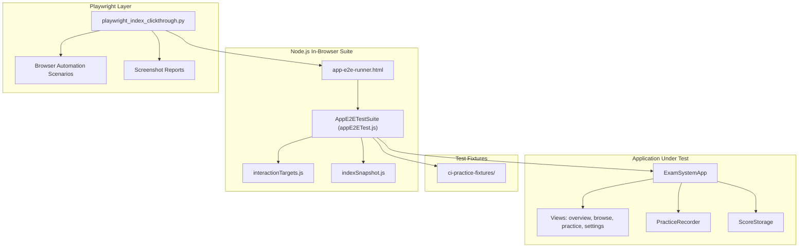
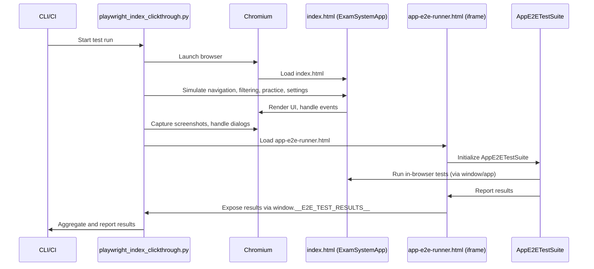

# E2E Testing Infrastructure

> **Relevant source files**
> * [developer/docs/10-06 log.md](https://github.com/sallowayma-git/IELTS-practice/blob/df0c9b8f/developer/docs/10-06 log.md)
> * [developer/docs/optimization-task-tracker.md](https://github.com/sallowayma-git/IELTS-practice/blob/df0c9b8f/developer/docs/optimization-task-tracker.md)
> * [developer/tests/e2e/playwright_index_clickthrough.py](https://github.com/sallowayma-git/IELTS-practice/blob/df0c9b8f/developer/tests/e2e/playwright_index_clickthrough.py)
> * [developer/tests/js/e2e/appE2ETest.js](https://github.com/sallowayma-git/IELTS-practice/blob/df0c9b8f/developer/tests/js/e2e/appE2ETest.js)
> * [developer/tests/js/e2e/indexSnapshot.js](https://github.com/sallowayma-git/IELTS-practice/blob/df0c9b8f/developer/tests/js/e2e/indexSnapshot.js)
> * [js/app/examSessionMixin.js](https://github.com/sallowayma-git/IELTS-practice/blob/df0c9b8f/js/app/examSessionMixin.js)
> * [js/app/lifecycleMixin.js](https://github.com/sallowayma-git/IELTS-practice/blob/df0c9b8f/js/app/lifecycleMixin.js)
> * [js/components/practiceHistoryEnhancer.js](https://github.com/sallowayma-git/IELTS-practice/blob/df0c9b8f/js/components/practiceHistoryEnhancer.js)
> * [js/core/goalManager.js](https://github.com/sallowayma-git/IELTS-practice/blob/df0c9b8f/js/core/goalManager.js)
> * [js/utils/dom.js](https://github.com/sallowayma-git/IELTS-practice/blob/df0c9b8f/js/utils/dom.js)
> * [js/views/overviewView.js](https://github.com/sallowayma-git/IELTS-practice/blob/df0c9b8f/js/views/overviewView.js)

This document describes the end-to-end (E2E) testing infrastructure for the IELTS Practice System. It covers the architecture, tools, test coverage, and integration points of the E2E test suites, including both browser automation (Playwright) and in-browser Node.js-based test harnesses. The focus is on how these systems interact with the application code, what is tested, and how the infrastructure supports regression prevention and code quality.

For information about static analysis and contract validation, see [Static Analysis & CI Validation](/sallowayma-git/IELTS-practice/10.2-static-analysis-and-ci-validation). For path compatibility and non-ASCII resource testing, see [Path Compatibility Testing](/sallowayma-git/IELTS-practice/10.3-path-compatibility-testing).

---

## Purpose and Scope

* **Purpose:**   To provide a technical overview of the E2E testing systems, their architecture, and their integration with the application codebase. This includes the Playwright-based browser automation, the Node.js in-browser E2E suite, and the use of test fixtures and offline snapshots.
* **Scope:** * Test runner architecture and orchestration * Mapping of test scenarios to code entities * Test fixture management and offline data * Integration with CI/CD and regression prevention * Excludes static code analysis and path compatibility (see above for links)

---

## High-Level E2E Testing Architecture

The E2E testing infrastructure is composed of two main layers:

1. **Playwright Browser Automation**: Python-based scripts that drive real browser sessions, simulating user interactions and verifying UI behavior.
2. **Node.js In-Browser E2E Suite**: JavaScript-based test harness loaded in an iframe, running comprehensive UI and data flow tests within the application context.

### Diagram: E2E Testing System Overview



**Sources:**

* [developer/tests/e2e/playwright_index_clickthrough.py L1-L289](https://github.com/sallowayma-git/IELTS-practice/blob/df0c9b8f/developer/tests/e2e/playwright_index_clickthrough.py#L1-L289)
* [developer/tests/js/e2e/appE2ETest.js L1-L2000](https://github.com/sallowayma-git/IELTS-practice/blob/df0c9b8f/developer/tests/js/e2e/appE2ETest.js#L1-L2000)
* [developer/tests/js/e2e/interactionTargets.js L1-L17](https://github.com/sallowayma-git/IELTS-practice/blob/df0c9b8f/developer/tests/js/e2e/interactionTargets.js#L1-L17)
* [developer/tests/js/e2e/indexSnapshot.js L1-L409](https://github.com/sallowayma-git/IELTS-practice/blob/df0c9b8f/developer/tests/js/e2e/indexSnapshot.js#L1-L409)
* [templates/ci-practice-fixtures/analysis-of-fear.html L1-L1580](https://github.com/sallowayma-git/IELTS-practice/blob/df0c9b8f/templates/ci-practice-fixtures/analysis-of-fear.html#L1-L1580)

---

## Playwright E2E Test Runner

The Playwright-based E2E runner (`playwright_index_clickthrough.py`) is responsible for:

* Launching a Chromium browser and navigating to `index.html`
* Simulating user navigation, filtering, practice submission, and settings interactions
* Handling dialogs, popups, and modal overlays
* Capturing screenshots for visual regression
* Triggering the in-browser E2E suite and collecting results

### Key Features

| Feature | Description |
| --- | --- |
| Navigation | Clicks main navigation buttons, verifies view activation |
| Filtering | Exercises type filters and search in browse/practice views |
| Practice Submission | Opens practice windows, simulates answer submission, closes popups |
| Settings Panel | Clicks all settings buttons, handles modals and file choosers |
| Theme Switching | Opens theme modal, switches between in-app and portal themes |
| Developer Links | Opens and closes developer modals |
| E2E Suite Orchestration | Loads `app-e2e-runner.html` and waits for test results |

**Sources:**

* [developer/tests/e2e/playwright_index_clickthrough.py L1-L289](https://github.com/sallowayma-git/IELTS-practice/blob/df0c9b8f/developer/tests/e2e/playwright_index_clickthrough.py#L1-L289)

---

## Node.js In-Browser E2E Suite

The in-browser E2E suite is loaded via `app-e2e-runner.html` and runs `AppE2ETestSuite` from `appE2ETest.js` inside an iframe. This suite performs detailed UI and data flow tests, including:

* Main navigation and view rendering
* Overview card structure and delegated attributes
* Exam filtering, search, and action buttons
* Practice record flow, including submission and history updates
* Settings panel button coverage
* Theme portal navigation and in-app theme switching
* Bulk delete and empty state handling
* Legacy bridge synchronization

### Diagram: Mapping E2E Test Cases to Application Code

```

```

**Sources:**

* [developer/tests/js/e2e/appE2ETest.js L1-L2000](https://github.com/sallowayma-git/IELTS-practice/blob/df0c9b8f/developer/tests/js/e2e/appE2ETest.js#L1-L2000)
* [js/views/overviewView.js L1-L198](https://github.com/sallowayma-git/IELTS-practice/blob/df0c9b8f/js/views/overviewView.js#L1-L198)
* [js/views/legacyViewBundle.js L1-L900](https://github.com/sallowayma-git/IELTS-practice/blob/df0c9b8f/js/views/legacyViewBundle.js#L1-L900)
* [js/core/practiceRecorder.js L1-L1500](https://github.com/sallowayma-git/IELTS-practice/blob/df0c9b8f/js/core/practiceRecorder.js#L1-L1500)
* [js/core/scoreStorage.js L1-L400](https://github.com/sallowayma-git/IELTS-practice/blob/df0c9b8f/js/core/scoreStorage.js#L1-L400)
* [js/components/settingsPanel.js L120-L520](https://github.com/sallowayma-git/IELTS-practice/blob/df0c9b8f/js/components/settingsPanel.js#L120-L520)
* [js/utils/themeManager.js L1-L200](https://github.com/sallowayma-git/IELTS-practice/blob/df0c9b8f/js/utils/themeManager.js#L1-L200)
* [js/utils/legacyStateAdapter.js L1-L142](https://github.com/sallowayma-git/IELTS-practice/blob/df0c9b8f/js/utils/legacyStateAdapter.js#L1-L142)
* [js/core/legacyStateBridge.js L132-L240](https://github.com/sallowayma-git/IELTS-practice/blob/df0c9b8f/js/core/legacyStateBridge.js#L132-L240)

---

## Test Fixtures and Offline Snapshots

### Practice Fixtures

* Located in `templates/ci-practice-fixtures/`
* Example: `analysis-of-fear.html` is a minimal practice page used for E2E submission flow tests
* Used to simulate real exam pages and verify cross-window communication and data persistence

### Index Snapshot

* `indexSnapshot.js` provides an offline HTML snapshot of `index.html`
* Ensures deterministic test data and structure for offline and CI runs

### Table: Key Fixture Assets

| Asset Path | Purpose |
| --- | --- |
| templates/ci-practice-fixtures/analysis-of-fear.html | Practice submission E2E flow |
| developer/tests/js/e2e/indexSnapshot.js | Offline HTML structure for E2E harness |

**Sources:**

* [templates/ci-practice-fixtures/analysis-of-fear.html L1-L1580](https://github.com/sallowayma-git/IELTS-practice/blob/df0c9b8f/templates/ci-practice-fixtures/analysis-of-fear.html#L1-L1580)
* [developer/tests/js/e2e/indexSnapshot.js L1-L409](https://github.com/sallowayma-git/IELTS-practice/blob/df0c9b8f/developer/tests/js/e2e/indexSnapshot.js#L1-L409)

---

## Integration with Application Code

The E2E infrastructure is tightly coupled with the application’s modular architecture. The following code entities are directly exercised or stubbed by the E2E tests:

| Code Entity | Role in E2E Testing |
| --- | --- |
| `ExamSystemApp` | Main orchestrator, initialization, and state management |
| `OverviewView` | Renders overview cards, tested for structure and actions |
| `PracticeRecorder` | Handles practice submission, tested for message flow |
| `ScoreStorage` | Persists practice records, tested for async correctness |
| `SettingsPanel` | All settings actions are triggered and verified |
| `theme-switcher.js` | Theme modal and portal navigation |
| `LegacyStateBridge` | Synchronization between legacy and modern state |

**Sources:**

* [js/app.js L1-L120](https://github.com/sallowayma-git/IELTS-practice/blob/df0c9b8f/js/app.js#L1-L120)
* [js/views/overviewView.js L1-L198](https://github.com/sallowayma-git/IELTS-practice/blob/df0c9b8f/js/views/overviewView.js#L1-L198)
* [js/core/practiceRecorder.js L1-L1500](https://github.com/sallowayma-git/IELTS-practice/blob/df0c9b8f/js/core/practiceRecorder.js#L1-L1500)
* [js/core/scoreStorage.js L1-L400](https://github.com/sallowayma-git/IELTS-practice/blob/df0c9b8f/js/core/scoreStorage.js#L1-L400)
* [js/components/settingsPanel.js L120-L520](https://github.com/sallowayma-git/IELTS-practice/blob/df0c9b8f/js/components/settingsPanel.js#L120-L520)
* [js/utils/themeManager.js L1-L200](https://github.com/sallowayma-git/IELTS-practice/blob/df0c9b8f/js/utils/themeManager.js#L1-L200)
* [js/core/legacyStateBridge.js L132-L240](https://github.com/sallowayma-git/IELTS-practice/blob/df0c9b8f/js/core/legacyStateBridge.js#L132-L240)

---

## E2E Test Execution Flow

### Diagram: E2E Test Orchestration Sequence



**Sources:**

* [developer/tests/e2e/playwright_index_clickthrough.py L1-L289](https://github.com/sallowayma-git/IELTS-practice/blob/df0c9b8f/developer/tests/e2e/playwright_index_clickthrough.py#L1-L289)
* [developer/tests/js/e2e/appE2ETest.js L1-L2000](https://github.com/sallowayma-git/IELTS-practice/blob/df0c9b8f/developer/tests/js/e2e/appE2ETest.js#L1-L2000)
* [developer/tests/js/e2e/indexSnapshot.js L1-L409](https://github.com/sallowayma-git/IELTS-practice/blob/df0c9b8f/developer/tests/js/e2e/indexSnapshot.js#L1-L409)

---

## Regression Prevention and CI Integration

* E2E tests are run as part of the CI pipeline.
* Results are aggregated into JSON reports for automated validation.
* Static analysis suite (`run_static_suite.py`) cross-checks that all navigation and settings buttons are covered by E2E tests.
* Practice submission, history updates, and settings actions are all verified for both success and failure paths.
* Bulk delete, empty state, and theme switching are explicitly tested to prevent UI regressions.

**Sources:**

* [developer/tests/ci/run_static_suite.py L1-L220](https://github.com/sallowayma-git/IELTS-practice/blob/df0c9b8f/developer/tests/ci/run_static_suite.py#L1-L220)
* [developer/tests/js/e2e/appE2ETest.js L1-L2000](https://github.com/sallowayma-git/IELTS-practice/blob/df0c9b8f/developer/tests/js/e2e/appE2ETest.js#L1-L2000)

---

## Summary Table: E2E Test Coverage

| Area | Playwright | In-Browser Suite | Fixture-Based | Static Analysis |
| --- | --- | --- | --- | --- |
| Navigation | ✔️ | ✔️ |  | ✔️ |
| Overview Cards | ✔️ | ✔️ |  | ✔️ |
| Browse/Filter | ✔️ | ✔️ |  | ✔️ |
| Practice Submission | ✔️ | ✔️ | ✔️ |  |
| Settings Panel | ✔️ | ✔️ |  | ✔️ |
| Theme Switching | ✔️ | ✔️ |  |  |
| Bulk Delete | ✔️ | ✔️ |  | ✔️ |
| Legacy Bridge |  | ✔️ |  |  |

**Sources:**

* [developer/tests/e2e/playwright_index_clickthrough.py L1-L289](https://github.com/sallowayma-git/IELTS-practice/blob/df0c9b8f/developer/tests/e2e/playwright_index_clickthrough.py#L1-L289)
* [developer/tests/js/e2e/appE2ETest.js L1-L2000](https://github.com/sallowayma-git/IELTS-practice/blob/df0c9b8f/developer/tests/js/e2e/appE2ETest.js#L1-L2000)
* [developer/tests/ci/run_static_suite.py L1-L220](https://github.com/sallowayma-git/IELTS-practice/blob/df0c9b8f/developer/tests/ci/run_static_suite.py#L1-L220)

---

## Maintenance and Extensibility

* Test targets are defined in `interactionTargets.js` for easy extension.
* Offline snapshots and fixtures are updated as the UI evolves.
* All new UI features and navigation paths must be added to the E2E suite and static analysis configuration to ensure coverage.

**Sources:**

* [developer/tests/js/e2e/interactionTargets.js L1-L17](https://github.com/sallowayma-git/IELTS-practice/blob/df0c9b8f/developer/tests/js/e2e/interactionTargets.js#L1-L17)
* [developer/tests/js/e2e/indexSnapshot.js L1-L409](https://github.com/sallowayma-git/IELTS-practice/blob/df0c9b8f/developer/tests/js/e2e/indexSnapshot.js#L1-L409)
* [developer/docs/optimization-task-tracker.md L560-L566](https://github.com/sallowayma-git/IELTS-practice/blob/df0c9b8f/developer/docs/optimization-task-tracker.md#L560-L566)

---

## Related Pages

* [Static Analysis & CI Validation](/sallowayma-git/IELTS-practice/10.2-static-analysis-and-ci-validation): For details on static code checks and contract validation.
* [Path Compatibility Testing](/sallowayma-git/IELTS-practice/10.3-path-compatibility-testing): For non-ASCII path and resource compatibility tests.

---

**End of Document**