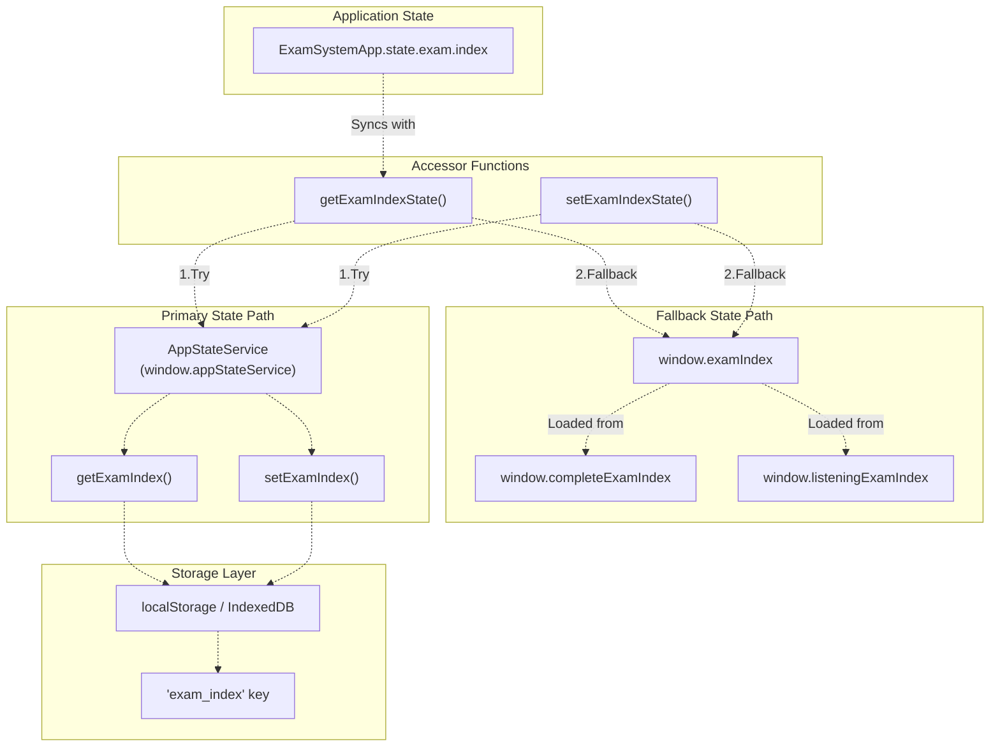
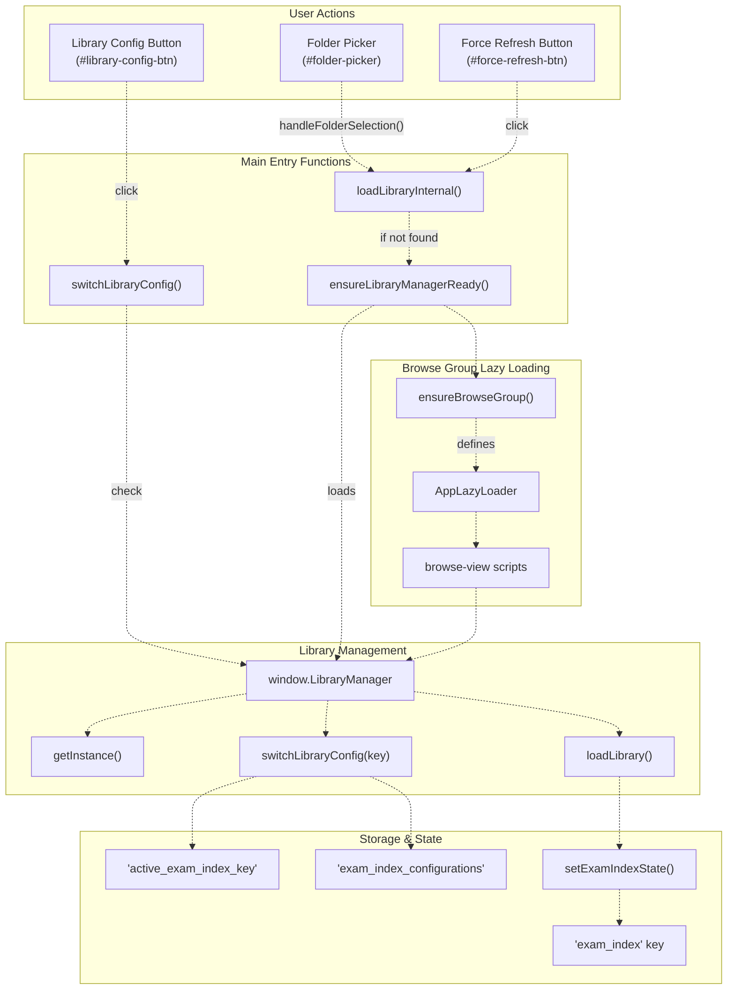
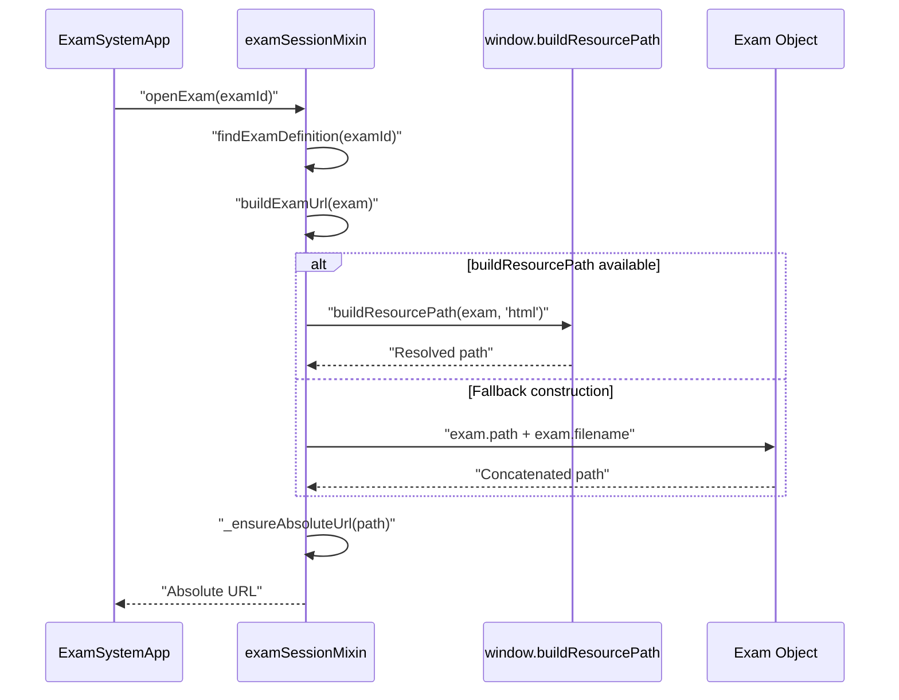
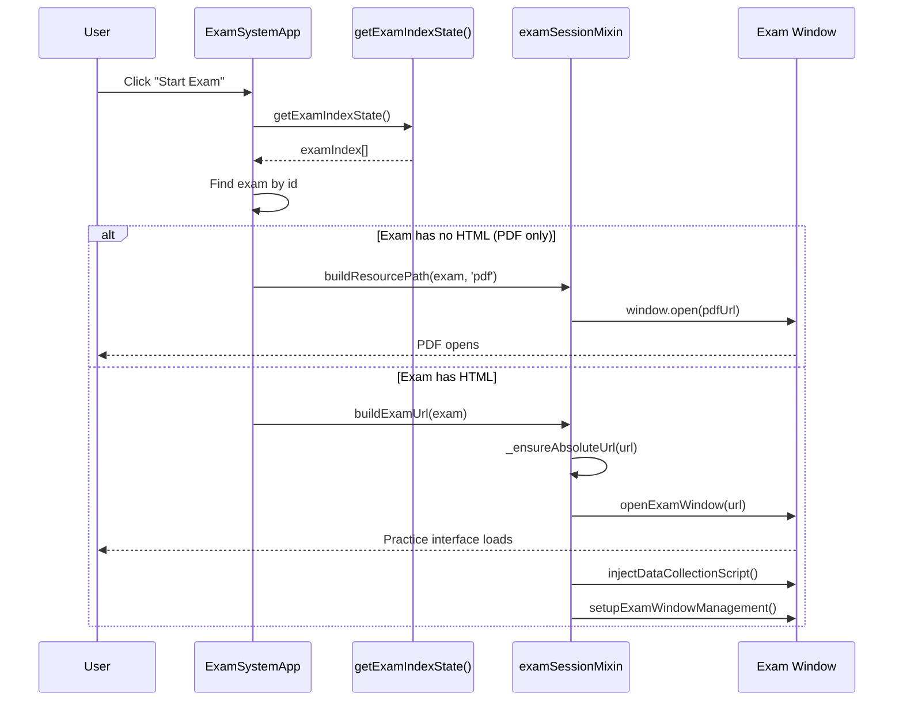

# Exam Content & Library Management

> **Relevant source files**
> * [assets/scripts/complete-exam-data.js](https://github.com/sallowayma-git/IELTS-practice/blob/92f64eb8/assets/scripts/complete-exam-data.js)
> * [assets/scripts/listening-exam-data.js](https://github.com/sallowayma-git/IELTS-practice/blob/92f64eb8/assets/scripts/listening-exam-data.js)
> * [css/heroui-bridge.css](https://github.com/sallowayma-git/IELTS-practice/blob/92f64eb8/css/heroui-bridge.css)
> * [css/main.css](https://github.com/sallowayma-git/IELTS-practice/blob/92f64eb8/css/main.css)
> * [index.html](https://github.com/sallowayma-git/IELTS-practice/blob/92f64eb8/index.html)
> * [js/app.js](https://github.com/sallowayma-git/IELTS-practice/blob/92f64eb8/js/app.js)
> * [js/boot-fallbacks.js](https://github.com/sallowayma-git/IELTS-practice/blob/92f64eb8/js/boot-fallbacks.js)
> * [js/components/PerformanceOptimizer.js](https://github.com/sallowayma-git/IELTS-practice/blob/92f64eb8/js/components/PerformanceOptimizer.js)
> * [js/main.js](https://github.com/sallowayma-git/IELTS-practice/blob/92f64eb8/js/main.js)
> * [js/views/legacyViewBundle.js](https://github.com/sallowayma-git/IELTS-practice/blob/92f64eb8/js/views/legacyViewBundle.js)

This page documents the exam content system, including exam index structure, library configuration management, and path resolution for exam resources. The system supports multiple library configurations, allowing users to switch between different exam collections, and implements sophisticated path resolution strategies to locate exam files across various deployment scenarios.

**Related Pages:**

* For detailed exam index metadata structure, see page 6.1 (Exam Index & Metadata Structure)
* For library configuration management, see page 6.2 (Library Management & Configuration System)
* For path resolution strategies, see page 6.3 (Path Resolution & Resource Management)
* For state persistence mechanisms, see page 4.1 (Storage Architecture & Multi-Backend System)
* For how practice sessions consume exam data, see page 5 (Practice Session System)

## Exam Index Sources

The system loads exam content metadata from two static JavaScript files during application initialization:

### Primary Data Sources

| Source File | Global Variable | Content Type | Entry Count | Categories |
| --- | --- | --- | --- | --- |
| `assets/scripts/complete-exam-data.js` | `window.completeExamIndex` | Reading passages | 83 | P1, P2, P3 (high/medium frequency) |
| `assets/scripts/listening-exam-data.js` | `window.listeningExamIndex` | Listening exercises | 142 | P3, P4 |

These files are loaded via script tags in [index.html L388-L390](https://github.com/sallowayma-git/IELTS-practice/blob/92f64eb8/index.html#L388-L390)

 before the main application initializes. The global variables `completeExamIndex` and `listeningExamIndex` become available immediately and serve as the primary data sources for the exam index.

**Sources:** [index.html L388-L390](https://github.com/sallowayma-git/IELTS-practice/blob/92f64eb8/index.html#L388-L390)

 [assets/scripts/complete-exam-data.js L5](https://github.com/sallowayma-git/IELTS-practice/blob/92f64eb8/assets/scripts/complete-exam-data.js#L5-L5)

 [assets/scripts/listening-exam-data.js L4](https://github.com/sallowayma-git/IELTS-practice/blob/92f64eb8/assets/scripts/listening-exam-data.js#L4-L4)

## Exam Object Schema

Each exam entry in `completeExamIndex` and `listeningExamIndex` follows a standard structure:

### Core Metadata Fields

```yaml
{
  id: "p1-high-01",              // Unique identifier
  title: "A Brief History...",    // Display title
  category: "P1",                 // Difficulty level (P1/P2/P3/P4)
  type: "reading",                // "reading" or "listening"
  path: "1. P1 - A Brief...",    // Directory path relative to root
  filename: "index.html",         // HTML practice file
  hasHtml: true,                  // HTML availability flag
  hasPdf: true,                   // PDF availability flag
  pdfFilename: "reading.pdf",     // PDF file name (if available)
  frequency: "high"               // For reading: "high" or "medium"
}
```

### Listening-Specific Fields

```yaml
{
  mp3Filename: "audio.mp3"        // Audio file name (listening only)
}
```

### Runtime-Assigned Fields

The application dynamically assigns additional fields during initialization:

```yaml
{
  sequenceNumber: 42              // Assigned by assignExamSequenceNumbers()
}
```

The `sequenceNumber` field is computed in [js/main.js L118-L129](https://github.com/sallowayma-git/IELTS-practice/blob/92f64eb8/js/main.js#L118-L129)

 by iterating through the exam array and assigning `index + 1` to each exam. This provides a stable numeric identifier for display purposes.

**Exam Metadata Formatting**

The function `formatExamMetaText()` in [js/main.js L131-L146](https://github.com/sallowayma-git/IELTS-practice/blob/92f64eb8/js/main.js#L131-L146)

 generates display strings by concatenating `sequenceNumber`, `category`, and `type`:

```
"42 | P1 | reading"
```

**Sources:** [assets/scripts/complete-exam-data.js L5-L941](https://github.com/sallowayma-git/IELTS-practice/blob/92f64eb8/assets/scripts/complete-exam-data.js#L5-L941)

 [assets/scripts/listening-exam-data.js L4-L1711](https://github.com/sallowayma-git/IELTS-practice/blob/92f64eb8/assets/scripts/listening-exam-data.js#L4-L1711)

 [js/main.js L118-L146](https://github.com/sallowayma-git/IELTS-practice/blob/92f64eb8/js/main.js#L118-L146)

## Exam Index State Management

The exam index is stored and accessed through multiple layers in the application architecture:

### State Access Functions

The application provides centralized state accessor functions in [js/main.js L65-L80](https://github.com/sallowayma-git/IELTS-practice/blob/92f64eb8/js/main.js#L65-L80)

:

```javascript
function getExamIndexState()   // Returns current exam index array
function setExamIndexState(list) // Updates exam index, assigns sequence numbers
```

**State Storage Hierarchy**



The `getExamIndexState()` function implements a two-tier fallback strategy in [js/main.js L65-L70](https://github.com/sallowayma-git/IELTS-practice/blob/92f64eb8/js/main.js#L65-L70)

:

1. First attempts to use `appStateService.getExamIndex()` if available
2. Falls back to reading `window.examIndex` array directly

Similarly, `setExamIndexState()` in [js/main.js L72-L80](https://github.com/sallowayma-git/IELTS-practice/blob/92f64eb8/js/main.js#L72-L80)

:

1. Normalizes the input array
2. Calls `assignExamSequenceNumbers()` to add sequence numbers
3. Attempts to use `appStateService.setExamIndex()` if available
4. Falls back to setting `window.examIndex` directly

**Sources:** [js/main.js L65-L80](https://github.com/sallowayma-git/IELTS-practice/blob/92f64eb8/js/main.js#L65-L80)

 [js/main.js L118-L129](https://github.com/sallowayma-git/IELTS-practice/blob/92f64eb8/js/main.js#L118-L129)

 [js/app.js L14-L22](https://github.com/sallowayma-git/IELTS-practice/blob/92f64eb8/js/app.js#L14-L22)

## Library Management & Configuration System

The system supports multiple library configurations, allowing users to load different exam collections from local folders or pre-configured sources. The library management system handles configuration switching, path mapping, and incremental vs. full reload strategies.

### Library Manager Architecture

**Library Manager Diagram**



**Library Manager Access**

The `getLibraryManager()` function in [js/main.js L121-L126](https://github.com/sallowayma-git/IELTS-practice/blob/92f64eb8/js/main.js#L121-L126)

 provides access to the library manager singleton:

```javascript
function getLibraryManager() {
    if (window.LibraryManager && typeof window.LibraryManager.getInstance === 'function') {
        return window.LibraryManager.getInstance();
    }
    return null;
}
```

The `ensureLibraryManagerReady()` function in [js/main.js L129-L140](https://github.com/sallowayma-git/IELTS-practice/blob/92f64eb8/js/main.js#L129-L140)

 ensures the library manager is loaded:

1. First checks if `LibraryManager` already exists
2. If not, calls `ensureBrowseGroup()` to load the browse-view script group
3. Returns the library manager instance after loading

**Configuration Switching**

The `switchLibraryConfig()` function in [js/main.js L193-L200](https://github.com/sallowayma-git/IELTS-practice/blob/92f64eb8/js/main.js#L193-L200)

 delegates to the library manager:

```javascript
if (typeof window.switchLibraryConfig !== 'function') {
    window.switchLibraryConfig = function (key) {
        if (window.LibraryManager && typeof window.LibraryManager.switchLibraryConfig === 'function') {
            return window.LibraryManager.switchLibraryConfig(key);
        }
    };
}
```

**Library Loading**

The `loadLibrary()` function in [js/main.js L203-L205](https://github.com/sallowayma-git/IELTS-practice/blob/92f64eb8/js/main.js#L203-L205)

 delegates to `loadLibraryInternal()` in [js/main.js L343](https://github.com/sallowayma-git/IELTS-practice/blob/92f64eb8/js/main.js#L343-L343)

:

```javascript
window.loadLibrary = function (keyOrForceReload) {
    return loadLibraryInternal(keyOrForceReload);
};
```

The `loadLibraryInternal()` function orchestrates the loading process by:

1. Ensuring the library manager is ready via `ensureLibraryManagerReady()`
2. Delegating to the manager's load method
3. Updating the exam index state via `setExamIndexState()`
4. Refreshing the UI to display the loaded exams

**Folder Upload Handling**

The folder picker element in [index.html L24](https://github.com/sallowayma-git/IELTS-practice/blob/92f64eb8/index.html#L24-L24)

 connects to a `handleFolderSelection` handler that processes local folder uploads. When users select a folder:

1. The system reads exam files from the folder structure
2. Determines whether to perform full reload or incremental update
3. Updates the exam index and persists configuration to storage

**Configuration Persistence**

Library configurations are stored in multiple storage keys:

* `exam_index`: Current active exam list
* `active_exam_index_key`: Key of the currently active configuration
* `exam_index_configurations`: Array of available configuration objects

**Sources:** [js/main.js L121-L140](https://github.com/sallowayma-git/IELTS-practice/blob/92f64eb8/js/main.js#L121-L140)

 [js/main.js L193-L205](https://github.com/sallowayma-git/IELTS-practice/blob/92f64eb8/js/main.js#L193-L205)

 [js/main.js L343](https://github.com/sallowayma-git/IELTS-practice/blob/92f64eb8/js/main.js#L343-L343)

 [index.html L24](https://github.com/sallowayma-git/IELTS-practice/blob/92f64eb8/index.html#L24-L24)

## Resource Resolution & Path Building

The system constructs URLs for exam content through multiple resolution strategies with fallback mechanisms to handle various deployment scenarios (file://, http://, relative paths).

### URL Construction Flow

**Path Resolution Sequence Diagram**



**Primary Path Builder**

The `buildExamUrl()` function in [js/app/examSessionMixin.js L181-L193](https://github.com/sallowayma-git/IELTS-practice/blob/92f64eb8/js/app/examSessionMixin.js#L181-L193)

 implements resource path resolution:

```javascript
buildExamUrl(exam) {
    if (typeof window.buildResourcePath === 'function') {
        return window.buildResourcePath(exam, 'html');
    }
    
    // Fallback: construct from exam metadata
    let examPath = exam.path || '';
    if (!examPath.endsWith('/')) {
        examPath += '/';
    }
    return examPath + exam.filename;
}
```

The function prioritizes `window.buildResourcePath()` for advanced path resolution with multiple strategies (5-7 fallback strategies including map lookups, relative path inference, and repository root detection), then falls back to simple concatenation.

**URL Absolutization**

The `_ensureAbsoluteUrl()` function in [js/app/examSessionMixin.js L254-L273](https://github.com/sallowayma-git/IELTS-practice/blob/92f64eb8/js/app/examSessionMixin.js#L254-L273)

 converts relative paths to absolute URLs:

* Tests if URL already has a protocol scheme (`http://`, `https://`, `file://`)
* Uses `new URL(rawUrl, window.location.href)` to resolve relative paths against current page location
* Handles errors by returning the original URL as a safety fallback

**Exam Definition Lookup**

The `findExamDefinition()` function in [js/app/examSessionMixin.js L59-L83](https://github.com/sallowayma-git/IELTS-practice/blob/92f64eb8/js/app/examSessionMixin.js#L59-L83)

 searches for exams across multiple sources:

1. Calls `getActiveExamIndexSnapshot()` to get the primary index
2. If not found, searches fallback sources: * `window.examIndex` * `window.completeExamIndex` * `window.listeningExamIndex`
3. Returns first matching entry by `id`

**Active Index Resolution**

The `getActiveExamIndexSnapshot()` function in [js/app/examSessionMixin.js L5-L57](https://github.com/sallowayma-git/IELTS-practice/blob/92f64eb8/js/app/examSessionMixin.js#L5-L57)

 implements a multi-tier fallback strategy:

| Priority | Source | Function/Key |
| --- | --- | --- |
| 1 | State Accessor | `getExamIndexState()` |
| 2 | Storage (Active Key) | `'active_exam_index_key'` |
| 3 | Storage (Default Key) | `'exam_index'` |
| 4 | Global Variables | `window.examIndex`, `window.completeExamIndex` |

This ensures the system can always find exam definitions even if some components fail to initialize.

**Sources:** [js/app/examSessionMixin.js L5-L83](https://github.com/sallowayma-git/IELTS-practice/blob/92f64eb8/js/app/examSessionMixin.js#L5-L83)

 [js/app/examSessionMixin.js L181-L273](https://github.com/sallowayma-git/IELTS-practice/blob/92f64eb8/js/app/examSessionMixin.js#L181-L273)

## Exam Opening Flow

When a user initiates practice on an exam, the system executes a multi-stage opening flow with resource validation and fallback handling.

### Opening Sequence Diagram



**PDF-Only Handling**

In [js/app/examSessionMixin.js L100-L140](https://github.com/sallowayma-git/IELTS-practice/blob/92f64eb8/js/app/examSessionMixin.js#L100-L140)

 if `exam.hasHtml === false`, the system:

1. Constructs PDF URL via `buildResourcePath(exam, 'pdf')` or fallback concatenation
2. Attempts to reuse existing window if `options.reuseWindow` provided
3. Opens in new tab via `window.open(pdfUrl, '_blank')` or popup
4. Falls back to navigating current window if popup is blocked

**HTML Practice Handling**

For HTML exams in [js/app/examSessionMixin.js L144-L170](https://github.com/sallowayma-git/IELTS-practice/blob/92f64eb8/js/app/examSessionMixin.js#L144-L170)

:

1. Constructs URL via `buildExamUrl(exam)`
2. Opens window via `openExamWindow()` which calculates window features
3. Guards the window content with placeholder page if needed
4. Starts practice session tracking via `startPracticeSession()`
5. Injects data collection script via `injectDataCollectionScript()`
6. Sets up window management and message listeners

**Window Feature Calculation**

The `calculateWindowFeatures()` function in [js/app/examSessionMixin.js L431-L455](https://github.com/sallowayma-git/IELTS-practice/blob/92f64eb8/js/app/examSessionMixin.js#L431-L455)

 computes window size and position:

* Width/Height: 80% of screen dimensions
* Position: Centered on screen
* Features: Scrollbars, resizable, no menubar/toolbar

**Sources:** [js/app/examSessionMixin.js L89-L176](https://github.com/sallowayma-git/IELTS-practice/blob/92f64eb8/js/app/examSessionMixin.js#L89-L176)

 [js/app/examSessionMixin.js L431-L455](https://github.com/sallowayma-git/IELTS-practice/blob/92f64eb8/js/app/examSessionMixin.js#L431-L455)

## Resource Type Detection

The system determines how to open each exam based on content availability flags:

### Resource Availability Matrix

| `hasHtml` | `hasPdf` | Opening Strategy | Functions Involved |
| --- | --- | --- | --- |
| `false` | `true` | Open PDF directly | `buildResourcePath(exam, 'pdf')` |
| `true` | `true/false` | Open HTML practice interface | `buildExamUrl(exam)` |
| `false` | `false` | Error: No content available | Show error message |

**PDF Path Construction**

When opening PDFs in [js/app/examSessionMixin.js L102-L104](https://github.com/sallowayma-git/IELTS-practice/blob/92f64eb8/js/app/examSessionMixin.js#L102-L104)

:

```javascript
const pdfUrl = (typeof window.buildResourcePath === 'function')
    ? window.buildResourcePath(exam, 'pdf')
    : ((exam.path || '').replace(/\\/g,'/').replace(/\/+\//g,'/') + (exam.pdfFilename || ''));
```

This prioritizes `window.buildResourcePath()` for consistency but provides a fallback using direct path concatenation with normalization.

**Audio Resource Handling**

For listening exams, the MP3 file path is constructed similarly using `exam.mp3Filename`. The practice interface (HTML page) is responsible for loading and playing the audio using the relative path from the exam directory.

**Sources:** [js/app/examSessionMixin.js L100-L140](https://github.com/sallowayma-git/IELTS-practice/blob/92f64eb8/js/app/examSessionMixin.js#L100-L140)

## Data Validation and Quality Control

### Metadata Consistency

Each exam entry maintains consistent metadata fields that enable application functionality:

* **Unique Identifiers**: Sequential IDs within categories ([assets/scripts/listening-exam-data.js L7](https://github.com/sallowayma-git/IELTS-practice/blob/92f64eb8/assets/scripts/listening-exam-data.js#L7-L7)  [assets/scripts/complete-exam-data.js L8](https://github.com/sallowayma-git/IELTS-practice/blob/92f64eb8/assets/scripts/complete-exam-data.js#L8-L8) )
* **Resource Flags**: Boolean indicators for content availability ([assets/scripts/listening-exam-data.js L13-L14](https://github.com/sallowayma-git/IELTS-practice/blob/92f64eb8/assets/scripts/listening-exam-data.js#L13-L14) )
* **Path Validation**: Structured paths enable automated content loading ([assets/scripts/listening-exam-data.js L11](https://github.com/sallowayma-git/IELTS-practice/blob/92f64eb8/assets/scripts/listening-exam-data.js#L11-L11) )

### Version Control

Both data files include version metadata for tracking content updates:

* **Listening Data**: Version 1.5, updated 2025-09-18 ([assets/scripts/listening-exam-data.js L2-L3](https://github.com/sallowayma-git/IELTS-practice/blob/92f64eb8/assets/scripts/listening-exam-data.js#L2-L3) )
* **Complete Data**: Version 3.0, updated 2025-09-04 ([assets/scripts/complete-exam-data.js L2-L4](https://github.com/sallowayma-git/IELTS-practice/blob/92f64eb8/assets/scripts/complete-exam-data.js#L2-L4) )

### Content Integrity

The system supports multiple content formats to ensure robust content delivery:

| Content Type | Primary Format | Backup Format | Validation |
| --- | --- | --- | --- |
| Practice Interface | HTML | PDF | `hasHtml`, `hasPdf` flags |
| Audio Content | MP3 | N/A | File path validation |
| Reference Materials | PDF | HTML | Format availability checking |

**Sources:** [assets/scripts/listening-exam-data.js L13-L16](https://github.com/sallowayma-git/IELTS-practice/blob/92f64eb8/assets/scripts/listening-exam-data.js#L13-L16)

 [assets/scripts/complete-exam-data.js L14-L16](https://github.com/sallowayma-git/IELTS-practice/blob/92f64eb8/assets/scripts/complete-exam-data.js#L14-L16)