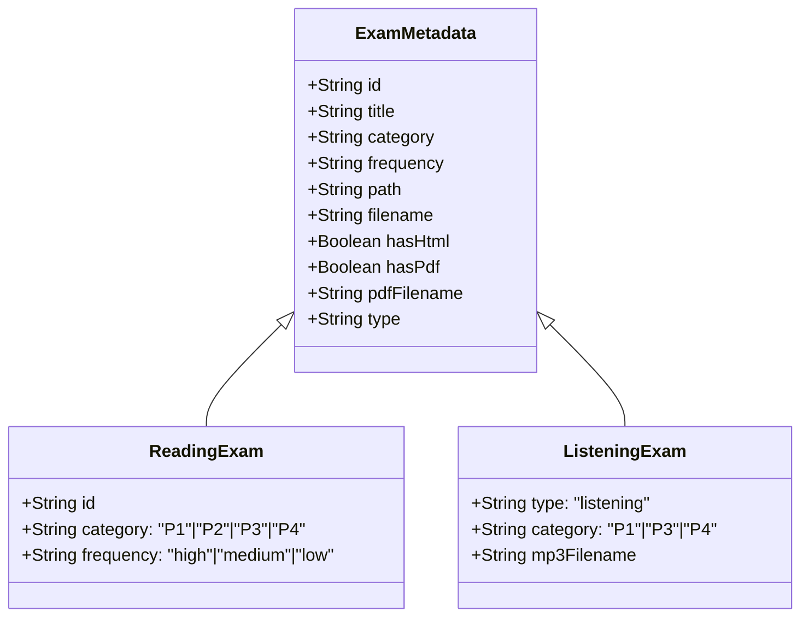
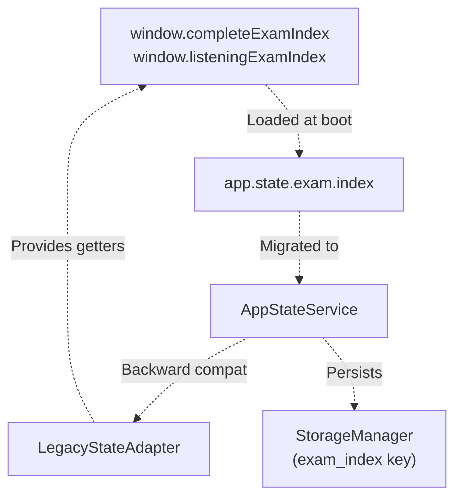
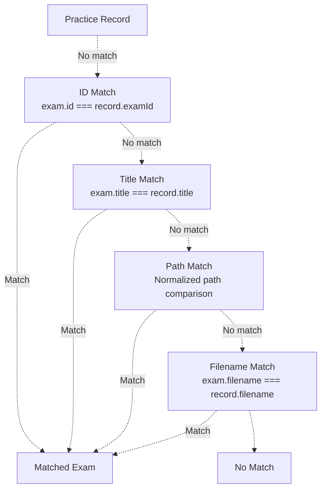
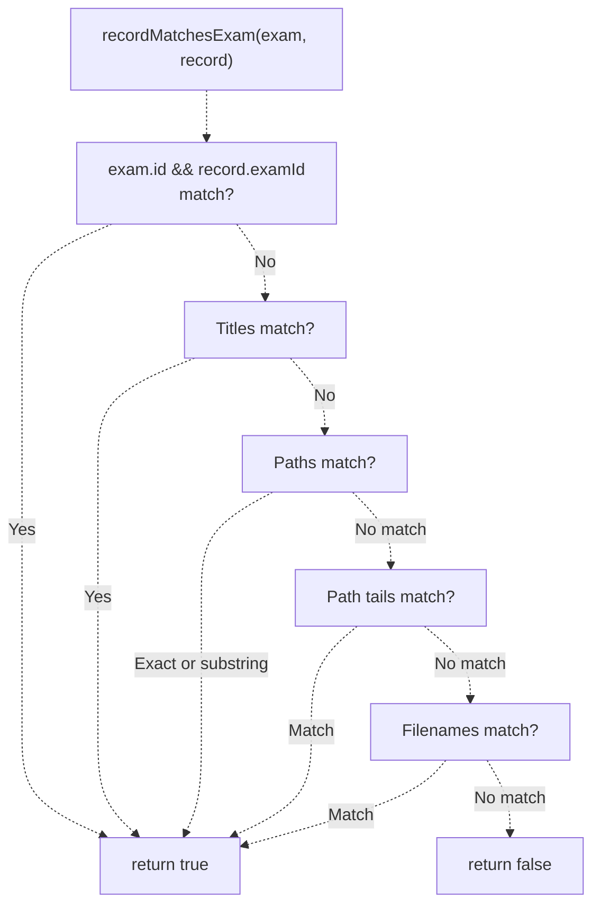
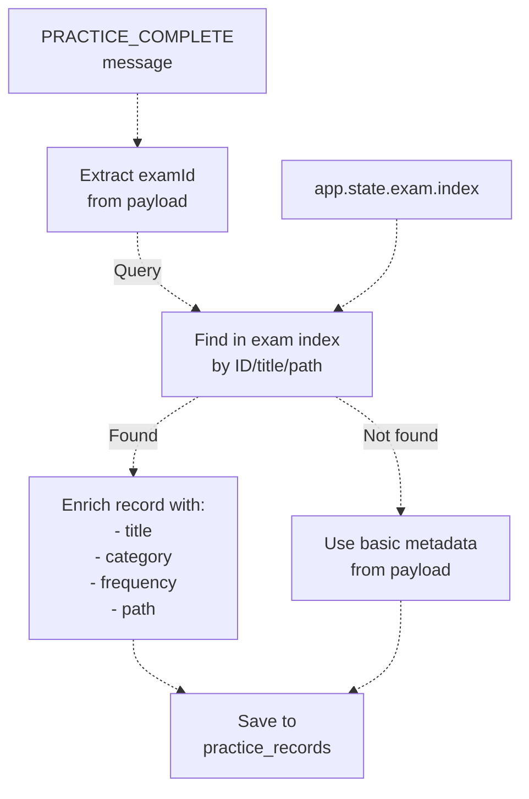
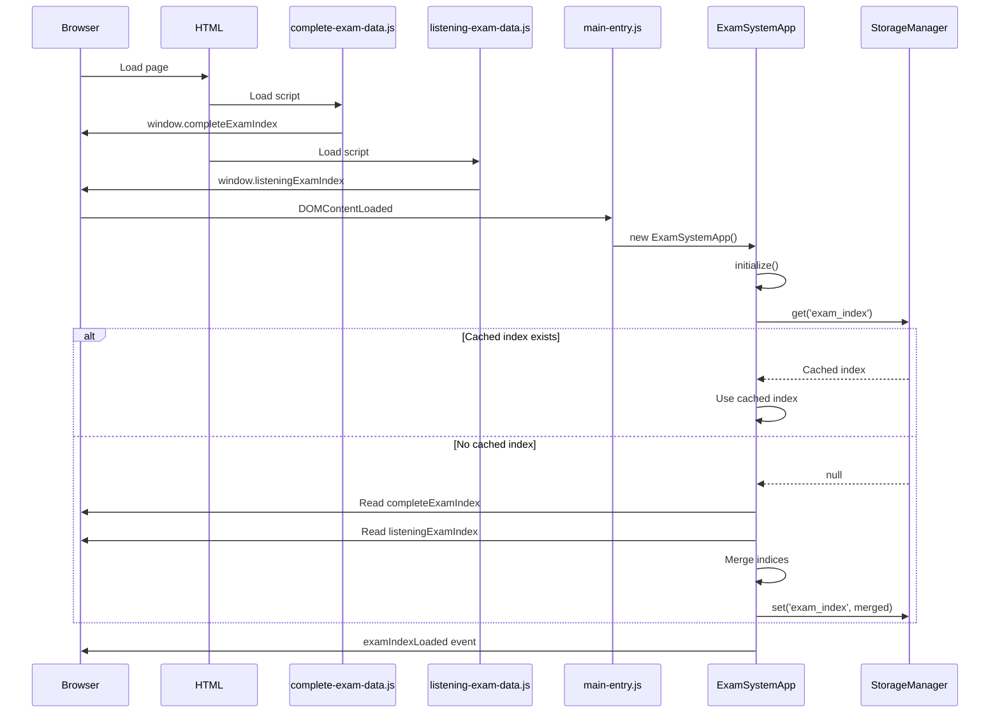

# Exam Index & Metadata Structure

> **Relevant source files**
> * [assets/scripts/complete-exam-data.js](https://github.com/sallowayma-git/IELTS-practice/blob/92f64eb8/assets/scripts/complete-exam-data.js)
> * [assets/scripts/listening-exam-data.js](https://github.com/sallowayma-git/IELTS-practice/blob/92f64eb8/assets/scripts/listening-exam-data.js)
> * [css/heroui-bridge.css](https://github.com/sallowayma-git/IELTS-practice/blob/92f64eb8/css/heroui-bridge.css)
> * [css/main.css](https://github.com/sallowayma-git/IELTS-practice/blob/92f64eb8/css/main.css)
> * [index.html](https://github.com/sallowayma-git/IELTS-practice/blob/92f64eb8/index.html)
> * [js/app.js](https://github.com/sallowayma-git/IELTS-practice/blob/92f64eb8/js/app.js)
> * [js/boot-fallbacks.js](https://github.com/sallowayma-git/IELTS-practice/blob/92f64eb8/js/boot-fallbacks.js)
> * [js/components/PerformanceOptimizer.js](https://github.com/sallowayma-git/IELTS-practice/blob/92f64eb8/js/components/PerformanceOptimizer.js)
> * [js/main.js](https://github.com/sallowayma-git/IELTS-practice/blob/92f64eb8/js/main.js)
> * [js/views/legacyViewBundle.js](https://github.com/sallowayma-git/IELTS-practice/blob/92f64eb8/js/views/legacyViewBundle.js)

## Purpose and Scope

This document details the exam index data structure and metadata schema used throughout the IELTS practice system. The exam index is the canonical source of all available exams (both reading and listening), including their paths, categories, and resource availability.

For information about how the library system manages multiple exam collections and path resolution, see [Library Management & Configuration System](/sallowayma-git/IELTS-practice/6.2-library-management-and-configuration-system). For details on how exam resources are loaded and resolved at runtime, see [Path Resolution & Resource Management](/sallowayma-git/IELTS-practice/6.3-path-resolution-and-resource-management).

---

## Exam Index Data Sources

The system maintains two primary exam indices loaded from global JavaScript files:

### Reading Exam Index

The reading exam index is defined in `window.completeExamIndex` and loaded from [assets/scripts/complete-exam-data.js](https://github.com/sallowayma-git/IELTS-practice/blob/92f64eb8/assets/scripts/complete-exam-data.js)

 This array contains exam entries for all reading passages organized into difficulty categories (P1, P2, P3, P4).

**Sources:** [assets/scripts/complete-exam-data.js L1-L10](https://github.com/sallowayma-git/IELTS-practice/blob/92f64eb8/assets/scripts/complete-exam-data.js#L1-L10)

### Listening Exam Index

The listening exam index is defined in `window.listeningExamIndex` and loaded from [assets/scripts/listening-exam-data.js](https://github.com/sallowayma-git/IELTS-practice/blob/92f64eb8/assets/scripts/listening-exam-data.js)

 This array contains listening practice exams with additional audio file metadata.

**Sources:** [assets/scripts/listening-exam-data.js L1-L16](https://github.com/sallowayma-git/IELTS-practice/blob/92f64eb8/assets/scripts/listening-exam-data.js#L1-L16)

### Exam Index Merging

At runtime, these indices are merged into a single unified index stored in application state. The distinction between reading and listening exams is preserved through the `type` metadata field.

**Sources:** [js/main.js L13-L21](https://github.com/sallowayma-git/IELTS-practice/blob/92f64eb8/js/main.js#L13-L21)

---

## Exam Metadata Schema

Each exam entry in the index conforms to the following metadata structure:

### Core Metadata Fields



**Exam Metadata Field Definitions:**

| Field | Type | Required | Description |
| --- | --- | --- | --- |
| `id` | String | Yes | Unique identifier for the exam (e.g., `"p1-high-01"`, `"listening-p3-01"`) |
| `title` | String | Yes | Display title of the exam |
| `category` | String | Yes | Difficulty category: `"P1"`, `"P2"`, `"P3"`, `"P4"` |
| `frequency` | String | No | Exam frequency: `"high"`, `"medium"`, `"low"` (reading only) |
| `type` | String | No | Exam type: `"listening"` (only present for listening exams) |
| `path` | String | Yes | Relative directory path to exam resources |
| `filename` | String | Yes* | HTML file name (* may be empty if `hasHtml` is false) |
| `hasHtml` | Boolean | Yes | Whether HTML version exists |
| `hasPdf` | Boolean | Yes | Whether PDF version exists |
| `pdfFilename` | String | No | PDF file name if `hasPdf` is true |
| `mp3Filename` | String | No | Audio file name for listening exams |

**Sources:** [assets/scripts/complete-exam-data.js L4-L15](https://github.com/sallowayma-git/IELTS-practice/blob/92f64eb8/assets/scripts/complete-exam-data.js#L4-L15)

 [assets/scripts/listening-exam-data.js L4-L16](https://github.com/sallowayma-git/IELTS-practice/blob/92f64eb8/assets/scripts/listening-exam-data.js#L4-L16)

---

## Metadata Examples

### Reading Exam Example

```yaml
{
    id: 'p1-high-01',
    title: 'A Brief History of Tea 茶叶简史',
    category: 'P1',
    frequency: 'high',
    path: '睡着过项目组/2. 所有文章(11.20)[192篇]/1. P1 - A Brief History of Tea 茶叶简史【高】/',
    filename: '1. P1 - A Brief History of Tea 茶叶简史【高】.html',
    hasHtml: true,
    hasPdf: true,
    pdfFilename: '1. P1 - A Brief History of Tea 茶叶简史【高】.pdf'
}
```

**Sources:** [assets/scripts/complete-exam-data.js L5-L15](https://github.com/sallowayma-git/IELTS-practice/blob/92f64eb8/assets/scripts/complete-exam-data.js#L5-L15)

### Listening Exam Example

```yaml
{
    id: 'listening-p3-01',
    type: 'listening',
    title: 'Julia and Bob's science project is due',
    category: 'P3',
    path: 'ListeningPractice/P3/1. PART3 Julia and Bob's science project is due/',
    filename: '1. PART3 Julia and Bob's science project is due.html',
    hasHtml: true,
    hasPdf: true,
    pdfFilename: 'PART3 Julia and Bob's science project is due.pdf',
    mp3Filename: 'audio.mp3'
}
```

**Sources:** [assets/scripts/listening-exam-data.js L5-L16](https://github.com/sallowayma-git/IELTS-practice/blob/92f64eb8/assets/scripts/listening-exam-data.js#L5-L16)

### Exam Without HTML Example

Some exams only have PDF resources:

```yaml
{
    id: 'p2-high-26',
    title: '（无题目） Muscle Loss 肌肉流失',
    category: 'P2',
    frequency: 'high',
    path: '睡着过项目组/2. 所有文章(11.20)[192篇]/121.（无题目） P2 - Muscle Loss 肌肉流失【高】/',
    filename: '',
    hasHtml: false,
    hasPdf: true,
    pdfFilename: '121. P2 - Muscle Loss 肌肉流失【高】.pdf'
}
```

**Sources:** [assets/scripts/complete-exam-data.js L282-L290](https://github.com/sallowayma-git/IELTS-practice/blob/92f64eb8/assets/scripts/complete-exam-data.js#L282-L290)

---

## Exam Index State Management

### State Structure

The exam index is stored in the application state object managed by `ExamSystemApp`:



**State Access Patterns:**

The exam index is accessible through multiple interfaces for backward compatibility:

1. **Modern State Service** (preferred): Via `AppStateService` methods
2. **Application State**: Via `app.state.exam.index`
3. **Legacy Global Variables**: Via `window.completeExamIndex` and `window.listeningExamIndex`
4. **Legacy Adapter**: Via `LegacyStateAdapter.getInstance()`

**Sources:** [js/main.js L13-L22](https://github.com/sallowayma-git/IELTS-practice/blob/92f64eb8/js/main.js#L13-L22)

 [js/app.js L13-L22](https://github.com/sallowayma-git/IELTS-practice/blob/92f64eb8/js/app.js#L13-L22)

### State Access Functions

State accessor functions are provided as property shims in [js/main.js](https://github.com/sallowayma-git/IELTS-practice/blob/92f64eb8/js/main.js)

:

```javascript
function getExamIndexState() {
    if (window.appStateService) {
        return window.appStateService.getExamIndex();
    }
    // Fallback to global variables
    return window.completeExamIndex || [];
}

function setExamIndexState(index) {
    if (window.appStateService) {
        window.appStateService.setExamIndex(index);
    }
    window.completeExamIndex = index;
}
```

**Sources:** [js/main.js L48-L79](https://github.com/sallowayma-git/IELTS-practice/blob/92f64eb8/js/main.js#L48-L79)

---

## Exam Matching and Identification

### Matching Strategy

The system uses multiple strategies to match exam metadata with practice records, as records may contain incomplete or variant identifiers:



### Path Normalization

Path normalization is critical for matching exams across different storage formats:

```javascript
function normalizePathValue(path) {
    if (!path) return '';
    var normalized = String(path)
        .replace(/\\/g, '/')
        .trim()
        .toLowerCase();
    normalized = normalized.replace(/^\.?\//, '');
    return normalized;
}

function getPathTail(path) {
    var normalized = normalizePathValue(path);
    var parts = normalized.split('/').filter(Boolean);
    if (!parts.length) return '';
    if (parts.length === 1) return parts[0];
    return parts.slice(-2).join('/');
}
```

**Sources:** [js/views/legacyViewBundle.js L65-L84](https://github.com/sallowayma-git/IELTS-practice/blob/92f64eb8/js/views/legacyViewBundle.js#L65-L84)

### Record Matching Function

The `recordMatchesExam()` function implements the complete matching logic:



**Sources:** [js/views/legacyViewBundle.js L86-L127](https://github.com/sallowayma-git/IELTS-practice/blob/92f64eb8/js/views/legacyViewBundle.js#L86-L127)

---

## Category and Type Classification

### Category Taxonomy

Exam categories follow a difficulty-based taxonomy:

| Category | Description | Typical Exams |
| --- | --- | --- |
| `P1` | Passage 1 - Basic level | 50+ reading exams |
| `P2` | Passage 2 - Intermediate level | 60+ reading exams |
| `P3` | Passage 3 - Advanced level | 60+ reading exams |
| `P4` | Passage 4 - Expert level | 20+ reading exams |

**Sources:** [assets/scripts/complete-exam-data.js L6-L9](https://github.com/sallowayma-git/IELTS-practice/blob/92f64eb8/assets/scripts/complete-exam-data.js#L6-L9)

### Type Normalization

The system normalizes exam types to handle various input formats:

```javascript
function normalizeTypeValue(value) {
    if (!value) return '';
    var normalized = String(value).toLowerCase();
    if (normalized.indexOf('read') !== -1 || 
        normalized.indexOf('阅读') !== -1) {
        return 'reading';
    }
    if (normalized.indexOf('listen') !== -1 || 
        normalized.indexOf('听力') !== -1) {
        return 'listening';
    }
    return normalized;
}
```

**Sources:** [js/views/legacyViewBundle.js L11-L23](https://github.com/sallowayma-git/IELTS-practice/blob/92f64eb8/js/views/legacyViewBundle.js#L11-L23)

### Type Detection in Records

When matching practice records to exams, the system checks multiple metadata locations:

```javascript
var recordType = normalizeTypeValue(
    record.type ||
    record.examType ||
    (record.metadata && record.metadata.type) ||
    (record.realData && record.realData.type)
);
```

**Sources:** [js/views/legacyViewBundle.js L220-L225](https://github.com/sallowayma-git/IELTS-practice/blob/92f64eb8/js/views/legacyViewBundle.js#L220-L225)

---

## Frequency Classification

Reading exams include a `frequency` field indicating how often they appear in actual IELTS tests:

| Frequency | Description | Typical Use |
| --- | --- | --- |
| `high` | Frequently appears in tests | Priority practice material |
| `medium` | Occasionally appears | Supplementary practice |
| `low` | Rarely appears | Additional practice |

This metadata is used for:

* Filtering exams by importance
* Recommending practice order
* Displaying exam priority in the UI

**Note:** Listening exams do not include frequency classification.

**Sources:** [assets/scripts/complete-exam-data.js L9](https://github.com/sallowayma-git/IELTS-practice/blob/92f64eb8/assets/scripts/complete-exam-data.js#L9-L9)

---

## Resource Availability Flags

### HTML and PDF Availability

Each exam entry includes boolean flags indicating resource availability:

| Flag | Purpose |
| --- | --- |
| `hasHtml` | Indicates if interactive HTML version exists |
| `hasPdf` | Indicates if PDF version exists |

These flags enable:

* UI to show/hide appropriate action buttons
* Resource resolution logic to attempt correct format
* Fallback handling when preferred format is unavailable

### Filename Fields

When resources exist, corresponding filename fields provide the exact file name:

| Field | Condition | Purpose |
| --- | --- | --- |
| `filename` | When `hasHtml === true` | HTML file name |
| `pdfFilename` | When `hasPdf === true` | PDF file name |
| `mp3Filename` | For listening exams | Audio file name (typically `"audio.mp3"`) |

**Sources:** [assets/scripts/complete-exam-data.js L11-L14](https://github.com/sallowayma-git/IELTS-practice/blob/92f64eb8/assets/scripts/complete-exam-data.js#L11-L14)

 [assets/scripts/listening-exam-data.js L13-L15](https://github.com/sallowayma-git/IELTS-practice/blob/92f64eb8/assets/scripts/listening-exam-data.js#L13-L15)

---

## Path Structure and Conventions

### Reading Exam Path Pattern

Reading exam paths follow this structure:

```
<base_path>/<article_number>. <category> - <title>【<frequency>】/
```

**Example:**

```
睡着过项目组/2. 所有文章(11.20)[192篇]/1. P1 - A Brief History of Tea 茶叶简史【高】/
```

**Components:**

* Base path: `睡着过项目组/2. 所有文章(11.20)[192篇]`
* Article number: `1`
* Category: `P1`
* Title: `A Brief History of Tea 茶叶简史`
* Frequency marker: `【高】` (high frequency)

**Sources:** [assets/scripts/complete-exam-data.js L10](https://github.com/sallowayma-git/IELTS-practice/blob/92f64eb8/assets/scripts/complete-exam-data.js#L10-L10)

### Listening Exam Path Pattern

Listening exam paths follow this structure:

```html
ListeningPractice/<category>/<number>. <part_prefix> <title>/
```

**Example:**

```
ListeningPractice/P3/1. PART3 Julia and Bob's science project is due/
```

**Components:**

* Base path: `ListeningPractice`
* Category subfolder: `P3`
* Number and part prefix: `1. PART3`
* Title: `Julia and Bob's science project is due`

**Sources:** [assets/scripts/listening-exam-data.js L10](https://github.com/sallowayma-git/IELTS-practice/blob/92f64eb8/assets/scripts/listening-exam-data.js#L10-L10)

---

## Integration with Practice Records

### Exam Metadata Enrichment

When practice records are created, they are enriched with exam metadata from the index:



**Record Enrichment Logic:**

```javascript
const list = getExamIndexState();
let exam = list.find(e => e.id === examId) || {};

// If not found by ID, try URL matching
if (!exam.id && realData.url) {
    const urlMatch = list.find(e => {
        // Path component matching logic
    });
    if (urlMatch) exam = urlMatch;
}

// If still not found, try title matching
if (!exam.id && realData.title) {
    const titleMatch = list.find(e => {
        // Normalized title comparison
    });
    if (titleMatch) exam = titleMatch;
}

// Enrich record with exam metadata
const record = {
    examId: examId,
    title: exam.title || realData.title || '',
    category: exam.category || extractCategoryFromUrl(realData.url),
    frequency: exam.frequency || 'unknown',
    // ... other fields
};
```

**Sources:** [js/main.js L858-L908](https://github.com/sallowayma-git/IELTS-practice/blob/92f64eb8/js/main.js#L858-L908)

### Category Extraction Fallback

When an exam is not found in the index, the system attempts to extract the category from the URL or title:

```javascript
let category = exam.category;
if (!category && realData.pageType) {
    category = realData.pageType;  // e.g., "P4"
}
if (!category && realData.url) {
    const match = realData.url.match(/\b(P[1-4])\b/i);
    if (match) category = match[1].toUpperCase();
}
if (!category && realData.title) {
    const match = realData.title.match(/\b(P[1-4])\b/i);
    if (match) category = match[1].toUpperCase();
}
if (!category) {
    category = 'Unknown';
}
```

**Sources:** [js/main.js L929-L944](https://github.com/sallowayma-git/IELTS-practice/blob/92f64eb8/js/main.js#L929-L944)

---

## Exam Index Loading and Caching

### Initial Load Sequence



**Sources:** [index.html L432-L443](https://github.com/sallowayma-git/IELTS-practice/blob/92f64eb8/index.html#L432-L443)

 [js/app.js L86-L124](https://github.com/sallowayma-git/IELTS-practice/blob/92f64eb8/js/app.js#L86-L124)

### Storage and Persistence

The merged exam index is persisted to `StorageManager` under the key `'exam_index'`:

* **Primary Storage:** IndexedDB (for large datasets)
* **Mirror Storage:** localStorage (for cross-tab synchronization)
* **Cache TTL:** Typically long-lived (refreshed on library reload)

**Sources:** [js/main.js L13-L22](https://github.com/sallowayma-git/IELTS-practice/blob/92f64eb8/js/main.js#L13-L22)

---

## Exam Filtering and Querying

### Filter State Management

The browse view maintains filter state for categories and types:

```yaml
ui: {
    browseFilter: { 
        category: 'all',  // 'all' | 'P1' | 'P2' | 'P3' | 'P4'
        type: 'all'       // 'all' | 'reading' | 'listening'
    }
}
```

**Sources:** [js/app.js L34-L35](https://github.com/sallowayma-git/IELTS-practice/blob/92f64eb8/js/app.js#L34-L35)

### Type Filtering Function

The `filterByExamType()` utility filters practice records by exam type:

```typescript
function filterByExamType(records, exams, type) {
    if (!type || type === 'all') {
        return ensureArray(records);
    }
    var targetType = normalizeTypeValue(type);
    var index = ensureArray(exams);
    
    return ensureArray(records).filter(function (record) {
        if (!record) return false;
        
        // Try to find exam in index
        var exam = index.find(function (item) {
            return item && (item.id === record.examId || 
                           item.title === record.title);
        });
        
        // Check exam type from index
        var examType = exam ? normalizeTypeValue(exam.type) : '';
        if (examType) {
            return examType === targetType;
        }
        
        // Fallback: check record's own type metadata
        var recordType = normalizeTypeValue(
            record.type ||
            record.examType ||
            (record.metadata && record.metadata.type) ||
            (record.realData && record.realData.type)
        );
        
        // If type unknown, show it to avoid hiding data
        return recordType ? (recordType === targetType) : true;
    });
}
```

**Sources:** [js/views/legacyViewBundle.js L203-L232](https://github.com/sallowayma-git/IELTS-practice/blob/92f64eb8/js/views/legacyViewBundle.js#L203-L232)

---

## Summary

The exam index and metadata structure provides:

1. **Unified Schema:** Consistent metadata across reading and listening exams
2. **Resource Tracking:** Flags and filenames for HTML, PDF, and audio resources
3. **Flexible Matching:** Multiple strategies to link records with exam metadata
4. **Category Taxonomy:** Difficulty-based organization (P1-P4)
5. **Type Classification:** Reading vs listening distinction
6. **Frequency Indicators:** Priority information for practice planning
7. **Path Conventions:** Structured directory organization
8. **State Management:** Integration with modern state service and legacy globals
9. **Persistence:** Cached in storage for performance
10. **Filtering Support:** Category and type-based querying

This metadata foundation enables the browse view, practice tracking, statistics calculation, and resource resolution throughout the application.