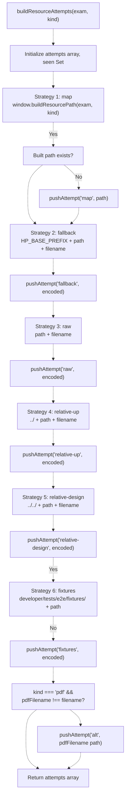
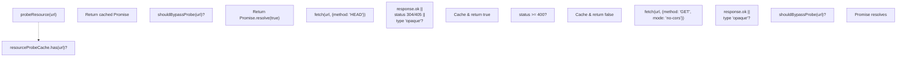
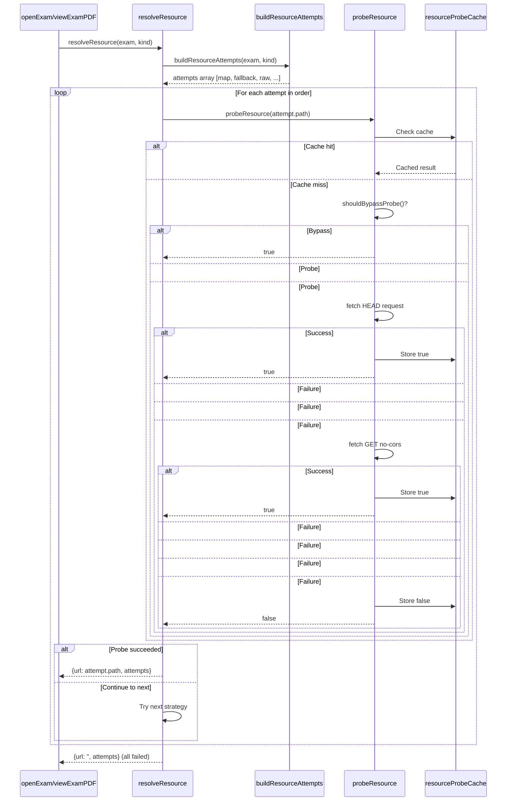
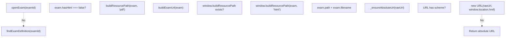
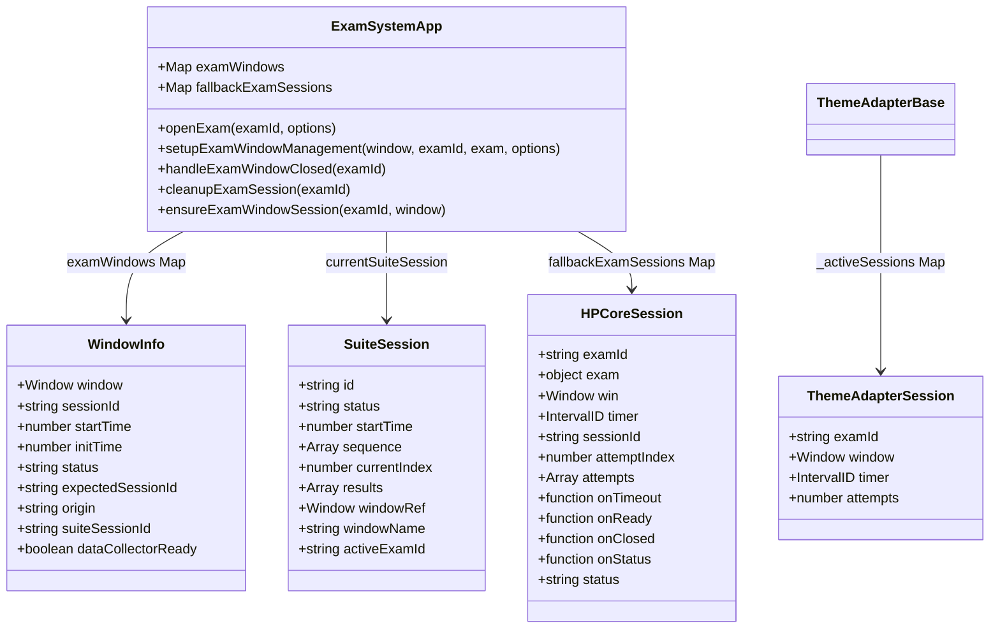
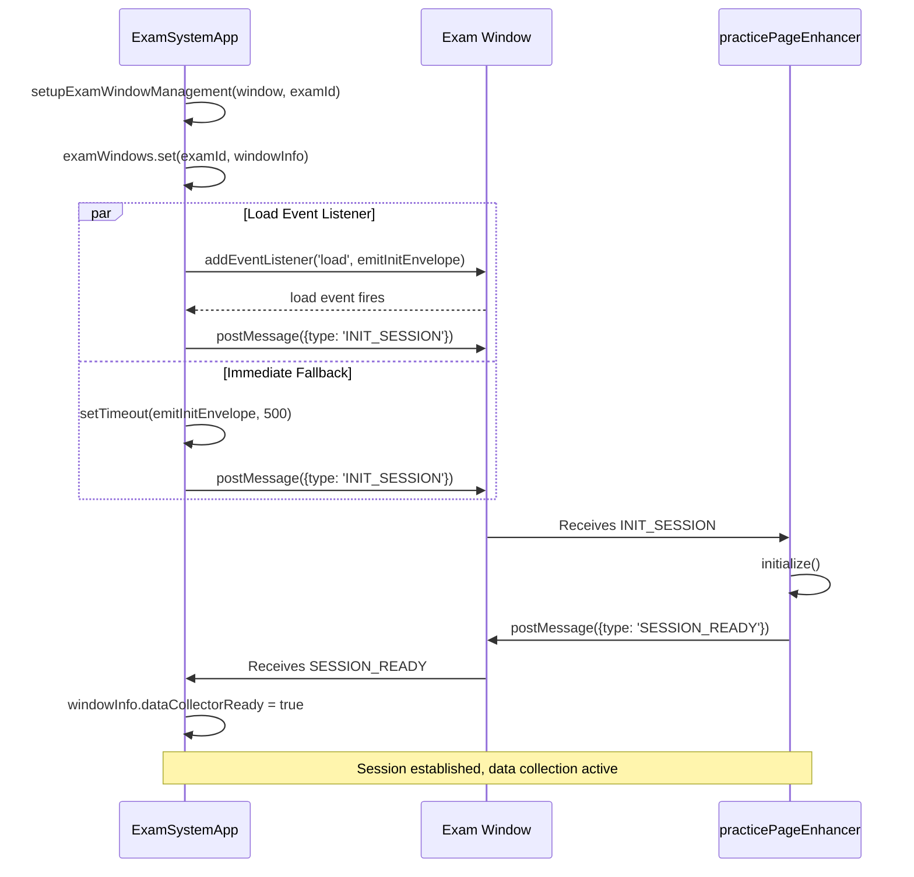
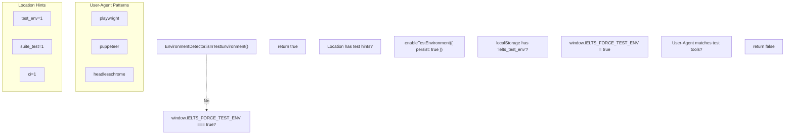
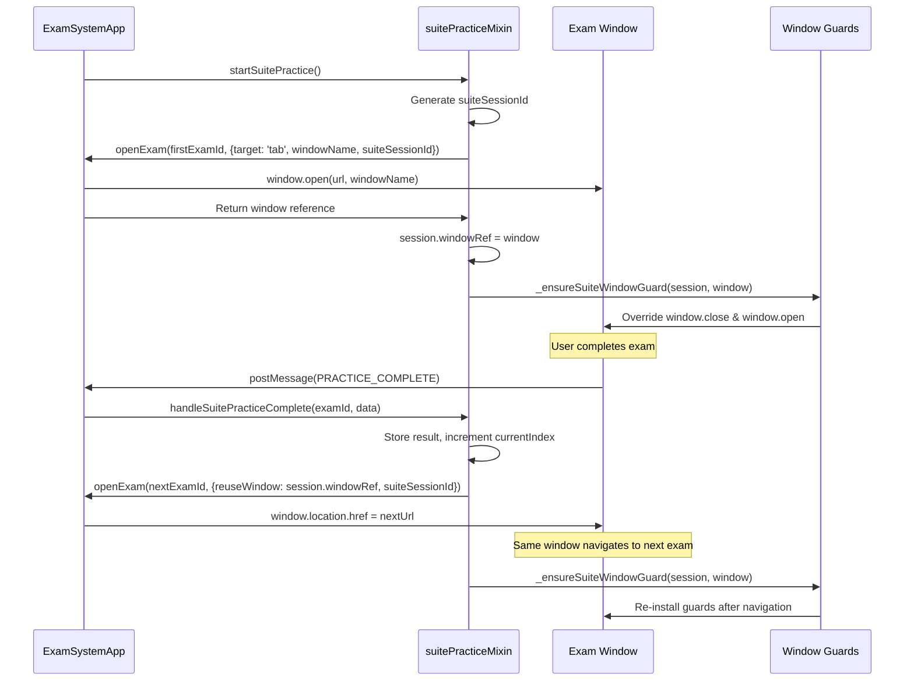

# Exam Window Management & Resource Resolution

> **Relevant source files**
> * [.superdesign/design_iterations/HP/Welcome.html](https://github.com/sallowayma-git/IELTS-practice/blob/92f64eb8/.superdesign/design_iterations/HP/Welcome.html)
> * [js/app/examSessionMixin.js](https://github.com/sallowayma-git/IELTS-practice/blob/92f64eb8/js/app/examSessionMixin.js)
> * [js/app/suitePracticeMixin.js](https://github.com/sallowayma-git/IELTS-practice/blob/92f64eb8/js/app/suitePracticeMixin.js)
> * [js/plugins/hp/hp-core-bridge.js](https://github.com/sallowayma-git/IELTS-practice/blob/92f64eb8/js/plugins/hp/hp-core-bridge.js)
> * [js/plugins/themes/theme-adapter-base.js](https://github.com/sallowayma-git/IELTS-practice/blob/92f64eb8/js/plugins/themes/theme-adapter-base.js)
> * [js/practice-page-enhancer.js](https://github.com/sallowayma-git/IELTS-practice/blob/92f64eb8/js/practice-page-enhancer.js)
> * [js/services/GlobalStateService.js](https://github.com/sallowayma-git/IELTS-practice/blob/92f64eb8/js/services/GlobalStateService.js)
> * [js/utils/answerComparisonUtils.js](https://github.com/sallowayma-git/IELTS-practice/blob/92f64eb8/js/utils/answerComparisonUtils.js)

## Purpose and Scope

This page documents how the application opens exam windows, resolves exam resource paths, manages window lifecycles, and handles failures gracefully. It covers the complete process from resource path construction through window opening strategies to error recovery mechanisms.

For details about what happens after the window opens (script injection and data collection), see [Practice Page Enhancement & Data Collection](/sallowayma-git/IELTS-practice/5.2-practice-page-enhancement-and-data-collection). For cross-window communication protocols, see [Cross-Window Communication Protocol](/sallowayma-git/IELTS-practice/5.3-cross-window-communication-protocol). For suite-specific window management, see [Suite Practice Mode](/sallowayma-git/IELTS-practice/5.4-exam-window-management-and-resource-resolution).

---

## Resource Resolution System

The application implements a sophisticated multi-strategy resource resolution system to locate exam HTML/PDF files across diverse deployment scenarios: local `file://` protocol, HTTP servers, GitHub Pages, nested theme directories, and development fixtures.

### Multi-Strategy Path Resolution Architecture

The system employs 5-7 fallback strategies in a specific order. Different subsystems implement variations:

**ThemeAdapterBase Strategy Order** (`PATH_FALLBACK_ORDER`):

1. **map** - External `window.buildResourcePath()` or `window.hpPath.buildResourcePath()`
2. **fallback** - `HP_BASE_PREFIX` + `exam.path` + `exam.filename`
3. **raw** - Direct `exam.path` + `exam.filename`
4. **relative-up** - `../` + `exam.path` + `exam.filename`
5. **relative-design** - `../../` + `exam.path` + `exam.filename` (for `.superdesign/design_iterations/` themes)

**HP Core Extended Strategies** (adds 2 more):
6. **fixtures** - `developer/tests/e2e/fixtures/` + folder + filename
7. **alt** - Alternate PDF filename if different from HTML filename



**Sources:** [js/plugins/hp/hp-core-bridge.js L510-L567](https://github.com/sallowayma-git/IELTS-practice/blob/92f64eb8/js/plugins/hp/hp-core-bridge.js#L510-L567)

 [js/plugins/themes/theme-adapter-base.js L29-L695](https://github.com/sallowayma-git/IELTS-practice/blob/92f64eb8/js/plugins/themes/theme-adapter-base.js#L29-L695)

### Resource Probing with Caching

To avoid navigation errors, the system probes resources before opening windows. The `hpCore` bridge implements a sophisticated probing mechanism with caching.

**Probing Flow:**



**Bypass Conditions** (`shouldBypassProbe`):

* Protocol is `file://`, `app://`, `chrome-extension://`, `capacitor://`, `ionic://`
* Current page is on `file://` protocol and URL is relative
* `window.__HP_DISABLE_PROBE__` is `true`

**Sources:** [js/plugins/hp/hp-core-bridge.js L425-L608](https://github.com/sallowayma-git/IELTS-practice/blob/92f64eb8/js/plugins/hp/hp-core-bridge.js#L425-L608)

### Resource Attempt Resolution Process

The `resolveResource` function combines strategy generation with probing:



**Sources:** [js/plugins/hp/hp-core-bridge.js L610-L624](https://github.com/sallowayma-git/IELTS-practice/blob/92f64eb8/js/plugins/hp/hp-core-bridge.js#L610-L624)

### Resource Path Construction Flow

After resolution succeeds, the main exam session mixin constructs URLs:



**Sources:** [js/app/examSessionMixin.js L89-L193](https://github.com/sallowayma-git/IELTS-practice/blob/92f64eb8/js/app/examSessionMixin.js#L89-L193)

### Key Resolution Functions

| Function | File | Purpose |
| --- | --- | --- |
| `findExamDefinition(examId)` | examSessionMixin.js | Searches active exam index → `global.examIndex` → `global.completeExamIndex` → `global.listeningExamIndex` |
| `buildExamUrl(exam)` | examSessionMixin.js | Uses `window.buildResourcePath` if available, otherwise concatenates `exam.path + exam.filename` |
| `_ensureAbsoluteUrl(rawUrl)` | examSessionMixin.js | Detects existing scheme, resolves via `new URL(rawUrl, window.location.href)`, falls back to original |
| `buildResourceAttempts(exam, kind)` | hp-core-bridge.js | Generates 5-7 path strategies with deduplication |
| `probeResource(url)` | hp-core-bridge.js | Probes resource availability with HEAD/GET, caches results in `resourceProbeCache` Map |
| `resolveResource(exam, kind)` | hp-core-bridge.js | Iterates through attempts, returns first successful probe |
| `getResourceAttempts(exam, kind)` | theme-adapter-base.js | Similar to `buildResourceAttempts`, returns 5-strategy list |

**Sources:** [js/app/examSessionMixin.js L5-L273](https://github.com/sallowayma-git/IELTS-practice/blob/92f64eb8/js/app/examSessionMixin.js#L5-L273)

 [js/plugins/hp/hp-core-bridge.js L510-L624](https://github.com/sallowayma-git/IELTS-practice/blob/92f64eb8/js/plugins/hp/hp-core-bridge.js#L510-L624)

 [js/plugins/themes/theme-adapter-base.js L644-L695](https://github.com/sallowayma-git/IELTS-practice/blob/92f64eb8/js/plugins/themes/theme-adapter-base.js#L644-L695)

### Path Encoding and Normalization

The resolution system includes utilities for path manipulation:

**Path Normalization Functions:**

* `normalizeBasePath(value)` - Converts backslashes to forward slashes, removes trailing slashes
* `normalizePathSegment(value)` - Removes leading/trailing slashes
* `isAbsolutePath(value)` - Checks for `http://`, `file://`, or Windows drive letters
* `joinResourcePath(base, folder, file)` - Concatenates segments intelligently
* `encodeResourcePath(path)` - URI-encodes while handling `#` characters

```javascript
// Example from hp-core-bridge.js:484-488
function encodeResourcePath(path) {
    if (!path) return '';
    if (isAbsolutePath(path)) return path;
    return encodeURI(path).replace(/#/g, '%23');
}
```

**Sources:** [js/plugins/hp/hp-core-bridge.js L453-L501](https://github.com/sallowayma-git/IELTS-practice/blob/92f64eb8/js/plugins/hp/hp-core-bridge.js#L453-L501)

 [js/plugins/themes/theme-adapter-base.js L66-L115](https://github.com/sallowayma-git/IELTS-practice/blob/92f64eb8/js/plugins/themes/theme-adapter-base.js#L66-L115)

---

## Exam Window Opening Strategies

The application employs multiple strategies for opening exam windows, with automatic fallback to ensure exams always open even when popup blockers interfere.

### Window Opening Decision Tree

```css
#mermaid-fquwcpxifyv{font-family:ui-sans-serif,-apple-system,system-ui,Segoe UI,Helvetica;font-size:16px;fill:#333;}@keyframes edge-animation-frame{from{stroke-dashoffset:0;}}@keyframes dash{to{stroke-dashoffset:0;}}#mermaid-fquwcpxifyv .edge-animation-slow{stroke-dasharray:9,5!important;stroke-dashoffset:900;animation:dash 50s linear infinite;stroke-linecap:round;}#mermaid-fquwcpxifyv .edge-animation-fast{stroke-dasharray:9,5!important;stroke-dashoffset:900;animation:dash 20s linear infinite;stroke-linecap:round;}#mermaid-fquwcpxifyv .error-icon{fill:#dddddd;}#mermaid-fquwcpxifyv .error-text{fill:#222222;stroke:#222222;}#mermaid-fquwcpxifyv .edge-thickness-normal{stroke-width:1px;}#mermaid-fquwcpxifyv .edge-thickness-thick{stroke-width:3.5px;}#mermaid-fquwcpxifyv .edge-pattern-solid{stroke-dasharray:0;}#mermaid-fquwcpxifyv .edge-thickness-invisible{stroke-width:0;fill:none;}#mermaid-fquwcpxifyv .edge-pattern-dashed{stroke-dasharray:3;}#mermaid-fquwcpxifyv .edge-pattern-dotted{stroke-dasharray:2;}#mermaid-fquwcpxifyv .marker{fill:#999;stroke:#999;}#mermaid-fquwcpxifyv .marker.cross{stroke:#999;}#mermaid-fquwcpxifyv svg{font-family:ui-sans-serif,-apple-system,system-ui,Segoe UI,Helvetica;font-size:16px;}#mermaid-fquwcpxifyv p{margin:0;}#mermaid-fquwcpxifyv defs #statediagram-barbEnd{fill:#999;stroke:#999;}#mermaid-fquwcpxifyv g.stateGroup text{fill:#dddddd;stroke:none;font-size:10px;}#mermaid-fquwcpxifyv g.stateGroup text{fill:#333;stroke:none;font-size:10px;}#mermaid-fquwcpxifyv g.stateGroup .state-title{font-weight:bolder;fill:#333;}#mermaid-fquwcpxifyv g.stateGroup rect{fill:#ffffff;stroke:#dddddd;}#mermaid-fquwcpxifyv g.stateGroup line{stroke:#999;stroke-width:1;}#mermaid-fquwcpxifyv .transition{stroke:#999;stroke-width:1;fill:none;}#mermaid-fquwcpxifyv .stateGroup .composit{fill:#f4f4f4;border-bottom:1px;}#mermaid-fquwcpxifyv .stateGroup .alt-composit{fill:#e0e0e0;border-bottom:1px;}#mermaid-fquwcpxifyv .state-note{stroke:#e6d280;fill:#fff5ad;}#mermaid-fquwcpxifyv .state-note text{fill:#333;stroke:none;font-size:10px;}#mermaid-fquwcpxifyv .stateLabel .box{stroke:none;stroke-width:0;fill:#ffffff;opacity:0.5;}#mermaid-fquwcpxifyv .edgeLabel .label rect{fill:#ffffff;opacity:0.5;}#mermaid-fquwcpxifyv .edgeLabel{background-color:#ffffff;text-align:center;}#mermaid-fquwcpxifyv .edgeLabel p{background-color:#ffffff;}#mermaid-fquwcpxifyv .edgeLabel rect{opacity:0.5;background-color:#ffffff;fill:#ffffff;}#mermaid-fquwcpxifyv .edgeLabel .label text{fill:#333;}#mermaid-fquwcpxifyv .label div .edgeLabel{color:#333;}#mermaid-fquwcpxifyv .stateLabel text{fill:#333;font-size:10px;font-weight:bold;}#mermaid-fquwcpxifyv .node circle.state-start{fill:#999;stroke:#999;}#mermaid-fquwcpxifyv .node .fork-join{fill:#999;stroke:#999;}#mermaid-fquwcpxifyv .node circle.state-end{fill:#dddddd;stroke:#f4f4f4;stroke-width:1.5;}#mermaid-fquwcpxifyv .end-state-inner{fill:#f4f4f4;stroke-width:1.5;}#mermaid-fquwcpxifyv .node rect{fill:#ffffff;stroke:#dddddd;stroke-width:1px;}#mermaid-fquwcpxifyv .node polygon{fill:#ffffff;stroke:#dddddd;stroke-width:1px;}#mermaid-fquwcpxifyv #statediagram-barbEnd{fill:#999;}#mermaid-fquwcpxifyv .statediagram-cluster rect{fill:#ffffff;stroke:#dddddd;stroke-width:1px;}#mermaid-fquwcpxifyv .cluster-label,#mermaid-fquwcpxifyv .nodeLabel{color:#333;}#mermaid-fquwcpxifyv .statediagram-cluster rect.outer{rx:5px;ry:5px;}#mermaid-fquwcpxifyv .statediagram-state .divider{stroke:#dddddd;}#mermaid-fquwcpxifyv .statediagram-state .title-state{rx:5px;ry:5px;}#mermaid-fquwcpxifyv .statediagram-cluster.statediagram-cluster .inner{fill:#f4f4f4;}#mermaid-fquwcpxifyv .statediagram-cluster.statediagram-cluster-alt .inner{fill:#f8f8f8;}#mermaid-fquwcpxifyv .statediagram-cluster .inner{rx:0;ry:0;}#mermaid-fquwcpxifyv .statediagram-state rect.basic{rx:5px;ry:5px;}#mermaid-fquwcpxifyv .statediagram-state rect.divider{stroke-dasharray:10,10;fill:#f8f8f8;}#mermaid-fquwcpxifyv .note-edge{stroke-dasharray:5;}#mermaid-fquwcpxifyv .statediagram-note rect{fill:#fff5ad;stroke:#e6d280;stroke-width:1px;rx:0;ry:0;}#mermaid-fquwcpxifyv .statediagram-note rect{fill:#fff5ad;stroke:#e6d280;stroke-width:1px;rx:0;ry:0;}#mermaid-fquwcpxifyv .statediagram-note text{fill:#333;}#mermaid-fquwcpxifyv .statediagram-note .nodeLabel{color:#333;}#mermaid-fquwcpxifyv .statediagram .edgeLabel{color:red;}#mermaid-fquwcpxifyv #dependencyStart,#mermaid-fquwcpxifyv #dependencyEnd{fill:#999;stroke:#999;stroke-width:1;}#mermaid-fquwcpxifyv .statediagramTitleText{text-anchor:middle;font-size:18px;fill:#333;}#mermaid-fquwcpxifyv :root{--mermaid-font-family:"trebuchet ms",verdana,arial,sans-serif;}OpenPDFopenExam(examId, options)Build PDF URLoptions.reuseWindow existsNo reuse windowwindow.location.href = pdfUrloptions.target === 'tab'Defaultwindow.open(url, '_blank')window.open(url, name, features)Window blockedWindow openedwindow.location.href = pdfUrlexam.hasHtml === falseexam.hasHtml !== falseCheckHasHtmlOpenHTMLbuildExamUrl(exam)URL constructedoptions.reuseWindow existsNo reuseReuse successfuloptions.target === 'tab'DefaultBlockedOpened_guardExamWindowContentwindow.location.href = urlinjectDataCollectionScriptsetupExamWindowManagementBuildURLCheckReuseHTMLReuseWindowHTMLCheckTargetHTMLInjectScriptsOpenTabHTMLOpenPopupHTMLCheckBlockedHTMLNavigateSameHTMLGuardWindowStartSessionSetupManagementCheckReuseReuseWindowCheckTargetSuccessOpenTabOpenPopupTabSuccessPopupSuccessCheckBlockedNavigateSame
```

**Sources:** [js/app/examSessionMixin.js L89-L252](https://github.com/sallowayma-git/IELTS-practice/blob/92f64eb8/js/app/examSessionMixin.js#L89-L252)

### Window Opening Modes

The `openExamWindow` function [js/app/examSessionMixin.js L198-L252](https://github.com/sallowayma-git/IELTS-practice/blob/92f64eb8/js/app/examSessionMixin.js#L198-L252)

 supports three distinct modes with automatic fallback:

| Mode | Trigger | Behavior | Use Case |
| --- | --- | --- | --- |
| **Window Reuse** | `options.reuseWindow` provided | `reuseWindow.location.href = finalUrl` | Suite practice sequential exams |
| **Tab Mode** | `options.target === 'tab'` | `window.open(finalUrl, requestedName)` | User preference for tabs |
| **Popup Mode** | Default | `window.open(finalUrl, name, features)` | Standard practice sessions |

**1. Window Reuse Mode** (Suite Practice)

```
// Reuses existing window reference
if (reuseWindow && !reuseWindow.closed) {
    reuseWindow.location.href = finalUrl;
    reuseWindow.focus();
    return reuseWindow;
}
```

Critical for suite practice to avoid popup blockers when transitioning between exams. The suite mixin provides `session.windowRef` as the `reuseWindow` parameter [js/app/examSessionMixin.js L201-L209](https://github.com/sallowayma-git/IELTS-practice/blob/92f64eb8/js/app/examSessionMixin.js#L201-L209)

**2. Tab Mode**

```javascript
// Opens in new tab with optional custom name
const requestedName = typeof options.windowName === 'string' && options.windowName.trim()
    ? options.windowName.trim()
    : '_blank';
tabWindow = window.open(finalUrl, requestedName);
```

Allows targeting a specific named tab or using `_blank` for anonymous tabs [js/app/examSessionMixin.js L211-L226](https://github.com/sallowayma-git/IELTS-practice/blob/92f64eb8/js/app/examSessionMixin.js#L211-L226)

**3. Popup Window Mode** (Default)

```javascript
// Centered popup with calculated dimensions
const windowFeatures = this.calculateWindowFeatures();
examWindow = window.open(finalUrl, `exam_${exam.id}`, windowFeatures);
```

Uses `calculateWindowFeatures()` to compute 80% screen dimensions with centered positioning [js/app/examSessionMixin.js L228-L239](https://github.com/sallowayma-git/IELTS-practice/blob/92f64eb8/js/app/examSessionMixin.js#L228-L239)

### Popup Blocker Fallback Strategy

The system implements defensive fallback when popup blockers interfere:

```
if (!examWindow) {
    try {
        window.location.href = finalUrl;
        return window; // Current window becomes exam window
    } catch (e) {
        throw new Error('Unable to open exam window, check popup settings');
    }
}
```

This same-window navigation fallback ensures users can always access exams, even with strict popup blockers. The system returns `window` as the exam window reference in this case [js/app/examSessionMixin.js L242-L248](https://github.com/sallowayma-git/IELTS-practice/blob/92f64eb8/js/app/examSessionMixin.js#L242-L248)

**Sources:** [js/app/examSessionMixin.js L198-L455](https://github.com/sallowayma-git/IELTS-practice/blob/92f64eb8/js/app/examSessionMixin.js#L198-L455)

---

## Window State Tracking and Lifecycle

The application maintains detailed state for each opened exam window using multiple tracking structures across the main app, HP bridge, and suite practice systems.

### Window Session Information Structure



**Sources:** [js/app/examSessionMixin.js L918-L1011](https://github.com/sallowayma-git/IELTS-practice/blob/92f64eb8/js/app/examSessionMixin.js#L918-L1011)

 [js/app/suitePracticeMixin.js L75-L116](https://github.com/sallowayma-git/IELTS-practice/blob/92f64eb8/js/app/suitePracticeMixin.js#L75-L116)

 [js/plugins/hp/hp-core-bridge.js L270-L329](https://github.com/sallowayma-git/IELTS-practice/blob/92f64eb8/js/plugins/hp/hp-core-bridge.js#L270-L329)

 [js/plugins/themes/theme-adapter-base.js L857-L896](https://github.com/sallowayma-git/IELTS-practice/blob/92f64eb8/js/plugins/themes/theme-adapter-base.js#L857-L896)

### Window Lifecycle Management

Multiple subsystems coordinate window lifecycle tracking. The main app uses `setupExamWindowManagement` [js/app/examSessionMixin.js L918-L1011](https://github.com/sallowayma-git/IELTS-practice/blob/92f64eb8/js/app/examSessionMixin.js#L918-L1011)

 while HP bridge uses `startLocalHandshake` [js/plugins/hp/hp-core-bridge.js L270-L329](https://github.com/sallowayma-git/IELTS-practice/blob/92f64eb8/js/plugins/hp/hp-core-bridge.js#L270-L329)

**Main App State Storage**

```yaml
// examSessionMixin.js
this.examWindows.set(examId, {
    window: examWindow,
    startTime: Date.now(),
    status: 'active',
    expectedSessionId: null,
    origin: window.location.origin,
    suiteSessionId: options?.suiteSessionId || null
});
```

The `examWindows` Map stores window references keyed by `examId` [js/app/examSessionMixin.js L938-L945](https://github.com/sallowayma-git/IELTS-practice/blob/92f64eb8/js/app/examSessionMixin.js#L938-L945)

**HP Bridge Handshake Tracking**

```javascript
// hp-core-bridge.js
const record = {
    examId, exam, win: examWindow, sessionId,
    timer: null, attempts: 0, status: 'pending',
    onTimeout, onReady, onClosed, onStatus
};
localFallbackSessions.set(sessionId, record);
```

The HP bridge uses `localFallbackSessions` Map keyed by `sessionId` with callback hooks for lifecycle events [js/plugins/hp/hp-core-bridge.js L296-L314](https://github.com/sallowayma-git/IELTS-practice/blob/92f64eb8/js/plugins/hp/hp-core-bridge.js#L296-L314)

**Close Detection Polling**

```javascript
// Runs every 1 second
const checkClosed = setInterval(() => {
    if (examWindow.closed) {
        clearInterval(checkClosed);
        this.handleExamWindowClosed(examId);
    }
}, 1000);
```

Polling detects manual window closure by users [js/app/examSessionMixin.js L950-L960](https://github.com/sallowayma-git/IELTS-practice/blob/92f64eb8/js/app/examSessionMixin.js#L950-L960)

**Session Initialization Protocol**



The system posts initialization messages both on the `load` event (HTTP) and via `setTimeout` (file://) to handle different protocols [js/app/examSessionMixin.js L979-L1007](https://github.com/sallowayma-git/IELTS-practice/blob/92f64eb8/js/app/examSessionMixin.js#L979-L1007)

**Sources:** [js/app/examSessionMixin.js L918-L1011](https://github.com/sallowayma-git/IELTS-practice/blob/92f64eb8/js/app/examSessionMixin.js#L918-L1011)

 [js/plugins/hp/hp-core-bridge.js L270-L329](https://github.com/sallowayma-git/IELTS-practice/blob/92f64eb8/js/plugins/hp/hp-core-bridge.js#L270-L329)

---

## Exam Placeholder System for Testing

The placeholder system provides a fallback HTML page when exam resources fail to load, particularly important in test/CI environments where actual exam HTML files may not exist.

### Placeholder Activation Flow

```mermaid
flowchart TD

GUARD_START["_guardExamWindowContent(examWindow, exam)"]
RESOLVE_HREF["resolveHref(examWindow)"]
CATCH_CROSS["Cross-origin error?"]
LOG_DEBUG["Log debug message"]
GET_HREF["currentHref = location.href"]
EMPTY_HREF["currentHref = ''"]
CHECK_PLACEHOLDER["href contains 'exam-placeholder.html'?"]
RETURN_WINDOW["Return window as-is"]
CHECK_BLANK["href is about:blank or empty?"]
CHECK_RETRY["retryCount < 4?"]
SCHEDULE_RETRY["setTimeout: retry with delay"]
SHOULD_FALLBACK["shouldFallback = true"]
CHECK_ERROR["href is browser error page?"]
CHECK_TEST["_shouldUsePlaceholderPage()?"]
LOG_WARN["Warn: skip redirect"]
BUILD_PLACEHOLDER["_buildExamPlaceholderUrl(exam)"]
NAVIGATE["window.location.replace(placeholderUrl)"]

NAVIGATE -.->|"Yes"| RETURN_WINDOW
```



**Sources:** [js/app/examSessionMixin.js L275-L383](https://github.com/sallowayma-git/IELTS-practice/blob/92f64eb8/js/app/examSessionMixin.js#L275-L383)

### Placeholder Detection Logic

The `_guardExamWindowContent` function [js/app/examSessionMixin.js L275-L383](https://github.com/sallowayma-git/IELTS-practice/blob/92f64eb8/js/app/examSessionMixin.js#L275-L383)

 implements a sophisticated error detection system:

**Cross-Origin Handling**

```javascript
try {
    return targetWindow.location.href;
} catch (error) {
    const message = String(error?.message || error);
    if (message.toLowerCase().includes('cross-origin')) {
        console.debug('Cross-origin, fallback to placeholder');
    }
    return '';
}
```

When accessing `window.location.href` throws a cross-origin error, the system treats it as a blank href [js/app/examSessionMixin.js L280-L294](https://github.com/sallowayma-git/IELTS-practice/blob/92f64eb8/js/app/examSessionMixin.js#L280-L294)

**Error Page Detection**

```
if (normalizedHref.startsWith('chrome-error://') ||
    normalizedHref.startsWith('edge-error://') ||
    normalizedHref.startsWith('opera-error://') ||
    normalizedHref.startsWith('res://ieframe.dll')) {
    return true; // shouldFallback
}
```

Browser-specific error URLs trigger placeholder activation [js/app/examSessionMixin.js L337-L343](https://github.com/sallowayma-git/IELTS-practice/blob/92f64eb8/js/app/examSessionMixin.js#L337-L343)

**Retry with Exponential Backoff**

```javascript
if (retryCount < 4) {
    const delay = Math.min(1500, 250 * nextCount);
    setTimeout(() => {
        this._guardExamWindowContent(examWindow, exam, {
            ...retryOptions, guardRetryCount: nextCount
        });
    }, delay);
}
```

For `about:blank` pages, the system retries up to 4 times with increasing delays (250ms, 500ms, 750ms, 1000ms) before falling back to placeholder [js/app/examSessionMixin.js L316-L330](https://github.com/sallowayma-git/IELTS-practice/blob/92f64eb8/js/app/examSessionMixin.js#L316-L330)

**Sources:** [js/app/examSessionMixin.js L275-L383](https://github.com/sallowayma-git/IELTS-practice/blob/92f64eb8/js/app/examSessionMixin.js#L275-L383)

### Placeholder URL Construction

The `_buildExamPlaceholderUrl` function [js/app/examSessionMixin.js L385-L415](https://github.com/sallowayma-git/IELTS-practice/blob/92f64eb8/js/app/examSessionMixin.js#L385-L415)

 constructs a URL with query parameters encoding exam metadata:

```javascript
const basePath = 'templates/exam-placeholder.html';
const params = new URLSearchParams();

if (exam?.id) params.set('examId', exam.id);
if (exam?.title) params.set('title', exam.title);
if (exam?.category) params.set('category', exam.category);
if (options?.suiteSessionId) params.set('suiteSessionId', options.suiteSessionId);
if (options?.sequenceIndex != null) params.set('index', String(options.sequenceIndex));

return this._ensureAbsoluteUrl(`${basePath}?${params}`);
```

The placeholder page can extract these parameters to display contextual information to users or test harnesses [js/app/examSessionMixin.js L385-L415](https://github.com/sallowayma-git/IELTS-practice/blob/92f64eb8/js/app/examSessionMixin.js#L385-L415)

**Sources:** [js/app/examSessionMixin.js L385-L415](https://github.com/sallowayma-git/IELTS-practice/blob/92f64eb8/js/app/examSessionMixin.js#L385-L415)

---

## Environment Detection for Testing

The `EnvironmentDetector` module determines whether the application is running in a test/CI environment, enabling features like the exam placeholder system.

### Test Environment Detection Strategy



**Sources:** [js/utils/environmentDetector.js L1-L82](https://github.com/sallowayma-git/IELTS-practice/blob/92f64eb8/js/utils/environmentDetector.js#L1-L82)

### Detection Mechanisms

| Mechanism | Check | Priority |
| --- | --- | --- |
| **Global Flag** | `window.__IELTS_FORCE_TEST_ENV__ === true` | Highest |
| **URL Parameters** | `?test_env=1`, `?suite_test=1`, `?ci=1` in search or hash | High (auto-persists) |
| **LocalStorage** | `localStorage.getItem('__ielts_test_env__') === 'true'` | Medium |
| **User-Agent** | Matches `/\b(playwright\|puppeteer\|headlesschrome)\b/i` | Lowest |

The URL parameter detection automatically enables and persists the test environment flag:

```
if (shouldActivateFromLocation()) {
    this.enableTestEnvironment({ persist: true });
    return true;
}
```

This allows CI scripts to activate test mode by appending `?test_env=1` to the URL [js/utils/environmentDetector.js L49-L52](https://github.com/sallowayma-git/IELTS-practice/blob/92f64eb8/js/utils/environmentDetector.js#L49-L52)

**Persistence Logic**

```
enableTestEnvironment(options = {}) {
    window.__IELTS_FORCE_TEST_ENV__ = true;
    if (options.persist !== false) {
        localStorage.setItem('__ielts_test_env__', 'true');
    }
}
```

The flag persists across page reloads unless explicitly disabled [js/utils/environmentDetector.js L67-L72](https://github.com/sallowayma-git/IELTS-practice/blob/92f64eb8/js/utils/environmentDetector.js#L67-L72)

**Integration with Placeholder System**

```
_shouldUsePlaceholderPage() {
    try {
        if (window.EnvironmentDetector?.isInTestEnvironment()) {
            return true;
        }
    } catch (error) {
        console.warn('Cannot access EnvironmentDetector:', error);
    }
    return false;
}
```

The exam session mixin queries `EnvironmentDetector` before activating placeholder pages [js/app/examSessionMixin.js L417-L426](https://github.com/sallowayma-git/IELTS-practice/blob/92f64eb8/js/app/examSessionMixin.js#L417-L426)

**Sources:** [js/utils/environmentDetector.js L1-L82](https://github.com/sallowayma-git/IELTS-practice/blob/92f64eb8/js/utils/environmentDetector.js#L1-L82)

 [js/app/examSessionMixin.js L417-L426](https://github.com/sallowayma-git/IELTS-practice/blob/92f64eb8/js/app/examSessionMixin.js#L417-L426)

---

## Window Feature Calculation

The `calculateWindowFeatures` function [js/app/examSessionMixin.js L431-L455](https://github.com/sallowayma-git/IELTS-practice/blob/92f64eb8/js/app/examSessionMixin.js#L431-L455)

 computes window dimensions and positioning for optimal user experience.

### Sizing Algorithm

```javascript
const screenWidth = window.screen.availWidth;
const screenHeight = window.screen.availHeight;

// 80% of screen dimensions
const windowWidth = Math.floor(screenWidth * 0.8);
const windowHeight = Math.floor(screenHeight * 0.8);

// Center the window
const windowLeft = Math.floor((screenWidth - windowWidth) / 2);
const windowTop = Math.floor((screenHeight - windowHeight) / 2);
```

The window occupies 80% of available screen space and is centered [js/app/examSessionMixin.js L432-L441](https://github.com/sallowayma-git/IELTS-practice/blob/92f64eb8/js/app/examSessionMixin.js#L432-L441)

### Feature String

```
return [
    `width=${windowWidth}`,
    `height=${windowHeight}`,
    `left=${windowLeft}`,
    `top=${windowTop}`,
    'scrollbars=yes',
    'resizable=yes',
    'status=yes',
    'toolbar=no',
    'menubar=no',
    'location=no'
].join(',');
```

The feature string enables scrollbars and resizing while hiding browser UI chrome (toolbar, menubar, location bar) to maximize content area [js/app/examSessionMixin.js L443-L454](https://github.com/sallowayma-git/IELTS-practice/blob/92f64eb8/js/app/examSessionMixin.js#L443-L454)

**Sources:** [js/app/examSessionMixin.js L431-L455](https://github.com/sallowayma-git/IELTS-practice/blob/92f64eb8/js/app/examSessionMixin.js#L431-L455)

---

## Integration with Suite Practice

Suite practice mode requires specialized window management to reuse a single window for multiple exams in sequence, preventing popup blocker issues.

### Suite Window Reuse Pattern



**Sources:** [js/app/suitePracticeMixin.js L19-L236](https://github.com/sallowayma-git/IELTS-practice/blob/92f64eb8/js/app/suitePracticeMixin.js#L19-L236)

### Reuse Options Handling

When the `openExam` function receives a `reuseWindow` option, it navigates the existing window instead of opening a new one:

```
if (reuseWindow && !reuseWindow.closed) {
    try {
        reuseWindow.location.href = finalUrl;
        reuseWindow.focus();
        return reuseWindow;
    } catch (error) {
        console.warn('Cannot reuse window, reopening:', error);
    }
}
```

This is the first strategy attempted before falling back to `window.open` [js/app/examSessionMixin.js L201-L209](https://github.com/sallowayma-git/IELTS-practice/blob/92f64eb8/js/app/examSessionMixin.js#L201-L209)

**Window Name Strategy**

Suite practice uses a consistent `windowName` parameter:

```javascript
const windowName = session.windowName || 'ielts-suite-mode-tab';
const options = {
    target: 'tab',
    windowName,
    suiteSessionId: session.id,
    sequenceIndex: session.currentIndex
};
```

This allows the system to target the same window even if the reference is lost [js/app/suitePracticeMixin.js L177-L187](https://github.com/sallowayma-git/IELTS-practice/blob/92f64eb8/js/app/suitePracticeMixin.js#L177-L187)

**Sources:** [js/app/examSessionMixin.js L198-L209](https://github.com/sallowayma-git/IELTS-practice/blob/92f64eb8/js/app/examSessionMixin.js#L198-L209)

 [js/app/suitePracticeMixin.js L175-L236](https://github.com/sallowayma-git/IELTS-practice/blob/92f64eb8/js/app/suitePracticeMixin.js#L175-L236)

---

## Error Handling and Recovery

The window management system implements defensive programming with multiple fallback layers to ensure robustness.

### Error Recovery Hierarchy

| Failure Mode | Detection | Recovery Strategy |
| --- | --- | --- |
| **Resource not found** | Browser error page in window | Redirect to placeholder page (test mode only) |
| **Cross-origin restriction** | Exception when accessing `window.location` | Treat as empty href, schedule retry or placeholder |
| **Window blocked** | `window.open` returns `null` | Navigate same window: `window.location.href = url` |
| **Script injection failure** | Exception in `injectDataCollectionScript` | Fall back to `injectInlineScript` with inline code |
| **Window closed prematurely** | Polling detects `window.closed` | Trigger `handleExamWindowClosed` cleanup |

### Inline Script Injection Fallback

When the primary script injection method fails (e.g., cross-origin restrictions, fetch errors), the system injects data collection logic as an inline script:

```typescript
injectInlineScript(examWindow, examId) {
    const inlineScript = examWindow.document.createElement('script');
    inlineScript.type = 'text/javascript';
    inlineScript.textContent = `
        (function() {
            // Full inline collector implementation
            var state = { sessionId, examId, answers: {} };
            window.practiceDataCollector = collector;
            collector.initialize();
        })();
    `;
    examWindow.document.head.appendChild(inlineScript);
}
```

The inline script is a self-contained implementation of the data collector with the same interface as the external script [js/app/examSessionMixin.js L538-L809](https://github.com/sallowayma-git/IELTS-practice/blob/92f64eb8/js/app/examSessionMixin.js#L538-L809)

**Error Logging**

Injection errors are logged to storage for debugging:

```javascript
const errorInfo = {
    examId, error: error.message, timestamp: Date.now(),
    type: 'script_injection_error'
};
const errorLogs = await storage.get('injection_errors', []);
errorLogs.push(errorInfo);
await storage.set('injection_errors', errorLogs.slice(-50));
```

The system maintains the most recent 50 injection errors [js/app/examSessionMixin.js L892-L909](https://github.com/sallowayma-git/IELTS-practice/blob/92f64eb8/js/app/examSessionMixin.js#L892-L909)

**Sources:** [js/app/examSessionMixin.js L460-L913](https://github.com/sallowayma-git/IELTS-practice/blob/92f64eb8/js/app/examSessionMixin.js#L460-L913)

---

## Summary of Key Components

| Component | File | Primary Responsibility |
| --- | --- | --- |
| `openExam` | [js/app/examSessionMixin.js L89-L176](https://github.com/sallowayma-git/IELTS-practice/blob/92f64eb8/js/app/examSessionMixin.js#L89-L176) | Main entry point for opening exam windows |
| `buildExamUrl` | [js/app/examSessionMixin.js L181-L193](https://github.com/sallowayma-git/IELTS-practice/blob/92f64eb8/js/app/examSessionMixin.js#L181-L193) | Resolve exam HTML file path |
| `openExamWindow` | [js/app/examSessionMixin.js L198-L252](https://github.com/sallowayma-git/IELTS-practice/blob/92f64eb8/js/app/examSessionMixin.js#L198-L252) | Execute window opening with fallbacks |
| `_ensureAbsoluteUrl` | [js/app/examSessionMixin.js L254-L273](https://github.com/sallowayma-git/IELTS-practice/blob/92f64eb8/js/app/examSessionMixin.js#L254-L273) | Convert relative to absolute URLs |
| `_guardExamWindowContent` | [js/app/examSessionMixin.js L275-L383](https://github.com/sallowayma-git/IELTS-practice/blob/92f64eb8/js/app/examSessionMixin.js#L275-L383) | Detect errors and redirect to placeholder |
| `_buildExamPlaceholderUrl` | [js/app/examSessionMixin.js L385-L415](https://github.com/sallowayma-git/IELTS-practice/blob/92f64eb8/js/app/examSessionMixin.js#L385-L415) | Construct placeholder page URL |
| `_shouldUsePlaceholderPage` | [js/app/examSessionMixin.js L417-L426](https://github.com/sallowayma-git/IELTS-practice/blob/92f64eb8/js/app/examSessionMixin.js#L417-L426) | Check if in test environment |
| `calculateWindowFeatures` | [js/app/examSessionMixin.js L431-L455](https://github.com/sallowayma-git/IELTS-practice/blob/92f64eb8/js/app/examSessionMixin.js#L431-L455) | Compute window dimensions and positioning |
| `setupExamWindowManagement` | [js/app/examSessionMixin.js L918-L1011](https://github.com/sallowayma-git/IELTS-practice/blob/92f64eb8/js/app/examSessionMixin.js#L918-L1011) | Initialize window tracking and communication |
| `EnvironmentDetector` | [js/utils/environmentDetector.js L43-L77](https://github.com/sallowayma-git/IELTS-practice/blob/92f64eb8/js/utils/environmentDetector.js#L43-L77) | Detect test/CI environment |

The window management system demonstrates defensive layering: if the ideal path fails (external script, new popup window, actual exam HTML), fallback mechanisms ensure the application remains functional (inline script, same-window navigation, placeholder page).