# Getting Started

> **Relevant source files**
> * [.gitignore](https://github.com/sallowayma-git/IELTS-practice/blob/92f64eb8/.gitignore)
> * [.superdesign/design_iterations/ielts_academic_functional_2.html](https://github.com/sallowayma-git/IELTS-practice/blob/92f64eb8/.superdesign/design_iterations/ielts_academic_functional_2.html)
> * [.superdesign/design_iterations/my_melody_ielts_1.html](https://github.com/sallowayma-git/IELTS-practice/blob/92f64eb8/.superdesign/design_iterations/my_melody_ielts_1.html)
> * [LICENSE](https://github.com/sallowayma-git/IELTS-practice/blob/92f64eb8/LICENSE)
> * [css/heroui-bridge.css](https://github.com/sallowayma-git/IELTS-practice/blob/92f64eb8/css/heroui-bridge.css)
> * [css/main.css](https://github.com/sallowayma-git/IELTS-practice/blob/92f64eb8/css/main.css)
> * [index.html](https://github.com/sallowayma-git/IELTS-practice/blob/92f64eb8/index.html)
> * [js/app.js](https://github.com/sallowayma-git/IELTS-practice/blob/92f64eb8/js/app.js)
> * [js/boot-fallbacks.js](https://github.com/sallowayma-git/IELTS-practice/blob/92f64eb8/js/boot-fallbacks.js)
> * [js/main.js](https://github.com/sallowayma-git/IELTS-practice/blob/92f64eb8/js/main.js)

This document guides you through initial setup and first use of the IELTS Practice System. It covers deployment, theme selection, file structure, and basic application usage. For details on the core architecture and initialization flow, see [Core Application Architecture](/sallowayma-git/IELTS-practice/3-core-application-architecture) and [Application Bootstrap & Initialization Flow](/sallowayma-git/IELTS-practice/3.1-application-bootstrap-and-initialization-flow). For theme-specific details, see [Theme System & UI Architecture](/sallowayma-git/IELTS-practice/7-theme-system-and-ui-architecture).

---

## Prerequisites and Deployment

The IELTS Practice System is a **client-side web application** requiring no server runtime. It runs entirely in the browser using HTML, CSS, and JavaScript.

### Requirements

| Component | Specification |
| --- | --- |
| **Browser** | Modern browser with ES6 support (Chrome 90+, Firefox 88+, Safari 14+, Edge 90+) |
| **Storage** | IndexedDB or localStorage support for data persistence |
| **File Access** | `file://` protocol support or local web server for exam content |
| **JavaScript** | Enabled (required for all functionality) |

### Deployment Methods

**Method 1: Direct File Access**

1. Clone or download the repository
2. Open any HTML entry point directly in a browser via `file://` protocol
3. Example: Open `index.html` in Chrome

**Method 2: Local Web Server (Recommended)**

```markdown
# Using Python
python -m http.server 8000

# Using Node.js http-server
npx http-server -p 8000

# Then navigate to http://localhost:8000
```

The local server method is recommended as it avoids CORS restrictions when loading exam content across directories.

**Sources:** [index.html L1-L473](https://github.com/sallowayma-git/IELTS-practice/blob/92f64eb8/index.html#L1-L473)

 [.gitignore L1-L40](https://github.com/sallowayma-git/IELTS-practice/blob/92f64eb8/.gitignore#L1-L40)

---

## Theme Entry Points

The system provides **multiple themed entry points**, each with distinct visual styling but identical functionality. All themes share the same core application logic and data.

### Available Themes


### Theme Comparison

| Theme | File Path | Visual Style | Use Case |
| --- | --- | --- | --- |
| **HeroUI** | `index.html` | Gradient glass-morphism, animated background | Default modern interface |
| **Academic** | `.superdesign/design_iterations/ielts_academic_functional_2.html` | Professional blue palette, parchment textures | Formal study environment |
| **My Melody** | `.superdesign/design_iterations/my_melody_ielts_1.html` | Pink/pastel colors, emoji particles | Friendly, casual atmosphere |
| **Harry Potter** | `.superdesign/design_iterations/HarryPoter.html` | Dark theme, magical styling | Themed immersion |
| **XiaoDai** | `.superdesign/design_iterations/xiaodaidai_dashboard_1.html` | Yellow accents, console-style | Alternative modern interface |

### Theme Architecture

All themes implement the **unified adapter pattern** to ensure consistent data access:


**Key Adapter Methods:**

* `getExamIndex()`: Retrieves exam library [js/plugins/themes/theme-adapter-base.js L40-L50](https://github.com/sallowayma-git/IELTS-practice/blob/92f64eb8/js/plugins/themes/theme-adapter-base.js#L40-L50)
* `getPracticeRecords()`: Fetches practice history [js/plugins/themes/theme-adapter-base.js L52-L62](https://github.com/sallowayma-git/IELTS-practice/blob/92f64eb8/js/plugins/themes/theme-adapter-base.js#L52-L62)
* Event bus for cross-window communication [js/plugins/themes/theme-adapter-base.js L70-L90](https://github.com/sallowayma-git/IELTS-practice/blob/92f64eb8/js/plugins/themes/theme-adapter-base.js#L70-L90)

**Sources:** [index.html L1-L30](https://github.com/sallowayma-git/IELTS-practice/blob/92f64eb8/index.html#L1-L30)

 [.superdesign/design_iterations/my_melody_ielts_1.html L1-L30](https://github.com/sallowayma-git/IELTS-practice/blob/92f64eb8/.superdesign/design_iterations/my_melody_ielts_1.html#L1-L30)

 [.superdesign/design_iterations/ielts_academic_functional_2.html L1-L30](https://github.com/sallowayma-git/IELTS-practice/blob/92f64eb8/.superdesign/design_iterations/ielts_academic_functional_2.html#L1-L30)

 [js/plugins/themes/theme-adapter-base.js](https://github.com/sallowayma-git/IELTS-practice/blob/92f64eb8/js/plugins/themes/theme-adapter-base.js)

---

## File Structure Overview

The codebase follows a modular architecture with clear separation of concerns:

### Core Directory Layout

```python
IELTS-practice/
├── index.html                          # HeroUI theme entry point
├── css/
│   ├── main.css                        # Core styles and design tokens
│   └── heroui-bridge.css               # HeroUI theme styling
├── js/
│   ├── app.js                          # ExamSystemApp class (main app instance)
│   ├── main.js                         # Legacy compatibility and shims
│   ├── boot-fallbacks.js               # Fallback navigation and resilience
│   ├── app/
│   │   ├── main-entry.js               # Bootstrap coordinator
│   │   ├── examSessionMixin.js         # Practice session management
│   │   ├── suitePracticeMixin.js       # Multi-exam suite support
│   │   └── [other mixins]              # Modular app features
│   ├── core/
│   │   └── storageProviderRegistry.js  # Storage backend registry
│   ├── data/
│   │   ├── repositories/               # Data access layer
│   │   └── dataSources/                # Storage abstraction
│   ├── utils/
│   │   ├── storage.js                  # Main storage API
│   │   └── [other utilities]
│   ├── views/
│   │   └── legacyViewBundle.js         # UI rendering components
│   └── plugins/
│       └── themes/                     # Theme adapters
├── .superdesign/
│   └── design_iterations/              # Alternative theme entry points
├── assets/
│   └── scripts/
│       ├── complete-exam-data.js       # Reading exam definitions
│       └── listening-exam-data.js      # Listening exam definitions
└── [exam content directories]          # HTML/PDF exam files
```

### Critical Bootstrap Files


**Execution Order:**

1. **[js/boot-fallbacks.js L1-L10](https://github.com/sallowayma-git/IELTS-practice/blob/92f64eb8/js/boot-fallbacks.js#L1-L10)** - Executes before DOM ready, registers `showView()` and navigation fallbacks
2. **[js/app/main-entry.js L1-L50](https://github.com/sallowayma-git/IELTS-practice/blob/92f64eb8/js/app/main-entry.js#L1-L50)** - DOMContentLoaded handler, initializes storage namespace, creates `ExamSystemApp`
3. **[js/app.js L86-L94](https://github.com/sallowayma-git/IELTS-practice/blob/92f64eb8/js/app.js#L86-L94)** - DOMContentLoaded listener, applies mixins and calls `app.initialize()`
4. **[js/main.js L281-L347](https://github.com/sallowayma-git/IELTS-practice/blob/92f64eb8/js/main.js#L281-L347)** - `initializeLegacyComponents()` sets up UI listeners and compatibility layer

**Sources:** [index.html L424-L472](https://github.com/sallowayma-git/IELTS-practice/blob/92f64eb8/index.html#L424-L472)

 [js/boot-fallbacks.js L1-L100](https://github.com/sallowayma-git/IELTS-practice/blob/92f64eb8/js/boot-fallbacks.js#L1-L100)

 [js/app/main-entry.js L1-L50](https://github.com/sallowayma-git/IELTS-practice/blob/92f64eb8/js/app/main-entry.js#L1-L50)

 [js/app.js L1-L132](https://github.com/sallowayma-git/IELTS-practice/blob/92f64eb8/js/app.js#L1-L132)

 [js/main.js L281-L360](https://github.com/sallowayma-git/IELTS-practice/blob/92f64eb8/js/main.js#L281-L360)

---

## First-Time Setup

### Initial Application Load

When you first open the application, it performs automatic initialization:


**Key Initialization Steps:**

1. **Storage Namespace Setup** [js/app/main-entry.js L20-L25](https://github.com/sallowayma-git/IELTS-practice/blob/92f64eb8/js/app/main-entry.js#L20-L25) ``` storage.setNamespace('exam_system'); ```
2. **App Instance Creation** [js/app.js L86-L93](https://github.com/sallowayma-git/IELTS-practice/blob/92f64eb8/js/app.js#L86-L93) * Creates `ExamSystemApp` instance * Applies mixins (lifecycle, navigation, examSession, etc.) * Calls `initialize()` method
3. **Data Loading** [js/main.js L343-L346](https://github.com/sallowayma-git/IELTS-practice/blob/92f64eb8/js/main.js#L343-L346) * Attempts to load `exam_index` (exam library) * Attempts to load `practice_records` (practice history) * Both empty on first run
4. **UI Initialization** [js/main.js L285-L306](https://github.com/sallowayma-git/IELTS-practice/blob/92f64eb8/js/main.js#L285-L306) * Sets up navigation controller * Initializes PDF handler * Configures data integrity manager

**Sources:** [js/boot-fallbacks.js L1-L59](https://github.com/sallowayma-git/IELTS-practice/blob/92f64eb8/js/boot-fallbacks.js#L1-L59)

 [js/app/main-entry.js L1-L50](https://github.com/sallowayma-git/IELTS-practice/blob/92f64eb8/js/app/main-entry.js#L1-L50)

 [js/app.js L86-L124](https://github.com/sallowayma-git/IELTS-practice/blob/92f64eb8/js/app.js#L86-L124)

 [js/main.js L281-L360](https://github.com/sallowayma-git/IELTS-practice/blob/92f64eb8/js/main.js#L281-L360)

### Loading the Exam Library

The system requires exam content to be loaded. There are two approaches:

**Approach 1: Folder Upload (Recommended)**

1. Click **"⚙️ 设置"** (Settings) in the navigation
2. Click **"📂 加载题库"** (Load Library) button [index.html L150](https://github.com/sallowayma-git/IELTS-practice/blob/92f64eb8/index.html#L150-L150)
3. Select your exam content folder via the file picker
4. System scans for HTML/PDF files and builds index

**Approach 2: Pre-loaded Data Scripts**

Exam definitions can be pre-loaded via JavaScript files:

```yaml
// Example: assets/scripts/complete-exam-data.js
window.completeExamIndex = [
    {
        id: 'p1-01',
        title: 'Reading Passage Title',
        category: 'P1_reading',
        path: 'path/to/exam.html',
        // ... metadata
    }
    // ... more exams
];
```

HTML entry points can include these scripts:

```xml
<script src="../../assets/scripts/complete-exam-data.js"></script>
<script src="../../assets/scripts/listening-exam-data.js"></script>
```

Referenced in [.superdesign/design_iterations/my_melody_ielts_1.html L11-L12](https://github.com/sallowayma-git/IELTS-practice/blob/92f64eb8/.superdesign/design_iterations/my_melody_ielts_1.html#L11-L12)

**Sources:** [index.html L149-L153](https://github.com/sallowayma-git/IELTS-practice/blob/92f64eb8/index.html#L149-L153)

 [.superdesign/design_iterations/my_melody_ielts_1.html L11-L12](https://github.com/sallowayma-git/IELTS-practice/blob/92f64eb8/.superdesign/design_iterations/my_melody_ielts_1.html#L11-L12)

 [js/main.js L343-L346](https://github.com/sallowayma-git/IELTS-practice/blob/92f64eb8/js/main.js#L343-L346)

---

## Basic Usage Flow

### Navigation Structure

The application uses a **single-page architecture** with view-based navigation:


**Navigation Implementation:**

The `showView()` function [js/boot-fallbacks.js L4-L58](https://github.com/sallowayma-git/IELTS-practice/blob/92f64eb8/js/boot-fallbacks.js#L4-L58)

 handles view switching:

1. Removes `.active` class from all views
2. Adds `.active` class to target view
3. Syncs navigation button states
4. Triggers view-specific initialization if needed

**Sources:** [index.html L37-L43](https://github.com/sallowayma-git/IELTS-practice/blob/92f64eb8/index.html#L37-L43)

 [js/boot-fallbacks.js L4-L58](https://github.com/sallowayma-git/IELTS-practice/blob/92f64eb8/js/boot-fallbacks.js#L4-L58)

### Starting a Practice Session

```mermaid
sequenceDiagram
  participant p1 as User
  participant p2 as Browse View
  participant p3 as ExamSessionMixin
  participant p4 as Exam Window
  participant p5 as PracticeEnhancer
  participant p6 as PracticeRecorder
  participant p7 as StorageManager

  p1->>p2: Click "开始练习" on exam
  p2->>p3: openExam(examId, options)
  p3->>p3: window.open(examUrl)
  p3->>p4: Open in new window
  p3->>p4: Inject practicePageEnhancer
  p4->>p5: Execute script
  p5->>p5: Intercept form submit
  p5->>p5: Collect answers
  p5->>p5: Extract correct answers
  p1->>p4: Complete exam & submit
  p5->>p3: postMessage(PRACTICE_COMPLETE)
  p3->>p6: savePracticeRecord()
  p6->>p7: Save to practice_records
  p7-->>p6: Confirm saved
  p6->>p2: Update UI
```



**Key Components:**

1. **ExamSessionMixin** [js/app/examSessionMixin.js](https://github.com/sallowayma-git/IELTS-practice/blob/92f64eb8/js/app/examSessionMixin.js) * Opens exam in new window * Manages session lifecycle * Handles cross-window communication
2. **practicePageEnhancer** [js/practice/practicePageEnhancer.js](https://github.com/sallowayma-git/IELTS-practice/blob/92f64eb8/js/practice/practicePageEnhancer.js) * Injected into exam window * Collects user answers * Extracts correct answers from page * Sends results via `postMessage`
3. **PracticeRecorder** [js/practice/PracticeRecorder.js](https://github.com/sallowayma-git/IELTS-practice/blob/92f64eb8/js/practice/PracticeRecorder.js) * Validates and normalizes data * Persists to storage * Updates practice statistics

**Sources:** [js/app/examSessionMixin.js](https://github.com/sallowayma-git/IELTS-practice/blob/92f64eb8/js/app/examSessionMixin.js)

 [js/practice/practicePageEnhancer.js](https://github.com/sallowayma-git/IELTS-practice/blob/92f64eb8/js/practice/practicePageEnhancer.js)

 [js/practice/PracticeRecorder.js](https://github.com/sallowayma-git/IELTS-practice/blob/92f64eb8/js/practice/PracticeRecorder.js)

### Viewing Practice History

Practice records are displayed in the **Practice View** (`#practice-view`):

1. Navigate to **"📝 练习记录"** (Practice Records)
2. Records displayed with filters: * All / Reading / Listening * Bulk delete mode * Export to Markdown

**Record Structure:**

```yaml
{
    id: 1234567890,              // Timestamp
    examId: 'p1-01',             // Exam identifier
    title: 'Exam Title',
    category: 'P1_reading',
    correctAnswers: 8,           // Score
    totalQuestions: 10,
    accuracy: 0.8,               // 80%
    percentage: 80,
    duration: 600,               // seconds
    timestamp: '2025-01-15T10:30:00Z',
    // ... additional metadata
}
```

Referenced in [js/main.js L946-L979](https://github.com/sallowayma-git/IELTS-practice/blob/92f64eb8/js/main.js#L946-L979)

**Sources:** [index.html L84-L139](https://github.com/sallowayma-git/IELTS-practice/blob/92f64eb8/index.html#L84-L139)

 [js/main.js L366-L485](https://github.com/sallowayma-git/IELTS-practice/blob/92f64eb8/js/main.js#L366-L485)

 [js/views/legacyViewBundle.js](https://github.com/sallowayma-git/IELTS-practice/blob/92f64eb8/js/views/legacyViewBundle.js)

---

## Data Storage and Persistence

### Storage Architecture

The system uses a **multi-backend storage strategy** with automatic fallback:


**Key Storage Namespaces:**

| Key | Content | Persistence |
| --- | --- | --- |
| `exam_system.exam_index` | Exam library metadata | IndexedDB/localStorage |
| `exam_system.practice_records` | Practice history | IndexedDB/localStorage |
| `exam_system.settings` | User preferences | IndexedDB/localStorage |
| `exam_system.backups` | Data backups | IndexedDB (primary only) |

**Storage Operations:**

```javascript
// Initialize with namespace
storage.setNamespace('exam_system');

// Save data
await storage.set('practice_records', records);

// Retrieve data
const records = await storage.get('practice_records', []);

// Remove data
await storage.remove('exam_index');
```

Referenced in [js/utils/storage.js](https://github.com/sallowayma-git/IELTS-practice/blob/92f64eb8/js/utils/storage.js)

 [js/app/main-entry.js L20-L25](https://github.com/sallowayma-git/IELTS-practice/blob/92f64eb8/js/app/main-entry.js#L20-L25)

**Sources:** [js/utils/storage.js](https://github.com/sallowayma-git/IELTS-practice/blob/92f64eb8/js/utils/storage.js)

 [js/core/storageProviderRegistry.js](https://github.com/sallowayma-git/IELTS-practice/blob/92f64eb8/js/core/storageProviderRegistry.js)

 [js/app/main-entry.js L20-L30](https://github.com/sallowayma-git/IELTS-practice/blob/92f64eb8/js/app/main-entry.js#L20-L30)

### Data Backup and Recovery

The system includes automatic and manual backup functionality:

**Manual Backup:**

1. Navigate to **Settings** → **Data Management**
2. Click **"💾 创建备份"** (Create Backup) [index.html L162](https://github.com/sallowayma-git/IELTS-practice/blob/92f64eb8/index.html#L162-L162)
3. Backup stored in IndexedDB with timestamp

**Automatic Backup:**

* Triggered before data import operations
* Stores snapshots with metadata [js/utils/dataBackupManager.js](https://github.com/sallowayma-git/IELTS-practice/blob/92f64eb8/js/utils/dataBackupManager.js)

**Restore Process:**

1. Click **"📋 备份列表"** (Backup List)
2. Select backup by timestamp
3. Confirm restoration

**Sources:** [index.html L158-L167](https://github.com/sallowayma-git/IELTS-practice/blob/92f64eb8/index.html#L158-L167)

 [js/utils/dataBackupManager.js](https://github.com/sallowayma-git/IELTS-practice/blob/92f64eb8/js/utils/dataBackupManager.js)

 [js/boot-fallbacks.js L569-L650](https://github.com/sallowayma-git/IELTS-practice/blob/92f64eb8/js/boot-fallbacks.js#L569-L650)

---

## Troubleshooting First-Time Setup

### Common Issues

**Issue 1: Exam Library Not Loading**

* **Symptom:** Empty exam list in Browse view
* **Solution:** Use folder picker to load exam directory, or ensure pre-loaded data scripts are included
* **Reference:** [js/main.js L343-L346](https://github.com/sallowayma-git/IELTS-practice/blob/92f64eb8/js/main.js#L343-L346)

**Issue 2: Storage Quota Exceeded**

* **Symptom:** Data not persisting after page reload
* **Solution:** System automatically falls back to localStorage; clear old data via Settings → Clear Cache
* **Reference:** [js/utils/storage.js](https://github.com/sallowayma-git/IELTS-practice/blob/92f64eb8/js/utils/storage.js)

**Issue 3: Cross-Window Communication Failure**

* **Symptom:** Practice results not saving
* **Solution:** Ensure browser allows `window.open()` and `postMessage`; check if popup blocker is active
* **Reference:** [js/app/examSessionMixin.js](https://github.com/sallowayma-git/IELTS-practice/blob/92f64eb8/js/app/examSessionMixin.js)

**Issue 4: Theme Styles Not Applying**

* **Symptom:** Broken or unstyled interface
* **Solution:** Ensure CSS files are loaded; check browser console for 404 errors on CSS paths
* **Reference:** [index.html L9-L10](https://github.com/sallowayma-git/IELTS-practice/blob/92f64eb8/index.html#L9-L10)  [css/main.css L1-L50](https://github.com/sallowayma-git/IELTS-practice/blob/92f64eb8/css/main.css#L1-L50)

### Debug Mode

Enable console logging by opening browser DevTools (F12). Key log prefixes:

* `[System]` - Core system operations [js/main.js L282-L347](https://github.com/sallowayma-git/IELTS-practice/blob/92f64eb8/js/main.js#L282-L347)
* `[Fallback]` - Fallback navigation and resilience [js/boot-fallbacks.js](https://github.com/sallowayma-git/IELTS-practice/blob/92f64eb8/js/boot-fallbacks.js)
* `[Storage]` - Storage operations [js/utils/storage.js](https://github.com/sallowayma-git/IELTS-practice/blob/92f64eb8/js/utils/storage.js)
* `[App]` - Application lifecycle [js/app.js L84-L124](https://github.com/sallowayma-git/IELTS-practice/blob/92f64eb8/js/app.js#L84-L124)

**Sources:** [js/main.js L281-L360](https://github.com/sallowayma-git/IELTS-practice/blob/92f64eb8/js/main.js#L281-L360)

 [js/boot-fallbacks.js L1-L100](https://github.com/sallowayma-git/IELTS-practice/blob/92f64eb8/js/boot-fallbacks.js#L1-L100)

 [js/app.js L84-L132](https://github.com/sallowayma-git/IELTS-practice/blob/92f64eb8/js/app.js#L84-L132)

---

## Next Steps

Once the application is running:

1. **Explore the Browse View** to see the exam library and filtering options
2. **Start a practice session** to test cross-window communication and data collection
3. **Review practice history** to verify storage is working correctly
4. **Adjust settings** including theme switching and data management

For more detailed information:

* Application architecture: see [Core Application Architecture](/sallowayma-git/IELTS-practice/3-core-application-architecture)
* Practice session mechanics: see [Practice Session System](/sallowayma-git/IELTS-practice/5-practice-session-system)
* Data management details: see [Data Management System](/sallowayma-git/IELTS-practice/4-data-management-system)
* Theme customization: see [Theme System & UI Architecture](/sallowayma-git/IELTS-practice/7-theme-system-and-ui-architecture)