# Getting Started

> **Relevant source files**
> * [css/main.css](https://github.com/sallowayma-git/IELTS-practice/blob/68771116/css/main.css)
> * [index.html](https://github.com/sallowayma-git/IELTS-practice/blob/68771116/index.html)
> * [js/app.js](https://github.com/sallowayma-git/IELTS-practice/blob/68771116/js/app.js)
> * [js/app/lifecycleMixin.js](https://github.com/sallowayma-git/IELTS-practice/blob/68771116/js/app/lifecycleMixin.js)
> * [js/main.js](https://github.com/sallowayma-git/IELTS-practice/blob/68771116/js/main.js)

This guide provides step-by-step instructions for setting up and launching the IELTS Practice System. It covers system requirements, initial configuration, choosing an entry point, and completing your first practice session.

For architectural details about the application core, see [Core Application Architecture](/sallowayma-git/IELTS-practice/3-core-application-architecture). For information about data persistence and repositories, see [Data Management System](/sallowayma-git/IELTS-practice/4-data-management-system). For theme-specific customization, see [Theme System & Visual Design](/sallowayma-git/IELTS-practice/7-exam-content-and-data-system).

## System Requirements

### Browser Requirements

The IELTS Practice System is a client-side web application requiring modern browser support:

| Requirement | Specification | Notes |
| --- | --- | --- |
| **Browser** | Chrome 60+, Firefox 55+, Safari 12+, Edge 79+ | Chrome recommended for optimal performance |
| **JavaScript** | ES6+ support (Classes, Promises, async/await) | Required for `ExamSystemApp` and mixins |
| **Storage** | localStorage (5MB minimum) | `StorageManager` defaults to localStorage |
| **Storage (Optional)** | IndexedDB | `StorageProviderRegistry` uses IndexedDB if available |
| **Window APIs** | `postMessage`, `window.open` | Required for `examSessionMixin` cross-window communication |

**Sources:** [js/utils/storage.js L1-L100](https://github.com/sallowayma-git/IELTS-practice/blob/68771116/js/utils/storage.js#L1-L100)

 [js/app.js L1-L62](https://github.com/sallowayma-git/IELTS-practice/blob/68771116/js/app.js#L1-L62)

 [js/core/storageProviderRegistry.js L1-L50](https://github.com/sallowayma-git/IELTS-practice/blob/68771116/js/core/storageProviderRegistry.js#L1-L50)

### Screen Resolution

* **Desktop**: 1024x768 minimum (1920x1080 recommended)
* **Mobile**: 768x1024 minimum (responsive design with horizontal orientation priority)

### File System Access

The system operates entirely from local files without requiring a web server. Modern browsers must allow:

* Opening local HTML files via `file://` protocol
* Cross-origin communication between windows from the same origin
* Browser popup windows for practice sessions

**Sources:** [index.html L1-L20](https://github.com/sallowayma-git/IELTS-practice/blob/68771116/index.html#L1-L20)

## Installation

### Step 1: Download and Extract

1. Download the complete repository from GitHub: `https://github.com/sallowayma-git/IELTS-practice`
2. Extract the archive to a local directory
3. Verify the following directory structure exists:

```
IELTS-practice/
├── index.html
├── js/
│   ├── app.js
│   ├── main.js
│   ├── boot-fallbacks.js
│   ├── core/
│   ├── utils/
│   ├── data/
│   └── components/
├── css/
│   └── main.css
├── assets/
│   ├── scripts/
│   │   ├── complete-exam-data.js
│   │   └── listening-exam-data.js
│   └── images/
└── .superdesign/
    └── design_iterations/
```

**Sources:** [index.html L1-L10](https://github.com/sallowayma-git/IELTS-practice/blob/68771116/index.html#L1-L10)

 [README.md L17-L24](https://github.com/sallowayma-git/IELTS-practice/blob/68771116/README.md#L17-L24)

### Step 2: Verify File Integrity

Check that critical files are present:

* `index.html` - Main entry point
* `js/app.js` - `ExamSystemApp` class definition
* `js/main.js` - `initializeLegacyComponents()`, `loadLibrary()`, state accessor functions
* `js/boot-fallbacks.js` - `ensureGlobalStorage()` bootstrap
* `js/utils/storage.js` - `StorageManager` singleton
* `js/app/lifecycleMixin.js` - `initialize()` lifecycle method
* `assets/scripts/complete-exam-data.js` - `window.completeExamIndex` reading exams
* `assets/scripts/listening-exam-data.js` - `window.listeningExamIndex` listening exams

**Sources:** [index.html L385-L501](https://github.com/sallowayma-git/IELTS-practice/blob/68771116/index.html#L385-L501)

 [js/boot-fallbacks.js L1-L50](https://github.com/sallowayma-git/IELTS-practice/blob/68771116/js/boot-fallbacks.js#L1-L50)

 [js/main.js L1-L100](https://github.com/sallowayma-git/IELTS-practice/blob/68771116/js/main.js#L1-L100)

## Launching the Application

### Primary Entry Point: index.html

The standard entry point provides access to all features with the default theme:


**Sources:** [index.html L86-L112](https://github.com/sallowayma-git/IELTS-practice/blob/68771116/index.html#L86-L112)

 [js/app.js L86-L92](https://github.com/sallowayma-git/IELTS-practice/blob/68771116/js/app.js#L86-L92)

 [js/main.js L255-L323](https://github.com/sallowayma-git/IELTS-practice/blob/68771116/js/main.js#L255-L323)

 [js/boot-fallbacks.js L1-L50](https://github.com/sallowayma-git/IELTS-practice/blob/68771116/js/boot-fallbacks.js#L1-L50)

### Step-by-Step Launch Process

1. **Open the HTML file**: Double-click `index.html` or right-click → "Open with" → select your browser
2. **Allow popups**: Browser may prompt to allow popups for practice sessions - click "Allow"
3. **Wait for initialization**: System displays "系统准备就绪" (System Ready) message
4. **Verify loaded data**: Check the overview page shows exam categories (P1, P2, P3 reading; P1, P3 listening)

**Sources:** [js/main.js L256](https://github.com/sallowayma-git/IELTS-practice/blob/68771116/js/main.js#L256-L256)

 [js/main.js L552-L614](https://github.com/sallowayma-git/IELTS-practice/blob/68771116/js/main.js#L552-L614)

### Bootstrap Sequence Details

**Bootstrap Script Execution Order**


**Sources:** [index.html L388-L420](https://github.com/sallowayma-git/IELTS-practice/blob/68771116/index.html#L388-L420)

 [js/boot-fallbacks.js L1-L50](https://github.com/sallowayma-git/IELTS-practice/blob/68771116/js/boot-fallbacks.js#L1-L50)

 [js/data/index.js L1-L100](https://github.com/sallowayma-git/IELTS-practice/blob/68771116/js/data/index.js#L1-L100)

 [js/app.js L86-L112](https://github.com/sallowayma-git/IELTS-practice/blob/68771116/js/app.js#L86-L112)

 [js/app/lifecycleMixin.js L6-L70](https://github.com/sallowayma-git/IELTS-practice/blob/68771116/js/app/lifecycleMixin.js#L6-L70)

 [js/main.js L1084-L1150](https://github.com/sallowayma-git/IELTS-practice/blob/68771116/js/main.js#L1084-L1150)

### Storage Namespace Configuration

All entry points configure the same storage namespace to ensure data consistency:

```javascript
// Executed in index.html after storage.js loads
if (window.storage && typeof window.storage.setNamespace === 'function') {
  window.storage.setNamespace('exam_system');
  console.log('[System] 主页面已设置共享命名空间: exam_system');
}
```

This creates prefixed keys in localStorage via `StorageManager`:

* `exam_system:practice_records`
* `exam_system:user_stats`
* `exam_system:exam_index`
* `exam_system:browse_view_preferences_v2`

The namespace ensures isolation from other applications using the same browser storage.

**Sources:** [index.html L415-L443](https://github.com/sallowayma-git/IELTS-practice/blob/68771116/index.html#L415-L443)

 [js/utils/storage.js L300-L330](https://github.com/sallowayma-git/IELTS-practice/blob/68771116/js/utils/storage.js#L300-L330)

## Alternative Entry Points (Theme Portals)

### Theme Portal Options

The system provides complete UI redesigns through theme portals:

| Portal File | Theme Name | Visual Style | Use Case |
| --- | --- | --- | --- |
| `index.html` | Default | Academic gradient background | Standard usage |
| `.superdesign/design_iterations/ielts_academic_functional_2.html` | Academic | Professional blue | Formal study environment |
| `.superdesign/design_iterations/my_melody_ielts_1.html` | My Melody | Pastel pink | Visual preference |
| `.superdesign/design_iterations/HarryPoter.html` | Harry Potter | Map-based navigation | Gamified experience |

**Theme Portal Architecture**


**Sources:** [index.html L240-L296](https://github.com/sallowayma-git/IELTS-practice/blob/68771116/index.html#L240-L296)

 [js/theme-switcher.js L1-L100](https://github.com/sallowayma-git/IELTS-practice/blob/68771116/js/theme-switcher.js#L1-L100)

### Switching Themes

After launching with any entry point, users can switch themes:

1. Navigate to **Settings** (⚙️ button in main navigation)
2. Click **🎨 主题切换** (Theme Switcher)
3. Select desired theme from modal
4. System redirects to chosen theme portal

Theme preference is stored in `localStorage` key `theme_preference` and triggers auto-redirect on subsequent visits.

**Sources:** [index.html L148-L150](https://github.com/sallowayma-git/IELTS-practice/blob/68771116/index.html#L148-L150)

 [index.html L240-L296](https://github.com/sallowayma-git/IELTS-practice/blob/68771116/index.html#L240-L296)

## Understanding the Interface

### Main Navigation Structure

After successful initialization, the interface presents four main sections:

**Navigation Controller Code Entity Mapping**

```mermaid
flowchart TD

NAV_CONTAINER["nav.main-nav<br>[data-nav-controller='legacy']"]
BTN_OVERVIEW["button.nav-btn<br>'📊 总览'"]
BTN_BROWSE["button.nav-btn<br>'📚 题库浏览'"]
BTN_PRACTICE["button.nav-btn<br>'📝 练习记录'"]
BTN_MORE["button.nav-btn<br>'✨ 更多'"]
BTN_SETTINGS["button.nav-btn<br>'⚙️ 设置'"]
VIEW_OVERVIEW["div#overview-view"]
VIEW_BROWSE["div#browse-view"]
VIEW_PRACTICE["div#practice-view"]
VIEW_MORE["div#more-view"]
VIEW_SETTINGS["div#settings-view"]
OVERVIEW_FN["updateOverview()<br>OverviewView.render()"]
BROWSE_FN["LegacyExamListView<br>handlePostExamListRender()"]
PRACTICE_FN["syncPracticeRecords()<br>PracticeHistory.render()"]
SETTINGS_FN["DataManagementPanel"]

NAV_CONTAINER --> BTN_OVERVIEW
NAV_CONTAINER --> BTN_BROWSE
NAV_CONTAINER --> BTN_PRACTICE
NAV_CONTAINER --> BTN_MORE
NAV_CONTAINER --> BTN_SETTINGS
BTN_OVERVIEW --> VIEW_OVERVIEW
BTN_BROWSE --> VIEW_BROWSE
BTN_PRACTICE --> VIEW_PRACTICE
BTN_MORE --> VIEW_MORE
BTN_SETTINGS --> VIEW_SETTINGS
VIEW_OVERVIEW --> OVERVIEW_FN
VIEW_BROWSE --> BROWSE_FN
VIEW_PRACTICE --> PRACTICE_FN
VIEW_SETTINGS --> SETTINGS_FN
```



**Sources:** [index.html L22-L28](https://github.com/sallowayma-git/IELTS-practice/blob/68771116/index.html#L22-L28)

 [js/main.js L1049-L1081](https://github.com/sallowayma-git/IELTS-practice/blob/68771116/js/main.js#L1049-L1081)

 [js/main.js L1148-L1238](https://github.com/sallowayma-git/IELTS-practice/blob/68771116/js/main.js#L1148-L1238)

 [js/views/legacyViewBundle.js L1-L100](https://github.com/sallowayma-git/IELTS-practice/blob/68771116/js/views/legacyViewBundle.js#L1-L100)

### View Functions and State Management

**Core View Management Functions**

| Function | Purpose | Location | Notes |
| --- | --- | --- | --- |
| `showView(viewName)` | Switch between main views | [js/main.js L1148-L1157](https://github.com/sallowayma-git/IELTS-practice/blob/68771116/js/main.js#L1148-L1157) | Legacy compatibility function |
| `navigateToView(viewName)` | Modern navigation method | `ExamSystemApp.navigateToView` | Part of navigationMixin |
| `updateOverview()` | Refresh overview statistics | [js/main.js L632-L687](https://github.com/sallowayma-git/IELTS-practice/blob/68771116/js/main.js#L632-L687) | Called after data changes |
| `updatePracticeView()` | Refresh practice history | [js/main.js L1063-L1118](https://github.com/sallowayma-git/IELTS-practice/blob/68771116/js/main.js#L1063-L1118) | Syncs with practice records |

**State Management Architecture**


**Sources:** [js/main.js L48-L80](https://github.com/sallowayma-git/IELTS-practice/blob/68771116/js/main.js#L48-L80)

 [js/app/state-service.js L1-L100](https://github.com/sallowayma-git/IELTS-practice/blob/68771116/js/app/state-service.js#L1-L100)

 [js/utils/legacyStateAdapter.js L1-L50](https://github.com/sallowayma-git/IELTS-practice/blob/68771116/js/utils/legacyStateAdapter.js#L1-L50)

 [js/runtime/legacy-state-adapter.js L1-L50](https://github.com/sallowayma-git/IELTS-practice/blob/68771116/js/runtime/legacy-state-adapter.js#L1-L50)

### Data Repositories

The data layer abstracts storage operations through repositories:

**Repository Registry System**


**Sources:** [js/data/repositories/dataRepositoryRegistry.js L1-L100](https://github.com/sallowayma-git/IELTS-practice/blob/68771116/js/data/repositories/dataRepositoryRegistry.js#L1-L100)

 [js/data/repositories/practiceRepository.js L1-L50](https://github.com/sallowayma-git/IELTS-practice/blob/68771116/js/data/repositories/practiceRepository.js#L1-L50)

 [js/data/index.js L15-L89](https://github.com/sallowayma-git/IELTS-practice/blob/68771116/js/data/index.js#L15-L89)

## First Practice Session

### Starting a Practice

**Practice Initiation Flow**


**Sources:** [js/app/examSessionMixin.js L100-L300](https://github.com/sallowayma-git/IELTS-practice/blob/68771116/js/app/examSessionMixin.js#L100-L300)

 [js/practice-page-enhancer.js L1-L200](https://github.com/sallowayma-git/IELTS-practice/blob/68771116/js/practice-page-enhancer.js#L1-L200)

 [js/core/practiceRecorder.js L100-L320](https://github.com/sallowayma-git/IELTS-practice/blob/68771116/js/core/practiceRecorder.js#L100-L320)

 [js/core/scoreStorage.js L1-L100](https://github.com/sallowayma-git/IELTS-practice/blob/68771116/js/core/scoreStorage.js#L1-L100)

### Step-by-Step: Your First Practice

1. **Navigate to Browse View** * Click **📚 题库浏览** in main navigation * System calls `showView('browse')`
2. **Select an Exam** * Use search box to filter exams or browse by category * Example: Search "tea" to find "The History of Tea" * Click exam title to see metadata (category, frequency)
3. **Start Practice Session** * Click **开始练习** button next to exam title * System calls `openExam(examId)` from `examSessionMixin` * New window opens with practice HTML page * Wait for "会话已就绪" (Session Ready) confirmation
4. **Complete the Practice** * Answer questions in practice window * System tracks interactions via `practicePageEnhancer` * Click submit when finished
5. **View Results** * Practice window sends `PRACTICE_COMPLETE` message * Main window saves record via `PracticeRecorder.savePracticeRecord()` * Notification appears: "练习已完成，正在更新记录..." * Navigate to **📝 练习记录** to view statistics

**Sources:** [js/main.js L1148-L1238](https://github.com/sallowayma-git/IELTS-practice/blob/68771116/js/main.js#L1148-L1238)

 [js/app/examSessionMixin.js L100-L250](https://github.com/sallowayma-git/IELTS-practice/blob/68771116/js/app/examSessionMixin.js#L100-L250)

 [js/core/practiceRecorder.js L254-L320](https://github.com/sallowayma-git/IELTS-practice/blob/68771116/js/core/practiceRecorder.js#L254-L320)

### Practice Data Collection

**Data Capture Mechanism**

The `practice-page-enhancer.js` script collects comprehensive practice data:


**Sources:** [js/practice-page-enhancer.js L1-L300](https://github.com/sallowayma-git/IELTS-practice/blob/68771116/js/practice-page-enhancer.js#L1-L300)

 [js/core/practiceRecorder.js L100-L200](https://github.com/sallowayma-git/IELTS-practice/blob/68771116/js/core/practiceRecorder.js#L100-L200)

 [js/core/scoreStorage.js L1-L100](https://github.com/sallowayma-git/IELTS-practice/blob/68771116/js/core/scoreStorage.js#L1-L100)

### Exam Data Structure

**Exam Index Format**

The exam library is defined in static data files:

```yaml
// window.completeExamIndex (reading exams)
{
  id: "p1-01",
  title: "The History of Tea 茶叶的历史",
  category: "P1",
  frequency: "high",
  path: "睡着过项目组(9.4)[134篇]/3. 所有文章(9.4)[134篇]/P1/",
  filename: "P1 - The History of Tea.html",
  type: "reading"
}

// window.listeningExamIndex (listening exams)
{
  id: "listening-p1-01",
  title: "Campus Conversation",
  category: "P1",
  frequency: "medium",
  path: "ListeningPractice/P1/",
  filename: "L-P1-conversation.html",
  type: "listening"
}
```

**Sources:** [assets/scripts/complete-exam-data.js L1-L100](https://github.com/sallowayma-git/IELTS-practice/blob/68771116/assets/scripts/complete-exam-data.js#L1-L100)

 [assets/scripts/listening-exam-data.js L1-L100](https://github.com/sallowayma-git/IELTS-practice/blob/68771116/assets/scripts/listening-exam-data.js#L1-L100)

## Verifying Successful Setup

### System Health Checks

**Post-Initialization Validation**


**Sources:** [js/main.js L255-L323](https://github.com/sallowayma-git/IELTS-practice/blob/68771116/js/main.js#L255-L323)

 [js/main.js L552-L614](https://github.com/sallowayma-git/IELTS-practice/blob/68771116/js/main.js#L552-L614)

### Console Verification Commands

Open browser DevTools (F12) and execute in Console:

```javascript
// 1. Check storage availability
console.log('Storage:', window.storage ? '✓' : '✗');
console.log('Namespace:', window.storage?.config?.namespace);
console.log('Available:', window.storage?.isAvailable());

// 2. Check exam index (via state accessor)
const examIndex = window.getExamIndexState ? window.getExamIndexState() : window.examIndex;
console.log('Exam Count:', examIndex?.length || 0);
console.log('First Exam:', examIndex?.[0]);

// 3. Check repositories
console.log('Repositories:', window.dataRepositories ? '✓' : '✗');
if (window.dataRepositories) {
  console.log('Practice Repo:', window.dataRepositories.practice ? '✓' : '✗');
  console.log('Settings Repo:', window.dataRepositories.settings ? '✓' : '✗');
}

// 4. Check practice records (via state accessor)
const records = window.getPracticeRecordsState ? window.getPracticeRecordsState() : window.practiceRecords;
console.log('Practice Records:', records?.length || 0);

// 5. Check state service
console.log('State Service:', window.appStateService ? '✓' : '✗');
console.log('Legacy Adapter:', window.LegacyStateAdapter ? '✓' : '✗');

// 6. Check app instance
console.log('App Instance:', window.app ? '✓' : '✗');
console.log('App Initialized:', window.app?.isInitialized);
```

**Expected Output:**

```yaml
Storage: ✓
Namespace: exam_system
Available: true
Exam Count: 147
First Exam: {id: "p1-01", title: "The History of Tea 茶叶的历史", category: "P1", ...}
Repositories: ✓
Practice Repo: ✓
Settings Repo: ✓
Practice Records: 0
State Service: ✓
Legacy Adapter: ✓
App Instance: ✓
App Initialized: true
```

**Sources:** [js/main.js L48-L80](https://github.com/sallowayma-git/IELTS-practice/blob/68771116/js/main.js#L48-L80)

 [js/main.js L82-L116](https://github.com/sallowayma-git/IELTS-practice/blob/68771116/js/main.js#L82-L116)

 [js/data/index.js L80-L100](https://github.com/sallowayma-git/IELTS-practice/blob/68771116/js/data/index.js#L80-L100)

 [js/app.js L1-L62](https://github.com/sallowayma-git/IELTS-practice/blob/68771116/js/app.js#L1-L62)

### Visual Confirmation

**Overview Page Indicators:**

* Suite Mode card with "🚀 开启套题模式" button
* Reading section with P1, P2, P3 categories
* Listening section with P1, P3 categories
* Each category shows count (e.g., "42 篇")

**Settings Page Information:**

* "题目总数: 147" (Total exam count)
* "HTML题目: 147"
* "最后更新:" with timestamp

**Sources:** [js/main.js L689-L809](https://github.com/sallowayma-git/IELTS-practice/blob/68771116/js/main.js#L689-L809)

 [index.html L138-L144](https://github.com/sallowayma-git/IELTS-practice/blob/68771116/index.html#L138-L144)

## Common Startup Issues

### Issue: "题库未加载" (Library Not Loaded)

**Symptoms:**

* Overview shows empty categories
* Browse view displays no exams
* Console shows `window.examIndex = []`

**Solutions:**

1. Check exam data scripts loaded: [assets/scripts/complete-exam-data.js](https://github.com/sallowayma-git/IELTS-practice/blob/68771116/assets/scripts/complete-exam-data.js)  [assets/scripts/listening-exam-data.js](https://github.com/sallowayma-git/IELTS-practice/blob/68771116/assets/scripts/listening-exam-data.js)
2. Verify in console: `window.completeExamIndex` and `window.listeningExamIndex` exist
3. Check for script load errors in DevTools Console
4. Navigate to Settings → Click "📂 加载题库" button
5. Force reload in console: ```javascript if (typeof loadLibrary === 'function') {   loadLibrary(true).then(() => console.log('Library reloaded')); } ```
6. Check `window.examIndex` is populated after reload
7. If still empty, verify file paths match exam data structure

**Sources:** [js/main.js L1166-L1238](https://github.com/sallowayma-git/IELTS-practice/blob/68771116/js/main.js#L1166-L1238)

 [assets/scripts/complete-exam-data.js L1-L50](https://github.com/sallowayma-git/IELTS-practice/blob/68771116/assets/scripts/complete-exam-data.js#L1-L50)

### Issue: Practice Window Opens Blank

**Symptoms:**

* Click "开始练习" opens empty window
* Console shows 404 errors or path resolution errors
* Window opens but no content loads

**Solutions:**

1. Verify exam file exists at constructed path: ```javascript // In console, check exam object const exam = window.examIndex[0]; console.log('Path:', exam.path); console.log('Filename:', exam.filename); console.log('Full URL:', exam.path + exam.filename); ```
2. Check browser allows `file://` access (Chrome requires `--allow-file-access-from-files` flag or use local server)
3. Verify popup blocker is disabled for the page
4. Check `examSessionMixin.openExam()` calls in Console for errors
5. Check resource resolution: ```javascript // Test resource resolution if (window.app && typeof window.app.resolveExamResource === 'function') {   const exam = window.examIndex[0];   const resource = window.app.resolveExamResource(exam);   console.log('Resolved:', resource); } ```
6. Try PDF version if HTML fails (fallback mechanism in `openExam()`)

**Sources:** [js/app/examSessionMixin.js L100-L250](https://github.com/sallowayma-git/IELTS-practice/blob/68771116/js/app/examSessionMixin.js#L100-L250)

 [js/app/fallbackMixin.js L1-L100](https://github.com/sallowayma-git/IELTS-practice/blob/68771116/js/app/fallbackMixin.js#L1-L100)

### Issue: Practice Data Not Saving

**Symptoms:**

* Complete practice but no record appears in Practice view
* Statistics remain at zero after practice
* Console shows storage errors or quota warnings

**Solutions:**

1. Check localStorage available and writable: ```javascript console.log('Storage available:', window.storage?.isAvailable()); window.storage.set('test_key', 'test_value').then(   () => console.log('Storage write: OK'),   (err) => console.error('Storage write failed:', err) ); ```
2. Verify not in Private/Incognito mode (localStorage may be disabled)
3. Check storage quota: Settings → "💾 创建备份" (tests write access)
4. Verify `PracticeRecorder` is initialized: ```javascript console.log('PracticeRecorder:', window.PracticeRecorder ? '✓' : '✗'); ```
5. Check practice records in storage: ```javascript window.storage.get('practice_records').then(records => {   console.log('Stored records:', records?.length || 0); }); ```
6. Force sync in console: ```javascript if (typeof syncPracticeRecords === 'function') {   syncPracticeRecords().then(() => console.log('Records synced')); } ```
7. Check for `postMessage` communication errors in Console during practice

**Sources:** [js/main.js L1168-L1310](https://github.com/sallowayma-git/IELTS-practice/blob/68771116/js/main.js#L1168-L1310)

 [js/core/practiceRecorder.js L100-L320](https://github.com/sallowayma-git/IELTS-practice/blob/68771116/js/core/practiceRecorder.js#L100-L320)

 [js/core/scoreStorage.js L1-L100](https://github.com/sallowayma-git/IELTS-practice/blob/68771116/js/core/scoreStorage.js#L1-L100)

### Issue: "QuotaExceededError"

**Symptoms:**

* Cannot save new practice records
* Console error: "QuotaExceededError: Failed to execute 'setItem' on 'Storage'"
* Backup creation fails with quota warning

**Solutions:**

1. Check localStorage usage: * Open DevTools → Application → Local Storage * Look for keys prefixed with `exam_system:` * Check total size used
2. Export data before clearing: * Settings → "📤 导出数据" → Select JSON format * Save exported file as backup
3. Clear old records: * Settings → "🗑️ 清除记录" (prompts for confirmation) * This removes practice records but preserves settings
4. System automatic handling: * `DataIntegrityManager.handleStorageQuotaError()` triggers automatic export * `ScoreStorage.cleanupOldRecords()` removes oldest records when threshold reached
5. Check hybrid storage mode: ```javascript // Check if IndexedDB is being used console.log('Storage Provider:', window.storage?.currentProvider); // IndexedDB has larger quota than localStorage ```
6. Manual cleanup old records: ```javascript // Keep only last 100 records window.storage.get('practice_records').then(records => {   const recent = records.slice(-100);   return window.storage.set('practice_records', recent); }); ```

**Sources:** [js/utils/storage.js L1000-L1100](https://github.com/sallowayma-git/IELTS-practice/blob/68771116/js/utils/storage.js#L1000-L1100)

 [js/components/DataIntegrityManager.js L1-L200](https://github.com/sallowayma-git/IELTS-practice/blob/68771116/js/components/DataIntegrityManager.js#L1-L200)

 [js/core/scoreStorage.js L200-L300](https://github.com/sallowayma-git/IELTS-practice/blob/68771116/js/core/scoreStorage.js#L200-L300)

## Next Steps

After successful setup:

1. **Explore the Interface**: Navigate through all four main views (Overview, Browse, Practice, Settings)
2. **Complete a Test Practice**: Try a P1 exam to understand the workflow
3. **Review Practice History**: Check how data is recorded and displayed
4. **Configure Settings**: Explore backup/export options and theme switching
5. **Read Architecture Docs**: See [Core Application Architecture](/sallowayma-git/IELTS-practice/3-core-application-architecture) for deeper understanding

For practice session details, see [Practice Session System](/sallowayma-git/IELTS-practice/5-practice-session-system). For data management, see [Data Management System](/sallowayma-git/IELTS-practice/4-data-management-system).

**Sources:** [index.html L22-L163](https://github.com/sallowayma-git/IELTS-practice/blob/68771116/index.html#L22-L163)

## Troubleshooting Initial Setup

### Common Issues

1. **Storage Initialization Failures**: Check browser storage permissions
2. **Theme Loading Errors**: Verify file paths and network connectivity
3. **Data Loading Problems**: Ensure exam data scripts load successfully

### Diagnostic Tools

The system provides built-in diagnostic capabilities:

* Storage monitoring via `startStorageMonitoring()`
* Error logging through `injection_errors` and `collection_errors` keys
* Data integrity checking via `DataIntegrityManager`

**Sources:** [js/utils/storage.js L1235-L1291](https://github.com/sallowayma-git/IELTS-practice/blob/68771116/js/utils/storage.js#L1235-L1291)

 [js/utils/storage.js L847-L859](https://github.com/sallowayma-git/IELTS-practice/blob/68771116/js/utils/storage.js#L847-L859)