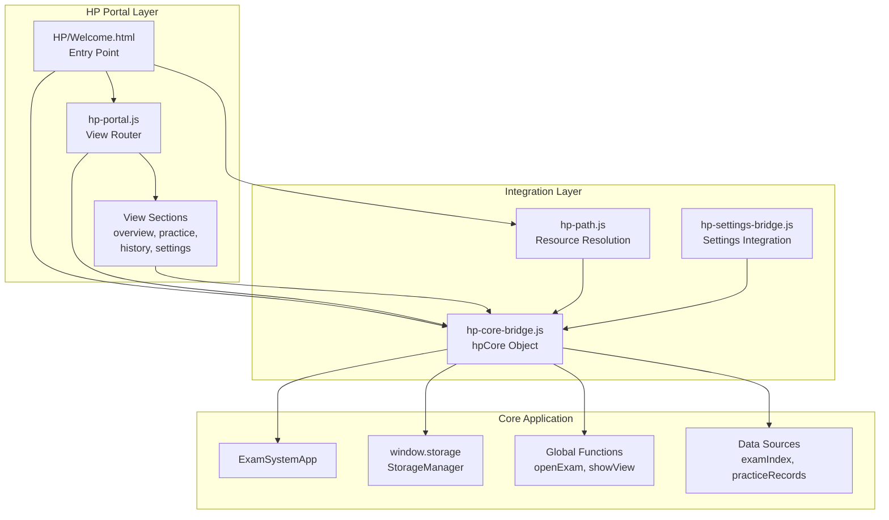
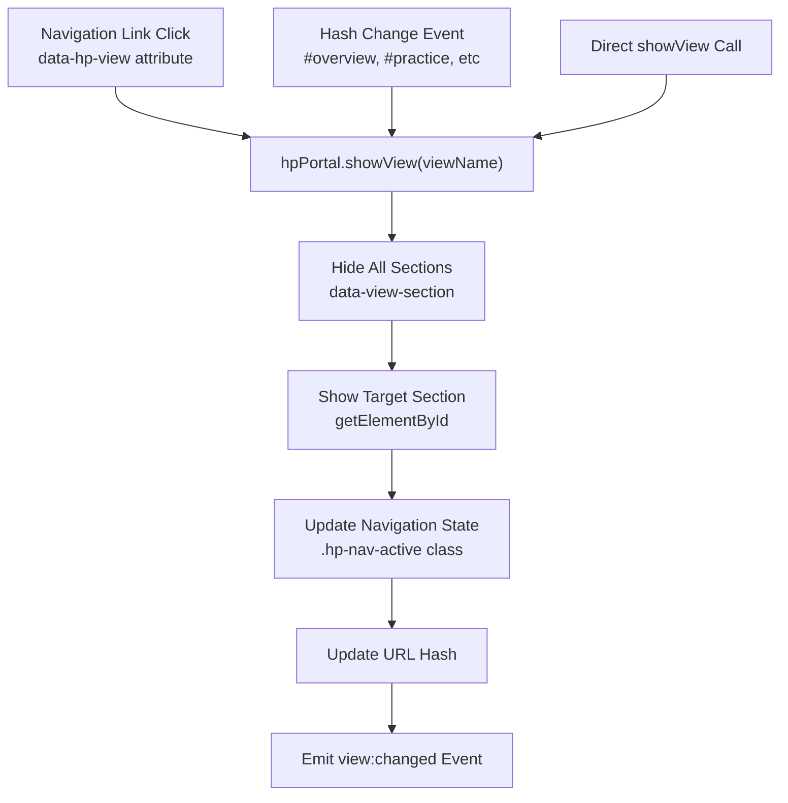
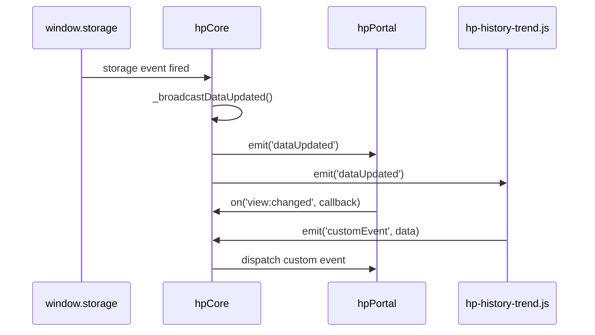
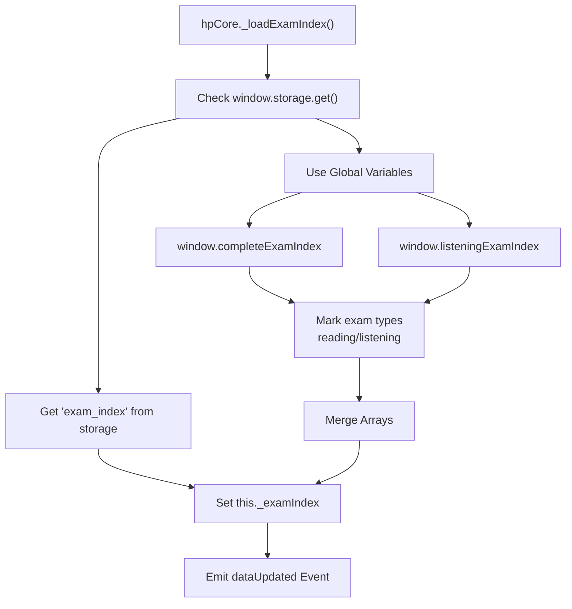
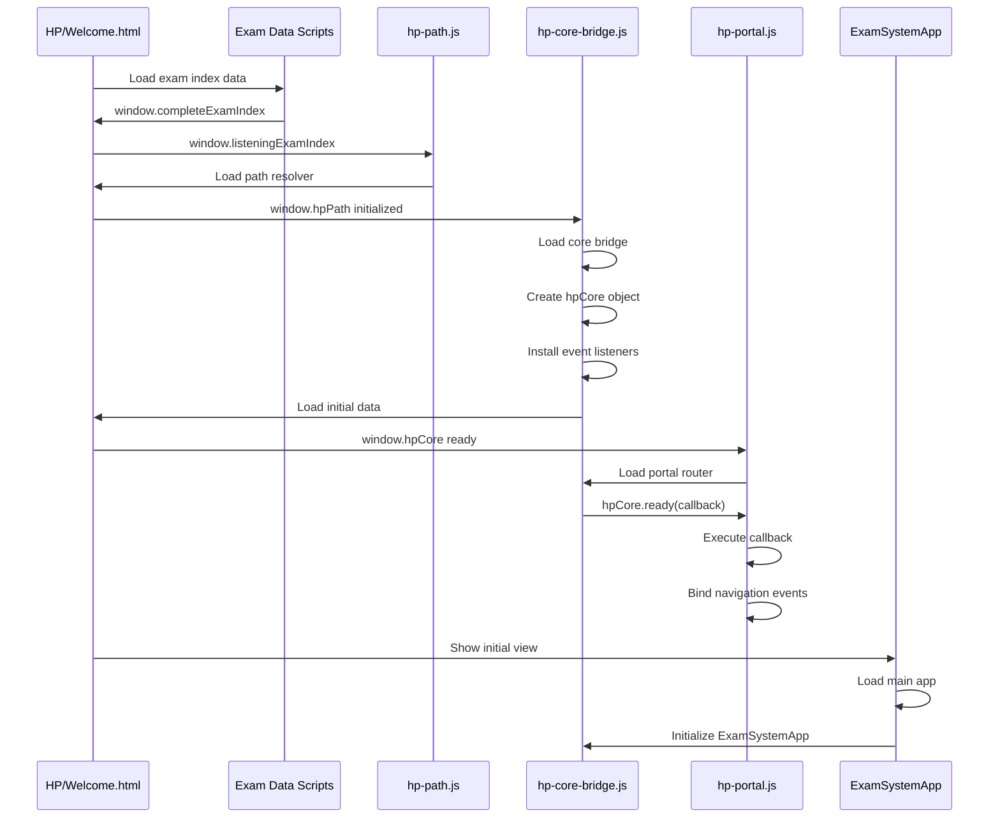
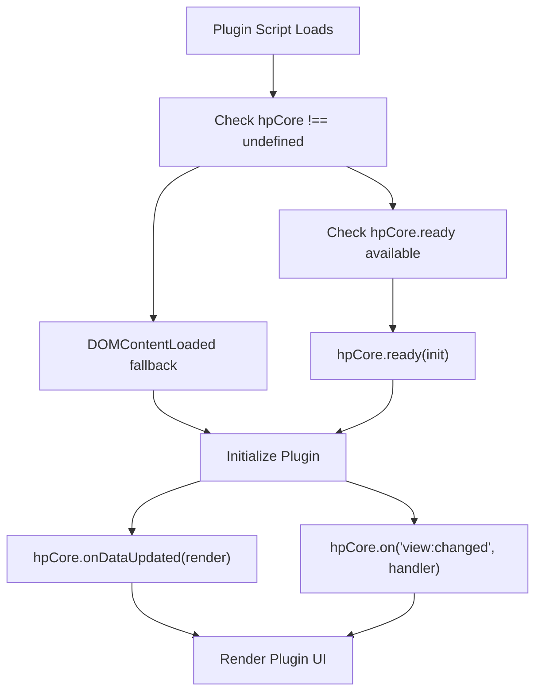
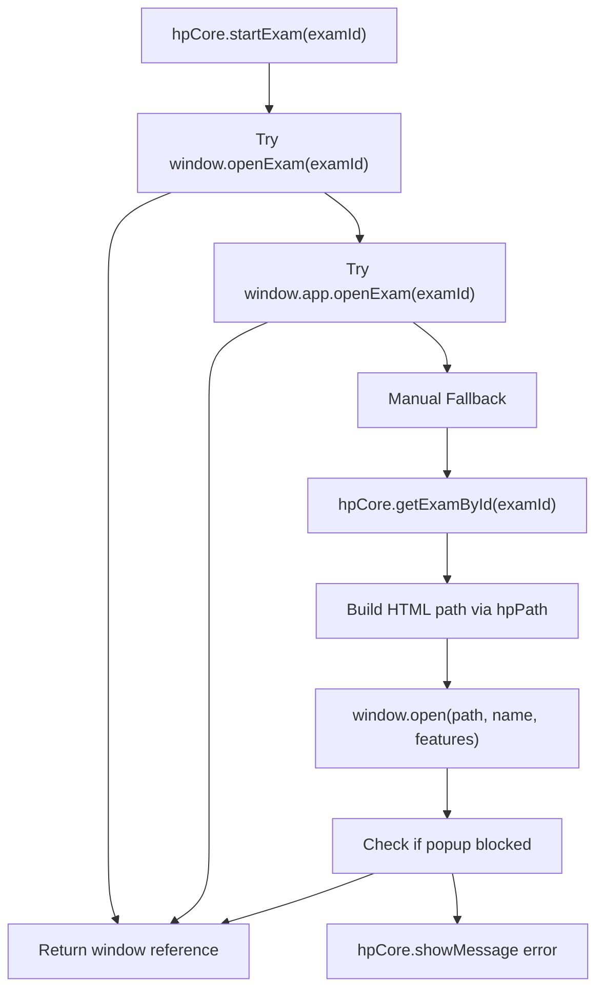
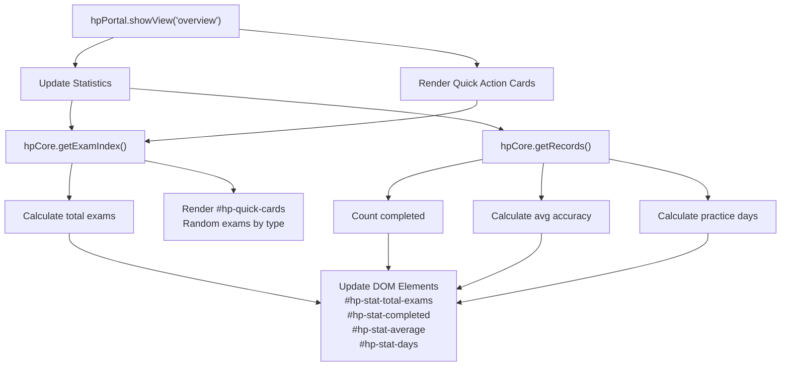
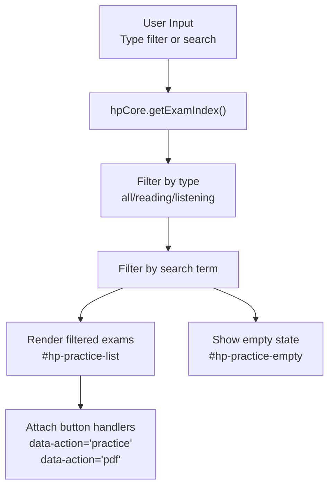
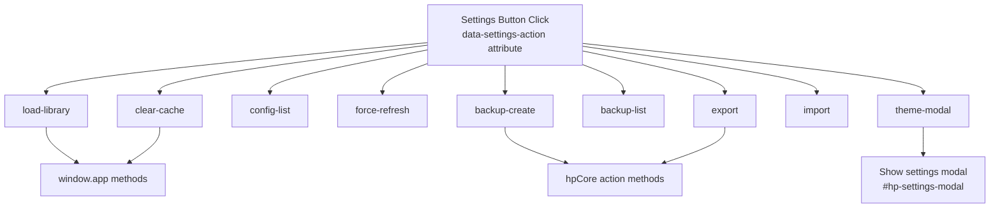

# HP Core Bridge & Plugin Architecture

> **Relevant source files**
> * [.superdesign/design_iterations/HP/Welcome.html](https://github.com/sallowayma-git/IELTS-practice/blob/df0c9b8f/.superdesign/design_iterations/HP/Welcome.html)

This document covers the HP plugin architecture, focusing on two primary components:

* **hp-core-bridge.js**: Integration layer providing data access and action APIs
* **hp-portal.js**: View router managing navigation and section rendering

These modules enable the Harry Potter theme to function as a standalone portal while integrating with the core IELTS practice system through well-defined interfaces.

**Related Pages:**

* [HP Welcome Interface & Views (8.1)](https://github.com/sallowayma-git/IELTS-practice/blob/df0c9b8f/HP Welcome Interface & Views (8.1))  - UI components and Marauder's Map
* [HP Path System & Extensions (8.3)](https://github.com/sallowayma-git/IELTS-practice/blob/df0c9b8f/HP Path System & Extensions (8.3))  - Path resolution and additional HP plugins
* [Theme Management & Controller (7.1)](https://github.com/sallowayma-git/IELTS-practice/blob/df0c9b8f/Theme Management & Controller (7.1))  - Theme switching and portal navigation

## Purpose and Architecture Overview

The HP plugin system implements a modular architecture where the Harry Potter theme operates as a semi-independent portal with its own view management, while leveraging core application functionality through the `hpCore` bridge.

### Three-Layer Architecture



**Sources:** [.superdesign/design_iterations/HP/Welcome.html L617-L649](https://github.com/sallowayma-git/IELTS-practice/blob/df0c9b8f/.superdesign/design_iterations/HP/Welcome.html#L617-L649)

The architecture provides:

* **Portal Independence**: HP theme can operate with its own navigation and view management
* **Core Integration**: Access to exam data, practice records, and system actions via `hpCore`
* **Graceful Degradation**: Fallback mechanisms when core app functions are unavailable

### Core Bridge Components

The `hpCore` object exposed by `hp-core-bridge.js` provides a stable API surface:

| Component | Purpose | Key Methods |
| --- | --- | --- |
| Event Bus | Inter-plugin communication | `on(event, fn)`, `off(event, fn)`, `emit(event, payload)` |
| Lifecycle | Ready state management | `ready(callback)`, `isReady`, `_markReady()` |
| Data Access | Cached exam and record data | `getExamIndex()`, `getRecords()`, `getExamById(id)` |
| Actions | System operations | `startExam(examId)`, `viewExamPDF(examId)` |
| UI Helpers | User feedback | `showMessage(msg, type, duration)` |

**Sources:** [js/plugins/hp/hp-core-bridge.js L1-L243](https://github.com/sallowayma-git/IELTS-practice/blob/df0c9b8f/js/plugins/hp/hp-core-bridge.js#L1-L243)

## HP Portal View Router

The `hp-portal.js` module manages view navigation within the HP theme, handling section visibility, navigation state, and URL hash synchronization.

### View Management Architecture



**Sources:** [.superdesign/design_iterations/HP/Welcome.html L398-L401](https://github.com/sallowayma-git/IELTS-practice/blob/df0c9b8f/.superdesign/design_iterations/HP/Welcome.html#L398-L401)

 [.superdesign/design_iterations/HP/Welcome.html L415-L548](https://github.com/sallowayma-git/IELTS-practice/blob/df0c9b8f/.superdesign/design_iterations/HP/Welcome.html#L415-L548)

### View Section Structure

The HP theme defines four primary views, each corresponding to a section in the DOM:

| View Name | Section ID | DOM Selector | Purpose |
| --- | --- | --- | --- |
| `overview` | `#overview` | `[data-view-section="overview"]` | Dashboard with stats and quick actions |
| `practice` | `#practice` | `[data-view-section="practice"]` | Exam browsing and filtering |
| `history` | `#history` | `[data-view-section="history"]` | Practice records and trend charts |
| `settings` | `#settings` | `[data-view-section="settings"]` | System configuration and backups |

**Sources:** [.superdesign/design_iterations/HP/Welcome.html L415-L548](https://github.com/sallowayma-git/IELTS-practice/blob/df0c9b8f/.superdesign/design_iterations/HP/Welcome.html#L415-L548)

### Navigation Link Binding

Navigation links use the `data-hp-view` attribute for declarative view routing:

```

```

The portal script attaches click handlers to all elements with `data-hp-view` and automatically manages the `.hp-nav-active` class for visual feedback.

**Sources:** [.superdesign/design_iterations/HP/Welcome.html L398-L401](https://github.com/sallowayma-git/IELTS-practice/blob/df0c9b8f/.superdesign/design_iterations/HP/Welcome.html#L398-L401)

## HP Core Bridge Event System

The core bridge implements a publish-subscribe event system that enables decoupled communication between plugins and data sources.

### Event Flow



**Sources:** [js/plugins/hp/hp-core-bridge.js L40-L58](https://github.com/sallowayma-git/IELTS-practice/blob/df0c9b8f/js/plugins/hp/hp-core-bridge.js#L40-L58)

 [js/plugins/hp/hp-history-trend.js L162-L171](https://github.com/sallowayma-git/IELTS-practice/blob/df0c9b8f/js/plugins/hp/hp-history-trend.js#L162-L171)

### Core Event Types

The bridge system defines several standard event types:

* **`dataUpdated`** - Fired when exam index or practice records change
* **`ready`** - Internal lifecycle event when bridge is initialized
* Custom events can be registered by plugins for inter-plugin communication

The event bus implementation uses error isolation to prevent one plugin from breaking others:

```

```

Sources: [js/plugins/hp/hp-core-bridge.js L53](https://github.com/sallowayma-git/IELTS-practice/blob/df0c9b8f/js/plugins/hp/hp-core-bridge.js#L53-L53)

## Data Access Layer

The `hpCore` bridge maintains cached copies of exam index and practice records, providing a unified interface that shields plugins from storage implementation details.

### Multi-Source Data Loading



**Sources:** [js/plugins/hp/hp-core-bridge.js L129-L158](https://github.com/sallowayma-git/IELTS-practice/blob/df0c9b8f/js/plugins/hp/hp-core-bridge.js#L129-L158)

### Type Marking System

The bridge automatically assigns a `type` field to exams during loading to distinguish between reading and listening:

```

```

This enables plugins to filter exams by type without knowing the source array structure.

**Sources:** [js/plugins/hp/hp-core-bridge.js L131-L136](https://github.com/sallowayma-git/IELTS-practice/blob/df0c9b8f/js/plugins/hp/hp-core-bridge.js#L131-L136)

### Data Loading Strategy

The bridge implements a multi-source data loading strategy with fallbacks:

1. **Primary**: Load from `window.storage.get()` if available
2. **Fallback**: Use global variables `window.completeExamIndex`, `window.listeningExamIndex`
3. **Type Marking**: Automatically assigns `type` field to categorize reading/listening exams

The `_loadExamIndex()` method demonstrates this pattern:

```

```

Sources: [js/plugins/hp/hp-core-bridge.js L131-L136](https://github.com/sallowayma-git/IELTS-practice/blob/df0c9b8f/js/plugins/hp/hp-core-bridge.js#L131-L136)

## Script Loading Sequence

The HP theme follows a specific script loading order to ensure proper initialization:

```

```

**Sources:** [.superdesign/design_iterations/HP/Welcome.html L617-L655](https://github.com/sallowayma-git/IELTS-practice/blob/df0c9b8f/.superdesign/design_iterations/HP/Welcome.html#L617-L655)

### Initialization Sequence



**Sources:** [.superdesign/design_iterations/HP/Welcome.html L617-L655](https://github.com/sallowayma-git/IELTS-practice/blob/df0c9b8f/.superdesign/design_iterations/HP/Welcome.html#L617-L655)

## Plugin Integration Patterns

HP-specific plugins follow standard patterns for integrating with the bridge and portal systems.

### Plugin Lifecycle



**Sources:** [js/plugins/hp/hp-history-trend.js L174-L180](https://github.com/sallowayma-git/IELTS-practice/blob/df0c9b8f/js/plugins/hp/hp-history-trend.js#L174-L180)

### Standard Plugin Pattern

Plugins follow this implementation pattern:

```

```

This pattern ensures:

* Safe access to `hpCore` with fallback to globals
* Automatic re-rendering when data changes
* Proper initialization timing regardless of load order

**Sources:** [js/plugins/hp/hp-history-trend.js L18](https://github.com/sallowayma-git/IELTS-practice/blob/df0c9b8f/js/plugins/hp/hp-history-trend.js#L18-L18)

 [js/plugins/hp/hp-history-trend.js L162-L180](https://github.com/sallowayma-git/IELTS-practice/blob/df0c9b8f/js/plugins/hp/hp-history-trend.js#L162-L180)

## Action System and Fallbacks

The bridge provides high-level action methods that abstract implementation details and gracefully degrade when core app functions are unavailable.

### Exam Opening Strategy

The `hpCore.startExam(examId)` method implements a three-tier fallback:



**Sources:** [js/plugins/hp/hp-core-bridge.js L184-L214](https://github.com/sallowayma-git/IELTS-practice/blob/df0c9b8f/js/plugins/hp/hp-core-bridge.js#L184-L214)

### Integration with hp-path.js

The fallback path construction relies on `window.hpPath` for resource resolution:

```

```

This demonstrates the layered plugin architecture where `hp-core-bridge.js` depends on `hp-path.js` for path resolution.

**Sources:** [js/plugins/hp/hp-core-bridge.js L186-L212](https://github.com/sallowayma-git/IELTS-practice/blob/df0c9b8f/js/plugins/hp/hp-core-bridge.js#L186-L212)

 [.superdesign/design_iterations/HP/Welcome.html L626](https://github.com/sallowayma-git/IELTS-practice/blob/df0c9b8f/.superdesign/design_iterations/HP/Welcome.html#L626-L626)

## View Rendering and Data Population

The HP portal coordinates view-specific rendering logic that populates sections with live data.

### Overview Section Data Binding



**Sources:** [.superdesign/design_iterations/HP/Welcome.html L422-L447](https://github.com/sallowayma-git/IELTS-practice/blob/df0c9b8f/.superdesign/design_iterations/HP/Welcome.html#L422-L447)

### Practice Section Filtering

The practice view implements client-side filtering:



**Sources:** [.superdesign/design_iterations/HP/Welcome.html L450-L472](https://github.com/sallowayma-git/IELTS-practice/blob/df0c9b8f/.superdesign/design_iterations/HP/Welcome.html#L450-L472)

### History Section Integration

The history view delegates to specialized plugins:

* **hp-history-table.js**: Renders practice record table with sortable columns
* **hp-history-trend.js**: Renders SVG chart showing 10-day accuracy trends
* Both plugins listen for `dataUpdated` events and re-render automatically

**Sources:** [.superdesign/design_iterations/HP/Welcome.html L474-L516](https://github.com/sallowayma-git/IELTS-practice/blob/df0c9b8f/.superdesign/design_iterations/HP/Welcome.html#L474-L516)

## Settings Integration

The HP settings view integrates with core app functionality through the bridge:

### Settings Actions



**Sources:** [.superdesign/design_iterations/HP/Welcome.html L518-L601](https://github.com/sallowayma-git/IELTS-practice/blob/df0c9b8f/.superdesign/design_iterations/HP/Welcome.html#L518-L601)

### Modal System

The HP theme includes a reusable modal component for settings operations:

```

```

The portal script manages modal lifecycle:

* Shows modal with `classList.remove('hidden')`
* Populates body via `innerHTML` or template cloning
* Attaches action handlers to modal buttons
* Closes modal on backdrop click or dismiss button

**Sources:** [.superdesign/design_iterations/HP/Welcome.html L591-L601](https://github.com/sallowayma-git/IELTS-practice/blob/df0c9b8f/.superdesign/design_iterations/HP/Welcome.html#L591-L601)

## API Reference

### hpCore Bridge API

**Lifecycle Methods:**

| Method | Parameters | Return | Description |
| --- | --- | --- | --- |
| `ready(callback)` | `function` | `void` | Execute callback when bridge ready |
| `isReady` | - | `boolean` | Current ready state |

**Event Methods:**

| Method | Parameters | Return | Description |
| --- | --- | --- | --- |
| `on(event, callback)` | `string, function` | `void` | Register event listener |
| `off(event, callback)` | `string, function?` | `void` | Remove event listener(s) |
| `emit(event, payload)` | `string, any` | `void` | Emit event to all listeners |
| `onDataUpdated(callback)` | `function` | `void` | Shorthand for on('dataUpdated') |

**Data Access Methods:**

| Method | Parameters | Return | Description |
| --- | --- | --- | --- |
| `getExamIndex()` | none | `Array<Object>` | Get cached exam index with type field |
| `getRecords()` | none | `Array<Object>` | Get cached practice records |
| `getExamById(id)` | `string` | `Object \| null` | Find exam by ID |

**Action Methods:**

| Method | Parameters | Return | Description |
| --- | --- | --- | --- |
| `startExam(examId)` | `string` | `Window \| null` | Open exam in new window with fallbacks |
| `viewExamPDF(examId)` | `string` | `Window \| null` | Open PDF in new window with fallbacks |
| `showMessage(msg, type, duration)` | `string, string?, number?` | `void` | Display user feedback message |

**Sources:** [js/plugins/hp/hp-core-bridge.js L27-L113](https://github.com/sallowayma-git/IELTS-practice/blob/df0c9b8f/js/plugins/hp/hp-core-bridge.js#L27-L113)

### hpPortal Router API

| Method | Parameters | Return | Description |
| --- | --- | --- | --- |
| `showView(viewName)` | `string` | `void` | Switch to specified view section |
| `getCurrentView()` | none | `string` | Get current active view name |
| `on(event, callback)` | `string, function` | `void` | Listen for portal events |

**Portal Events:**

* `view:changed` - Fired after view transition completes, payload: `{from: string, to: string}`
* `view:beforeChange` - Fired before view transition, payload: `{from: string, to: string}`

**Sources:** Based on portal architecture from [.superdesign/design_iterations/HP/Welcome.html L398-L401](https://github.com/sallowayma-git/IELTS-practice/blob/df0c9b8f/.superdesign/design_iterations/HP/Welcome.html#L398-L401)

## Plugin Examples

### History Trend Plugin

The `hp-history-trend.js` demonstrates data visualization using the bridge:

```

```

This plugin renders SVG charts showing 10-day practice accuracy trends, automatically updating when data changes through the `dataUpdated` event.

Sources: [js/plugins/hp/hp-history-trend.js L18](https://github.com/sallowayma-git/IELTS-practice/blob/df0c9b8f/js/plugins/hp/hp-history-trend.js#L18-L18)

### Welcome CTA Plugin

The `hp-welcome-cta.js` shows action integration:

```

```

This plugin handles call-to-action buttons by selecting random exams and delegating to the appropriate system functions.

Sources: [js/plugins/hp/hp-welcome-cta.js L23-L31](https://github.com/sallowayma-git/IELTS-practice/blob/df0c9b8f/js/plugins/hp/hp-welcome-cta.js#L23-L31)

The HP Core Bridge architecture enables the Harry Potter theme to extend system functionality through a clean, event-driven plugin system while maintaining compatibility with the main application architecture.