# HP Core Bridge Architecture

> **Relevant source files**
> * [.superdesign/design_iterations/HP/Welcome.html](https://github.com/sallowayma-git/IELTS-practice/blob/92f64eb8/.superdesign/design_iterations/HP/Welcome.html)
> * [js/plugins/hp/hp-core-bridge.js](https://github.com/sallowayma-git/IELTS-practice/blob/92f64eb8/js/plugins/hp/hp-core-bridge.js)

## Purpose and Scope

This document details the `hpCore` bridge object implementation, which serves as the integration layer between the Harry Potter themed interface and the core IELTS practice system. The bridge provides a unified API for data access, event communication, exam window management, and HP-specific resource resolution strategies.

For information about the HP Welcome interface and view structure, see [HP Welcome Interface & Views](/sallowayma-git/IELTS-practice/8.1-hp-welcome-interface-and-views). For HP-specific UI components that consume the bridge API, see [HP UI Components & Extensions](/sallowayma-git/IELTS-practice/8.3-hp-ui-components-and-extensions). For general cross-window communication protocol, see [Cross-Window Communication Protocol](/sallowayma-git/IELTS-practice/5.3-cross-window-communication-protocol).

**Sources:** [js/plugins/hp/hp-core-bridge.js L1-L1122](https://github.com/sallowayma-git/IELTS-practice/blob/92f64eb8/js/plugins/hp/hp-core-bridge.js#L1-L1122)

---

## Core Bridge Object Structure

The `hpCore` object is a singleton that provides a stable, self-contained interface for HP theme integration. It is initialized immediately upon script execution and made available globally via `window.hpCore`.

### Object Architecture

```mermaid
flowchart TD

Meta["__stable: true<br>version: '1.0.1'"]
Lifecycle["Lifecycle<br>isReady<br>_readyQ[]<br>ready(cb)"]
EventBus["Event Bus<br>on()<br>off()<br>emit()"]
DataCache["Data Cache<br>examIndex[]<br>practiceRecords[]<br>lastUpdateTime"]
DataAccess["Data Access<br>getExamIndex()<br>getRecords()<br>getExamById()"]
Actions["Actions<br>startExam()<br>viewExamPDF()"]
UIHelpers["UI Helpers<br>showMessage()<br>showNotification()"]
Internal["Internal<br>_markReady()<br>_loadExamIndex()<br>_loadRecords()<br>_installListeners()"]
StateAdapter["LegacyStateAdapter<br>getInstance()"]
LegacyBridge["LegacyStateBridge<br>getInstance()"]
Events["events{}<br>Object.create(null)"]
ThrottleMap["throttleMap<br>Map()"]
ProbeCache["resourceProbeCache<br>Map()"]
SessionMap["localFallbackSessions<br>Map()"]
hpCore["hpCore"]
window.showMessage["window.showMessage"]
window.openExam["window.openExam"]

hpCore -.->|"delegates"| Lifecycle
hpCore -.->|"fallback"| EventBus
hpCore -.-> DataCache
hpCore -.-> DataAccess
hpCore -.-> Actions
hpCore -.-> UIHelpers
hpCore -.-> Internal
EventBus -.-> Events
Actions -.-> ProbeCache
Actions -.-> SessionMap
Internal -.-> StateAdapter
Internal -.-> LegacyBridge
UIHelpers -.-> window.showMessage
Actions -.-> window.openExam

subgraph subGraph2 ["Internal Storage"]
    Events
    ThrottleMap
    ProbeCache
    SessionMap
end

subgraph subGraph1 ["State Adapters"]
    StateAdapter
    LegacyBridge
end

subgraph subGraph0 ["hpCore Singleton"]
    Meta
    Lifecycle
    EventBus
    DataCache
    DataAccess
    Actions
    UIHelpers
    Internal
    DataAccess -.-> DataCache
end
```

**Key Properties:**

* `__stable`: Prevents double initialization [js/plugins/hp/hp-core-bridge.js L22-L25](https://github.com/sallowayma-git/IELTS-practice/blob/92f64eb8/js/plugins/hp/hp-core-bridge.js#L22-L25)
* `version`: Current bridge version for debugging
* `isReady`: Boolean flag indicating initialization complete
* `_readyQ`: Array of callbacks to execute when ready

**Sources:** [js/plugins/hp/hp-core-bridge.js L662-L908](https://github.com/sallowayma-git/IELTS-practice/blob/92f64eb8/js/plugins/hp/hp-core-bridge.js#L662-L908)

---

## Event Bus Implementation

The `hpCore` bridge implements a lightweight publish-subscribe event system for decoupled communication between components.

### Event System Architecture

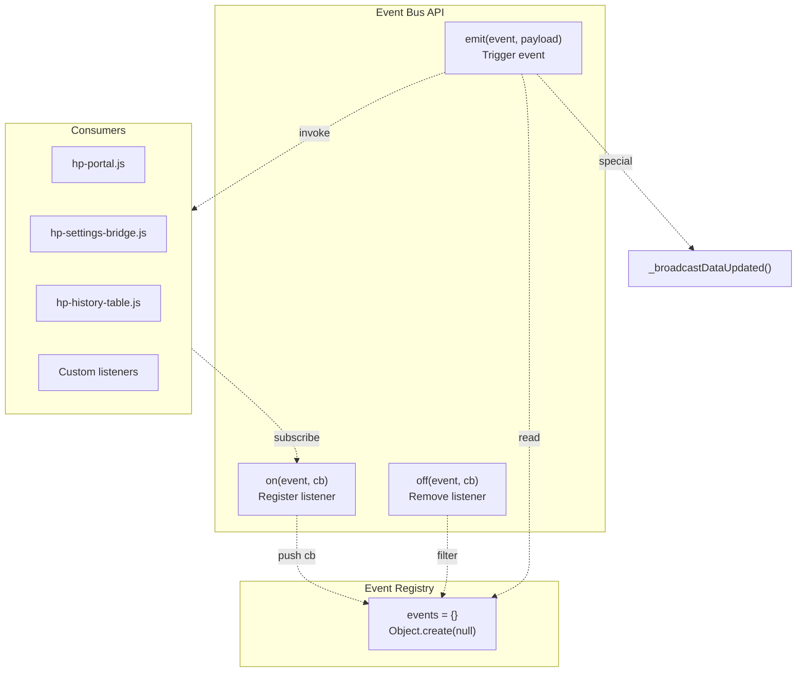

### Event Types

| Event Type | Payload | Purpose |
| --- | --- | --- |
| `dataUpdated` | `{examIndex, practiceRecords, __source}` | Fired when exam index or practice records change |
| Custom events | Any | Application-specific events |

**Implementation Details:**

1. **Registration** [js/plugins/hp/hp-core-bridge.js L679-L682](https://github.com/sallowayma-git/IELTS-practice/blob/92f64eb8/js/plugins/hp/hp-core-bridge.js#L679-L682) : * Callbacks stored in `events[eventName]` array * Handles missing event name or non-function callback gracefully
2. **Deregistration** [js/plugins/hp/hp-core-bridge.js L683-L687](https://github.com/sallowayma-git/IELTS-practice/blob/92f64eb8/js/plugins/hp/hp-core-bridge.js#L683-L687) : * Removes specific callback or all callbacks for event * Uses `filter()` to create new array without removed callback
3. **Emission** [js/plugins/hp/hp-core-bridge.js L688-L696](https://github.com/sallowayma-git/IELTS-practice/blob/92f64eb8/js/plugins/hp/hp-core-bridge.js#L688-L696) : * Slices callback array to prevent mutation during iteration * Wraps each callback in try-catch for isolation * Special handling for `dataUpdated` to trigger broadcast

**Sources:** [js/plugins/hp/hp-core-bridge.js L27-L28](https://github.com/sallowayma-git/IELTS-practice/blob/92f64eb8/js/plugins/hp/hp-core-bridge.js#L27-L28)

 [js/plugins/hp/hp-core-bridge.js L679-L696](https://github.com/sallowayma-git/IELTS-practice/blob/92f64eb8/js/plugins/hp/hp-core-bridge.js#L679-L696)

---

## Data Access Layer

The bridge provides a unified interface for accessing exam index and practice records, abstracting the underlying state management complexity.

### Data Flow Architecture

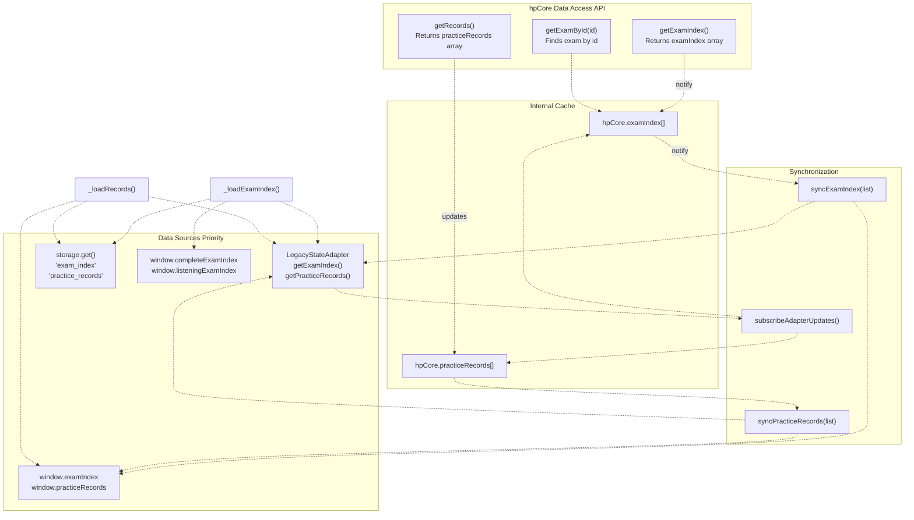

### Data Loading Priority

The bridge attempts to load data in this order:

1. **State Adapter Snapshot** [js/plugins/hp/hp-core-bridge.js L910-L918](https://github.com/sallowayma-git/IELTS-practice/blob/92f64eb8/js/plugins/hp/hp-core-bridge.js#L910-L918) : ``` readExamIndexSnapshot(): - LegacyStateAdapter.getExamIndex() [FIRST] - window.examIndex [FALLBACK] - hpCore.examIndex [LAST] ```
2. **Storage API** [js/plugins/hp/hp-core-bridge.js L788-L798](https://github.com/sallowayma-git/IELTS-practice/blob/92f64eb8/js/plugins/hp/hp-core-bridge.js#L788-L798) : * Asynchronously loads from `storage.get('exam_index')` * Handles both Promise and sync return values
3. **Legacy Global Variables** [js/plugins/hp/hp-core-bridge.js L800-L803](https://github.com/sallowayma-git/IELTS-practice/blob/92f64eb8/js/plugins/hp/hp-core-bridge.js#L800-L803) : * Merges `window.completeExamIndex` (reading) and `window.listeningExamIndex` (listening) * Marks each exam with its type via `markTypes()` helper

**Synchronization Strategy:**

The `syncExamIndex()` and `syncPracticeRecords()` functions ensure bidirectional synchronization:

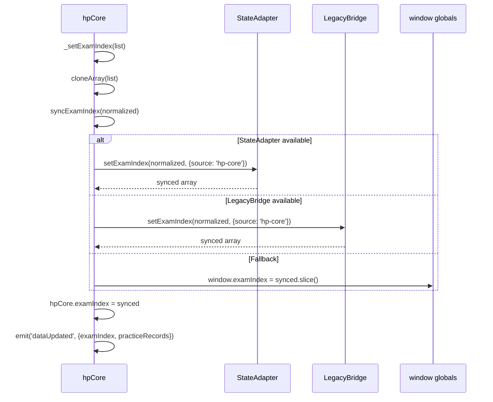

**Sources:** [js/plugins/hp/hp-core-bridge.js L706-L709](https://github.com/sallowayma-git/IELTS-practice/blob/92f64eb8/js/plugins/hp/hp-core-bridge.js#L706-L709)

 [js/plugins/hp/hp-core-bridge.js L780-L851](https://github.com/sallowayma-git/IELTS-practice/blob/92f64eb8/js/plugins/hp/hp-core-bridge.js#L780-L851)

 [js/plugins/hp/hp-core-bridge.js L910-L958](https://github.com/sallowayma-git/IELTS-practice/blob/92f64eb8/js/plugins/hp/hp-core-bridge.js#L910-L958)

 [js/plugins/hp/hp-core-bridge.js L960-L984](https://github.com/sallowayma-git/IELTS-practice/blob/92f64eb8/js/plugins/hp/hp-core-bridge.js#L960-L984)

---

## Exam Window Handshake Protocol

The bridge implements a robust handshake mechanism to establish communication with exam windows, supporting multiple initialization attempts and timeout handling.

### Handshake Flow

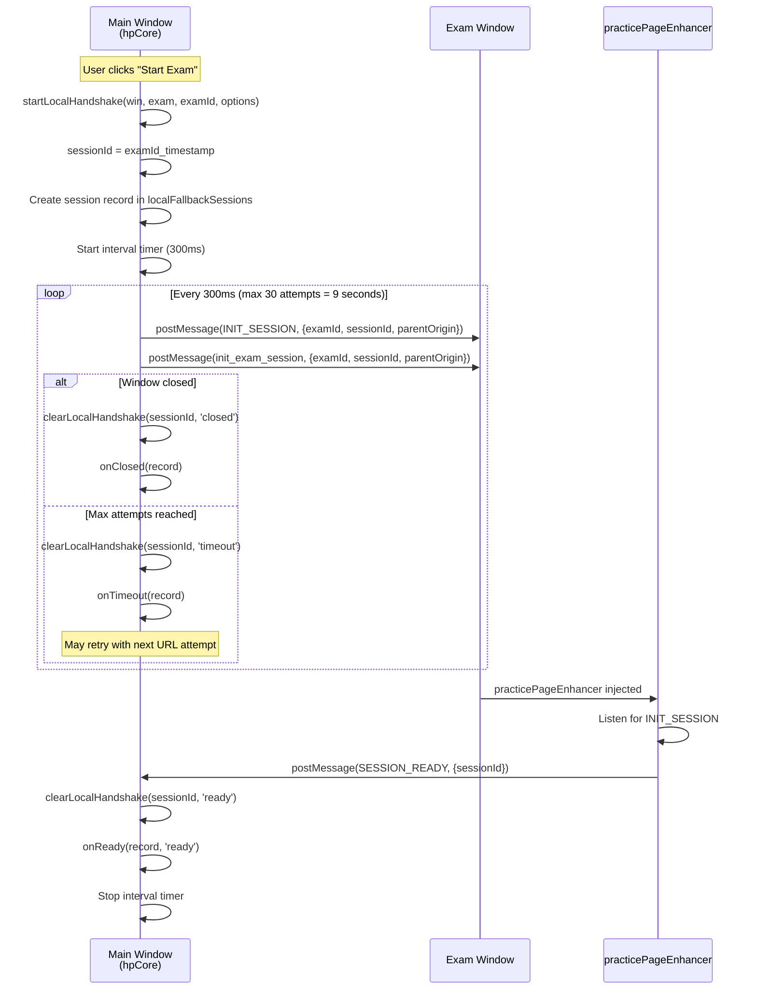

### Session Tracking

**Session Record Structure** [js/plugins/hp/hp-core-bridge.js L297-L310](https://github.com/sallowayma-git/IELTS-practice/blob/92f64eb8/js/plugins/hp/hp-core-bridge.js#L297-L310)

:

```yaml
{
  examId: string,           // Exam identifier
  exam: object | null,      // Full exam object
  win: Window,              // Reference to exam window
  timer: IntervalId,        // Handshake retry timer
  sessionId: string,        // Unique session ID
  attemptIndex: number,     // Current URL attempt index
  attempts: array,          // List of URL attempts
  onTimeout: function,      // Callback for timeout
  onReady: function,        // Callback for ready
  onClosed: function,       // Callback for closed
  onStatus: function,       // General status callback
  status: string            // 'pending' | 'ready' | 'timeout' | 'closed'
}
```

**Session Lifecycle:**

1. **Initialization** [js/plugins/hp/hp-core-bridge.js L271-L330](https://github.com/sallowayma-git/IELTS-practice/blob/92f64eb8/js/plugins/hp/hp-core-bridge.js#L271-L330) : * Creates session record * Stores in `localFallbackSessions` Map with sessionId as key * Starts periodic message posting * Updates `hpCore.lastOpenedExamId`, `hpCore.lastOpenedExam`, `hpCore.lastOpenedSessionId`
2. **Cleanup** [js/plugins/hp/hp-core-bridge.js L243-L269](https://github.com/sallowayma-git/IELTS-practice/blob/92f64eb8/js/plugins/hp/hp-core-bridge.js#L243-L269) : * Removes from Map * Clears interval timer * Invokes appropriate callback based on reason * Reason can be: 'ready', 'complete', 'timeout', 'closed'
3. **Message Handling** [js/plugins/hp/hp-core-bridge.js L861-L901](https://github.com/sallowayma-git/IELTS-practice/blob/92f64eb8/js/plugins/hp/hp-core-bridge.js#L861-L901) : * Listens for `SESSION_READY` to mark handshake complete * Listens for practice completion messages (multiple types) * Automatically loads records after completion

**Fallback Integration:**

The bridge integrates with global fallback functions:

```
ensureHandshake(examWindow, exam, fallbackExamId, options) {
  // Delegates to global startHandshakeFallback if available
  if (typeof window.startHandshakeFallback === 'function') {
    window.startHandshakeFallback(examWindow, examId);
  }
  // Always starts local handshake as backup
  startLocalHandshake(examWindow, exam, fallbackExamId, options);
}
```

**Sources:** [js/plugins/hp/hp-core-bridge.js L30-L31](https://github.com/sallowayma-git/IELTS-practice/blob/92f64eb8/js/plugins/hp/hp-core-bridge.js#L30-L31)

 [js/plugins/hp/hp-core-bridge.js L243-L340](https://github.com/sallowayma-git/IELTS-practice/blob/92f64eb8/js/plugins/hp/hp-core-bridge.js#L243-L340)

 [js/plugins/hp/hp-core-bridge.js L861-L901](https://github.com/sallowayma-git/IELTS-practice/blob/92f64eb8/js/plugins/hp/hp-core-bridge.js#L861-L901)

---

## Resource Resolution System

The bridge implements a sophisticated multi-strategy resource resolution system designed for the HP theme's deployment flexibility, particularly for `file://` protocol and various folder structures.

### Resolution Strategy Pipeline

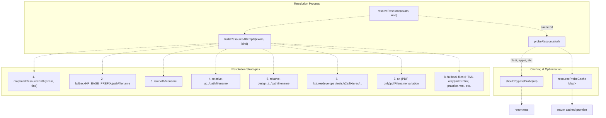

### Strategy Implementation

**1. Map Strategy** [js/plugins/hp/hp-core-bridge.js L523-L533](https://github.com/sallowayma-git/IELTS-practice/blob/92f64eb8/js/plugins/hp/hp-core-bridge.js#L523-L533)

:

* Uses `hpPath.buildResourcePath()` or global `buildResourcePath()`
* Integrates with path map system for custom mappings
* Primary strategy for production deployments

**2. Fallback Strategy** [js/plugins/hp/hp-core-bridge.js L537-L542](https://github.com/sallowayma-git/IELTS-practice/blob/92f64eb8/js/plugins/hp/hp-core-bridge.js#L537-L542)

:

* Combines `HP_BASE_PREFIX` (default `./`) with exam path and filename
* Uses `joinResourcePath()` helper for proper path construction

**3. Raw Strategy** [js/plugins/hp/hp-core-bridge.js L544](https://github.com/sallowayma-git/IELTS-practice/blob/92f64eb8/js/plugins/hp/hp-core-bridge.js#L544-L544)

:

* Direct combination of exam path and filename
* No base prefix applied

**4-5. Relative Strategies** [js/plugins/hp/hp-core-bridge.js L545-L546](https://github.com/sallowayma-git/IELTS-practice/blob/92f64eb8/js/plugins/hp/hp-core-bridge.js#L545-L546)

:

* `relative-up`: `../path/filename`
* `relative-design`: `../../path/filename`
* Handles different folder depth scenarios

**6. Fixtures Strategy** [js/plugins/hp/hp-core-bridge.js L548-L554](https://github.com/sallowayma-git/IELTS-practice/blob/92f64eb8/js/plugins/hp/hp-core-bridge.js#L548-L554)

:

* Specifically for E2E test fixtures
* Prepends `developer/tests/e2e/fixtures` if not already present

**7-8. Type-Specific Fallbacks** [js/plugins/hp/hp-core-bridge.js L556-L564](https://github.com/sallowayma-git/IELTS-practice/blob/92f64eb8/js/plugins/hp/hp-core-bridge.js#L556-L564)

:

* PDF: Tries `pdfFilename` as alternative to `filename`
* HTML: Tries common index filenames (index.html, practice.html, exam.html)

### Resource Probing

The bridge probes each URL to verify accessibility before opening:

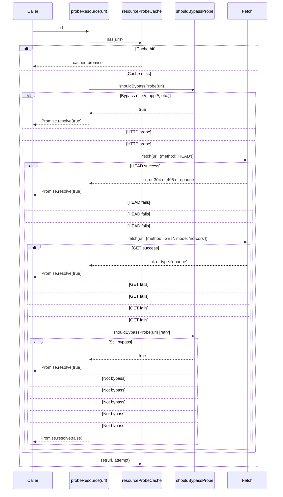

**Bypass Conditions** [js/plugins/hp/hp-core-bridge.js L425-L444](https://github.com/sallowayma-git/IELTS-practice/blob/92f64eb8/js/plugins/hp/hp-core-bridge.js#L425-L444)

:

* Global flag: `window.__HP_DISABLE_PROBE__ === true`
* Protocol: `file:`, `app:`, `chrome-extension:`, `capacitor:`, `ionic:`
* Local file context: window on `file://` and relative URL

**Probe Strategy** [js/plugins/hp/hp-core-bridge.js L569-L608](https://github.com/sallowayma-git/IELTS-practice/blob/92f64eb8/js/plugins/hp/hp-core-bridge.js#L569-L608)

:

1. Try HEAD request (efficient, no body download)
2. On HEAD failure, try GET with `no-cors` mode
3. Success criteria: `response.ok`, status 304/405, or `type === 'opaque'`
4. Cache result to avoid redundant checks

**Sources:** [js/plugins/hp/hp-core-bridge.js L29](https://github.com/sallowayma-git/IELTS-practice/blob/92f64eb8/js/plugins/hp/hp-core-bridge.js#L29-L29)

 [js/plugins/hp/hp-core-bridge.js L425-L624](https://github.com/sallowayma-git/IELTS-practice/blob/92f64eb8/js/plugins/hp/hp-core-bridge.js#L425-L624)

 [js/plugins/hp/hp-core-bridge.js L1002-L1119](https://github.com/sallowayma-git/IELTS-practice/blob/92f64eb8/js/plugins/hp/hp-core-bridge.js#L1002-L1119)

---

## Practice Record Ingestion

When practice completion messages arrive, the bridge normalizes and ingests them into storage, handling various payload formats and data sources.

### Payload Normalization

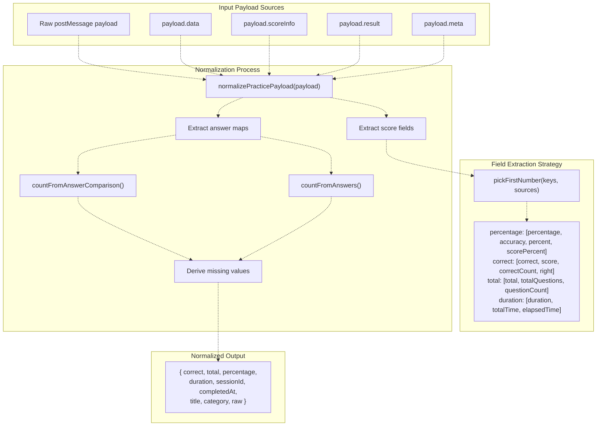

### Extraction Logic

**Multi-Source Field Extraction** [js/plugins/hp/hp-core-bridge.js L58-L70](https://github.com/sallowayma-git/IELTS-practice/blob/92f64eb8/js/plugins/hp/hp-core-bridge.js#L58-L70)

:

The `pickFirstNumber()` helper searches multiple payload sources in order:

```
sources = [scoreInfo, result, nestedResult, nestedData, envelope, meta]

For each key in keys:
  For each source in sources:
    candidate = source[key]
    if isFinite(Number(candidate)):
      return candidate
```

**Answer Count Derivation** [js/plugins/hp/hp-core-bridge.js L83-L129](https://github.com/sallowayma-git/IELTS-practice/blob/92f64eb8/js/plugins/hp/hp-core-bridge.js#L83-L129)

:

When explicit counts are missing, derives from answer comparison or answer maps:

| Source | Logic |
| --- | --- |
| `answerComparison` | Counts entries; checks if value is `true` or `{isCorrect: true}` |
| `answers` + `correctAnswers` | Compares each answer to correct answer map |

**Percentage Calculation** [js/plugins/hp/hp-core-bridge.js L184-L188](https://github.com/sallowayma-git/IELTS-practice/blob/92f64eb8/js/plugins/hp/hp-core-bridge.js#L184-L188)

:

```
if (percentage === null && correct !== null && total > 0) {
  percentage = Math.round((correct / total) * 100);
}
```

### Record Creation and Storage

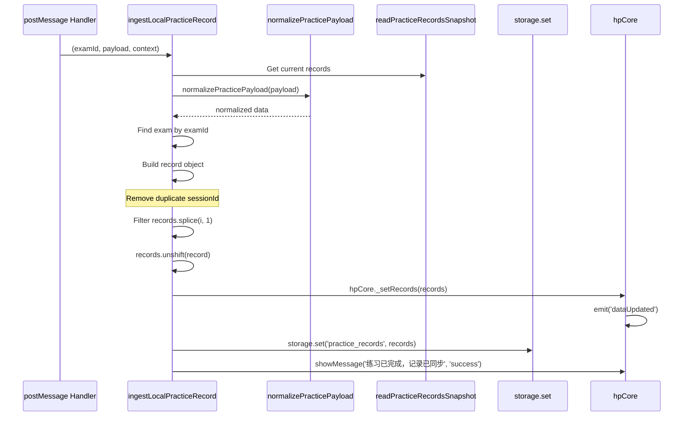

**Record Structure** [js/plugins/hp/hp-core-bridge.js L387-L402](https://github.com/sallowayma-git/IELTS-practice/blob/92f64eb8/js/plugins/hp/hp-core-bridge.js#L387-L402)

:

```yaml
{
  id: Date.now(),
  examId: string,
  sessionId: string | undefined,
  title: string,
  category: string,
  frequency: string | undefined,
  type: string | undefined,        // 'reading' | 'listening'
  percentage: number,               // 0-100
  accuracy: number,                 // 0-1
  score: number,                    // correct count
  totalQuestions: number,
  duration: number | undefined,     // seconds
  date: string,                     // ISO format
  realData: object                  // Original payload
}
```

**Deduplication:**

* Removes any existing record with same `sessionId` before adding new one
* Prevents duplicate records from multiple completion messages

**Sources:** [js/plugins/hp/hp-core-bridge.js L32-L43](https://github.com/sallowayma-git/IELTS-practice/blob/92f64eb8/js/plugins/hp/hp-core-bridge.js#L32-L43)

 [js/plugins/hp/hp-core-bridge.js L45-L233](https://github.com/sallowayma-git/IELTS-practice/blob/92f64eb8/js/plugins/hp/hp-core-bridge.js#L45-L233)

 [js/plugins/hp/hp-core-bridge.js L342-L423](https://github.com/sallowayma-git/IELTS-practice/blob/92f64eb8/js/plugins/hp/hp-core-bridge.js#L342-L423)

 [js/plugins/hp/hp-core-bridge.js L861-L901](https://github.com/sallowayma-git/IELTS-practice/blob/92f64eb8/js/plugins/hp/hp-core-bridge.js#L861-L901)

---

## State Synchronization

The bridge maintains bidirectional synchronization with state adapters and global variables to ensure data consistency across the application.

### Synchronization Architecture

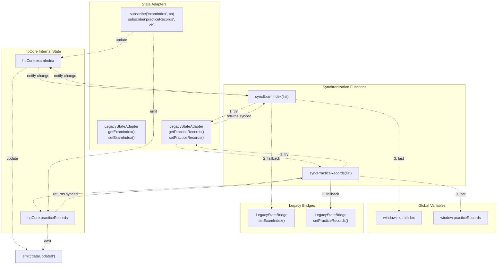

### Synchronization Flow

**Writing to State** [js/plugins/hp/hp-core-bridge.js L930-L958](https://github.com/sallowayma-git/IELTS-practice/blob/92f64eb8/js/plugins/hp/hp-core-bridge.js#L930-L958)

:

```yaml
syncExamIndex(list):
  normalized = cloneArray(list)
  
  if (stateAdapter.setExamIndex available):
    synced = stateAdapter.setExamIndex(normalized, {source: 'hp-core'})
  else if (legacyBridge.setExamIndex available):
    synced = legacyBridge.setExamIndex(normalized, {source: 'hp-core'})
  else:
    window.examIndex = normalized.slice()
    synced = normalized
  
  hpCore.examIndex = synced
  return synced
```

The `{source: 'hp-core'}` option prevents infinite update loops by identifying the originator.

**Reading from State** [js/plugins/hp/hp-core-bridge.js L910-L928](https://github.com/sallowayma-git/IELTS-practice/blob/92f64eb8/js/plugins/hp/hp-core-bridge.js#L910-L928)

:

```yaml
readExamIndexSnapshot():
  if (stateAdapter.getExamIndex available):
    return stateAdapter.getExamIndex()
  else if (window.examIndex exists):
    return window.examIndex
  else:
    return hpCore.examIndex
```

**Adapter Subscriptions** [js/plugins/hp/hp-core-bridge.js L960-L984](https://github.com/sallowayma-git/IELTS-practice/blob/92f64eb8/js/plugins/hp/hp-core-bridge.js#L960-L984)

:

If `LegacyStateAdapter` is available, subscribes to its changes:

```javascript
stateAdapter.subscribe('examIndex', function (value) {
  hpCore.examIndex = cloneArray(value);
  hpCore.emit('dataUpdated', {
    examIndex: value,
    practiceRecords: hpCore.practiceRecords,
    __source: 'hp-core'
  });
});
```

This ensures the bridge stays synchronized when the core application updates data.

### Cross-Tab Synchronization

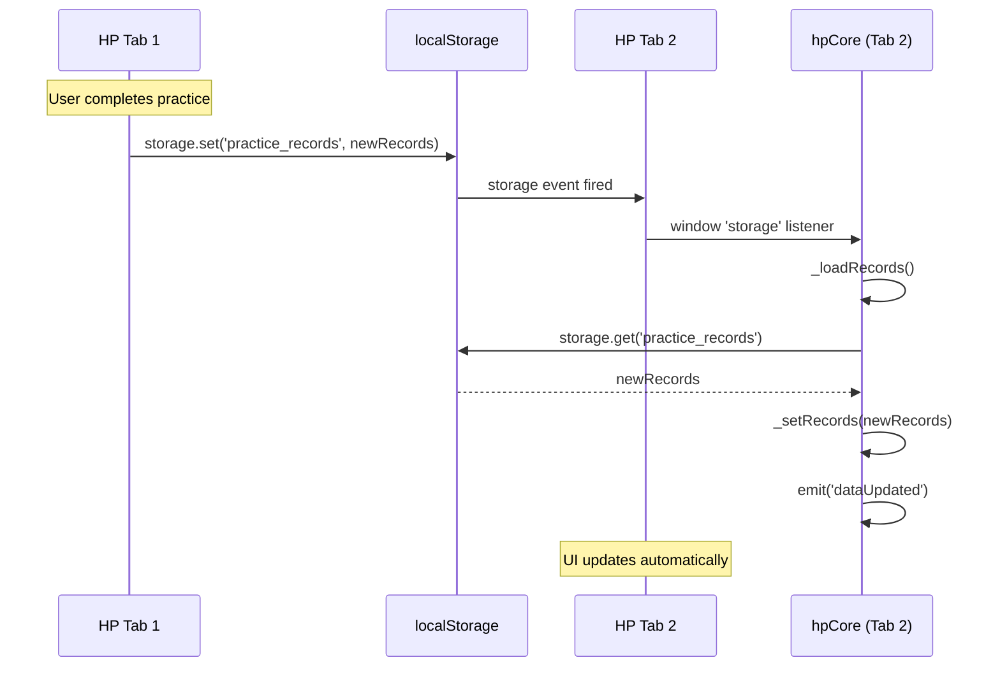

**Storage Event Listener** [js/plugins/hp/hp-core-bridge.js L853-L860](https://github.com/sallowayma-git/IELTS-practice/blob/92f64eb8/js/plugins/hp/hp-core-bridge.js#L853-L860)

:

```javascript
window.addEventListener('storage', (e) => {
  if (e.key === 'practice_records' || e.key === 'exam_index') {
    this._loadRecords();
    this._loadExamIndex().catch(() => {});
  }
});
```

**Sources:** [js/plugins/hp/hp-core-bridge.js L13-L16](https://github.com/sallowayma-git/IELTS-practice/blob/92f64eb8/js/plugins/hp/hp-core-bridge.js#L13-L16)

 [js/plugins/hp/hp-core-bridge.js L853-L860](https://github.com/sallowayma-git/IELTS-practice/blob/92f64eb8/js/plugins/hp/hp-core-bridge.js#L853-L860)

 [js/plugins/hp/hp-core-bridge.js L910-L984](https://github.com/sallowayma-git/IELTS-practice/blob/92f64eb8/js/plugins/hp/hp-core-bridge.js#L910-L984)

---

## Integration with Core Application

The bridge integrates with the core application through adapter interfaces, global function fallbacks, and action overrides.

### Integration Points

```

```

### Action Implementation

**startExam() Override** [js/plugins/hp/hp-core-bridge.js L1003-L1082](https://github.com/sallowayma-git/IELTS-practice/blob/92f64eb8/js/plugins/hp/hp-core-bridge.js#L1003-L1082)

:

The bridge overrides the default `startExam()` with a self-contained implementation:

1. **Try Core Functions:** * `window.openExam(examId)` [first] * `window.app.openExam(examId)` [second]
2. **Fallback to Self-Contained Logic:** * Find exam in `readExamIndexSnapshot()` * If no HTML, redirect to `viewExamPDF()` * Resolve resource with `resolveResource(exam, 'html')` * Iterate through attempts with retry on handshake timeout

**Multi-Attempt Opening** [js/plugins/hp/hp-core-bridge.js L1028-L1072](https://github.com/sallowayma-git/IELTS-practice/blob/92f64eb8/js/plugins/hp/hp-core-bridge.js#L1028-L1072)

:

```javascript
const tryOpen = (index) => {
  if (index >= attempts.length) {
    // All attempts failed
    openResourceFallback(exam, 'html', attempts);
    return;
  }
  
  const entry = attempts[index];
  const win = window.open(entry.path, 'exam_' + examId);
  
  const handshakeOptions = {
    attemptIndex: index,
    attempts: attempts,
    onTimeout() {
      if (win && !win.closed) win.close();
      tryOpen(index + 1);  // Try next URL
    }
  };
  
  ensureHandshake(win, exam, examId, handshakeOptions);
};

tryOpen(0);  // Start with first attempt
```

If handshake times out (9 seconds), closes window and tries next URL in fallback chain.

**viewExamPDF() Override** [js/plugins/hp/hp-core-bridge.js L1083-L1118](https://github.com/sallowayma-git/IELTS-practice/blob/92f64eb8/js/plugins/hp/hp-core-bridge.js#L1083-L1118)

:

Similar pattern:

1. Try `window.viewPDF(examId)`
2. Fallback to `resolveResource(exam, 'pdf')`
3. Use `window.openPDFSafely()` if available
4. Otherwise direct `window.open()`

### Practice Record Handling

**Message Handler Decision Tree** [js/plugins/hp/hp-core-bridge.js L872-L899](https://github.com/sallowayma-git/IELTS-practice/blob/92f64eb8/js/plugins/hp/hp-core-bridge.js#L872-L899)

:

```javascript
if (PRACTICE_COMPLETE_TYPES.has(messageType)) {
  sessionId = payload.sessionId || payload.sessionID;
  sessionEntry = localFallbackSessions.get(sessionId);
  clearLocalHandshake(sessionId, 'complete');
  
  if (typeof window.startHandshakeFallback === 'function') {
    // Main app handles saving
    setTimeout(() => this._loadRecords(), 800);
  } else {
    // Bridge handles saving
    examId = payload.examId || sessionEntry.examId || lastOpenedExamId;
    
    if (typeof window.savePracticeRecordFallback === 'function') {
      // Use core save function if available
      window.savePracticeRecordFallback(examId, payload)
        .finally(() => setTimeout(() => this._loadRecords(), 400));
    } else {
      // Use bridge's local ingestion
      ingestLocalPracticeRecord(examId, payload, sessionEntry);
      setTimeout(() => this._loadRecords(), 400);
    }
  }
}
```

This layered approach ensures records are saved even if core functions are unavailable.

### Initialization and Lifecycle

**Bootstrap Sequence** [js/plugins/hp/hp-core-bridge.js L986-L1000](https://github.com/sallowayma-git/IELTS-practice/blob/92f64eb8/js/plugins/hp/hp-core-bridge.js#L986-L1000)

:

```javascript
// 1. Subscribe to adapter updates
subscribeAdapterUpdates();

// 2. Load initial data from adapter if available
if (stateAdapter) {
  hpCore.examIndex = readExamIndexSnapshot();
  hpCore.practiceRecords = readPracticeRecordsSnapshot();
}

// 3. Set global reference
window.hpCore = hpCore;

// 4. Install listeners (storage, postMessage, DOMContentLoaded)
hpCore._installListeners();

// 5. Trigger async loading and mark ready
hpCore._loadExamIndex().catch(() => {});
hpCore._loadRecords();
hpCore._markReady();
```

**DOMContentLoaded Handler** [js/plugins/hp/hp-core-bridge.js L902-L907](https://github.com/sallowayma-git/IELTS-practice/blob/92f64eb8/js/plugins/hp/hp-core-bridge.js#L902-L907)

:

Ensures initialization even if script loads after DOM ready:

```javascript
document.addEventListener('DOMContentLoaded', () => {
  this._loadExamIndex().catch(() => {});
  this._loadRecords();
  this._markReady();
});
```

**Sources:** [js/plugins/hp/hp-core-bridge.js L722-L741](https://github.com/sallowayma-git/IELTS-practice/blob/92f64eb8/js/plugins/hp/hp-core-bridge.js#L722-L741)

 [js/plugins/hp/hp-core-bridge.js L852-L907](https://github.com/sallowayma-git/IELTS-practice/blob/92f64eb8/js/plugins/hp/hp-core-bridge.js#L852-L907)

 [js/plugins/hp/hp-core-bridge.js L986-L1000](https://github.com/sallowayma-git/IELTS-practice/blob/92f64eb8/js/plugins/hp/hp-core-bridge.js#L986-L1000)

 [js/plugins/hp/hp-core-bridge.js L1002-L1119](https://github.com/sallowayma-git/IELTS-practice/blob/92f64eb8/js/plugins/hp/hp-core-bridge.js#L1002-L1119)

---

## Summary

The `hpCore` bridge provides a comprehensive integration layer for the HP theme with these key capabilities:

| Feature | Implementation | Purpose |
| --- | --- | --- |
| **Event Bus** | Lightweight pub-sub with `on/off/emit` | Decoupled component communication |
| **Data Access** | Unified API over multiple sources | Abstract state management complexity |
| **Handshake Protocol** | Retry-based with timeout handling | Robust exam window initialization |
| **Resource Resolution** | 8-strategy fallback chain with probing | Handle diverse deployment scenarios |
| **Practice Ingestion** | Multi-format normalization | Process varied completion payloads |
| **State Sync** | Bidirectional with adapters and globals | Maintain consistency across app |
| **Self-Contained Actions** | Override with fallback implementations | Work without core dependencies |

The bridge's architecture prioritizes resilience and compatibility, enabling the HP theme to function independently while integrating seamlessly with the core application when available.

**Sources:** [js/plugins/hp/hp-core-bridge.js L1-L1122](https://github.com/sallowayma-git/IELTS-practice/blob/92f64eb8/js/plugins/hp/hp-core-bridge.js#L1-L1122)

 [.superdesign/design_iterations/HP/Welcome.html L648](https://github.com/sallowayma-git/IELTS-practice/blob/92f64eb8/.superdesign/design_iterations/HP/Welcome.html#L648-L648)