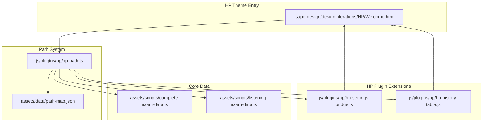
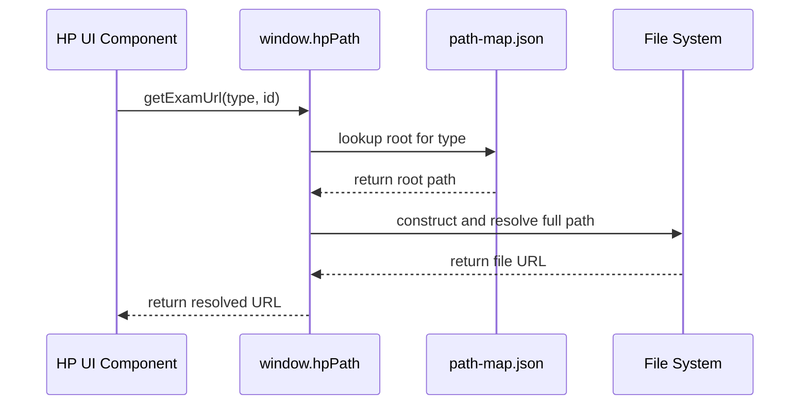
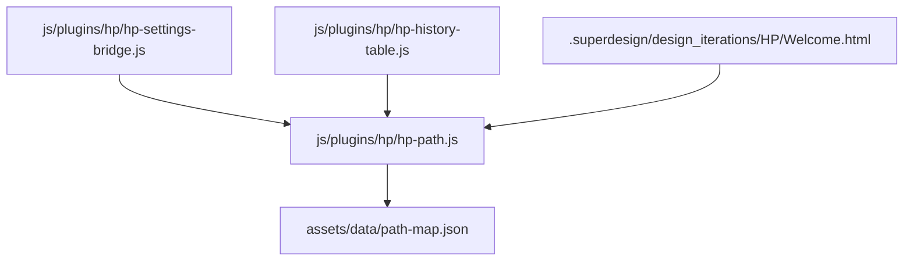

# HP Path System & Extensions

> **Relevant source files**
> * [.superdesign/design_iterations/HP/Welcome.html](https://github.com/sallowayma-git/IELTS-practice/blob/df0c9b8f/.superdesign/design_iterations/HP/Welcome.html)
> * [assets/data/path-map.json](https://github.com/sallowayma-git/IELTS-practice/blob/df0c9b8f/assets/data/path-map.json)

This document describes the path resolution system and key extension modules that support the Harry Potter (HP) theme in the IELTS practice system. It focuses on the mechanisms for resource path management, plugin extension points, and the integration of HP-specific UI and data components.

For the plugin architecture and HP core bridge, see [8.2]. For the HP Welcome interface and view structure, see [8.1].

## HP Path System Overview

The HP Path System is responsible for resolving resource URLs for exam content, static assets, and data files within the Harry Potter theme. It provides a layer of abstraction over the physical file structure, supporting non-ASCII paths and dynamic base path configuration.

The main code entity is `hp-path.js`, which exposes a global `window.hpPath` object. This object is used by HP theme components to construct correct URLs for exam data, PDFs, and other resources, regardless of deployment environment or directory structure.

### Key Responsibilities

* **Base Path Management:** Dynamically determines and sets the base prefix for all resource URLs.
* **Path Mapping:** Loads and interprets `path-map.json` to resolve logical exam types (e.g., "reading", "listening") to their actual directory roots.
* **Non-ASCII Path Handling:** Ensures compatibility with directories and files containing non-ASCII characters (e.g., Chinese, special symbols).
* **Integration with HP Plugins:** Used by HP-specific UI components and data loaders to fetch exam content and assets.

### System Diagram: HP Path System and Extensions



**Sources:**

* [.superdesign/design_iterations/HP/Welcome.html L617-L647](https://github.com/sallowayma-git/IELTS-practice/blob/df0c9b8f/.superdesign/design_iterations/HP/Welcome.html#L617-L647)
* [js/plugins/hp/hp-path.js](https://github.com/sallowayma-git/IELTS-practice/blob/df0c9b8f/js/plugins/hp/hp-path.js)
* [assets/data/path-map.json L1-L17](https://github.com/sallowayma-git/IELTS-practice/blob/df0c9b8f/assets/data/path-map.json#L1-L17)

## Path Resolution: Code-to-Data Mapping

The HP Path System bridges logical resource requests in code to the actual file system structure, using a mapping file and runtime configuration.

### Path Resolution Flow



* The HP UI component (e.g., practice list, history table) calls a method on `window.hpPath` to get a resource URL.
* `hp-path.js` consults `path-map.json` to determine the correct root directory for the requested type.
* The resolved path is constructed, handling any non-ASCII or special cases.
* The final URL is returned to the component for use in AJAX requests or asset loading.

**Sources:**

* [js/plugins/hp/hp-path.js](https://github.com/sallowayma-git/IELTS-practice/blob/df0c9b8f/js/plugins/hp/hp-path.js)
* [assets/data/path-map.json L1-L17](https://github.com/sallowayma-git/IELTS-practice/blob/df0c9b8f/assets/data/path-map.json#L1-L17)
* [.superdesign/design_iterations/HP/Welcome.html L624-L647](https://github.com/sallowayma-git/IELTS-practice/blob/df0c9b8f/.superdesign/design_iterations/HP/Welcome.html#L624-L647)

## HP Path System: Base Prefix and Path Map

The HP Path System supports dynamic base path configuration and path mapping to ensure correct resource resolution in different deployment scenarios.

### Base Prefix Enforcement

* The HP theme entry page (`Welcome.html`) enforces a default base prefix for all HP resource paths using a script block.
* The global `window.hpPath.setBasePrefix()` method is called to set the base directory (e.g., `"../../.."`).
* If `window.hpPath` is not available, a fallback global `window.HP_BASE_PREFIX` is set.

**Example logic:**  

See `.superdesign/design_iterations/HP/Welcome.html:628-647` for the enforcement pattern.

### Path Map Structure

* The file `assets/data/path-map.json` defines the mapping from logical exam types to their root directories.
* Example structure: ```json {   "reading": {     "root": "睡着过项目组(9.4)[134篇]/3. 所有文章(9.4)[134篇]/",     "exceptions": { "special-cases": [] }   },   "listening": {     "root": "ListeningPractice/",     "exceptions": { "special-cases": [] }   },   "version": "1.0",   "lastUpdated": "2025-09-21T01:52:00Z" } ```
* This mapping is used by `hp-path.js` to resolve resource URLs for different exam types.

**Sources:**

* [.superdesign/design_iterations/HP/Welcome.html L628-L647](https://github.com/sallowayma-git/IELTS-practice/blob/df0c9b8f/.superdesign/design_iterations/HP/Welcome.html#L628-L647)
* [assets/data/path-map.json L1-L17](https://github.com/sallowayma-git/IELTS-practice/blob/df0c9b8f/assets/data/path-map.json#L1-L17)
* [js/plugins/hp/hp-path.js](https://github.com/sallowayma-git/IELTS-practice/blob/df0c9b8f/js/plugins/hp/hp-path.js)

## HP Plugin Extensions: Settings and History

The HP theme includes several extension modules that provide enhanced functionality for settings management and practice history display. These modules are tightly integrated with the HP Path System for resource access.

### Settings Bridge (hp-settings-bridge.js)

* Handles mapping of UI actions (e.g., backup, import/export, theme switching) to system functions.
* Uses both positional and text-based matching to bind buttons to actions, increasing robustness across UI changes.
* Relies on the HP Path System for any file or data operations that require path resolution.

#### Button Mapping and Fallback

| Button Text Pattern | Regex | Target Function |
| --- | --- | --- |
| Cache clearing | `/清.*缓存/` | `clearCache()` |
| Library loading | `/加载.*题库 | 重新加载/` |
| Configuration | `/配置 | 题库配置/` |
| Force refresh | `/强制.*刷新/` | `forceRefresh()` |
| Create backup | `/创建.*备份/` | `createBackup()` |
| Backup list | `/备份.*列表/` | `backupList()` |
| Export data | `/导出/` | `exportData()` |
| Import data | `/导入/` | `importData()` |

**Sources:**

* [js/plugins/hp/hp-settings-bridge.js L9-L61](https://github.com/sallowayma-git/IELTS-practice/blob/df0c9b8f/js/plugins/hp/hp-settings-bridge.js#L9-L61)
* [.superdesign/design_iterations/HP/Welcome.html L523-L547](https://github.com/sallowayma-git/IELTS-practice/blob/df0c9b8f/.superdesign/design_iterations/HP/Welcome.html#L523-L547)

### History Table (hp-history-table.js)

* Implements a virtual scrolling table for displaying practice history.
* Uses the HP Path System to resolve links to exam content and assets.
* Supports filtering by type, category, and date range.

#### Virtual Scrolling and Filtering

* Maintains a limited number of DOM elements for performance.
* Uses spacer elements to preserve scroll position.
* Applies filters to the record list before rendering.

**Sources:**

* [js/plugins/hp/hp-history-table.js L15-L303](https://github.com/sallowayma-git/IELTS-practice/blob/df0c9b8f/js/plugins/hp/hp-history-table.js#L15-L303)
* [.superdesign/design_iterations/HP/Welcome.html L492-L503](https://github.com/sallowayma-git/IELTS-practice/blob/df0c9b8f/.superdesign/design_iterations/HP/Welcome.html#L492-L503)

## HP Path System: Integration with UI and Data Extensions

The HP Path System is used by multiple HP theme extensions to ensure correct resource access and data flow.

### Integration Diagram: HP Path System and Extension Modules



* `hp-settings-bridge.js` and `hp-history-table.js` both depend on `hp-path.js` for resource resolution.
* The entry HTML (`Welcome.html`) loads and configures the path system at startup.
* The path map file is the source of truth for directory mappings.

**Sources:**

* [js/plugins/hp/hp-path.js](https://github.com/sallowayma-git/IELTS-practice/blob/df0c9b8f/js/plugins/hp/hp-path.js)
* [js/plugins/hp/hp-settings-bridge.js](https://github.com/sallowayma-git/IELTS-practice/blob/df0c9b8f/js/plugins/hp/hp-settings-bridge.js)
* [js/plugins/hp/hp-history-table.js](https://github.com/sallowayma-git/IELTS-practice/blob/df0c9b8f/js/plugins/hp/hp-history-table.js)
* [.superdesign/design_iterations/HP/Welcome.html L617-L647](https://github.com/sallowayma-git/IELTS-practice/blob/df0c9b8f/.superdesign/design_iterations/HP/Welcome.html#L617-L647)
* [assets/data/path-map.json L1-L17](https://github.com/sallowayma-git/IELTS-practice/blob/df0c9b8f/assets/data/path-map.json#L1-L17)

## HP Path System: Non-ASCII Path and Compatibility

The HP Path System is designed to handle non-ASCII directory and file names, which are common in the exam data set. This is achieved by:

* Using `encodeURIComponent` or equivalent logic in `hp-path.js` to safely construct URLs.
* Ensuring that all path lookups via `path-map.json` are compatible with Unicode and special characters.
* Providing fallback logic for environments where path resolution may fail.

This compatibility is critical for supporting the full range of exam content in the HP theme.

**Sources:**

* [js/plugins/hp/hp-path.js](https://github.com/sallowayma-git/IELTS-practice/blob/df0c9b8f/js/plugins/hp/hp-path.js)
* [assets/data/path-map.json L1-L17](https://github.com/sallowayma-git/IELTS-practice/blob/df0c9b8f/assets/data/path-map.json#L1-L17)

## Component Integration Patterns

All HP UI components follow consistent integration patterns with the hpCore bridge system:

### Initialization Pattern

```javascript
if (typeof hpCore === 'undefined') { 
  console.error('[Component] hpCore missing'); 
  return; 
}

hpCore.ready(() => {
  // Component initialization
});
```

### Data Access Pattern

* `hpCore.getExamIndex()` for exam data access
* `hpCore.getRecords()` for practice record access
* `hpCore.on('dataUpdated', callback)` for real-time updates

### DOM Targeting Strategy

Components use specific ID selectors for their target containers, with fallback strategies for different page layouts. This allows the same components to work across different HP theme pages while maintaining separation of concerns.

**Sources:** [js/plugins/hp/hp-welcome-ui.js L9](https://github.com/sallowayma-git/IELTS-practice/blob/df0c9b8f/js/plugins/hp/hp-welcome-ui.js#L9-L9)

 [js/plugins/hp/hp-practice-render.js L8](https://github.com/sallowayma-git/IELTS-practice/blob/df0c9b8f/js/plugins/hp/hp-practice-render.js#L8-L8)

 [js/plugins/hp/hp-history-table.js L8](https://github.com/sallowayma-git/IELTS-practice/blob/df0c9b8f/js/plugins/hp/hp-history-table.js#L8-L8)

 [js/plugins/hp/hp-settings-bridge.js L7](https://github.com/sallowayma-git/IELTS-practice/blob/df0c9b8f/js/plugins/hp/hp-settings-bridge.js#L7-L7)