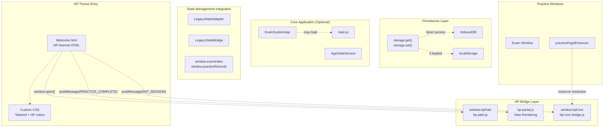
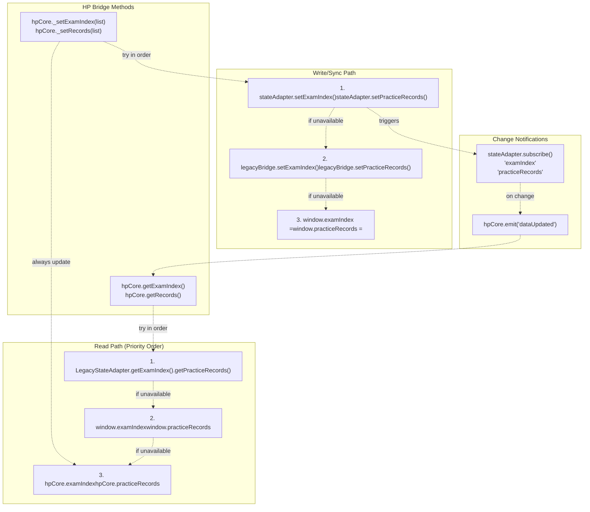
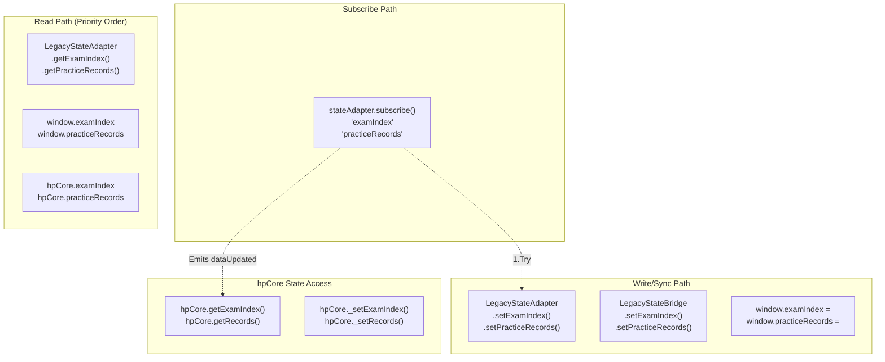
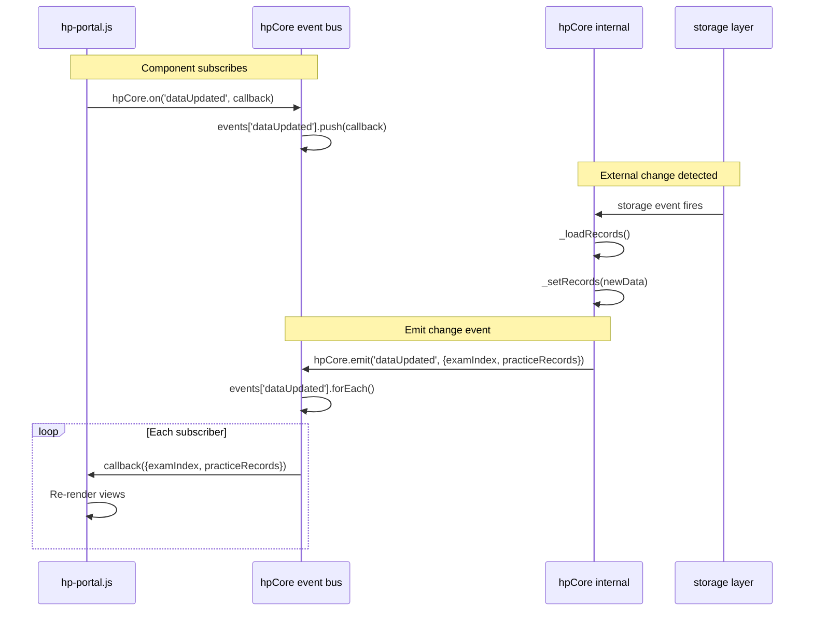
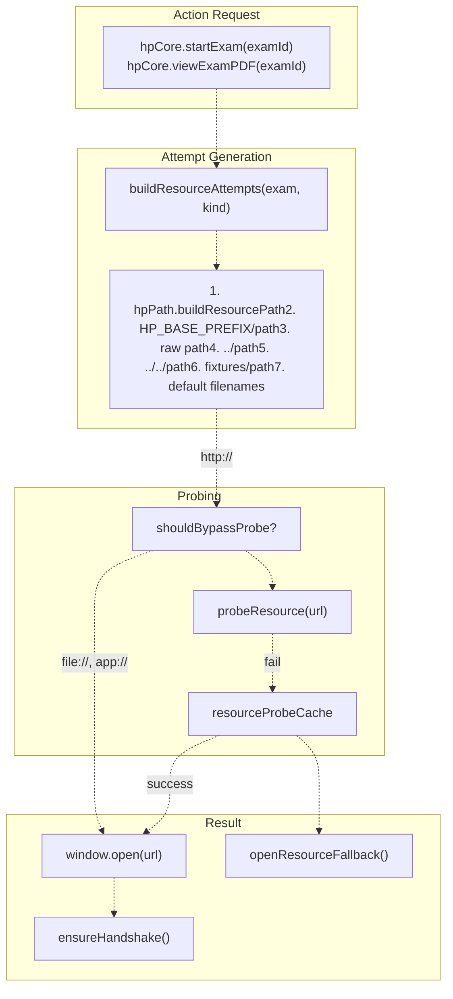
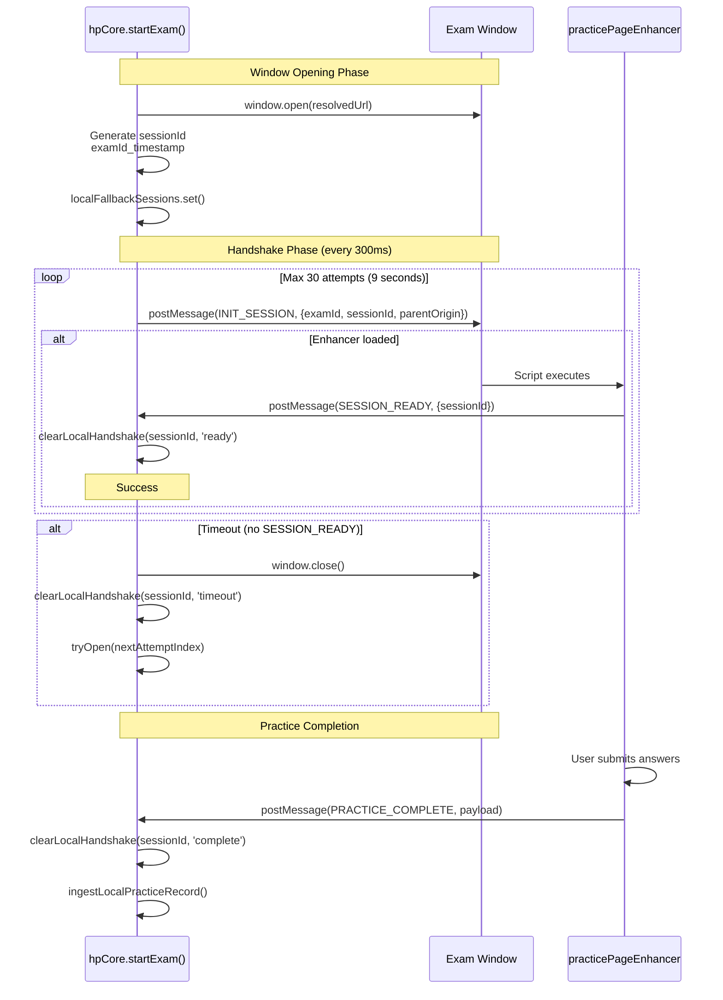
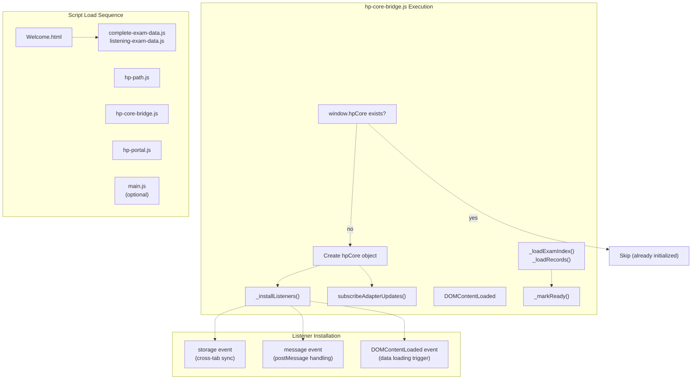
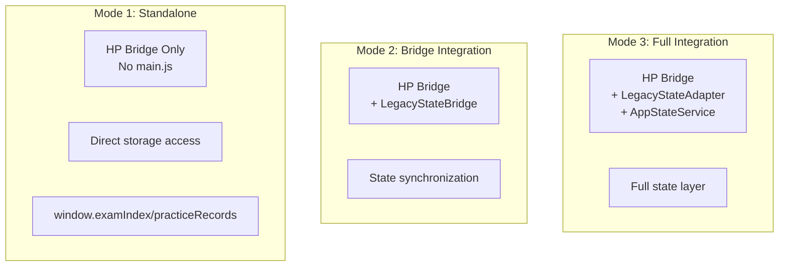

# HP Theme & Core Bridge

> **Relevant source files**
> * [.superdesign/design_iterations/HP/Welcome.html](https://github.com/sallowayma-git/IELTS-practice/blob/92f64eb8/.superdesign/design_iterations/HP/Welcome.html)
> * [js/plugins/hp/hp-core-bridge.js](https://github.com/sallowayma-git/IELTS-practice/blob/92f64eb8/js/plugins/hp/hp-core-bridge.js)

## Purpose and Scope

This document provides an overview of the Harry Potter themed variant and its unique architecture. The HP theme demonstrates a plugin-based approach where themed interfaces operate semi-independently from the main application using the `hpCore` bridge as a stable API layer. This architecture enables the HP theme to function as both a standalone interface and a fully-integrated component of the main system.

**Child pages provide detailed information:**

* **Page 8.1** - HP Welcome Interface & Views: HTML structure, view sections, and theme-specific styling
* **Page 8.2** - HP Core Bridge Architecture: Event bus, handshake protocol, data normalization, and resource resolution implementation
* **Page 8.3** - HP UI Components & Extensions: HP-specific UI components and their integration with the core bridge

For general theme system architecture, see **Page 7**. For runtime theme switching mechanics, see **Page 7.4**.

---

## HP Theme Architecture Overview

The HP theme consists of three primary components that work together to provide a themed interface with independent data management capabilities:

**System Architecture Diagram**



**Sources:** [js/plugins/hp/hp-core-bridge.js L1-L1000](https://github.com/sallowayma-git/IELTS-practice/blob/92f64eb8/js/plugins/hp/hp-core-bridge.js#L1-L1000)

 [.superdesign/design_iterations/HP/Welcome.html L617-L656](https://github.com/sallowayma-git/IELTS-practice/blob/92f64eb8/.superdesign/design_iterations/HP/Welcome.html#L617-L656)

---

## Key Components

### HP Core Bridge (window.hpCore)

The `hpCore` object exposed by [js/plugins/hp/hp-core-bridge.js](https://github.com/sallowayma-git/IELTS-practice/blob/92f64eb8/js/plugins/hp/hp-core-bridge.js)

 serves as the primary API for the HP theme. It provides:

| Component | Purpose | Key Methods |
| --- | --- | --- |
| **Lifecycle Management** | Initialization and ready state | `ready(callback)`, `isReady`, `_markReady()` |
| **Event Bus** | Loose coupling between components | `on(event, cb)`, `off(event, cb)`, `emit(event, payload)` |
| **Data Access** | Unified data retrieval | `getExamIndex()`, `getRecords()`, `getExamById(id)` |
| **Actions** | Exam launching and resource access | `startExam(examId)`, `viewExamPDF(examId)` |
| **UI Helpers** | User feedback | `showMessage(msg, type, duration)` |
| **Status** | System information | `getStatus()`, `version`, `lastUpdateTime` |

The bridge operates independently of the main application while maintaining compatibility through state adapters when available. See **Page 8.2** for detailed implementation.

**Sources:** [js/plugins/hp/hp-core-bridge.js L662-L751](https://github.com/sallowayma-git/IELTS-practice/blob/92f64eb8/js/plugins/hp/hp-core-bridge.js#L662-L751)

### HP Portal (hp-portal.js)

The portal script manages view rendering and user interaction within the HP theme. It:

* Renders view sections (Overview, Practice, History, Settings)
* Handles navigation between views
* Calls `hpCore` methods to retrieve data and perform actions
* Manages UI state and event handlers

See **Page 8.1** for details on view structure and rendering.

**Sources:** [.superdesign/design_iterations/HP/Welcome.html L649](https://github.com/sallowayma-git/IELTS-practice/blob/92f64eb8/.superdesign/design_iterations/HP/Welcome.html#L649-L649)

### HP Path (window.hpPath)

The path resolution system handles resource location across different deployment contexts:

* Implements multi-strategy path resolution
* Manages `HP_BASE_PREFIX` configuration
* Probes resources with caching
* Builds fallback path chains

See **Page 8.2** for resource resolution details.

**Sources:** [js/plugins/hp/hp-path.js](https://github.com/sallowayma-git/IELTS-practice/blob/92f64eb8/js/plugins/hp/hp-path.js)

 [js/plugins/hp/hp-core-bridge.js L425-L660](https://github.com/sallowayma-git/IELTS-practice/blob/92f64eb8/js/plugins/hp/hp-core-bridge.js#L425-L660)

---

## State Management Integration

The HP bridge implements a multi-tier state access strategy that provides graceful degradation across different integration scenarios:

**State Access Priority Diagram**



### Integration Functions

The bridge uses helper functions to abstract state access:

**`readExamIndexSnapshot()`** [js/plugins/hp/hp-core-bridge.js L910-L918](https://github.com/sallowayma-git/IELTS-practice/blob/92f64eb8/js/plugins/hp/hp-core-bridge.js#L910-L918)

* Attempts to read from `LegacyStateAdapter` first
* Falls back to `window.examIndex`
* Finally uses local `hpCore.examIndex`

**`syncExamIndex(list)`** [js/plugins/hp/hp-core-bridge.js L930-L943](https://github.com/sallowayma-git/IELTS-practice/blob/92f64eb8/js/plugins/hp/hp-core-bridge.js#L930-L943)

* Attempts to write through `stateAdapter.setExamIndex()`
* Falls back to `legacyBridge.setExamIndex()`
* Finally writes to `window.examIndex`
* Always updates internal `hpCore.examIndex`

**`subscribeAdapterUpdates()`** [js/plugins/hp/hp-core-bridge.js L960-L984](https://github.com/sallowayma-git/IELTS-practice/blob/92f64eb8/js/plugins/hp/hp-core-bridge.js#L960-L984)

* Subscribes to state adapter change notifications
* Emits `dataUpdated` events to maintain synchronization
* Keeps HP bridge in sync with main application state

This architecture enables three operational modes:

| Mode | Available Components | Data Source | Data Sink |
| --- | --- | --- | --- |
| **Standalone** | HP Bridge only | `storage.get()` → `window.*` | `storage.set()` + `window.*` |
| **Bridge Integration** | + `LegacyStateBridge` | `legacyBridge.get*()` | `legacyBridge.set*()` |
| **Full Integration** | + `LegacyStateAdapter` + `AppStateService` | `stateAdapter.get*()` | `stateAdapter.set*()` |

**Sources:** [js/plugins/hp/hp-core-bridge.js L13-L16](https://github.com/sallowayma-git/IELTS-practice/blob/92f64eb8/js/plugins/hp/hp-core-bridge.js#L13-L16)

 [js/plugins/hp/hp-core-bridge.js L910-L984](https://github.com/sallowayma-git/IELTS-practice/blob/92f64eb8/js/plugins/hp/hp-core-bridge.js#L910-L984)

---

## State Management Integration

The HP bridge integrates with the application's state management through multiple layers of abstraction, providing graceful degradation when components are unavailable.



### State Synchronization Functions

The bridge implements dedicated synchronization functions that handle the multi-tier state update strategy:

**`readExamIndexSnapshot()`** [js/plugins/hp/hp-core-bridge.js L910-L918](https://github.com/sallowayma-git/IELTS-practice/blob/92f64eb8/js/plugins/hp/hp-core-bridge.js#L910-L918)

:

1. Checks `stateAdapter.getExamIndex()` if available
2. Falls back to `window.examIndex`
3. Final fallback to `hpCore.examIndex`

**`syncExamIndex(list)`** [js/plugins/hp/hp-core-bridge.js L930-L943](https://github.com/sallowayma-git/IELTS-practice/blob/92f64eb8/js/plugins/hp/hp-core-bridge.js#L930-L943)

:

1. Attempts `stateAdapter.setExamIndex()` with source tag
2. Falls back to `legacyBridge.setExamIndex()`
3. Final fallback to setting `window.examIndex`
4. Always updates `hpCore.examIndex`

**`subscribeAdapterUpdates()`** [js/plugins/hp/hp-core-bridge.js L960-L984](https://github.com/sallowayma-git/IELTS-practice/blob/92f64eb8/js/plugins/hp/hp-core-bridge.js#L960-L984)

:

* Subscribes to state adapter changes
* Emits `dataUpdated` events when state changes externally
* Ensures HP bridge stays synchronized with app state

**Sources:** [js/plugins/hp/hp-core-bridge.js L13-L16](https://github.com/sallowayma-git/IELTS-practice/blob/92f64eb8/js/plugins/hp/hp-core-bridge.js#L13-L16)

 [js/plugins/hp/hp-core-bridge.js L910-L984](https://github.com/sallowayma-git/IELTS-practice/blob/92f64eb8/js/plugins/hp/hp-core-bridge.js#L910-L984)

---

## Event-Driven Communication

The HP bridge uses an event bus pattern to enable loose coupling between components. Components subscribe to events and react to data changes without direct dependencies.

**Event Flow Diagram**



### Key Events

| Event | Payload | Trigger |
| --- | --- | --- |
| `dataUpdated` | `{ examIndex, practiceRecords, __source }` | Data changes from any source |

The `__source` field indicates the origin: `'hp-core'` for HP bridge changes, or other identifiers for external updates. This prevents circular update loops.

Detailed event bus implementation is described in **Page 8.2**.

**Sources:** [js/plugins/hp/hp-core-bridge.js L27](https://github.com/sallowayma-git/IELTS-practice/blob/92f64eb8/js/plugins/hp/hp-core-bridge.js#L27-L27)

 [js/plugins/hp/hp-core-bridge.js L679-L696](https://github.com/sallowayma-git/IELTS-practice/blob/92f64eb8/js/plugins/hp/hp-core-bridge.js#L679-L696)

 [js/plugins/hp/hp-core-bridge.js L761-L779](https://github.com/sallowayma-git/IELTS-practice/blob/92f64eb8/js/plugins/hp/hp-core-bridge.js#L761-L779)

---

## Resource Resolution

The HP bridge implements multi-strategy resource resolution to locate exam files across different deployment contexts (file system, web server, embedded environments).

**Resolution Flow Diagram**



### Attempt Generation

**`buildResourceAttempts(exam, kind)`** [js/plugins/hp/hp-core-bridge.js L510-L567](https://github.com/sallowayma-git/IELTS-practice/blob/92f64eb8/js/plugins/hp/hp-core-bridge.js#L510-L567)

 creates an ordered list of path strategies:

| Priority | Strategy | Path Pattern | Example |
| --- | --- | --- | --- |
| 1 | Map-based | `hpPath.buildResourcePath(exam, kind)` | Configured in path-map.json |
| 2 | Fallback | `HP_BASE_PREFIX/exam.path/exam.filename` | `../../path/exam.html` |
| 3 | Raw | `exam.path/exam.filename` | `path/exam.html` |
| 4 | Relative-up | `../exam.path/exam.filename` | `../path/exam.html` |
| 5 | Relative-design | `../../exam.path/exam.filename` | `../../path/exam.html` |
| 6 | Fixtures | `developer/tests/e2e/fixtures/exam.path/exam.filename` | Testing paths |
| 7 | Defaults | `HP_BASE_PREFIX/exam.path/{index,practice,exam}.html` | Common filenames |

### Probing and Caching

**`shouldBypassProbe(url)`** [js/plugins/hp/hp-core-bridge.js L425-L444](https://github.com/sallowayma-git/IELTS-practice/blob/92f64eb8/js/plugins/hp/hp-core-bridge.js#L425-L444)

 bypasses HTTP probing for:

* Local protocols: `file://`, `app://`, `chrome-extension://`, `capacitor://`, `ionic://`
* When `window.__HP_DISABLE_PROBE__` is set

**`probeResource(url)`** [js/plugins/hp/hp-core-bridge.js L569-L608](https://github.com/sallowayma-git/IELTS-practice/blob/92f64eb8/js/plugins/hp/hp-core-bridge.js#L569-L608)

 validates resource availability:

* Caches results in `resourceProbeCache` Map
* Uses `fetch()` with HEAD method
* Falls back to GET with no-cors mode
* Returns boolean promise

Detailed resource resolution implementation is in **Page 8.2**.

**Sources:** [js/plugins/hp/hp-core-bridge.js L425-L624](https://github.com/sallowayma-git/IELTS-practice/blob/92f64eb8/js/plugins/hp/hp-core-bridge.js#L425-L624)

 [js/plugins/hp/hp-path.js](https://github.com/sallowayma-git/IELTS-practice/blob/92f64eb8/js/plugins/hp/hp-path.js)

---

## Exam Window Communication

The HP bridge establishes communication with opened exam windows using a `postMessage`-based handshake protocol. This enables the bridge to inject data collection capabilities and receive practice completion notifications.

**Handshake Protocol Diagram**



### Session Tracking

**`localFallbackSessions`** [js/plugins/hp/hp-core-bridge.js L30](https://github.com/sallowayma-git/IELTS-practice/blob/92f64eb8/js/plugins/hp/hp-core-bridge.js#L30-L30)

 is a Map storing active sessions:

```javascript
sessionId => {
  examId: string,
  exam: object | null,
  win: Window,
  timer: interval handle,
  sessionId: string,
  attemptIndex: number,
  attempts: Array,
  status: 'pending' | 'ready' | 'complete' | 'closed' | 'timeout',
  onTimeout: function,
  onReady: function,
  onClosed: function,
  onStatus: function
}
```

### Key Functions

| Function | Purpose | Location |
| --- | --- | --- |
| `startLocalHandshake()` | Begin sending INIT_SESSION messages | [js/plugins/hp/hp-core-bridge.js L271-L329](https://github.com/sallowayma-git/IELTS-practice/blob/92f64eb8/js/plugins/hp/hp-core-bridge.js#L271-L329) |
| `clearLocalHandshake()` | Stop handshake and invoke callbacks | [js/plugins/hp/hp-core-bridge.js L243-L269](https://github.com/sallowayma-git/IELTS-practice/blob/92f64eb8/js/plugins/hp/hp-core-bridge.js#L243-L269) |
| `ensureHandshake()` | Coordinate with legacy fallback | [js/plugins/hp/hp-core-bridge.js L331-L340](https://github.com/sallowayma-git/IELTS-practice/blob/92f64eb8/js/plugins/hp/hp-core-bridge.js#L331-L340) |

The protocol handles timeout scenarios by attempting the next path in the resource attempt list. If all paths fail, `openResourceFallback()` displays an error with attempted paths.

Detailed handshake implementation is in **Page 8.2**.

**Sources:** [js/plugins/hp/hp-core-bridge.js L30](https://github.com/sallowayma-git/IELTS-practice/blob/92f64eb8/js/plugins/hp/hp-core-bridge.js#L30-L30)

 [js/plugins/hp/hp-core-bridge.js L243-L340](https://github.com/sallowayma-git/IELTS-practice/blob/92f64eb8/js/plugins/hp/hp-core-bridge.js#L243-L340)

---

## Practice Data Handling

The HP bridge processes practice completion messages using normalization and ingestion logic to handle varied payload formats.

### Data Normalization

**`normalizePracticePayload(payload)`** [js/plugins/hp/hp-core-bridge.js L131-L233](https://github.com/sallowayma-git/IELTS-practice/blob/92f64eb8/js/plugins/hp/hp-core-bridge.js#L131-L233)

 extracts practice data from inconsistent schemas:

**Extraction Strategy:**

1. Flatten nested objects: `payload.data`, `payload.scoreInfo`, `payload.result`, `payload.meta`
2. Search multiple field name variants in priority order
3. Use answer comparison or answer-vs-correct fallbacks for counting
4. Calculate derived fields (percentage from correct/total)
5. Validate and clamp values

**Search Keys:**

| Field | Alternative Names |
| --- | --- |
| `percentage` | accuracy, percent, scorePercent |
| `correct` | score, correctCount, right, correctAnswers |
| `total` | totalQuestions, questionCount, questions, max, totalCount |
| `duration` | totalTime, elapsedTime, timeSpent, time |

**Helper Functions:**

* **`countFromAnswerComparison()`** [js/plugins/hp/hp-core-bridge.js L83-L112](https://github.com/sallowayma-git/IELTS-practice/blob/92f64eb8/js/plugins/hp/hp-core-bridge.js#L83-L112) : Counts from comparison object
* **`countFromAnswers()`** [js/plugins/hp/hp-core-bridge.js L114-L129](https://github.com/sallowayma-git/IELTS-practice/blob/92f64eb8/js/plugins/hp/hp-core-bridge.js#L114-L129) : Counts from answer arrays/objects

### Record Ingestion

**`ingestLocalPracticeRecord(examId, payload, context)`** [js/plugins/hp/hp-core-bridge.js L342-L423](https://github.com/sallowayma-git/IELTS-practice/blob/92f64eb8/js/plugins/hp/hp-core-bridge.js#L342-L423)

 saves practice records:

**Process:**

1. Read current records and exam index
2. Normalize payload with `normalizePracticePayload()`
3. Calculate metrics (accuracy, percentage, duration)
4. Deduplicate by `sessionId`
5. Build record object with standard schema
6. Persist via `storage.set()` and `hpCore._setRecords()`
7. Show success message

**Message Handling:** [js/plugins/hp/hp-core-bridge.js L861-L901](https://github.com/sallowayma-git/IELTS-practice/blob/92f64eb8/js/plugins/hp/hp-core-bridge.js#L861-L901)

* Listens for `PRACTICE_COMPLETE_TYPES` messages
* Delegates to `window.savePracticeRecordFallback()` if available
* Falls back to `ingestLocalPracticeRecord()` for standalone operation
* Reloads records after delay to sync state

Detailed normalization and ingestion implementation is in **Page 8.2**.

**Sources:** [js/plugins/hp/hp-core-bridge.js L83-L233](https://github.com/sallowayma-git/IELTS-practice/blob/92f64eb8/js/plugins/hp/hp-core-bridge.js#L83-L233)

 [js/plugins/hp/hp-core-bridge.js L342-L423](https://github.com/sallowayma-git/IELTS-practice/blob/92f64eb8/js/plugins/hp/hp-core-bridge.js#L342-L423)

 [js/plugins/hp/hp-core-bridge.js L861-L901](https://github.com/sallowayma-git/IELTS-practice/blob/92f64eb8/js/plugins/hp/hp-core-bridge.js#L861-L901)

---

## Initialization and Lifecycle

The HP bridge uses defensive initialization to ensure safe operation in various deployment scenarios.

**Initialization Flow Diagram**



### Initialization Steps

**1. Existence Check** [js/plugins/hp/hp-core-bridge.js L22-L25](https://github.com/sallowayma-git/IELTS-practice/blob/92f64eb8/js/plugins/hp/hp-core-bridge.js#L22-L25)

* Prevents double initialization
* Checks `window.hpCore.__stable` marker

**2. Object Creation** [js/plugins/hp/hp-core-bridge.js L662-L908](https://github.com/sallowayma-git/IELTS-practice/blob/92f64eb8/js/plugins/hp/hp-core-bridge.js#L662-L908)

* Creates `hpCore` with API methods
* Initializes event registry and data caches
* Sets `__stable: true` marker

**3. Listener Installation** [js/plugins/hp/hp-core-bridge.js L852-L907](https://github.com/sallowayma-git/IELTS-practice/blob/92f64eb8/js/plugins/hp/hp-core-bridge.js#L852-L907)

* **`storage` event**: Reloads data on external changes
* **`message` event**: Handles `SESSION_READY` and `PRACTICE_COMPLETE` messages
* **`DOMContentLoaded` event**: Triggers data loading

**4. State Adapter Subscription** [js/plugins/hp/hp-core-bridge.js L960-L991](https://github.com/sallowayma-git/IELTS-practice/blob/92f64eb8/js/plugins/hp/hp-core-bridge.js#L960-L991)

* Subscribes to `LegacyStateAdapter` if available
* Emits `dataUpdated` on external state changes

**5. Data Loading** [js/plugins/hp/hp-core-bridge.js L780-L840](https://github.com/sallowayma-git/IELTS-practice/blob/92f64eb8/js/plugins/hp/hp-core-bridge.js#L780-L840)

* **`_loadExamIndex()`**: Reads from snapshot → storage → global variables
* **`_loadRecords()`**: Reads from snapshot → storage → global variables

**6. Ready State** [js/plugins/hp/hp-core-bridge.js L754-L760](https://github.com/sallowayma-git/IELTS-practice/blob/92f64eb8/js/plugins/hp/hp-core-bridge.js#L754-L760)

* Sets `isReady = true`
* Executes queued callbacks from `hpCore.ready(callback)` calls

**7. Action Override** [js/plugins/hp/hp-core-bridge.js L1001-L1119](https://github.com/sallowayma-git/IELTS-practice/blob/92f64eb8/js/plugins/hp/hp-core-bridge.js#L1001-L1119)

* Replaces `startExam()` and `viewExamPDF()` with standalone implementations
* Enables operation without `main.js` globals

**Sources:** [js/plugins/hp/hp-core-bridge.js L22-L1000](https://github.com/sallowayma-git/IELTS-practice/blob/92f64eb8/js/plugins/hp/hp-core-bridge.js#L22-L1000)

---

## Operational Modes

The HP bridge adapts to three operational modes based on available components:

**Operational Mode Comparison**

| Mode | Components Available | Data Source | Data Sink | Use Case |
| --- | --- | --- | --- | --- |
| **Standalone** | HP bridge only | `storage.get()` + `window.*` | `storage.set()` + `window.*` | Pure HP theme deployment |
| **Bridge Integration** | + `LegacyStateBridge` | `legacyBridge.get*()` | `legacyBridge.set*()` | Hybrid with legacy globals |
| **Full Integration** | + `LegacyStateAdapter` + `AppStateService` | `stateAdapter.get*()` | `stateAdapter.set*()` | Complete app integration |

### Mode Detection

**Standalone Mode:** [js/plugins/hp/hp-core-bridge.js L13-L16](https://github.com/sallowayma-git/IELTS-practice/blob/92f64eb8/js/plugins/hp/hp-core-bridge.js#L13-L16)

```javascript
const stateAdapter = window.LegacyStateAdapter ? LegacyStateAdapter.getInstance() : null;
const legacyBridge = window.LegacyStateBridge?.getInstance?.() : null;
```

Both are `null`, so bridge uses direct storage API and global variables.

### Action Override Pattern

The bridge provides fallback implementations that work without main application:

**Default (tries main app first):** [js/plugins/hp/hp-core-bridge.js L723-L734](https://github.com/sallowayma-git/IELTS-practice/blob/92f64eb8/js/plugins/hp/hp-core-bridge.js#L723-L734)

```
startExam(examId) {
  if (typeof window.openExam === 'function') return window.openExam(examId);
  if (window.app?.openExam) return window.app.openExam(examId);
  this.showMessage('无法启动练习：openExam 未就绪', 'error');
}
```

**Override (standalone implementation):** [js/plugins/hp/hp-core-bridge.js L1003-L1082](https://github.com/sallowayma-git/IELTS-practice/blob/92f64eb8/js/plugins/hp/hp-core-bridge.js#L1003-L1082)

```javascript
hpCore.startExam = function(examId) {
  // Try main app methods first
  if (typeof window.openExam === 'function') return window.openExam(examId);
  
  // Full standalone implementation
  const exam = readExamIndexSnapshot().find(e => e?.id === examId);
  resolveResource(exam, 'html').then(result => {
    const tryOpen = (index) => {
      const win = window.open(url, target, features);
      ensureHandshake(win, exam, examId, {
        onTimeout: () => tryOpen(index + 1)  // Fallback to next path
      });
    };
    tryOpen(0);
  });
};
```

This pattern enables:

* Use of main app functionality when available
* Full fallback capability for standalone operation
* Consistent API regardless of integration mode

**Sources:** [js/plugins/hp/hp-core-bridge.js L13-L16](https://github.com/sallowayma-git/IELTS-practice/blob/92f64eb8/js/plugins/hp/hp-core-bridge.js#L13-L16)

 [js/plugins/hp/hp-core-bridge.js L723-L1119](https://github.com/sallowayma-git/IELTS-practice/blob/92f64eb8/js/plugins/hp/hp-core-bridge.js#L723-L1119)

---

## Integration with Main Application

The HP bridge operates in three integration modes depending on what components are available:

### Integration Modes



**Mode 1 - Standalone:** [js/plugins/hp/hp-core-bridge.js L13-L16](https://github.com/sallowayma-git/IELTS-practice/blob/92f64eb8/js/plugins/hp/hp-core-bridge.js#L13-L16)

* `stateAdapter` is `null`
* `legacyBridge` is `null`
* Direct storage API access via `storage.get()` / `storage.set()`
* Global variables as fallback: `window.examIndex`, `window.practiceRecords`

**Mode 2 - Bridge Integration:**

* `legacyBridge` available but `stateAdapter` is `null`
* Uses `LegacyStateBridge.setExamIndex()` / `setPracticeRecords()`
* Bidirectional sync with global variables

**Mode 3 - Full Integration:**

* Both `stateAdapter` and `legacyBridge` available
* Uses `LegacyStateAdapter` as primary interface
* Subscribes to state changes
* Full integration with `AppStateService`

### Action Override Pattern

The HP bridge overrides action methods to work independently:

**Default Implementation:** [js/plugins/hp/hp-core-bridge.js L723-L734](https://github.com/sallowayma-git/IELTS-practice/blob/92f64eb8/js/plugins/hp/hp-core-bridge.js#L723-L734)

```
startExam(examId) {
  if (typeof window.openExam === 'function') return window.openExam(examId);
  if (window.app?.openExam) return window.app.openExam(examId);
  this.showMessage('无法启动练习：openExam 未就绪', 'error');
}
```

**Full Override:** [js/plugins/hp/hp-core-bridge.js L1003-L1082](https://github.com/sallowayma-git/IELTS-practice/blob/92f64eb8/js/plugins/hp/hp-core-bridge.js#L1003-L1082)

```javascript
hpCore.startExam = function startExam(examId) {
  // 1. Try main app methods
  if (typeof window.openExam === 'function') return window.openExam(examId);
  if (window.app?.openExam) return window.app.openExam(examId);
  
  // 2. Full standalone implementation
  const exam = readExamIndexSnapshot().find(e => e?.id === examId);
  resolveResource(exam, 'html').then(result => {
    const tryOpen = (index) => {
      // Open window and establish handshake
      const win = window.open(url, target, features);
      ensureHandshake(win, exam, examId, {
        onTimeout: () => tryOpen(index + 1)  // Try next path on timeout
      });
    };
    tryOpen(0);
  });
}
```

This pattern ensures:

* HP theme works in isolation without main app
* Gracefully uses main app functionality when available
* Provides full fallback implementation
* Maintains consistent API regardless of integration mode

**Sources:** [js/plugins/hp/hp-core-bridge.js L723-L1119](https://github.com/sallowayma-git/IELTS-practice/blob/92f64eb8/js/plugins/hp/hp-core-bridge.js#L723-L1119)

---

## Summary

The Harry Potter Theme & Plugin System demonstrates a sophisticated plugin architecture with the following key characteristics:

1. **Independent Operation**: Can function as a standalone interface without the main application
2. **Graceful Integration**: Seamlessly integrates when main application components are available
3. **State Synchronization**: Multi-tier state access with automatic fallback mechanisms
4. **Event-Driven Architecture**: Loose coupling via event bus for component communication
5. **Robust Resource Resolution**: Multiple fallback strategies for locating exam resources
6. **Comprehensive Data Normalization**: Handles various payload formats from different sources
7. **Handshake Protocol**: Reliable communication with exam windows via postMessage
8. **Defensive Programming**: Extensive null checks and fallbacks throughout the codebase

The system serves as both a themed user interface and a reference implementation for future plugin development, demonstrating how alternate interfaces can be built on top of the core IELTS practice system while maintaining compatibility and data consistency.

**Sources:** [js/plugins/hp/hp-core-bridge.js L1-L1122](https://github.com/sallowayma-git/IELTS-practice/blob/92f64eb8/js/plugins/hp/hp-core-bridge.js#L1-L1122)

 [.superdesign/design_iterations/HP/Welcome.html L1-L662](https://github.com/sallowayma-git/IELTS-practice/blob/92f64eb8/.superdesign/design_iterations/HP/Welcome.html#L1-L662)