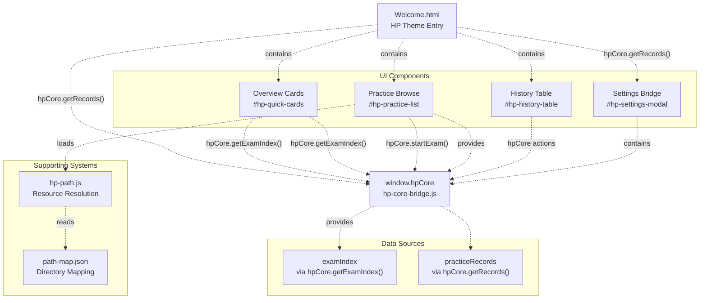
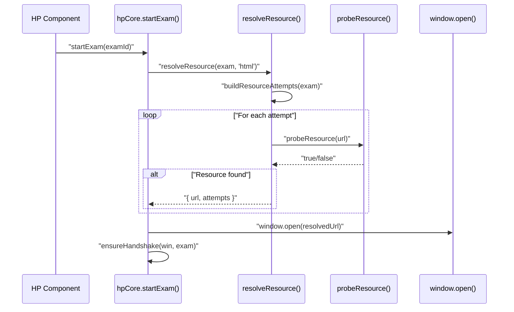

# HP UI Components & Extensions

> **Relevant source files**
> * [.superdesign/design_iterations/HP/Welcome.html](https://github.com/sallowayma-git/IELTS-practice/blob/92f64eb8/.superdesign/design_iterations/HP/Welcome.html)
> * [js/plugins/hp/hp-core-bridge.js](https://github.com/sallowayma-git/IELTS-practice/blob/92f64eb8/js/plugins/hp/hp-core-bridge.js)

This document describes the UI components and extension modules specific to the Harry Potter (HP) theme in the IELTS practice system. It covers the overview cards, practice browse views, history table, settings bridge, and the path-map.json configuration system that supports resource resolution.

For the HP core bridge architecture and state management integration, see [9.2]. For the HP Welcome interface structure and navigation, see [9.1].

## HP UI Component Architecture

The HP theme implements several specialized UI components that render exam data, practice history, and settings controls with a Harry Potter visual style. All components integrate with `window.hpCore` for data access and state management.

### Component System Diagram



**Sources:**

* [.superdesign/design_iterations/HP/Welcome.html L1-L662](https://github.com/sallowayma-git/IELTS-practice/blob/92f64eb8/.superdesign/design_iterations/HP/Welcome.html#L1-L662)
* [js/plugins/hp/hp-core-bridge.js L1-L1122](https://github.com/sallowayma-git/IELTS-practice/blob/92f64eb8/js/plugins/hp/hp-core-bridge.js#L1-L1122)

## Overview Cards Component

The overview section displays summary statistics and quick action cards for recently accessed or featured exams. The component is rendered into the `#hp-quick-cards` container within the `#overview` section.

### Component Structure

| Element ID | Purpose | Data Source |
| --- | --- | --- |
| `#hp-stat-total-exams` | Total exam count | `hpCore.getExamIndex().length` |
| `#hp-stat-completed` | Completed practice count | `hpCore.getRecords().length` |
| `#hp-stat-average` | Average accuracy percentage | Calculated from records |
| `#hp-stat-days` | Consecutive practice days | Calculated from record dates |
| `#hp-quick-cards` | Grid of quick action cards | Top 4 recent exams |

### Quick Action Card Rendering

Each card in `#hp-quick-cards` contains:

* Exam title (`h3` element)
* Metadata: category, frequency (`.hp-card-meta`)
* Action buttons: "Start Practice" and "View PDF" (`.hp-card-actions`)

The cards are dynamically generated based on exam data and use the HP theme's visual style classes (`hp-card-grid`, custom gradient backgrounds).

**Sources:**

* [.superdesign/design_iterations/HP/Welcome.html L415-L448](https://github.com/sallowayma-git/IELTS-practice/blob/92f64eb8/.superdesign/design_iterations/HP/Welcome.html#L415-L448)
* [.superdesign/design_iterations/HP/Welcome.html L91-L143](https://github.com/sallowayma-git/IELTS-practice/blob/92f64eb8/.superdesign/design_iterations/HP/Welcome.html#L91-L143)

## Practice Browse Component

The practice browse component displays a filterable, searchable list of exams in the `#practice` section. It supports static grid rendering and includes type filters (all/reading/listening) and text search.

### Component Structure

| Element ID | Purpose | Functionality |
| --- | --- | --- |
| `#hp-practice-shell` | Container with HP theme styling | Border, shadow, background |
| `[data-practice-type]` | Type filter buttons | Filter by "all", "reading", "listening" |
| `#hp-practice-search` | Search input | Text-based filtering of title/category |
| `#hp-practice-list` | Exam card grid container | Renders filtered exam list |
| `#hp-practice-empty` | Empty state message | Shown when no matches |

### Practice Card Structure

Each card (`.hp-practice-card`) contains:

* Exam title (`h4`)
* Metadata: category, frequency, type
* Action buttons: "Start Practice" and "View PDF"

The `data-mode` attribute on `#hp-practice-list` determines rendering strategy:

* `"static"`: CSS Grid with all items rendered
* `"virtual"`: Virtual scrolling (for large lists)
* `"empty"`: Show empty state

### Exam Launch Integration

Practice cards use `hpCore.startExam(examId)` for launching exams and `hpCore.viewExamPDF(examId)` for PDF viewing. These methods handle:

* Resource resolution via `buildResourceAttempts()` and `resolveResource()` in hp-core-bridge
* Window opening with handshake initialization
* Fallback strategies if resources are not found

**Sources:**

* [.superdesign/design_iterations/HP/Welcome.html L450-L472](https://github.com/sallowayma-git/IELTS-practice/blob/92f64eb8/.superdesign/design_iterations/HP/Welcome.html#L450-L472)
* [.superdesign/design_iterations/HP/Welcome.html L144-L199](https://github.com/sallowayma-git/IELTS-practice/blob/92f64eb8/.superdesign/design_iterations/HP/Welcome.html#L144-L199)
* [js/plugins/hp/hp-core-bridge.js L510-L1119](https://github.com/sallowayma-git/IELTS-practice/blob/92f64eb8/js/plugins/hp/hp-core-bridge.js#L510-L1119)

## History Table Component

The history component displays practice records in a table format with charts and statistics. It renders in the `#history` section and uses HP-specific styling for tables and visual elements.

### Component Structure

| Element ID | Purpose | Data Source |
| --- | --- | --- |
| `#hp-history-level` | User level indicator | Calculated from total score |
| `#hp-history-progress` | Progress bar (visual) | Percentage toward next level |
| `#hp-history-progress-text` | Progress percentage text | Same calculation |
| `#hp-history-table` | Practice records table | `hpCore.getRecords()` |
| `#hp-history-chart` | Score trend chart (Canvas) | Chart.js on record data |
| `#hp-history-empty` | Empty state message | Shown when no records |

### Table Structure

The `#hp-history-table` element contains:

* `<thead>`: Column headers (试卷, 类型, 得分, 耗时, 完成时间)
* `<tbody>`: Dynamically populated rows from practice records

Each record row displays:

* Exam title
* Type (reading/listening)
* Score (percentage, correct/total)
* Duration (seconds or minutes)
* Completion timestamp

The table styling uses HP theme classes and hover effects (`.hp-practice-card`, gradient backgrounds).

### Chart Integration

The `#hp-history-chart` canvas element is populated with a line chart showing score trends over time. The chart uses Chart.js and displays:

* X-axis: Practice dates
* Y-axis: Accuracy percentage
* Gradient background for visual appeal

**Sources:**

* [.superdesign/design_iterations/HP/Welcome.html L474-L516](https://github.com/sallowayma-git/IELTS-practice/blob/92f64eb8/.superdesign/design_iterations/HP/Welcome.html#L474-L516)
* [.superdesign/design_iterations/HP/Welcome.html L206-L226](https://github.com/sallowayma-git/IELTS-practice/blob/92f64eb8/.superdesign/design_iterations/HP/Welcome.html#L206-L226)

## Settings Bridge Component

The settings component provides UI controls for system configuration, data management, and theme switching. It renders in the `#settings` section and includes a modal system for detailed operations.

### Settings Actions

| Button Data Attribute | Action | Purpose |
| --- | --- | --- |
| `data-settings-action="load-library"` | Load Library | Reload exam index data |
| `data-settings-action="clear-cache"` | Clear Cache | Clear browser storage caches |
| `data-settings-action="config-list"` | Config List | Show library configuration |
| `data-settings-action="force-refresh"` | Force Refresh | Hard reload application |
| `data-settings-action="backup-create"` | Create Backup | Generate data backup |
| `data-settings-action="backup-list"` | Backup List | Show existing backups |
| `data-settings-action="export"` | Export Data | Export practice records |
| `data-settings-action="import"` | Import Data | Import practice records |
| `data-settings-action="theme-modal"` | Theme Modal | Open theme switcher |

### Settings Modal System

The modal (`#hp-settings-modal`) provides a reusable dialog for settings operations:

* **Header**: Title and close button (`.hp-settings-modal__close`)
* **Body**: Dynamic content area (`#hp-settings-modal-body`)
* **Footer**: Action buttons (`.hp-settings-modal__actions`)

Modal visibility is controlled via the `.hidden` class. The `data-modal-dismiss` attribute on buttons triggers modal close.

### Theme Switching

The theme modal template (`#hp-theme-modal-template`) defines available themes:

| Theme | Action Type | Target |
| --- | --- | --- |
| Academic | `data-theme-action="portal"` | `../ielts_academic_functional_2.html` |
| Bloom | `data-theme-action="portal"` | `../../../index.html` |
| Blue | `data-theme-action="apply"` | Theme variant (no navigation) |
| Melody | `data-theme-action="portal"` | `../my_melody_ielts_1.html` |
| Potter | `data-theme-action="portal"` | `../HarryPoter.html` (reload) |

Portal actions navigate to different HTML files, while apply actions change CSS variables without navigation.

**Sources:**

* [.superdesign/design_iterations/HP/Welcome.html L518-L601](https://github.com/sallowayma-git/IELTS-practice/blob/92f64eb8/.superdesign/design_iterations/HP/Welcome.html#L518-L601)
* [.superdesign/design_iterations/HP/Welcome.html L294-L386](https://github.com/sallowayma-git/IELTS-practice/blob/92f64eb8/.superdesign/design_iterations/HP/Welcome.html#L294-L386)

## Path Map Configuration

The `path-map.json` file defines directory mappings for exam resources, supporting non-ASCII paths and dynamic base path resolution.

### Path Map Structure

```json
{
  "reading": {
    "root": "睡着过项目组(9.4)[134篇]/3. 所有文章(9.4)[134篇]/",
    "exceptions": { "special-cases": [] }
  },
  "listening": {
    "root": "ListeningPractice/",
    "exceptions": { "special-cases": [] }
  },
  "version": "1.0",
  "lastUpdated": "2025-09-21T01:52:00Z"
}
```

### Path Resolution in hp-core-bridge

The `hp-core-bridge.js` implements resource resolution using multiple strategies:

1. **Map-based resolution**: Uses `window.hpPath.buildResourcePath()` if available
2. **Fallback construction**: Uses `joinResourcePath()` with base prefix, folder, and filename
3. **Fixture paths**: Checks `developer/tests/e2e/fixtures` for test environments
4. **Relative paths**: Tries `../` and `../../` relative to current page

### Resource Resolution Flow



The `buildResourceAttempts()` function generates multiple URL candidates:

* Map-based path (if `window.hpPath` available)
* Base prefix + folder + file
* Raw folder + file (no base)
* Relative paths (`../`, `../../`)
* Fixture directory paths (for testing)
* Default filenames (`index.html`, `practice.html`)

Each attempt is probed via HTTP HEAD request, falling back to GET with `no-cors` mode if HEAD fails.

### Non-ASCII Path Handling

The system encodes paths using `encodeResourcePath()`, which:

* Preserves absolute URLs unchanged
* Uses `encodeURI()` for relative paths
* Explicitly encodes `#` characters as `%23` to prevent fragment parsing

This ensures compatibility with directory names containing Chinese characters, spaces, and special symbols.

**Sources:**

* [assets/data/path-map.json L1-L17](https://github.com/sallowayma-git/IELTS-practice/blob/92f64eb8/assets/data/path-map.json#L1-L17)
* [js/plugins/hp/hp-core-bridge.js L452-L624](https://github.com/sallowayma-git/IELTS-practice/blob/92f64eb8/js/plugins/hp/hp-core-bridge.js#L452-L624)
* [js/plugins/hp/hp-core-bridge.js L484-L489](https://github.com/sallowayma-git/IELTS-practice/blob/92f64eb8/js/plugins/hp/hp-core-bridge.js#L484-L489)
* [.superdesign/design_iterations/HP/Welcome.html L628-L647](https://github.com/sallowayma-git/IELTS-practice/blob/92f64eb8/.superdesign/design_iterations/HP/Welcome.html#L628-L647)

## Component Integration Patterns

All HP UI components follow consistent integration patterns with the hpCore bridge system:

### Initialization Pattern

```javascript
if (typeof hpCore === 'undefined') { 
  console.error('[Component] hpCore missing'); 
  return; 
}

hpCore.ready(() => {
  // Component initialization
});
```

### Data Access Pattern

* `hpCore.getExamIndex()` for exam data access
* `hpCore.getRecords()` for practice record access
* `hpCore.on('dataUpdated', callback)` for real-time updates

### DOM Targeting Strategy

Components use specific ID selectors for their target containers, with fallback strategies for different page layouts. This allows the same components to work across different HP theme pages while maintaining separation of concerns.

**Sources:** [js/plugins/hp/hp-welcome-ui.js L9](https://github.com/sallowayma-git/IELTS-practice/blob/92f64eb8/js/plugins/hp/hp-welcome-ui.js#L9-L9)

 [js/plugins/hp/hp-practice-render.js L8](https://github.com/sallowayma-git/IELTS-practice/blob/92f64eb8/js/plugins/hp/hp-practice-render.js#L8-L8)

 [js/plugins/hp/hp-history-table.js L8](https://github.com/sallowayma-git/IELTS-practice/blob/92f64eb8/js/plugins/hp/hp-history-table.js#L8-L8)

 [js/plugins/hp/hp-settings-bridge.js L7](https://github.com/sallowayma-git/IELTS-practice/blob/92f64eb8/js/plugins/hp/hp-settings-bridge.js#L7-L7)