# HP Welcome Interface & Views

> **Relevant source files**
> * [.superdesign/design_iterations/HP/Welcome.html](https://github.com/sallowayma-git/IELTS-practice/blob/92f64eb8/.superdesign/design_iterations/HP/Welcome.html)
> * [js/plugins/hp/hp-core-bridge.js](https://github.com/sallowayma-git/IELTS-practice/blob/92f64eb8/js/plugins/hp/hp-core-bridge.js)

## Purpose and Scope

This document describes the **HP Welcome Interface**, the Harry Potter themed entry point for the IELTS practice system located at [.superdesign/design_iterations/HP/Welcome.html](https://github.com/sallowayma-git/IELTS-practice/blob/92f64eb8/.superdesign/design_iterations/HP/Welcome.html)

 It covers the portal's HTML structure, view sections (Overview, Question Bank, Practice History, Settings), navigation system, and HP-specific styling.

For the underlying bridge architecture that provides data access and actions, see [HP Core Bridge Architecture](/sallowayma-git/IELTS-practice/8.2-hp-core-bridge-architecture). For HP-specific UI components that extend the interface, see [HP UI Components & Extensions](/sallowayma-git/IELTS-practice/8.3-hp-ui-components-and-extensions). For general theme architecture concepts, see [Theme Architecture Overview](/sallowayma-git/IELTS-practice/7.1-theme-architecture-overview).

---

## HTML Portal Structure

The HP Welcome interface is a single-page application (SPA) that serves as the primary entry point for the Harry Potter theme. The HTML file defines the complete UI structure with four main view sections controlled by hash-based navigation.

### File Location and Entry Point

| Property | Value |
| --- | --- |
| File Path | `.superdesign/design_iterations/HP/Welcome.html` |
| Title | "IELTS Prep - Potter Style" |
| Theme Colors | Primary: `#7F0909`, Burgundy: `#39282b`, Gold: `#ecb22e`, Ink: `#181112` |
| Fonts | Display: `Cinzel`, Body: `Newsreader`, `Noto Sans` |

Sources: [.superdesign/design_iterations/HP/Welcome.html L1-L42](https://github.com/sallowayma-git/IELTS-practice/blob/92f64eb8/.superdesign/design_iterations/HP/Welcome.html#L1-L42)

### Document Head Configuration

The head section configures Tailwind CSS with custom theme extensions and loads required fonts:

```xml
<script src="https://cdn.tailwindcss.com?plugins=forms,typography,container-queries"></script>
```

**Custom Tailwind Configuration** [.superdesign/design_iterations/HP/Welcome.html L10-L41](https://github.com/sallowayma-git/IELTS-practice/blob/92f64eb8/.superdesign/design_iterations/HP/Welcome.html#L10-L41)

:

* **Dark Mode**: Class-based (`darkMode: 'class'`)
* **Custom Colors**: `primary`, `hp-burgundy`, `hp-gold`, `hp-ink`
* **Custom Fonts**: `font-display` (Cinzel), `font-hp` (Newsreader)
* **Custom Animations**: `mistReveal`, `fadeInSlow`

Sources: [.superdesign/design_iterations/HP/Welcome.html L10-L42](https://github.com/sallowayma-git/IELTS-practice/blob/92f64eb8/.superdesign/design_iterations/HP/Welcome.html#L10-L42)

---

## View Sections Architecture


**View Section Visibility Pattern**: All view sections except `#overview` have the `hidden` class by default [.superdesign/design_iterations/HP/Welcome.html L450-L518](https://github.com/sallowayma-git/IELTS-practice/blob/92f64eb8/.superdesign/design_iterations/HP/Welcome.html#L450-L518)

 Navigation toggles visibility by managing the `hidden` class.

Sources: [.superdesign/design_iterations/HP/Welcome.html L389-L607](https://github.com/sallowayma-git/IELTS-practice/blob/92f64eb8/.superdesign/design_iterations/HP/Welcome.html#L389-L607)

---

## Navigation System

The HP theme implements hash-based navigation using custom `hp-nav-link` elements and view switching logic.

### Navigation Elements


**Navigation Link Structure** [.superdesign/design_iterations/HP/Welcome.html L398-L401](https://github.com/sallowayma-git/IELTS-practice/blob/92f64eb8/.superdesign/design_iterations/HP/Welcome.html#L398-L401)

:

* **Class**: `hp-nav-link`
* **Attributes**: * `href`: Hash corresponding to section ID * `data-hp-view`: View identifier for programmatic control
* **Active State**: Managed by `.hp-nav-active` class

**CSS Active State Styling** [.superdesign/design_iterations/HP/Welcome.html L75-L80](https://github.com/sallowayma-git/IELTS-practice/blob/92f64eb8/.superdesign/design_iterations/HP/Welcome.html#L75-L80)

:

```css
.hp-nav-link.hp-nav-active {
    color: #fff;
}
.hp-nav-link.hp-nav-active::after {
    background: linear-gradient(90deg, #ec1337 0%, #f6d365 100%);
}
```

Sources: [.superdesign/design_iterations/HP/Welcome.html L397-L402](https://github.com/sallowayma-git/IELTS-practice/blob/92f64eb8/.superdesign/design_iterations/HP/Welcome.html#L397-L402)

 [.superdesign/design_iterations/HP/Welcome.html L49-L80](https://github.com/sallowayma-git/IELTS-practice/blob/92f64eb8/.superdesign/design_iterations/HP/Welcome.html#L49-L80)

---

## Overview Section

The Overview section serves as the dashboard, displaying statistics and quick access cards.

### Statistics Display

Four statistics cards show key metrics:

| Element ID | Label | Purpose |
| --- | --- | --- |
| `#hp-stat-total-exams` | 题库总量 (Total Exams) | Total exam count from `hpCore.examIndex` |
| `#hp-stat-completed` | 完成练习 (Completed) | Practice record count from `hpCore.practiceRecords` |
| `#hp-stat-average` | 平均正确率 (Average Accuracy) | Calculated average percentage |
| `#hp-stat-days` | 坚持天数 (Consistency Days) | Days with practice records |

**Update Timestamp**: `#hp-stat-updated` displays the last data refresh time [.superdesign/design_iterations/HP/Welcome.html L440](https://github.com/sallowayma-git/IELTS-practice/blob/92f64eb8/.superdesign/design_iterations/HP/Welcome.html#L440-L440)

### Quick Actions Cards

The `#hp-quick-cards` container dynamically renders action cards for recent or recommended exams:


**Card Grid Styling** [.superdesign/design_iterations/HP/Welcome.html L91-L144](https://github.com/sallowayma-git/IELTS-practice/blob/92f64eb8/.superdesign/design_iterations/HP/Welcome.html#L91-L144)

:

* **Layout**: CSS Grid with `grid-auto-rows: 1fr`
* **Min Height**: 200px per card
* **Button Styling**: Red gradient for start, ghost border for PDF

Sources: [.superdesign/design_iterations/HP/Welcome.html L415-L447](https://github.com/sallowayma-git/IELTS-practice/blob/92f64eb8/.superdesign/design_iterations/HP/Welcome.html#L415-L447)

 [.superdesign/design_iterations/HP/Welcome.html L91-L144](https://github.com/sallowayma-git/IELTS-practice/blob/92f64eb8/.superdesign/design_iterations/HP/Welcome.html#L91-L144)

---

## Practice (Question Bank) Section

The Practice section provides exam browsing with filtering and search capabilities.

### Practice Shell Container

```mermaid
flowchart TD

PracticeSection["#practice<br>data-view-section='practice'<br>(Hidden by default)"]
Shell["#hp-practice-shell<br>(Main Container)"]
FilterRow["Filter & Search Row"]
TypeFilters["Type Filter Buttons"]
SearchInput["#hp-practice-search"]
ListContainer["#hp-practice-list<br>data-mode='static/virtual/empty'"]
EmptyState["#hp-practice-empty<br>(Hidden when data exists)"]
FilterBtn1[""]
FilterBtn2[""]
FilterBtn3[""]

PracticeSection -.-> Shell
Shell -.-> FilterRow
FilterRow -.-> TypeFilters
FilterRow -.-> SearchInput
TypeFilters -.-> FilterBtn1
TypeFilters -.-> FilterBtn2
TypeFilters -.-> FilterBtn3
Shell -.-> ListContainer
Shell -.-> EmptyState
```

**Container Properties** [.superdesign/design_iterations/HP/Welcome.html L455-L471](https://github.com/sallowayma-git/IELTS-practice/blob/92f64eb8/.superdesign/design_iterations/HP/Welcome.html#L455-L471)

:

* **ID**: `#hp-practice-shell`
* **Styling**: Rounded corners, dark background with blur
* **Max Width**: 1280px centered
* **Padding**: 32px horizontal, 40px bottom

### Practice Card Structure

Individual exam cards within `#hp-practice-list` follow this structure:

```html
<div class="hp-practice-card">
    <h4><!-- Exam Title --></h4>
    <div><!-- Category, Type, Frequency --></div>
    <footer>
        <button data-action="start">Start Practice</button>
        <button data-action="pdf">View PDF</button>
    </footer>
</div>
```

**Rendering Modes** [.superdesign/design_iterations/HP/Welcome.html L152-L165](https://github.com/sallowayma-git/IELTS-practice/blob/92f64eb8/.superdesign/design_iterations/HP/Welcome.html#L152-L165)

:

* `data-mode="static"`: CSS Grid layout for small lists
* `data-mode="virtual"`: Block layout for virtual scrolling (large lists)
* `data-mode="empty"`: Displays `#hp-practice-empty` message

Sources: [.superdesign/design_iterations/HP/Welcome.html L450-L472](https://github.com/sallowayma-git/IELTS-practice/blob/92f64eb8/.superdesign/design_iterations/HP/Welcome.html#L450-L472)

 [.superdesign/design_iterations/HP/Welcome.html L145-L199](https://github.com/sallowayma-git/IELTS-practice/blob/92f64eb8/.superdesign/design_iterations/HP/Welcome.html#L145-L199)

---

## History Section

The History section displays practice records in both tabular and graphical formats.

### History Table

```mermaid
flowchart TD

HistorySection["#history<br>data-view-section='history'"]
LevelInfo["Level & Progress Bar<br>#hp-history-level<br>#hp-history-progress<br>#hp-history-progress-text"]
TableContainer["Table Container Card"]
EmptyState["#hp-history-empty<br>(Shown when no records)"]
Table["#hp-history-table<br>(Hidden when empty)"]
THead[""]
TBody[""]
Cols["Columns:<br>试卷 | 类型 | 得分 | 耗时 | 完成时间"]
ChartContainer["Chart Container Card"]
ChartCanvas["#hp-history-chart<br>(canvas element)"]
ChartEmpty["#hp-history-chart-empty<br>(Hidden when data exists)"]

HistorySection -.-> LevelInfo
HistorySection -.-> TableContainer
HistorySection -.-> ChartContainer
TableContainer -.-> EmptyState
TableContainer -.-> Table
Table -.-> THead
Table -.-> TBody
THead -.-> Cols
ChartContainer -.-> ChartCanvas
ChartContainer -.-> ChartEmpty
```

**Table Styling** [.superdesign/design_iterations/HP/Welcome.html L206-L222](https://github.com/sallowayma-git/IELTS-practice/blob/92f64eb8/.superdesign/design_iterations/HP/Welcome.html#L206-L222)

:

* **ID**: `#hp-history-table`
* **Layout**: Full width, collapsed borders
* **Header Background**: `rgba(57,40,43,0.68)`
* **Row Hover**: Red tint `rgba(236,19,55,0.12)`

### Chart Canvas

The `#hp-history-chart` canvas element [.superdesign/design_iterations/HP/Welcome.html L512](https://github.com/sallowayma-git/IELTS-practice/blob/92f64eb8/.superdesign/design_iterations/HP/Welcome.html#L512-L512)

 is populated by JavaScript to render practice score trends. Dimensions: 100% width × 320px height.

Sources: [.superdesign/design_iterations/HP/Welcome.html L474-L516](https://github.com/sallowayma-git/IELTS-practice/blob/92f64eb8/.superdesign/design_iterations/HP/Welcome.html#L474-L516)

 [.superdesign/design_iterations/HP/Welcome.html L206-L226](https://github.com/sallowayma-git/IELTS-practice/blob/92f64eb8/.superdesign/design_iterations/HP/Welcome.html#L206-L226)

---

## Settings Section

The Settings section provides system configuration, data management, and theme switching capabilities.

### Settings Actions Grid

```mermaid
flowchart TD

SettingsSection["#settings<br>data-view-section='settings'"]
Card["Settings Card Container"]
Status["#hp-settings-status<br>(Status Display)"]
Grid["Action Buttons Grid<br>(2 Columns on md+)"]
Col1["Column 1:<br>Library Management"]
Col2["Column 2:<br>Data Management"]
Btn1["📦 加载题库>"]
Btn2["🧹 清理缓存>"]
Btn3["🗂 题库配置>"]
Btn4["🔄 强制刷新>"]
Btn5["💾 创建备份>"]
Btn6["📚 备份列表>"]
Btn7["📤 导出数据>"]
Btn8["📥 导入数据>"]
BtnTheme["✨ 主题切换>"]

SettingsSection -.-> Card
Card -.-> Status
Card -.-> Grid
Grid -.-> Col1
Grid -.-> Col2
Col1 -.-> Btn1
Col1 -.-> Btn2
Col1 -.-> Btn3
Col1 -.-> Btn4
Col2 -.-> Btn5
Col2 -.-> Btn6
Col2 -.-> Btn7
Col2 -.-> Btn8
Card -.-> BtnTheme
```



**Button Action Attributes**: All action buttons use `data-settings-action` to identify their function. The attribute value is processed by JavaScript event handlers to trigger appropriate operations.

### Settings Modal

The `#hp-settings-modal` provides a dialog interface for detailed settings operations:

**Modal Structure** [.superdesign/design_iterations/HP/Welcome.html L591-L601](https://github.com/sallowayma-git/IELTS-practice/blob/92f64eb8/.superdesign/design_iterations/HP/Welcome.html#L591-L601)

:

* **Container**: `#hp-settings-modal` with `.hp-settings-modal` class
* **Panel**: `.hp-settings-modal__panel` (max-width 520px, max-height 80vh)
* **Header**: `.hp-settings-modal__header` with title and close button
* **Body**: `#hp-settings-modal-body` (dynamically populated)
* **Close Trigger**: `[data-modal-dismiss]` attribute

**Visibility**: Controlled by adding/removing `.hidden` class [.superdesign/design_iterations/HP/Welcome.html L304-L306](https://github.com/sallowayma-git/IELTS-practice/blob/92f64eb8/.superdesign/design_iterations/HP/Welcome.html#L304-L306)

### Theme Modal Template

The `#hp-theme-modal-template` contains the theme switching interface [.superdesign/design_iterations/HP/Welcome.html L549-L590](https://github.com/sallowayma-git/IELTS-practice/blob/92f64eb8/.superdesign/design_iterations/HP/Welcome.html#L549-L590)

:

```mermaid
flowchart TD

Template["#hp-theme-modal-template<br>(template element)"]
Switcher[""]
Opt1["Academic Theme<br>data-theme-action='portal'<br>data-theme-target='../ielts_academic_functional_2.html'"]
Opt2["Bloom Theme<br>data-theme-action='portal'<br>data-theme-target='../../../index.html'"]
Opt3["Blue Theme<br>data-theme-action='apply'<br>data-theme-arg='blue'"]
Opt4["Melody Theme<br>data-theme-action='portal'<br>data-theme-target='../my_melody_ielts_1.html'"]
Opt5["Potter Theme (Current)<br>data-theme-action='portal'<br>data-theme-target='../HarryPoter.html'"]

Template -.-> Switcher
Switcher -.-> Opt1
Switcher -.-> Opt2
Switcher -.-> Opt3
Switcher -.-> Opt4
Switcher -.-> Opt5
```

**Theme Option Attributes**:

* `data-theme-action`: Type of switch operation (`portal` or `apply`)
* `data-theme-target`: Target HTML file path for portal action
* `data-theme-arg`: Theme argument for apply action
* `data-theme-label`: Theme identifier label

Sources: [.superdesign/design_iterations/HP/Welcome.html L518-L601](https://github.com/sallowayma-git/IELTS-practice/blob/92f64eb8/.superdesign/design_iterations/HP/Welcome.html#L518-L601)

 [.superdesign/design_iterations/HP/Welcome.html L294-L385](https://github.com/sallowayma-git/IELTS-practice/blob/92f64eb8/.superdesign/design_iterations/HP/Welcome.html#L294-L385)

---

## Script Loading Order

The HP Welcome interface loads scripts in a specific order to ensure proper initialization:


### Critical Script Initialization Sequence

**Phase 1: Theme & Data** [.superdesign/design_iterations/HP/Welcome.html L610-L622](https://github.com/sallowayma-git/IELTS-practice/blob/92f64eb8/.superdesign/design_iterations/HP/Welcome.html#L610-L622)

1. Inline theme check: Applies dark mode based on localStorage or system preference
2. `complete-exam-data.js`: Populates `window.completeExamIndex` (reading exams)
3. `listening-exam-data.js`: Populates `window.listeningExamIndex`
4. `PerformanceOptimizer.js`: Initializes `window.performanceOptimizer`

**Phase 2: HP Core System** [.superdesign/design_iterations/HP/Welcome.html L624-L648](https://github.com/sallowayma-git/IELTS-practice/blob/92f64eb8/.superdesign/design_iterations/HP/Welcome.html#L624-L648)

1. Path configuration: Sets `window.__HP_DISABLE_PATH_MAP_FETCH__ = true`
2. `hp-path.js`: Resource path resolution utilities
3. Inline `enforceHPBase()`: Sets `HP_BASE_PREFIX` to `../../..`
4. `hp-core-bridge.js`: Initializes `window.hpCore` bridge

**Phase 3: UI Components** [.superdesign/design_iterations/HP/Welcome.html L649-L656](https://github.com/sallowayma-git/IELTS-practice/blob/92f64eb8/.superdesign/design_iterations/HP/Welcome.html#L649-L656)

1. `hp-portal.js`: View management and navigation logic
2. `practiceHistoryEnhancer.js`: History display enhancements
3. `componentChecker.js`: Component availability validation
4. `theme-switcher.js`: Theme switching utilities

**Phase 4: Core App** [.superdesign/design_iterations/HP/Welcome.html L653-L656](https://github.com/sallowayma-git/IELTS-practice/blob/92f64eb8/.superdesign/design_iterations/HP/Welcome.html#L653-L656)

1. `main.js`: Legacy state bridge and shims
2. `boot-fallbacks.js`: Fallback navigation and error recovery
3. `app.js`: Main `ExamSystemApp` instance

Sources: [.superdesign/design_iterations/HP/Welcome.html L610-L656](https://github.com/sallowayma-git/IELTS-practice/blob/92f64eb8/.superdesign/design_iterations/HP/Welcome.html#L610-L656)

---

## HP-Specific Styling System

The HP theme uses a custom CSS architecture with HP-prefixed classes and CSS variables.

### Custom CSS Classes

| Class Prefix | Purpose | Example |
| --- | --- | --- |
| `hp-nav-*` | Navigation elements | `.hp-nav-link`, `.hp-nav-active` |
| `hp-section-*` | Section containers | `.hp-section-card` |
| `hp-card-*` | Card components | `.hp-card-grid`, `.hp-card-actions` |
| `hp-practice-*` | Practice view elements | `.hp-practice-card`, `.hp-practice-list` |
| `hp-history-*` | History view elements | `.hp-history-table`, `.hp-history-chart` |
| `hp-settings-*` | Settings elements | `.hp-settings-button`, `.hp-settings-modal` |
| `hp-theme-*` | Theme switching UI | `.hp-theme-switcher`, `.hp-theme-option` |
| `hp-empty-*` | Empty states | `.hp-empty-state` |

### Color Scheme


**Gradient Patterns** [.superdesign/design_iterations/HP/Welcome.html L79](https://github.com/sallowayma-git/IELTS-practice/blob/92f64eb8/.superdesign/design_iterations/HP/Welcome.html#L79-L79)

:

* Navigation Active: `linear-gradient(90deg, #ec1337 0%, #f6d365 100%)`
* Card Backgrounds: `linear-gradient(140deg, rgba(122,86,92,0.65), rgba(24,17,18,0.9))`

### Typography

**Font Families** [.superdesign/design_iterations/HP/Welcome.html L8](https://github.com/sallowayma-git/IELTS-practice/blob/92f64eb8/.superdesign/design_iterations/HP/Welcome.html#L8-L8)

:

* **Display (Headings)**: `Cinzel` (serif, magical/formal)
* **Body Text**: `Newsreader`, `Noto Sans` (readable, professional)

**Font Application**:

* `.font-display`: Applied to major headings, section titles, and brand name
* `.font-hp`: Default body font (applied via `body` rule)

### Animations

Two custom keyframe animations create the entrance effect [.superdesign/design_iterations/HP/Welcome.html L25-L38](https://github.com/sallowayma-git/IELTS-practice/blob/92f64eb8/.superdesign/design_iterations/HP/Welcome.html#L25-L38)

:

1. **mistReveal** (1.4s): * Initial: Opacity 0, clipped to 45% inset * Final: Opacity 1, fully visible * Used on overview section for dramatic reveal
2. **fadeInSlow** (1.2s): * Initial: Opacity 0, translated down 12px * Final: Opacity 1, original position * General fade-in for content

Sources: [.superdesign/design_iterations/HP/Welcome.html L43-L386](https://github.com/sallowayma-git/IELTS-practice/blob/92f64eb8/.superdesign/design_iterations/HP/Welcome.html#L43-L386)

---

## Integration with hpCore Bridge

The HP Welcome interface relies on the `window.hpCore` object provided by `hp-core-bridge.js` for all data access and actions.


### Data Access Pattern

The HP portal accesses exam and record data through hpCore methods:

**Example Usage**:

```javascript
// Get all exams
const exams = window.hpCore.getExamIndex();

// Get practice records
const records = window.hpCore.getRecords();

// Get specific exam
const exam = window.hpCore.getExamById('cambridge_15_test_1_reading');
```

**Data Structure**: `hpCore.examIndex` and `hpCore.practiceRecords` are arrays maintained by the bridge. See [HP Core Bridge Architecture](/sallowayma-git/IELTS-practice/8.2-hp-core-bridge-architecture) for detailed structure.

### Action Invocation

User actions trigger hpCore methods:

**Start Exam** [js/plugins/hp/hp-core-bridge.js L1003-L1082](https://github.com/sallowayma-git/IELTS-practice/blob/92f64eb8/js/plugins/hp/hp-core-bridge.js#L1003-L1082)

:

```
hpCore.startExam(examId);
// Opens exam window, resolves resource path, initiates handshake
```

**View PDF** [js/plugins/hp/hp-core-bridge.js L1083-L1118](https://github.com/sallowayma-git/IELTS-practice/blob/92f64eb8/js/plugins/hp/hp-core-bridge.js#L1083-L1118)

:

```
hpCore.viewExamPDF(examId);
// Resolves PDF path, opens in new window
```

### Event Lifecycle

The portal listens for data updates from hpCore:

**Ready Callback** [js/plugins/hp/hp-core-bridge.js L698-L701](https://github.com/sallowayma-git/IELTS-practice/blob/92f64eb8/js/plugins/hp/hp-core-bridge.js#L698-L701)

:

```
hpCore.ready(function() {
    // Initialize UI, populate stats, render cards
});
```

**Data Update Listener** [js/plugins/hp/hp-core-bridge.js L704](https://github.com/sallowayma-git/IELTS-practice/blob/92f64eb8/js/plugins/hp/hp-core-bridge.js#L704-L704)

:

```
hpCore.onDataUpdated(function(data) {
    // Refresh display when data changes
    // data.examIndex, data.practiceRecords
});
```

Sources: [js/plugins/hp/hp-core-bridge.js L662-L908](https://github.com/sallowayma-git/IELTS-practice/blob/92f64eb8/js/plugins/hp/hp-core-bridge.js#L662-L908)

 [.superdesign/design_iterations/HP/Welcome.html L648-L656](https://github.com/sallowayma-git/IELTS-practice/blob/92f64eb8/.superdesign/design_iterations/HP/Welcome.html#L648-L656)

---

## View Section Mapping to Code

This diagram maps HTML view sections to their corresponding DOM element IDs and data attributes used in JavaScript code:


### Element Selector Patterns

JavaScript code interacts with the HP interface using these selector patterns:

| Pattern | Example | Purpose |
| --- | --- | --- |
| ID Selectors | `#hp-stat-total-exams` | Direct element access for stats |
| Data Attributes | `[data-view-section]` | View section identification |
| Data Attributes | `[data-practice-type]` | Filter button identification |
| Data Attributes | `[data-settings-action]` | Settings action button routing |
| Data Attributes | `[data-action="start"]` | Card action button handling |
| Data Attributes | `[data-theme-action]` | Theme switch action type |
| Class Selectors | `.hp-nav-link` | Navigation link styling/logic |
| Class Selectors | `.hp-nav-active` | Active navigation state |

Sources: [.superdesign/design_iterations/HP/Welcome.html L415-L601](https://github.com/sallowayma-git/IELTS-practice/blob/92f64eb8/.superdesign/design_iterations/HP/Welcome.html#L415-L601)

---

## Summary

The HP Welcome Interface is a comprehensive single-page application that provides:

1. **Four Main Views**: Overview (dashboard), Practice (question bank), History (records and charts), Settings (configuration)
2. **Hash-Based Navigation**: Using `.hp-nav-link` elements with `data-hp-view` attributes
3. **hpCore Integration**: All data access and actions routed through `window.hpCore` bridge
4. **Responsive Design**: Tailwind CSS with custom HP theme colors and fonts
5. **Progressive Enhancement**: Scripts loaded in specific order for proper initialization
6. **Modal Dialogs**: Settings modal with template-based content injection
7. **Dynamic Rendering**: Stats, cards, and lists populated from `hpCore.examIndex` and `hpCore.practiceRecords`

The interface serves as the primary user-facing component of the HP theme, delegating all business logic to the hpCore bridge while maintaining a themed, immersive Harry Potter aesthetic.

Sources: [.superdesign/design_iterations/HP/Welcome.html L1-L662](https://github.com/sallowayma-git/IELTS-practice/blob/92f64eb8/.superdesign/design_iterations/HP/Welcome.html#L1-L662)

 [js/plugins/hp/hp-core-bridge.js L1-L1122](https://github.com/sallowayma-git/IELTS-practice/blob/92f64eb8/js/plugins/hp/hp-core-bridge.js#L1-L1122)