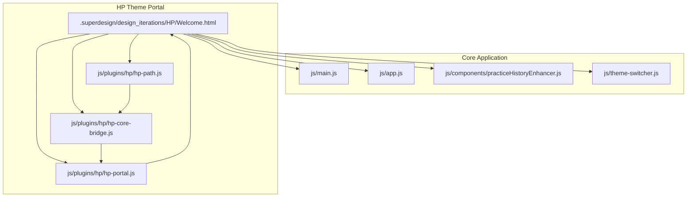
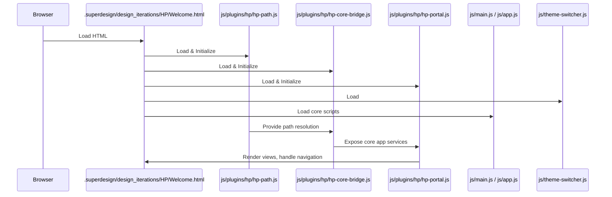
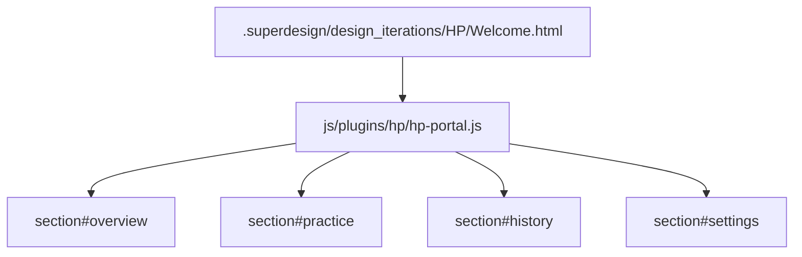

# Harry Potter Theme & Plugin System

> **Relevant source files**
> * [.superdesign/design_iterations/HP/Welcome.html](https://github.com/sallowayma-git/IELTS-practice/blob/df0c9b8f/.superdesign/design_iterations/HP/Welcome.html)
> * [assets/data/path-map.json](https://github.com/sallowayma-git/IELTS-practice/blob/df0c9b8f/assets/data/path-map.json)

This document describes the Harry Potter (HP) theme portal and its plugin system within the IELTS Practice System. It covers the architecture, integration points, specialized UI components, and the plugin-based extension model that enables the HP theme to function as a distinct, feature-rich user experience.

**Scope:**

* This page focuses on the HP theme portal, its plugin architecture, and the code entities that enable its operation.
* For information about the general theme system, see [Theme System & Visual Design](/sallowayma-git/IELTS-practice/7-theme-system-and-visual-design).
* For details on HP-specific views and UI, see [HP Welcome Interface & Views](/sallowayma-git/IELTS-practice/8.1-hp-welcome-interface-and-views).
* For the HP plugin bridge and routing, see [HP Core Bridge & Plugin Architecture](/sallowayma-git/IELTS-practice/8.2-hp-core-bridge-and-plugin-architecture).
* For the HP path system and extensions, see [HP Path System & Extensions](/sallowayma-git/IELTS-practice/8.3-hp-path-system-and-extensions).

---

## Purpose and Context

The Harry Potter theme is a complete UI portal that reimagines the IELTS practice experience with a wizarding world aesthetic. It is implemented as a standalone HTML entry point (`Welcome.html`), with its own navigation, view system, and plugin-based integration with the core application logic. The HP theme demonstrates the system's ability to support full-featured, modular theme portals that can extend or override core functionality.

**Key Capabilities:**

* Custom navigation and view rendering (Overview, Practice, History, Settings)
* Specialized UI components and statistics panels
* Theme switching and portal navigation
* Plugin-based integration with core app services (exam data, path resolution, history, settings)

**Sources:**  

.superdesign/design_iterations/HP/Welcome.html:1-657

---

## High-Level Architecture

The HP theme portal is structured as a modular, plugin-driven system. It consists of:

* A dedicated HTML entry point (`Welcome.html`)
* A set of JavaScript plugins for path resolution, core bridging, and view routing
* Integration with the core application via plugin bridges
* Custom UI components and styles

### Diagram: "HP Theme System - Code Entity Overview"

**Sources:**  

.superdesign/design_iterations/HP/Welcome.html:1-657

---

## HP Theme Portal Structure

The HP theme is implemented as a standalone HTML file (`Welcome.html`) that loads a set of JavaScript plugins and core scripts. The portal provides its own navigation, view containers, and UI components, while delegating core data and logic to the main application via plugin bridges.

### Key Components

| Component / File | Role |
| --- | --- |
| `.superdesign/design_iterations/HP/Welcome.html` | Main entry point, defines layout, navigation, and view containers |
| `js/plugins/hp/hp-path.js` | Path resolution for exam content and resources |
| `js/plugins/hp/hp-core-bridge.js` | Integration layer between HP theme and core app services |
| `js/plugins/hp/hp-portal.js` | View router and navigation controller for HP-specific views |
| `js/components/practiceHistoryEnhancer.js` | Enhances practice history display and statistics |
| `js/theme-switcher.js` | Modal UI and logic for theme switching and portal navigation |

**Sources:**  

.superdesign/design_iterations/HP/Welcome.html:1-657

---

## HP Theme Plugin Loading and Integration

The HP theme portal loads its plugins in a specific order to ensure correct initialization and integration with the core application. The following scripts are loaded in the `<head>` or at the end of the `<body>`:

1. **Exam Data**: * `complete-exam-data.js` * `listening-exam-data.js`   Provides the exam index and metadata.
2. **Performance Optimizer**: * `js/components/PerformanceOptimizer.js`   Optional performance enhancements.
3. **HP Path System**: * `js/plugins/hp/hp-path.js`   Handles resource path resolution and base prefix management.
4. **HP Core Bridge**: * `js/plugins/hp/hp-core-bridge.js`   Connects HP theme to core app services (state, data, etc).
5. **HP Portal Router**: * `js/plugins/hp/hp-portal.js`   Manages HP-specific view routing and navigation.
6. **Practice History Enhancer**: * `js/components/practiceHistoryEnhancer.js`   Augments history/statistics display.
7. **Theme Switcher**: * `js/theme-switcher.js`   Provides modal UI for switching between theme portals.
8. **Core Application Scripts**: * `js/main.js`, `js/app.js`, `js/boot-fallbacks.js`   Ensures core app logic is available for plugin bridges.

**Sources:**  

.superdesign/design_iterations/HP/Welcome.html:617-655

---

### Diagram: "HP Theme Plugin Loading Sequence"

**Sources:**  

.superdesign/design_iterations/HP/Welcome.html:617-655

---

## HP Theme Navigation and View System

The HP theme portal implements its own navigation and view containers, distinct from the main application. Navigation is handled via anchor links and data attributes, with the following main sections:

* **Overview** (`#overview`): Welcome message, statistics, quick actions
* **Practice** (`#practice`): Question bank, filtering, search, and exam list
* **History** (`#history`): Practice history, achievements, score trends
* **Settings** (`#settings`): System settings, backup, theme switching

Each section is implemented as a `<section>` with a unique `id` and `data-view-section` attribute. The active view is controlled by the HP portal router plugin.

### Diagram: "HP Theme View Routing Entities"

**Sources:**  

.superdesign/design_iterations/HP/Welcome.html:414-548

---

## Theme Switching and Portal Navigation

The HP theme supports both in-app theme switching (CSS variants) and navigation to other theme portals (full UI redesigns). This is implemented via a modal dialog, with options for:

* Switching to other portals (Academic, Bloom, Melody, Potter)
* Applying in-app themes (Blue)

The modal is defined as a `<template>` and rendered dynamically. Actions are handled via `data-theme-action` and `data-theme-target` attributes.

| Theme Option | Action Type | Target |
| --- | --- | --- |
| Academic | portal | `../ielts_academic_functional_2.html` |
| Bloom | portal | `../../../index.html` |
| Blue | apply | `blue` (CSS variant) |
| Melody | portal | `../my_melody_ielts_1.html` |
| Potter | portal | `../HarryPoter.html` (reloads HP theme) |

**Sources:**  

.superdesign/design_iterations/HP/Welcome.html:549-590

---

## HP Path System and Resource Resolution

The HP theme uses a dedicated path resolution plugin (`hp-path.js`) to handle resource URLs for exam content, supporting non-ASCII paths and dynamic base prefixes. The base prefix is enforced at runtime to ensure correct resource loading, especially in test environments.

* The global `window.hpPath` object provides methods for path resolution.
* The base prefix is set to `'../../..'` unless overridden.
* The flag `window.__HP_DISABLE_PATH_MAP_FETCH__` disables remote path map fetching for the HP theme.

**Sources:**  

.superdesign/design_iterations/HP/Welcome.html:624-647

---

## Specialized UI Components

The HP theme portal defines a set of custom UI components and styles, including:

* **Statistics Panels**: Display total exams, completed practices, average accuracy, and streak days.
* **Quick Actions**: Shortcuts to common actions (e.g., start practice).
* **Practice List**: Filterable, searchable question bank.
* **History Table and Chart**: Practice history and score trends.
* **Settings Panel**: System actions (load library, clear cache, backup, import/export, theme switch).

All components are styled with custom CSS and Tailwind configuration, using HP-specific color tokens and fonts.

**Sources:**  

.superdesign/design_iterations/HP/Welcome.html:43-386, 414-548

---

## HP Theme System: Code Entity Mapping Table

| System Functionality | Code Entity / File | Description |
| --- | --- | --- |
| Entry Point | `.superdesign/design_iterations/HP/Welcome.html` | Main HTML, layout, and view containers |
| Path Resolution | `js/plugins/hp/hp-path.js` | Resource path management |
| Core App Integration | `js/plugins/hp/hp-core-bridge.js` | Plugin bridge to core app services |
| View Routing | `js/plugins/hp/hp-portal.js` | Navigation and view switching |
| Practice History Enhancement | `js/components/practiceHistoryEnhancer.js` | Augments history/statistics display |
| Theme Switching | `js/theme-switcher.js` | Modal UI and logic for theme/portal switching |

**Sources:**  

.superdesign/design_iterations/HP/Welcome.html:1-657

---

## Summary

The Harry Potter theme and plugin system demonstrates a modular, extensible approach to building full-featured theme portals within the IELTS Practice System. By leveraging a plugin architecture, the HP theme is able to provide a distinct user experience while maintaining deep integration with core application services and data.

For further details on HP-specific views and UI, see [HP Welcome Interface & Views](/sallowayma-git/IELTS-practice/8.1-hp-welcome-interface-and-views).  

For plugin bridge and routing internals, see [HP Core Bridge & Plugin Architecture](/sallowayma-git/IELTS-practice/8.2-hp-core-bridge-and-plugin-architecture).  

For path system and HP extensions, see [HP Path System & Extensions](/sallowayma-git/IELTS-practice/8.3-hp-path-system-and-extensions).

---

**Sources:**  

.superdesign/design_iterations/HP/Welcome.html:1-657  

assets/data/path-map.json:1-17