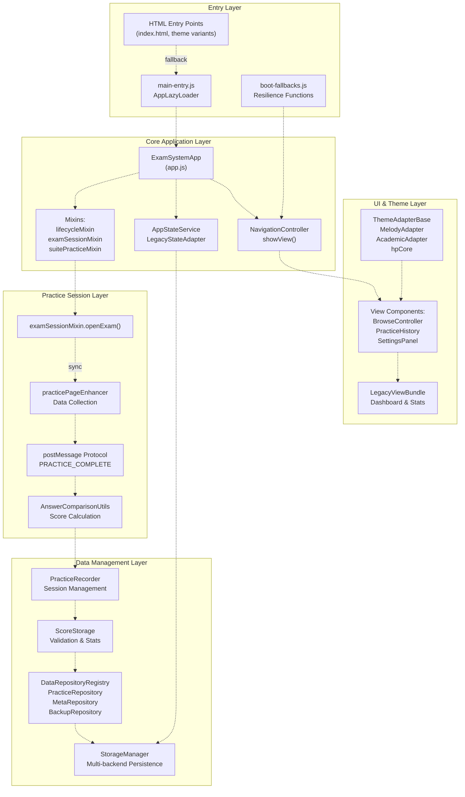
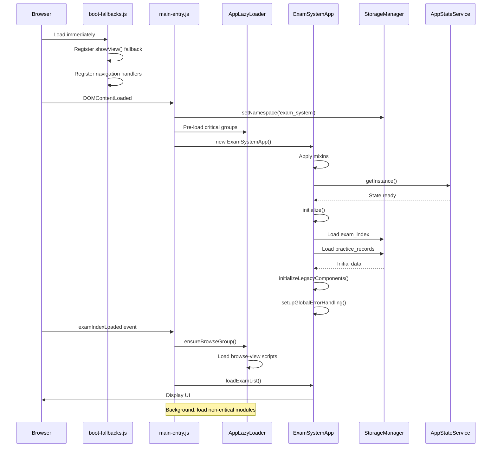
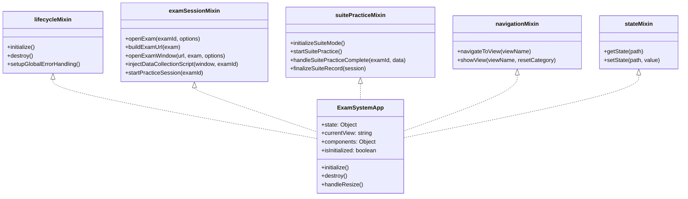
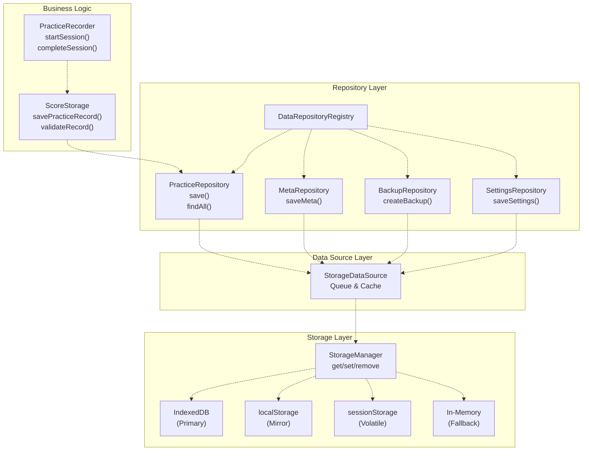
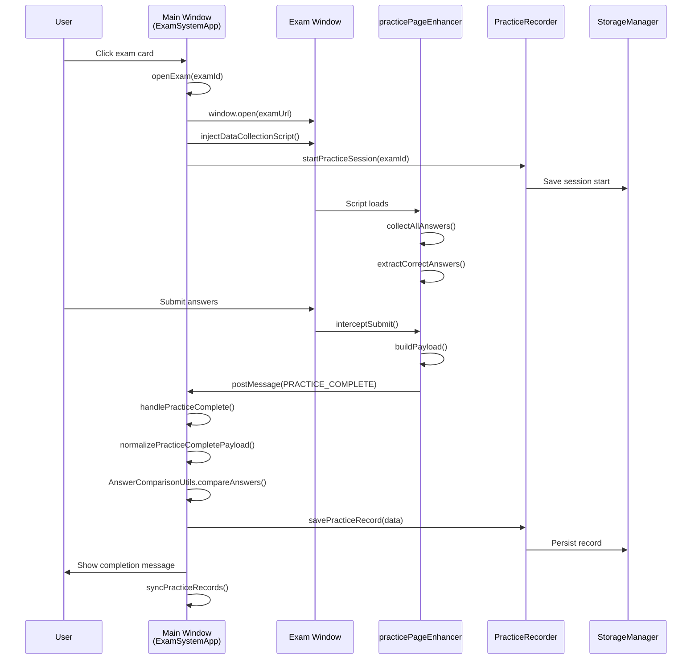
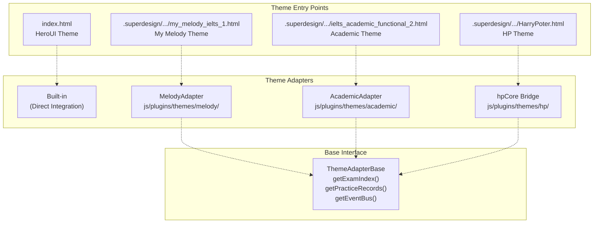

# IELTS Practice System Overview

> **Relevant source files**
> * [.gitignore](https://github.com/sallowayma-git/IELTS-practice/blob/92f64eb8/.gitignore)
> * [.superdesign/design_iterations/ielts_academic_functional_2.html](https://github.com/sallowayma-git/IELTS-practice/blob/92f64eb8/.superdesign/design_iterations/ielts_academic_functional_2.html)
> * [.superdesign/design_iterations/my_melody_ielts_1.html](https://github.com/sallowayma-git/IELTS-practice/blob/92f64eb8/.superdesign/design_iterations/my_melody_ielts_1.html)
> * [css/heroui-bridge.css](https://github.com/sallowayma-git/IELTS-practice/blob/92f64eb8/css/heroui-bridge.css)
> * [css/main.css](https://github.com/sallowayma-git/IELTS-practice/blob/92f64eb8/css/main.css)
> * [index.html](https://github.com/sallowayma-git/IELTS-practice/blob/92f64eb8/index.html)
> * [js/app.js](https://github.com/sallowayma-git/IELTS-practice/blob/92f64eb8/js/app.js)
> * [js/app/examSessionMixin.js](https://github.com/sallowayma-git/IELTS-practice/blob/92f64eb8/js/app/examSessionMixin.js)
> * [js/app/suitePracticeMixin.js](https://github.com/sallowayma-git/IELTS-practice/blob/92f64eb8/js/app/suitePracticeMixin.js)
> * [js/boot-fallbacks.js](https://github.com/sallowayma-git/IELTS-practice/blob/92f64eb8/js/boot-fallbacks.js)
> * [js/main.js](https://github.com/sallowayma-git/IELTS-practice/blob/92f64eb8/js/main.js)
> * [js/practice-page-enhancer.js](https://github.com/sallowayma-git/IELTS-practice/blob/92f64eb8/js/practice-page-enhancer.js)
> * [js/services/GlobalStateService.js](https://github.com/sallowayma-git/IELTS-practice/blob/92f64eb8/js/services/GlobalStateService.js)
> * [js/utils/answerComparisonUtils.js](https://github.com/sallowayma-git/IELTS-practice/blob/92f64eb8/js/utils/answerComparisonUtils.js)

## Purpose and Scope

This document provides a high-level technical overview of the IELTS Practice System, a web-based application for IELTS exam practice with sophisticated data management, multi-theme support, and cross-window practice sessions. It introduces the major subsystems, architectural patterns, and entry points that compose the system.

For detailed information on specific subsystems:

* Application initialization and state management: see [Core Application Architecture](/sallowayma-git/IELTS-practice/3-core-application-architecture)
* Data persistence and backup: see [Data Management System](/sallowayma-git/IELTS-practice/4-data-management-system)
* Practice session lifecycle and cross-window communication: see [Practice Session System](/sallowayma-git/IELTS-practice/5-practice-session-system)
* Theme variants and UI components: see [Theme System & UI Architecture](/sallowayma-git/IELTS-practice/7-theme-system-and-ui-architecture)
* Performance optimization strategies: see [Performance & Optimization](/sallowayma-git/IELTS-practice/10-performance-and-optimization)

---

## System Purpose and Capabilities

The IELTS Practice System is a browser-based application that provides:

1. **Exam Practice Management**: Opens IELTS reading and listening exams in separate windows, collects user answers, and calculates scores by comparing with correct answers
2. **Multi-Tier Data Persistence**: Stores practice records, exam metadata, and settings across IndexedDB, localStorage, sessionStorage, and in-memory storage with automatic failover
3. **Suite Practice Mode**: Supports sequential exam sessions (e.g., P1 → P2 → P3) with automatic navigation and aggregated results
4. **Theme System**: Provides multiple visual themes (Academic, Melody, HP, XiaoDai) through a unified adapter interface
5. **Cross-Window Communication**: Coordinates between main application and exam windows using `postMessage` protocol
6. **Lazy Loading**: Progressive code loading with script groups to optimize initial load time

**Sources**: [index.html L1-L473](https://github.com/sallowayma-git/IELTS-practice/blob/92f64eb8/index.html#L1-L473)

 [js/app.js L1-L132](https://github.com/sallowayma-git/IELTS-practice/blob/92f64eb8/js/app.js#L1-L132)

 [js/main.js L1-L96](https://github.com/sallowayma-git/IELTS-practice/blob/92f64eb8/js/main.js#L1-L96)

---

## High-Level Architecture

The system is organized into five major layers:



**Sources**: [js/app.js L6-L62](https://github.com/sallowayma-git/IELTS-practice/blob/92f64eb8/js/app.js#L6-L62)

 [js/main.js L49-L83](https://github.com/sallowayma-git/IELTS-practice/blob/92f64eb8/js/main.js#L49-L83)

 [js/app/examSessionMixin.js L1-L6](https://github.com/sallowayma-git/IELTS-practice/blob/92f64eb8/js/app/examSessionMixin.js#L1-L6)

 [js/practice-page-enhancer.js L1-L18](https://github.com/sallowayma-git/IELTS-practice/blob/92f64eb8/js/practice-page-enhancer.js#L1-L18)

---

## Bootstrap and Initialization Sequence

The application initializes through a three-phase process:



### Initialization Phases

| Phase | Module | Timing | Purpose |
| --- | --- | --- | --- |
| **Phase 1: Resilience** | `boot-fallbacks.js` | Immediate (before DOM ready) | Provides baseline navigation and message functions |
| **Phase 2: Core Init** | `main-entry.js`, `app.js` | DOMContentLoaded | Creates app instance, loads critical data |
| **Phase 3: Progressive** | `AppLazyLoader` | On-demand / Idle | Loads browse, practice-suite, more-tools groups |

**Sources**: [js/boot-fallbacks.js L1-L60](https://github.com/sallowayma-git/IELTS-practice/blob/92f64eb8/js/boot-fallbacks.js#L1-L60)

 [js/app.js L86-L124](https://github.com/sallowayma-git/IELTS-practice/blob/92f64eb8/js/app.js#L86-L124)

 [index.html L424-L461](https://github.com/sallowayma-git/IELTS-practice/blob/92f64eb8/index.html#L424-L461)

---

## Core Application Components

### ExamSystemApp Class

The `ExamSystemApp` class serves as the main application controller, composed via mixins:



### State Management

The application uses `AppStateService` for canonical state and `LegacyStateAdapter` for backward compatibility:

| State Accessor | Module | Storage Key | Purpose |
| --- | --- | --- | --- |
| `getExamIndexState()` | `GlobalStateService.js` | `exam_index` | Exam metadata list |
| `getPracticeRecordsState()` | `GlobalStateService.js` | `practice_records` | Practice history |
| `getBrowseFilterState()` | `GlobalStateService.js` | Memory | Current filter (category, type) |
| `getSelectedRecordsState()` | `GlobalStateService.js` | Memory | Bulk delete selection |

**Sources**: [js/app.js L6-L62](https://github.com/sallowayma-git/IELTS-practice/blob/92f64eb8/js/app.js#L6-L62)

 [js/services/GlobalStateService.js L1-L217](https://github.com/sallowayma-git/IELTS-practice/blob/92f64eb8/js/services/GlobalStateService.js#L1-L217)

 [js/main.js L8-L79](https://github.com/sallowayma-git/IELTS-practice/blob/92f64eb8/js/main.js#L8-L79)

---

## Data Management Architecture

The data layer implements a multi-tier storage strategy with repositories and transactions:



### Storage Hierarchy

The `StorageManager` attempts storage in this order:

1. **IndexedDB**: Primary persistent storage with structured data
2. **localStorage**: Mirror for cross-tab sync and fallback
3. **sessionStorage**: Temporary storage for single-session data
4. **In-Memory**: Last resort when all persistent storage fails

**Sources**: [js/utils/storage.js](https://github.com/sallowayma-git/IELTS-practice/blob/92f64eb8/js/utils/storage.js)

 [js/data/dataSources/storageDataSource.js](https://github.com/sallowayma-git/IELTS-practice/blob/92f64eb8/js/data/dataSources/storageDataSource.js)

 [js/data/repositories/practiceRepository.js](https://github.com/sallowayma-git/IELTS-practice/blob/92f64eb8/js/data/repositories/practiceRepository.js)

---

## Practice Session System

The practice session system coordinates between the main window and exam windows:



### postMessage Protocol

The system uses typed messages for cross-window communication:

| Message Type | Direction | Payload | Purpose |
| --- | --- | --- | --- |
| `INIT_SESSION` | Main → Exam | `{sessionId, examId}` | Initialize data collector |
| `SESSION_READY` | Exam → Main | `{sessionId}` | Confirm handshake |
| `PROGRESS_UPDATE` | Exam → Main | `{answers}` | Periodic answer snapshot |
| `PRACTICE_COMPLETE` | Exam → Main | `{answers, correctAnswers, scoreInfo}` | Final results |
| `SUITE_NAVIGATE` | Main → Exam | `{nextExamUrl}` | Navigate to next exam in suite |

**Sources**: [js/app/examSessionMixin.js L87-L184](https://github.com/sallowayma-git/IELTS-practice/blob/92f64eb8/js/app/examSessionMixin.js#L87-L184)

 [js/practice-page-enhancer.js L1-L50](https://github.com/sallowayma-git/IELTS-practice/blob/92f64eb8/js/practice-page-enhancer.js#L1-L50)

 [js/main.js L652-L710](https://github.com/sallowayma-git/IELTS-practice/blob/92f64eb8/js/main.js#L652-L710)

---

## Theme System

The application supports multiple themes through the `ThemeAdapterBase` interface:



### Theme Switching

Themes are switched by navigating to different HTML entry points. Each theme HTML file:

1. Loads theme-specific CSS variables
2. Initializes theme-specific adapter
3. Shares core application logic via `main.js`
4. Uses theme-specific UI components while maintaining data compatibility

**Sources**: [index.html L1-L30](https://github.com/sallowayma-git/IELTS-practice/blob/92f64eb8/index.html#L1-L30)

 [.superdesign/design_iterations/my_melody_ielts_1.html L1-L50](https://github.com/sallowayma-git/IELTS-practice/blob/92f64eb8/.superdesign/design_iterations/my_melody_ielts_1.html#L1-L50)

 [.superdesign/design_iterations/ielts_academic_functional_2.html L1-L50](https://github.com/sallowayma-git/IELTS-practice/blob/92f64eb8/.superdesign/design_iterations/ielts_academic_functional_2.html#L1-L50)

---

## Lazy Loading and Code Splitting

The `AppLazyLoader` organizes scripts into groups for progressive loading:

### Script Groups

| Group Name | Loading Strategy | Modules Included |
| --- | --- | --- |
| `exam-data` | Pre-load on init | Exam index data, library manager |
| `practice-suite` | Pre-load on init | Practice recorder, score storage, answer comparison |
| `browse-view` | On first browse view | Exam list view, browse controller, filter system |
| `more-tools` | Idle time | Vocabulary system, clock, games |
| `theme-tools` | On-demand | Theme switcher, accessibility settings |

### Lazy Proxy Pattern

Functions that depend on lazily-loaded modules are wrapped in proxies:

```javascript
// Example from main-entry.js (conceptual)
window.ensurePracticeSuiteReady = function() {
    return AppLazyLoader.ensureGroup('practice-suite');
};

window.startPracticeSession = function(examId) {
    return ensurePracticeSuiteReady().then(() => {
        return window.PracticeRecorder.startSession(examId);
    });
};
```

**Sources**: [js/runtime/lazyLoader.js](https://github.com/sallowayma-git/IELTS-practice/blob/92f64eb8/js/runtime/lazyLoader.js)

 [js/app/main-entry.js](https://github.com/sallowayma-git/IELTS-practice/blob/92f64eb8/js/app/main-entry.js)

 [js/main.js L85-L119](https://github.com/sallowayma-git/IELTS-practice/blob/92f64eb8/js/main.js#L85-L119)

---

## Key Architectural Patterns

### 1. Mixin Composition

The `ExamSystemApp` class uses mixins for modular functionality:

* **lifecycleMixin**: Initialization and cleanup
* **examSessionMixin**: Single exam sessions
* **suitePracticeMixin**: Sequential exam sessions
* **navigationMixin**: View switching
* **fallbackMixin**: Fallback session tracking

Mixins are applied in `app.js` using `Object.assign()`.

**Sources**: [js/app.js L64-L81](https://github.com/sallowayma-git/IELTS-practice/blob/92f64eb8/js/app.js#L64-L81)

### 2. Repository Pattern

Data access is abstracted through repositories:

* `PracticeRepository`: CRUD for practice records
* `MetaRepository`: Application metadata
* `BackupRepository`: Backup management
* `SettingsRepository`: User settings

Each repository extends `BaseRepository` and uses `StorageDataSource` for queue and cache.

**Sources**: [js/data/repositories/baseRepository.js](https://github.com/sallowayma-git/IELTS-practice/blob/92f64eb8/js/data/repositories/baseRepository.js)

 [js/data/repositories/practiceRepository.js](https://github.com/sallowayma-git/IELTS-practice/blob/92f64eb8/js/data/repositories/practiceRepository.js)

### 3. Adapter Pattern

The theme system uses adapters to provide unified data access across different theme implementations while allowing theme-specific UI customization.

**Sources**: [js/plugins/themes/theme-adapter-base.js](https://github.com/sallowayma-git/IELTS-practice/blob/92f64eb8/js/plugins/themes/theme-adapter-base.js)

### 4. Event Bus

Cross-component communication uses custom events:

* `examIndexLoaded`: Triggered when exam index loads
* `storage-sync`: Triggered on cross-tab storage changes
* `message`: Browser native for cross-window communication

**Sources**: [js/main.js L652-L710](https://github.com/sallowayma-git/IELTS-practice/blob/92f64eb8/js/main.js#L652-L710)

 [js/main.js L702-L710](https://github.com/sallowayma-git/IELTS-practice/blob/92f64eb8/js/main.js#L702-L710)

### 5. Fallback Chain

Critical functions have multiple fallback strategies:

1. Try primary implementation (e.g., `AppStateService`)
2. Fall back to legacy implementation (e.g., global variables)
3. Fall back to minimal implementation (e.g., `boot-fallbacks.js`)

**Sources**: [js/boot-fallbacks.js L1-L60](https://github.com/sallowayma-git/IELTS-practice/blob/92f64eb8/js/boot-fallbacks.js#L1-L60)

 [js/main.js L8-L79](https://github.com/sallowayma-git/IELTS-practice/blob/92f64eb8/js/main.js#L8-L79)

---

## Entry Points Summary

| Entry Point | Theme | Target Audience | Key Features |
| --- | --- | --- | --- |
| `index.html` | HeroUI | General | Gradient background, glassmorphism, developer credits |
| `my_melody_ielts_1.html` | My Melody | Kawaii aesthetic | Pink gradient, particle effects, emoji decorations |
| `ielts_academic_functional_2.html` | Academic | Professional | Sidebar navigation, serif fonts, parchment colors |
| `HarryPoter.html` | Harry Potter | Themed experience | Magical aesthetic, house colors, wand cursor |
| `xiaodaidai_dashboard_1.html` | XiaoDai | Playful | Yellow/orange palette, pig mascot, casual tone |

All entry points share:

* Core application logic via `main.js` and `app.js`
* Data management via `StorageManager` and repositories
* Practice session system via `examSessionMixin` and `practicePageEnhancer`

**Sources**: [index.html L1-L473](https://github.com/sallowayma-git/IELTS-practice/blob/92f64eb8/index.html#L1-L473)

 [.superdesign/design_iterations/my_melody_ielts_1.html L1-L100](https://github.com/sallowayma-git/IELTS-practice/blob/92f64eb8/.superdesign/design_iterations/my_melody_ielts_1.html#L1-L100)

 [.superdesign/design_iterations/ielts_academic_functional_2.html L1-L100](https://github.com/sallowayma-git/IELTS-practice/blob/92f64eb8/.superdesign/design_iterations/ielts_academic_functional_2.html#L1-L100)

---

## Technology Stack

| Layer | Technologies |
| --- | --- |
| **Frontend** | Vanilla JavaScript (ES6+), HTML5, CSS3 with CSS Custom Properties |
| **Storage** | IndexedDB, localStorage, sessionStorage, in-memory fallback |
| **Architecture** | Mixin-based composition, Repository pattern, Event-driven |
| **Communication** | postMessage API for cross-window, CustomEvent for internal |
| **Performance** | Lazy loading, virtual scrolling, event delegation, debouncing |
| **Testing** | Playwright for E2E tests |

**Sources**: [index.html L424-L461](https://github.com/sallowayma-git/IELTS-practice/blob/92f64eb8/index.html#L424-L461)

 [js/app.js L1-L132](https://github.com/sallowayma-git/IELTS-practice/blob/92f64eb8/js/app.js#L1-L132)

 [js/utils/storage.js](https://github.com/sallowayma-git/IELTS-practice/blob/92f64eb8/js/utils/storage.js)