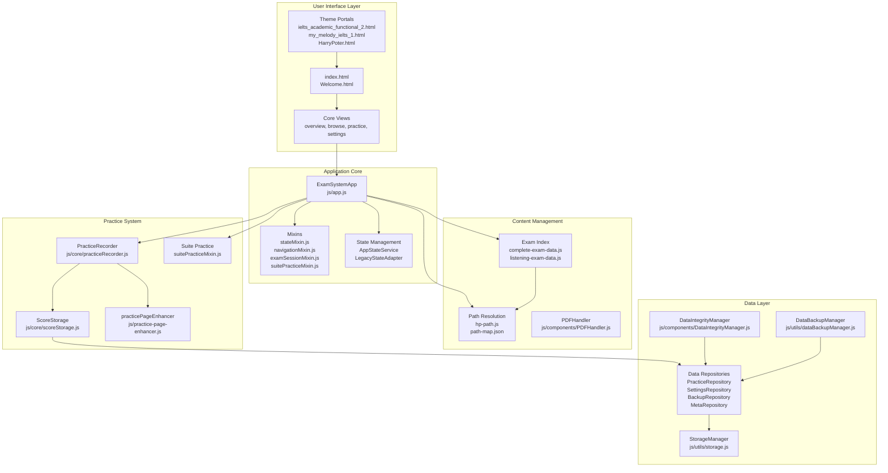
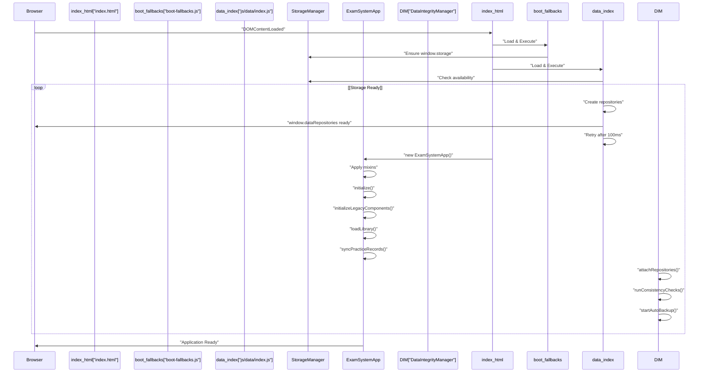
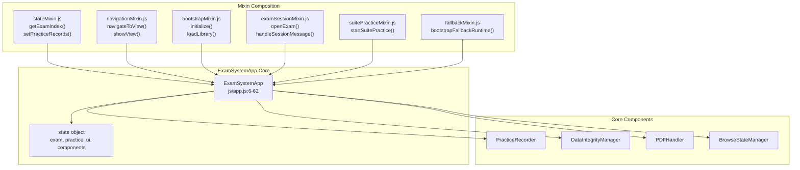
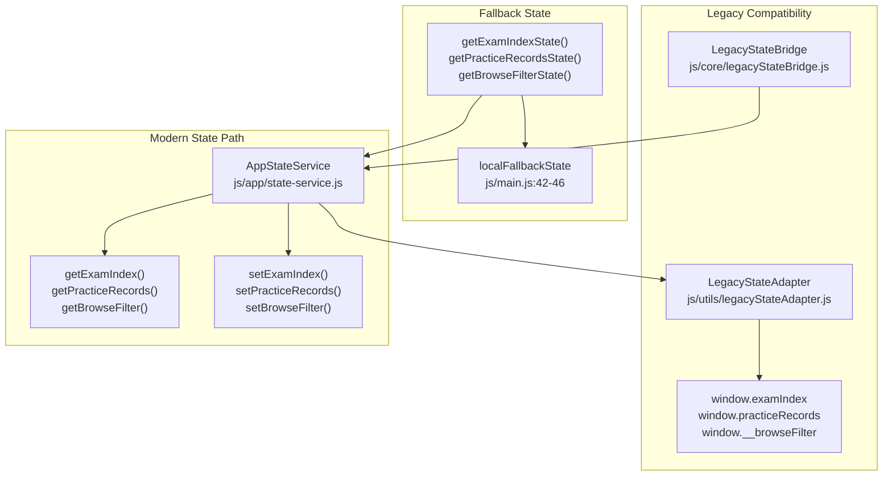
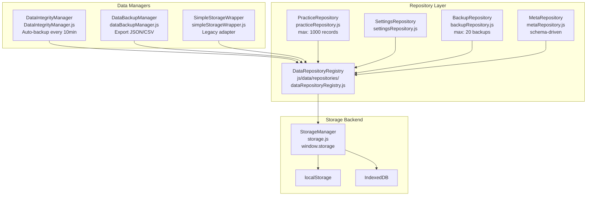
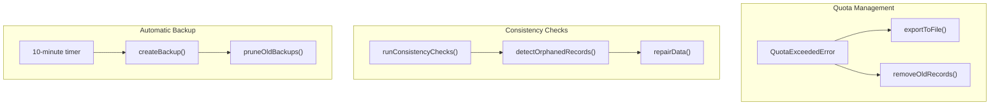
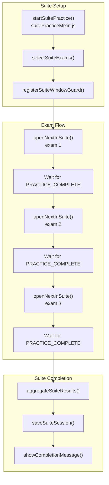
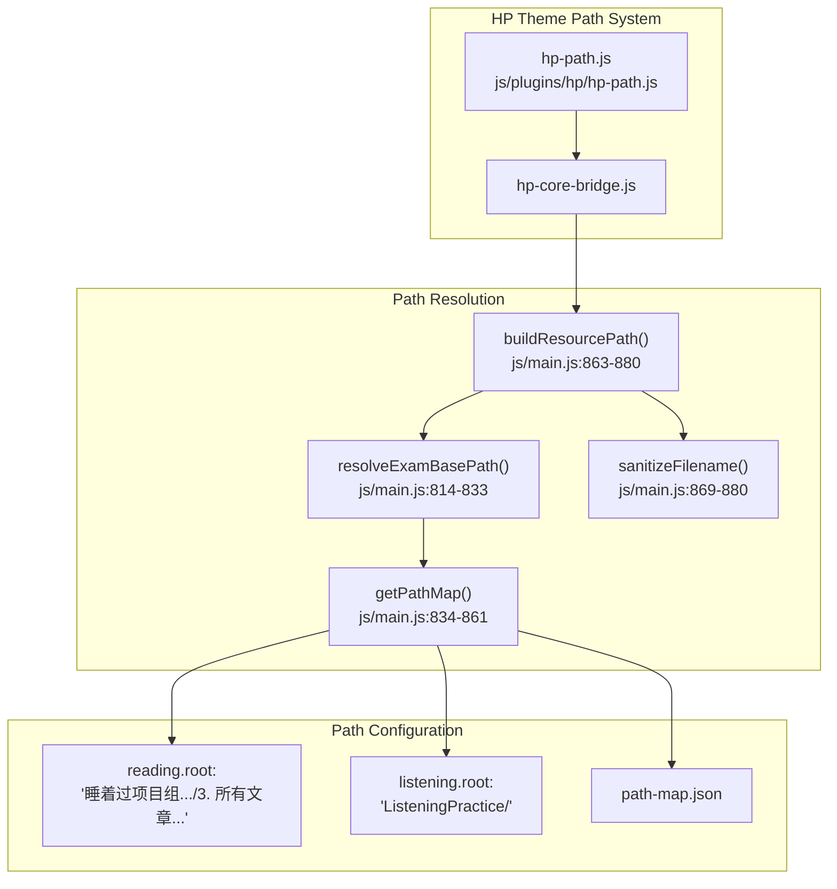
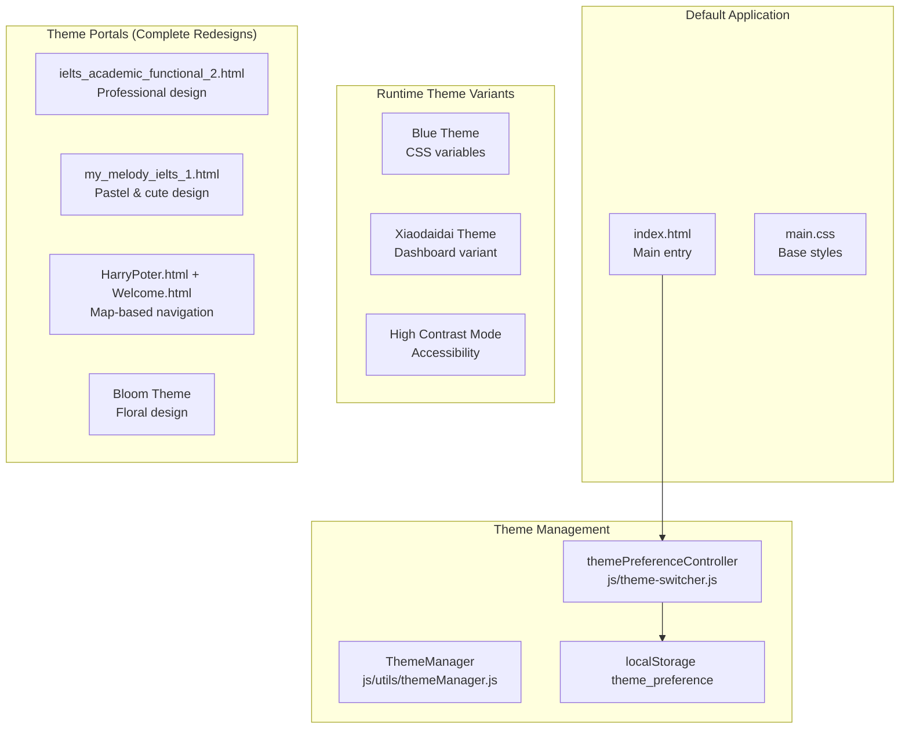
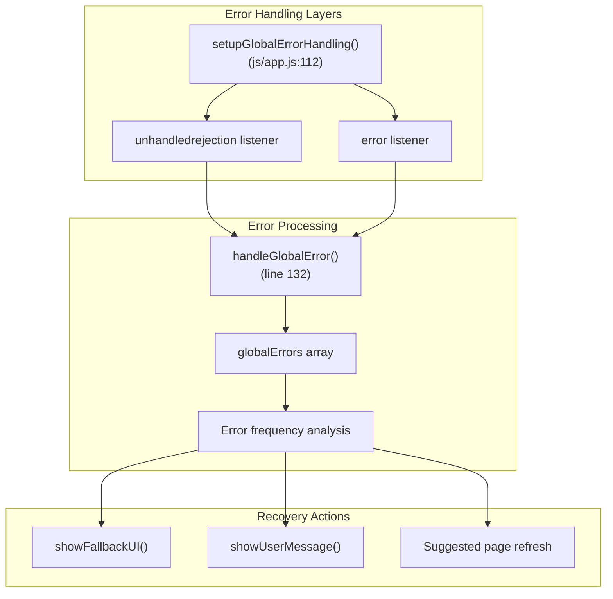

# IELTS Practice System Overview

> **Relevant source files**
> * [.superdesign/design_iterations/ielts_academic_functional_2.html](https://github.com/sallowayma-git/IELTS-practice/blob/68771116/.superdesign/design_iterations/ielts_academic_functional_2.html)
> * [.superdesign/design_iterations/my_melody_ielts_1.html](https://github.com/sallowayma-git/IELTS-practice/blob/68771116/.superdesign/design_iterations/my_melody_ielts_1.html)
> * [AGENTS.md](https://github.com/sallowayma-git/IELTS-practice/blob/68771116/AGENTS.md)
> * [css/main.css](https://github.com/sallowayma-git/IELTS-practice/blob/68771116/css/main.css)
> * [css/practice-record-modal.css](https://github.com/sallowayma-git/IELTS-practice/blob/68771116/css/practice-record-modal.css)
> * [index.html](https://github.com/sallowayma-git/IELTS-practice/blob/68771116/index.html)
> * [js/app.js](https://github.com/sallowayma-git/IELTS-practice/blob/68771116/js/app.js)
> * [js/app/examSessionMixin.js](https://github.com/sallowayma-git/IELTS-practice/blob/68771116/js/app/examSessionMixin.js)
> * [js/app/suitePracticeMixin.js](https://github.com/sallowayma-git/IELTS-practice/blob/68771116/js/app/suitePracticeMixin.js)
> * [js/core/practiceRecorder.js](https://github.com/sallowayma-git/IELTS-practice/blob/68771116/js/core/practiceRecorder.js)
> * [js/core/scoreStorage.js](https://github.com/sallowayma-git/IELTS-practice/blob/68771116/js/core/scoreStorage.js)
> * [js/main.js](https://github.com/sallowayma-git/IELTS-practice/blob/68771116/js/main.js)
> * [js/theme-switcher.js](https://github.com/sallowayma-git/IELTS-practice/blob/68771116/js/theme-switcher.js)
> * [js/utils/environmentDetector.js](https://github.com/sallowayma-git/IELTS-practice/blob/68771116/js/utils/environmentDetector.js)
> * [js/utils/logger.js](https://github.com/sallowayma-git/IELTS-practice/blob/68771116/js/utils/logger.js)

## System Purpose and Scope

The IELTS Practice System is a browser-based application for IELTS reading and listening practice, built entirely as a client-side application with no server dependencies. The system manages approximately 147 practice exercises across reading (P1, P2, P3 difficulty levels) and listening sections, providing comprehensive practice tracking, statistical analysis, and multi-format data export.

**Technology Stack:** Vanilla JavaScript ES6+, HTML5, CSS3
**Architecture Pattern:** Layered architecture with mixin-based composition
**Storage:** localStorage, IndexedDB (via `StorageManager`)
**Testing:** Playwright E2E, Node.js test suite, static analysis

### Related Documentation

* [Getting Started](/sallowayma-git/IELTS-practice/2-getting-started) - Installation and initial configuration
* [Core Application Architecture](/sallowayma-git/IELTS-practice/3-core-application-architecture) - `ExamSystemApp` and state management
* [Data Management System](/sallowayma-git/IELTS-practice/4-data-management-system) - Repository pattern and persistence
* [Practice Session System](/sallowayma-git/IELTS-practice/5-practice-session-system) - Session recording and cross-window communication
* [Exam Content & Data System](/sallowayma-git/IELTS-practice/6-vocabulary-learning-system) - Exam indexing and path resolution
* [Theme System & Visual Design](/sallowayma-git/IELTS-practice/7-exam-content-and-data-system) - UI customization and theme portals
* [Testing & Quality Assurance](/sallowayma-git/IELTS-practice/10-user-interface-components) - E2E tests and validation

Sources: [README.md L1-L24](https://github.com/sallowayma-git/IELTS-practice/blob/68771116/README.md#L1-L24)

 [index.html L1-L50](https://github.com/sallowayma-git/IELTS-practice/blob/68771116/index.html#L1-L50)

## System Architecture Overview

The system implements a five-layer architecture with clear separation of concerns, progressive enhancement capabilities, and comprehensive testing infrastructure.

### Five-Layer Architecture

**Five-Layer System Architecture**



Sources: [js/app.js L1-L120](https://github.com/sallowayma-git/IELTS-practice/blob/68771116/js/app.js#L1-L120)

 [js/main.js L1-L100](https://github.com/sallowayma-git/IELTS-practice/blob/68771116/js/main.js#L1-L100)

 [js/core/practiceRecorder.js L1-L50](https://github.com/sallowayma-git/IELTS-practice/blob/68771116/js/core/practiceRecorder.js#L1-L50)

 [js/core/scoreStorage.js L1-L50](https://github.com/sallowayma-git/IELTS-practice/blob/68771116/js/core/scoreStorage.js#L1-L50)

 [complete-exam-data.js L1-L50](https://github.com/sallowayma-git/IELTS-practice/blob/68771116/complete-exam-data.js#L1-L50)

 [listening-exam-data.js L1-L50](https://github.com/sallowayma-git/IELTS-practice/blob/68771116/listening-exam-data.js#L1-L50)

### Layer Responsibilities

| Layer | Components | Responsibilities |
| --- | --- | --- |
| **UI Layer** | Theme portals, `index.html`, core views | User interaction, theme switching, view rendering |
| **Application Core** | `ExamSystemApp`, mixins, `AppStateService` | Application orchestration, state management, navigation |
| **Practice System** | `PracticeRecorder`, `ScoreStorage`, `practicePageEnhancer` | Session management, data collection, scoring |
| **Data Layer** | Repositories, `StorageManager`, `DataIntegrityManager` | Persistence, data validation, backup/restore |
| **Content Management** | Exam indexes, path resolution, `PDFHandler` | Exam metadata, resource location, content delivery |

Sources: [js/app.js L6-L62](https://github.com/sallowayma-git/IELTS-practice/blob/68771116/js/app.js#L6-L62)

 [js/core/practiceRecorder.js L1-L100](https://github.com/sallowayma-git/IELTS-practice/blob/68771116/js/core/practiceRecorder.js#L1-L100)

 [js/data/repositories/practiceRepository.js L1-L50](https://github.com/sallowayma-git/IELTS-practice/blob/68771116/js/data/repositories/practiceRepository.js#L1-L50)

 [assets/scripts/complete-exam-data.js L1-L20](https://github.com/sallowayma-git/IELTS-practice/blob/68771116/assets/scripts/complete-exam-data.js#L1-L20)

### Application Initialization Flow

**Bootstrap and Initialization Sequence**



The initialization process implements a multi-phase bootstrap with retry mechanisms and parallel component initialization. Key phases include:

1. **Foundation Phase**: `boot-fallbacks.js` ensures `window.storage` exists
2. **Data Layer Phase**: `js/data/index.js` creates repository layer with 100ms retry polling
3. **Application Core Phase**: `ExamSystemApp` loads, applies mixins, initializes state service
4. **Parallel Initialization**: App components, legacy fallback system, and data integrity manager initialize simultaneously

Sources: [index.html L298-L404](https://github.com/sallowayma-git/IELTS-practice/blob/68771116/index.html#L298-L404)

 [js/boot-fallbacks.js L1-L50](https://github.com/sallowayma-git/IELTS-practice/blob/68771116/js/boot-fallbacks.js#L1-L50)

 [js/data/index.js L15-L89](https://github.com/sallowayma-git/IELTS-practice/blob/68771116/js/data/index.js#L15-L89)

 [js/app.js L86-L112](https://github.com/sallowayma-git/IELTS-practice/blob/68771116/js/app.js#L86-L112)

 [js/main.js L254-L323](https://github.com/sallowayma-git/IELTS-practice/blob/68771116/js/main.js#L254-L323)

## Application Core Layer

### ExamSystemApp - Central Orchestrator

The `ExamSystemApp` class (defined in [js/app.js L6-L62](https://github.com/sallowayma-git/IELTS-practice/blob/68771116/js/app.js#L6-L62)

) serves as the central orchestrator, composed through mixin-based architecture for modular functionality.

**ExamSystemApp Architecture and Composition**



### State Management Architecture

The system implements dual-path state management bridging modern and legacy code:

| Component | Type | Purpose |
| --- | --- | --- |
| `AppStateService` | Modern API | Centralized state with change notifications |
| `LegacyStateAdapter` | Bridge | Synchronizes with global variables |
| `LegacyStateBridge` | Cache | Replays state changes before app initialization |
| `localFallbackState` | Fallback | In-memory state when service unavailable |

**State Management Flow**



Sources: [js/app.js L6-L62](https://github.com/sallowayma-git/IELTS-practice/blob/68771116/js/app.js#L6-L62)

 [js/app.js L64-L81](https://github.com/sallowayma-git/IELTS-practice/blob/68771116/js/app.js#L64-L81)

 [js/app/stateMixin.js L1-L100](https://github.com/sallowayma-git/IELTS-practice/blob/68771116/js/app/stateMixin.js#L1-L100)

 [js/app/state-service.js L1-L50](https://github.com/sallowayma-git/IELTS-practice/blob/68771116/js/app/state-service.js#L1-L50)

 [js/utils/legacyStateAdapter.js L1-L50](https://github.com/sallowayma-git/IELTS-practice/blob/68771116/js/utils/legacyStateAdapter.js#L1-L50)

 [js/main.js L42-L193](https://github.com/sallowayma-git/IELTS-practice/blob/68771116/js/main.js#L42-L193)

### Mixin-Based Composition Pattern

The `ExamSystemApp` uses mixins to achieve modular composition without deep inheritance hierarchies. Mixins are applied in [js/app.js L64-L81](https://github.com/sallowayma-git/IELTS-practice/blob/68771116/js/app.js#L64-L81)

:

```
// Mixin application pattern (js/app.js:64-81)
Object.assign(ExamSystemApp.prototype,
    mixins.state || {},           // State access methods
    mixins.bootstrap || {},       // Initialization logic
    mixins.lifecycle || {},       // Component lifecycle
    mixins.navigation || {},      // View management
    mixins.examSession || {},     // Practice session handling
    mixins.suitePractice || {},   // Suite mode functionality
    mixins.fallback || {}         // Legacy compatibility
);
```

**Mixin Responsibilities:**

| Mixin | File | Key Methods | Purpose |
| --- | --- | --- | --- |
| State | `stateMixin.js` | `getExamIndex()`, `setPracticeRecords()` | State access abstraction |
| Bootstrap | `bootstrapMixin.js` | `initialize()`, `loadLibrary()` | App initialization |
| Lifecycle | `lifecycleMixin.js` | `destroy()`, `handleResize()` | Component lifecycle |
| Navigation | `navigationMixin.js` | `navigateToView()`, `showView()` | View routing |
| Exam Session | `examSessionMixin.js` | `openExam()`, `handlePracticeComplete()` | Practice sessions |
| Suite Practice | `suitePracticeMixin.js` | `startSuitePractice()`, `openNextInSuite()` | Multi-exam sessions |
| Fallback | `fallbackMixin.js` | `bootstrapFallbackRuntime()` | Degraded-mode support |

Sources: [js/app.js L64-L81](https://github.com/sallowayma-git/IELTS-practice/blob/68771116/js/app.js#L64-L81)

 [js/app/stateMixin.js L1-L50](https://github.com/sallowayma-git/IELTS-practice/blob/68771116/js/app/stateMixin.js#L1-L50)

 [js/app/bootstrapMixin.js L1-L50](https://github.com/sallowayma-git/IELTS-practice/blob/68771116/js/app/bootstrapMixin.js#L1-L50)

 [js/app/navigationMixin.js L1-L50](https://github.com/sallowayma-git/IELTS-practice/blob/68771116/js/app/navigationMixin.js#L1-L50)

 [js/app/examSessionMixin.js L1-L50](https://github.com/sallowayma-git/IELTS-practice/blob/68771116/js/app/examSessionMixin.js#L1-L50)

 [js/app/suitePracticeMixin.js L1-L50](https://github.com/sallowayma-git/IELTS-practice/blob/68771116/js/app/suitePracticeMixin.js#L1-L50)

## Data Layer Architecture

### Repository Pattern and Storage Abstraction

The data layer implements a repository pattern with centralized registration and dependency injection:

**Repository Layer and Storage Backend**



### Storage Keys and Namespacing

All storage keys use the `exam_system_` namespace prefix:

| Storage Key | Repository | Max Records | Purpose |
| --- | --- | --- | --- |
| `exam_system_practice_records` | `PracticeRepository` | 1000 | Practice session data |
| `exam_system_settings` | `SettingsRepository` | 1 | User preferences |
| `exam_system_backups` | `BackupRepository` | 20 | Automatic backups |
| `exam_system_user_stats` | `MetaRepository` | 1 | Aggregated statistics |
| `exam_system_active_sessions` | `MetaRepository` | 10 | Active practice sessions |
| `exam_index` | Direct storage | N/A | Exam catalog (legacy key) |

Sources: [js/utils/storage.js L1-L100](https://github.com/sallowayma-git/IELTS-practice/blob/68771116/js/utils/storage.js#L1-L100)

 [js/data/repositories/dataRepositoryRegistry.js L1-L50](https://github.com/sallowayma-git/IELTS-practice/blob/68771116/js/data/repositories/dataRepositoryRegistry.js#L1-L50)

 [js/data/repositories/practiceRepository.js L1-L100](https://github.com/sallowayma-git/IELTS-practice/blob/68771116/js/data/repositories/practiceRepository.js#L1-L100)

 [js/data/repositories/backupRepository.js L1-L50](https://github.com/sallowayma-git/IELTS-practice/blob/68771116/js/data/repositories/backupRepository.js#L1-L50)

 [js/data/repositories/metaRepository.js L1-L50](https://github.com/sallowayma-git/IELTS-practice/blob/68771116/js/data/repositories/metaRepository.js#L1-L50)

### Data Integrity and Backup System

**Data Integrity Management Flow**



The `DataIntegrityManager` [js/components/DataIntegrityManager.js L1-L200](https://github.com/sallowayma-git/IELTS-practice/blob/68771116/js/components/DataIntegrityManager.js#L1-L200)

 provides:

* **Automatic backups** every 10 minutes
* **Consistency checks** on startup (orphaned records, schema validation)
* **Quota handling** with automatic file export when localStorage is full
* **Backup pruning** maintains maximum 20 backups

Sources: [js/components/DataIntegrityManager.js L1-L200](https://github.com/sallowayma-git/IELTS-practice/blob/68771116/js/components/DataIntegrityManager.js#L1-L200)

 [js/utils/dataBackupManager.js L1-L300](https://github.com/sallowayma-git/IELTS-practice/blob/68771116/js/utils/dataBackupManager.js#L1-L300)

### Practice Record Structure

Practice records contain comprehensive session data with both basic metadata and detailed interaction information:

```yaml
// Core practice record structure (js/main.js:272-303)
{
  id: "unique-timestamp",
  examId: "exam-identifier", 
  title: "exam-title",
  category: "P1|P2|P3",
  dataSource: "real|simulated",
  date: "ISO-timestamp",
  duration: "seconds",
  percentage: "score-percentage",
  realData: {
    answers: {},
    correctAnswers: {},
    scoreInfo: {},
    interactions: []
  }
}
```

Sources: [js/main.js L272-L313](https://github.com/sallowayma-git/IELTS-practice/blob/68771116/js/main.js#L272-L313)

 [js/components/practiceRecordModal.js L69-L87](https://github.com/sallowayma-git/IELTS-practice/blob/68771116/js/components/practiceRecordModal.js#L69-L87)

## Practice System Layer

### End-to-End Practice Session Flow

The practice system orchestrates session management, data collection, and result storage through cross-window communication:

**Complete Practice Session Flow**

```

```

### Practice Data Collection

The `practicePageEnhancer` [js/practice-page-enhancer.js L1-L1200](https://github.com/sallowayma-git/IELTS-practice/blob/68771116/js/practice-page-enhancer.js#L1-L1200)

 injects data collection into practice windows:

**Data Collection Capabilities:**

| Collected Data | Source | Purpose |
| --- | --- | --- |
| User answers | Input/select elements | Score calculation |
| Interaction events | Click/change/drop handlers | Behavior analysis |
| Session timing | Start/end timestamps | Duration tracking |
| Score information | Answer comparison | Accuracy metrics |
| Question metadata | HTML structure parsing | Context preservation |

**Message Types:**

```yaml
// INIT_SESSION: Main window → Practice window
{
  type: 'INIT_SESSION',
  sessionId: 'unique-id',
  examId: 'exam-identifier',
  examData: { /* exam metadata */ }
}

// SESSION_READY: Practice window → Main window
{
  type: 'SESSION_READY',
  sessionId: 'unique-id'
}

// PRACTICE_COMPLETE: Practice window → Main window
{
  type: 'PRACTICE_COMPLETE',
  sessionId: 'unique-id',
  answers: { /* user answers */ },
  scoreInfo: { correct, total, percentage },
  interactions: [ /* user interactions */ ],
  duration: seconds
}
```

Sources: [js/app/examSessionMixin.js L1-L868](https://github.com/sallowayma-git/IELTS-practice/blob/68771116/js/app/examSessionMixin.js#L1-L868)

 [js/practice-page-enhancer.js L1-L1200](https://github.com/sallowayma-git/IELTS-practice/blob/68771116/js/practice-page-enhancer.js#L1-L1200)

 [js/core/practiceRecorder.js L1-L400](https://github.com/sallowayma-git/IELTS-practice/blob/68771116/js/core/practiceRecorder.js#L1-L400)

 [js/core/scoreStorage.js L1-L403](https://github.com/sallowayma-git/IELTS-practice/blob/68771116/js/core/scoreStorage.js#L1-L403)

### Suite Practice Mode

Suite Practice Mode allows users to practice multiple exams in sequence (typically three reading passages in one session):

**Suite Mode Session Management**



**Suite Mode Features:**

* **Window Guard**: Prevents closing incomplete suite sessions
* **Sequential Flow**: Automatic progression through selected exams
* **Aggregate Scoring**: Combined results across all suite exams
* **Session Persistence**: Saves entire suite as single meta-record

Sources: [js/app/suitePracticeMixin.js L1-L500](https://github.com/sallowayma-git/IELTS-practice/blob/68771116/js/app/suitePracticeMixin.js#L1-L500)

 [developer/tests/js/suiteModeFlow.test.js L1-L200](https://github.com/sallowayma-git/IELTS-practice/blob/68771116/developer/tests/js/suiteModeFlow.test.js#L1-L200)

## Content Management Layer

### Exam Index and Metadata System

The system maintains exam catalogs through static data files that are loaded on initialization:

**Exam Index Structure**

| Data File | Content Type | Exam Count | Structure |
| --- | --- | --- | --- |
| `complete-exam-data.js` | Reading exams | ~134 | `window.completeExamIndex[]` |
| `listening-exam-data.js` | Listening exams | ~13 | `window.listeningExamIndex[]` |

```yaml
// Exam index entry structure (complete-exam-data.js)
{
  id: "p1-09",
  title: "Listening to the Ocean 海洋探测",
  category: "P1_reading",
  frequency: "mid",
  pathRoot: "睡着过项目组(9.4)[134篇]/3. 所有文章(9.4)[134篇]/",
  filename: "P1 - Listening to the Ocean 海洋探测.html",
  pdfPath: "P1 - Listening to the Ocean 海洋探测.pdf"
}
```

### Path Resolution System

The system resolves exam file paths dynamically to handle non-ASCII characters and diverse file structures:

**Path Resolution Flow**



The path resolution system supports:

* **Non-ASCII paths**: Chinese characters and special symbols
* **Multiple root directories**: Separate paths for reading/listening
* **Theme-specific overrides**: HP theme uses custom path resolver
* **Fallback mechanisms**: Multiple path attempts with error recovery

Sources: [complete-exam-data.js L1-L500](https://github.com/sallowayma-git/IELTS-practice/blob/68771116/complete-exam-data.js#L1-L500)

 [listening-exam-data.js L1-L100](https://github.com/sallowayma-git/IELTS-practice/blob/68771116/listening-exam-data.js#L1-L100)

 [js/main.js L814-L880](https://github.com/sallowayma-git/IELTS-practice/blob/68771116/js/main.js#L814-L880)

 [js/plugins/hp/hp-path.js L1-L200](https://github.com/sallowayma-git/IELTS-practice/blob/68771116/js/plugins/hp/hp-path.js#L1-L200)

 [path-map.json L1-L50](https://github.com/sallowayma-git/IELTS-practice/blob/68771116/path-map.json#L1-L50)

### PDF Handling

The `PDFHandler` [js/components/PDFHandler.js L1-L200](https://github.com/sallowayma-git/IELTS-practice/blob/68771116/js/components/PDFHandler.js#L1-L200)

 provides PDF viewing and download capabilities:

```python
// PDF operations (js/components/PDFHandler.js)
class PDFHandler {
  openPDF(examId)      // Opens PDF in new window
  downloadPDF(examId)  // Triggers download
  previewPDF(examId)   // Shows PDF in modal
}
```

Sources: [js/components/PDFHandler.js L1-L200](https://github.com/sallowayma-git/IELTS-practice/blob/68771116/js/components/PDFHandler.js#L1-L200)

 [js/main.js L271-L274](https://github.com/sallowayma-git/IELTS-practice/blob/68771116/js/main.js#L271-L274)

## Theme System and UI Layer

### Multi-Theme Architecture

The system supports two theme strategies: complete UI redesign portals and runtime CSS variants.

**Theme System Overview**



### Theme Portal Features

| Theme Portal | File | Key Features |
| --- | --- | --- |
| Academic | `ielts_academic_functional_2.html` | Professional typography, structured layouts |
| Melody | `my_melody_ielts_1.html` | Pastel colors, cute design elements |
| Harry Potter | `HarryPoter.html`, `HP/Welcome.html` | Marauder's Map navigation, pixel-perfect image maps |
| Bloom | Bloom theme CSS | Floral patterns, autumn color scheme |

### Theme Preference Controller

The `themePreferenceController` [js/theme-switcher.js L1-L500](https://github.com/sallowayma-git/IELTS-practice/blob/68771116/js/theme-switcher.js#L1-L500)

 manages theme persistence and auto-redirect:

```
// Theme preference management (js/theme-switcher.js)
{
  maybeAutoRedirect()       // Redirects to preferred portal on load
  setPreference(theme)      // Saves theme selection
  clearPreference()         // Resets to default
  navigateToThemePortal()   // Navigates to portal with state preservation
}
```

**Auto-Redirect Logic:**

1. Check `localStorage.theme_preference`
2. Check `sessionStorage.redirect_loop_guard` (prevents infinite loops)
3. If preference exists and no loop guard, redirect to portal
4. Portal can navigate back to `index.html?theme=reset` to clear preference

Sources: [js/theme-switcher.js L1-L500](https://github.com/sallowayma-git/IELTS-practice/blob/68771116/js/theme-switcher.js#L1-L500)

 [js/utils/themeManager.js L1-L200](https://github.com/sallowayma-git/IELTS-practice/blob/68771116/js/utils/themeManager.js#L1-L200)

 [.superdesign/design_iterations/ielts_academic_functional_2.html L1-L100](https://github.com/sallowayma-git/IELTS-practice/blob/68771116/.superdesign/design_iterations/ielts_academic_functional_2.html#L1-L100)

 [.superdesign/design_iterations/my_melody_ielts_1.html L1-L100](https://github.com/sallowayma-git/IELTS-practice/blob/68771116/.superdesign/design_iterations/my_melody_ielts_1.html#L1-L100)

 [.superdesign/design_iterations/HarryPoter.html L1-L100](https://github.com/sallowayma-git/IELTS-practice/blob/68771116/.superdesign/design_iterations/HarryPoter.html#L1-L100)

## Error Handling and Recovery

### Global Error Management

The system implements comprehensive error handling with automatic recovery mechanisms:



Sources: [js/app.js L112-L127](https://github.com/sallowayma-git/IELTS-practice/blob/68771116/js/app.js#L112-L127)

 [js/app.js L132-L167](https://github.com/sallowayma-git/IELTS-practice/blob/68771116/js/app.js#L132-L167)

 [js/app.js L78-L107](https://github.com/sallowayma-git/IELTS-practice/blob/68771116/js/app.js#L78-L107)

This overview establishes the foundation for understanding the IELTS Practice System's architecture and core components. For detailed implementation specifics, refer to the specialized documentation sections covering each subsystem.