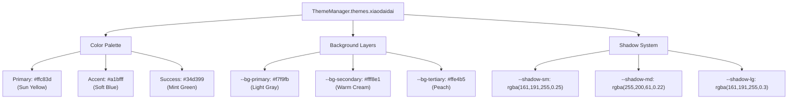
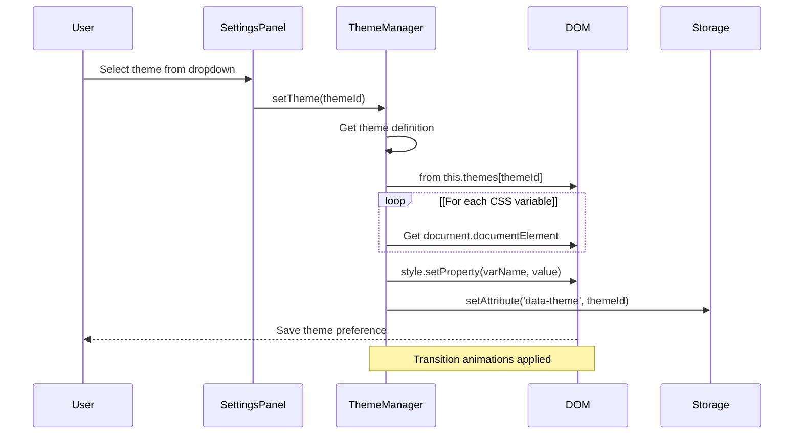
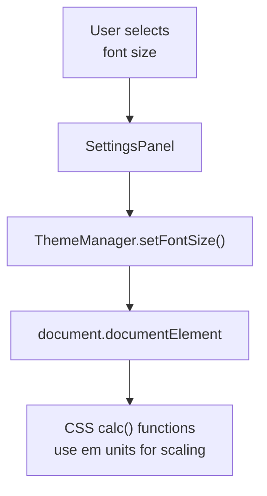
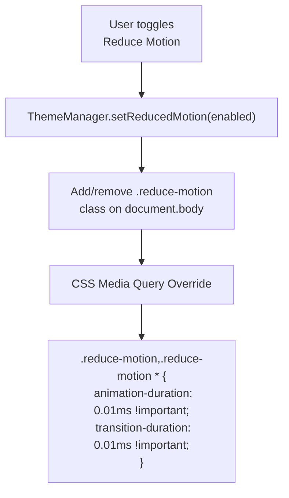
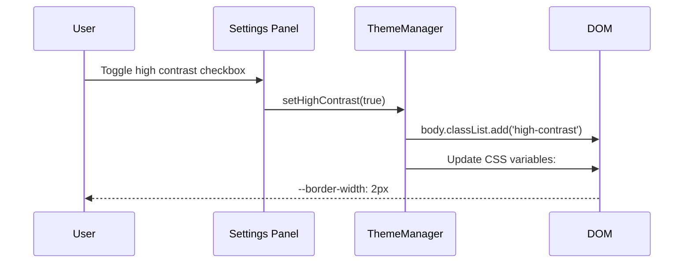
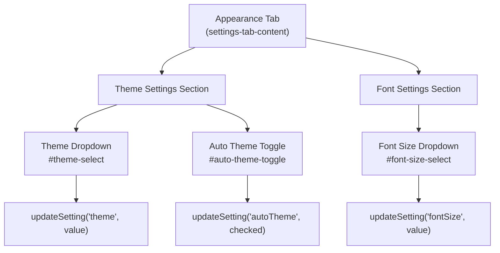
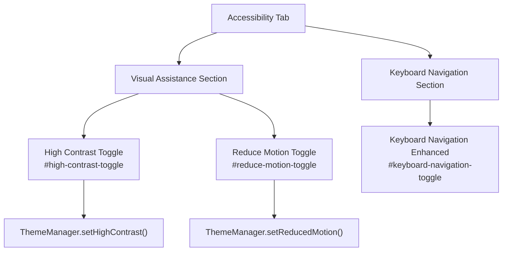
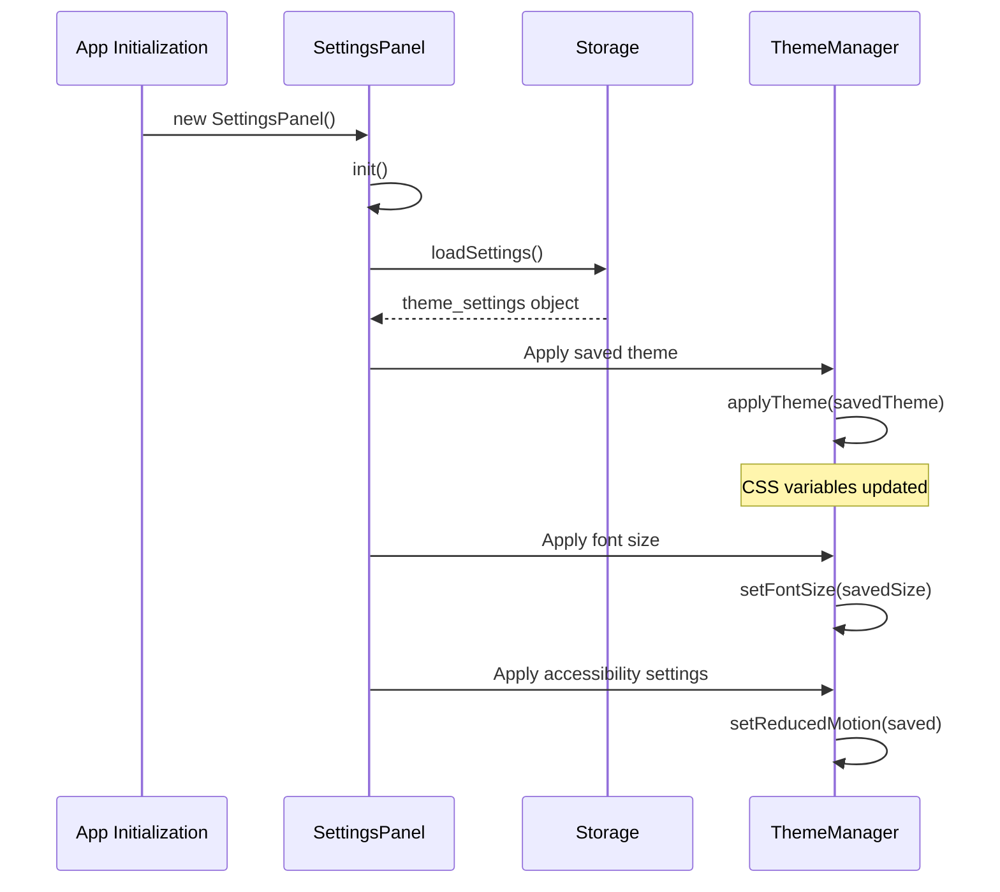
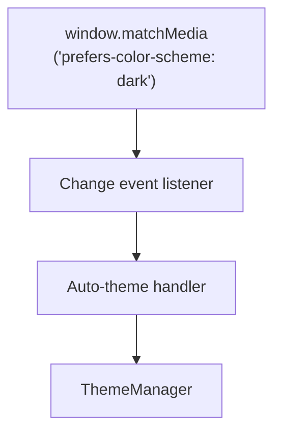

# In-App Theme Variants & CSS

> **Relevant source files**
> * [.superdesign/design_iterations/HarryPoter.html](https://github.com/sallowayma-git/IELTS-practice/blob/df0c9b8f/.superdesign/design_iterations/HarryPoter.html)
> * [.superdesign/design_iterations/ielts_academic_functional_2.html](https://github.com/sallowayma-git/IELTS-practice/blob/df0c9b8f/.superdesign/design_iterations/ielts_academic_functional_2.html)
> * [.superdesign/design_iterations/my_melody_ielts_1.html](https://github.com/sallowayma-git/IELTS-practice/blob/df0c9b8f/.superdesign/design_iterations/my_melody_ielts_1.html)
> * [.superdesign/design_iterations/xiaodaidai_dashboard_1.html](https://github.com/sallowayma-git/IELTS-practice/blob/df0c9b8f/.superdesign/design_iterations/xiaodaidai_dashboard_1.html)
> * [assets/data/vocabulary.json](https://github.com/sallowayma-git/IELTS-practice/blob/df0c9b8f/assets/data/vocabulary.json)
> * [developer/docs/2025-10-12-hp-view-capture.md](https://github.com/sallowayma-git/IELTS-practice/blob/df0c9b8f/developer/docs/2025-10-12-hp-view-capture.md)
> * [developer/tests/ci/run_static_suite.py](https://github.com/sallowayma-git/IELTS-practice/blob/df0c9b8f/developer/tests/ci/run_static_suite.py)
> * [developer/tests/js/suiteInlineFallback.test.js](https://github.com/sallowayma-git/IELTS-practice/blob/df0c9b8f/developer/tests/js/suiteInlineFallback.test.js)
> * [developer/tests/js/suiteModeFlow.test.js](https://github.com/sallowayma-git/IELTS-practice/blob/df0c9b8f/developer/tests/js/suiteModeFlow.test.js)
> * [js/app/suitePracticeMixin.js](https://github.com/sallowayma-git/IELTS-practice/blob/df0c9b8f/js/app/suitePracticeMixin.js)
> * [js/components/practiceHistory.js](https://github.com/sallowayma-git/IELTS-practice/blob/df0c9b8f/js/components/practiceHistory.js)
> * [js/components/practiceRecordModal.js](https://github.com/sallowayma-git/IELTS-practice/blob/df0c9b8f/js/components/practiceRecordModal.js)
> * [js/components/settingsPanel.js](https://github.com/sallowayma-git/IELTS-practice/blob/df0c9b8f/js/components/settingsPanel.js)
> * [js/plugins/hp/hp-path.js](https://github.com/sallowayma-git/IELTS-practice/blob/df0c9b8f/js/plugins/hp/hp-path.js)
> * [js/practice-page-enhancer.js](https://github.com/sallowayma-git/IELTS-practice/blob/df0c9b8f/js/practice-page-enhancer.js)
> * [js/theme-switcher.js](https://github.com/sallowayma-git/IELTS-practice/blob/df0c9b8f/js/theme-switcher.js)
> * [js/utils/themeManager.js](https://github.com/sallowayma-git/IELTS-practice/blob/df0c9b8f/js/utils/themeManager.js)

## Purpose and Scope

This document describes the runtime CSS theme variant system that allows users to change the application's visual appearance without navigating to different HTML files. These themes use CSS custom properties (variables) to dynamically adjust colors, spacing, shadows, and other visual properties.

For complete UI redesigns that involve navigation to standalone HTML files, see [Theme Portals (Academic, Melody, Bloom)](/sallowayma-git/IELTS-practice/7.2-theme-portals-(academic-melody-bloom)). For the controller logic that manages theme preferences and auto-redirect behavior, see [Theme Management & Controller](/sallowayma-git/IELTS-practice/7.1-theme-management-and-controller).

---

## CSS Variable Architecture

The theme system uses CSS custom properties defined at the `:root` level, allowing runtime changes to cascade throughout the entire application without reloading the page.

### Variable Naming Convention

```
--{category}-{variant}-{modifier}
```

Examples:

* `--primary-color`
* `--primary-color-light`
* `--bg-secondary`
* `--shadow-md`

### Core Variable Categories

| Category | Purpose | Example Variables |
| --- | --- | --- |
| **Color - Primary** | Brand colors and main UI elements | `--primary-color`, `--primary-hover`, `--primary-color-light` |
| **Color - Semantic** | Status and action colors | `--success-color`, `--warning-color`, `--error-color` |
| **Background** | Surface colors with hierarchy | `--bg-primary`, `--bg-secondary`, `--bg-tertiary` |
| **Text** | Text colors with opacity levels | `--text-primary`, `--text-secondary`, `--text-muted` |
| **Shadows** | Elevation system | `--shadow-sm`, `--shadow-md`, `--shadow-lg` |
| **Border** | Border colors and styles | `--border-color` |

**Sources:** [js/utils/themeManager.js L7-L105](https://github.com/sallowayma-git/IELTS-practice/blob/df0c9b8f/js/utils/themeManager.js#L7-L105)

---

## Theme Definitions

The `ThemeManager` class defines four in-app theme variants, each with a complete set of CSS variables.

### Xiaodaidai Theme (Default Dashboard)

Warm, playful color palette with yellow/gold accents and soft blue secondary colors.



**Implementation:**

* Defined in [js/utils/themeManager.js L7-L35](https://github.com/sallowayma-git/IELTS-practice/blob/df0c9b8f/js/utils/themeManager.js#L7-L35)
* Applied to `xiaodaidai_dashboard_1.html` via `:root[data-theme="xiaodaidai"]` [.superdesign/design_iterations/xiaodaidai_dashboard_1.html L9-L26](https://github.com/sallowayma-git/IELTS-practice/blob/df0c9b8f/.superdesign/design_iterations/xiaodaidai_dashboard_1.html#L9-L26)

### Light Theme

Clean, professional appearance with blue primary color and neutral grays.

Key variables:

* `--primary-color: #3b82f6` (Bright Blue)
* `--bg-primary: #ffffff` (Pure White)
* `--text-primary: #1f2937` (Dark Gray)
* High contrast ratio for readability

**Sources:** [js/utils/themeManager.js L36-L62](https://github.com/sallowayma-git/IELTS-practice/blob/df0c9b8f/js/utils/themeManager.js#L36-L62)

### Dark Theme

Eye-friendly dark mode with muted colors and reduced brightness.

Key variables:

* `--primary-color: #60a5fa` (Lighter Blue for contrast)
* `--bg-primary: #1f2937` (Dark Gray)
* `--text-primary: #f9fafb` (Near White)
* Inverted shadow opacity for depth

**Sources:** [js/utils/themeManager.js L63-L90](https://github.com/sallowayma-git/IELTS-practice/blob/df0c9b8f/js/utils/themeManager.js#L63-L90)

### High Contrast Theme

Accessibility-focused theme with maximum color contrast ratios (WCAG AAA compliance).

Key variables:

* `--primary-color: #0066cc` (Deep Blue)
* `--bg-primary: #ffffff` (Pure White)
* `--text-primary: #000000` (Pure Black)
* Bold borders: `2px solid`
* Enhanced focus indicators

**Sources:** [js/utils/themeManager.js L91-L119](https://github.com/sallowayma-git/IELTS-practice/blob/df0c9b8f/js/utils/themeManager.js#L91-L119)

---

## Runtime Theme Application Flow

The following diagram shows how themes are applied at runtime without page reload:



### Theme Application Method

The core method `ThemeManager.applyTheme()` iterates over CSS variables and sets them directly on the root element:

```javascript
// Conceptual implementation
applyTheme(themeId) {
    const theme = this.themes[themeId];
    const root = document.documentElement;
    
    Object.entries(theme.variables).forEach(([property, value]) => {
        root.style.setProperty(property, value);
    });
    
    root.setAttribute('data-theme', themeId);
}
```

**Sources:** [js/utils/themeManager.js L211-L228](https://github.com/sallowayma-git/IELTS-practice/blob/df0c9b8f/js/utils/themeManager.js#L211-L228)

---

## Blue Theme Variant

The "Blue Theme" is a lightweight variant that adjusts only a subset of colors without changing the full variable set. It's applied via a CSS class rather than complete variable replacement.

### Application Method

```
// Applied in theme-switcher.js
document.body.classList.toggle('theme-blue', theme === 'blue');
```

### CSS Implementation

```css
body.theme-blue {
    --primary-color: #2563eb;
    --accent-color: #3b82f6;
    /* Overrides only specific variables */
}
```

This approach allows for quick color adjustments without replacing the entire theme definition.

**Sources:** [js/theme-switcher.js L215-L218](https://github.com/sallowayma-git/IELTS-practice/blob/df0c9b8f/js/theme-switcher.js#L215-L218)

---

## Accessibility Features

### Font Size System

The `ThemeManager` provides four font size presets that scale all text proportionally:

| Size | Base Font | Scale Factor | Use Case |
| --- | --- | --- | --- |
| `small` | 14px | 0.875 | Compact view, smaller screens |
| `normal` | 16px | 1.0 | Default, optimal readability |
| `large` | 18px | 1.125 | Enhanced readability |
| `extra-large` | 20px | 1.25 | Visual impairment support |

### Implementation



The font size is set on the root element, and all child elements use relative units (`em`, `rem`) to scale proportionally:

```css
/* Example of relative sizing */
.button {
    font-size: 0.875rem; /* 14px at normal size */
    padding: 0.5em 1em;   /* Scales with font size */
}
```

**Sources:** [js/utils/themeManager.js L147-L162](https://github.com/sallowayma-git/IELTS-practice/blob/df0c9b8f/js/utils/themeManager.js#L147-L162)

 [js/components/settingsPanel.js L158-L160](https://github.com/sallowayma-git/IELTS-practice/blob/df0c9b8f/js/components/settingsPanel.js#L158-L160)

---

## Motion and Animation Controls

### Reduced Motion Mode

When enabled, this feature respects user preferences for minimal animations (important for users with vestibular disorders or motion sensitivity).

### Implementation Strategy



The CSS override reduces all animations and transitions to imperceptible durations:

```
.reduce-motion,
.reduce-motion * {
    animation-duration: 0.01ms !important;
    animation-iteration-count: 1 !important;
    transition-duration: 0.01ms !important;
}
```

This respects the CSS media query `@media (prefers-reduced-motion: reduce)` while allowing manual toggle.

**Sources:** [js/utils/themeManager.js L178-L191](https://github.com/sallowayma-git/IELTS-practice/blob/df0c9b8f/js/utils/themeManager.js#L178-L191)

 [js/components/settingsPanel.js L165-L168](https://github.com/sallowayma-git/IELTS-practice/blob/df0c9b8f/js/components/settingsPanel.js#L165-L168)

---

## High Contrast Mode Toggle

High contrast mode can be enabled independently of the High Contrast theme selection. This feature:

1. Increases border widths to `2px`
2. Enhances focus indicators with thicker outlines
3. Boosts color contrast ratios
4. Adds stronger text shadows for definition

### Toggle Flow



**Sources:** [js/utils/themeManager.js L163-L177](https://github.com/sallowayma-git/IELTS-practice/blob/df0c9b8f/js/utils/themeManager.js#L163-L177)

 [js/components/settingsPanel.js L162-L164](https://github.com/sallowayma-git/IELTS-practice/blob/df0c9b8f/js/components/settingsPanel.js#L162-L164)

---

## Integration with Settings Panel

The Settings Panel provides the user interface for theme configuration through a tabbed interface.

### Appearance Tab Structure



### Event Delegation Pattern

The Settings Panel uses event delegation to handle theme changes efficiently:

```python
// Conceptual implementation from settingsPanel.js
window.DOM.delegate('change', '#theme-select', function(e) {
    window.settingsPanel.updateSetting('theme', this.value);
});
```

This pattern:

* Reduces memory overhead (one listener instead of multiple)
* Handles dynamically added elements
* Simplifies cleanup on panel close

**Sources:** [js/components/settingsPanel.js L150-L160](https://github.com/sallowayma-git/IELTS-practice/blob/df0c9b8f/js/components/settingsPanel.js#L150-L160)

 [js/components/settingsPanel.js L385-L421](https://github.com/sallowayma-git/IELTS-practice/blob/df0c9b8f/js/components/settingsPanel.js#L385-L421)

---

## Accessibility Tab Structure



**Sources:** [js/components/settingsPanel.js L424-L448](https://github.com/sallowayma-git/IELTS-practice/blob/df0c9b8f/js/components/settingsPanel.js#L424-L448)

---

## Theme Persistence and State Management

### Storage Schema

Theme preferences are stored in `localStorage` using the `SettingsRepository`:

```json
{
  "theme_settings": {
    "fontSize": "normal",
    "reduceMotion": false,
    "highContrast": false,
    "autoTheme": true
  },
  "current_theme": "xiaodaidai"
}
```

### Loading Sequence



**Sources:** [js/components/settingsPanel.js L24-L38](https://github.com/sallowayma-git/IELTS-practice/blob/df0c9b8f/js/components/settingsPanel.js#L24-L38)

 [js/components/settingsPanel.js L43-L50](https://github.com/sallowayma-git/IELTS-practice/blob/df0c9b8f/js/components/settingsPanel.js#L43-L50)

---

## System Theme Detection

The `autoTheme` feature detects the operating system's color scheme preference and applies the appropriate theme automatically.

### Detection Logic

```javascript
// Conceptual implementation
if (settings.autoTheme) {
    const isDarkMode = window.matchMedia('(prefers-color-scheme: dark)').matches;
    const themeId = isDarkMode ? 'dark' : 'light';
    ThemeManager.applyTheme(themeId);
}
```

### Listener Setup



**Sources:** [js/utils/themeManager.js L120-L146](https://github.com/sallowayma-git/IELTS-practice/blob/df0c9b8f/js/utils/themeManager.js#L120-L146)

---

## CSS Transition System

All theme changes use CSS transitions for smooth visual updates:

```yaml
:root {
    transition: background-color 0.3s ease,
                color 0.3s ease;
}

* {
    transition: background-color 0.3s ease,
                border-color 0.3s ease,
                color 0.3s ease;
}
```

This creates a polished user experience when switching themes, with all color and visual property changes animating smoothly over 300ms.

**Exception:** When `reduceMotion` is enabled, transitions are overridden to `0.01ms`.

**Sources:** [js/utils/themeManager.js L230-L255](https://github.com/sallowayma-git/IELTS-practice/blob/df0c9b8f/js/utils/themeManager.js#L230-L255)

---

## Xiaodaidai Dashboard Specific Features

The Xiaodaidai theme includes unique visual enhancements beyond standard CSS variables:

### Glass Morphism Effects

```
.glass-panel {
    backdrop-filter: blur(18px);
    box-shadow: 0 24px 60px rgba(161, 191, 255, 0.3);
    border: 1px solid rgba(255, 255, 255, 0.6);
}
```

### Gradient Backgrounds

```yaml
:root[data-theme="xiaodaidai"] {
    background:
        radial-gradient(circle at 12% 18%, rgba(255, 232, 166, 0.55), transparent 52%),
        radial-gradient(circle at 82% 10%, rgba(161, 191, 255, 0.45), transparent 54%),
        radial-gradient(circle at 50% 100%, rgba(255, 107, 107, 0.16), transparent 58%),
        var(--bg-base);
}
```

### Custom Animations

```
@keyframes pulse {
    0% { box-shadow: 0 0 0 0 rgba(52, 211, 153, 0.6); }
    70% { box-shadow: 0 0 0 0.75rem rgba(52, 211, 153, 0); }
    100% { box-shadow: 0 0 0 0 rgba(52, 211, 153, 0); }
}
```

**Sources:** [.superdesign/design_iterations/xiaodaidai_dashboard_1.html L41-L45](https://github.com/sallowayma-git/IELTS-practice/blob/df0c9b8f/.superdesign/design_iterations/xiaodaidai_dashboard_1.html#L41-L45)

 [.superdesign/design_iterations/xiaodaidai_dashboard_1.html L28-L34](https://github.com/sallowayma-git/IELTS-practice/blob/df0c9b8f/.superdesign/design_iterations/xiaodaidai_dashboard_1.html#L28-L34)

 [.superdesign/design_iterations/xiaodaidai_dashboard_1.html L345-L355](https://github.com/sallowayma-git/IELTS-practice/blob/df0c9b8f/.superdesign/design_iterations/xiaodaidai_dashboard_1.html#L345-L355)

---

## Theme Variant Summary

| Theme | Type | Primary Use | Key Feature |
| --- | --- | --- | --- |
| **xiaodaidai** | Dashboard | Default interface | Warm colors, glass effects |
| **light** | Standard | Professional work | Clean, high contrast |
| **dark** | Standard | Night mode | Reduced eye strain |
| **highContrast** | Accessibility | Visual impairment | WCAG AAA compliance |
| **blue** | Variant | Color preference | Quick color shift |

All themes except "blue" use complete CSS variable replacement. The "blue" theme uses CSS class-based overrides for minimal changes.

**Sources:** [js/utils/themeManager.js L7-L119](https://github.com/sallowayma-git/IELTS-practice/blob/df0c9b8f/js/utils/themeManager.js#L7-L119)

 [js/theme-switcher.js L215-L218](https://github.com/sallowayma-git/IELTS-practice/blob/df0c9b8f/js/theme-switcher.js#L215-L218)