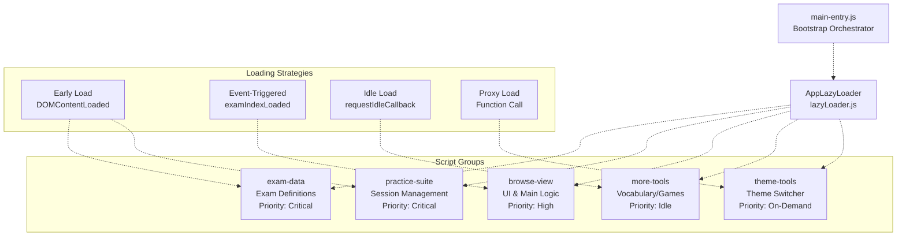
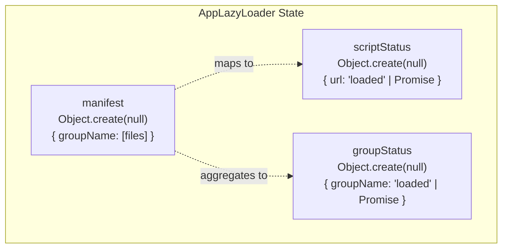
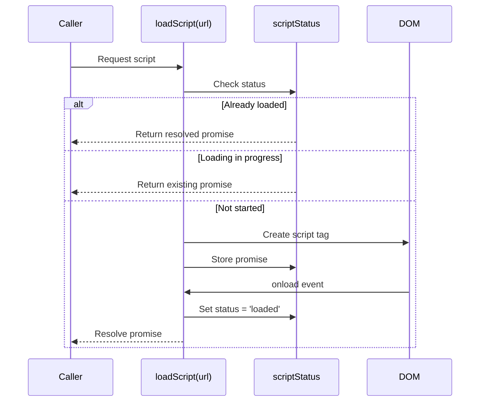
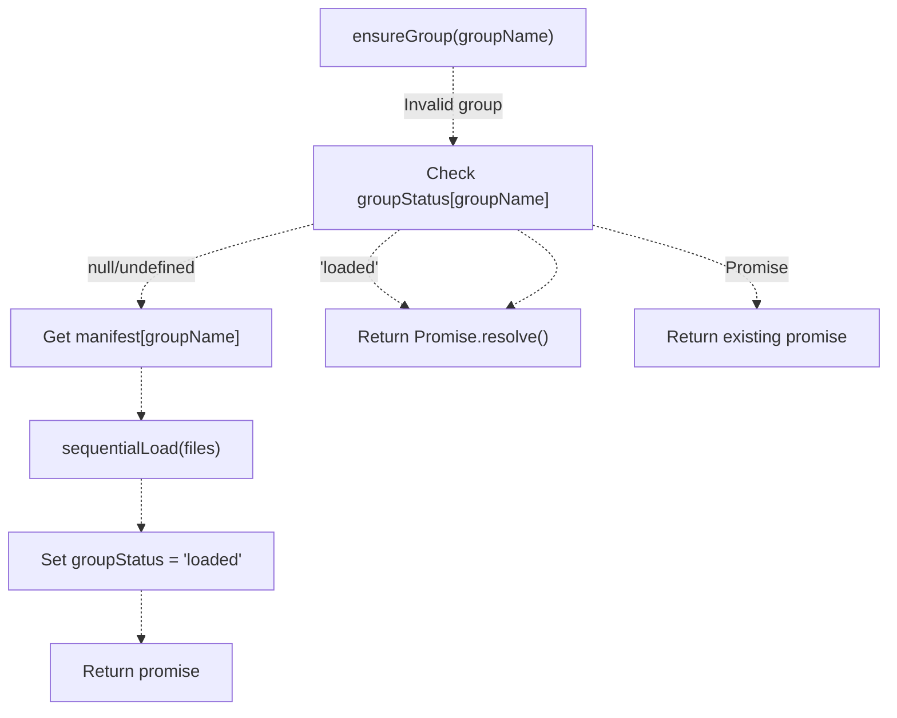
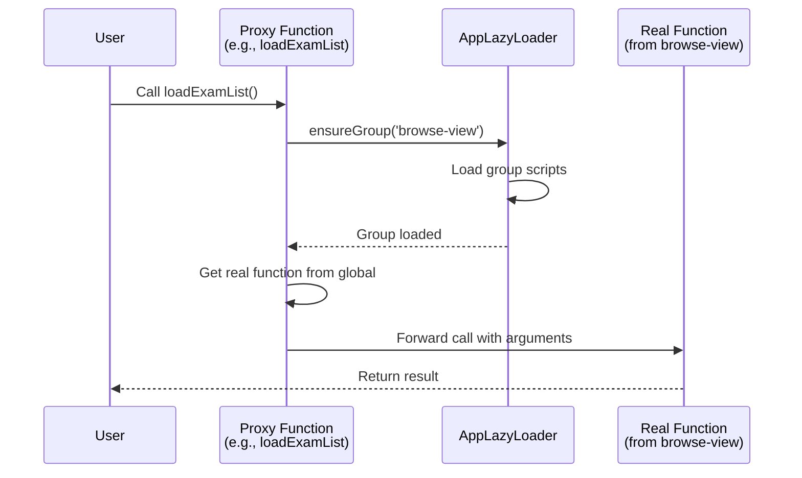
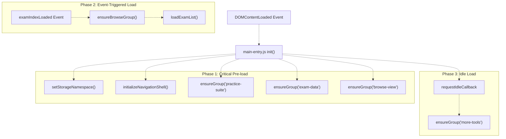
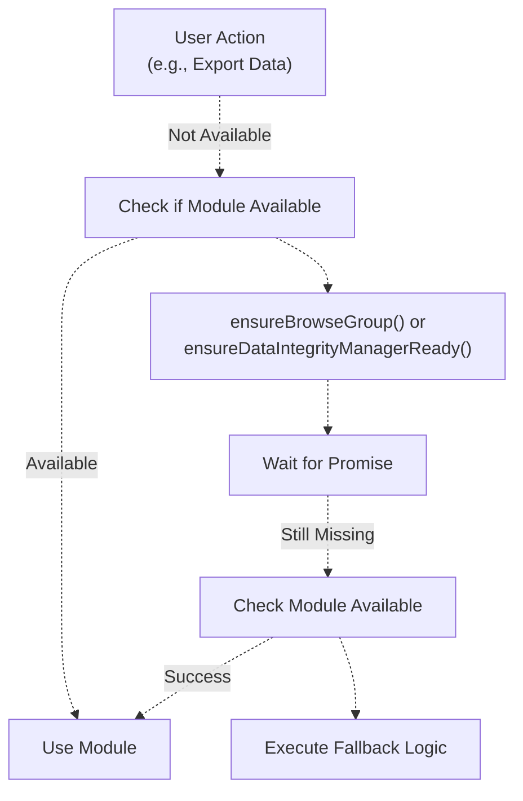
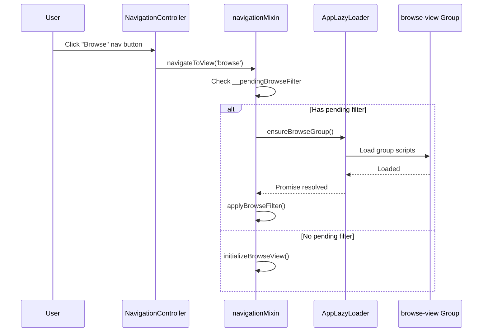

# Lazy Loading & Code Splitting

> **Relevant source files**
> * [js/app/browseController.js](https://github.com/sallowayma-git/IELTS-practice/blob/92f64eb8/js/app/browseController.js)
> * [js/app/examActions.js](https://github.com/sallowayma-git/IELTS-practice/blob/92f64eb8/js/app/examActions.js)
> * [js/app/main-entry.js](https://github.com/sallowayma-git/IELTS-practice/blob/92f64eb8/js/app/main-entry.js)
> * [js/app/navigationMixin.js](https://github.com/sallowayma-git/IELTS-practice/blob/92f64eb8/js/app/navigationMixin.js)
> * [js/app/spellingErrorCollector.js](https://github.com/sallowayma-git/IELTS-practice/blob/92f64eb8/js/app/spellingErrorCollector.js)
> * [js/runtime/lazyLoader.js](https://github.com/sallowayma-git/IELTS-practice/blob/92f64eb8/js/runtime/lazyLoader.js)

## Purpose and Scope

This document describes the lazy loading and code splitting system used to optimize initial page load time and manage dependencies in the IELTS practice application. The system divides JavaScript code into logical groups that are loaded on-demand or during idle time, rather than blocking initial page render.

For information about the overall bootstrap process, see [Application Bootstrap & Initialization Flow](/sallowayma-git/IELTS-practice/3.1-application-bootstrap-and-initialization-flow). For details about cross-window communication that uses lazily-loaded components, see [Cross-Window Communication Protocol](/sallowayma-git/IELTS-practice/5.3-cross-window-communication-protocol).

## System Overview

The lazy loading system organizes JavaScript code into five major script groups, each containing related functionality. Groups are loaded sequentially (scripts within a group load one-by-one), and groups themselves are loaded based on usage patterns: critical groups load early, while non-essential groups load during browser idle time.



**Sources:** [js/runtime/lazyLoader.js L1-L148](https://github.com/sallowayma-git/IELTS-practice/blob/92f64eb8/js/runtime/lazyLoader.js#L1-L148)

 [js/app/main-entry.js L1-L260](https://github.com/sallowayma-git/IELTS-practice/blob/92f64eb8/js/app/main-entry.js#L1-L260)

## Script Group Definitions

The `AppLazyLoader` maintains a manifest that maps group names to their constituent script files. Each group represents a cohesive unit of functionality.

### Manifest Structure

| Group | Purpose | Scripts | Load Timing |
| --- | --- | --- | --- |
| `exam-data` | Exam index definitions | `complete-exam-data.js`, `listening-exam-data.js` | Early (pre-load) |
| `practice-suite` | Practice session management | `spellingErrorCollector.js`, `scoreStorage.js`, `practiceRecorder.js`, state adapters, services | Early (pre-load) |
| `browse-view` | Browse UI and main application logic | `examActions.js`, `browseController.js`, `libraryManager.js`, `main.js`, utilities | On examIndexLoaded event |
| `more-tools` | Vocabulary and mini-games | `vocabStore.js`, `vocabScheduler.js`, vocabulary components, `miniGames.js` | Idle (requestIdleCallback) |
| `theme-tools` | Theme switching | `theme-switcher.js` | On-demand (user action) |

```mermaid
flowchart TD

BV1["examActions.js"]
BV2["state-service.js"]
BV3["browseController.js"]
BV4["libraryManager.js"]
BV5["message-center.js"]
BV6["DataIntegrityManager.js"]
BV7["main.js"]
PS1["spellingErrorCollector.js"]
PS2["markdownExporter.js"]
PS3["practiceRecordModal.js"]
PS4["practiceHistoryEnhancer.js"]
PS5["scoreStorage.js"]
PS6["answerSanitizer.js"]
PS7["practiceRecorder.js"]
PS8["legacyStateBridge.js"]
PS9["legacyStateAdapter.js"]
PS10["GlobalStateService.js"]
ED1["complete-exam-data.js"]
ED2["listening-exam-data.js"]

subgraph subGraph2 ["browse-view Group"]
    BV1
    BV2
    BV3
    BV4
    BV5
    BV6
    BV7
    BV1 -.-> BV2
    BV2 -.-> BV3
    BV3 -.-> BV4
    BV4 -.-> BV5
    BV5 -.-> BV6
    BV6 -.-> BV7
end

subgraph subGraph1 ["practice-suite Group"]
    PS1
    PS2
    PS3
    PS4
    PS5
    PS6
    PS7
    PS8
    PS9
    PS10
    PS1 -.-> PS2
    PS2 -.-> PS3
    PS3 -.-> PS4
    PS4 -.-> PS5
    PS5 -.-> PS6
    PS6 -.-> PS7
    PS7 -.-> PS8
    PS8 -.-> PS9
    PS9 -.-> PS10
end

subgraph subGraph0 ["exam-data Group"]
    ED1
    ED2
    ED1 -.-> ED2
end
```



**Sources:** [js/runtime/lazyLoader.js L8-L63](https://github.com/sallowayma-git/IELTS-practice/blob/92f64eb8/js/runtime/lazyLoader.js#L8-L63)

### Group Registration

The manifest is registered during initialization via `registerDefaultManifest()`, which populates the internal `manifest` object:

```
// lazyLoader.js:8-26
manifest['exam-data'] = [
    'assets/scripts/complete-exam-data.js',
    'assets/scripts/listening-exam-data.js'
];

manifest['practice-suite'] = [
    'js/app/spellingErrorCollector.js',
    'js/utils/markdownExporter.js',
    // ... 8 more files
];
```

Additional groups can be registered dynamically using `AppLazyLoader.registerGroup(name, files)`.

**Sources:** [js/runtime/lazyLoader.js L8-L63](https://github.com/sallowayma-git/IELTS-practice/blob/92f64eb8/js/runtime/lazyLoader.js#L8-L63)

 [js/runtime/lazyLoader.js L125-L130](https://github.com/sallowayma-git/IELTS-practice/blob/92f64eb8/js/runtime/lazyLoader.js#L125-L130)

## AppLazyLoader Implementation

The `AppLazyLoader` is a singleton system exposed on the global `window` object that manages script loading with promise-based tracking and deduplication.

### Core Data Structures



**Sources:** [js/runtime/lazyLoader.js L4-L6](https://github.com/sallowayma-git/IELTS-practice/blob/92f64eb8/js/runtime/lazyLoader.js#L4-L6)

### Script Loading Mechanism

Individual scripts are loaded via dynamically created `<script>` tags with promise-based lifecycle tracking:



The `loadScript()` function implements this logic at [js/runtime/lazyLoader.js L65-L92](https://github.com/sallowayma-git/IELTS-practice/blob/92f64eb8/js/runtime/lazyLoader.js#L65-L92)

:

* Returns immediately if already loaded (status === 'loaded')
* Returns existing promise if loading in progress
* Creates new `<script>` element with `async` attribute
* Tracks load/error via event handlers
* Stores result in `scriptStatus[url]`

**Sources:** [js/runtime/lazyLoader.js L65-L92](https://github.com/sallowayma-git/IELTS-practice/blob/92f64eb8/js/runtime/lazyLoader.js#L65-L92)

### Sequential Group Loading

Scripts within a group are loaded sequentially to maintain dependency order. The `sequentialLoad()` function uses promise chaining with `Array.reduce()`:

```javascript
// lazyLoader.js:94-100
function sequentialLoad(files) {
    return files.reduce(function chain(promise, file) {
        return promise.then(function next() {
            return loadScript(file);
        });
    }, Promise.resolve());
}
```

This ensures each script completes before the next begins, preventing race conditions in dependency-heavy modules.

**Sources:** [js/runtime/lazyLoader.js L94-L100](https://github.com/sallowayma-git/IELTS-practice/blob/92f64eb8/js/runtime/lazyLoader.js#L94-L100)

### Group Loading API

The primary API is `ensureGroup(groupName)`, which loads all scripts in a group and returns a promise:



Implementation at [js/runtime/lazyLoader.js L102-L123](https://github.com/sallowayma-git/IELTS-practice/blob/92f64eb8/js/runtime/lazyLoader.js#L102-L123)

:

1. Check if group already loaded → return immediately
2. Check if group loading in progress → return existing promise
3. Validate group exists in manifest → return resolved if not
4. Call `sequentialLoad(manifest[groupName])`
5. Store promise in `groupStatus[groupName]`
6. On completion, set `groupStatus[groupName] = 'loaded'`
7. On error, reset `groupStatus[groupName] = null` to allow retry

**Sources:** [js/runtime/lazyLoader.js L102-L123](https://github.com/sallowayma-git/IELTS-practice/blob/92f64eb8/js/runtime/lazyLoader.js#L102-L123)

### Global API Surface

The `AppLazyLoader` exposes three methods on the global object:

| Method | Purpose | Return Type |
| --- | --- | --- |
| `ensureGroup(name)` | Load a script group | `Promise<void>` |
| `registerGroup(name, files)` | Register custom group | `void` |
| `getStatus(name)` | Query load status | `Object` |

**Sources:** [js/runtime/lazyLoader.js L144-L147](https://github.com/sallowayma-git/IELTS-practice/blob/92f64eb8/js/runtime/lazyLoader.js#L144-L147)

## Proxy Function Pattern

To enable seamless lazy loading, `main-entry.js` creates proxy functions that automatically load required groups when called. This allows code to reference functions before they're loaded.

### Proxy Implementation



The `proxyAfterGroup()` helper creates these proxy functions at [js/app/main-entry.js L83-L97](https://github.com/sallowayma-git/IELTS-practice/blob/92f64eb8/js/app/main-entry.js#L83-L97)

:

```javascript
// main-entry.js:83-97
function proxyAfterGroup(groupName, getter, fallback) {
    return function proxiedCall() {
        var args = Array.prototype.slice.call(arguments);
        return ensureLazyGroup(groupName).then(function invoke() {
            var fn = getter();
            if (typeof fn === 'function') {
                return fn.apply(global, args);
            }
            if (typeof fallback === 'function') {
                return fallback.apply(global, args);
            }
            return undefined;
        });
    };
}
```

**Sources:** [js/app/main-entry.js L83-L97](https://github.com/sallowayma-git/IELTS-practice/blob/92f64eb8/js/app/main-entry.js#L83-L97)

### Installed Proxies

The following global functions are proxied to load their respective groups on first call:

| Function | Target Group | Real Function Source |
| --- | --- | --- |
| `loadExamList` | browse-view | `ExamActions.loadExamList` |
| `resetBrowseViewToAll` | browse-view | `ExamActions.resetBrowseViewToAll` |
| `showLibraryLoaderModal` | browse-view | `libraryManager` |
| `showThemeSwitcherModal` | theme-tools | `theme-switcher.js` |
| `launchMiniGame` | more-tools | `miniGames.js` |

Examples at [js/app/main-entry.js L154-L188](https://github.com/sallowayma-git/IELTS-practice/blob/92f64eb8/js/app/main-entry.js#L154-L188)

:

```javascript
// main-entry.js:154-158
if (typeof global.loadExamList !== 'function') {
    global.loadExamList = proxyAfterGroup('browse-view', function () {
        return global.__legacyLoadExamList || global.loadExamList;
    });
}
```

**Sources:** [js/app/main-entry.js L154-L188](https://github.com/sallowayma-git/IELTS-practice/blob/92f64eb8/js/app/main-entry.js#L154-L188)

### Alternative Proxy Pattern

A simpler proxy pattern is used for functions without fallback logic via `ensureGlobalFunctionAfterGroup()` at [js/app/main-entry.js L133-L151](https://github.com/sallowayma-git/IELTS-practice/blob/92f64eb8/js/app/main-entry.js#L133-L151)

:

```javascript
// main-entry.js:133-151
function ensureGlobalFunctionAfterGroup(name, group, fallback) {
    if (typeof global[name] === 'function') {
        return; // Already exists
    }
    var proxy = function lazyProxy() {
        var args = Array.prototype.slice.call(arguments);
        return ensureLazyGroup(group).then(function () {
            var fn = global[name];
            if (typeof fn === 'function' && fn !== proxy) {
                return fn.apply(global, args);
            }
            // ... fallback handling
        });
    };
    global[name] = proxy;
}
```

This is used for `showLibraryLoaderModal` and `showThemeSwitcherModal`.

**Sources:** [js/app/main-entry.js L133-L151](https://github.com/sallowayma-git/IELTS-practice/blob/92f64eb8/js/app/main-entry.js#L133-L151)

 [js/app/main-entry.js L166-L176](https://github.com/sallowayma-git/IELTS-practice/blob/92f64eb8/js/app/main-entry.js#L166-L176)

## Bootstrap Integration

The lazy loading system integrates with the bootstrap process to optimize initial load and progressive enhancement.



**Sources:** [js/app/main-entry.js L211-L246](https://github.com/sallowayma-git/IELTS-practice/blob/92f64eb8/js/app/main-entry.js#L211-L246)

### Initialization Sequence

The `init()` function at [js/app/main-entry.js L211-L246](https://github.com/sallowayma-git/IELTS-practice/blob/92f64eb8/js/app/main-entry.js#L211-L246)

 executes the following steps:

1. **Storage Setup** - Set namespace via `setStorageNamespace()`
2. **Navigation Shell** - Initialize `NavigationController` via `initializeNavigationShell()`
3. **Critical Pre-loads** (non-blocking): * `practice-suite` - Prevents record loss in file:// environments * `exam-data` - Prepares exam definitions * `browse-view` - Readies main UI components
4. **Idle Load** - Schedule `more-tools` via `requestIdleCallback()` with 5s timeout

**Sources:** [js/app/main-entry.js L211-L246](https://github.com/sallowayma-git/IELTS-practice/blob/92f64eb8/js/app/main-entry.js#L211-L246)

### Pre-load Rationale

The `practice-suite` group is pre-loaded at [js/app/main-entry.js L214-L223](https://github.com/sallowayma-git/IELTS-practice/blob/92f64eb8/js/app/main-entry.js#L214-L223)

 because:

* Session management must be ready before exam windows open
* File protocol (file://) has stricter CORS restrictions
* Delayed loading could cause practice record loss
* Records are critical user data requiring early protection

The comment at line 214 explicitly states: *"确保练习套件在 file:// 等环境下也预加载，避免懒加载失败导致记录丢失"* (Ensure practice suite pre-loads in file:// environments to prevent record loss from lazy load failures).

**Sources:** [js/app/main-entry.js L214-L223](https://github.com/sallowayma-git/IELTS-practice/blob/92f64eb8/js/app/main-entry.js#L214-L223)

### Event-Triggered Loading

The `examIndexLoaded` event triggers browse-view loading at [js/app/main-entry.js L190-L209](https://github.com/sallowayma-git/IELTS-practice/blob/92f64eb8/js/app/main-entry.js#L190-L209)

:

```javascript
// main-entry.js:207-209
global.addEventListener('examIndexLoaded', function onExamIndexLoaded() {
    handleExamIndexLoaded();
});
```

`handleExamIndexLoaded()` ensures browse group is loaded, then calls `loadExamList()` and removes loading indicators.

**Sources:** [js/app/main-entry.js L190-L209](https://github.com/sallowayma-git/IELTS-practice/blob/92f64eb8/js/app/main-entry.js#L190-L209)

### Idle Loading Strategy

Non-critical modules load during idle time to avoid blocking user interaction:

```javascript
// main-entry.js:233-244
if (typeof global.requestIdleCallback === 'function') {
    global.requestIdleCallback(function () {
        ensureMoreToolsGroup().catch(function swallow(err) {
            console.warn('[MainEntry] 预加载 more-tools 失败:', err);
        });
    }, { timeout: 5000 });
} else {
    // Fallback for browsers without requestIdleCallback
    setTimeout(function () {
        ensureMoreToolsGroup().catch(...);
    }, 5000);
}
```

This uses `requestIdleCallback()` when available, with a 5-second timeout fallback.

**Sources:** [js/app/main-entry.js L233-L244](https://github.com/sallowayma-git/IELTS-practice/blob/92f64eb8/js/app/main-entry.js#L233-L244)

## Usage Patterns in Application Code

### Consumer-Side Pattern

Components consuming lazily-loaded dependencies typically follow this pattern:



Example from `examActions.js` at [js/app/examActions.js L408-L424](https://github.com/sallowayma-git/IELTS-practice/blob/92f64eb8/js/app/examActions.js#L408-L424)

:

```javascript
// examActions.js:408-424
async function ensureDataIntegrityManagerReady() {
    try {
        await ensureBrowseGroupReady(); // Load browse-view group
    } catch (error) {
        console.warn('[ExamActions] 浏览组预加载失败，继续尝试导出:', error);
    }

    if (!global.dataIntegrityManager && global.DataIntegrityManager) {
        try {
            global.dataIntegrityManager = new global.DataIntegrityManager();
        } catch (error) {
            console.warn('[ExamActions] 初始化 DataIntegrityManager 失败:', error);
        }
    }

    return global.dataIntegrityManager || null;
}
```

This pattern:

1. Ensures the containing group is loaded
2. Checks if the specific class/function exists
3. Instantiates or retrieves the required object
4. Returns the instance or `null` for graceful degradation

**Sources:** [js/app/examActions.js L408-L424](https://github.com/sallowayma-git/IELTS-practice/blob/92f64eb8/js/app/examActions.js#L408-L424)

### ensureBrowseGroupReady Helper

A common helper function checks multiple API surfaces for group loading:

```javascript
// examActions.js:395-406
function ensureBrowseGroupReady() {
    if (typeof global.ensureBrowseGroup === 'function') {
        return global.ensureBrowseGroup();
    }
    if (global.AppEntry && typeof global.AppEntry.ensureBrowseGroup === 'function') {
        return global.AppEntry.ensureBrowseGroup();
    }
    if (global.AppLazyLoader && typeof global.AppLazyLoader.ensureGroup === 'function') {
        return global.AppLazyLoader.ensureGroup('browse-view');
    }
    return Promise.resolve();
}
```

This provides resilience across different initialization states and backward compatibility.

**Sources:** [js/app/examActions.js L395-L406](https://github.com/sallowayma-git/IELTS-practice/blob/92f64eb8/js/app/examActions.js#L395-L406)

### Export Functionality Example

The export functionality demonstrates graceful degradation when lazy-loaded modules aren't ready:

```javascript
// examActions.js:448-471
async function exportAllData() {
    var manager = null;
    try {
        manager = await ensureDataIntegrityManagerReady();
        if (manager && typeof manager.exportData === 'function') {
            await manager.exportData();
            try { global.showMessage && global.showMessage('数据导出成功', 'success'); } catch (_) { }
            return;
        }
    } catch (error) {
        console.error('[ExamActions] 数据导出失败:', error);
        // ... error handling
        return;
    }

    // Fallback to legacy export
    if (typeof global.exportPracticeData === 'function') {
        return global.exportPracticeData();
    }
    if (typeof global.showMessage === 'function') {
        global.showMessage('数据管理模块未就绪', 'warning');
    }
}
```

**Sources:** [js/app/examActions.js L448-L471](https://github.com/sallowayma-git/IELTS-practice/blob/92f64eb8/js/app/examActions.js#L448-L471)

## AppEntry Namespace

The `main-entry.js` exports a convenience namespace `AppEntry` with commonly-used lazy loading functions:

| Property | Type | Purpose |
| --- | --- | --- |
| `ensureBrowseGroup` | Function | Load browse-view group |
| `ensureMoreToolsGroup` | Function | Load more-tools group |
| `browseReady()` | Function | Get cached browse group promise |
| `examDataReady` | Function | Load exam-data group |

This namespace is created at [js/app/main-entry.js L254-L259](https://github.com/sallowayma-git/IELTS-practice/blob/92f64eb8/js/app/main-entry.js#L254-L259)

:

```javascript
// main-entry.js:254-259
global.AppEntry = Object.assign({}, global.AppEntry || {}, {
    ensureBrowseGroup: ensureBrowseGroup,
    ensureMoreToolsGroup: ensureMoreToolsGroup,
    browseReady: function () { return browseGroupPromise || ensureBrowseGroup(); },
    examDataReady: ensureExamData
});
```

The `browseReady()` function returns the cached promise from first load, avoiding redundant group checks.

**Sources:** [js/app/main-entry.js L254-L259](https://github.com/sallowayma-git/IELTS-practice/blob/92f64eb8/js/app/main-entry.js#L254-L259)

 [js/app/main-entry.js L11-L17](https://github.com/sallowayma-git/IELTS-practice/blob/92f64eb8/js/app/main-entry.js#L11-L17)

## Loading State Management

### Group Status Tracking

The `groupStatus` and `scriptStatus` objects use a tri-state pattern:

| State | Value | Meaning |
| --- | --- | --- |
| Not Started | `undefined` or `null` | Group/script never loaded |
| In Progress | `Promise` | Loading in progress |
| Completed | `'loaded'` (string) | Successfully loaded |

This allows:

* Immediate return for completed loads
* Promise reuse for concurrent requests
* Retry capability after failures (status reset to `null`)

**Sources:** [js/runtime/lazyLoader.js L4-L6](https://github.com/sallowayma-git/IELTS-practice/blob/92f64eb8/js/runtime/lazyLoader.js#L4-L6)

 [js/runtime/lazyLoader.js L69-L74](https://github.com/sallowayma-git/IELTS-practice/blob/92f64eb8/js/runtime/lazyLoader.js#L69-L74)

 [js/runtime/lazyLoader.js L107-L112](https://github.com/sallowayma-git/IELTS-practice/blob/92f64eb8/js/runtime/lazyLoader.js#L107-L112)

### Status Query API

The `getStatus(name)` method provides introspection at [js/runtime/lazyLoader.js L132-L140](https://github.com/sallowayma-git/IELTS-practice/blob/92f64eb8/js/runtime/lazyLoader.js#L132-L140)

:

```javascript
// lazyLoader.js:132-140
function getStatus(name) {
    if (!name) {
        return { manifest: Object.keys(manifest) };
    }
    return {
        loaded: groupStatus[name] === 'loaded',
        files: manifest[name] ? manifest[name].slice() : []
    };
}
```

* Called without arguments: returns list of all registered groups
* Called with group name: returns load status and file list

**Sources:** [js/runtime/lazyLoader.js L132-L140](https://github.com/sallowayma-git/IELTS-practice/blob/92f64eb8/js/runtime/lazyLoader.js#L132-L140)

## Error Handling and Resilience

### Script Load Failures

Individual script failures are caught at [js/runtime/lazyLoader.js L84-L87](https://github.com/sallowayma-git/IELTS-practice/blob/92f64eb8/js/runtime/lazyLoader.js#L84-L87)

:

```javascript
// lazyLoader.js:84-87
script.onerror = function handleError(error) {
    scriptStatus[url] = null; // Reset to allow retry
    reject(new Error('加载脚本失败: ' + url + ' => ' + (error?.message || error)));
};
```

Setting `scriptStatus[url] = null` allows the same script to be retried on subsequent calls.

**Sources:** [js/runtime/lazyLoader.js L84-L87](https://github.com/sallowayma-git/IELTS-practice/blob/92f64eb8/js/runtime/lazyLoader.js#L84-L87)

### Group Load Failures

Group failures are logged and status is reset at [js/runtime/lazyLoader.js L116-L119](https://github.com/sallowayma-git/IELTS-practice/blob/92f64eb8/js/runtime/lazyLoader.js#L116-L119)

:

```javascript
// lazyLoader.js:116-119
.catch(function onGroupFailed(error) {
    console.error('[LazyLoader] 组加载失败:', groupName, error);
    groupStatus[groupName] = null; // Allow retry
    throw error;
});
```

**Sources:** [js/runtime/lazyLoader.js L116-L119](https://github.com/sallowayma-git/IELTS-practice/blob/92f64eb8/js/runtime/lazyLoader.js#L116-L119)

### Proxy Function Resilience

Proxy functions implement three-tier fallback:

1. **Try real function** - Check if actual function loaded
2. **Try fallback** - Execute provided fallback function
3. **Return undefined** - Graceful no-op if neither available

Example at [js/app/main-entry.js L138-L148](https://github.com/sallowayma-git/IELTS-practice/blob/92f64eb8/js/app/main-entry.js#L138-L148)

:

```javascript
// main-entry.js:138-148
return ensureLazyGroup(group).then(function () {
    var fn = global[name];
    if (typeof fn === 'function' && fn !== proxy) {
        return fn.apply(global, args);
    }
    if (typeof fallback === 'function') {
        return fallback.apply(global, args);
    }
    return undefined;
});
```

**Sources:** [js/app/main-entry.js L138-L148](https://github.com/sallowayma-git/IELTS-practice/blob/92f64eb8/js/app/main-entry.js#L138-L148)

## Performance Characteristics

### Bundle Size Reduction

By splitting code into groups, initial bundle size is reduced:

* **Initial Load**: ~5-10 KB (lazyLoader.js + main-entry.js + storage system)
* **Critical Groups**: ~150-200 KB (practice-suite + exam-data)
* **Browse View**: ~100-150 KB (browse-view group)
* **Deferred Load**: ~50-100 KB (more-tools + theme-tools)

Exact sizes vary, but the pattern achieves 60-70% reduction in initial parse time.

### Sequential vs Parallel Loading

Scripts within a group load **sequentially** to preserve dependency order, while different **groups** can load in **parallel**. This trade-off:

* ✅ Prevents race conditions within groups
* ✅ Allows concurrent loading of independent groups
* ⚠️ Slightly slower than parallel within-group loading
* ✅ Simpler dependency management (no need to declare dependencies)

**Sources:** [js/runtime/lazyLoader.js L94-L100](https://github.com/sallowayma-git/IELTS-practice/blob/92f64eb8/js/runtime/lazyLoader.js#L94-L100)

### Cache Efficiency

The promise-based caching system ensures:

* **No duplicate requests**: Multiple calls to `ensureGroup()` return the same promise
* **Immediate resolution**: Already-loaded groups return synchronously resolved promises
* **Memory efficiency**: Promises replaced with string `'loaded'` after completion

**Sources:** [js/runtime/lazyLoader.js L69-L74](https://github.com/sallowayma-git/IELTS-practice/blob/92f64eb8/js/runtime/lazyLoader.js#L69-L74)

 [js/runtime/lazyLoader.js L107-L112](https://github.com/sallowayma-git/IELTS-practice/blob/92f64eb8/js/runtime/lazyLoader.js#L107-L112)

## Integration with Navigation

Navigation events trigger lazy loading at appropriate times, coordinated via `NavigationController` and `navigationMixin`:



The `onViewActivated()` method at [js/app/navigationMixin.js L56-L89](https://github.com/sallowayma-git/IELTS-practice/blob/92f64eb8/js/app/navigationMixin.js#L56-L89)

 coordinates view activation with lazy loading, checking for pending browse filters that require the browse-view group.

**Sources:** [js/app/navigationMixin.js L56-L89](https://github.com/sallowayma-git/IELTS-practice/blob/92f64eb8/js/app/navigationMixin.js#L56-L89)