# Legacy Compatibility & State Bridges

> **Relevant source files**
> * [css/heroui-bridge.css](https://github.com/sallowayma-git/IELTS-practice/blob/92f64eb8/css/heroui-bridge.css)
> * [css/main.css](https://github.com/sallowayma-git/IELTS-practice/blob/92f64eb8/css/main.css)
> * [index.html](https://github.com/sallowayma-git/IELTS-practice/blob/92f64eb8/index.html)
> * [js/app.js](https://github.com/sallowayma-git/IELTS-practice/blob/92f64eb8/js/app.js)
> * [js/boot-fallbacks.js](https://github.com/sallowayma-git/IELTS-practice/blob/92f64eb8/js/boot-fallbacks.js)
> * [js/main.js](https://github.com/sallowayma-git/IELTS-practice/blob/92f64eb8/js/main.js)
> * [js/plugins/themes/theme-adapter-base.js](https://github.com/sallowayma-git/IELTS-practice/blob/92f64eb8/js/plugins/themes/theme-adapter-base.js)

## Purpose and Scope

This document explains the legacy compatibility layer that enables the IELTS Practice System to maintain backward compatibility with older code patterns while supporting modern state management. The system implements a dual-state architecture where modern components use `AppStateService` for centralized state management, while legacy code continues to access global variables. State bridges and adapters synchronize between these two approaches, ensuring data consistency across the application.

For information about the core state service implementation, see [3.1 ExamSystemApp & State Management](/sallowayma-git/IELTS-practice/3.1-application-bootstrap-and-initialization-flow). For details on data persistence mechanisms, see [4.1 Storage Architecture & Repositories](/sallowayma-git/IELTS-practice/4.1-storage-architecture-and-multi-backend-system).

## Dual State Architecture Overview

The system implements a property-descriptor-based bridging pattern where global variables are replaced with getter/setter pairs that route to modern services when available, falling back to legacy storage. This allows gradual migration from legacy code without breaking existing functionality.

### Property Descriptor Bridge Pattern

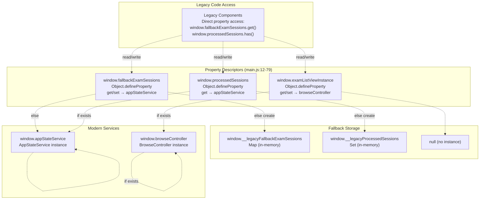

**Sources:** [js/main.js L12-L31](https://github.com/sallowayma-git/IELTS-practice/blob/92f64eb8/js/main.js#L12-L31)

 [js/main.js L65-L79](https://github.com/sallowayma-git/IELTS-practice/blob/92f64eb8/js/main.js#L65-L79)

## Initialization and Bootstrap Integration

Property descriptors are defined at module load time (synchronously), ensuring they are in place before any code attempts to access the bridged properties. The bootstrap process then initializes the backing services.

### Bootstrap Sequence with Property Bridges

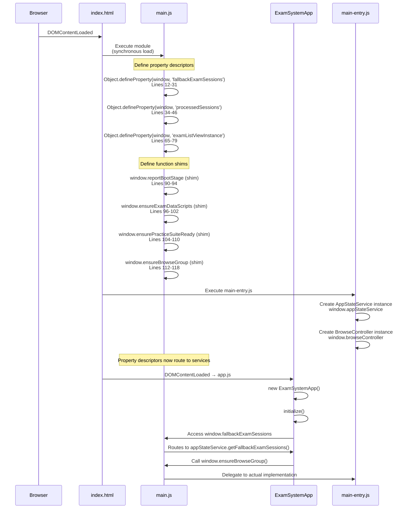

**Sources:** [js/main.js L12-L118](https://github.com/sallowayma-git/IELTS-practice/blob/92f64eb8/js/main.js#L12-L118)

 [js/app/main-entry.js](https://github.com/sallowayma-git/IELTS-practice/blob/92f64eb8/js/app/main-entry.js)

 [index.html L424-L471](https://github.com/sallowayma-git/IELTS-practice/blob/92f64eb8/index.html#L424-L471)

## Property Descriptor Implementation Details

The core compatibility mechanism uses `Object.defineProperty()` to intercept global variable access. When legacy code reads or writes these properties, the getter/setter automatically routes to modern services if available.

### window.fallbackExamSessions Property Descriptor

**Location:** [js/main.js L12-L31](https://github.com/sallowayma-git/IELTS-practice/blob/92f64eb8/js/main.js#L12-L31)

```javascript
Object.defineProperty(window, 'fallbackExamSessions', {
    get: function () {
        if (window.appStateService) {
            return window.appStateService.getFallbackExamSessions();
        }
        // Fallback: if state-service not loaded, return temporary Map
        if (!window.__legacyFallbackExamSessions) {
            window.__legacyFallbackExamSessions = new Map();
        }
        return window.__legacyFallbackExamSessions;
    },
    set: function (value) {
        if (window.appStateService && value instanceof Map) {
            window.appStateService.setFallbackExamSessions(value);
        } else {
            window.__legacyFallbackExamSessions = value;
        }
    },
    configurable: true
});
```

| Aspect | Implementation |
| --- | --- |
| **Property Name** | `window.fallbackExamSessions` |
| **Data Type** | `Map<string, SessionRecord>` |
| **Getter Priority** | 1. `appStateService.getFallbackExamSessions()`  2. `window.__legacyFallbackExamSessions` (lazy-created) |
| **Setter Priority** | 1. `appStateService.setFallbackExamSessions(value)` if `value instanceof Map`  2. Direct assignment to `window.__legacyFallbackExamSessions` |
| **Configurable** | `true` (allows redefinition) |
| **Usage Context** | Tracks active exam session windows for fallback message handling |

### window.processedSessions Property Descriptor

**Location:** [js/main.js L34-L46](https://github.com/sallowayma-git/IELTS-practice/blob/92f64eb8/js/main.js#L34-L46)

```javascript
Object.defineProperty(window, 'processedSessions', {
    get: function () {
        if (window.appStateService) {
            return window.appStateService.getProcessedSessions();
        }
        // Fallback: if state-service not loaded, return temporary Set
        if (!window.__legacyProcessedSessions) {
            window.__legacyProcessedSessions = new Set();
        }
        return window.__legacyProcessedSessions;
    },
    configurable: true
});
```

| Aspect | Implementation |
| --- | --- |
| **Property Name** | `window.processedSessions` |
| **Data Type** | `Set<string>` (sessionId set) |
| **Getter Priority** | 1. `appStateService.getProcessedSessions()`  2. `window.__legacyProcessedSessions` (lazy-created) |
| **Setter** | None (read-only from global scope; managed internally by service) |
| **Configurable** | `true` |
| **Usage Context** | Tracks which session completion messages have been handled to prevent duplicates |

### window.examListViewInstance Property Descriptor

**Location:** [js/main.js L65-L79](https://github.com/sallowayma-git/IELTS-practice/blob/92f64eb8/js/main.js#L65-L79)

```javascript
Object.defineProperty(window, 'examListViewInstance', {
    get: function () {
        if (window.browseController && typeof window.browseController.getExamListView === 'function') {
            return window.browseController.getExamListView();
        }
        return null;
    },
    set: function (value) {
        if (window.browseController && typeof window.browseController.setExamListView === 'function') {
            window.browseController.setExamListView(value);
        }
    },
    configurable: true
});
```

| Aspect | Implementation |
| --- | --- |
| **Property Name** | `window.examListViewInstance` |
| **Data Type** | `LegacyExamListView` instance or `null` |
| **Getter** | Delegates to `browseController.getExamListView()` |
| **Setter** | Delegates to `browseController.setExamListView(value)` |
| **Usage Context** | Legacy exam list renderer used by browse view |

**Sources:** [js/main.js L12-L31](https://github.com/sallowayma-git/IELTS-practice/blob/92f64eb8/js/main.js#L12-L31)

 [js/main.js L34-L46](https://github.com/sallowayma-git/IELTS-practice/blob/92f64eb8/js/main.js#L34-L46)

 [js/main.js L65-L79](https://github.com/sallowayma-git/IELTS-practice/blob/92f64eb8/js/main.js#L65-L79)

## Function Shim Pattern

In addition to property descriptors, `main.js` defines function shims that delegate to actual implementations loaded by `main-entry.js`. This pattern allows early-loading scripts to reference functions that will be defined later.

### Function Shim Implementation Pattern

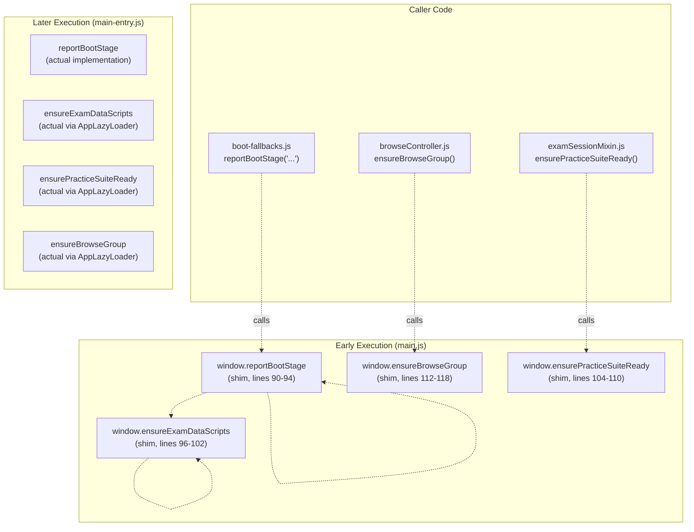

### Function Shim Code Structure

Each shim follows a consistent pattern:

```javascript
// main.js:90-94
if (typeof window.reportBootStage !== 'function') {
    window.reportBootStage = function reportBootStage(message, progress) {
        console.warn('[main.js shim] reportBootStage should be provided by main-entry.js');
    };
}

// main.js:96-102
if (typeof window.ensureExamDataScripts !== 'function') {
    window.ensureExamDataScripts = function ensureExamDataScripts() {
        console.warn('[main.js shim] ensureExamDataScripts should be provided by main-entry.js');
        return Promise.resolve();
    };
}
```

| Shim Function | Return Type | Fallback Behavior |
| --- | --- | --- |
| `reportBootStage` | `void` | Logs warning to console |
| `ensureExamDataScripts` | `Promise<void>` | Returns resolved Promise |
| `ensurePracticeSuiteReady` | `Promise<void>` | Returns resolved Promise |
| `ensureBrowseGroup` | `Promise<void>` | Returns resolved Promise |

**Sources:** [js/main.js L85-L118](https://github.com/sallowayma-git/IELTS-practice/blob/92f64eb8/js/main.js#L85-L118)

## Browse Filter Function Shims

Browse controller functionality is accessed through function shims that delegate to `window.browseController` when available.

### Browse Function Shim Delegation Pattern

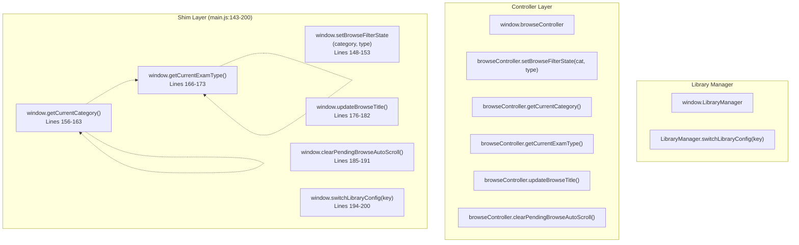

### Implementation Example: setBrowseFilterState

**Location:** [js/main.js L148-L153](https://github.com/sallowayma-git/IELTS-practice/blob/92f64eb8/js/main.js#L148-L153)

```javascript
if (typeof window.setBrowseFilterState !== 'function') {
    window.setBrowseFilterState = function (category, type) {
        if (window.browseController && typeof window.browseController.setBrowseFilterState === 'function') {
            window.browseController.setBrowseFilterState(category, type);
        }
    };
}
```

| Shim Function | Target Method | Fallback Return |
| --- | --- | --- |
| `setBrowseFilterState(category, type)` | `browseController.setBrowseFilterState(category, type)` | No-op if controller missing |
| `getCurrentCategory()` | `browseController.getCurrentCategory()` | `'all'` |
| `getCurrentExamType()` | `browseController.getCurrentExamType()` | `'all'` |
| `updateBrowseTitle()` | `browseController.updateBrowseTitle()` | No-op if controller missing |
| `clearPendingBrowseAutoScroll()` | `browseController.clearPendingBrowseAutoScroll()` | No-op if controller missing |
| `switchLibraryConfig(key)` | `LibraryManager.switchLibraryConfig(key)` | Returns `undefined` |

**Sources:** [js/main.js L143-L200](https://github.com/sallowayma-git/IELTS-practice/blob/92f64eb8/js/main.js#L143-L200)

## Legacy Component Initialization

The `initializeLegacyComponents` function in `main.js` initializes legacy view components that have not been migrated to modern patterns. This function is called during application bootstrap.

### Legacy Component Initialization Flow

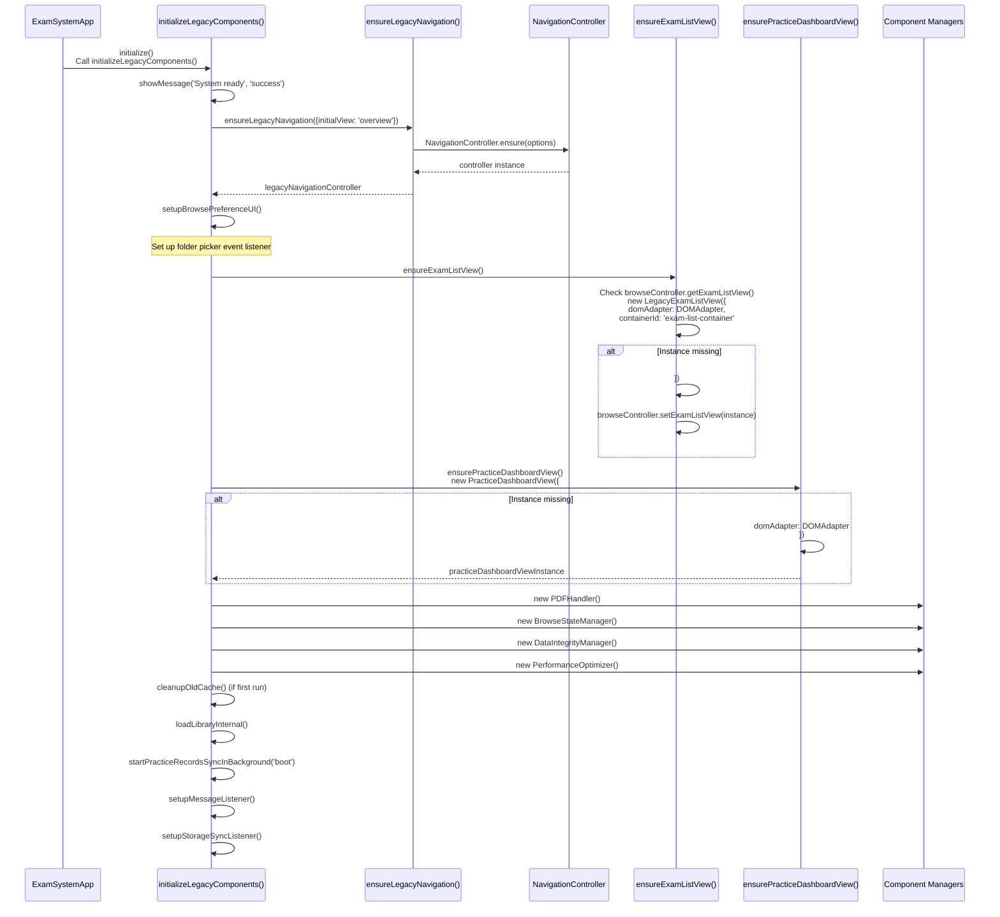

### Component Initialization Code Structure

**Location:** [js/main.js L281-L347](https://github.com/sallowayma-git/IELTS-practice/blob/92f64eb8/js/main.js#L281-L347)

The initialization function performs the following steps:

1. **Show ready message**: `showMessage('系统准备就绪', 'success')`
2. **Initialize navigation controller**: `ensureLegacyNavigation({ initialView: 'overview' })`
3. **Set up browse preferences UI**: `setupBrowsePreferenceUI()`
4. **Initialize component managers**: * `PDFHandler` for PDF resource handling * `BrowseStateManager` for browse view state * `DataIntegrityManager` for backup/restore * `PerformanceOptimizer` for UI optimization
5. **One-time cleanup** (if `upgrade_v1_1_0_cleanup_done` flag not set): * Call `cleanupOldCache()` to clear old storage keys * Set flag in localStorage
6. **Load data**: * `loadLibraryInternal()` to load exam index * `startPracticeRecordsSyncInBackground('boot')` to load practice records asynchronously
7. **Set up event listeners**: * `setupMessageListener()` for cross-window `postMessage` events * `setupStorageSyncListener()` for `storage` events from other tabs

### Legacy Component Manager Table

| Component | Class | Global Variable | Purpose |
| --- | --- | --- | --- |
| PDF Handler | `PDFHandler` | `window.pdfHandler` | Handles PDF resource loading and fallback |
| Browse State Manager | `BrowseStateManager` | `window.browseStateManager` | Manages browse view scroll and filter state |
| Data Integrity Manager | `DataIntegrityManager` | `window.dataIntegrityManager` | Provides backup/restore functionality |
| Performance Optimizer | `PerformanceOptimizer` | `window.performanceOptimizer` | Optimizes virtual scrolling and list rendering |
| Exam List View | `LegacyExamListView` | `window.examListViewInstance` (via property descriptor) | Renders exam cards in browse view |
| Practice Dashboard View | `PracticeDashboardView` | `practiceDashboardViewInstance` (module-level) | Renders practice statistics in overview |
| Legacy Navigation Controller | `NavigationController` | `legacyNavigationController` (module-level) | Manages view navigation and active state sync |

**Sources:** [js/main.js L281-L347](https://github.com/sallowayma-git/IELTS-practice/blob/92f64eb8/js/main.js#L281-L347)

 [js/main.js L217-L278](https://github.com/sallowayma-git/IELTS-practice/blob/92f64eb8/js/main.js#L217-L278)

## Practice Records Synchronization

Practice records are loaded from storage and normalized using a multi-source fallback strategy. The `syncPracticeRecords` function implements this loading process.

### Practice Record Loading Flow

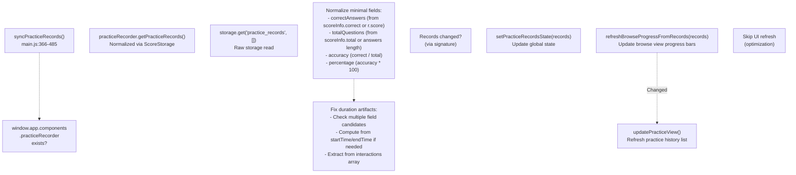

### Duration Normalization Logic

Practice record duration is extracted from multiple possible sources with fallbacks:

**Location:** [js/main.js L412-L444](https://github.com/sallowayma-git/IELTS-practice/blob/92f64eb8/js/main.js#L412-L444)

| Source Priority | Field Candidates | Transformation |
| --- | --- | --- |
| 1. Direct fields | `r.duration`, `rd.duration`, `r.durationSeconds`, `r.duration_seconds`, `r.elapsedSeconds`, `r.elapsed_seconds`, `r.timeSpent`, `r.time_spent` | Use first finite positive number |
| 2. Nested scoreInfo | `rd.durationSeconds`, `rd.elapsedSeconds`, `rd.timeSpent`, `sInfo.duration`, `sInfo.timeSpent` | Use first finite positive number |
| 3. Timestamps | `r.startTime`, `r.endTime` | Compute `Math.round((endTime - startTime) / 1000)` |
| 4. Interactions | `rd.interactions[]` array | Compute `Math.floor((max_timestamp - min_timestamp) / 1000)` |
| Fallback | None of above | `0` |

### Background Synchronization

**Location:** [js/main.js L487-L509](https://github.com/sallowayma-git/IELTS-practice/blob/92f64eb8/js/main.js#L487-L509)

Practice records are loaded in the background during bootstrap to avoid blocking initial page render:

```javascript
// Called from initializeLegacyComponents()
startPracticeRecordsSyncInBackground('boot');

// Implementation
function startPracticeRecordsSyncInBackground(trigger = 'default') {
    try {
        ensurePracticeRecordsSync(trigger);
    } catch (error) {
        console.warn(`[System] Background sync failed(${trigger}):`, error);
    }
}

function ensurePracticeRecordsSync(trigger = 'default') {
    if (practiceRecordsLoadPromise) {
        return practiceRecordsLoadPromise;
    }
    practiceRecordsLoadPromise = (async () => {
        await syncPracticeRecords();
        return true;
    })().catch((error) => {
        console.warn(`[System] Sync failed(${trigger}):`, error);
        practiceRecordsLoadPromise = null;
        return false;
    });
    return practiceRecordsLoadPromise;
}
```

The singleton promise pattern ensures only one sync operation runs at a time, even if multiple callers request synchronization.

**Sources:** [js/main.js L366-L485](https://github.com/sallowayma-git/IELTS-practice/blob/92f64eb8/js/main.js#L366-L485)

 [js/main.js L487-L509](https://github.com/sallowayma-git/IELTS-practice/blob/92f64eb8/js/main.js#L487-L509)

## Cross-Window Message Handling

The `setupMessageListener` function installs a `postMessage` event handler for receiving practice completion messages from exam windows.

### Message Handling Flow

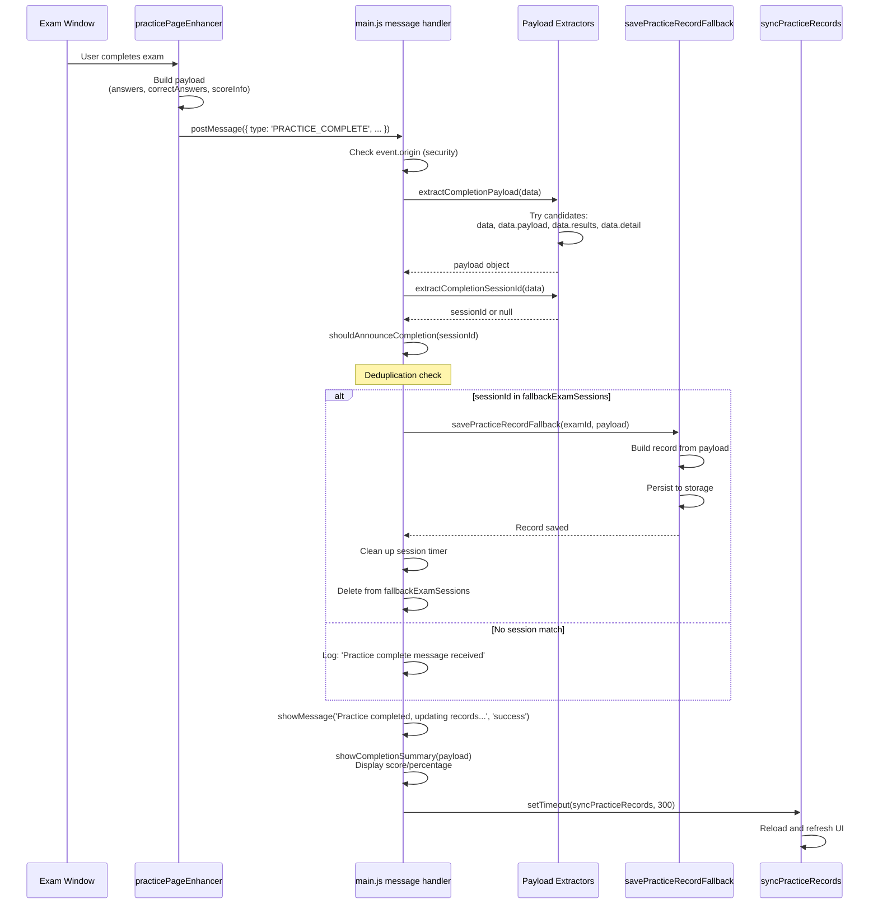

### Message Listener Implementation

**Location:** [js/main.js L652-L699](https://github.com/sallowayma-git/IELTS-practice/blob/92f64eb8/js/main.js#L652-L699)

```typescript
function setupMessageListener() {
    window.addEventListener('message', (event) => {
        // Security check: allow same-origin or file protocol
        try {
            if (event.origin && event.origin !== 'null' && event.origin !== window.location.origin) {
                return;
            }
        } catch (_) { }

        const data = event.data || {};
        const type = data.type;
        
        if (type === 'SESSION_READY') {
            // Match session by event.source and stop handshake retries
            for (const [sid, rec] of fallbackExamSessions.entries()) {
                if (rec && rec.win === event.source) {
                    if (rec.timer) clearInterval(rec.timer);
                    console.log('[Fallback] Session ready (matched window):', sid);
                    break;
                }
            }
        } else if (type === 'PRACTICE_COMPLETE' || type === 'practice_completed') {
            const payload = extractCompletionPayload(data) || {};
            const sessionId = extractCompletionSessionId(data);
            const rec = sessionId ? fallbackExamSessions.get(sessionId) : null;
            
            if (rec) {
                // Matched session: save via fallback path
                savePracticeRecordFallback(rec.examId, payload).finally(() => {
                    // Clean up session
                    try { if (rec.timer) clearInterval(rec.timer); } catch (_) { }
                    try { fallbackExamSessions.delete(sessionId); } catch (_) { }
                    
                    if (shouldAnnounceCompletion(sessionId)) {
                        showMessage('Practice completed, updating records...', 'success');
                        showCompletionSummary(payload);
                    }
                    setTimeout(syncPracticeRecords, 300);
                });
            } else {
                // No matched session
                console.log('[System] Practice complete message received, syncing records...');
                if (shouldAnnounceCompletion(sessionId)) {
                    showMessage('Practice completed, updating records...', 'success');
                    showCompletionSummary(payload);
                }
                setTimeout(syncPracticeRecords, 300);
            }
        }
    });
}
```

### Message Payload Extraction

**Location:** [js/main.js L516-L562](https://github.com/sallowayma-git/IELTS-practice/blob/92f64eb8/js/main.js#L516-L562)

The system tries multiple paths to extract the practice completion payload from the message:

| Extraction Function | Candidates Tried | Return Type |
| --- | --- | --- |
| `extractCompletionPayload(envelope)` | `envelope.data`, `envelope.payload`, `envelope.results`, `envelope.detail`, `envelope` | `Object` with scoreInfo/answers |
| `extractCompletionSessionId(envelope)` | `envelope.sessionId`, `payload.sessionId` | `string` or `null` |
| `extractCompletionStats(payload)` | `scoreInfo.correct`, `payload.correctAnswers`, `scoreInfo.total`, `payload.totalQuestions` | `{ percentage, correct, total }` |

**Sources:** [js/main.js L516-L649](https://github.com/sallowayma-git/IELTS-practice/blob/92f64eb8/js/main.js#L516-L649)

 [js/main.js L652-L699](https://github.com/sallowayma-git/IELTS-practice/blob/92f64eb8/js/main.js#L652-L699)

## Migration Strategy

The dual-state architecture enables gradual migration from legacy to modern patterns:

### Phase 1: Current State (Dual Support)

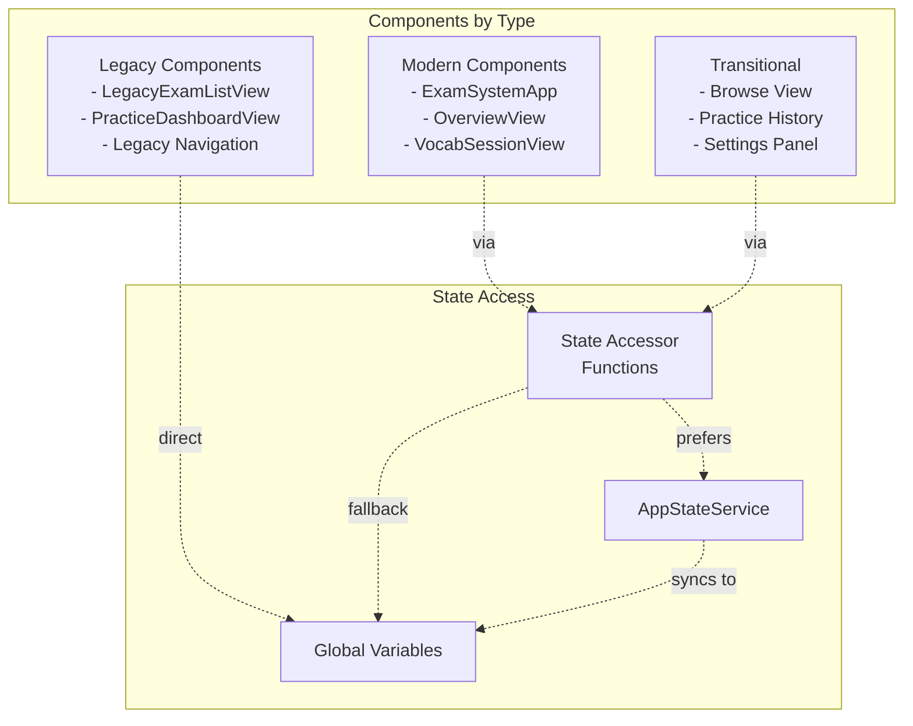

### Phase 2: Target State (Modern Only)

In the target architecture, all components would use `AppStateService` directly, and the legacy adapter would be removed. The state accessor functions would remain as a convenience API but would only route to the modern service.

### Migration Checklist

Components can be migrated by:

1. Replace direct global variable access with state accessor functions
2. Replace `window.examIndex` reads with `getExamIndexState()`
3. Replace `window.practiceRecords` reads with `getPracticeRecordsState()`
4. Replace direct assignments with `setExamIndexState()`, `setPracticeRecordsState()`
5. Test that component works with both modern and legacy paths

**Sources:** [js/main.js L48-L298](https://github.com/sallowayma-git/IELTS-practice/blob/92f64eb8/js/main.js#L48-L298)

 [js/app.js L12-L56](https://github.com/sallowayma-git/IELTS-practice/blob/92f64eb8/js/app.js#L12-L56)

## Data Enrichment Integration

State accessors integrate with `DataConsistencyManager` to enrich practice records before they are stored or displayed.

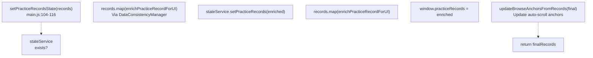

### Enrichment Function

```javascript
// main.js:89-102
function enrichPracticeRecordForUI(record) {
    if (!record || typeof record !== 'object') {
        return record;
    }
    if (typeof window !== 'undefined' && window.DataConsistencyManager) {
        try {
            const manager = new DataConsistencyManager();
            return manager.enrichRecordData(record);
        } catch (error) {
            console.warn('[PracticeRecords] enrichRecordData failed:', error);
        }
    }
    return record;
}
```

This ensures that all practice records have consistent metadata (exam titles, categories, normalized scores) regardless of whether they come from modern or legacy sources.

**Sources:** [js/main.js L89-L116](https://github.com/sallowayma-git/IELTS-practice/blob/92f64eb8/js/main.js#L89-L116)

 [js/utils/dataConsistencyManager.js](https://github.com/sallowayma-git/IELTS-practice/blob/92f64eb8/js/utils/dataConsistencyManager.js)

## Fallback Practice Record Saving

When practice completion messages are received without a matched `AppStateService` handler, the `savePracticeRecordFallback` function provides a compatibility path for persisting records.

### Fallback Save Process

```mermaid
flowchart TD

START["savePracticeRecordFallback(examId, realData)<br>main.js:833-1100+"]
CHECK_SUITE["Is suite mode?<br>(suiteSessionId present)"]
CHECK_AGG["Is aggregate payload?<br>(has suiteEntries[])"]
SKIP["Skip save<br>(suite child result)"]
FIND_EXAM["Find exam in examIndex<br>by examId"]
TRY_URL["exam not found?<br>Try URL match"]
URL_MATCH["Match realData.url<br>against exam.path"]
TRY_TITLE["Still not found?<br>Try title match"]
TITLE_MATCH["Normalize and compare<br>realData.title vs exam.title"]
EXTRACT["Extract score data:<br>- scoreInfo.correct<br>- scoreInfo.total<br>- scoreInfo.accuracy<br>- scoreInfo.percentage"]
NORMALIZE_ANS["normalizeFallbackAnswerMap(realData.answers)<br>Handle array/object formats"]
NORMALIZE_COR["normalizeFallbackAnswerMap(realData.correctAnswers)<br>Handle array/object formats"]
BUILD_DETAILS["buildFallbackAnswerDetails(answerMap, correctMap)<br>Create answer comparison"]
BUILD_RECORD["Build record object:<br>- id: Date.now()<br>- examId, title, category<br>- percentage, accuracy, score<br>- duration, date, realData"]
SAVE["storage.set('practice_records', [...records, record])"]

START -.-> CHECK_SUITE
EXTRACT -.-> NORMALIZE_ANS
```

### Answer Normalization Functions

**Location:** [js/main.js L712-L794](https://github.com/sallowayma-git/IELTS-practice/blob/92f64eb8/js/main.js#L712-L794)

The fallback path includes answer normalization functions to handle various payload formats:

| Function | Purpose | Input Types Handled |
| --- | --- | --- |
| `normalizeFallbackAnswerValue(value)` | Convert single answer value to string | `null`, `undefined`, `boolean`, `Array`, `Object`, `string`, `number` |
| `normalizeFallbackAnswerMap(rawAnswers)` | Convert answers to `{ [key]: value }` map | `Array<{ questionId, answer }>`, `Object` |
| `buildFallbackAnswerDetails(answerMap, correctMap)` | Create answer comparison object | Two answer maps → `{ [key]: { userAnswer, correctAnswer, isCorrect } }` |
| `normalizeFallbackAnswerComparison(existingComparison, answerMap, correctMap)` | Normalize and merge answer comparison | Existing comparison + answer maps → normalized comparison |

### Category Inference

**Location:** [js/main.js L929-L944](https://github.com/sallowayma-git/IELTS-practice/blob/92f64eb8/js/main.js#L929-L944)

If the exam is not found in the index, the category is inferred from multiple sources:

1. `exam.category` (if exam found)
2. `realData.pageType` (e.g., "P4")
3. Regex match on `realData.url` for `/\b(P[1-4])\b/i`
4. Regex match on `realData.title` for `/\b(P[1-4])\b/i`
5. Fallback: `'Unknown'`

**Sources:** [js/main.js L712-L1100](https://github.com/sallowayma-git/IELTS-practice/blob/92f64eb8/js/main.js#L712-L1100)

## Storage Synchronization Listener

The `setupStorageSyncListener` function installs a handler for custom `storage-sync` events dispatched by `StorageManager` to notify the application of storage changes from other tabs or windows.

### Storage Sync Event Flow

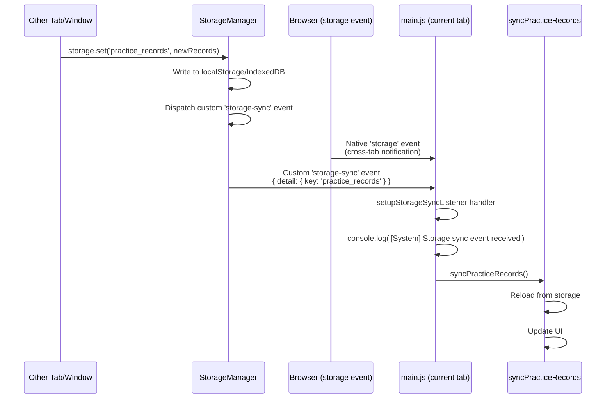

### Implementation

**Location:** [js/main.js L702-L710](https://github.com/sallowayma-git/IELTS-practice/blob/92f64eb8/js/main.js#L702-L710)

```javascript
function setupStorageSyncListener() {
    window.addEventListener('storage-sync', (event) => {
        console.log('[System] Storage sync event received, updating practice records...', event.detail);
        // Could filter by event.detail.key === 'practice_records'
        // but for simplicity, sync all records
        syncPracticeRecords();
    });
}
```

The listener triggers a full `syncPracticeRecords()` call when the event is received, ensuring the current tab's state stays synchronized with changes made in other tabs.

**Sources:** [js/main.js L702-L710](https://github.com/sallowayma-git/IELTS-practice/blob/92f64eb8/js/main.js#L702-L710)

## Defensive Programming Patterns

The compatibility layer implements multiple defensive patterns to handle edge cases and prevent failures.

### Property Descriptor Safety Checks

When property descriptors are already defined (potentially by other code), the setter/getter checks prevent overwriting them:

**Location:** [js/main.js L12-L31](https://github.com/sallowayma-git/IELTS-practice/blob/92f64eb8/js/main.js#L12-L31)

```javascript
Object.defineProperty(window, 'fallbackExamSessions', {
    get: function () {
        if (window.appStateService) {
            return window.appStateService.getFallbackExamSessions();
        }
        // Fallback: lazy-create temporary Map if service unavailable
        if (!window.__legacyFallbackExamSessions) {
            window.__legacyFallbackExamSessions = new Map();
        }
        return window.__legacyFallbackExamSessions;
    },
    set: function (value) {
        // Only set if value is correct type
        if (window.appStateService && value instanceof Map) {
            window.appStateService.setFallbackExamSessions(value);
        } else {
            window.__legacyFallbackExamSessions = value;
        }
    },
    configurable: true  // Allow redefinition if needed
});
```

| Pattern | Purpose | Example |
| --- | --- | --- |
| **Type checking before set** | Prevents invalid data from being stored | `if (value instanceof Map)` before calling setter |
| **Lazy initialization** | Avoids errors when backing service not available | `if (!window.__legacyFallbackExamSessions) { ... }` |
| **Configurable descriptors** | Allows test code or other modules to redefine properties | `configurable: true` |
| **Service existence checks** | Gracefully degrades when modern services unavailable | `if (window.appStateService)` before calling methods |

### Try-Catch Protection in Function Shims

Function shims wrap potentially failing code in try-catch blocks:

**Location:** [js/main.js L148-L153](https://github.com/sallowayma-git/IELTS-practice/blob/92f64eb8/js/main.js#L148-L153)

```javascript
if (typeof window.setBrowseFilterState !== 'function') {
    window.setBrowseFilterState = function (category, type) {
        if (window.browseController && typeof window.browseController.setBrowseFilterState === 'function') {
            window.browseController.setBrowseFilterState(category, type);
        }
        // No-op if controller doesn't exist (graceful degradation)
    };
}
```

### Type Validation in Message Handlers

**Location:** [js/main.js L652-L699](https://github.com/sallowayma-git/IELTS-practice/blob/92f64eb8/js/main.js#L652-L699)

Message handlers validate input before processing:

```typescript
window.addEventListener('message', (event) => {
    // 1. Validate event structure
    const data = event.data || {};
    const type = data.type;
    
    // 2. Check message type
    if (type === 'PRACTICE_COMPLETE' || type === 'practice_completed') {
        // 3. Safe extraction with fallback
        const payload = extractCompletionPayload(data) || {};
        const sessionId = extractCompletionSessionId(data);
        const rec = sessionId ? fallbackExamSessions.get(sessionId) : null;
        
        // 4. Only proceed if data is valid
        if (rec) {
            savePracticeRecordFallback(rec.examId, payload).finally(/* ... */);
        }
    }
});
```

### Null Safety in Record Normalization

**Location:** [js/main.js L366-L485](https://github.com/sallowayma-git/IELTS-practice/blob/92f64eb8/js/main.js#L366-L485)

The `syncPracticeRecords` function safely handles missing or malformed data:

```javascript
// Safe access to nested properties with fallback
const sInfo = r && (r.scoreInfo || rd.scoreInfo) || {};
const correct = (typeof r.correctAnswers === 'number') 
    ? r.correctAnswers 
    : (typeof sInfo.correct === 'number' 
        ? sInfo.correct 
        : (typeof r.score === 'number' ? r.score : 0));
```

**Sources:** [js/main.js L12-L79](https://github.com/sallowayma-git/IELTS-practice/blob/92f64eb8/js/main.js#L12-L79)

 [js/main.js L148-L153](https://github.com/sallowayma-git/IELTS-practice/blob/92f64eb8/js/main.js#L148-L153)

 [js/main.js L366-L485](https://github.com/sallowayma-git/IELTS-practice/blob/92f64eb8/js/main.js#L366-L485)

 [js/main.js L652-L699](https://github.com/sallowayma-git/IELTS-practice/blob/92f64eb8/js/main.js#L652-L699)

## Summary

The legacy compatibility and state bridge system provides:

1. **Transparent dual-path access**: Components can use state accessor functions without knowing whether they're accessing modern or legacy state
2. **Gradual migration path**: New components use modern patterns while legacy components continue functioning
3. **Bidirectional synchronization**: Changes propagate between modern and legacy layers automatically
4. **Defensive programming**: Robust error handling prevents failures in edge cases
5. **Consistent API**: State accessor functions provide a uniform interface across the codebase

This architecture has enabled the IELTS Practice System to modernize its state management incrementally while maintaining full backward compatibility with existing code.

**Sources:** [js/main.js L4-L298](https://github.com/sallowayma-git/IELTS-practice/blob/92f64eb8/js/main.js#L4-L298)

 [js/core/legacyStateBridge.js](https://github.com/sallowayma-git/IELTS-practice/blob/92f64eb8/js/core/legacyStateBridge.js)

 [js/utils/legacyStateAdapter.js](https://github.com/sallowayma-git/IELTS-practice/blob/92f64eb8/js/utils/legacyStateAdapter.js)

 [js/app/state-service.js](https://github.com/sallowayma-git/IELTS-practice/blob/92f64eb8/js/app/state-service.js)

 [js/app.js L12-L56](https://github.com/sallowayma-git/IELTS-practice/blob/92f64eb8/js/app.js#L12-L56)