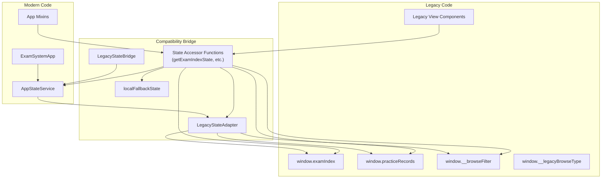
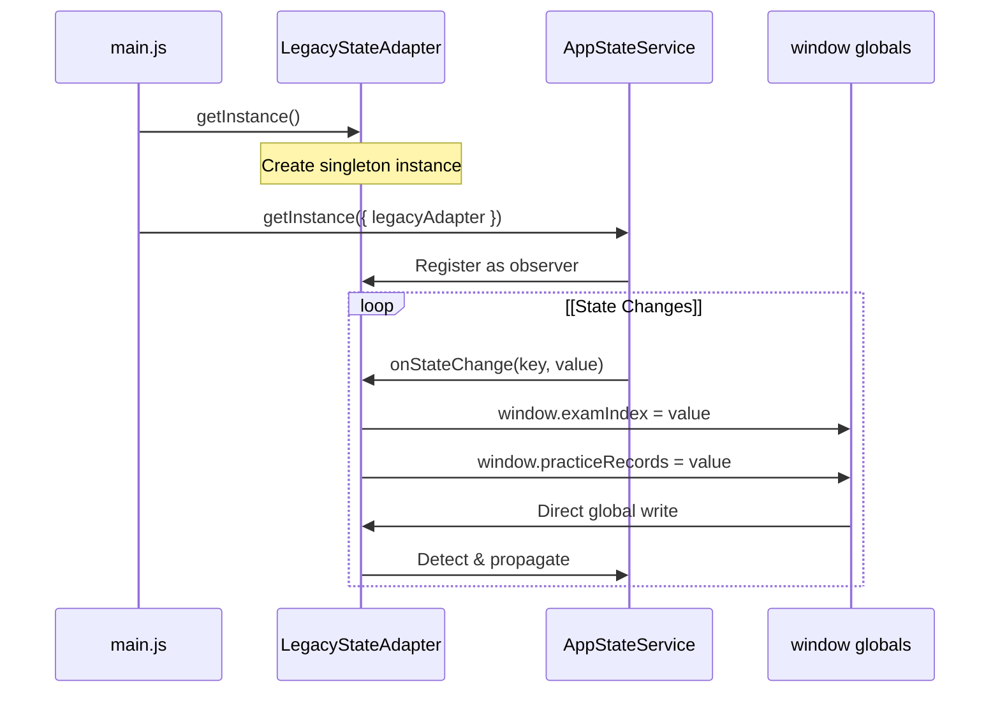
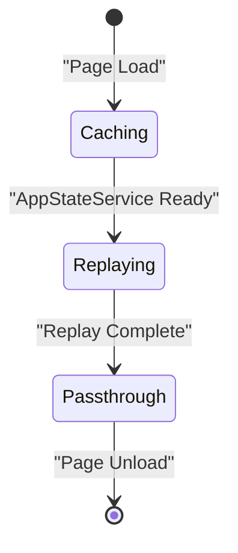
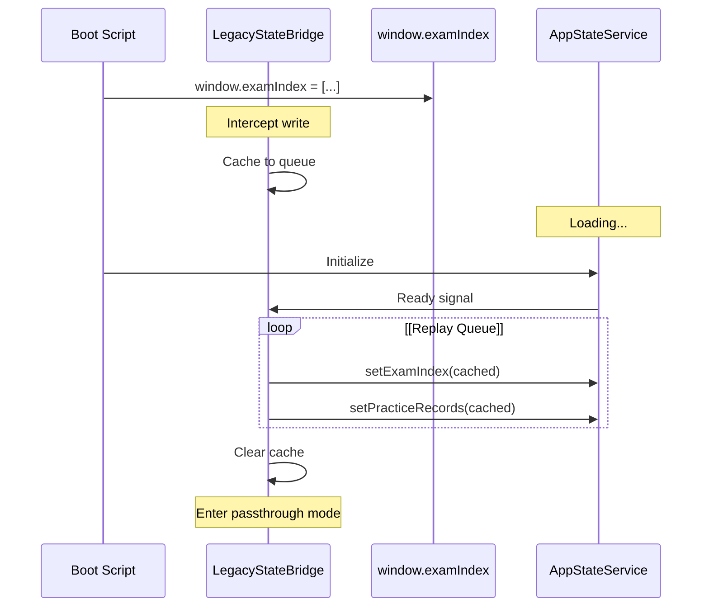
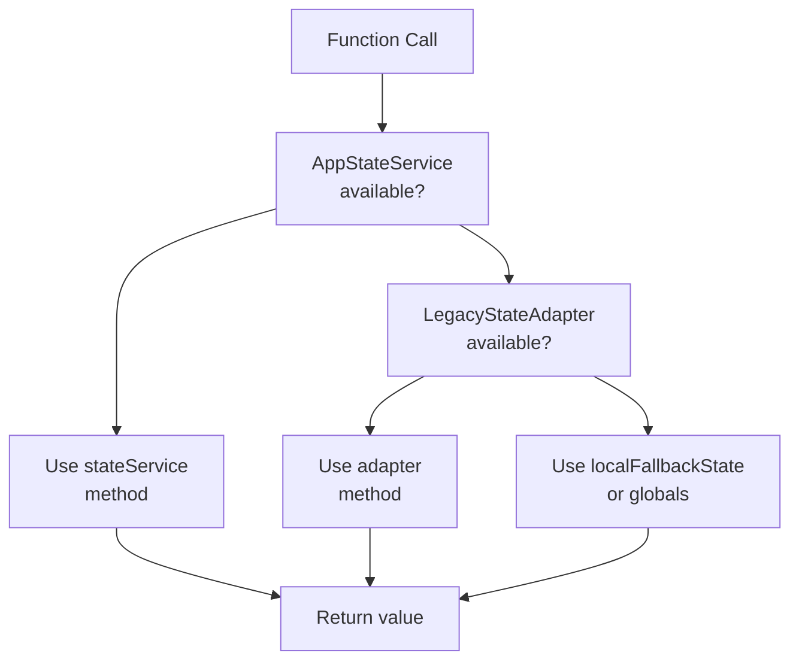
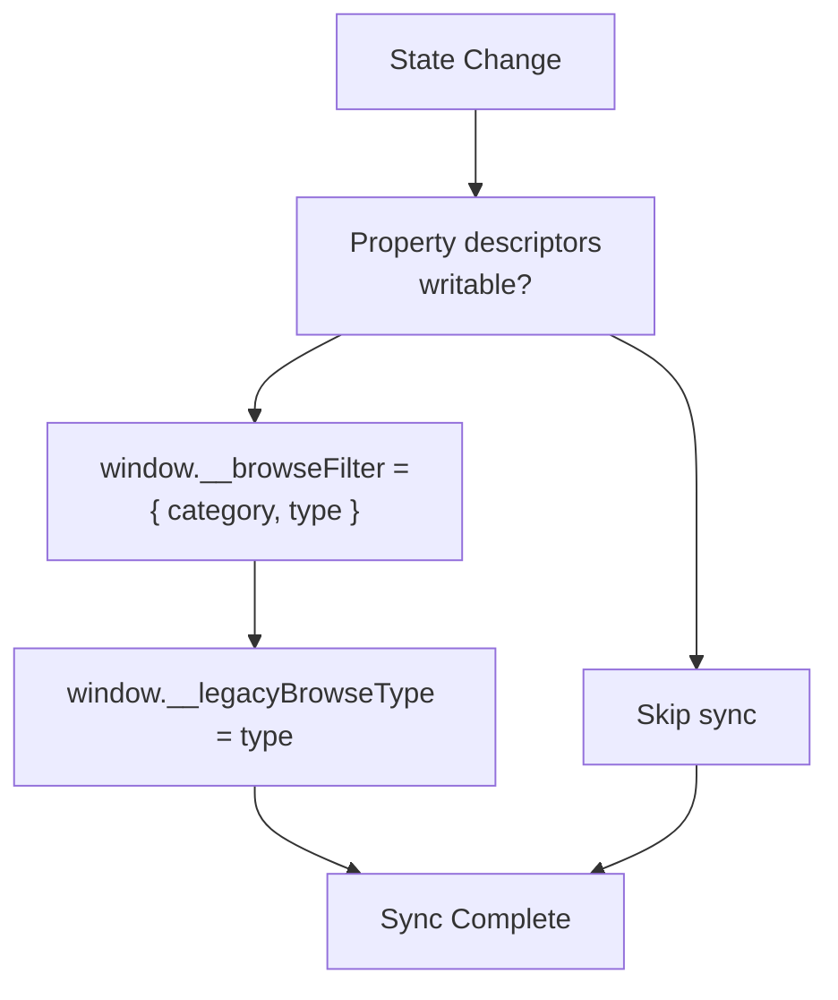
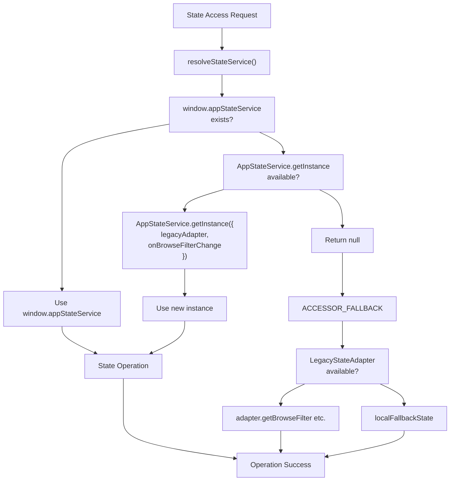
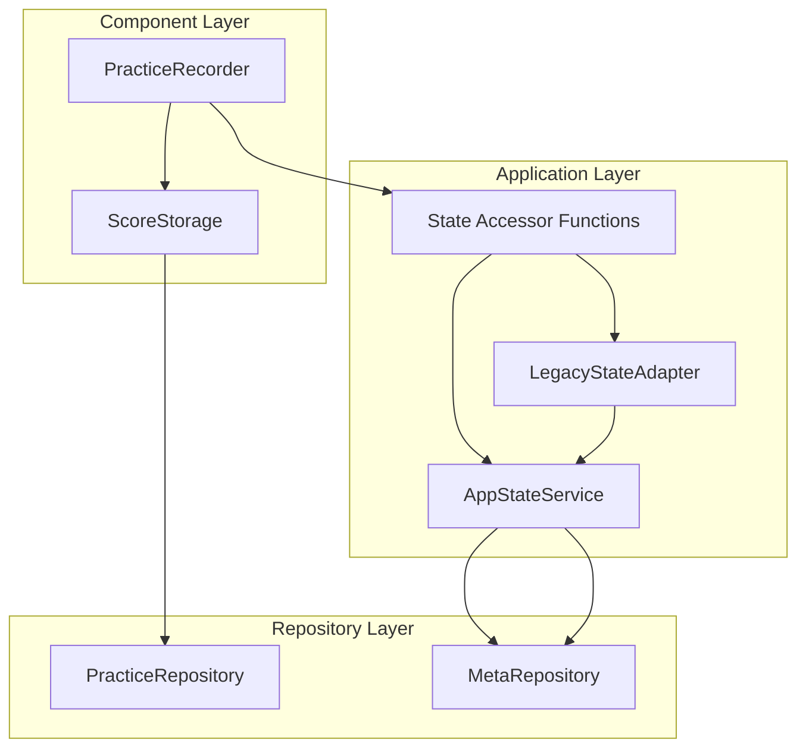

# Legacy Compatibility & State Bridges

> **Relevant source files**
> * [assets/developer wiki/hp-overview-usage-todo.md](https://github.com/sallowayma-git/IELTS-practice/blob/df0c9b8f/assets/developer wiki/hp-overview-usage-todo.md)
> * [css/main.css](https://github.com/sallowayma-git/IELTS-practice/blob/df0c9b8f/css/main.css)
> * [index.html](https://github.com/sallowayma-git/IELTS-practice/blob/df0c9b8f/index.html)
> * [js/app.js](https://github.com/sallowayma-git/IELTS-practice/blob/df0c9b8f/js/app.js)
> * [js/components/DataIntegrityManager.js](https://github.com/sallowayma-git/IELTS-practice/blob/df0c9b8f/js/components/DataIntegrityManager.js)
> * [js/data/index.js](https://github.com/sallowayma-git/IELTS-practice/blob/df0c9b8f/js/data/index.js)
> * [js/main.js](https://github.com/sallowayma-git/IELTS-practice/blob/df0c9b8f/js/main.js)
> * [js/script.js](https://github.com/sallowayma-git/IELTS-practice/blob/df0c9b8f/js/script.js)
> * [js/utils/simpleStorageWrapper.js](https://github.com/sallowayma-git/IELTS-practice/blob/df0c9b8f/js/utils/simpleStorageWrapper.js)
> * [js/views/legacyViewBundle.js](https://github.com/sallowayma-git/IELTS-practice/blob/df0c9b8f/js/views/legacyViewBundle.js)

## Purpose and Scope

This document describes the compatibility layer that enables gradual migration from global variable-based state management to a modern centralized state service architecture. The legacy compatibility system allows new code using `AppStateService` to coexist with older code that directly accesses global variables like `window.examIndex`, `window.practiceRecords`, and `window.__browseFilter`.

For information about the modern state service implementation, see [ExamSystemApp & State Management](/sallowayma-git/IELTS-practice/3.1-examsystemapp-and-state-management). For repository-level data persistence, see [Repository Architecture & Data Layer](/sallowayma-git/IELTS-practice/4.1-repository-architecture-and-data-layer).

---

## Architecture Overview

The legacy compatibility layer consists of three primary components working together to maintain bidirectional synchronization between modern and legacy code paths.

### Compatibility Layer Components



**Sources:** [js/main.js L1-L193](https://github.com/sallowayma-git/IELTS-practice/blob/df0c9b8f/js/main.js#L1-L193)

 [js/app.js L1-L62](https://github.com/sallowayma-git/IELTS-practice/blob/df0c9b8f/js/app.js#L1-L62)

 [js/script.js L1-L148](https://github.com/sallowayma-git/IELTS-practice/blob/df0c9b8f/js/script.js#L1-L148)

---

## LegacyStateAdapter

`LegacyStateAdapter` is a singleton service that bidirectionally synchronizes state between `AppStateService` and global window variables. It acts as the primary bridge for gradual refactoring.

### Adapter Initialization



**Sources:** [js/main.js L4](https://github.com/sallowayma-git/IELTS-practice/blob/df0c9b8f/js/main.js#L4-L4)

 [js/main.js L48-L59](https://github.com/sallowayma-git/IELTS-practice/blob/df0c9b8f/js/main.js#L48-L59)

### Key Responsibilities

| Responsibility | Implementation |
| --- | --- |
| **Global → Modern** | Detects writes to global variables and propagates to `AppStateService` |
| **Modern → Global** | Receives notifications from `AppStateService` and updates globals |
| **Browse Filter Sync** | Maintains `window.__browseFilter` and `window.__legacyBrowseType` consistency |
| **Singleton Pattern** | Ensures only one adapter instance exists per page lifecycle |

The adapter receives callbacks from `AppStateService` via the `onBrowseFilterChange` option:

```yaml
// From js/main.js:52-56
AppStateService.getInstance({
    legacyAdapter: legacyStateAdapter,
    onBrowseFilterChange: syncGlobalBrowseState
});
```

**Sources:** [js/main.js L48-L59](https://github.com/sallowayma-git/IELTS-practice/blob/df0c9b8f/js/main.js#L48-L59)

 [js/main.js L28-L40](https://github.com/sallowayma-git/IELTS-practice/blob/df0c9b8f/js/main.js#L28-L40)

---

## LegacyStateBridge

`LegacyStateBridge` solves the initialization race condition where legacy code modifies global state before `AppStateService` is initialized. It caches early state changes and replays them once the modern state service becomes available.

### Bridge Lifecycle



### Race Condition Scenarios

The bridge handles these timing-sensitive scenarios:

1. **Early Global Writes**: Legacy initialization code sets `window.examIndex` before `AppStateService` loads
2. **Event-Driven Updates**: `examIndexLoaded` event fires before state service initialization completes
3. **Multi-Script Coordination**: Multiple scripts modify state in unpredictable order during bootstrap

**Example Flow:**



**Sources:** [js/main.js L48-L59](https://github.com/sallowayma-git/IELTS-practice/blob/df0c9b8f/js/main.js#L48-L59)

 [index.html L354](https://github.com/sallowayma-git/IELTS-practice/blob/df0c9b8f/index.html#L354-L354)

---

## State Accessor Functions

The state accessor functions in `js/main.js` provide a three-tier fallback hierarchy that attempts modern approaches first, then progressively degrades to legacy mechanisms.

### Accessor Function Pattern

All state accessor functions follow this pattern:



### Exam Index Accessors

| Function | Purpose | Fallback Chain |
| --- | --- | --- |
| `getExamIndexState()` | Read exam index | `stateService.getExamIndex()` → `window.examIndex` → `[]` |
| `setExamIndexState(list)` | Write exam index | `stateService.setExamIndex()` → `window.examIndex = list` |

**Implementation Example:**

```javascript
// From js/main.js:65-79
function getExamIndexState() {
    if (stateService) {
        return stateService.getExamIndex();
    }
    return Array.isArray(window.examIndex) ? window.examIndex : [];
}

function setExamIndexState(list) {
    if (stateService) {
        return stateService.setExamIndex(list);
    }
    const normalized = Array.isArray(list) ? list : [];
    try { window.examIndex = normalized; } catch (_) {}
    return normalized;
}
```

**Sources:** [js/main.js L65-L79](https://github.com/sallowayma-git/IELTS-practice/blob/df0c9b8f/js/main.js#L65-L79)

### Practice Records Accessors

| Function | Purpose | Fallback Chain |
| --- | --- | --- |
| `getPracticeRecordsState()` | Read records | `stateService.getPracticeRecords()` → `window.practiceRecords` → `[]` |
| `setPracticeRecordsState(records)` | Write records | `stateService.setPracticeRecords()` → `window.practiceRecords = records` |

**Sources:** [js/main.js L81-L95](https://github.com/sallowayma-git/IELTS-practice/blob/df0c9b8f/js/main.js#L81-L95)

### Browse Filter Accessors

The browse filter uses a more complex fallback structure due to its nested object nature:

| Function | Purpose | Fallback Chain |
| --- | --- | --- |
| `getBrowseFilterState()` | Read filter | `stateService.getBrowseFilter()` → `window.__browseFilter` → `{category:'all', type:'all'}` |
| `setBrowseFilterState(category, type)` | Write filter | `stateService.setBrowseFilter()` → `syncGlobalBrowseState()` |
| `getCurrentCategory()` | Get category | `getBrowseFilterState().category` |
| `getCurrentExamType()` | Get exam type | `getBrowseFilterState().type` |

**Sources:** [js/main.js L112-L139](https://github.com/sallowayma-git/IELTS-practice/blob/df0c9b8f/js/main.js#L112-L139)

### Bulk Delete Mode Accessors

| Function | Purpose | Fallback Chain |
| --- | --- | --- |
| `getBulkDeleteModeState()` | Read mode | `stateService.getBulkDeleteMode()` → `localFallbackState.bulkDeleteMode` |
| `setBulkDeleteModeState(value)` | Write mode | `stateService.setBulkDeleteMode()` → `localFallbackState.bulkDeleteMode = value` |
| `clearBulkDeleteModeState()` | Reset mode | `setBulkDeleteModeState(false)` |

**Sources:** [js/main.js L141-L158](https://github.com/sallowayma-git/IELTS-practice/blob/df0c9b8f/js/main.js#L141-L158)

### Selected Records Accessors

Selected records use a `Set` for efficient membership testing:

| Function | Purpose | Fallback Chain |
| --- | --- | --- |
| `getSelectedRecordsState()` | Read selections | `stateService.getSelectedRecords()` → `localFallbackState.selectedRecords` |
| `addSelectedRecordState(id)` | Add selection | `stateService.addSelectedRecord()` → `localFallbackState.selectedRecords.add()` |
| `removeSelectedRecordState(id)` | Remove selection | `stateService.removeSelectedRecord()` → `localFallbackState.selectedRecords.delete()` |
| `clearSelectedRecordsState()` | Clear all | `stateService.clearSelectedRecords()` → `localFallbackState.selectedRecords.clear()` |

**Sources:** [js/main.js L160-L193](https://github.com/sallowayma-git/IELTS-practice/blob/df0c9b8f/js/main.js#L160-L193)

---

## Global Variable Synchronization

The `syncGlobalBrowseState()` function maintains consistency between the modern state service and legacy global variables for browse filtering.

### Synchronization Strategy



**Implementation:**

```javascript
// From js/main.js:28-40
function syncGlobalBrowseState(category, type) {
    const browseDescriptor = Object.getOwnPropertyDescriptor(window, '__browseFilter');
    if (!browseDescriptor || typeof browseDescriptor.set !== 'function') {
        try {
            window.__browseFilter = { category, type };
        } catch (_) {}
    }

    const legacyTypeDescriptor = Object.getOwnPropertyDescriptor(window, '__legacyBrowseType');
    if (!legacyTypeDescriptor || typeof legacyTypeDescriptor.set !== 'function') {
        try { window.__legacyBrowseType = type; } catch (_) {}
    }
}
```

### Defensive Property Checks

The synchronization logic uses `Object.getOwnPropertyDescriptor()` to detect if globals have been made read-only by property descriptors. This prevents exceptions when legacy code or libraries have sealed the window object.

| Check | Purpose |
| --- | --- |
| `!browseDescriptor` | Global variable doesn't exist yet |
| `typeof descriptor.set !== 'function'` | No setter defined, safe to write directly |
| `try...catch` wrapper | Catch exceptions from frozen objects |

**Sources:** [js/main.js L28-L40](https://github.com/sallowayma-git/IELTS-practice/blob/df0c9b8f/js/main.js#L28-L40)

---

## Fallback Mechanisms

### localFallbackState Object

When neither `AppStateService` nor global variables are available, the system uses an in-memory fallback object:

```javascript
// From js/main.js:42-46
const localFallbackState = {
    filteredExams: [],
    selectedRecords: new Set(),
    bulkDeleteMode: false
};
```

This serves as the last-resort state container during catastrophic initialization failures.

**Sources:** [js/main.js L42-L46](https://github.com/sallowayma-git/IELTS-practice/blob/df0c9b8f/js/main.js#L42-L46)

### LegacyFallback Bootstrap Runtime

The `js/script.js` file provides a degraded runtime for scenarios where the main application fails to initialize:

```

```

### Fallback Rendering Functions

| Function | Purpose | Implementation |
| --- | --- | --- |
| `showViewFallback(viewName)` | Show view without navigation controller | Add/remove `active` class on `.view` elements |
| `renderExamListFallback(exams)` | Basic exam list rendering | Create simple button elements with click handlers |
| `renderPracticeOverviewFallback(records)` | Update practice stats | Calculate and display totals/averages |

**Implementation Detail:**

```javascript
// From js/script.js:30-40
function showViewFallback(viewName) {
    const views = document.querySelectorAll('.view');
    views.forEach((view) => {
        if (view.id === `${viewName}-view` || view.dataset.view === viewName) {
            view.classList.add('active');
        } else {
            view.classList.remove('active');
        }
    });
}
```

**Sources:** [js/script.js L1-L148](https://github.com/sallowayma-git/IELTS-practice/blob/df0c9b8f/js/script.js#L1-L148)

### Smoke Testing

The `runSmokeCheck()` function generates diagnostic reports saved to `window.__legacySmokeReport`:

```javascript
// From js/script.js:91-105
function runSmokeCheck(mode, service) {
    const result = {
        mode,
        timestamp: new Date().toISOString(),
        hasService: !!service,
        hasMessageCenter: typeof global.getMessageCenter === 'function',
        examCount: service ? service.getExamIndex().length : 
                   (Array.isArray(global.examIndex) ? global.examIndex.length : 0),
        recordCount: service ? service.getPracticeRecords().length : 
                     (Array.isArray(global.practiceRecords) ? global.practiceRecords.length : 0)
    };
    global.__legacySmokeReport = result;
    return result;
}
```

**Smoke Check Modes:**

| Mode | Meaning |
| --- | --- |
| `'no-service'` | State service unavailable, no rendering possible |
| `'primary-runtime'` | Primary runtime functions detected, using modern code |
| `'fallback-runtime'` | Using degraded fallback rendering |
| `'manual'` | Developer-triggered diagnostic |

**Sources:** [js/script.js L91-L105](https://github.com/sallowayma-git/IELTS-practice/blob/df0c9b8f/js/script.js#L91-L105)

---

## State Resolution Flow

The following diagram shows how state is resolved across all compatibility layers:



**Sources:** [js/main.js L48-L59](https://github.com/sallowayma-git/IELTS-practice/blob/df0c9b8f/js/main.js#L48-L59)

---

## Integration with Data Repositories

While the legacy compatibility layer handles in-memory state, it integrates with the repository layer for persistence:



The state service loads initial state from `MetaRepository` and persists changes back asynchronously. The accessor functions provide synchronous access to in-memory state, while repositories handle asynchronous persistence.

**Sources:** [js/main.js L341-L443](https://github.com/sallowayma-git/IELTS-practice/blob/df0c9b8f/js/main.js#L341-L443)

---

## Migration Strategy

### Refactoring Guidelines

To migrate legacy code to use the modern state service:

1. **Replace direct global access:** ``` // Before window.examIndex = newIndex; // After setExamIndexState(newIndex); ```
2. **Use accessor functions consistently:** ```javascript // Before const exams = window.examIndex || []; // After const exams = getExamIndexState(); ```
3. **Inject state service into new components:** ``` // In component constructor constructor(options = {}) {     this.stateService = options.stateService || window.appStateService; } ```
4. **Remove direct window writes in new code:** * New code should never write to `window.examIndex` or `window.practiceRecords` * Use state service methods exclusively * Let `LegacyStateAdapter` handle global synchronization

### Deprecation Phases

| Phase | Action | Status |
| --- | --- | --- |
| **Phase 1** | Add accessor functions, maintain dual-path | ✅ Complete |
| **Phase 2** | Refactor views to use accessors | 🔄 In Progress |
| **Phase 3** | Convert components to inject state service | 📋 Planned |
| **Phase 4** | Remove `LegacyStateAdapter` | 📋 Future |

**Sources:** [js/main.js L1-L193](https://github.com/sallowayma-git/IELTS-practice/blob/df0c9b8f/js/main.js#L1-L193)

 [js/views/legacyViewBundle.js L1-L800](https://github.com/sallowayma-git/IELTS-practice/blob/df0c9b8f/js/views/legacyViewBundle.js#L1-L800)

---

## Error Handling and Resilience

The compatibility layer includes defensive programming techniques to handle edge cases:

### Try-Catch Wrappers

```
// From js/main.js:31-33
try {
    window.__browseFilter = { category, type };
} catch (_) {}
```

All global writes are wrapped in try-catch to prevent exceptions from frozen objects or restrictive Content Security Policies.

### Null-Safe Access

```javascript
// From js/main.js:116-118
const category = typeof window.__browseFilter?.category === 'string' 
    ? window.__browseFilter.category 
    : 'all';
```

Optional chaining and type checks prevent exceptions from undefined globals.

### Normalization

All accessor functions normalize return values to expected types:

```javascript
// From js/main.js:76-78
const normalized = Array.isArray(list) ? list : [];
try { window.examIndex = normalized; } catch (_) {}
return normalized;
```

**Sources:** [js/main.js L28-L193](https://github.com/sallowayma-git/IELTS-practice/blob/df0c9b8f/js/main.js#L28-L193)

---

## Performance Considerations

### Synchronization Overhead

The legacy compatibility layer introduces minimal overhead:

| Operation | Cost | Mitigation |
| --- | --- | --- |
| State read via accessor | 1-2 function calls + type check | Inline optimization by JS engine |
| State write via accessor | 1-2 function calls + try-catch | Negligible on modern browsers |
| Global → Modern sync | Event notification + property write | Batched by event loop |
| Bridge replay | One-time queue iteration | Only during initialization |

### Memory Footprint

* `localFallbackState`: ~100 bytes for empty collections
* `LegacyStateBridge` cache: Grows during initialization, cleared after replay
* `LegacyStateAdapter`: Single instance, ~1KB overhead

**Sources:** [js/main.js L42-L46](https://github.com/sallowayma-git/IELTS-practice/blob/df0c9b8f/js/main.js#L42-L46)

---

## Testing and Validation

### Smoke Check Access

Developers can manually trigger smoke checks in the browser console:

```javascript
// Check current runtime mode
window.LegacyFallback.smoke();

// View last smoke report
console.log(window.__legacySmokeReport);
```

### State Consistency Verification

```javascript
// Verify state service and globals are in sync
const serviceExams = window.appStateService.getExamIndex();
const globalExams = window.examIndex;
console.assert(
    JSON.stringify(serviceExams) === JSON.stringify(globalExams),
    'State divergence detected'
);
```

**Sources:** [js/script.js L139-L147](https://github.com/sallowayma-git/IELTS-practice/blob/df0c9b8f/js/script.js#L139-L147)

---

## Summary

The legacy compatibility layer provides a robust migration path from global variables to a centralized state management architecture through:

* **Three-tier fallback hierarchy**: Modern service → Adapter → In-memory fallback
* **Bidirectional synchronization**: `LegacyStateAdapter` keeps globals and service in sync
* **Race condition handling**: `LegacyStateBridge` caches and replays early state changes
* **Defensive programming**: Try-catch wrappers and type checks prevent failures
* **Gradual refactoring**: Accessor functions allow incremental code modernization

This architecture enables the system to function correctly whether components use modern state service APIs, legacy global variables, or a mix of both approaches.