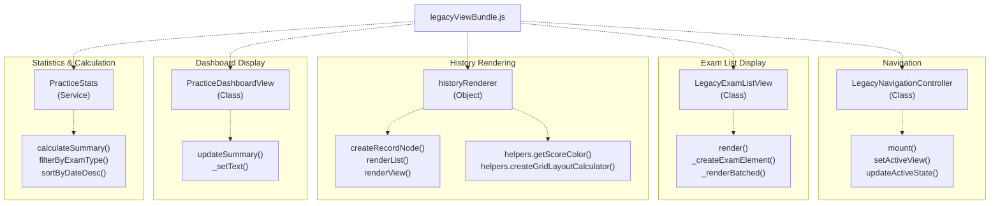
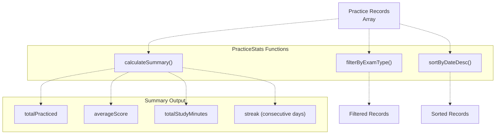
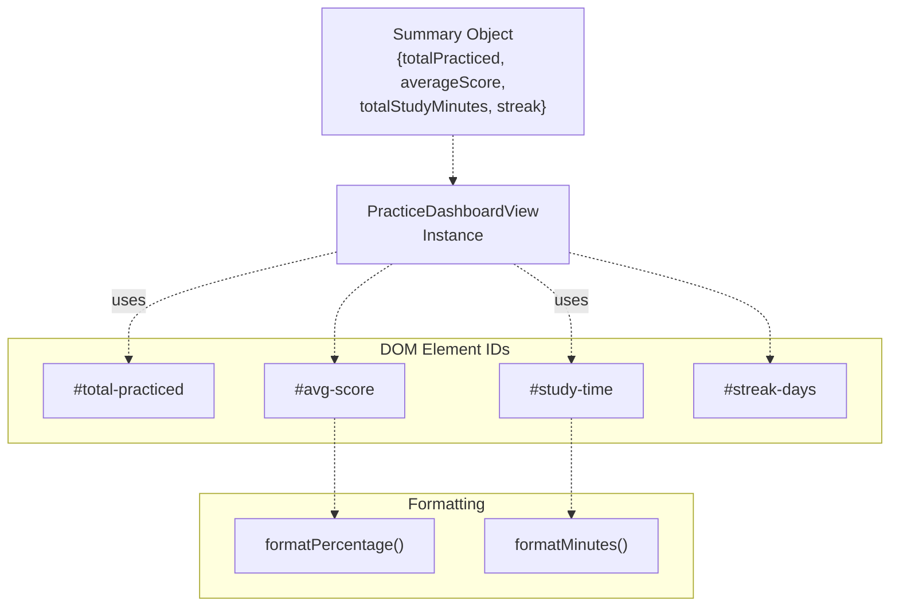
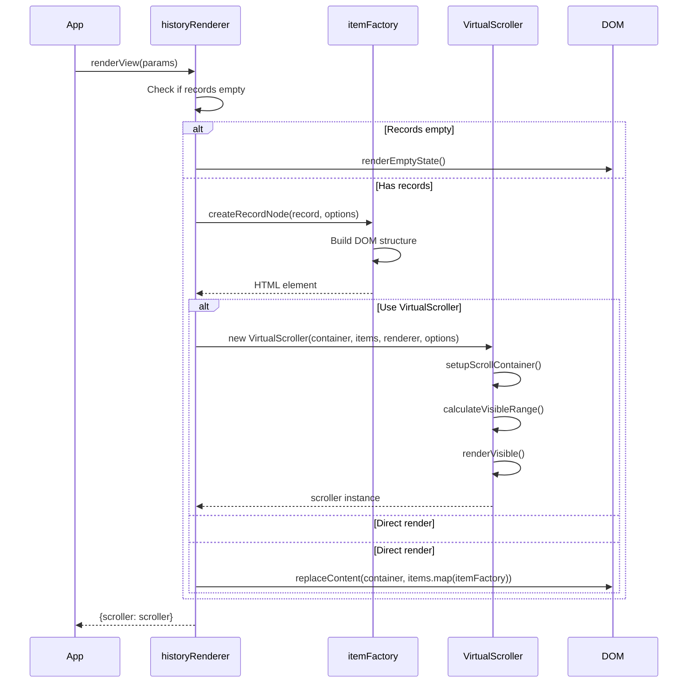
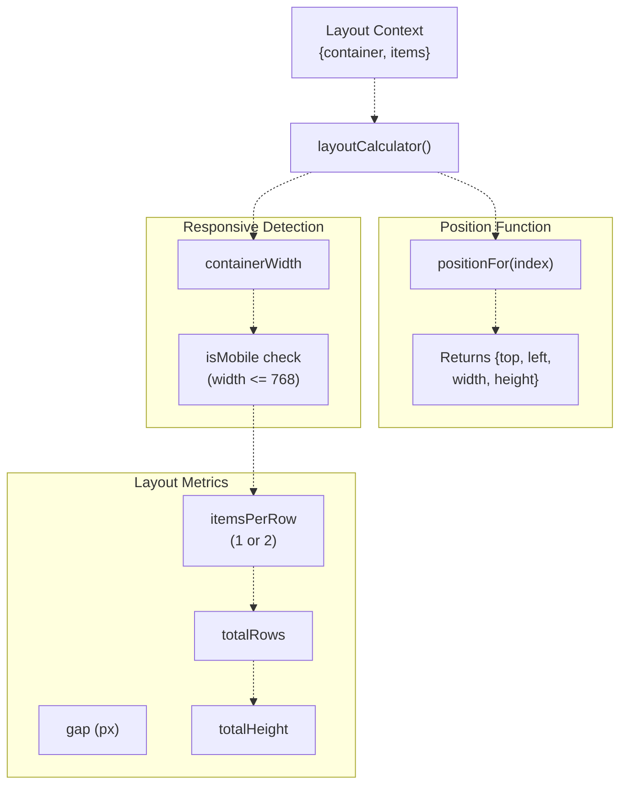
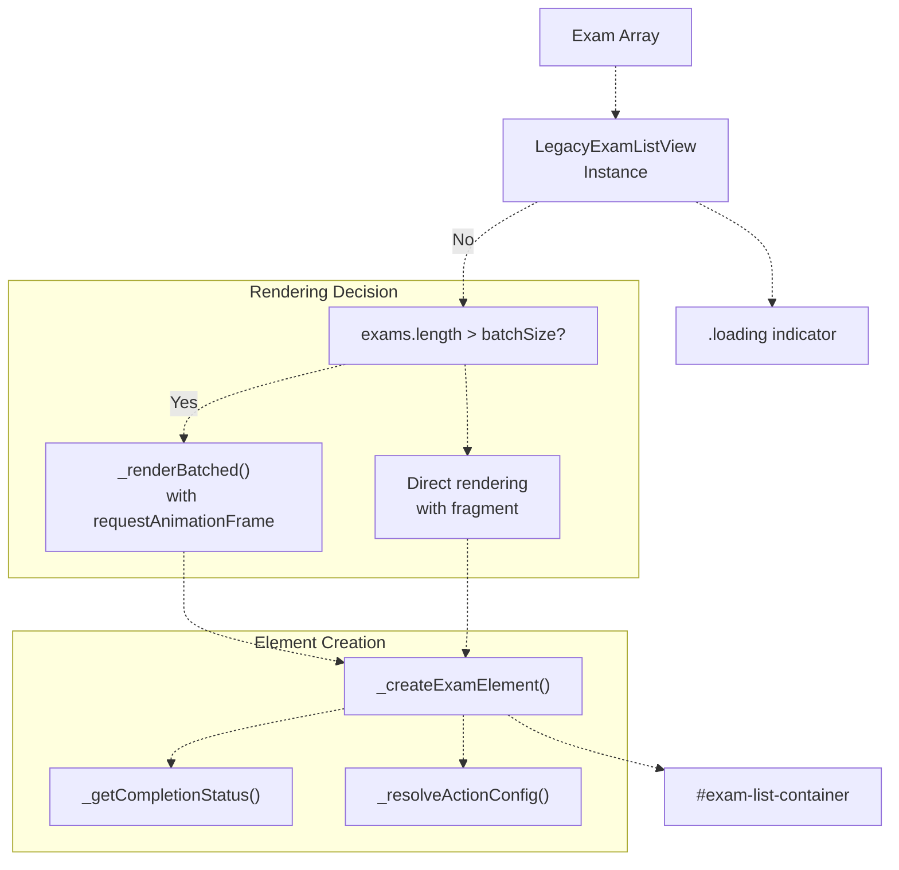
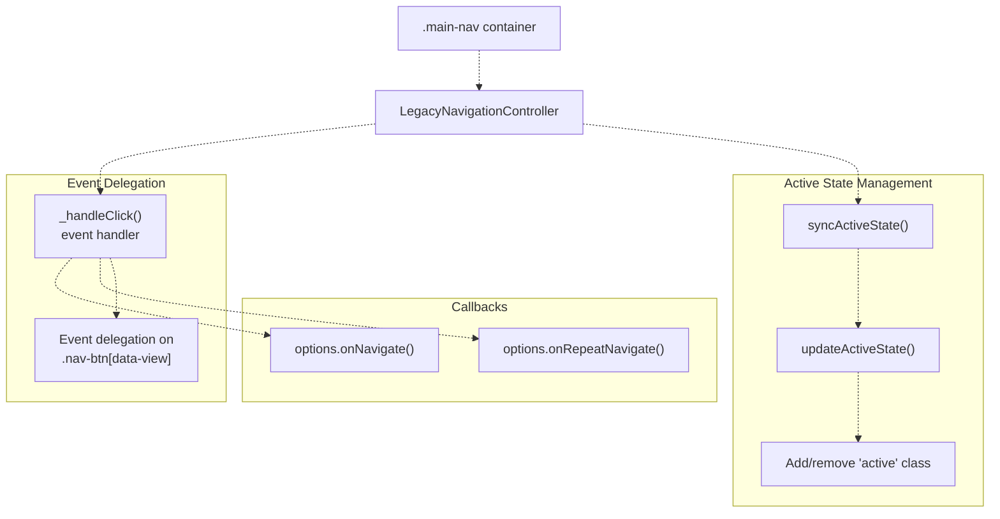
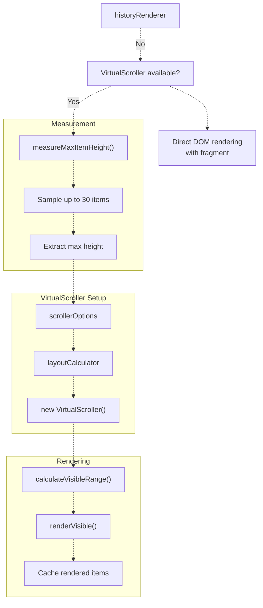
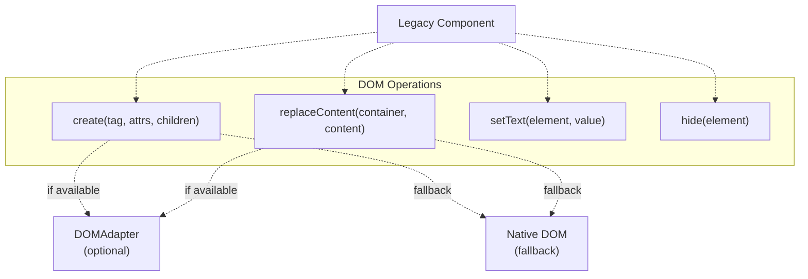
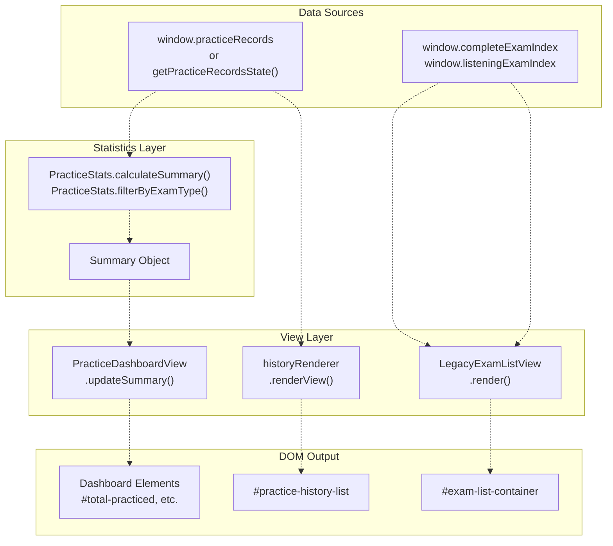

# Legacy View Bundle & Dashboard

> **Relevant source files**
> * [assets/scripts/complete-exam-data.js](https://github.com/sallowayma-git/IELTS-practice/blob/92f64eb8/assets/scripts/complete-exam-data.js)
> * [assets/scripts/listening-exam-data.js](https://github.com/sallowayma-git/IELTS-practice/blob/92f64eb8/assets/scripts/listening-exam-data.js)
> * [js/components/PerformanceOptimizer.js](https://github.com/sallowayma-git/IELTS-practice/blob/92f64eb8/js/components/PerformanceOptimizer.js)
> * [js/views/legacyViewBundle.js](https://github.com/sallowayma-git/IELTS-practice/blob/92f64eb8/js/views/legacyViewBundle.js)

## Purpose and Scope

This document describes the legacy view bundle components located in [js/views/legacyViewBundle.js](https://github.com/sallowayma-git/IELTS-practice/blob/92f64eb8/js/views/legacyViewBundle.js)

 The legacy view bundle provides backward-compatible UI components for displaying practice statistics, exam lists, practice history, and dashboard summaries. These components predate the modern component architecture but remain in use for themes that have not yet migrated to newer alternatives.

For modern UI components and navigation patterns, see [User Interface Components](/sallowayma-git/IELTS-practice/9-user-interface-components). For practice history features with export capabilities, see [Practice History & Record Views](/sallowayma-git/IELTS-practice/9.2-practice-history-and-record-views). For settings and configuration UI, see [Settings Panel & Data Management UI](/sallowayma-git/IELTS-practice/9.4-settings-panel-and-data-management-ui).

**Sources:** [js/views/legacyViewBundle.js L1-L1440](https://github.com/sallowayma-git/IELTS-practice/blob/92f64eb8/js/views/legacyViewBundle.js#L1-L1440)

---

## Architecture Overview

The legacy view bundle consolidates five main components into a single file for efficient loading:



**Sources:** [js/views/legacyViewBundle.js L1-L1440](https://github.com/sallowayma-git/IELTS-practice/blob/92f64eb8/js/views/legacyViewBundle.js#L1-L1440)

---

## PracticeStats Service

The `PracticeStats` service provides pure functions for calculating practice statistics without side effects.

### Core Statistics Functions



### Implementation Details

| Function | Purpose | Key Logic |
| --- | --- | --- |
| `calculateSummary()` | Computes aggregate statistics | Total count, average percentage, duration sum, consecutive day streak |
| `filterByExamType()` | Filters records by exam type | Matches reading/listening via `normalizeTypeValue()` |
| `sortByDateDesc()` | Sorts by date descending | Uses `getRecordTimestamp()` for timestamp extraction |

**Streak Calculation Algorithm:**

The streak calculation in `calculateStreak()` [js/views/legacyViewBundle.js L129-L162](https://github.com/sallowayma-git/IELTS-practice/blob/92f64eb8/js/views/legacyViewBundle.js#L129-L162)

 determines consecutive practice days:

1. Extract unique date keys from records
2. Sort dates in descending order
3. Check if most recent date is today or yesterday
4. Count consecutive days backward from the most recent

**Record Matching:**

The `recordMatchesExam()` function [js/views/legacyViewBundle.js L86-L127](https://github.com/sallowayma-git/IELTS-practice/blob/92f64eb8/js/views/legacyViewBundle.js#L86-L127)

 uses multiple strategies to match records to exams:

* Direct ID comparison (`exam.id === record.examId`)
* Title matching
* Path matching (with normalization and tail comparison)
* Filename matching

**Sources:** [js/views/legacyViewBundle.js L7-L238](https://github.com/sallowayma-git/IELTS-practice/blob/92f64eb8/js/views/legacyViewBundle.js#L7-L238)

---

## PracticeDashboardView

The `PracticeDashboardView` class renders summary statistics to DOM elements.

### Architecture



### Configuration

The constructor accepts an options object to customize element IDs:

```yaml
new PracticeDashboardView({
    domAdapter: domAdapter,      // Optional DOM adapter
    totalId: 'total-practiced',   // Default IDs
    averageId: 'avg-score',
    durationId: 'study-time',
    streakId: 'streak-days'
})
```

### DOM Adapter Integration

The `_setText()` method [js/views/legacyViewBundle.js L260-L273](https://github.com/sallowayma-git/IELTS-practice/blob/92f64eb8/js/views/legacyViewBundle.js#L260-L273)

 supports optional `DOMAdapter` for cross-theme compatibility:

1. If `domAdapter.setText` exists, use it
2. Otherwise, fall back to native `element.textContent`

**Sources:** [js/views/legacyViewBundle.js L240-L288](https://github.com/sallowayma-git/IELTS-practice/blob/92f64eb8/js/views/legacyViewBundle.js#L240-L288)

---

## History Renderer

The `historyRenderer` object provides rendering functions for practice history lists with grid layout and virtual scrolling support.

### Rendering Pipeline



### Grid Layout Calculator

The `createGridLayoutCalculator()` helper [js/views/legacyViewBundle.js L319-L367](https://github.com/sallowayma-git/IELTS-practice/blob/92f64eb8/js/views/legacyViewBundle.js#L319-L367)

 creates a layout calculation function for responsive grid positioning:



**Grid Layout Logic:**

* Desktop (width > 768px): 2 columns with 16px gap
* Mobile (width ≤ 768px): 1 column with 12px gap
* Calculates `calc(50% - 8px)` width for two-column layout

### Record Node Structure

The `createRecordNode()` function [js/views/legacyViewBundle.js L430-L527](https://github.com/sallowayma-git/IELTS-practice/blob/92f64eb8/js/views/legacyViewBundle.js#L430-L527)

 builds the following DOM structure:

```sql
.history-item.history-record-item
├── .record-selection (checkbox container)
│   └── input[type="checkbox"]
├── .record-info
│   ├── a.practice-record-title (links to details)
│   └── .record-meta-line
│       ├── small.record-date
│       └── small.record-duration-value
│           ├── strong "用时"
│           └── strong.duration-time (colored by duration)
├── .record-percentage-container
│   └── .record-percentage (colored by score)
└── .record-actions-container (if not bulk delete mode)
    └── button.delete-record-btn
```

**Color Coding:**

| Element | Function | Color Logic |
| --- | --- | --- |
| Score percentage | `helpers.getScoreColor()` | ≥90: green, ≥75: amber, ≥60: orange, <60: red |
| Duration | `helpers.getDurationColor()` | <20min: green, <23: amber, <26: orange, <30: red, ≥30: dark red |

### Virtual Scrolling Integration

The renderer automatically uses `VirtualScroller` when available and not disabled [js/views/legacyViewBundle.js L593-L620](https://github.com/sallowayma-git/IELTS-practice/blob/92f64eb8/js/views/legacyViewBundle.js#L593-L620)

:

1. Measures maximum item height by sampling up to 30 items
2. Creates grid layout calculator
3. Instantiates `VirtualScroller` with measured metrics
4. Falls back to direct DOM rendering if virtual scrolling is unavailable

**Sources:** [js/views/legacyViewBundle.js L289-L735](https://github.com/sallowayma-git/IELTS-practice/blob/92f64eb8/js/views/legacyViewBundle.js#L289-L735)

---

## LegacyExamListView

The `LegacyExamListView` class renders exam lists with support for large datasets via batched rendering.

### Rendering Flow



### Exam Item Structure

Each exam item [js/views/legacyViewBundle.js L818-L911](https://github.com/sallowayma-git/IELTS-practice/blob/92f64eb8/js/views/legacyViewBundle.js#L818-L911)

 contains:

```
.exam-item [data-exam-id]
├── .exam-info
│   └── div
│       ├── h4 (title with optional completion dot)
│       └── .exam-meta (sequence | category | type | frequency)
└── .exam-actions
    ├── button.btn.exam-item-action-btn [data-action="start"]
    ├── button.btn-secondary [data-action="pdf"] (if hasPdf)
    └── button.btn-info [data-action="generate"] (if !hasHtml)
```

### Completion Status Indicator

The completion dot [js/views/legacyViewBundle.js L962-L977](https://github.com/sallowayma-git/IELTS-practice/blob/92f64eb8/js/views/legacyViewBundle.js#L962-L977)

 shows recent practice performance:

| Class | Score Range | Visual |
| --- | --- | --- |
| `completion-dot--excellent` | ≥ 90% | Green dot |
| `completion-dot--strong` | 75-89% | Amber dot |
| `completion-dot--average` | 60-74% | Orange dot |
| `completion-dot--weak` | < 60% | Red dot |

The status is determined by matching the exam against `practiceRecords` using `recordMatchesExam()` and selecting the most recent record.

### Batched Rendering

For large exam lists, `_renderBatched()` [js/views/legacyViewBundle.js L792-L816](https://github.com/sallowayma-git/IELTS-practice/blob/92f64eb8/js/views/legacyViewBundle.js#L792-L816)

 uses `requestAnimationFrame` to render in chunks:

1. Process `batchSize` items (default 20)
2. Append fragment to container
3. Schedule next batch with `requestAnimationFrame`
4. Prevents UI blocking during rendering

**Sources:** [js/views/legacyViewBundle.js L737-L1195](https://github.com/sallowayma-git/IELTS-practice/blob/92f64eb8/js/views/legacyViewBundle.js#L737-L1195)

---

## LegacyNavigationController

The `LegacyNavigationController` class manages view switching using event delegation.

### Architecture



### Mounting and Event Handling

The controller uses event delegation [js/views/legacyViewBundle.js L1231-L1308](https://github.com/sallowayma-git/IELTS-practice/blob/92f64eb8/js/views/legacyViewBundle.js#L1231-L1308)

:

1. **Mount:** Attaches click listener to container
2. **Click Handler:** * Prevents default behavior * Finds closest `.nav-btn[data-view]` * Extracts `data-view` attribute * Calls `onNavigate` callback * Syncs active state if enabled
3. **Unmount:** Removes listener and clears references

### Active State Synchronization

The `syncActiveState()` method [js/views/legacyViewBundle.js L1310-L1331](https://github.com/sallowayma-git/IELTS-practice/blob/92f64eb8/js/views/legacyViewBundle.js#L1310-L1331)

 updates button states:

```javascript
syncActiveState(viewName) {
    const buttons = this.getNavigationButtons();
    buttons.forEach(btn => {
        if (btn.dataset.view === viewName) {
            btn.classList.add(this.options.activeClass);
            btn.setAttribute('aria-current', 'page');
        } else {
            btn.classList.remove(this.options.activeClass);
            btn.removeAttribute('aria-current');
        }
    });
}
```

### Fallback Navigation Handler

The `_handleFallbackNavigation()` method [js/views/legacyViewBundle.js L1370-L1403](https://github.com/sallowayma-git/IELTS-practice/blob/92f64eb8/js/views/legacyViewBundle.js#L1370-L1403)

 provides navigation when the main `showView` function is unavailable:

1. Checks for global `showView` function
2. Falls back to hiding/showing elements with matching IDs
3. Logs warnings if no navigation mechanism is available

**Sources:** [js/views/legacyViewBundle.js L1196-L1440](https://github.com/sallowayma-git/IELTS-practice/blob/92f64eb8/js/views/legacyViewBundle.js#L1196-L1440)

---

## Performance Optimization Integration

The legacy view bundle integrates with `VirtualScroller` and `PerformanceOptimizer` for efficient rendering.

### Virtual Scrolling Flow



### Integration Points

| Component | Performance Feature | Implementation |
| --- | --- | --- |
| `historyRenderer.renderList()` | Virtual scrolling | Auto-detects `VirtualScroller` availability [js/views/legacyViewBundle.js L593-L620](https://github.com/sallowayma-git/IELTS-practice/blob/92f64eb8/js/views/legacyViewBundle.js#L593-L620) |
| `historyRenderer.measureMaxItemHeight()` | Layout measurement | Samples items in hidden wrapper [js/views/legacyViewBundle.js L552-L591](https://github.com/sallowayma-git/IELTS-practice/blob/92f64eb8/js/views/legacyViewBundle.js#L552-L591) |
| `LegacyExamListView._renderBatched()` | Batched rendering | Uses `requestAnimationFrame` [js/views/legacyViewBundle.js L792-L816](https://github.com/sallowayma-git/IELTS-practice/blob/92f64eb8/js/views/legacyViewBundle.js#L792-L816) |
| `historyRenderer.destroyScroller()` | Cleanup | Calls scroller's `destroy()` method [js/views/legacyViewBundle.js L726-L735](https://github.com/sallowayma-git/IELTS-practice/blob/92f64eb8/js/views/legacyViewBundle.js#L726-L735) |

### Grid Layout with Virtual Scrolling

The grid layout calculator [js/views/legacyViewBundle.js L319-L367](https://github.com/sallowayma-git/IELTS-practice/blob/92f64eb8/js/views/legacyViewBundle.js#L319-L367)

 provides metrics for `VirtualScroller`:

```yaml
{
    itemsPerRow: 1 or 2,
    rowHeight: baseHeight + gap,
    gap: 12 or 16,
    totalRows: Math.ceil(items.length / itemsPerRow),
    totalHeight: totalRows * rowStride - gap,
    positionFor: function(index) {
        // Returns {top, left, width, height}
    }
}
```

The `VirtualScroller` uses `positionFor()` to calculate absolute positioning for each item in the grid.

**Sources:** [js/views/legacyViewBundle.js L593-L620](https://github.com/sallowayma-git/IELTS-practice/blob/92f64eb8/js/views/legacyViewBundle.js#L593-L620)

 [js/components/PerformanceOptimizer.js L1-L312](https://github.com/sallowayma-git/IELTS-practice/blob/92f64eb8/js/components/PerformanceOptimizer.js#L1-L312)

---

## DOM Adapter Pattern

All legacy view components support optional `DOMAdapter` for theme-specific DOM operations.

### Adapter Interface



### Implementation Example

From `historyRenderer.createRecordNode()` [js/views/legacyViewBundle.js L369-L408](https://github.com/sallowayma-git/IELTS-practice/blob/92f64eb8/js/views/legacyViewBundle.js#L369-L408)

:

```javascript
function createNode(tag, attributes, children) {
    if (domAdapter && typeof domAdapter.create === 'function') {
        return domAdapter.create(tag, attributes, children);
    }
    // Fallback to native DOM operations
    var element = document.createElement(tag);
    // ... native implementation
    return element;
}
```

### Supported Operations

| Operation | Purpose | Fallback |
| --- | --- | --- |
| `create()` | Create DOM elements | `document.createElement()` |
| `replaceContent()` | Replace container children | `while (firstChild) removeChild()` |
| `setText()` | Set text content | `element.textContent` |
| `hide()` | Hide element | `element.style.display = 'none'` |
| `fragment()` | Create document fragment | `list.map(itemFactory)` |

**Sources:** [js/views/legacyViewBundle.js L369-L428](https://github.com/sallowayma-git/IELTS-practice/blob/92f64eb8/js/views/legacyViewBundle.js#L369-L428)

 [js/views/legacyViewBundle.js L1094-L1146](https://github.com/sallowayma-git/IELTS-practice/blob/92f64eb8/js/views/legacyViewBundle.js#L1094-L1146)

---

## Data Flow and Dependencies

### Overall Data Flow



### Component Dependencies

| Component | Dependencies | Global State Access |
| --- | --- | --- |
| `PracticeStats` | None (pure functions) | N/A |
| `PracticeDashboardView` | Optional `DOMAdapter` | N/A |
| `historyRenderer` | `VirtualScroller`, `DOMAdapter` | N/A |
| `LegacyExamListView` | `DOMAdapter` | `practiceRecords` (for completion status) |
| `LegacyNavigationController` | None | None |

### State Synchronization

The legacy components read but do not modify global state:

1. **Practice Records:** Accessed via `getPracticeRecordsState()` or `window.practiceRecords`
2. **Exam Index:** Accessed via `window.completeExamIndex`
3. **Completion Status:** Calculated on-demand from records in `_getCompletionStatus()` [js/views/legacyViewBundle.js L1176-L1194](https://github.com/sallowayma-git/IELTS-practice/blob/92f64eb8/js/views/legacyViewBundle.js#L1176-L1194)

**Sources:** [js/views/legacyViewBundle.js L1-L1440](https://github.com/sallowayma-git/IELTS-practice/blob/92f64eb8/js/views/legacyViewBundle.js#L1-L1440)

---

## Usage Examples

### Rendering Dashboard Summary

```javascript
// Calculate statistics
const stats = PracticeStats.calculateSummary(practiceRecords);

// Create dashboard view
const dashboard = new PracticeDashboardView({
    totalId: 'total-practiced',
    averageId: 'avg-score',
    durationId: 'study-time',
    streakId: 'streak-days'
});

// Update display
dashboard.updateSummary(stats);
```

### Rendering Practice History

```javascript
// Get container
const container = document.getElementById('practice-history-list');

// Render with virtual scrolling
const result = historyRenderer.renderView({
    container: container,
    records: sortedRecords,
    bulkDeleteMode: false,
    scrollerOptions: {
        itemHeight: 120,
        containerHeight: 650
    }
});

// Store scroller instance for later updates
this.scroller = result.scroller;
```

### Rendering Exam List

```javascript
// Create view instance
const examListView = new LegacyExamListView({
    containerId: 'exam-list-container',
    batchSize: 20
});

// Render exams
examListView.render(filteredExams, {
    emptyState: {
        title: '未找到匹配的题目',
        description: '请调整筛选条件'
    }
});
```

### Setting Up Navigation

```javascript
// Create controller
const navController = new LegacyNavigationController({
    containerSelector: '.main-nav',
    activeClass: 'active',
    onNavigate: (viewName) => {
        showView(viewName);
    }
});

// Mount to container
navController.mount(document.querySelector('.main-nav'));

// Sync active state
navController.syncActiveState('overview');
```

**Sources:** [js/views/legacyViewBundle.js L240-L288](https://github.com/sallowayma-git/IELTS-practice/blob/92f64eb8/js/views/legacyViewBundle.js#L240-L288)

 [js/views/legacyViewBundle.js L701-L724](https://github.com/sallowayma-git/IELTS-practice/blob/92f64eb8/js/views/legacyViewBundle.js#L701-L724)

 [js/views/legacyViewBundle.js L753-L786](https://github.com/sallowayma-git/IELTS-practice/blob/92f64eb8/js/views/legacyViewBundle.js#L753-L786)

 [js/views/legacyViewBundle.js L1231-L1257](https://github.com/sallowayma-git/IELTS-practice/blob/92f64eb8/js/views/legacyViewBundle.js#L1231-L1257)