# Legacy View Bundle Components

> **Relevant source files**
> * [assets/developer wiki/hp-overview-usage-todo.md](https://github.com/sallowayma-git/IELTS-practice/blob/df0c9b8f/assets/developer wiki/hp-overview-usage-todo.md)
> * [css/main.css](https://github.com/sallowayma-git/IELTS-practice/blob/df0c9b8f/css/main.css)
> * [index.html](https://github.com/sallowayma-git/IELTS-practice/blob/df0c9b8f/index.html)
> * [js/app.js](https://github.com/sallowayma-git/IELTS-practice/blob/df0c9b8f/js/app.js)
> * [js/components/DataIntegrityManager.js](https://github.com/sallowayma-git/IELTS-practice/blob/df0c9b8f/js/components/DataIntegrityManager.js)
> * [js/data/index.js](https://github.com/sallowayma-git/IELTS-practice/blob/df0c9b8f/js/data/index.js)
> * [js/main.js](https://github.com/sallowayma-git/IELTS-practice/blob/df0c9b8f/js/main.js)
> * [js/script.js](https://github.com/sallowayma-git/IELTS-practice/blob/df0c9b8f/js/script.js)
> * [js/utils/simpleStorageWrapper.js](https://github.com/sallowayma-git/IELTS-practice/blob/df0c9b8f/js/utils/simpleStorageWrapper.js)
> * [js/views/legacyViewBundle.js](https://github.com/sallowayma-git/IELTS-practice/blob/df0c9b8f/js/views/legacyViewBundle.js)

## Purpose and Scope

This document describes the legacy view rendering components bundled in `legacyViewBundle.js`, which provide backward-compatible UI rendering for exam lists, practice dashboards, and history displays. These components serve as fallback implementations when modern view components are unavailable and provide a DOM abstraction layer for rendering consistency.

For modern view components and the primary rendering pipeline, see [Practice History & Dashboard Views](/sallowayma-git/IELTS-practice/9.2-practice-history-and-dashboard-views). For the overall navigation and view management system, see [View Management & Navigation](/sallowayma-git/IELTS-practice/3.3-view-management-and-navigation).

---

## Component Architecture

The legacy view bundle consists of four primary components that work together to provide complete UI rendering capabilities:


**Sources:** [js/views/legacyViewBundle.js L1-L1150](https://github.com/sallowayma-git/IELTS-practice/blob/df0c9b8f/js/views/legacyViewBundle.js#L1-L1150)

 [js/main.js L206-L223](https://github.com/sallowayma-git/IELTS-practice/blob/df0c9b8f/js/main.js#L206-L223)

---

## Component Initialization Pattern

The legacy components use a lazy initialization pattern through `ensure*` functions in `js/main.js`:


**Sources:** [js/main.js L206-L223](https://github.com/sallowayma-git/IELTS-practice/blob/df0c9b8f/js/main.js#L206-L223)

 [js/views/legacyViewBundle.js L116-L148](https://github.com/sallowayma-git/IELTS-practice/blob/df0c9b8f/js/views/legacyViewBundle.js#L116-L148)

 [js/views/legacyViewBundle.js L393-L402](https://github.com/sallowayma-git/IELTS-practice/blob/df0c9b8f/js/views/legacyViewBundle.js#L393-L402)

---

## PracticeStats Service

The `PracticeStats` service provides statistical calculations for practice records without direct DOM manipulation:

### Core Functions

| Function | Purpose | Input | Output |
| --- | --- | --- | --- |
| `calculateSummary()` | Aggregates practice statistics | `records: Array` | `{totalPracticed, averageScore, totalStudyMinutes, streak}` |
| `sortByDateDesc()` | Sorts records by date | `records: Array` | Sorted array (newest first) |
| `filterByExamType()` | Filters by exam type | `records, exams, type` | Filtered array |

### Streak Calculation Algorithm


**Implementation Details:**

* Date normalization: Extracts `YYYY-MM-DD` from ISO timestamps using `toDateKey()`
* Deduplication: Uses `Set` to track unique practice dates
* Streak logic: Must have practiced today or yesterday to maintain streak
* Consecutive days only: Breaks on any gap > 1 day

**Sources:** [js/views/legacyViewBundle.js L6-L113](https://github.com/sallowayma-git/IELTS-practice/blob/df0c9b8f/js/views/legacyViewBundle.js#L6-L113)

---

## PracticeDashboardView Component

Updates the practice statistics dashboard display by setting text content on specific DOM elements:

### Element ID Mapping


### Constructor Options

| Option | Type | Default | Description |
| --- | --- | --- | --- |
| `domAdapter` | Object | `window.DOMAdapter` | DOM abstraction layer |
| `totalId` | String | `'total-practiced'` | Element ID for total count |
| `averageId` | String | `'avg-score'` | Element ID for average score |
| `durationId` | String | `'study-time'` | Element ID for study time |
| `streakId` | String | `'streak-days'` | Element ID for streak count |

### Formatting Functions

* **`formatPercentage(value)`**: Converts to `"X.X%"` format with 1 decimal place
* **`formatMinutes(minutes)`**: Rounds to nearest integer, returns as string

**Sources:** [js/views/legacyViewBundle.js L116-L162](https://github.com/sallowayma-git/IELTS-practice/blob/df0c9b8f/js/views/legacyViewBundle.js#L116-L162)

 [index.html L66-L82](https://github.com/sallowayma-git/IELTS-practice/blob/df0c9b8f/index.html#L66-L82)

---

## PracticeHistoryRenderer Component

The most complex component in the bundle, responsible for rendering practice record lists with optional virtual scrolling:

### Core Functions


### Score Color Mapping

| Score Range | Color | Visual Indicator |
| --- | --- | --- |
| >= 90% | `#10b981` (Green) | Excellent |
| 75-89% | `#f59e0b` (Amber) | Good |
| 60-74% | `#f97316` (Orange) | Average |
| < 60% | `#ef4444` (Red) | Needs Improvement |

### Duration Color Mapping

| Duration (minutes) | Color | Performance Indicator |
| --- | --- | --- |
| < 20 min | `#10b981` (Green) | Very Fast |
| 20-23 min | `#f59e0b` (Amber) | Fast |
| 23-26 min | `#f97316` (Orange) | Average |
| 26-30 min | `#ef4444` (Red) | Slow |
| >= 30 min | `#dc2626` (Dark Red) | Very Slow |

### Record Node Structure


### Bulk Delete Mode Behavior

When `options.bulkDeleteMode` is `true`:

* **Selection checkbox** becomes visible
* **Item** gains class `history-item-selectable`
* **Selected items** gain class `history-item-selected`
* **Delete button** is hidden (bulk actions handled separately)
* **Checkbox** has `tabindex="0"` for keyboard accessibility

**Sources:** [js/views/legacyViewBundle.js L164-L386](https://github.com/sallowayma-git/IELTS-practice/blob/df0c9b8f/js/views/legacyViewBundle.js#L164-L386)

---

## LegacyExamListView Component

Renders filterable exam lists with batched rendering for performance:

### Constructor Configuration

```css
new LegacyExamListView({
    containerId: 'exam-list-container',       // Target container
    loadingSelector: '#browse-view .loading', // Loading indicator
    batchSize: 20,                            // Items per batch
    domAdapter: window.DOMAdapter,            // DOM abstraction
    supportsGenerate: true                    // Show "Generate HTML" buttons
})
```

### Rendering Pipeline

```mermaid
sequenceDiagram
  participant Application Code
  participant LegacyExamListView
  participant DOM Container
  participant Loading Indicator

  Application Code->>LegacyExamListView: render(exams, options)
  LegacyExamListView->>DOM Container: Get container element
  LegacyExamListView->>Loading Indicator: Get loading indicator
  loop [For each batch]
    LegacyExamListView->>LegacyExamListView: _renderEmptyState()
    LegacyExamListView->>DOM Container: Render empty state UI
    LegacyExamListView->>Loading Indicator: Hide loading indicator
    LegacyExamListView->>LegacyExamListView: _renderBatched()
    LegacyExamListView->>LegacyExamListView: _createExamElement() × batchSize
    LegacyExamListView->>DOM Container: Append fragment
    LegacyExamListView->>LegacyExamListView: requestAnimationFrame(next batch)
    LegacyExamListView->>Loading Indicator: Hide loading indicator
    LegacyExamListView->>LegacyExamListView: _createExamElement() for all
    LegacyExamListView->>DOM Container: Append all at once
    LegacyExamListView->>Loading Indicator: Hide loading indicator
  end
```



### Exam Item Structure

Each exam is rendered as a card with completion status indicator:

```mermaid
flowchart TD

EXAM_ITEM["div.exam-item<br>data-exam-id"]
INFO["div.exam-info"]
INFO_CONTENT["div"]
TITLE["h4"]
DOT["span.completion-dot<br>(if practiced)"]
TITLE_TEXT["Exam Title Text"]
META["div.exam-meta<br>Category | Type"]
ACTIONS["div.exam-actions"]
START_BTN["button.btn<br>data-action='start'<br>开始练习"]
PDF_BTN["button.btn-secondary<br>data-action='pdf'<br>查看PDF"]
GEN_BTN["button.btn-info<br>data-action='generate'<br>生成HTML<br>(conditional)"]

EXAM_ITEM --> INFO
EXAM_ITEM --> ACTIONS
INFO --> INFO_CONTENT
INFO_CONTENT --> TITLE
INFO_CONTENT --> META
TITLE --> DOT
TITLE --> TITLE_TEXT
ACTIONS --> START_BTN
ACTIONS --> PDF_BTN
ACTIONS --> GEN_BTN
```



### Completion Status Calculation

The view determines completion status by looking up practice records:

1. **Check for records**: Searches `window.practiceRecords` for matching `examId` or `title`
2. **Find most recent**: Sorts by date descending, takes first match
3. **Apply to UI**: Adds colored dot with class based on percentage
4. **Tooltip**: Shows "最近正确率 X%"

### Empty State Configuration

The `_renderEmptyState()` method accepts customizable options:

```yaml
{
    icon: '🔍',                          // Display icon
    title: '未找到匹配的题目',            // Main message
    description: '请调整筛选条件...',     // Hint text
    actions: [                           // Action buttons
        {
            action: 'load-library',
            label: '📂 加载题库',
            variant: 'primary',
            ariaLabel: '加载题库'
        }
    ],
    disableDefaultActions: false         // Override defaults
}
```

**Sources:** [js/views/legacyViewBundle.js L388-L796](https://github.com/sallowayma-git/IELTS-practice/blob/df0c9b8f/js/views/legacyViewBundle.js#L388-L796)

---

## DOM Abstraction Layer

All legacy view components support both `DOMAdapter` and native DOM APIs:

### Abstraction Pattern


### Supported DOMAdapter Methods

| Method | Purpose | Fallback |
| --- | --- | --- |
| `create(tag, attrs, children)` | Create element with attributes | `document.createElement()` |
| `setText(element, text)` | Set text content | `element.textContent = text` |
| `replaceContent(container, content)` | Replace container contents | Manual `removeChild()` + `appendChild()` |
| `fragment(items, factory)` | Create document fragment from items | Manual fragment creation |

### Attribute Handling

The `createNode()` helper function handles multiple attribute formats:

* **`className`**: Applied to `element.className`
* **`dataset`**: Iterates and sets `element.dataset[key] = value`
* **`style`**: Uses `Object.assign(element.style, value)`
* **Boolean attributes**: Set to empty string if `true`
* **Other attributes**: Applied via `setAttribute()`

**Sources:** [js/views/legacyViewBundle.js L194-L253](https://github.com/sallowayma-git/IELTS-practice/blob/df0c9b8f/js/views/legacyViewBundle.js#L194-L253)

---

## Performance Optimizations

### Batched Rendering

`LegacyExamListView` uses `requestAnimationFrame` for large lists:

```javascript
function _renderBatched(exams, listElement, options) {
    var index = 0;
    var batchSize = this.batchSize; // Default: 20
    
    function processBatch() {
        var endIndex = Math.min(index + batchSize, exams.length);
        var fragment = document.createDocumentFragment();
        
        for (var i = index; i < endIndex; i++) {
            var element = this._createExamElement(exams[i], i, options);
            if (element) fragment.appendChild(element);
        }
        
        listElement.appendChild(fragment);
        index = endIndex;
        
        if (index < exams.length) {
            requestAnimationFrame(processBatch);
        }
    }
    
    requestAnimationFrame(processBatch);
}
```

**Benefits:**

* Non-blocking UI: Browser remains responsive during rendering
* Progressive loading: Users see content appear incrementally
* Memory efficient: Creates fragments in chunks

### Virtual Scrolling Integration

`PracticeHistoryRenderer.renderList()` automatically uses `VirtualScroller` when available:

```javascript
if (global.VirtualScroller && options.scrollerOptions !== false) {
    var scrollerOpts = Object.assign(
        { itemHeight: 100, containerHeight: 650 }, 
        options.scrollerOptions || {}
    );
    replaceContent(container, []);
    return new global.VirtualScroller(
        container, 
        list, 
        itemFactory, 
        scrollerOpts
    );
}
```

**Configuration:**

* **`itemHeight`**: Fixed height per record (default: 100px)
* **`containerHeight`**: Viewport height (default: 650px)
* **`itemFactory`**: Function to create each record node

**Sources:** [js/views/legacyViewBundle.js L443-L467](https://github.com/sallowayma-git/IELTS-practice/blob/df0c9b8f/js/views/legacyViewBundle.js#L443-L467)

 [js/views/legacyViewBundle.js L348-L375](https://github.com/sallowayma-git/IELTS-practice/blob/df0c9b8f/js/views/legacyViewBundle.js#L348-L375)

---

## Usage Examples

### Example 1: Update Practice Dashboard

```javascript
// Calculate statistics
const summary = PracticeStats.calculateSummary(practiceRecords);

// Get or create dashboard view
const dashboardView = ensurePracticeDashboardView();

// Update display
dashboardView.updateSummary(summary);
```

**Sources:** [js/main.js L216-L223](https://github.com/sallowayma-git/IELTS-practice/blob/df0c9b8f/js/main.js#L216-L223)

 [js/views/legacyViewBundle.js L127-L133](https://github.com/sallowayma-git/IELTS-practice/blob/df0c9b8f/js/views/legacyViewBundle.js#L127-L133)

### Example 2: Render Exam List

```javascript
// Get or create exam list view
const examListView = ensureExamListView();

// Render with options
examListView.render(filteredExams, {
    emptyState: {
        title: '未找到题目',
        icon: '🔍'
    },
    configureStartButton: (exam, config) => {
        if (!exam.hasHtml) {
            return { startLabel: '查看PDF', startClass: 'btn btn-secondary' };
        }
        return config;
    }
});
```

**Sources:** [js/main.js L206-L214](https://github.com/sallowayma-git/IELTS-practice/blob/df0c9b8f/js/main.js#L206-L214)

 [js/views/legacyViewBundle.js L404-L437](https://github.com/sallowayma-git/IELTS-practice/blob/df0c9b8f/js/views/legacyViewBundle.js#L404-L437)

### Example 3: Render Practice History

```javascript
// Get container
const container = document.getElementById('history-list');

// Sort records
const sortedRecords = PracticeStats.sortByDateDesc(practiceRecords);

// Render with virtual scrolling
const scroller = window.PracticeHistoryRenderer.renderList(
    container, 
    sortedRecords, 
    {
        bulkDeleteMode: false,
        selectedRecords: new Set(),
        scrollerOptions: {
            itemHeight: 100,
            containerHeight: 650
        }
    }
);

// Store scroller reference for cleanup
window.currentVirtualScroller = scroller;
```

**Sources:** [js/views/legacyViewBundle.js L348-L375](https://github.com/sallowayma-git/IELTS-practice/blob/df0c9b8f/js/views/legacyViewBundle.js#L348-L375)

---

## Integration with Main Application

The legacy view bundle is tightly integrated with `js/main.js`:

### Initialization Flow


### View Update Functions

| Function | Purpose | Components Used |
| --- | --- | --- |
| `updateOverview()` | Renders category overview | `OverviewView` (preferred) or legacy fallback |
| `updatePracticeView()` | Updates practice statistics and history | `PracticeDashboardView`, `PracticeHistoryRenderer` |
| `loadExamList()` | Renders exam list in browse view | `LegacyExamListView` |

**Sources:** [js/main.js L255-L323](https://github.com/sallowayma-git/IELTS-practice/blob/df0c9b8f/js/main.js#L255-L323)

 [js/main.js L632-L687](https://github.com/sallowayma-git/IELTS-practice/blob/df0c9b8f/js/main.js#L632-L687)

---

## LibraryConfigView Component

Also included in the bundle is `LibraryConfigView`, which manages exam library configuration switching:

### Features

* **List configurations**: Displays available exam index configurations
* **Switch active**: Changes the active library configuration
* **Delete configurations**: Removes unused configurations
* **Create new**: Allows importing new exam libraries

### DOM Structure

```mermaid
flowchart TD

PANEL["div.library-config-panel"]
HEADER["div.library-config-header"]
TITLE["h3: 题库配置管理"]
CLOSE["button.close-btn"]
LIST["div.library-config-list"]
ITEMS["div.library-config-item × N"]
ITEM_INFO["div.library-config-item-info"]
ITEM_NAME["div.library-config-item-name"]
ITEM_META["div.library-config-item-meta"]
ITEM_ACTIONS["div.library-config-item-actions"]
SWITCH_BTN["button: 切换"]
DELETE_BTN["button: 删除"]
FOOTER["div.library-config-footer"]
CREATE_BTN["button: 新建配置"]

PANEL --> HEADER
PANEL --> LIST
PANEL --> FOOTER
HEADER --> TITLE
HEADER --> CLOSE
LIST --> ITEMS
ITEMS --> ITEM_INFO
ITEMS --> ITEM_ACTIONS
ITEM_INFO --> ITEM_NAME
ITEM_INFO --> ITEM_META
ITEM_ACTIONS --> SWITCH_BTN
ITEM_ACTIONS --> DELETE_BTN
FOOTER --> CREATE_BTN
```



**Sources:** [js/views/legacyViewBundle.js L798-L1150](https://github.com/sallowayma-git/IELTS-practice/blob/df0c9b8f/js/views/legacyViewBundle.js#L798-L1150)

---

## Namespace and Global Exposure

All components are exposed on the global `window` object:

```
window.PracticeStats = PracticeStats;
window.PracticeDashboardView = PracticeDashboardView;
window.PracticeHistoryRenderer = historyRenderer;
window.LegacyExamListView = LegacyExamListView;
window.LibraryConfigView = LibraryConfigView;
```

This allows components to be accessed from:

* Other scripts loaded after the bundle
* Browser console for debugging
* Theme portal scripts (e.g., HP theme)
* Legacy code that hasn't migrated to module imports

**Sources:** [js/views/legacyViewBundle.js L1-L1150](https://github.com/sallowayma-git/IELTS-practice/blob/df0c9b8f/js/views/legacyViewBundle.js#L1-L1150)