# Library Management & Configuration System

> **Relevant source files**
> * [css/heroui-bridge.css](https://github.com/sallowayma-git/IELTS-practice/blob/92f64eb8/css/heroui-bridge.css)
> * [css/main.css](https://github.com/sallowayma-git/IELTS-practice/blob/92f64eb8/css/main.css)
> * [index.html](https://github.com/sallowayma-git/IELTS-practice/blob/92f64eb8/index.html)
> * [js/app.js](https://github.com/sallowayma-git/IELTS-practice/blob/92f64eb8/js/app.js)
> * [js/boot-fallbacks.js](https://github.com/sallowayma-git/IELTS-practice/blob/92f64eb8/js/boot-fallbacks.js)
> * [js/main.js](https://github.com/sallowayma-git/IELTS-practice/blob/92f64eb8/js/main.js)

## Purpose and Scope

This document describes the **Library Management & Configuration System**, which enables users to maintain and switch between multiple exam library configurations. Each configuration represents a distinct collection of exams (reading and/or listening) with associated metadata and path mappings. The system supports dynamic library loading through folder uploads, with both full reload and incremental update modes.

For exam index data structure and metadata fields, see [Exam Index & Metadata Structure](/sallowayma-git/IELTS-practice/6.1-exam-index-and-metadata-structure). For path resolution strategies and resource probing, see [Path Resolution & Resource Management](/sallowayma-git/IELTS-practice/6.3-path-resolution-and-resource-management).

---

## System Overview

The Library Management system provides multi-configuration support for the exam database, allowing users to:

* Maintain multiple independent exam library configurations
* Switch between configurations without data loss
* Load new exams via folder upload (reading/listening separately)
* Apply full reload (replace) or incremental update (append) modes
* Persist path mappings for resource resolution

Each configuration consists of:

* **Metadata**: Name, key, exam count, timestamp
* **Exam Index**: Array of exam entries (reading/listening)
* **Path Map**: Optional resource path mappings for resolution optimization
* **Active Flag**: Indicator of currently active configuration

**Sources:** [js/main.js L120-L140](https://github.com/sallowayma-git/IELTS-practice/blob/92f64eb8/js/main.js#L120-L140)

 [js/boot-fallbacks.js L732-L770](https://github.com/sallowayma-git/IELTS-practice/blob/92f64eb8/js/boot-fallbacks.js#L732-L770)

---

## Library Configuration Data Model

The system stores library configurations in a registry structure, with an active configuration pointer and per-configuration data storage.

```css
#mermaid-5c0vd4ow9p9{font-family:ui-sans-serif,-apple-system,system-ui,Segoe UI,Helvetica;font-size:16px;fill:#333;}@keyframes edge-animation-frame{from{stroke-dashoffset:0;}}@keyframes dash{to{stroke-dashoffset:0;}}#mermaid-5c0vd4ow9p9 .edge-animation-slow{stroke-dasharray:9,5!important;stroke-dashoffset:900;animation:dash 50s linear infinite;stroke-linecap:round;}#mermaid-5c0vd4ow9p9 .edge-animation-fast{stroke-dasharray:9,5!important;stroke-dashoffset:900;animation:dash 20s linear infinite;stroke-linecap:round;}#mermaid-5c0vd4ow9p9 .error-icon{fill:#dddddd;}#mermaid-5c0vd4ow9p9 .error-text{fill:#222222;stroke:#222222;}#mermaid-5c0vd4ow9p9 .edge-thickness-normal{stroke-width:1px;}#mermaid-5c0vd4ow9p9 .edge-thickness-thick{stroke-width:3.5px;}#mermaid-5c0vd4ow9p9 .edge-pattern-solid{stroke-dasharray:0;}#mermaid-5c0vd4ow9p9 .edge-thickness-invisible{stroke-width:0;fill:none;}#mermaid-5c0vd4ow9p9 .edge-pattern-dashed{stroke-dasharray:3;}#mermaid-5c0vd4ow9p9 .edge-pattern-dotted{stroke-dasharray:2;}#mermaid-5c0vd4ow9p9 .marker{fill:#999;stroke:#999;}#mermaid-5c0vd4ow9p9 .marker.cross{stroke:#999;}#mermaid-5c0vd4ow9p9 svg{font-family:ui-sans-serif,-apple-system,system-ui,Segoe UI,Helvetica;font-size:16px;}#mermaid-5c0vd4ow9p9 p{margin:0;}#mermaid-5c0vd4ow9p9 .entityBox{fill:#ffffff;stroke:#dddddd;}#mermaid-5c0vd4ow9p9 .relationshipLabelBox{fill:#dddddd;opacity:0.7;background-color:#dddddd;}#mermaid-5c0vd4ow9p9 .relationshipLabelBox rect{opacity:0.5;}#mermaid-5c0vd4ow9p9 .labelBkg{background-color:rgba(221, 221, 221, 0.5);}#mermaid-5c0vd4ow9p9 .edgeLabel .label{fill:#dddddd;font-size:14px;}#mermaid-5c0vd4ow9p9 .label{font-family:ui-sans-serif,-apple-system,system-ui,Segoe UI,Helvetica;color:#333;}#mermaid-5c0vd4ow9p9 .edge-pattern-dashed{stroke-dasharray:8,8;}#mermaid-5c0vd4ow9p9 .node rect,#mermaid-5c0vd4ow9p9 .node circle,#mermaid-5c0vd4ow9p9 .node ellipse,#mermaid-5c0vd4ow9p9 .node polygon{fill:#ffffff;stroke:#dddddd;stroke-width:1px;}#mermaid-5c0vd4ow9p9 .relationshipLine{stroke:#999;stroke-width:1;fill:none;}#mermaid-5c0vd4ow9p9 .marker{fill:none!important;stroke:#999!important;stroke-width:1;}#mermaid-5c0vd4ow9p9 :root{--mermaid-font-family:"trebuchet ms",verdana,arial,sans-serif;}containsstored atmay havepoints toCONFIGURATION_REGISTRYstringstorage_keyexam_index_configurationsarrayconfigurationsArray of LibraryConfigLIBRARY_CONFIGstringnameDisplay namestringkeyStorage keynumberexamCountTotal examsnumbertimestampCreation timeEXAM_INDEXstringstorage_keySame as config keyarrayexamsExam entriesPATH_MAPstringstorage_keyconfig_key + _pathmapobjectmappingsPath resolution cacheACTIVE_POINTERstringstorage_keyactive_exam_index_keystringvalueCurrent config key
```

### Configuration Registry Structure

Stored at `exam_index_configurations`, the registry is an array of configuration objects:

```yaml
[
  {
    name: "默认题库",
    key: "exam_index",
    examCount: 389,
    timestamp: 1702471392000
  },
  {
    name: "P3-P4 Listening Practice",
    key: "exam_index_1702500000000",
    examCount: 87,
    timestamp: 1702500000000
  }
]
```

**Default Configuration**: The `exam_index` key represents the default/initial library loaded from hardcoded exam data (`completeExamIndex`, `listeningExamIndex`).

**Sources:** [js/boot-fallbacks.js L732-L770](https://github.com/sallowayma-git/IELTS-practice/blob/92f64eb8/js/boot-fallbacks.js#L732-L770)

 [js/boot-fallbacks.js L1140-L1159](https://github.com/sallowayma-git/IELTS-practice/blob/92f64eb8/js/boot-fallbacks.js#L1140-L1159)

---

## Core Functions and Entry Points

The library management system provides global functions for configuration operations, backed by the `LibraryManager` class or fallback implementations.


### Function Reference

| Function | Location | Purpose |
| --- | --- | --- |
| `getLibraryManager()` | [js/main.js L120-L126](https://github.com/sallowayma-git/IELTS-practice/blob/92f64eb8/js/main.js#L120-L126) | Retrieve LibraryManager singleton |
| `ensureLibraryManagerReady()` | [js/main.js L129-L140](https://github.com/sallowayma-git/IELTS-practice/blob/92f64eb8/js/main.js#L129-L140) | Load browse-view group and get manager |
| `switchLibraryConfig(key)` | [js/main.js L193-L200](https://github.com/sallowayma-git/IELTS-practice/blob/92f64eb8/js/main.js#L193-L200) | Switch active configuration |
| `loadLibrary(keyOrForceReload)` | [js/main.js L203-L205](https://github.com/sallowayma-git/IELTS-practice/blob/92f64eb8/js/main.js#L203-L205) | Load library (delegates to internal) |
| `showLibraryConfigListV2()` | [js/boot-fallbacks.js L774-L900](https://github.com/sallowayma-git/IELTS-practice/blob/92f64eb8/js/boot-fallbacks.js#L774-L900) | Display configuration list UI |
| `showLibraryLoaderModal()` | [js/boot-fallbacks.js L903-L1106](https://github.com/sallowayma-git/IELTS-practice/blob/92f64eb8/js/boot-fallbacks.js#L903-L1106) | Display library upload modal |
| `handleLibraryUpload(options, files)` | [js/boot-fallbacks.js L1108-L1577](https://github.com/sallowayma-git/IELTS-practice/blob/92f64eb8/js/boot-fallbacks.js#L1108-L1577) | Process folder upload |

**Sources:** [js/main.js L120-L205](https://github.com/sallowayma-git/IELTS-practice/blob/92f64eb8/js/main.js#L120-L205)

 [js/boot-fallbacks.js L774-L1577](https://github.com/sallowayma-git/IELTS-practice/blob/92f64eb8/js/boot-fallbacks.js#L774-L1577)

---

## Configuration Operations

### Ensuring Default Configuration

On first run or when the configuration registry is empty, the system creates a default configuration entry pointing to `exam_index`:


**Sources:** [js/boot-fallbacks.js L732-L770](https://github.com/sallowayma-git/IELTS-practice/blob/92f64eb8/js/boot-fallbacks.js#L732-L770)

### Switching Configurations

Switching between configurations loads the exam index from storage and updates the active pointer:


**Implementation Details:**

1. **Load Target Configuration**: Retrieve exam index from storage using configuration key
2. **Update Active Pointer**: Set `active_exam_index_key` to new key
3. **Update Application State**: Call `setExamIndexState()` to update in-memory index
4. **Refresh UI**: Trigger `updateOverview()` and `loadExamList()` to reflect changes

**Sources:** [js/main.js L193-L200](https://github.com/sallowayma-git/IELTS-practice/blob/92f64eb8/js/main.js#L193-L200)

 [js/boot-fallbacks.js L1213-L1228](https://github.com/sallowayma-git/IELTS-practice/blob/92f64eb8/js/boot-fallbacks.js#L1213-L1228)

### Deleting Configurations

Configurations (except the default `exam_index`) can be deleted, which removes:

* Configuration registry entry
* Associated exam index data
* Associated path map (if exists)

If the deleted configuration is currently active, the system falls back to the default configuration.

**Sources:** [js/boot-fallbacks.js L827-L872](https://github.com/sallowayma-git/IELTS-practice/blob/92f64eb8/js/boot-fallbacks.js#L827-L872)

---

## Library Loading and Folder Upload

The system supports loading new exam libraries through folder selection, with separate handling for reading and listening exams.

### Upload Modal Interface


**UI Elements:**

* **Reading Card**: Handles `.../3. 所有文章(9.4)[134篇]/...` folder structures
* **Listening Card**: Handles `ListeningPractice/P3` or `ListeningPractice/P4` structures
* **Full Reload**: Replaces existing exams of the same type
* **Incremental Update**: Appends new exams to current configuration

**Sources:** [js/boot-fallbacks.js L903-L1106](https://github.com/sallowayma-git/IELTS-practice/blob/92f64eb8/js/boot-fallbacks.js#L903-L1106)

 [index.html L150-L151](https://github.com/sallowayma-git/IELTS-practice/blob/92f64eb8/index.html#L150-L151)

### Upload Processing Flow


**Sources:** [js/boot-fallbacks.js L1108-L1577](https://github.com/sallowayma-git/IELTS-practice/blob/92f64eb8/js/boot-fallbacks.js#L1108-L1577)

 [js/boot-fallbacks.js L1238-L1277](https://github.com/sallowayma-git/IELTS-practice/blob/92f64eb8/js/boot-fallbacks.js#L1238-L1277)

### Full Reload vs Incremental Update

**Full Reload (`mode: 'full'`)**:

1. Load current active configuration exam index
2. Filter out all exams matching upload type (reading/listening)
3. Keep exams of opposite type (preserve listening when uploading reading, vice versa)
4. Append new exam entries from upload
5. Save to current configuration key

**Incremental Update (`mode: 'incremental'`)**:

1. Load current active configuration exam index
2. If active configuration is `exam_index` (default), create a new configuration clone
3. Append new exam entries to existing index (no filtering)
4. Save to target configuration key (new key if cloned, otherwise same key)

**Protection of Default Configuration**: When performing incremental updates on `exam_index`, the system automatically creates a new configuration (timestamped key) to preserve the default library.

**Sources:** [js/boot-fallbacks.js L1298-L1577](https://github.com/sallowayma-git/IELTS-practice/blob/92f64eb8/js/boot-fallbacks.js#L1298-L1577)

---

## Building Exam Index from Files

The `_fallbackBuildIndexFromFiles()` function processes uploaded files to construct exam index entries.

### File Grouping Algorithm


### Directory Structure Detection

The system detects proper folder placement to determine path normalization:

**Reading Exams**:

* Expected pattern: `/睡着过项目组(9.4)[134篇]/3. 所有文章(9.4)[134篇]/`
* Path extraction: Use full relative path

**Listening Exams**:

* Expected pattern: `/ListeningPractice/(P3|P4)/`
* Path normalization: Strip prefix, keep from `ListeningPractice/` onward

**Category Extraction**:

1. Search directory path for `P1`, `P2`, `P3`, or `P4` pattern
2. If found, use as category
3. Default to `P1` if no match

**Sources:** [js/boot-fallbacks.js L1230-L1277](https://github.com/sallowayma-git/IELTS-practice/blob/92f64eb8/js/boot-fallbacks.js#L1230-L1277)

 [js/boot-fallbacks.js L1240-L1275](https://github.com/sallowayma-git/IELTS-practice/blob/92f64eb8/js/boot-fallbacks.js#L1240-L1275)

---

## Path Map Management

Path maps optimize resource resolution by caching derived path information per configuration. They are stored separately from the exam index.

### Path Map Structure

```
{
  "exam_id_1": {
    "resolvedPath": "/path/to/exam.html",
    "pdfPath": "/path/to/exam.pdf",
    "baseDir": "/path/to/"
  },
  "exam_id_2": {
    // ...
  }
}
```

### Path Map Operations


**Fallback Implementation**:

* `_fallbackDerivePathMap()` [js/boot-fallbacks.js L1172-L1180](https://github.com/sallowayma-git/IELTS-practice/blob/92f64eb8/js/boot-fallbacks.js#L1172-L1180)
* `_fallbackLoadPathMap()` [js/boot-fallbacks.js L1182-L1194](https://github.com/sallowayma-git/IELTS-practice/blob/92f64eb8/js/boot-fallbacks.js#L1182-L1194)
* `_fallbackSavePathMap()` [js/boot-fallbacks.js L1196-L1210](https://github.com/sallowayma-git/IELTS-practice/blob/92f64eb8/js/boot-fallbacks.js#L1196-L1210)

Path maps are optional; if not present, the system falls back to runtime path resolution strategies (see [Path Resolution & Resource Management](/sallowayma-git/IELTS-practice/6.3-path-resolution-and-resource-management)).

**Sources:** [js/boot-fallbacks.js L1172-L1210](https://github.com/sallowayma-git/IELTS-practice/blob/92f64eb8/js/boot-fallbacks.js#L1172-L1210)

---

## Configuration List UI

The `showLibraryConfigListV2()` function renders an interactive configuration management panel.

### UI Layout

```mermaid
flowchart TD

Panel["Configuration Panel"]
Header["Header: '📚 题库配置列表'"]
List["Configuration List"]
Footer["Footer: Close Button"]
Item["Config Card"]
Info["Info Section"]
Actions["Action Buttons"]
Name["Name (or 'Default')"]
Meta["Timestamp · Exam Count"]
Switch["Switch Button"]
Delete["Delete Button (non-default)"]

Panel -.-> Header
Panel -.-> List
Panel -.-> Footer
List -.-> Item

subgraph subGraph0 ["Configuration Item"]
    Item
    Info
    Actions
    Name
    Meta
    Switch
    Delete
    Item -.-> Info
    Item -.-> Actions
    Info -.-> Name
    Info -.-> Meta
    Actions -.-> Switch
    Actions -.-> Delete
end
```



**Item States**:

* **Active Configuration**: Highlighted with `.library-config-panel__item--active` class
* **Default Configuration** (`key === 'exam_index'`): No delete button, cannot be deleted
* **Custom Configurations**: Can be switched to or deleted

**Event Delegation**: A single click handler on the panel listens for `[data-config-action]` attributes:

* `action="switch"`: Calls `switchLibraryConfig(key)`
* `action="delete"`: Calls `deleteLibraryConfig(key)` (if implemented)
* `action="close"`: Removes panel from DOM

**Sources:** [js/boot-fallbacks.js L774-L900](https://github.com/sallowayma-git/IELTS-practice/blob/92f64eb8/js/boot-fallbacks.js#L774-L900)

---

## Storage Persistence Architecture


**Storage Keys**:

| Key | Type | Content |
| --- | --- | --- |
| `exam_index_configurations` | Array | Configuration registry |
| `active_exam_index_key` | String | Currently active config key |
| `exam_index` | Array | Default library exam index |
| `exam_index_<timestamp>` | Array | Custom library exam index |
| `<config_key>_pathmap` | Object | Path map (optional) |

**Namespace**: All library storage uses the global `storage` utility with namespace `exam_system` (configurable).

**Sources:** [js/boot-fallbacks.js L732-L770](https://github.com/sallowayma-git/IELTS-practice/blob/92f64eb8/js/boot-fallbacks.js#L732-L770)

 [js/boot-fallbacks.js L1140-L1170](https://github.com/sallowayma-git/IELTS-practice/blob/92f64eb8/js/boot-fallbacks.js#L1140-L1170)

---

## Integration with Application State

The library management system integrates with the application's global state through `setExamIndexState()` and `getExamIndexState()` functions.


**State Functions**:

* `setExamIndexState(list)`: Updates global exam index and assigns sequence numbers
* `getExamIndexState()`: Retrieves current in-memory exam index
* `assignExamSequenceNumbers(list)`: Assigns sequential IDs to exams

**Sources:** [js/boot-fallbacks.js L532-L557](https://github.com/sallowayma-git/IELTS-practice/blob/92f64eb8/js/boot-fallbacks.js#L532-L557)

 [js/boot-fallbacks.js L1213-L1228](https://github.com/sallowayma-git/IELTS-practice/blob/92f64eb8/js/boot-fallbacks.js#L1213-L1228)

---

## UI Entry Points


**HTML Elements**:

* `#load-library-btn` [index.html L150](https://github.com/sallowayma-git/IELTS-practice/blob/92f64eb8/index.html#L150-L150) : Opens library loader modal
* `#library-config-btn` [index.html L151-L152](https://github.com/sallowayma-git/IELTS-practice/blob/92f64eb8/index.html#L151-L152) : Opens configuration list
* `#force-refresh-btn` [index.html L153-L154](https://github.com/sallowayma-git/IELTS-practice/blob/92f64eb8/index.html#L153-L154) : Forces exam list refresh

**Sources:** [index.html L150-L154](https://github.com/sallowayma-git/IELTS-practice/blob/92f64eb8/index.html#L150-L154)

 [js/boot-fallbacks.js L903-L1106](https://github.com/sallowayma-git/IELTS-practice/blob/92f64eb8/js/boot-fallbacks.js#L903-L1106)

 [js/boot-fallbacks.js L774-L900](https://github.com/sallowayma-git/IELTS-practice/blob/92f64eb8/js/boot-fallbacks.js#L774-L900)

---

## Error Handling and Validation

### Upload Validation

The `handleLibraryUpload()` function performs validation at multiple stages:

1. **Type Validation**: Ensures `type` is either `'reading'` or `'listening'`
2. **File Presence**: Verifies files array is non-empty
3. **Folder Structure Detection**: Checks for expected directory patterns
4. **File Grouping**: Requires at least one HTML or PDF per directory
5. **Configuration Persistence**: Handles storage quota errors gracefully

### Storage Quota Handling

When storage quota is exceeded during configuration save:

1. Attempt to save to localStorage
2. If quota exceeded, fall back to in-memory storage
3. Optionally trigger data export to file
4. Show user-friendly warning message

**Sources:** [js/boot-fallbacks.js L1298-L1577](https://github.com/sallowayma-git/IELTS-practice/blob/92f64eb8/js/boot-fallbacks.js#L1298-L1577)

 [js/boot-fallbacks.js L560-L595](https://github.com/sallowayma-git/IELTS-practice/blob/92f64eb8/js/boot-fallbacks.js#L560-L595)

---

## Summary

The Library Management & Configuration System provides a flexible multi-library architecture with:

* **Configuration Registry**: Tracks multiple exam libraries with metadata
* **Active Configuration Pointer**: Single source of truth for current library
* **Dual Upload Modes**: Full reload (replace) and incremental (append)
* **Type-Specific Handling**: Separate processing for reading/listening exams
* **Default Configuration Protection**: Prevents accidental overwrites of base library
* **Path Map Optimization**: Optional caching layer for resource resolution
* **Persistent Storage**: Uses storage utility with namespace isolation
* **UI Integration**: Modal-based interfaces for library management

The system leverages both `LibraryManager` class methods (when loaded) and fallback implementations to ensure functionality across different application states and lazy-loading scenarios.

**Sources:** [js/main.js L120-L205](https://github.com/sallowayma-git/IELTS-practice/blob/92f64eb8/js/main.js#L120-L205)

 [js/boot-fallbacks.js L732-L1577](https://github.com/sallowayma-git/IELTS-practice/blob/92f64eb8/js/boot-fallbacks.js#L732-L1577)

 [index.html L150-L154](https://github.com/sallowayma-git/IELTS-practice/blob/92f64eb8/index.html#L150-L154)