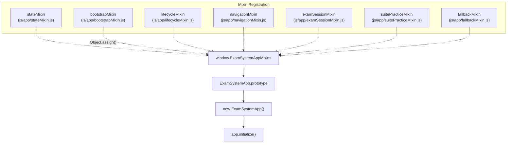
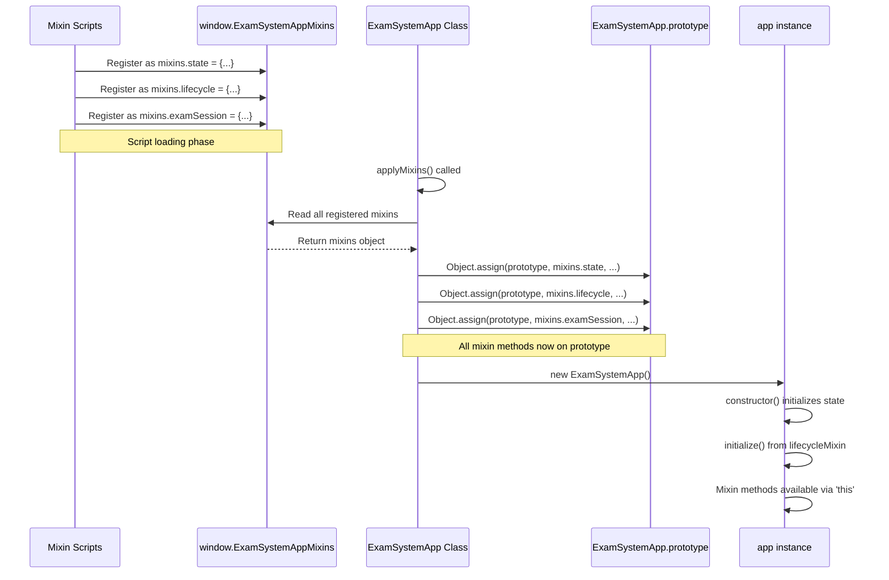
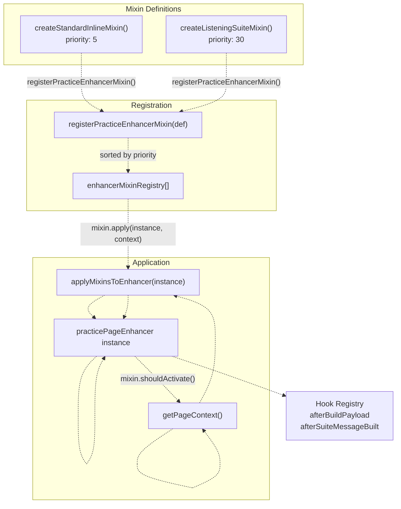
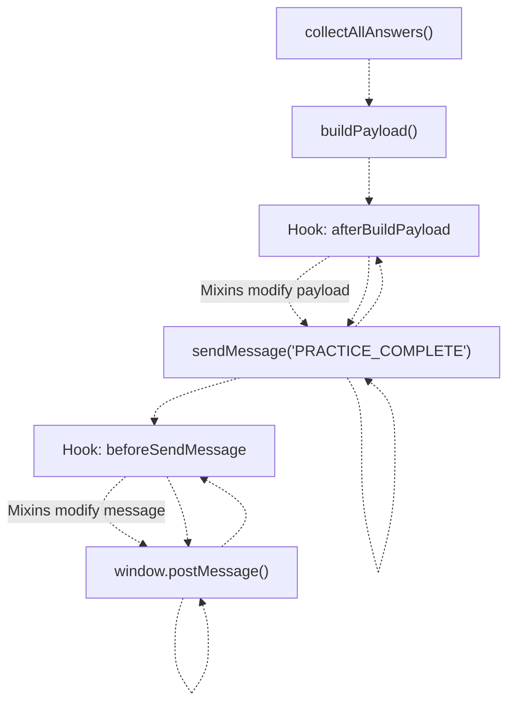
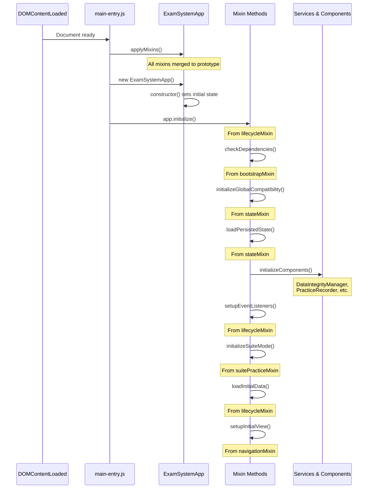
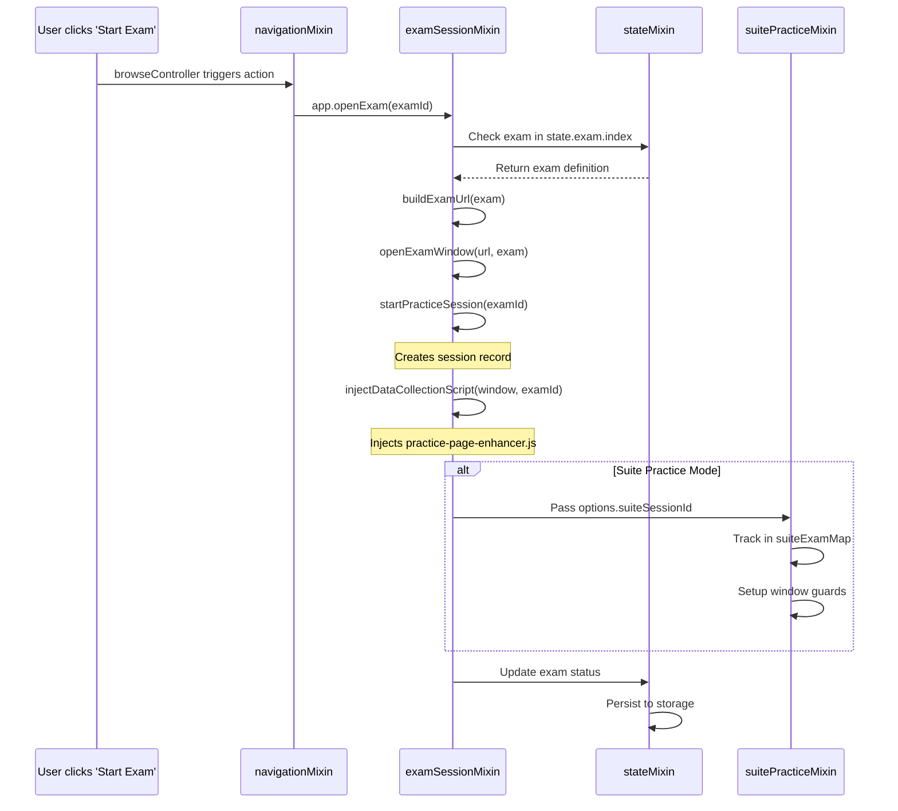
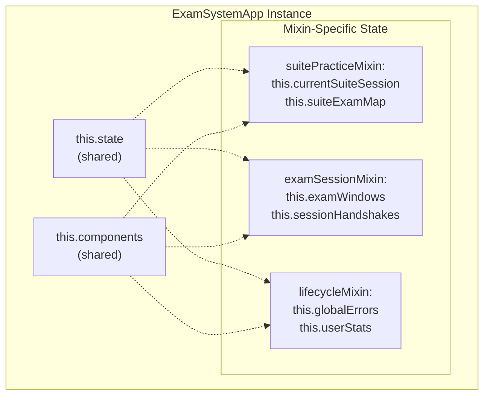

# Mixins & Component Composition

> **Relevant source files**
> * [css/heroui-bridge.css](https://github.com/sallowayma-git/IELTS-practice/blob/92f64eb8/css/heroui-bridge.css)
> * [css/main.css](https://github.com/sallowayma-git/IELTS-practice/blob/92f64eb8/css/main.css)
> * [index.html](https://github.com/sallowayma-git/IELTS-practice/blob/92f64eb8/index.html)
> * [js/app.js](https://github.com/sallowayma-git/IELTS-practice/blob/92f64eb8/js/app.js)
> * [js/app/examSessionMixin.js](https://github.com/sallowayma-git/IELTS-practice/blob/92f64eb8/js/app/examSessionMixin.js)
> * [js/app/lifecycleMixin.js](https://github.com/sallowayma-git/IELTS-practice/blob/92f64eb8/js/app/lifecycleMixin.js)
> * [js/app/suitePracticeMixin.js](https://github.com/sallowayma-git/IELTS-practice/blob/92f64eb8/js/app/suitePracticeMixin.js)
> * [js/boot-fallbacks.js](https://github.com/sallowayma-git/IELTS-practice/blob/92f64eb8/js/boot-fallbacks.js)
> * [js/components/DataIntegrityManager.js](https://github.com/sallowayma-git/IELTS-practice/blob/92f64eb8/js/components/DataIntegrityManager.js)
> * [js/main.js](https://github.com/sallowayma-git/IELTS-practice/blob/92f64eb8/js/main.js)
> * [js/practice-page-enhancer.js](https://github.com/sallowayma-git/IELTS-practice/blob/92f64eb8/js/practice-page-enhancer.js)
> * [js/script.js](https://github.com/sallowayma-git/IELTS-practice/blob/92f64eb8/js/script.js)
> * [js/services/GlobalStateService.js](https://github.com/sallowayma-git/IELTS-practice/blob/92f64eb8/js/services/GlobalStateService.js)
> * [js/utils/answerComparisonUtils.js](https://github.com/sallowayma-git/IELTS-practice/blob/92f64eb8/js/utils/answerComparisonUtils.js)

## Purpose and Scope

This document explains the mixin-based composition pattern used throughout the IELTS practice system to modularize functionality and enhance code reusability. The system employs two distinct mixin architectures: **Application Mixins** that extend `ExamSystemApp` with domain-specific behaviors, and **Enhancer Mixins** that customize practice page data collection.

For application initialization and bootstrap details, see [Application Bootstrap & Initialization Flow](/sallowayma-git/IELTS-practice/3.1-application-bootstrap-and-initialization-flow). For state management architecture, see [ExamSystemApp & State Management](/sallowayma-git/IELTS-practice/3.2-examsystemapp-and-state-management). For practice session internals, see [Practice Session Lifecycle & Management](/sallowayma-git/IELTS-practice/5.1-practice-session-lifecycle-and-management).

---

## Mixin Architecture Overview

The codebase implements a **prototype-based mixin composition pattern** where feature modules register themselves as mixins and are applied to target classes during initialization. This approach allows the application to compose complex behaviors from independent, testable modules without deep inheritance hierarchies.

### Key Design Principles

| Principle | Implementation | Benefits |
| --- | --- | --- |
| **Separation of Concerns** | Each mixin handles one domain (e.g., exam sessions, suite practice, lifecycle) | Modules can be developed and tested independently |
| **Late Binding** | Mixins are applied at runtime via `Object.assign()` | Flexibility to conditionally apply mixins based on environment |
| **No Name Collisions** | Mixins use namespaced method names and internal state | Multiple mixins can coexist without conflicts |
| **Registry Pattern** | Global `ExamSystemAppMixins` registry collects all mixins | Centralized mixin discovery and application |

**Sources:** [js/app.js L64-L82](https://github.com/sallowayma-git/IELTS-practice/blob/92f64eb8/js/app.js#L64-L82)

 [js/practice-page-enhancer.js L154-L192](https://github.com/sallowayma-git/IELTS-practice/blob/92f64eb8/js/practice-page-enhancer.js#L154-L192)

---

## Core Application Mixins

The `ExamSystemApp` class is composed from seven core mixins that provide specialized functionality:

### Application Mixin Registry



**Diagram: Application Mixin Registration and Composition Flow**

Each mixin script registers itself into the `window.ExamSystemAppMixins` registry object under a specific key. The `applyMixins()` function iterates through the registry and uses `Object.assign()` to merge all mixin methods onto `ExamSystemApp.prototype`.

**Sources:** [js/app.js L64-L82](https://github.com/sallowayma-git/IELTS-practice/blob/92f64eb8/js/app.js#L64-L82)

 [index.html L464-L471](https://github.com/sallowayma-git/IELTS-practice/blob/92f64eb8/index.html#L464-L471)

---

### Mixin Responsibilities

#### 1. State Mixin (stateMixin)

* **Purpose:** Unified state management interface
* **Key Methods:** `getState()`, `setState()`, `syncStateToStorage()`
* **State Domains:** `exam`, `practice`, `ui`, `system`

#### 2. Bootstrap Mixin (bootstrapMixin)

* **Purpose:** Dependency validation and service initialization
* **Key Methods:** `checkDependencies()`, `initializeGlobalCompatibility()`, `loadPersistedState()`

#### 3. Lifecycle Mixin (lifecycleMixin)

* **Purpose:** Application startup, event handling, error management
* **Key Methods:** `initialize()`, `setupEventListeners()`, `handleGlobalError()`, `destroy()`
* **Responsibilities:** * Multi-stage initialization sequence * Global error handling via `unhandledrejection` and `error` events * Responsive layout adjustments

#### 4. Navigation Mixin (navigationMixin)

* **Purpose:** View switching and routing
* **Key Methods:** `navigateToView()`, `showView()`, `setupInitialView()`
* **Integration:** Works with `NavigationController` for tab synchronization

#### 5. Exam Session Mixin (examSessionMixin)

* **Purpose:** Exam window management and practice session coordination
* **Key Methods:** `openExam()`, `buildExamUrl()`, `startPracticeSession()`, `injectDataCollectionScript()`
* **Features:** * Multi-strategy resource path resolution * Cross-window communication via `postMessage` * Fallback handling for blocked popups * Placeholder page guards for test environments

#### 6. Suite Practice Mixin (suitePracticeMixin)

* **Purpose:** Sequential multi-exam practice sessions
* **Key Methods:** `startSuitePractice()`, `handleSuitePracticeComplete()`, `finalizeSuiteRecord()`
* **Features:** * Random exam selection across categories (P1, P2, P3) * Window reuse for seamless navigation * Result aggregation across multiple exams * Multi-suite detection (multiple test sections on one page)

#### 7. Fallback Mixin (fallbackMixin)

* **Purpose:** Degraded mode operation when services are unavailable
* **Key Methods:** `savePracticeRecordFallback()`, `normalizeFallbackAnswerMap()`
* **Fallback Strategies:** * Direct storage access when `PracticeRecorder` unavailable * Answer normalization without comparison utils * Legacy data format compatibility

**Sources:** [js/app/lifecycleMixin.js L1-L70](https://github.com/sallowayma-git/IELTS-practice/blob/92f64eb8/js/app/lifecycleMixin.js#L1-L70)

 [js/app/examSessionMixin.js L87-L184](https://github.com/sallowayma-git/IELTS-practice/blob/92f64eb8/js/app/examSessionMixin.js#L87-L184)

 [js/app/suitePracticeMixin.js L6-L125](https://github.com/sallowayma-git/IELTS-practice/blob/92f64eb8/js/app/suitePracticeMixin.js#L6-L125)

---

## Mixin Application Pattern

### Composition Mechanism



**Diagram: Mixin Composition Sequence**

The pattern follows these stages:

1. **Registration Phase:** Each mixin script executes and assigns its methods to a key in `window.ExamSystemAppMixins`
2. **Composition Phase:** `applyMixins()` uses `Object.assign()` to shallow-copy all mixin methods onto `ExamSystemApp.prototype`
3. **Instantiation Phase:** `new ExamSystemApp()` creates an instance with access to all mixin methods
4. **Initialization Phase:** `app.initialize()` (from `lifecycleMixin`) orchestrates startup

**Sources:** [js/app.js L64-L82](https://github.com/sallowayma-git/IELTS-practice/blob/92f64eb8/js/app.js#L64-L82)

 [js/app.js L86-L124](https://github.com/sallowayma-git/IELTS-practice/blob/92f64eb8/js/app.js#L86-L124)

---

### Mixin Method Invocation

Once composed, mixin methods are invoked as regular instance methods:

```python
// From lifecycleMixin
async initialize() {
    // Can call methods from examSessionMixin
    this.initializeSuiteMode();  // from suitePracticeMixin
    
    // Can access shared state
    this.state.exam.index = []; // from constructor
    
    // Can call methods from other mixins
    this.setupEventListeners();  // from lifecycleMixin
    await this.loadInitialData(); // from lifecycleMixin
}
```

**Key Characteristics:**

* **Shared Context:** All mixin methods share the same `this` context (the `app` instance)
* **State Access:** Mixins read/write `this.state`, `this.components`, `this.examWindows`
* **Cross-Mixin Calls:** Mixins can invoke each other's methods directly
* **No Explicit Coordination:** Mixins don't need to know about each other's existence

**Sources:** [js/app/lifecycleMixin.js L6-L70](https://github.com/sallowayma-git/IELTS-practice/blob/92f64eb8/js/app/lifecycleMixin.js#L6-L70)

 [js/app/suitePracticeMixin.js L6-L18](https://github.com/sallowayma-git/IELTS-practice/blob/92f64eb8/js/app/suitePracticeMixin.js#L6-L18)

---

## Practice Enhancer Mixin System

The practice page enhancer uses a **separate mixin architecture** for customizing data collection behavior based on page type (inline practice, listening suite, multi-suite).

### Enhancer Mixin Registry



**Diagram: Practice Enhancer Mixin Architecture**

**Sources:** [js/practice-page-enhancer.js L154-L222](https://github.com/sallowayma-git/IELTS-practice/blob/92f64eb8/js/practice-page-enhancer.js#L154-L222)

 [js/practice-page-enhancer.js L274-L275](https://github.com/sallowayma-git/IELTS-practice/blob/92f64eb8/js/practice-page-enhancer.js#L274-L275)

---

### Enhancer Mixin Definition Pattern

Each enhancer mixin follows this structure:

```javascript
function createListeningSuiteMixin() {
    return {
        name: 'listening-suite-practice',
        priority: 30,  // Higher priority applied first
        
        shouldActivate() {
            // Return true if this page needs suite handling
            return document.querySelector('[data-submit-suite]') !== null;
        },
        
        apply(enhancer, context) {
            // Register hooks to modify data collection behavior
            enhancer.registerHook('afterBuildPayload', (payload) => {
                payload.metadata = payload.metadata || {};
                payload.metadata.practiceMode = 'suite';
            });
        }
    };
}
```

**Mixin Properties:**

| Property | Type | Purpose |
| --- | --- | --- |
| `name` | `string` | Identifier for debugging |
| `priority` | `number` | Application order (higher = earlier) |
| `shouldActivate(context, instance)` | `function` | Conditional activation based on page structure |
| `apply(instance, context)` | `function` | Inject behavior via hook registration |

**Sources:** [js/practice-page-enhancer.js L223-L272](https://github.com/sallowayma-git/IELTS-practice/blob/92f64eb8/js/practice-page-enhancer.js#L223-L272)

---

### Enhancer Hook System

Mixins modify enhancer behavior by registering **hooks** that intercept data at specific lifecycle points:



**Diagram: Enhancer Hook Invocation Flow**

**Available Hooks:**

* `afterBuildPayload`: Modify collected data before finalization
* `afterSuiteMessageBuilt`: Customize suite completion messages
* `beforeSendMessage`: Last chance to modify outgoing data

**Sources:** [js/practice-page-enhancer.js L243-L270](https://github.com/sallowayma-git/IELTS-practice/blob/92f64eb8/js/practice-page-enhancer.js#L243-L270)

---

## Mixin Initialization Flow

### Application Startup with Mixins



**Diagram: Application Initialization with Mixin Method Calls**

Each mixin contributes specific initialization steps to the overall startup sequence:

1. **bootstrapMixin** validates dependencies and checks for required globals
2. **stateMixin** loads persisted state from `storage` and syncs to `AppStateService`
3. **lifecycleMixin** sets up event listeners and error handlers
4. **suitePracticeMixin** initializes suite session tracking maps
5. **navigationMixin** determines initial view from URL parameters

**Sources:** [js/app/lifecycleMixin.js L6-L70](https://github.com/sallowayma-git/IELTS-practice/blob/92f64eb8/js/app/lifecycleMixin.js#L6-L70)

 [js/app.js L86-L124](https://github.com/sallowayma-git/IELTS-practice/blob/92f64eb8/js/app.js#L86-L124)

---

## Mixin Composition Examples

### Example 1: Opening an Exam (Cross-Mixin Collaboration)



**Diagram: Cross-Mixin Collaboration for Opening Exam**

This flow demonstrates how multiple mixins collaborate:

* **navigationMixin** handles view switching
* **examSessionMixin** manages window opening and session tracking
* **stateMixin** provides exam data and persists updates
* **suitePracticeMixin** adds suite-specific tracking if applicable

**Sources:** [js/app/examSessionMixin.js L91-L184](https://github.com/sallowayma-git/IELTS-practice/blob/92f64eb8/js/app/examSessionMixin.js#L91-L184)

 [js/app/suitePracticeMixin.js L20-L125](https://github.com/sallowayma-git/IELTS-practice/blob/92f64eb8/js/app/suitePracticeMixin.js#L20-L125)

---

### Example 2: Suite Practice Lifecycle

The suite practice workflow showcases mixin composition for complex multi-step processes:

| Phase | Mixin | Method | Responsibility |
| --- | --- | --- | --- |
| **Initiation** | `suitePracticeMixin` | `startSuitePractice()` | Random exam selection, session creation |
| **Window Opening** | `examSessionMixin` | `openExam()` | Open first exam with `suiteSessionId` |
| **Data Collection** | (enhancer) | `applyMixinsToEnhancer()` | Apply suite-specific mixins |
| **Completion** | `suitePracticeMixin` | `handleSuitePracticeComplete()` | Validate, store result, open next exam |
| **Finalization** | `suitePracticeMixin` | `finalizeSuiteRecord()` | Aggregate results, persist suite record |
| **Persistence** | `stateMixin` | `syncStateToStorage()` | Save to `practice_records` |

**Sources:** [js/app/suitePracticeMixin.js L20-L172](https://github.com/sallowayma-git/IELTS-practice/blob/92f64eb8/js/app/suitePracticeMixin.js#L20-L172)

 [js/app/examSessionMixin.js L91-L184](https://github.com/sallowayma-git/IELTS-practice/blob/92f64eb8/js/app/examSessionMixin.js#L91-L184)

---

## Mixin State Isolation and Sharing

### State Boundaries



**Diagram: Mixin State Organization**

**Shared State:** All mixins can access:

* `this.state.exam`, `this.state.practice`, `this.state.ui`
* `this.components.practiceRecorder`, `this.components.dataIntegrityManager`

**Mixin-Specific State:** Each mixin adds its own properties:

* `suitePracticeMixin` adds `this.currentSuiteSession`, `this.suiteExamMap`
* `examSessionMixin` adds `this.examWindows`, `this.sessionHandshakes`
* `lifecycleMixin` adds `this.globalErrors`, `this.userStats`

**No Collisions:** Mixins use descriptive property names to avoid conflicts. No formal namespacing is enforced, relying instead on naming conventions (e.g., `current*`, `*Map`, `*Manager`).

**Sources:** [js/app.js L6-L62](https://github.com/sallowayma-git/IELTS-practice/blob/92f64eb8/js/app.js#L6-L62)

 [js/app/suitePracticeMixin.js L6-L18](https://github.com/sallowayma-git/IELTS-practice/blob/92f64eb8/js/app/suitePracticeMixin.js#L6-L18)

 [js/app/examSessionMixin.js L1-L10](https://github.com/sallowayma-git/IELTS-practice/blob/92f64eb8/js/app/examSessionMixin.js#L1-L10)

---

## Best Practices and Limitations

### Mixin Design Guidelines

1. **Single Responsibility:** Each mixin handles one cohesive domain (sessions, navigation, lifecycle)
2. **Defensive Checks:** Mixins guard against missing dependencies with `typeof this.method === 'function'`
3. **State Initialization:** Mixins initialize their state in dedicated init methods (e.g., `initializeSuiteMode()`)
4. **Hook Registration:** Enhancer mixins use the hook system rather than overriding methods directly

### Known Limitations

| Limitation | Impact | Mitigation |
| --- | --- | --- |
| **Method Name Collisions** | Two mixins with same method name = last one wins | Use descriptive prefixes (e.g., `startSuite*`, `open*`) |
| **Initialization Order** | Mixins have no guaranteed application order | Use explicit dependencies via init methods |
| **Debugging Difficulty** | Stack traces show merged prototype methods | Use `console.trace()` and method name prefixes |
| **No Type Safety** | JavaScript prototype mutation = no compile-time checks | Rely on runtime validation and testing |

### Testing Considerations

* **Unit Testing:** Test mixins in isolation by applying to a minimal stub class
* **Integration Testing:** Test mixin interactions via the full `ExamSystemApp` instance
* **Mock Dependencies:** Use dependency injection for services like `storage`, `AppStateService`

**Sources:** [js/app.js L64-L82](https://github.com/sallowayma-git/IELTS-practice/blob/92f64eb8/js/app.js#L64-L82)

 [js/app/lifecycleMixin.js L6-L124](https://github.com/sallowayma-git/IELTS-practice/blob/92f64eb8/js/app/lifecycleMixin.js#L6-L124)