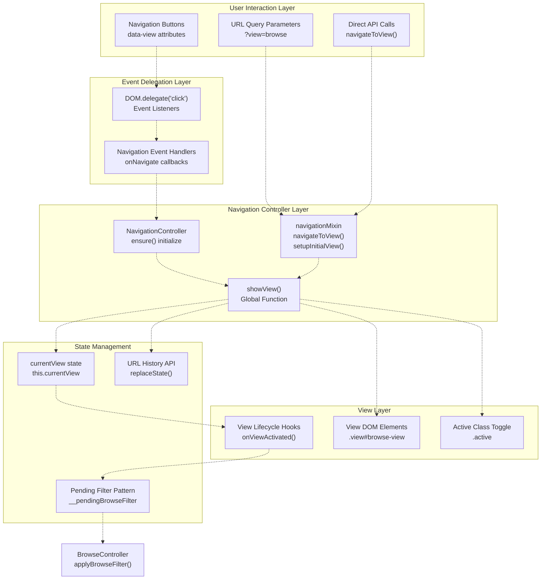
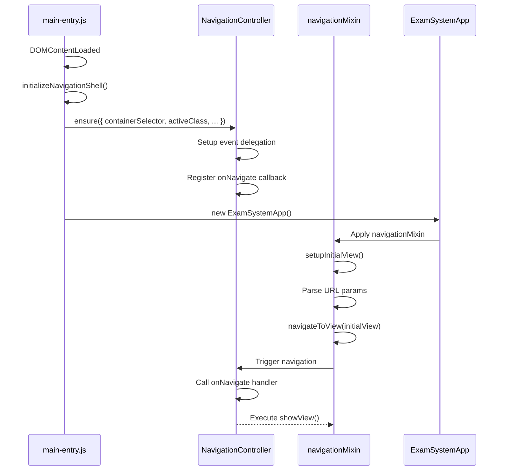
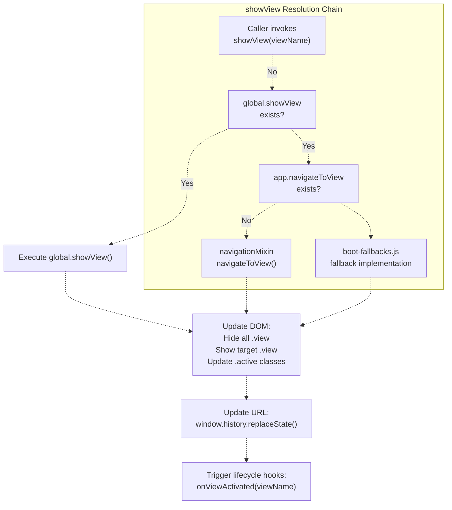
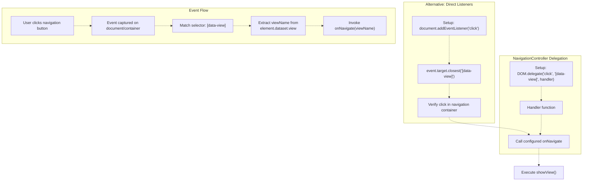
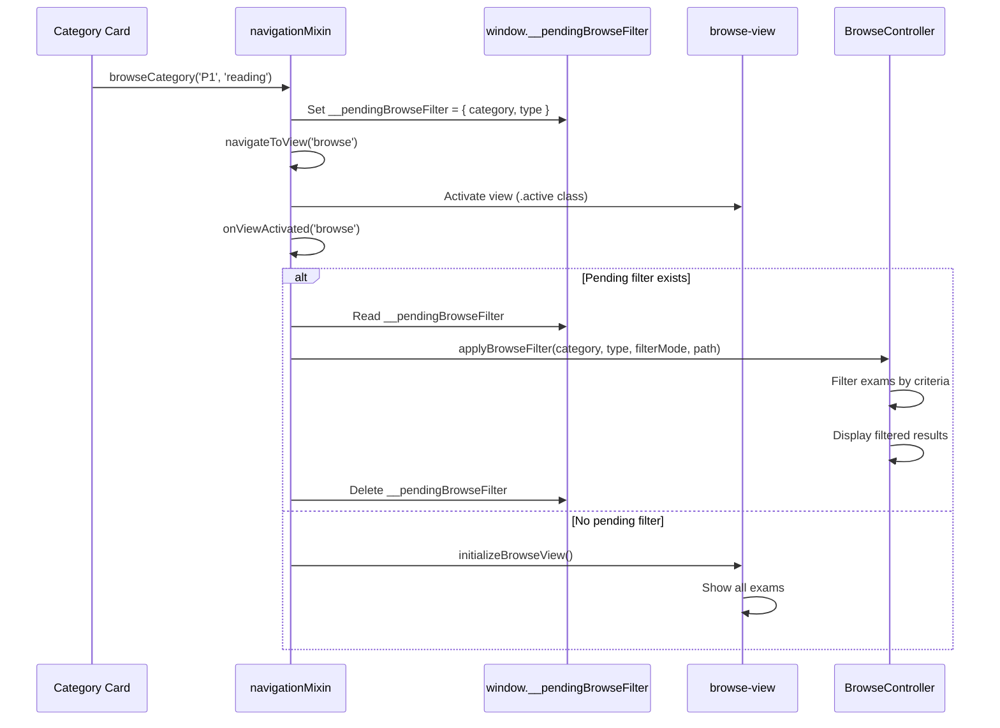
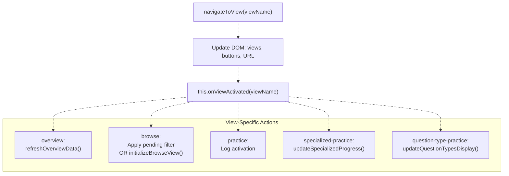
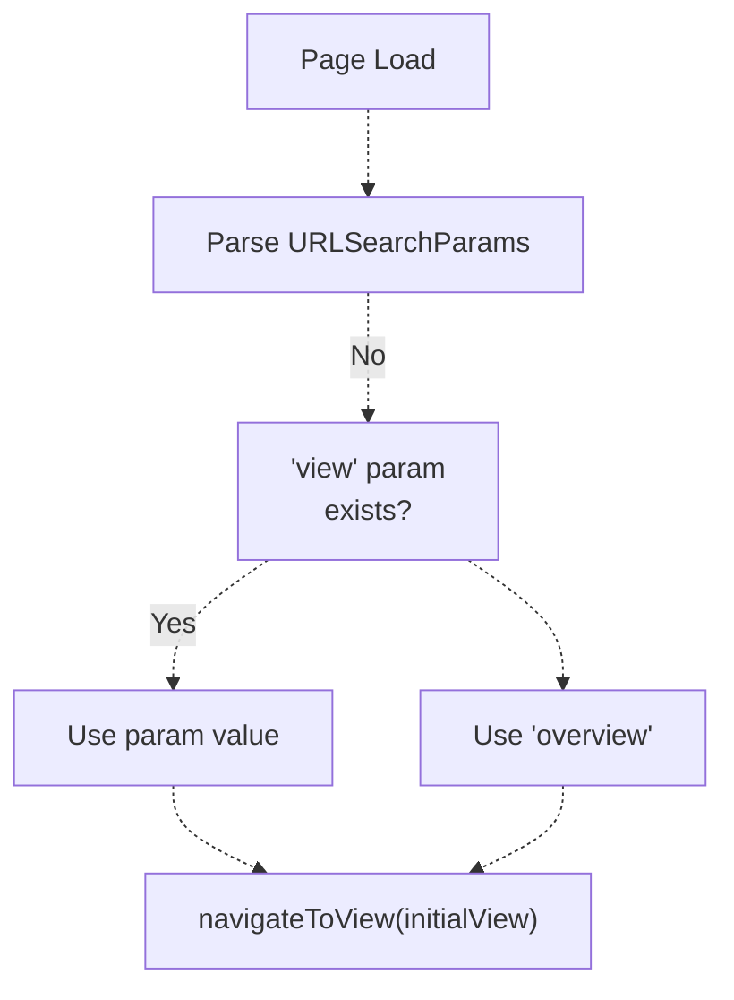
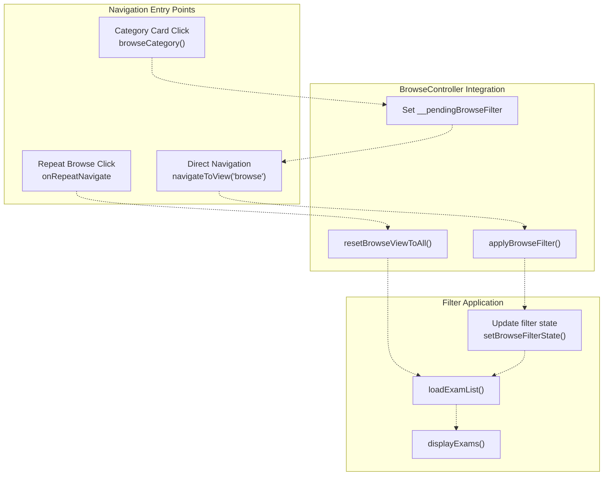
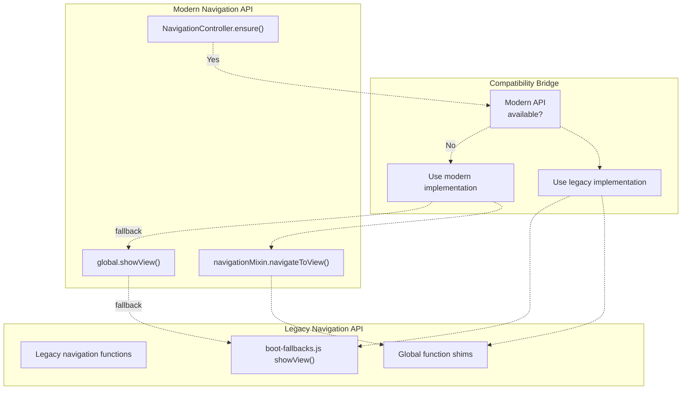
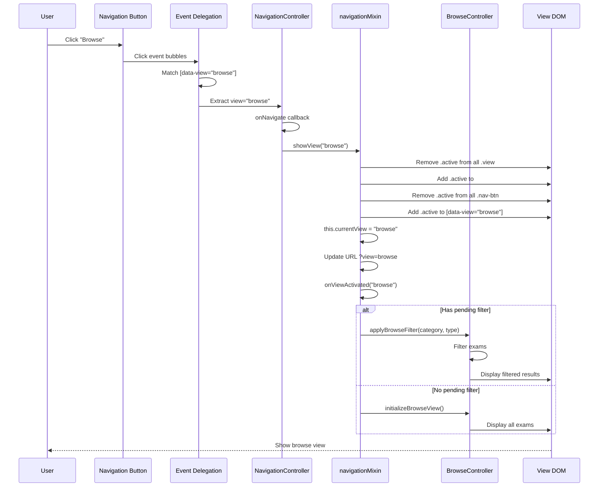

# Navigation & View Switching

> **Relevant source files**
> * [assets/scripts/complete-exam-data.js](https://github.com/sallowayma-git/IELTS-practice/blob/92f64eb8/assets/scripts/complete-exam-data.js)
> * [assets/scripts/listening-exam-data.js](https://github.com/sallowayma-git/IELTS-practice/blob/92f64eb8/assets/scripts/listening-exam-data.js)
> * [js/app/browseController.js](https://github.com/sallowayma-git/IELTS-practice/blob/92f64eb8/js/app/browseController.js)
> * [js/app/examActions.js](https://github.com/sallowayma-git/IELTS-practice/blob/92f64eb8/js/app/examActions.js)
> * [js/app/main-entry.js](https://github.com/sallowayma-git/IELTS-practice/blob/92f64eb8/js/app/main-entry.js)
> * [js/app/navigationMixin.js](https://github.com/sallowayma-git/IELTS-practice/blob/92f64eb8/js/app/navigationMixin.js)
> * [js/app/spellingErrorCollector.js](https://github.com/sallowayma-git/IELTS-practice/blob/92f64eb8/js/app/spellingErrorCollector.js)
> * [js/components/PerformanceOptimizer.js](https://github.com/sallowayma-git/IELTS-practice/blob/92f64eb8/js/components/PerformanceOptimizer.js)
> * [js/runtime/lazyLoader.js](https://github.com/sallowayma-git/IELTS-practice/blob/92f64eb8/js/runtime/lazyLoader.js)
> * [js/views/legacyViewBundle.js](https://github.com/sallowayma-git/IELTS-practice/blob/92f64eb8/js/views/legacyViewBundle.js)

## Purpose and Scope

This document describes the single-page application (SPA) navigation system used in the IELTS Practice System. It covers the view switching mechanism, active state synchronization, event delegation patterns, and the pending filter pattern for deferred navigation actions.

For information about the overall view management architecture and mixin composition, see [View Management & Navigation System](/sallowayma-git/IELTS-practice/3.3-view-management-and-navigation-system). For theme-specific navigation patterns, see [Theme Architecture Overview](/sallowayma-git/IELTS-practice/7.1-theme-architecture-overview) and [HP Welcome Interface & Views](/sallowayma-git/IELTS-practice/8.1-hp-welcome-interface-and-views).

---

## Architecture Overview

The navigation system coordinates between user interactions, URL state, and view activation through several key components:



**Sources:** [js/app/main-entry.js L54-L81](https://github.com/sallowayma-git/IELTS-practice/blob/92f64eb8/js/app/main-entry.js#L54-L81)

 [js/app/navigationMixin.js L1-L167](https://github.com/sallowayma-git/IELTS-practice/blob/92f64eb8/js/app/navigationMixin.js#L1-L167)

 [js/app/browseController.js L1-L481](https://github.com/sallowayma-git/IELTS-practice/blob/92f64eb8/js/app/browseController.js#L1-L481)

---

## NavigationController Initialization

The `NavigationController` is initialized during application bootstrap and provides a unified interface for view navigation across all themes.

### Initialization Flow



### Configuration Options

The `NavigationController.ensure()` method accepts the following configuration:

| Option | Type | Default | Description |
| --- | --- | --- | --- |
| `containerSelector` | string | `.main-nav` | CSS selector for navigation container |
| `activeClass` | string | `active` | Class name for active navigation items |
| `initialView` | string | `overview` | Default view to show on startup |
| `syncOnNavigate` | boolean | `true` | Whether to sync active states automatically |
| `onRepeatNavigate` | function | - | Callback when same view is clicked again |
| `onNavigate` | function | - | Primary navigation callback function |

**Sources:** [js/app/main-entry.js L54-L81](https://github.com/sallowayma-git/IELTS-practice/blob/92f64eb8/js/app/main-entry.js#L54-L81)

---

## View Switching Mechanism

### The showView Function

The `showView()` function is the core view switching primitive. Multiple implementations exist across the codebase for compatibility:



### View Switching Implementation

The primary implementation in `navigationMixin.js`:

**View Hiding:**

```python
1. Query all elements with class '.view'
2. Remove 'active' class from each
```

**View Activation:**

```sql
1. Find element with id '${viewName}-view'
2. Add 'active' class
3. Update this.currentView state
```

**Navigation Button Sync:**

```python
1. Query all '.nav-btn' elements
2. Remove 'active' class from all
3. Find button with data-view="${viewName}"
4. Add 'active' class
```

**URL Synchronization:**

```python
1. Create new URL from window.location
2. Set 'view' query parameter
3. Call window.history.replaceState()
```

**Sources:** [js/app/navigationMixin.js L18-L51](https://github.com/sallowayma-git/IELTS-practice/blob/92f64eb8/js/app/navigationMixin.js#L18-L51)

 [js/app/main-entry.js L67-L75](https://github.com/sallowayma-git/IELTS-practice/blob/92f64eb8/js/app/main-entry.js#L67-L75)

---

## Event Delegation System

Navigation clicks are handled through event delegation to avoid attaching listeners to individual buttons:



### Event Delegation Patterns

The codebase uses two delegation patterns:

**Pattern 1: DOM Utility Delegation** (preferred)

```javascript
// If DOM.delegate is available
DOM.delegate('click', '[data-view]', function(event) {
    const viewName = this.dataset.view;
    navigateToView(viewName);
});
```

**Pattern 2: Manual Delegation** (fallback)

```javascript
// Fallback when DOM utilities not loaded
document.addEventListener('click', function(event) {
    const target = event.target.closest('[data-view]');
    if (!target || !container.contains(target)) return;
    
    const viewName = target.dataset.view;
    navigateToView(viewName);
});
```

**Sources:** [js/app/main-entry.js L54-L81](https://github.com/sallowayma-git/IELTS-practice/blob/92f64eb8/js/app/main-entry.js#L54-L81)

---

## Active State Synchronization

Active state synchronization ensures visual consistency between navigation buttons and visible views:

```css
#mermaid-w46368hfj3d{font-family:ui-sans-serif,-apple-system,system-ui,Segoe UI,Helvetica;font-size:16px;fill:#333;}@keyframes edge-animation-frame{from{stroke-dashoffset:0;}}@keyframes dash{to{stroke-dashoffset:0;}}#mermaid-w46368hfj3d .edge-animation-slow{stroke-dasharray:9,5!important;stroke-dashoffset:900;animation:dash 50s linear infinite;stroke-linecap:round;}#mermaid-w46368hfj3d .edge-animation-fast{stroke-dasharray:9,5!important;stroke-dashoffset:900;animation:dash 20s linear infinite;stroke-linecap:round;}#mermaid-w46368hfj3d .error-icon{fill:#dddddd;}#mermaid-w46368hfj3d .error-text{fill:#222222;stroke:#222222;}#mermaid-w46368hfj3d .edge-thickness-normal{stroke-width:1px;}#mermaid-w46368hfj3d .edge-thickness-thick{stroke-width:3.5px;}#mermaid-w46368hfj3d .edge-pattern-solid{stroke-dasharray:0;}#mermaid-w46368hfj3d .edge-thickness-invisible{stroke-width:0;fill:none;}#mermaid-w46368hfj3d .edge-pattern-dashed{stroke-dasharray:3;}#mermaid-w46368hfj3d .edge-pattern-dotted{stroke-dasharray:2;}#mermaid-w46368hfj3d .marker{fill:#999;stroke:#999;}#mermaid-w46368hfj3d .marker.cross{stroke:#999;}#mermaid-w46368hfj3d svg{font-family:ui-sans-serif,-apple-system,system-ui,Segoe UI,Helvetica;font-size:16px;}#mermaid-w46368hfj3d p{margin:0;}#mermaid-w46368hfj3d defs #statediagram-barbEnd{fill:#999;stroke:#999;}#mermaid-w46368hfj3d g.stateGroup text{fill:#dddddd;stroke:none;font-size:10px;}#mermaid-w46368hfj3d g.stateGroup text{fill:#333;stroke:none;font-size:10px;}#mermaid-w46368hfj3d g.stateGroup .state-title{font-weight:bolder;fill:#333;}#mermaid-w46368hfj3d g.stateGroup rect{fill:#ffffff;stroke:#dddddd;}#mermaid-w46368hfj3d g.stateGroup line{stroke:#999;stroke-width:1;}#mermaid-w46368hfj3d .transition{stroke:#999;stroke-width:1;fill:none;}#mermaid-w46368hfj3d .stateGroup .composit{fill:#f4f4f4;border-bottom:1px;}#mermaid-w46368hfj3d .stateGroup .alt-composit{fill:#e0e0e0;border-bottom:1px;}#mermaid-w46368hfj3d .state-note{stroke:#e6d280;fill:#fff5ad;}#mermaid-w46368hfj3d .state-note text{fill:#333;stroke:none;font-size:10px;}#mermaid-w46368hfj3d .stateLabel .box{stroke:none;stroke-width:0;fill:#ffffff;opacity:0.5;}#mermaid-w46368hfj3d .edgeLabel .label rect{fill:#ffffff;opacity:0.5;}#mermaid-w46368hfj3d .edgeLabel{background-color:#ffffff;text-align:center;}#mermaid-w46368hfj3d .edgeLabel p{background-color:#ffffff;}#mermaid-w46368hfj3d .edgeLabel rect{opacity:0.5;background-color:#ffffff;fill:#ffffff;}#mermaid-w46368hfj3d .edgeLabel .label text{fill:#333;}#mermaid-w46368hfj3d .label div .edgeLabel{color:#333;}#mermaid-w46368hfj3d .stateLabel text{fill:#333;font-size:10px;font-weight:bold;}#mermaid-w46368hfj3d .node circle.state-start{fill:#999;stroke:#999;}#mermaid-w46368hfj3d .node .fork-join{fill:#999;stroke:#999;}#mermaid-w46368hfj3d .node circle.state-end{fill:#dddddd;stroke:#f4f4f4;stroke-width:1.5;}#mermaid-w46368hfj3d .end-state-inner{fill:#f4f4f4;stroke-width:1.5;}#mermaid-w46368hfj3d .node rect{fill:#ffffff;stroke:#dddddd;stroke-width:1px;}#mermaid-w46368hfj3d .node polygon{fill:#ffffff;stroke:#dddddd;stroke-width:1px;}#mermaid-w46368hfj3d #statediagram-barbEnd{fill:#999;}#mermaid-w46368hfj3d .statediagram-cluster rect{fill:#ffffff;stroke:#dddddd;stroke-width:1px;}#mermaid-w46368hfj3d .cluster-label,#mermaid-w46368hfj3d .nodeLabel{color:#333;}#mermaid-w46368hfj3d .statediagram-cluster rect.outer{rx:5px;ry:5px;}#mermaid-w46368hfj3d .statediagram-state .divider{stroke:#dddddd;}#mermaid-w46368hfj3d .statediagram-state .title-state{rx:5px;ry:5px;}#mermaid-w46368hfj3d .statediagram-cluster.statediagram-cluster .inner{fill:#f4f4f4;}#mermaid-w46368hfj3d .statediagram-cluster.statediagram-cluster-alt .inner{fill:#f8f8f8;}#mermaid-w46368hfj3d .statediagram-cluster .inner{rx:0;ry:0;}#mermaid-w46368hfj3d .statediagram-state rect.basic{rx:5px;ry:5px;}#mermaid-w46368hfj3d .statediagram-state rect.divider{stroke-dasharray:10,10;fill:#f8f8f8;}#mermaid-w46368hfj3d .note-edge{stroke-dasharray:5;}#mermaid-w46368hfj3d .statediagram-note rect{fill:#fff5ad;stroke:#e6d280;stroke-width:1px;rx:0;ry:0;}#mermaid-w46368hfj3d .statediagram-note rect{fill:#fff5ad;stroke:#e6d280;stroke-width:1px;rx:0;ry:0;}#mermaid-w46368hfj3d .statediagram-note text{fill:#333;}#mermaid-w46368hfj3d .statediagram-note .nodeLabel{color:#333;}#mermaid-w46368hfj3d .statediagram .edgeLabel{color:red;}#mermaid-w46368hfj3d #dependencyStart,#mermaid-w46368hfj3d #dependencyEnd{fill:#999;stroke:#999;stroke-width:1;}#mermaid-w46368hfj3d .statediagramTitleText{text-anchor:middle;font-size:18px;fill:#333;}#mermaid-w46368hfj3d :root{--mermaid-font-family:"trebuchet ms",verdana,arial,sans-serif;}Initial loadClick Browse buttonClick Practice buttonClick Settings buttonClick Overview buttonClick Practice buttonClick Settings buttonClick Overview buttonClick Browse buttonClick Settings buttonClick Overview buttonClick Browse buttonClick Practice buttonOverviewBrowsePracticeSettingsActive State OperationsView change requestedRemove all .active classesSet currentView stateAdd .active to target viewAdd .active to nav buttonUpdate URL query paramRemoveOldUpdateCurrentAddNewSyncButtonsSyncNavUpdateURL
```

### Synchronization Implementation

The synchronization process in `navigationMixin.js`:

| Step | Action | DOM Operation |
| --- | --- | --- |
| 1 | Clear all views | `querySelectorAll('.view').forEach(v => v.classList.remove('active'))` |
| 2 | Activate target view | `document.getElementById('${viewName}-view').classList.add('active')` |
| 3 | Clear nav buttons | `querySelectorAll('.nav-btn').forEach(b => b.classList.remove('active'))` |
| 4 | Activate nav button | `querySelector('[data-view="${viewName}"]').classList.add('active')` |
| 5 | Update URL | `window.history.replaceState({}, '', url)` |
| 6 | Update state | `this.currentView = viewName` |

**Sources:** [js/app/navigationMixin.js L23-L47](https://github.com/sallowayma-git/IELTS-practice/blob/92f64eb8/js/app/navigationMixin.js#L23-L47)

---

## Pending Filter Pattern

The pending filter pattern enables deferred navigation actions, particularly for browse view filtering that must wait for view activation:



### Pending Filter Data Structure

The pending filter object stores deferred navigation parameters:

```yaml
window.__pendingBrowseFilter = {
    category: string,     // 'P1' | 'P2' | 'P3' | 'all'
    type: string,         // 'reading' | 'listening' | 'all'
    filterMode: string,   // 'default' | 'frequency-p1' | 'frequency-p4'
    path: string          // Base path for folder filtering
}
```

### Usage Pattern

The pattern is implemented in three steps:

**Step 1: Set Pending Filter**

```
// In browseCategory method
window.__pendingBrowseFilter = { category, type, filterMode, path };
```

**Step 2: Navigate to View**

```
this.navigateToView('browse');
```

**Step 3: Apply on Activation**

```javascript
// In onViewActivated callback
if (window.__pendingBrowseFilter) {
    const { category, type, filterMode, path } = window.__pendingBrowseFilter;
    window.applyBrowseFilter(category, type, filterMode, path);
    delete window.__pendingBrowseFilter;
}
```

**Sources:** [js/app/navigationMixin.js L108-L134](https://github.com/sallowayma-git/IELTS-practice/blob/92f64eb8/js/app/navigationMixin.js#L108-L134)

 [js/app/navigationMixin.js L63-L72](https://github.com/sallowayma-git/IELTS-practice/blob/92f64eb8/js/app/navigationMixin.js#L63-L72)

---

## View Lifecycle Hooks

### onViewActivated Callback

The `onViewActivated` method is called after a view becomes active, enabling view-specific initialization:



### Lifecycle Hook Implementation

The switch statement in `onViewActivated`:

| View Name | Action | Purpose |
| --- | --- | --- |
| `overview` | `this.refreshOverviewData()` | Update statistics and category cards |
| `browse` | Check `__pendingBrowseFilter`, apply or initialize | Handle deferred filtering or show all exams |
| `specialized-practice` | `components.specializedPractice.updateSpecializedProgress()` | Refresh progress indicators |
| `question-type-practice` | `components.questionTypePractice.updateQuestionTypesDisplay()` | Update question type counts |
| `practice` | Log activation | Minimal handling (managed elsewhere) |

**Browse View Special Handling:**

The browse view has conditional initialization:

```javascript
IF __pendingBrowseFilter exists:
    1. Extract { category, type, filterMode, path }
    2. Call applyBrowseFilter(category, type, filterMode, path)
    3. Delete __pendingBrowseFilter
ELSE IF initializeBrowseView function exists:
    Call initializeBrowseView()
ELSE:
    No action (view already initialized)
```

**Sources:** [js/app/navigationMixin.js L56-L89](https://github.com/sallowayma-git/IELTS-practice/blob/92f64eb8/js/app/navigationMixin.js#L56-L89)

---

## URL Parameter Handling

### Initial View Resolution

The system determines the initial view on page load using URL query parameters:



### URL Sync on Navigation

Every navigation action updates the URL without page reload:

**URL Update Process:**

```javascript
// Create new URL from current location
const url = new URL(window.location);

// Update view parameter
url.searchParams.set('view', viewName);

// Push to history without reload
window.history.replaceState({}, '', url);
```

**Benefits:**

* Browser back/forward buttons work (if state restoration implemented)
* Shareable URLs with specific views
* Bookmark-friendly
* No page reload required

**Sources:** [js/app/navigationMixin.js L6-L14](https://github.com/sallowayma-git/IELTS-practice/blob/92f64eb8/js/app/navigationMixin.js#L6-L14)

 [js/app/navigationMixin.js L44-L46](https://github.com/sallowayma-git/IELTS-practice/blob/92f64eb8/js/app/navigationMixin.js#L44-L46)

---

## Browse View Navigation Integration

The browse view has special navigation requirements due to its filtering system:



### Browse Navigation Scenarios

**Scenario 1: Category Card Click**

```
1. User clicks category card (e.g., "P1 阅读")
2. browseCategory('P1', 'reading') called
3. __pendingBrowseFilter = { category: 'P1', type: 'reading' }
4. navigateToView('browse')
5. View activates, onViewActivated('browse') called
6. Pending filter detected and applied
7. Exams filtered and displayed
8. __pendingBrowseFilter deleted
```

**Scenario 2: Direct Browse Navigation**

```
1. User clicks "Browse" nav button
2. navigateToView('browse') called directly
3. No pending filter exists
4. initializeBrowseView() called
5. All exams displayed
```

**Scenario 3: Repeat Browse Click (onRepeatNavigate)**

```
1. User already on browse view
2. Clicks "Browse" button again
3. onRepeatNavigate('browse') triggered
4. resetBrowseViewToAll() called
5. Clear frequency mode (__browseFilterMode)
6. Reset filters to 'all'
7. Reload exam list
```

**Sources:** [js/app/navigationMixin.js L108-L134](https://github.com/sallowayma-git/IELTS-practice/blob/92f64eb8/js/app/navigationMixin.js#L108-L134)

 [js/app/main-entry.js L62-L66](https://github.com/sallowayma-git/IELTS-practice/blob/92f64eb8/js/app/main-entry.js#L62-L66)

 [js/app/browseController.js L355-L454](https://github.com/sallowayma-git/IELTS-practice/blob/92f64eb8/js/app/browseController.js#L355-L454)

---

## Legacy Navigation Support

### Backward Compatibility Layers

The navigation system maintains backward compatibility through multiple fallback mechanisms:



### Shim Function Pattern

Functions in `main-entry.js` provide compatibility shims:

**Example: showView Shim**

```yaml
IF global.showView exists:
    Use existing implementation
ELSE IF app.navigateToView exists:
    Use app.navigateToView as proxy
ELSE:
    Wait for boot-fallbacks.js to provide implementation
```

**Lazy Loading Compatibility:**

Many navigation-related functions use the lazy loading pattern:

```javascript
global.resetBrowseViewToAll = proxyAfterGroup('browse-view', 
    function getter() {
        return global.__legacyResetBrowseViewToAll || global.resetBrowseViewToAll;
    }
);
```

This pattern:

1. Provides immediate function availability
2. Defers execution until required group loads
3. Resolves to actual implementation when available
4. Falls back to legacy versions if needed

**Sources:** [js/app/main-entry.js L154-L164](https://github.com/sallowayma-git/IELTS-practice/blob/92f64eb8/js/app/main-entry.js#L154-L164)

 [js/app/main-entry.js L83-L97](https://github.com/sallowayma-git/IELTS-practice/blob/92f64eb8/js/app/main-entry.js#L83-L97)

---

## Navigation State Management

### State Variables

The navigation system maintains several state variables:

| Variable | Location | Type | Purpose |
| --- | --- | --- | --- |
| `this.currentView` | navigationMixin | string | Current active view name |
| `window.__pendingBrowseFilter` | global | object | Deferred browse filter data |
| `window.__browseFilterMode` | global | string | Current browse filter mode |
| `window.__browsePath` | global | string | Base path for folder filtering |

### State Persistence

**URL State:**

* Persisted in query parameter `?view=...`
* Updated on every navigation via `history.replaceState()`
* Read on page load via `URLSearchParams`

**Session State:**

* Browse filter mode stored in `window.__browseFilterMode`
* Persists across view switches
* Reset by `resetBrowseViewToAll()`

**Transient State:**

* `__pendingBrowseFilter` deleted after application
* Used only during view transition
* Not persisted across page reloads

**Sources:** [js/app/navigationMixin.js L3-L51](https://github.com/sallowayma-git/IELTS-practice/blob/92f64eb8/js/app/navigationMixin.js#L3-L51)

 [js/app/browseController.js L316-L339](https://github.com/sallowayma-git/IELTS-practice/blob/92f64eb8/js/app/browseController.js#L316-L339)

---

## Navigation Event Flow

Complete event flow from user interaction to view display:



**Sources:** [js/app/navigationMixin.js L18-L89](https://github.com/sallowayma-git/IELTS-practice/blob/92f64eb8/js/app/navigationMixin.js#L18-L89)

 [js/app/main-entry.js L54-L81](https://github.com/sallowayma-git/IELTS-practice/blob/92f64eb8/js/app/main-entry.js#L54-L81)

 [js/app/browseController.js L429-L454](https://github.com/sallowayma-git/IELTS-practice/blob/92f64eb8/js/app/browseController.js#L429-L454)