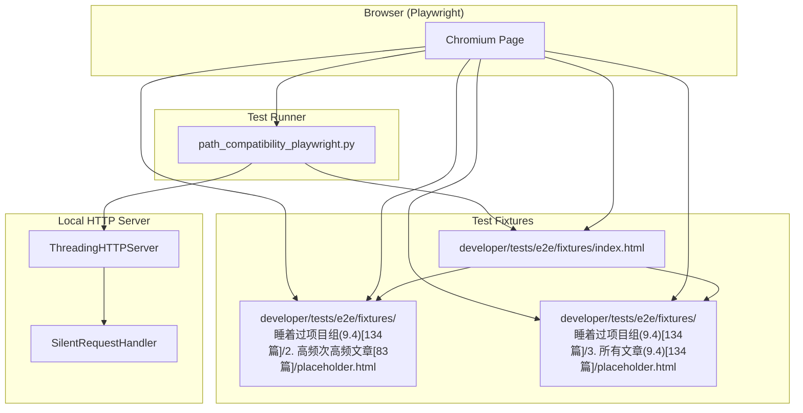
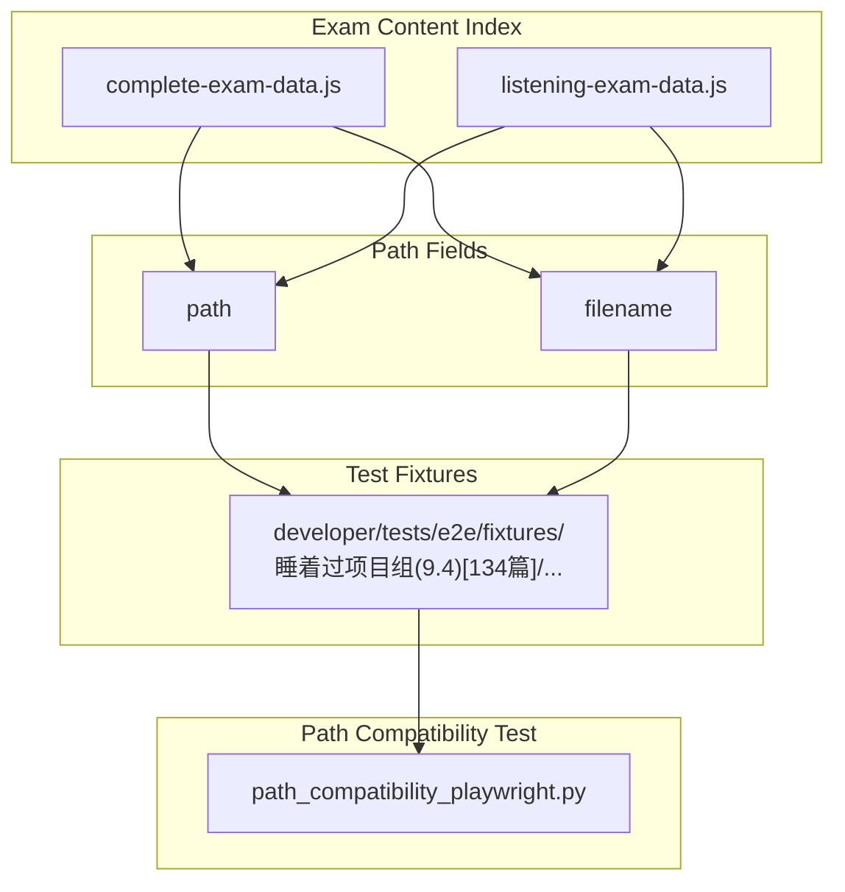

# Path Compatibility Testing

> **Relevant source files**
> * [.gitignore](https://github.com/sallowayma-git/IELTS-practice/blob/df0c9b8f/.gitignore)
> * [assets/scripts/complete-exam-data.js](https://github.com/sallowayma-git/IELTS-practice/blob/df0c9b8f/assets/scripts/complete-exam-data.js)
> * [assets/scripts/listening-exam-data.js](https://github.com/sallowayma-git/IELTS-practice/blob/df0c9b8f/assets/scripts/listening-exam-data.js)
> * [developer/tests/e2e/fixtures/index.html](https://github.com/sallowayma-git/IELTS-practice/blob/df0c9b8f/developer/tests/e2e/fixtures/index.html)
> * [developer/tests/e2e/path_compatibility_playwright.py](https://github.com/sallowayma-git/IELTS-practice/blob/df0c9b8f/developer/tests/e2e/path_compatibility_playwright.py)

This document describes the **Path Compatibility Testing** system in the IELTS Practice codebase. It covers the automated infrastructure and test methodology used to verify that the application and its content are fully compatible with file and URL paths containing non-ASCII characters (such as Chinese, spaces, and special symbols). This is critical for ensuring that exam content and resources can be reliably accessed across different operating systems, browsers, and deployment environments.

**Scope:**

* Automated E2E tests for path compatibility
* Test fixture structure and server setup
* How the test validates browser and application handling of non-ASCII paths
* Relationship to content organization and resource resolution

For information about the general E2E testing infrastructure, see [E2E Testing Infrastructure](/sallowayma-git/IELTS-practice/10.1-e2e-testing-infrastructure).  

For details on path resolution in the application, see [Path Resolution & Resource Management](/sallowayma-git/IELTS-practice/6.2-path-resolution-and-resource-management).

---

## Purpose of Path Compatibility Testing

The IELTS Practice system stores and serves exam content in directories and files with names containing Chinese characters, spaces, and special symbols. Path compatibility testing ensures that:

* Browsers and the application can correctly access and render these resources.
* The application's path resolution logic (including resource URLs and exam metadata) works with non-ASCII and complex paths.
* The system is robust against encoding issues, platform differences, and browser quirks.

This testing is essential for deployments in multilingual environments and for users who may store or move content on filesystems with different encoding rules.

**Sources:**
[developer/tests/e2e/path_compatibility_playwright.py L1-L85](https://github.com/sallowayma-git/IELTS-practice/blob/df0c9b8f/developer/tests/e2e/path_compatibility_playwright.py#L1-L85)

[developer/tests/e2e/fixtures/index.html L1-L47](https://github.com/sallowayma-git/IELTS-practice/blob/df0c9b8f/developer/tests/e2e/fixtures/index.html#L1-L47)

[.gitignore L23-L25](https://github.com/sallowayma-git/IELTS-practice/blob/df0c9b8f/.gitignore#L23-L25)

[assets/scripts/complete-exam-data.js L942-L945](https://github.com/sallowayma-git/IELTS-practice/blob/df0c9b8f/assets/scripts/complete-exam-data.js#L942-L945)

---

## System Overview

The path compatibility test suite is implemented as an automated Playwright test, which:

* Serves the repository using a local HTTP server with a custom request handler.
* Navigates to test fixture HTML files located in directories with non-ASCII names.
* Verifies that navigation, resource loading, and browser URL handling work as expected.
* Captures screenshots for visual verification and CI reporting.

### Diagram: Path Compatibility Test Flow

**Sources:**
[developer/tests/e2e/path_compatibility_playwright.py L1-L85](https://github.com/sallowayma-git/IELTS-practice/blob/df0c9b8f/developer/tests/e2e/path_compatibility_playwright.py#L1-L85)

[developer/tests/e2e/fixtures/index.html L1-L47](https://github.com/sallowayma-git/IELTS-practice/blob/df0c9b8f/developer/tests/e2e/fixtures/index.html#L1-L47)

---

## Test Implementation Details

### Test Server and Fixture Structure

* The test uses a custom `SilentRequestHandler` (subclass of `SimpleHTTPRequestHandler`) to suppress HTTP logs for clean CI output.
* The server is started on a random local port using `ThreadingHTTPServer`.
* The root directory for serving is the repository root, ensuring all paths are tested as they would be in production.

**Relevant code entities:**

| Symbol/Class | File/Line(s) | Description |
| --- | --- | --- |
| `SilentRequestHandler` | [developer/tests/e2e/path_compatibility_playwright.py L12-L15](https://github.com/sallowayma-git/IELTS-practice/blob/df0c9b8f/developer/tests/e2e/path_compatibility_playwright.py#L12-L15) | HTTP handler with suppressed logging |
| `serve_repository` | [developer/tests/e2e/path_compatibility_playwright.py L17-L31](https://github.com/sallowayma-git/IELTS-practice/blob/df0c9b8f/developer/tests/e2e/path_compatibility_playwright.py#L17-L31) | Context manager to start/stop the HTTP server |
| Test fixture directories | [developer/tests/e2e/fixtures/index.html L35-L41](https://github.com/sallowayma-git/IELTS-practice/blob/df0c9b8f/developer/tests/e2e/fixtures/index.html#L35-L41) | Links to non-ASCII path test files |

**Sources:**
[developer/tests/e2e/path_compatibility_playwright.py L12-L31](https://github.com/sallowayma-git/IELTS-practice/blob/df0c9b8f/developer/tests/e2e/path_compatibility_playwright.py#L12-L31)

[developer/tests/e2e/fixtures/index.html L1-L47](https://github.com/sallowayma-git/IELTS-practice/blob/df0c9b8f/developer/tests/e2e/fixtures/index.html#L1-L47)

[.gitignore L23-L25](https://github.com/sallowayma-git/IELTS-practice/blob/df0c9b8f/.gitignore#L23-L25)

---

### Test Steps and Assertions

The main test logic is implemented in the `run_check` coroutine:

1. **Server Setup:** * The repository is served via HTTP. * The entry point is `developer/tests/e2e/fixtures/index.html`.
2. **Navigation and Verification:** * The test navigates to the entry page and waits for the main heading. * It clicks links to directories with non-ASCII names (e.g., `睡着过项目组(9.4)[134篇]/2. 高频次高频文章[83篇]/placeholder.html`). * After navigation, it checks that the browser's URL contains the expected path (decoded, not percent-encoded). * The process is repeated for other fixture directories.
3. **Screenshot and Reporting:** * A screenshot is taken for CI reporting. * The browser is closed and the server is shut down.

**Relevant code entities:**

| Symbol/Function | File/Line(s) | Description |
| --- | --- | --- |
| `run_check` | [developer/tests/e2e/path_compatibility_playwright.py L33-L76](https://github.com/sallowayma-git/IELTS-practice/blob/df0c9b8f/developer/tests/e2e/path_compatibility_playwright.py#L33-L76) | Main async test logic |
| `main` | [developer/tests/e2e/path_compatibility_playwright.py L78-L84](https://github.com/sallowayma-git/IELTS-practice/blob/df0c9b8f/developer/tests/e2e/path_compatibility_playwright.py#L78-L84) | Entrypoint for running the test |
| URL assertions | [developer/tests/e2e/path_compatibility_playwright.py L56-L69](https://github.com/sallowayma-git/IELTS-practice/blob/df0c9b8f/developer/tests/e2e/path_compatibility_playwright.py#L56-L69) | Checks for expected decoded paths in browser URL |

**Sources:**
[developer/tests/e2e/path_compatibility_playwright.py L33-L76](https://github.com/sallowayma-git/IELTS-practice/blob/df0c9b8f/developer/tests/e2e/path_compatibility_playwright.py#L33-L76)

[developer/tests/e2e/fixtures/index.html L1-L47](https://github.com/sallowayma-git/IELTS-practice/blob/df0c9b8f/developer/tests/e2e/fixtures/index.html#L1-L47)

---

## Relationship to Application Content and Path Resolution

The application's exam content and metadata reference directories and files with non-ASCII names. For example, the `completeExamIndex` and `listeningExamIndex` objects contain `path` and `filename` fields with Chinese and special characters.

The path compatibility tests ensure that:

* The browser and server can serve these files without encoding errors.
* The application's path resolution logic (see [Path Resolution & Resource Management](/sallowayma-git/IELTS-practice/6.2-path-resolution-and-resource-management)) is exercised in a real browser environment.
* The test fixture structure mirrors the production content structure, providing high confidence in compatibility.

### Diagram: Path Compatibility in Content Indexing

**Sources:**
[assets/scripts/complete-exam-data.js L942-L945](https://github.com/sallowayma-git/IELTS-practice/blob/df0c9b8f/assets/scripts/complete-exam-data.js#L942-L945)

[assets/scripts/listening-exam-data.js L4-L941](https://github.com/sallowayma-git/IELTS-practice/blob/df0c9b8f/assets/scripts/listening-exam-data.js#L4-L941)

[developer/tests/e2e/fixtures/index.html L1-L47](https://github.com/sallowayma-git/IELTS-practice/blob/df0c9b8f/developer/tests/e2e/fixtures/index.html#L1-L47)

---

## Test Fixture Directory Policy

The `.gitignore` file is configured to **not** ignore the path compatibility test fixture directories, even though they contain non-ASCII names. This ensures that:

* The test fixtures are always present in the repository and CI environment.
* Developers can add or update test cases for new path patterns as needed.

**Relevant configuration:**

| Line(s) | Description |
| --- | --- |
| 23-25 | Explicitly un-ignore `developer/tests/e2e/fixtures/睡着过项目组(9.4)[134篇]/` and its contents |

**Sources:**
[.gitignore L23-L25](https://github.com/sallowayma-git/IELTS-practice/blob/df0c9b8f/.gitignore#L23-L25)

---

## Summary Table: Key Code Entities

| Entity / File | Role in Path Compatibility Testing |
| --- | --- |
| `path_compatibility_playwright.py` | Main test runner and server setup |
| `SilentRequestHandler` | Suppresses HTTP logs for clean output |
| `serve_repository` | Context manager for HTTP server lifecycle |
| `developer/tests/e2e/fixtures/index.html` | Entry point for manual and automated path navigation tests |
| `developer/tests/e2e/fixtures/睡着过项目组(9.4)[134篇]/` | Directories with non-ASCII names for test coverage |
| `.gitignore` (lines 23-25) | Ensures test fixture directories are included in the repo |
| `complete-exam-data.js` / `listening-exam-data.js` | Real content indices referencing non-ASCII paths |

**Sources:**
[developer/tests/e2e/path_compatibility_playwright.py L1-L85](https://github.com/sallowayma-git/IELTS-practice/blob/df0c9b8f/developer/tests/e2e/path_compatibility_playwright.py#L1-L85)

[developer/tests/e2e/fixtures/index.html L1-L47](https://github.com/sallowayma-git/IELTS-practice/blob/df0c9b8f/developer/tests/e2e/fixtures/index.html#L1-L47)

[.gitignore L23-L25](https://github.com/sallowayma-git/IELTS-practice/blob/df0c9b8f/.gitignore#L23-L25)

[assets/scripts/complete-exam-data.js L942-L945](https://github.com/sallowayma-git/IELTS-practice/blob/df0c9b8f/assets/scripts/complete-exam-data.js#L942-L945)

[assets/scripts/listening-exam-data.js L4-L941](https://github.com/sallowayma-git/IELTS-practice/blob/df0c9b8f/assets/scripts/listening-exam-data.js#L4-L941)

---

## Maintenance and Extension

* To add new path compatibility test cases, create additional directories and files under `developer/tests/e2e/fixtures/` with the desired path patterns.
* Update `index.html` to link to new test files.
* The test runner will automatically serve and verify these paths.
* If new path patterns are introduced in exam content, ensure they are mirrored in the test fixtures.

**Sources:**
[developer/tests/e2e/fixtures/index.html L1-L47](https://github.com/sallowayma-git/IELTS-practice/blob/df0c9b8f/developer/tests/e2e/fixtures/index.html#L1-L47)

[developer/tests/e2e/path_compatibility_playwright.py L1-L85](https://github.com/sallowayma-git/IELTS-practice/blob/df0c9b8f/developer/tests/e2e/path_compatibility_playwright.py#L1-L85)

---

## See Also

* [Path Resolution & Resource Management](/sallowayma-git/IELTS-practice/6.2-path-resolution-and-resource-management) — for details on how the application constructs and resolves resource URLs.
* [E2E Testing Infrastructure](/sallowayma-git/IELTS-practice/10.1-e2e-testing-infrastructure) — for the overall E2E and Playwright test setup.
* [Exam Content & Data System](/sallowayma-git/IELTS-practice/6-exam-content-and-data-system) — for the structure of exam content and metadata.

---