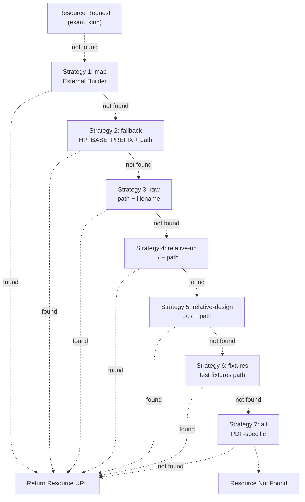
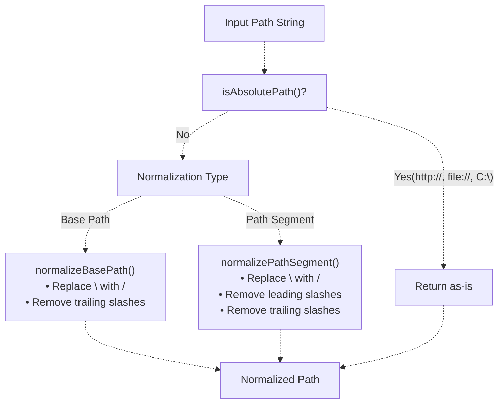
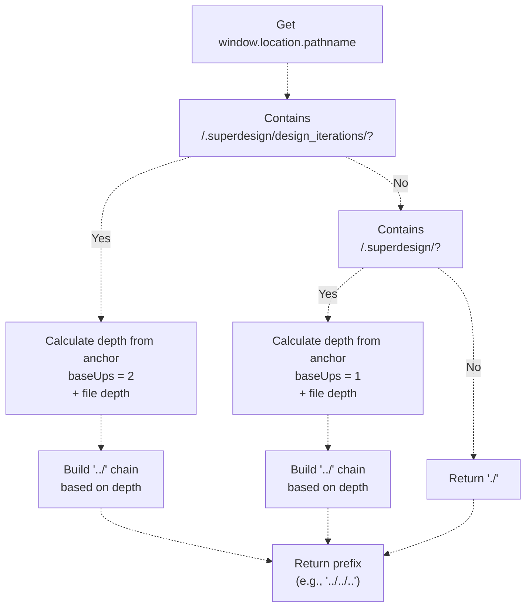
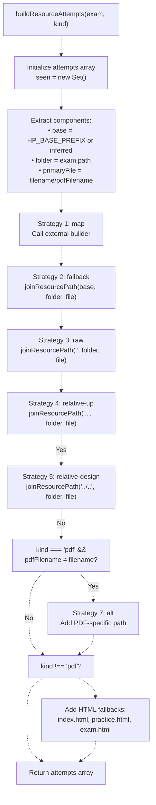
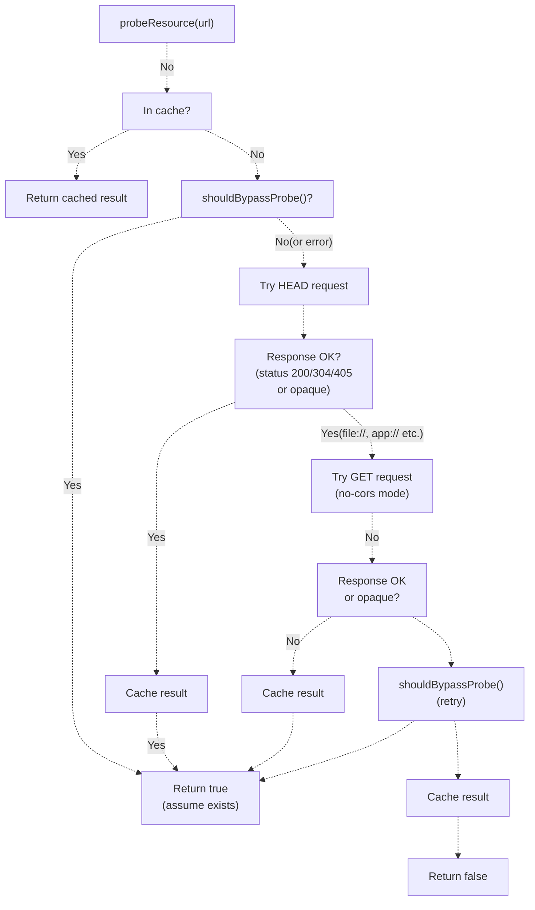
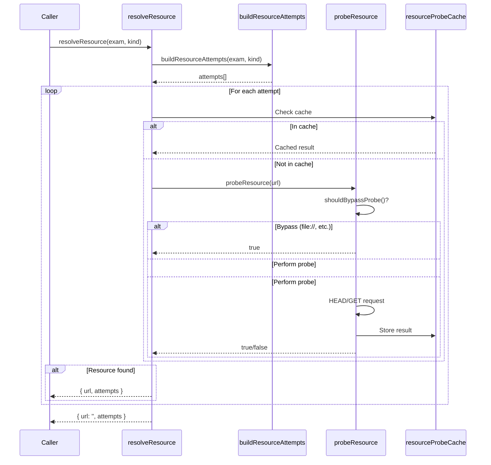
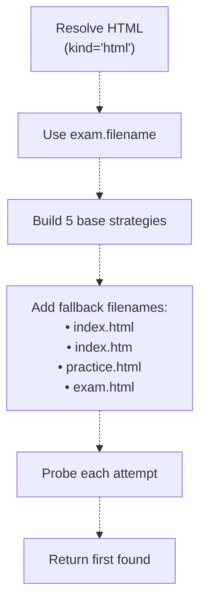
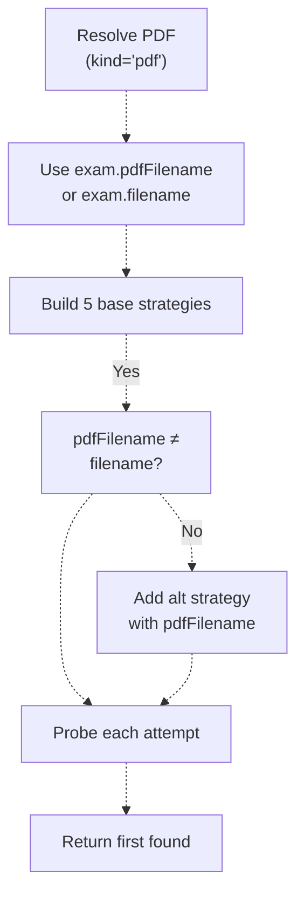
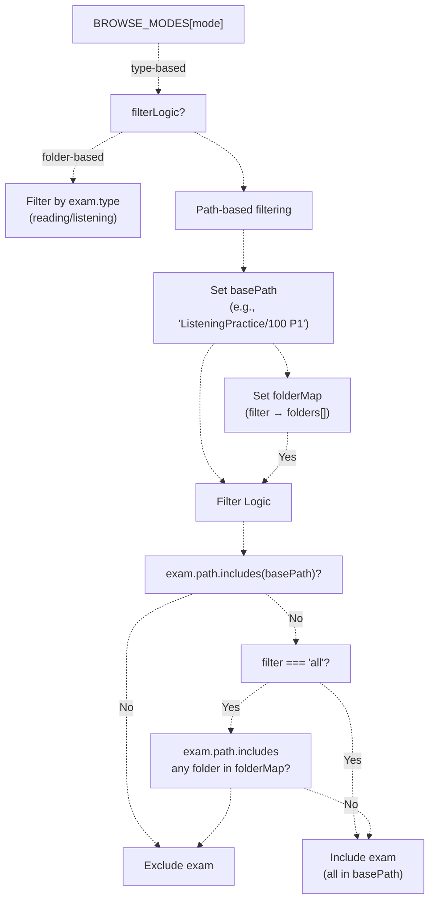
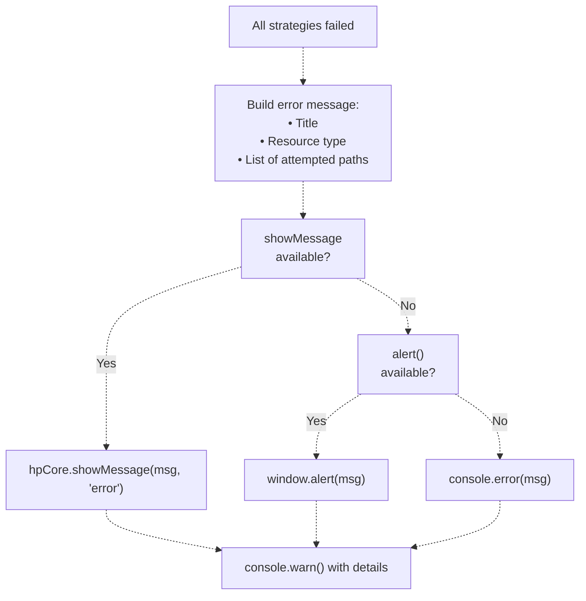

# Path Resolution & Resource Management

> **Relevant source files**
> * [.superdesign/design_iterations/HP/Welcome.html](https://github.com/sallowayma-git/IELTS-practice/blob/92f64eb8/.superdesign/design_iterations/HP/Welcome.html)
> * [js/app/browseController.js](https://github.com/sallowayma-git/IELTS-practice/blob/92f64eb8/js/app/browseController.js)
> * [js/app/examActions.js](https://github.com/sallowayma-git/IELTS-practice/blob/92f64eb8/js/app/examActions.js)
> * [js/app/main-entry.js](https://github.com/sallowayma-git/IELTS-practice/blob/92f64eb8/js/app/main-entry.js)
> * [js/app/navigationMixin.js](https://github.com/sallowayma-git/IELTS-practice/blob/92f64eb8/js/app/navigationMixin.js)
> * [js/app/spellingErrorCollector.js](https://github.com/sallowayma-git/IELTS-practice/blob/92f64eb8/js/app/spellingErrorCollector.js)
> * [js/plugins/hp/hp-core-bridge.js](https://github.com/sallowayma-git/IELTS-practice/blob/92f64eb8/js/plugins/hp/hp-core-bridge.js)
> * [js/plugins/themes/theme-adapter-base.js](https://github.com/sallowayma-git/IELTS-practice/blob/92f64eb8/js/plugins/themes/theme-adapter-base.js)
> * [js/runtime/lazyLoader.js](https://github.com/sallowayma-git/IELTS-practice/blob/92f64eb8/js/runtime/lazyLoader.js)

## Purpose and Scope

This document describes the multi-strategy path resolution system used throughout the IELTS Practice System to locate and load exam resources (HTML pages, PDF files) across various deployment scenarios. The system handles multiple path formats, fallback strategies, and deployment contexts including local file:// protocol, HTTP servers, and nested theme directory structures.

For information about exam metadata structure and paths stored in the exam index, see [Exam Index & Metadata Structure](/sallowayma-git/IELTS-practice/6.1-exam-index-and-metadata-structure). For library management and configuration, see [Library Management & Configuration System](/sallowayma-git/IELTS-practice/6.2-library-management-and-configuration-system).

---

## Path Resolution Architecture Overview

The system employs a **5-7 strategy fallback mechanism** to resolve resource paths, attempting multiple path formats in sequence until a valid resource is found. This ensures compatibility across different deployment scenarios without requiring manual configuration.

### Fallback Strategy Sequence



**Strategy Definitions:**

| Strategy | Description | Example Path |
| --- | --- | --- |
| **map** | External path builder (theme-specific) | Result of `window.buildResourcePath()` |
| **fallback** | `HP_BASE_PREFIX` + folder + filename | `./ListeningPractice/100 P1/exam.html` |
| **raw** | Direct concatenation of folder + filename | `ListeningPractice/100 P1/exam.html` |
| **relative-up** | One level up + folder + filename | `../ListeningPractice/100 P1/exam.html` |
| **relative-design** | Two levels up (for `.superdesign/` themes) | `../../ListeningPractice/100 P1/exam.html` |
| **fixtures** | Test fixtures directory | `developer/tests/e2e/fixtures/...` |
| **alt** | Alternative PDF filename (if differs from HTML) | Uses `exam.pdfFilename` instead of `exam.filename` |

**Sources:** [js/plugins/hp/hp-core-bridge.js L510-L567](https://github.com/sallowayma-git/IELTS-practice/blob/92f64eb8/js/plugins/hp/hp-core-bridge.js#L510-L567)

 [js/plugins/themes/theme-adapter-base.js L29-L30](https://github.com/sallowayma-git/IELTS-practice/blob/92f64eb8/js/plugins/themes/theme-adapter-base.js#L29-L30)

 [js/plugins/themes/theme-adapter-base.js L650-L695](https://github.com/sallowayma-git/IELTS-practice/blob/92f64eb8/js/plugins/themes/theme-adapter-base.js#L650-L695)

---

## Core Path Normalization Utilities

The system provides several utility functions to handle cross-platform path formats and ensure consistent path structure.

### Path Normalization Functions



### normalizeBasePath(value)

Normalizes a base path prefix by:

* Converting backslashes to forward slashes
* Removing trailing slashes

```
// Examples:
normalizeBasePath('./resources/') → './resources'
normalizeBasePath('C:\\exams\\') → 'C:/exams'
```

**Sources:** [js/plugins/hp/hp-core-bridge.js L452-L455](https://github.com/sallowayma-git/IELTS-practice/blob/92f64eb8/js/plugins/hp/hp-core-bridge.js#L452-L455)

 [js/plugins/themes/theme-adapter-base.js L67-L70](https://github.com/sallowayma-git/IELTS-practice/blob/92f64eb8/js/plugins/themes/theme-adapter-base.js#L67-L70)

### normalizePathSegment(value)

Normalizes a path segment by:

* Converting backslashes to forward slashes
* Removing leading and trailing slashes

```
// Examples:
normalizePathSegment('/folder/subfolder/') → 'folder/subfolder'
normalizePathSegment('\\path\\to\\file\\') → 'path/to/file'
```

**Sources:** [js/plugins/hp/hp-core-bridge.js L457-L460](https://github.com/sallowayma-git/IELTS-practice/blob/92f64eb8/js/plugins/hp/hp-core-bridge.js#L457-L460)

 [js/plugins/themes/theme-adapter-base.js L75-L78](https://github.com/sallowayma-git/IELTS-practice/blob/92f64eb8/js/plugins/themes/theme-adapter-base.js#L75-L78)

### isAbsolutePath(value)

Detects if a path is absolute by checking for:

* Protocol prefix: `http://`, `https://`, `file://`, etc.
* Windows drive letter: `C:\`, `D:\`, etc.

Returns `true` for absolute paths, `false` for relative paths.

**Sources:** [js/plugins/hp/hp-core-bridge.js L462-L465](https://github.com/sallowayma-git/IELTS-practice/blob/92f64eb8/js/plugins/hp/hp-core-bridge.js#L462-L465)

 [js/plugins/themes/theme-adapter-base.js L83-L86](https://github.com/sallowayma-git/IELTS-practice/blob/92f64eb8/js/plugins/themes/theme-adapter-base.js#L83-L86)

### joinResourcePath(base, folder, file)

Intelligently joins path components:

* If `file` is absolute, returns it directly
* If `folder` is absolute, joins folder + file
* Otherwise, joins base + folder + file
* Normalizes each component before joining

```
// Examples:
joinResourcePath('./resources', 'exams/reading', 'test.html')
→ './resources/exams/reading/test.html'

joinResourcePath('./base', 'C:/absolute/path', 'file.html')
→ 'C:/absolute/path/file.html'
```

**Sources:** [js/plugins/hp/hp-core-bridge.js L467-L482](https://github.com/sallowayma-git/IELTS-practice/blob/92f64eb8/js/plugins/hp/hp-core-bridge.js#L467-L482)

 [js/plugins/themes/theme-adapter-base.js L91-L106](https://github.com/sallowayma-git/IELTS-practice/blob/92f64eb8/js/plugins/themes/theme-adapter-base.js#L91-L106)

### encodeResourcePath(path)

Encodes a path for URL usage:

* Skips absolute paths (already valid URLs)
* Uses `encodeURI()` for relative paths
* Escapes `#` characters as `%23`

**Sources:** [js/plugins/hp/hp-core-bridge.js L484-L488](https://github.com/sallowayma-git/IELTS-practice/blob/92f64eb8/js/plugins/hp/hp-core-bridge.js#L484-L488)

 [js/plugins/themes/theme-adapter-base.js L111-L115](https://github.com/sallowayma-git/IELTS-practice/blob/92f64eb8/js/plugins/themes/theme-adapter-base.js#L111-L115)

---

## Repository Root Inference

The system automatically infers the path from the current page location to the repository root, enabling themes in nested directories (e.g., `.superdesign/design_iterations/HP/`) to correctly reference resources in the repository root.

### inferRepoRootPrefix()



**Algorithm:**

1. Extract `pathname` from `window.location`
2. Look for anchor patterns: * `/.superdesign/design_iterations/` → base depth = 2 * `/.superdesign/` → base depth = 1
3. Calculate file depth after anchor (number of `/` separators)
4. Build `../` chain: `baseDepth + fileDepth`
5. Return prefix (e.g., `../../` for depth 2)

**Example Paths:**

| Current Location | Detected Anchor | File Depth | Result |
| --- | --- | --- | --- |
| `/.superdesign/design_iterations/HP/Welcome.html` | `design_iterations/` | 1 | `../../../` |
| `/.superdesign/themes/academic.html` | `.superdesign/` | 1 | `../../` |
| `/index.html` | none | 0 | `./` |

**Sources:** [js/plugins/hp/hp-core-bridge.js L119-L143](https://github.com/sallowayma-git/IELTS-practice/blob/92f64eb8/js/plugins/hp/hp-core-bridge.js#L119-L143)

 [js/plugins/themes/theme-adapter-base.js L120-L143](https://github.com/sallowayma-git/IELTS-practice/blob/92f64eb8/js/plugins/themes/theme-adapter-base.js#L120-L143)

---

## Resource Path Building

### Building Path Attempts

The `buildResourceAttempts(exam, kind)` function generates an ordered list of path variations to try when resolving a resource.



**Deduplication:** Each path is checked against a `seen` Set to avoid duplicates.

**Encoding:** All relative paths are encoded via `encodeResourcePath()` before being added to the attempts list.

**Sources:** [js/plugins/hp/hp-core-bridge.js L510-L567](https://github.com/sallowayma-git/IELTS-practice/blob/92f64eb8/js/plugins/hp/hp-core-bridge.js#L510-L567)

 [js/plugins/themes/theme-adapter-base.js L650-L695](https://github.com/sallowayma-git/IELTS-practice/blob/92f64eb8/js/plugins/themes/theme-adapter-base.js#L650-L695)

### External Path Builder Integration

The system allows themes or external modules to provide custom path resolution logic via:

* `window.buildResourcePath(exam, kind)`
* `window.hpPath.buildResourcePath(exam, kind)`

These are invoked as the **first strategy (map)** before falling back to built-in strategies.

**Sources:** [js/plugins/hp/hp-core-bridge.js L524-L532](https://github.com/sallowayma-git/IELTS-practice/blob/92f64eb8/js/plugins/hp/hp-core-bridge.js#L524-L532)

 [js/plugins/themes/theme-adapter-base.js L622-L638](https://github.com/sallowayma-git/IELTS-practice/blob/92f64eb8/js/plugins/themes/theme-adapter-base.js#L622-L638)

---

## Resource Probing & Validation

The system probes resources using HTTP requests to verify their existence before opening them.

### Probing Mechanism



**Probe Bypass Conditions:**
The system bypasses probing (assumes resource exists) for:

* `file://` protocol
* `app://` protocol (mobile apps)
* `chrome-extension://` protocol
* `capacitor://` / `ionic://` protocols
* Global flag: `window.__HP_DISABLE_PROBE__ === true`

**Caching:**
Probe results are cached in `resourceProbeCache` (Map) to avoid redundant network requests.

**Sources:** [js/plugins/hp/hp-core-bridge.js L425-L444](https://github.com/sallowayma-git/IELTS-practice/blob/92f64eb8/js/plugins/hp/hp-core-bridge.js#L425-L444)

 [js/plugins/hp/hp-core-bridge.js L569-L608](https://github.com/sallowayma-git/IELTS-practice/blob/92f64eb8/js/plugins/hp/hp-core-bridge.js#L569-L608)

### Resource Resolution Flow



**Return Value:**

* `{ url: string, attempts: Array }` - The resolved URL and all attempts made
* `url` is empty string if no resource found

**Sources:** [js/plugins/hp/hp-core-bridge.js L610-L624](https://github.com/sallowayma-git/IELTS-practice/blob/92f64eb8/js/plugins/hp/hp-core-bridge.js#L610-L624)

---

## Handling HTML vs PDF Resources

The system differentiates between HTML exam pages and PDF files, applying different resolution strategies for each.

### Resource Type Determination

| Property | HTML Resources | PDF Resources |
| --- | --- | --- |
| **Filename field** | `exam.filename` | `exam.pdfFilename` (fallback to `exam.filename`) |
| **Strategy 7 (alt)** | Not applied | Applied if `pdfFilename ≠ filename` |
| **Fallback filenames** | `index.html`, `index.htm`, `practice.html`, `exam.html` | Not applied |
| **Window features** | Calculated based on screen size | Fixed: `width=1000,height=800` |

### HTML Resource Strategy



### PDF Resource Strategy



**Sources:** [js/plugins/hp/hp-core-bridge.js L539-L564](https://github.com/sallowayma-git/IELTS-practice/blob/92f64eb8/js/plugins/hp/hp-core-bridge.js#L539-L564)

 [js/plugins/themes/theme-adapter-base.js L665-L693](https://github.com/sallowayma-git/IELTS-practice/blob/92f64eb8/js/plugins/themes/theme-adapter-base.js#L665-L693)

---

## Path-Based Exam Filtering

The browse system uses path-based filtering to display exams from specific directories (e.g., frequency modes for P1/P4).

### Path Filter Configuration



**Example Configuration (P4 Frequency Mode):**

```yaml
'frequency-p4': {
  id: 'frequency-p4',
  basePath: 'ListeningPractice/100 P4',
  filters: [
    { id: 'all', label: '全部', folder: 'numbered' },
    { id: 'ultra-high', label: '超高频', folder: 'P4 超高频(51)' },
    { id: 'high', label: '高频', folder: 'P4 高频(52)' },
    { id: 'medium', label: '中频', folder: 'P4 中频(64)' }
  ],
  filterLogic: 'folder-based',
  folderMap: {
    'all': ['1-10', '11-20', '21-30', ..., '91-100'],
    'ultra-high': ['P4 超高频(51)'],
    'high': ['P4 高频(52)'],
    'medium': ['P4 中频(64)']
  }
}
```

**Global State Variables:**

* `window.__browsePath` - Current base path filter
* `window.__browseFilterMode` - Current browse mode (default, frequency-p1, frequency-p4)

**Sources:** [js/app/browseController.js L25-L73](https://github.com/sallowayma-git/IELTS-practice/blob/92f64eb8/js/app/browseController.js#L25-L73)

 [js/app/browseController.js L236-L275](https://github.com/sallowayma-git/IELTS-practice/blob/92f64eb8/js/app/browseController.js#L236-L275)

 [js/app/examActions.js L66-L87](https://github.com/sallowayma-git/IELTS-practice/blob/92f64eb8/js/app/examActions.js#L66-L87)

---

## Global Configuration Variables

### HP_BASE_PREFIX

A global variable that defines the base path prefix for resource resolution. Typically set in theme HTML files.

**Common Values:**

* `./` - Repository root (default)
* `../../` - Two levels up (for themes in `.superdesign/design_iterations/`)
* Empty string - Use relative paths only

**Usage:**

```javascript
const base = window.HP_BASE_PREFIX || './';
const fullPath = joinResourcePath(base, exam.path, exam.filename);
```

**Sources:** [js/plugins/hp/hp-core-bridge.js L537](https://github.com/sallowayma-git/IELTS-practice/blob/92f64eb8/js/plugins/hp/hp-core-bridge.js#L537-L537)

 [js/plugins/themes/theme-adapter-base.js L663](https://github.com/sallowayma-git/IELTS-practice/blob/92f64eb8/js/plugins/themes/theme-adapter-base.js#L663-L663)

### window.__HP_DISABLE_PROBE__

A global flag to disable resource probing. Useful in environments where HTTP requests are unreliable or blocked.

**Default:** `undefined` (probing enabled)

**Set to `true` to:**

* Skip HEAD/GET requests
* Assume all resources exist
* Speed up path resolution in trusted environments

**Sources:** [js/plugins/hp/hp-core-bridge.js L428](https://github.com/sallowayma-git/IELTS-practice/blob/92f64eb8/js/plugins/hp/hp-core-bridge.js#L428-L428)

---

## Integration Points

### Theme Adapter Integration

`ThemeAdapterBase` provides a unified interface for resource path resolution across themes:

| Method | Description | Returns |
| --- | --- | --- |
| `buildResourcePath(exam, kind)` | Build single resource path | `string` |
| `getResourceAttempts(exam, kind)` | Get ordered list of path attempts | `Array<{label, path}>` |
| `getFallbackOrder()` | Get strategy names in order | `Array<string>` |

**Sources:** [js/plugins/themes/theme-adapter-base.js L618-L703](https://github.com/sallowayma-git/IELTS-practice/blob/92f64eb8/js/plugins/themes/theme-adapter-base.js#L618-L703)

### HP Core Bridge Integration

The HP Core Bridge provides path resolution for the Harry Potter theme:

| Function | Purpose |
| --- | --- |
| `buildResourceAttempts(exam, kind)` | Generate path attempts |
| `resolveResource(exam, kind)` | Resolve and probe resource |
| `openResourceFallback(exam, kind, attempts)` | Handle resource not found |

**Sources:** [js/plugins/hp/hp-core-bridge.js L510-L660](https://github.com/sallowayma-git/IELTS-practice/blob/92f64eb8/js/plugins/hp/hp-core-bridge.js#L510-L660)

### Exam Actions Integration

`examActions.js` uses path filtering to implement frequency modes and exam list rendering:

* Filters exams by `exam.path.includes(basePath)`
* Applies `__browsePath` global state
* Supports frequency mode filtering

**Sources:** [js/app/examActions.js L66-L87](https://github.com/sallowayma-git/IELTS-practice/blob/92f64eb8/js/app/examActions.js#L66-L87)

---

## Error Handling

### Resource Not Found Fallback

When all path resolution strategies fail, the system provides user feedback:



**Error Message Format:**

```
{title} 的 {resourceLabel} 未找到，请检查题库目录或重新加载题库。
尝试过以下路径：
• ./ListeningPractice/100 P1/exam.html
• ListeningPractice/100 P1/exam.html
• ../ListeningPractice/100 P1/exam.html
• ../../ListeningPractice/100 P1/exam.html
```

**Sources:** [js/plugins/hp/hp-core-bridge.js L626-L660](https://github.com/sallowayma-git/IELTS-practice/blob/92f64eb8/js/plugins/hp/hp-core-bridge.js#L626-L660)

---

## Deployment Scenario Support

### File Protocol (file://)

**Characteristics:**

* Local filesystem access
* No HTTP server
* Probing bypassed

**Configuration:**

* `HP_BASE_PREFIX = './'` (or inferred)
* `__HP_DISABLE_PROBE__ = true` (optional)

**Path Resolution:** Relies on relative paths from HTML file location.

### HTTP Server

**Characteristics:**

* Standard web deployment
* Resource probing enabled
* CORS may affect probing

**Configuration:**

* `HP_BASE_PREFIX` can be absolute or relative
* Probing uses HEAD/GET requests

**Path Resolution:** All strategies available, with network validation.

### Nested Theme Directories

**Example:** `.superdesign/design_iterations/HP/Welcome.html`

**Characteristics:**

* Theme files nested 3+ levels deep
* Resources at repository root
* Requires `../../` prefix

**Configuration:**

* `inferRepoRootPrefix()` automatically calculates depth
* `HP_BASE_PREFIX` not required (inferred)

**Path Resolution:** `relative-design` strategy (Strategy 5) succeeds.

**Sources:** [js/plugins/hp/hp-core-bridge.js L119-L143](https://github.com/sallowayma-git/IELTS-practice/blob/92f64eb8/js/plugins/hp/hp-core-bridge.js#L119-L143)

 [js/plugins/themes/theme-adapter-base.js L120-L143](https://github.com/sallowayma-git/IELTS-practice/blob/92f64eb8/js/plugins/themes/theme-adapter-base.js#L120-L143)

---

## Performance Optimization

### Resource Probe Caching

Probe results are cached in `resourceProbeCache` (Map) to avoid redundant network requests:

```javascript
const resourceProbeCache = new Map();

function probeResource(url) {
  if (resourceProbeCache.has(url)) {
    return resourceProbeCache.get(url);
  }
  
  const attempt = (async () => {
    // ... probe logic
  })();
  
  resourceProbeCache.set(url, attempt);
  return attempt;
}
```

**Cache Key:** Full URL string

**Cache Value:** Promise that resolves to `true` or `false`

**Cache Lifetime:** Session-based (no expiration)

**Sources:** [js/plugins/hp/hp-core-bridge.js L29](https://github.com/sallowayma-git/IELTS-practice/blob/92f64eb8/js/plugins/hp/hp-core-bridge.js#L29-L29)

 [js/plugins/hp/hp-core-bridge.js L569-L608](https://github.com/sallowayma-git/IELTS-practice/blob/92f64eb8/js/plugins/hp/hp-core-bridge.js#L569-L608)

### Path Building Optimization

* **Deduplication:** `seen` Set prevents duplicate path attempts
* **Early termination:** First successful probe stops further attempts
* **Bypass logic:** Skips probing for local file access

**Sources:** [js/plugins/hp/hp-core-bridge.js L514-L521](https://github.com/sallowayma-git/IELTS-practice/blob/92f64eb8/js/plugins/hp/hp-core-bridge.js#L514-L521)

 [js/plugins/hp/hp-core-bridge.js L610-L624](https://github.com/sallowayma-git/IELTS-practice/blob/92f64eb8/js/plugins/hp/hp-core-bridge.js#L610-L624)