# Practice History & Dashboard Views

> **Relevant source files**
> * [js/components/practiceHistory.js](https://github.com/sallowayma-git/IELTS-practice/blob/df0c9b8f/js/components/practiceHistory.js)
> * [js/components/practiceRecordModal.js](https://github.com/sallowayma-git/IELTS-practice/blob/df0c9b8f/js/components/practiceRecordModal.js)
> * [js/components/settingsPanel.js](https://github.com/sallowayma-git/IELTS-practice/blob/df0c9b8f/js/components/settingsPanel.js)
> * [js/utils/themeManager.js](https://github.com/sallowayma-git/IELTS-practice/blob/df0c9b8f/js/utils/themeManager.js)

## Purpose and Scope

This document describes the practice history and dashboard view components, which provide users with comprehensive interfaces to review, filter, analyze, and manage their practice records. The primary components covered are `PracticeHistory` and `PracticeRecordModal`, which handle list views and detailed record views respectively.

For information about how practice records are created and stored, see [Practice Recorder & Score Storage](/sallowayma-git/IELTS-practice/5.1-practice-recorder-and-score-storage). For data export/import operations at the repository level, see [Data Backup & Import/Export](/sallowayma-git/IELTS-practice/4.2-data-backup-and-importexport). For theme-specific history views (such as HP theme history), see [HP Path System & Extensions](/sallowayma-git/IELTS-practice/8.3-hp-path-system-and-extensions).

---

## Component Architecture Overview

The practice history system consists of two primary UI components that work together to display practice records and enable user interactions with historical data.

### Component Relationships

```

```

**Sources:** [js/components/practiceHistory.js L1-L150](https://github.com/sallowayma-git/IELTS-practice/blob/df0c9b8f/js/components/practiceHistory.js#L1-L150)

 [js/components/practiceRecordModal.js L1-L56](https://github.com/sallowayma-git/IELTS-practice/blob/df0c9b8f/js/components/practiceRecordModal.js#L1-L56)

---

## PracticeHistory Component

The `PracticeHistory` class is the primary component for displaying and managing practice records. It provides a comprehensive interface with filtering, searching, sorting, pagination, and bulk operations.

### Core Properties and State

| Property | Type | Purpose |
| --- | --- | --- |
| `currentRecords` | Array | All records loaded from storage |
| `filteredRecords` | Array | Records after applying filters |
| `selectedSet` | Set | IDs of records selected for bulk operations |
| `currentPage` | Number | Current pagination page (1-based) |
| `recordsPerPage` | Number | Number of records per page (default: 20) |
| `sortBy` | String | Sort field: `'startTime'`, `'accuracy'`, `'duration'`, `'examTitle'` |
| `sortOrder` | String | Sort direction: `'asc'` or `'desc'` |
| `filters` | Object | Active filter settings (category, frequency, status, etc.) |
| `searchQuery` | String | Current search text |

**Sources:** [js/components/practiceHistory.js L6-L23](https://github.com/sallowayma-git/IELTS-practice/blob/df0c9b8f/js/components/practiceHistory.js#L6-L23)

### Initialization and Interface Creation

The component initializes by creating a full-featured HTML interface with multiple control sections:

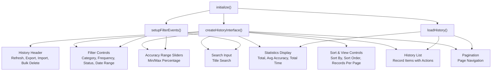

The interface is injected into `#practice-view` with a structure containing:

* Header with action buttons (Refresh, Export, Import, Bulk Delete)
* Multi-row filter controls (category, frequency, status, date range)
* Accuracy range sliders with live value display
* Search input with debounced query
* Statistics summary (total practices, average accuracy, total time, filtered count)
* Sort and pagination controls
* Record list container
* Pagination controls

**Sources:** [js/components/practiceHistory.js L228-L372](https://github.com/sallowayma-git/IELTS-practice/blob/df0c9b8f/js/components/practiceHistory.js#L228-L372)

### Record Loading and Data Flow

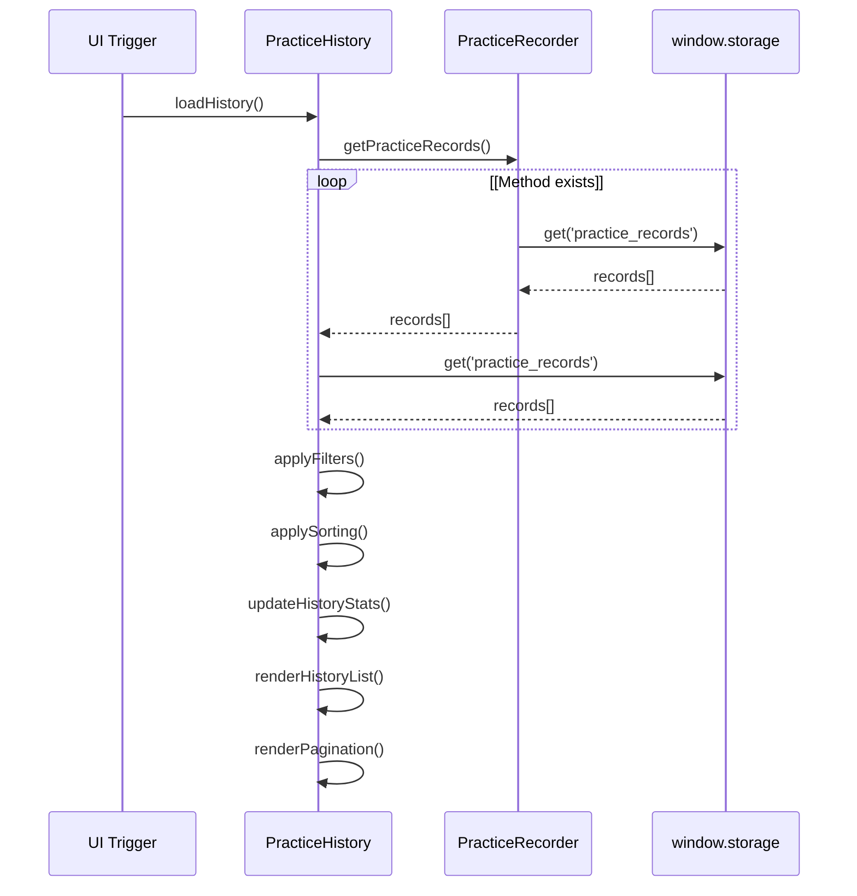

The loading process includes error handling and fallback mechanisms:

1. **Primary Path**: Attempts to use `practiceRecorder.getPracticeRecords()` method
2. **Fallback Path**: Directly accesses `window.storage.get('practice_records')` if recorder unavailable
3. **Type Safety**: Validates that returned data is an array before assignment
4. **State Reset**: Clears selected set and updates bulk action UI

**Sources:** [js/components/practiceHistory.js L496-L527](https://github.com/sallowayma-git/IELTS-practice/blob/df0c9b8f/js/components/practiceHistory.js#L496-L527)

### Filtering System

The filtering system supports multiple dimensions of record filtering with real-time updates:

| Filter Type | Options | Implementation |
| --- | --- | --- |
| **Category** | `all`, `P1`, `P2`, `P3` | Exact match on `record.metadata.category` |
| **Frequency** | `all`, `high`, `low` | Exact match on `record.metadata.frequency` |
| **Status** | `all`, `completed`, `interrupted` | Exact match on `record.status` |
| **Date Range** | `all`, `today`, `week`, `month`, `custom` | Time-based filtering with custom range support |
| **Accuracy Range** | 0-100% (dual sliders) | Filters records where accuracy falls within min/max bounds |
| **Search Query** | Text input (debounced) | Case-insensitive substring match on exam title and ID |

#### Date Range Filter Implementation

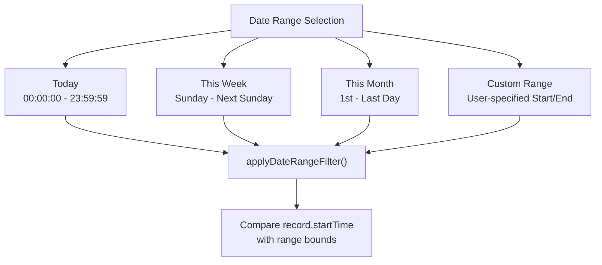

The custom date range shows additional date inputs when selected, with an "Apply" button to trigger filtering.

**Sources:** [js/components/practiceHistory.js L539-L643](https://github.com/sallowayma-git/IELTS-practice/blob/df0c9b8f/js/components/practiceHistory.js#L539-L643)

### Record Rendering Strategies

The component uses two rendering strategies based on the number of records and available performance optimizations:

#### Strategy 1: Virtual Scrolling (Large Lists)

Used when `window.performanceOptimizer` is available and more than 10 records need rendering:

```

```

#### Strategy 2: DocumentFragment (Standard Lists)

Used for smaller lists or when virtual scrolling is unavailable:

```

```

Both strategies maintain compatibility with `practiceHistoryEnhancer` by checking if the `createRecordItem()` method has been modified and falling back to HTML string parsing if needed.

**Sources:** [js/components/practiceHistory.js L773-L849](https://github.com/sallowayma-git/IELTS-practice/blob/df0c9b8f/js/components/practiceHistory.js#L773-L849)

### Record Item Structure

Each record item displays comprehensive information in a structured layout:

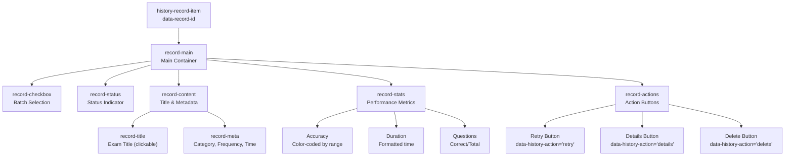

The accuracy value is color-coded using CSS classes:

* `accuracy-excellent`: ≥80%
* `accuracy-good`: 60-79%
* `accuracy-needs-improvement`: <60%

**Sources:** [js/components/practiceHistory.js L854-L917](https://github.com/sallowayma-git/IELTS-practice/blob/df0c9b8f/js/components/practiceHistory.js#L854-L917)

 [js/components/practiceHistory.js L922-L1053](https://github.com/sallowayma-git/IELTS-practice/blob/df0c9b8f/js/components/practiceHistory.js#L922-L1053)

### Pagination Implementation

The pagination system divides filtered records into pages and provides navigation controls:

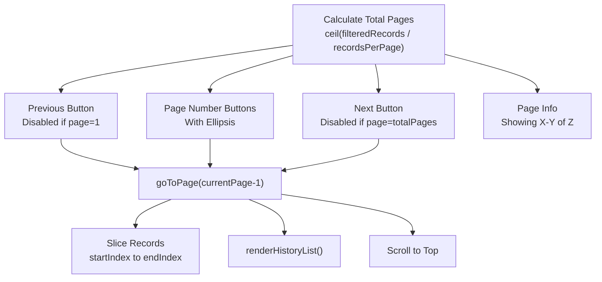

The pagination shows up to 5 page buttons at a time, centered around the current page, with ellipsis indicators when there are more pages before or after.

**Sources:** [js/components/practiceHistory.js L1058-L1143](https://github.com/sallowayma-git/IELTS-practice/blob/df0c9b8f/js/components/practiceHistory.js#L1058-L1143)

### Bulk Operations

The component supports batch selection and deletion of records:

1. **Selection Tracking**: `selectedSet` stores record IDs as strings
2. **UI Updates**: Bulk delete button visibility toggled based on selection count
3. **Deletion Process**: * Confirms with user * Filters records from storage * Updates both `currentRecords` and `filteredRecords` * Triggers UI refresh and syncs with global state

**Sources:** [js/components/practiceHistory.js L1182-L1243](https://github.com/sallowayma-git/IELTS-practice/blob/df0c9b8f/js/components/practiceHistory.js#L1182-L1243)

---

## PracticeRecordModal Component

The `PracticeRecordModal` class provides a detailed view of individual practice records, including answer breakdowns and performance metrics.

### Modal Structure and Display

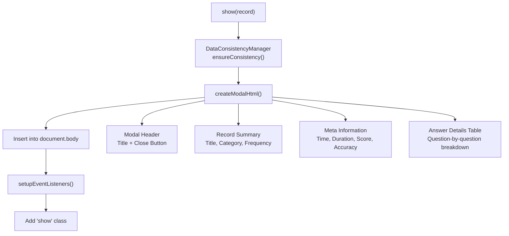

The modal uses a global reference (`window.practiceRecordModal`) for event delegation compatibility and includes a `showById()` method for lookup by record ID.

**Sources:** [js/components/practiceRecordModal.js L17-L56](https://github.com/sallowayma-git/IELTS-practice/blob/df0c9b8f/js/components/practiceRecordModal.js#L17-L56)

 [js/components/practiceRecordModal.js L704-L719](https://github.com/sallowayma-git/IELTS-practice/blob/df0c9b8f/js/components/practiceRecordModal.js#L704-L719)

### Answer Table Generation

The modal generates different table structures based on the data available in the record:

#### For Suite Practice Records

When `record.suiteEntries` exists, the modal creates separate sections for each exam in the suite:

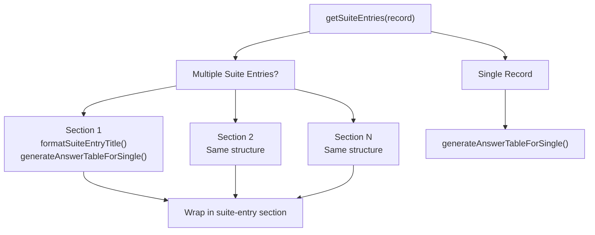

**Sources:** [js/components/practiceRecordModal.js L146-L167](https://github.com/sallowayma-git/IELTS-practice/blob/df0c9b8f/js/components/practiceRecordModal.js#L146-L167)

#### Answer Comparison Data Flow

The modal prioritizes `answerComparison` data when available, merging it with corrections from multiple sources:

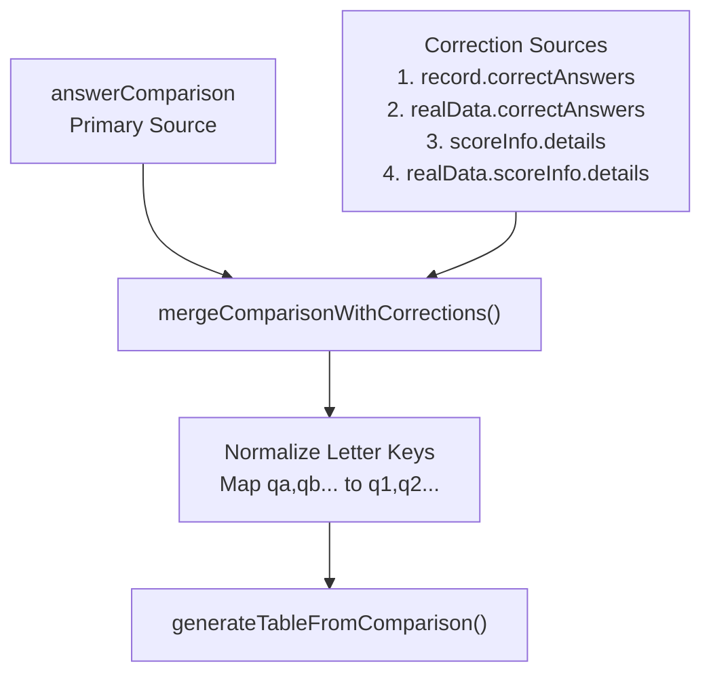

The normalization step is crucial for handling exams that use letter-based question identifiers (qa, qb, qc...) and mapping them to numeric questions (q1, q2, q3...) based on contiguous ranges.

**Sources:** [js/components/practiceRecordModal.js L242-L283](https://github.com/sallowayma-git/IELTS-practice/blob/df0c9b8f/js/components/practiceRecordModal.js#L242-L283)

 [js/components/practiceRecordModal.js L342-L429](https://github.com/sallowayma-git/IELTS-practice/blob/df0c9b8f/js/components/practiceRecordModal.js#L342-L429)

#### Fallback Answer Table

When `answerComparison` is unavailable, the modal constructs the table from answers and correct answers:

```

```

**Sources:** [js/components/practiceRecordModal.js L169-L237](https://github.com/sallowayma-git/IELTS-practice/blob/df0c9b8f/js/components/practiceRecordModal.js#L169-L237)

### Answer Formatting and Display

The modal includes intelligent answer formatting:

| Feature | Implementation |
| --- | --- |
| **Truncation** | Answers >50 characters are truncated with "..." suffix |
| **Tooltips** | Full answer text shown in `title` attribute |
| **Visual Indicators** | ✓ for correct, ✗ for incorrect |
| **Color Coding** | CSS classes `.correct` and `.incorrect` applied to rows |
| **Empty Handling** | Displays "No Answer" for missing user answers |

**Sources:** [js/components/practiceRecordModal.js L214-L228](https://github.com/sallowayma-git/IELTS-practice/blob/df0c9b8f/js/components/practiceRecordModal.js#L214-L228)

### Correctness Detection Sources

The `getCorrectAnswers()` method searches multiple locations in priority order:

1. **Top-level**: `record.correctAnswers`
2. **Real data**: `record.realData.correctAnswers`
3. **Answer comparison**: Extracted from `record.answerComparison[key].correctAnswer`
4. **Score info details**: `record.scoreInfo.details[key].correctAnswer`
5. **Real data score info**: `record.realData.scoreInfo.details[key].correctAnswer`

This cascading approach ensures maximum data recovery even from legacy or partially-populated records.

**Sources:** [js/components/practiceRecordModal.js L448-L497](https://github.com/sallowayma-git/IELTS-practice/blob/df0c9b8f/js/components/practiceRecordModal.js#L448-L497)

---

## Statistics and Dashboard Display

Both components include statistics calculations and display:

### PracticeHistory Statistics

The history view displays aggregate statistics in the header:

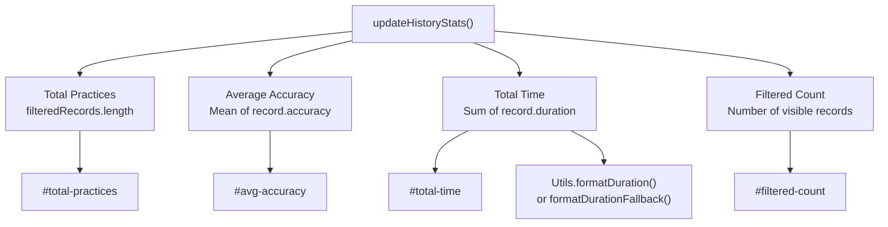

The time formatting includes fallback logic when `window.Utils` is unavailable:

```

```

**Sources:** [js/components/practiceHistory.js L684-L713](https://github.com/sallowayma-git/IELTS-practice/blob/df0c9b8f/js/components/practiceHistory.js#L684-L713)

### Record Detail Statistics

The modal displays per-record statistics:

* **Basic Info**: Title, category, frequency, status
* **Time Info**: Start time, end time, duration
* **Score Info**: Accuracy (color-coded), total questions, correct count, incorrect count
* **Question Type Performance** (if available): Breakdown by question type with individual accuracy

**Sources:** [js/components/practiceRecordModal.js L72-L143](https://github.com/sallowayma-git/IELTS-practice/blob/df0c9b8f/js/components/practiceRecordModal.js#L72-L143)

---

## Export and Import Operations

### Export Functionality

The `PracticeHistory` component provides export in JSON format:

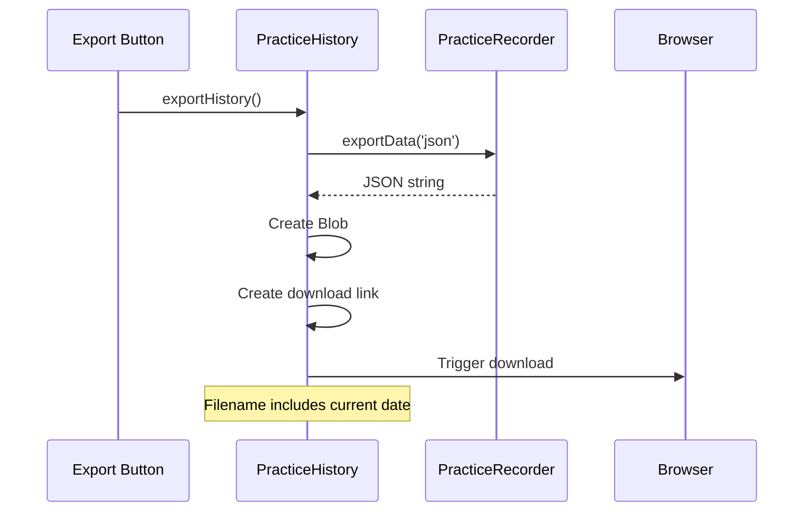

**Sources:** [js/components/practiceHistory.js L1693-L1720](https://github.com/sallowayma-git/IELTS-practice/blob/df0c9b8f/js/components/practiceHistory.js#L1693-L1720)

### Import Functionality

The import process supports two modes:

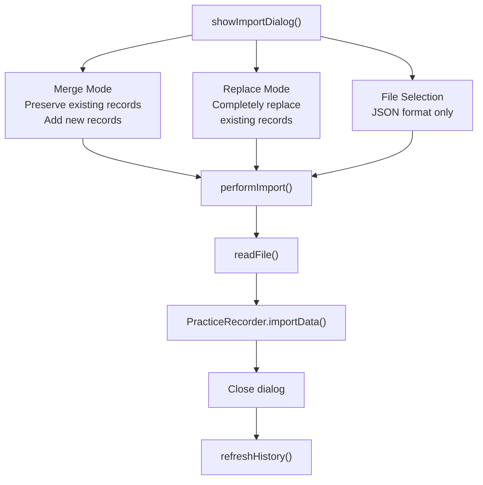

The import process includes:

1. Modal UI for mode selection
2. File input (restricted to `.json` files)
3. File reading using `FileReader`
4. Delegation to `PracticeRecorder.importData()` with merge option
5. UI refresh on success

**Sources:** [js/components/practiceHistory.js L1725-L1818](https://github.com/sallowayma-git/IELTS-practice/blob/df0c9b8f/js/components/practiceHistory.js#L1725-L1818)

### Single Record Export

The `PracticeRecordModal` includes a `exportSingle()` method (referenced but not in provided code) for exporting individual records, likely in Markdown format based on references to `MarkdownExporter`.

**Sources:** [js/components/practiceRecordModal.js L610-L655](https://github.com/sallowayma-git/IELTS-practice/blob/df0c9b8f/js/components/practiceRecordModal.js#L610-L655)

---

## Event Handling and Interactivity

### Event Delegation Strategy

Both components implement event delegation patterns for performance and compatibility:

```

```

**Sources:** [js/components/practiceHistory.js L164-L202](https://github.com/sallowayma-git/IELTS-practice/blob/df0c9b8f/js/components/practiceHistory.js#L164-L202)

### Filter Event Handling

Filter controls use both event delegation (when available) and direct event binding with fallback logic:

```

```

The search input uses debouncing (300ms) to avoid excessive filtering during typing.

**Sources:** [js/components/practiceHistory.js L412-L475](https://github.com/sallowayma-git/IELTS-practice/blob/df0c9b8f/js/components/practiceHistory.js#L412-L475)

### Modal Event Handling

The `PracticeRecordModal` uses similar delegation patterns with fallback support:

```

```

**Sources:** [js/components/practiceRecordModal.js L660-L697](https://github.com/sallowayma-git/IELTS-practice/blob/df0c9b8f/js/components/practiceRecordModal.js#L660-L697)

---

## Performance Optimizations

### Virtual Scrolling Integration

When rendering more than 10 records, the component can leverage `window.performanceOptimizer.createVirtualScroller()`:

```

```

This approach only renders visible items plus a buffer, significantly improving performance for large record sets.

**Sources:** [js/components/practiceHistory.js L794-L823](https://github.com/sallowayma-git/IELTS-practice/blob/df0c9b8f/js/components/practiceHistory.js#L794-L823)

### DOM Creation Methods

The component provides two DOM creation methods:

#### createRecordItem() - HTML String Method

Returns an HTML string for legacy compatibility and enhancer integration:

```

```

#### createRecordElement() - Direct DOM Method

Creates DOM elements directly for better performance:

```

```

The rendering logic detects if `practiceHistoryEnhancer` has modified `createRecordItem()` and chooses the appropriate method to maintain compatibility.

**Sources:** [js/components/practiceHistory.js L854-L917](https://github.com/sallowayma-git/IELTS-practice/blob/df0c9b8f/js/components/practiceHistory.js#L854-L917)

 [js/components/practiceHistory.js L922-L1053](https://github.com/sallowayma-git/IELTS-practice/blob/df0c9b8f/js/components/practiceHistory.js#L922-L1053)

### Fallback Utilities

Both components include fallback implementations for common utilities:

| Utility | Fallback Location | Purpose |
| --- | --- | --- |
| `formatDuration()` | `PracticeHistory.formatDurationFallback()` | Format seconds to human-readable time |
| `formatDate()` | `PracticeHistory.formatDateFallback()` | Format dates with custom patterns |
| `debounce()` | `PracticeHistory.debounce()` | Debounce function calls |
| `DOM.create()` | `PracticeHistory.createNode()` | Create DOM elements |
| `DOM.replaceContent()` | `PracticeHistory.replaceContent()` | Replace element contents |

These fallbacks ensure the components function even when utility libraries are unavailable.

**Sources:** [js/components/practiceHistory.js L41-L143](https://github.com/sallowayma-git/IELTS-practice/blob/df0c9b8f/js/components/practiceHistory.js#L41-L143)

 [js/components/practiceHistory.js L718-L768](https://github.com/sallowayma-git/IELTS-practice/blob/df0c9b8f/js/components/practiceHistory.js#L718-L768)

---

## Integration Points

### Data Layer Integration

```

```

### State Synchronization

After modifications, components trigger synchronization:

```

```

This ensures global state variables like `window.practiceRecords` remain synchronized with storage.

**Sources:** [js/components/practiceHistory.js L1235-L1237](https://github.com/sallowayma-git/IELTS-practice/blob/df0c9b8f/js/components/practiceHistory.js#L1235-L1237)

### Global References

Both components expose global references for cross-component communication:

```

```

**Sources:** [js/components/practiceRecordModal.js L11](https://github.com/sallowayma-git/IELTS-practice/blob/df0c9b8f/js/components/practiceRecordModal.js#L11-L11)

 [js/components/practiceRecordModal.js L701](https://github.com/sallowayma-git/IELTS-practice/blob/df0c9b8f/js/components/practiceRecordModal.js#L701-L701)

### Theme Integration

The history view respects theme settings managed by `ThemeManager`:

* Color schemes from CSS variables
* Font size adjustments from theme settings
* Reduced motion preferences
* High contrast mode support

The components don't directly interact with `ThemeManager` but rely on CSS class and variable changes.

**Sources:** [js/utils/themeManager.js L210-L236](https://github.com/sallowayma-git/IELTS-practice/blob/df0c9b8f/js/utils/themeManager.js#L210-L236)

---

## Data Consistency and Validation

### PracticeRecordModal Consistency Checks

The modal includes optional data consistency validation on display:

```

```

This ensures records have all required fields with proper default values before rendering.

**Sources:** [js/components/practiceRecordModal.js L19-L26](https://github.com/sallowayma-git/IELTS-practice/blob/df0c9b8f/js/components/practiceRecordModal.js#L19-L26)

### Field Compatibility Layer

The modal includes extensive compatibility logic to handle records with varying field structures:

```

```

This approach ensures compatibility with records created by different versions of the practice recorder.

**Sources:** [js/components/practiceRecordModal.js L74-L94](https://github.com/sallowayma-git/IELTS-practice/blob/df0c9b8f/js/components/practiceRecordModal.js#L74-L94)

---

## User Interactions and Action Handling

### Action Handler Dispatch

The `PracticeHistory` component centralizes action handling:

```

```

Actions are identified by `data-history-action` attributes on buttons.

**Sources:** [js/components/practiceHistory.js L1148-L1167](https://github.com/sallowayma-git/IELTS-practice/blob/df0c9b8f/js/components/practiceHistory.js#L1148-L1167)

### Retry Exam Functionality

The retry action delegates to the main application:

```

```

This maintains separation of concerns by letting the application core handle exam opening.

**Sources:** [js/components/practiceHistory.js L1172-L1178](https://github.com/sallowayma-git/IELTS-practice/blob/df0c9b8f/js/components/practiceHistory.js#L1172-L1178)

---

## Summary

The Practice History & Dashboard Views system provides a comprehensive, performant, and user-friendly interface for reviewing practice records. Key architectural features include:

* **Modular Component Design**: Separate components for list view (`PracticeHistory`) and detail view (`PracticeRecordModal`)
* **Flexible Filtering**: Multi-dimensional filtering with date ranges, accuracy sliders, and text search
* **Performance Optimization**: Virtual scrolling for large lists, DocumentFragment usage, event delegation
* **Data Resilience**: Multiple fallback paths for data loading, field compatibility layers, consistency validation
* **Export/Import Support**: JSON-based data exchange with merge and replace modes
* **Batch Operations**: Bulk selection and deletion with confirmation
* **Responsive Statistics**: Real-time calculation and display of aggregate metrics

The components integrate seamlessly with the broader application architecture through well-defined interfaces with the data layer, state management system, and core application controller.

**Sources:** [js/components/practiceHistory.js](https://github.com/sallowayma-git/IELTS-practice/blob/df0c9b8f/js/components/practiceHistory.js)

 [js/components/practiceRecordModal.js](https://github.com/sallowayma-git/IELTS-practice/blob/df0c9b8f/js/components/practiceRecordModal.js)

 [js/components/settingsPanel.js](https://github.com/sallowayma-git/IELTS-practice/blob/df0c9b8f/js/components/settingsPanel.js)