# Practice Page Enhancement & Data Collection

> **Relevant source files**
> * [js/app/examSessionMixin.js](https://github.com/sallowayma-git/IELTS-practice/blob/92f64eb8/js/app/examSessionMixin.js)
> * [js/app/suitePracticeMixin.js](https://github.com/sallowayma-git/IELTS-practice/blob/92f64eb8/js/app/suitePracticeMixin.js)
> * [js/practice-page-enhancer.js](https://github.com/sallowayma-git/IELTS-practice/blob/92f64eb8/js/practice-page-enhancer.js)
> * [js/services/GlobalStateService.js](https://github.com/sallowayma-git/IELTS-practice/blob/92f64eb8/js/services/GlobalStateService.js)
> * [js/utils/answerComparisonUtils.js](https://github.com/sallowayma-git/IELTS-practice/blob/92f64eb8/js/utils/answerComparisonUtils.js)

## Purpose and Scope

This document details the `practicePageEnhancer` script and its role in collecting user answers and extracting correct answers from exam pages. The enhancer is injected into exam windows during practice sessions to enable automatic data collection, answer comparison, and score calculation. For information about the overall practice session lifecycle, see [Practice Session Lifecycle & Management](/sallowayma-git/IELTS-practice/5.1-practice-session-lifecycle-and-management). For details on the communication protocol used by the enhancer, see [Cross-Window Communication Protocol](/sallowayma-git/IELTS-practice/5.3-cross-window-communication-protocol).

The enhancer provides:

* Automatic collection of user input from form elements
* Extraction of correct answers using multiple detection strategies
* Form submission interception to capture completion events
* Support for both single-exam and multi-suite practice modes
* Extensible mixin architecture for specialized practice scenarios

---

## Architecture Overview

The practice page enhancer acts as a data collection agent injected into exam windows. It operates independently in the exam window's context while communicating with the main application window via `postMessage`.

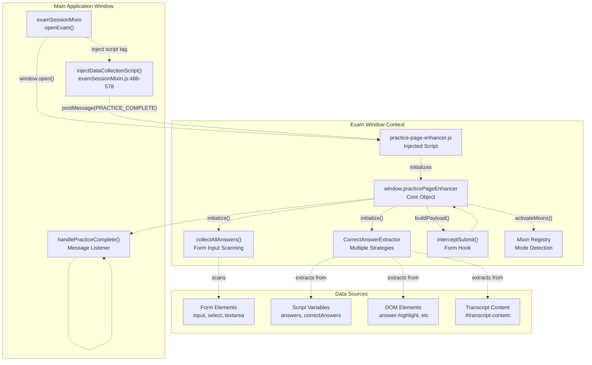

**Sources:** [js/practice-page-enhancer.js L1-L2300](https://github.com/sallowayma-git/IELTS-practice/blob/92f64eb8/js/practice-page-enhancer.js#L1-L2300)

 [js/app/examSessionMixin.js L486-L578](https://github.com/sallowayma-git/IELTS-practice/blob/92f64eb8/js/app/examSessionMixin.js#L486-L578)

---

## Script Injection Process

The enhancer script is injected by `examSessionMixin` when an exam window is opened. The injection process includes resilience mechanisms to handle various loading scenarios.

### Injection Flow

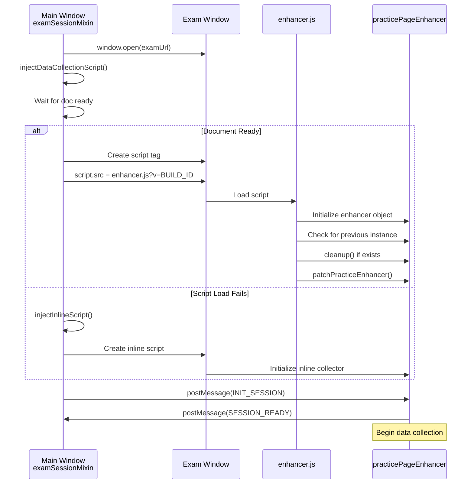

**Sources:** [js/app/examSessionMixin.js L486-L578](https://github.com/sallowayma-git/IELTS-practice/blob/92f64eb8/js/app/examSessionMixin.js#L486-L578)

 [js/practice-page-enhancer.js L6-L15](https://github.com/sallowayma-git/IELTS-practice/blob/92f64eb8/js/practice-page-enhancer.js#L6-L15)

### Injection Implementation

The injection logic attempts to load the external enhancer script with version tagging and falls back to an inline implementation if loading fails:

| Step | Implementation | Location |
| --- | --- | --- |
| **Script URL Resolution** | `_ensureAbsoluteUrl()` converts relative paths to absolute URLs with build ID query parameter | [js/app/examSessionMixin.js L487-L498](https://github.com/sallowayma-git/IELTS-practice/blob/92f64eb8/js/app/examSessionMixin.js#L487-L498) |
| **Document Ready Check** | `checkAndInject()` polls for `document.readyState` before injection | [js/app/examSessionMixin.js L561-L578](https://github.com/sallowayma-git/IELTS-practice/blob/92f64eb8/js/app/examSessionMixin.js#L561-L578) |
| **Script Element Creation** | Creates `<script defer>` element with `onload` and `onerror` handlers | [js/app/examSessionMixin.js L532-L554](https://github.com/sallowayma-git/IELTS-practice/blob/92f64eb8/js/app/examSessionMixin.js#L532-L554) |
| **Fallback Inline Script** | `injectInlineScript()` provides self-contained collector if external load fails | [js/app/examSessionMixin.js L584-L855](https://github.com/sallowayma-git/IELTS-practice/blob/92f64eb8/js/app/examSessionMixin.js#L584-L855) |

The inline fallback script is a simplified version that provides basic answer collection and suite mode guards without requiring external resources.

**Sources:** [js/app/examSessionMixin.js L486-L855](https://github.com/sallowayma-git/IELTS-practice/blob/92f64eb8/js/app/examSessionMixin.js#L486-L855)

---

## Core Enhancer Object Structure

The `window.practicePageEnhancer` object serves as the central coordinator for all data collection activities within the exam window.

### Object Properties

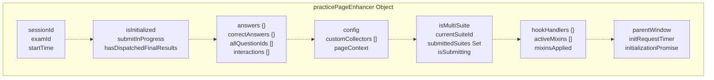

**Sources:** [js/practice-page-enhancer.js L888-L912](https://github.com/sallowayma-git/IELTS-practice/blob/92f64eb8/js/practice-page-enhancer.js#L888-L912)

### Key Properties Explained

| Property | Type | Purpose |
| --- | --- | --- |
| `sessionId` | String | Unique identifier for this practice session, set by `INIT_SESSION` message |
| `examId` | String | Exam identifier passed from parent window |
| `answers` | Object | User-submitted answers collected from form inputs, keyed by question ID |
| `correctAnswers` | Object | Correct answers extracted from page, keyed by question ID |
| `allQuestionIds` | Array | Ordered list of all question identifiers found on the page |
| `interactions` | Array | User interaction events captured during practice |
| `isMultiSuite` | Boolean | Detected via `detectMultiSuiteStructure()` - indicates page contains multiple test sections |
| `currentSuiteId` | String | Active suite identifier in multi-suite mode |
| `submittedSuites` | Set | Tracks which suites have been submitted to prevent duplicates |
| `hookHandlers` | Object | Registered hook functions for mixin extensibility |
| `config` | Object | Merged configuration from `DEFAULT_ENHANCER_CONFIG` and page overrides |

**Sources:** [js/practice-page-enhancer.js L888-L912](https://github.com/sallowayma-git/IELTS-practice/blob/92f64eb8/js/practice-page-enhancer.js#L888-L912)

---

## Configuration System

The enhancer uses a flexible configuration system that allows page-specific customization while providing sensible defaults.

### Default Configuration

The `DEFAULT_ENHANCER_CONFIG` defines exclusion patterns for elements that should not be treated as answer inputs:

```css
// From practice-page-enhancer.js:18-45
DEFAULT_ENHANCER_CONFIG = {
    autoInitialize: true,
    excludedSelectors: [
        '#volume-slider',
        '#playback-speed',
        '#notes-panel textarea',
        '#settings-panel input',
        '[data-answer-ignore="true"]'
    ],
    excludedAncestors: [
        '#speed-control',
        '#volume-container',
        '#notes-panel',
        '#settings-panel'
    ],
    excludedNames: ['timer', 'notes', 'note'],
    questionIdAttributes: [
        'name', 'id', 'data-question', 
        'data-question-id', 'data-qid', 'data-for'
    ],
    datasetExcludeAttribute: 'enhancerExclude'
}
```

**Sources:** [js/practice-page-enhancer.js L18-L45](https://github.com/sallowayma-git/IELTS-practice/blob/92f64eb8/js/practice-page-enhancer.js#L18-L45)

### Configuration Merging

The `mergeConfig()` function performs deep merging of configuration objects with array deduplication:

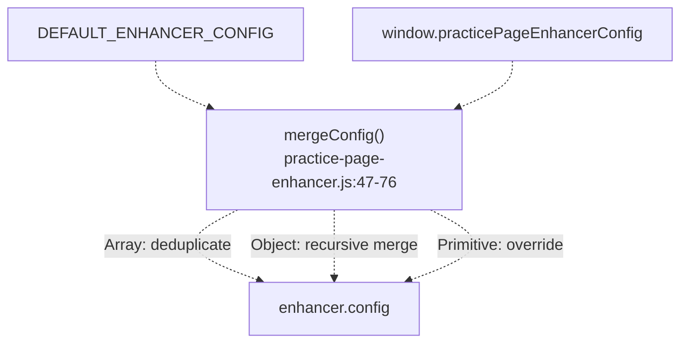

**Sources:** [js/practice-page-enhancer.js L47-L76](https://github.com/sallowayma-git/IELTS-practice/blob/92f64eb8/js/practice-page-enhancer.js#L47-L76)

 [js/practice-page-enhancer.js L288-L291](https://github.com/sallowayma-git/IELTS-practice/blob/92f64eb8/js/practice-page-enhancer.js#L288-L291)

---

## Page Context Detection

The enhancer automatically detects page characteristics to enrich practice records with metadata. The `getPracticePageContext()` function extracts information from the URL, document title, and page structure.

### Context Extraction Logic

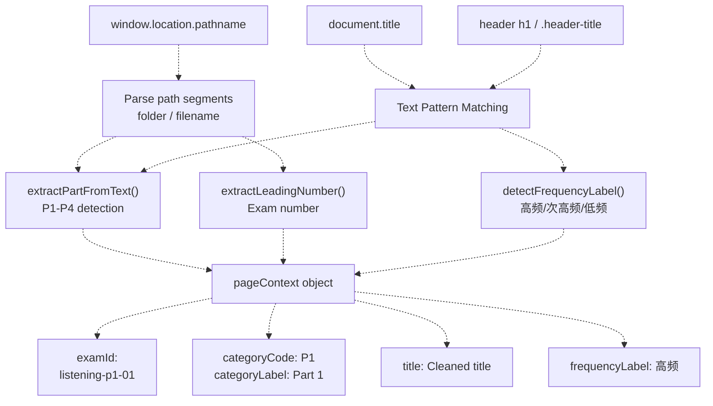

**Sources:** [js/practice-page-enhancer.js L336-L384](https://github.com/sallowayma-git/IELTS-practice/blob/92f64eb8/js/practice-page-enhancer.js#L336-L384)

### Extracted Context Fields

| Field | Extraction Strategy | Example |
| --- | --- | --- |
| `isListening` | Pattern match in pathname or title: `/listeningpractice/` or `"listening"` | `true` |
| `part` | Extract from "P1", "Part 1", "PART 1" patterns | `"1"` |
| `examNumber` | Leading digits from folder name or filename | `18` |
| `examId` | Constructed as `listening-p{part}-{paddedNumber}` | `"listening-p1-18"` |
| `title` | Cleaned from header/title, removing prefixes | `"Crime and Society"` |
| `categoryCode` | Normalized part code | `"P1"` |
| `frequencyLabel` | Detected from text: 高频/次高频/低频 | `"高频"` |

**Sources:** [js/practice-page-enhancer.js L336-L384](https://github.com/sallowayma-git/IELTS-practice/blob/92f64eb8/js/practice-page-enhancer.js#L336-L384)

---

## Answer Collection Strategies

The enhancer collects user answers from form elements using a multi-layered approach that handles various HTML structures and input types.

### Collection Architecture

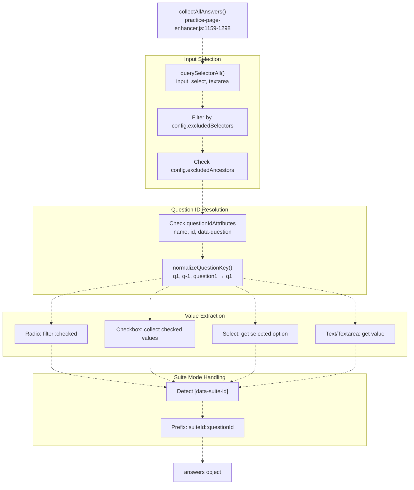

**Sources:** [js/practice-page-enhancer.js L1159-L1298](https://github.com/sallowayma-git/IELTS-practice/blob/92f64eb8/js/practice-page-enhancer.js#L1159-L1298)

### Question Key Normalization

The `normalizeQuestionKey()` function handles diverse question identifier formats:

```
// Examples of normalization:
// "Q1"           → "q1"
// "question-15"  → "q15"
// "15"           → "q15"
// "q1-anchor"    → "q1"
// "t2_q16"       → "q16"  (resource page format)
// "suite1::q5"   → "suite1::q5"  (multi-suite format)
```

The normalization process:

1. Removes `-anchor` and `-nav` suffixes
2. Handles suite separator `::` by recursively normalizing the question part
3. Extracts the last occurrence of `q\d+` pattern for resource page formats
4. Falls back to pure digit extraction with `q` prefix
5. Preserves letter-based keys like `qa`, `qb` for special question types

**Sources:** [js/practice-page-enhancer.js L456-L497](https://github.com/sallowayma-git/IELTS-practice/blob/92f64eb8/js/practice-page-enhancer.js#L456-L497)

### Input Element Filtering

Elements are excluded from collection if they match exclusion criteria:

| Exclusion Type | Check Method | Configuration Key |
| --- | --- | --- |
| **Direct Selector** | `element.matches(selector)` | `config.excludedSelectors` |
| **Ancestor Check** | `element.closest(selector)` | `config.excludedAncestors` |
| **Name Attribute** | `element.name` in set | `config.excludedNames` |
| **Dataset Flag** | `element.dataset[config.datasetExcludeAttribute]` | `config.datasetExcludeAttribute` |

**Sources:** [js/practice-page-enhancer.js L1159-L1298](https://github.com/sallowayma-git/IELTS-practice/blob/92f64eb8/js/practice-page-enhancer.js#L1159-L1298)

 [js/practice-page-enhancer.js L18-L45](https://github.com/sallowayma-git/IELTS-practice/blob/92f64eb8/js/practice-page-enhancer.js#L18-L45)

---

## Correct Answer Extraction

The enhancer embeds a complete `CorrectAnswerExtractor` class that attempts multiple strategies to find correct answers on the page. This enables automatic scoring without requiring server-side answer keys.

### Extraction Strategy Pipeline

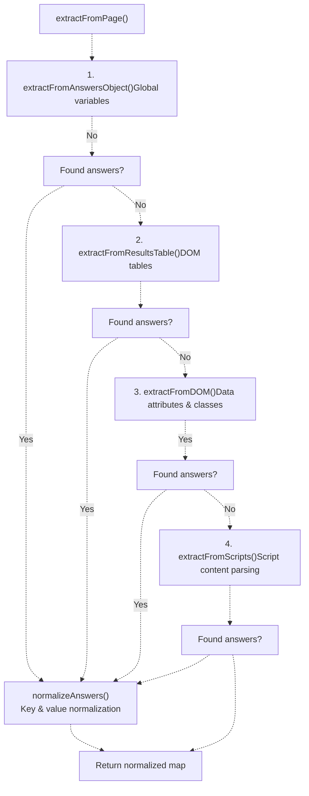

**Sources:** [js/practice-page-enhancer.js L591-L886](https://github.com/sallowayma-git/IELTS-practice/blob/92f64eb8/js/practice-page-enhancer.js#L591-L886)

### Strategy 1: Global Variables

Searches for answer objects in the window scope or as script variables:

```javascript
// Checked variable names (in priority order):
const possibleAnswerObjects = [
    'answers',
    'correctAnswers', 
    'examAnswers',
    'questionAnswers',
    'solutionAnswers'
];

// Also searches for script variable declarations:
// const correctAnswers = { q1: "answer1", ... }
// let answerKey = { q1: "answer1", ... }
// var answers = { q1: "answer1", ... }
```

**Sources:** [js/practice-page-enhancer.js L621-L668](https://github.com/sallowayma-git/IELTS-practice/blob/92f64eb8/js/practice-page-enhancer.js#L621-L668)

### Strategy 2: Results Tables

Parses HTML tables with answer information:

```javascript
// Selectors tried:
const selectors = [
    '.results-table',
    '.answer-table', 
    '.score-table',
    'table[class*="result"]',
    'table[class*="answer"]',
    '.exam-results table',
    '#results table'
];
```

For each table row, the extractor:

1. Finds the question ID from the first cell
2. Identifies the answer cell (marked with "correct", "answer", or positional heuristics)
3. Extracts and normalizes the answer text

**Sources:** [js/practice-page-enhancer.js L702-L795](https://github.com/sallowayma-git/IELTS-practice/blob/92f64eb8/js/practice-page-enhancer.js#L702-L795)

### Strategy 3: DOM Elements with Data Attributes

Searches for elements marked with answer-related attributes or classes:

```javascript
const answerSelectors = [
    '[data-correct-answer]',
    '.correct-answer',
    '.solution',
    '[class*="correct"]',
    '[id*="correct"]'
];
```

Additionally, this strategy includes specialized handling for listening practice transcript content:

```javascript
// For listening exams, extract from transcript
const transcript = document.getElementById('transcript-content');
if (transcript) {
    // Parse answers from .answer-highlight elements
    // Extract inline answer tags: (Q1: answer)
    const transcriptAnswers = extractAnswersFromTranscriptElement(
        transcript, 
        questionOrder
    );
}
```

**Sources:** [js/practice-page-enhancer.js L719-L748](https://github.com/sallowayma-git/IELTS-practice/blob/92f64eb8/js/practice-page-enhancer.js#L719-L748)

### Strategy 4: Script Content Parsing

Scans all `<script>` tags for JSON-like structures containing answers:

```javascript
// Pattern matching in script content:
const jsonMatch = content.match(
    /(?:answers?|correct)\s*[:=]\s*(\{[^}]+\}|\[[^\]]+\])/i
);

// If found, attempts JSON.parse or manual key-value extraction
```

**Sources:** [js/practice-page-enhancer.js L750-L771](https://github.com/sallowayma-git/IELTS-practice/blob/92f64eb8/js/practice-page-enhancer.js#L750-L771)

### Transcript Answer Extraction

For listening practice, the `extractAnswersFromTranscriptElement()` function provides specialized extraction:

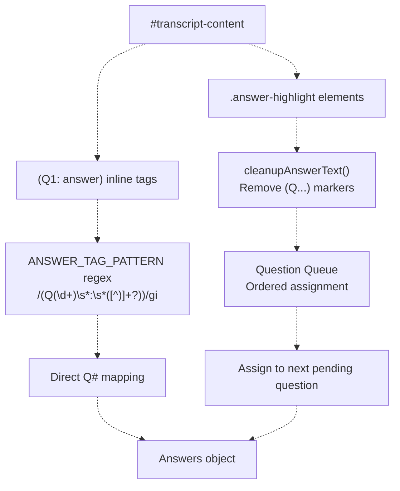

**Sources:** [js/practice-page-enhancer.js L546-L588](https://github.com/sallowayma-git/IELTS-practice/blob/92f64eb8/js/practice-page-enhancer.js#L546-L588)

 [js/practice-page-enhancer.js L435-L454](https://github.com/sallowayma-git/IELTS-practice/blob/92f64eb8/js/practice-page-enhancer.js#L435-L454)

### Answer Normalization

The `normalizeAnswers()` method standardizes extracted answers:

| Normalization | Input Examples | Output |
| --- | --- | --- |
| **Key Format** | `"1"`, `"Q1"`, `"question1"` | `"q1"` |
| **Boolean Values** | `"true"`, `"t"`, `"yes"`, `"y"`, `"正确"` | `"TRUE"` |
| **Boolean False** | `"false"`, `"f"`, `"no"`, `"n"`, `"错误"` | `"FALSE"` |
| **Multiple Choice** | `"a"`, `"B"`, `"c"` | `"A"`, `"B"`, `"C"` |
| **Whitespace** | `"  answer  "` | `"answer"` |

**Sources:** [js/practice-page-enhancer.js L857-L884](https://github.com/sallowayma-git/IELTS-practice/blob/92f64eb8/js/practice-page-enhancer.js#L857-L884)

---

## Form Interception

The enhancer intercepts form submissions to capture the completion event and trigger data transmission to the parent window.

### Interception Flow

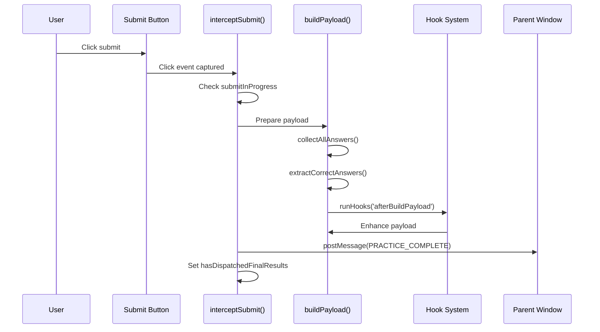

**Sources:** [js/practice-page-enhancer.js L1310-L1426](https://github.com/sallowayma-git/IELTS-practice/blob/92f64eb8/js/practice-page-enhancer.js#L1310-L1426)

### Submit Button Detection

The interceptor identifies submit buttons using multiple strategies:

```javascript
// Primary selectors:
const selectors = [
    'button[type="submit"]',
    'input[type="submit"]',
    'button[data-submit]',
    '.submit-btn',
    '[data-submit-suite]',      // Suite mode
    '.suite-submit-btn'          // Suite mode
];

// Fallback: Inline onclick handlers
const legacyButtons = document.querySelectorAll(
    'button[onclick*="submit"], button[onclick*="grade"]'
);
```

For multi-suite pages, the system detects per-suite submit buttons and tracks submitted suites to prevent duplicate submissions.

**Sources:** [js/practice-page-enhancer.js L1310-L1426](https://github.com/sallowayma-git/IELTS-practice/blob/92f64eb8/js/practice-page-enhancer.js#L1310-L1426)

 [js/practice-page-enhancer.js L1007-L1099](https://github.com/sallowayma-git/IELTS-practice/blob/92f64eb8/js/practice-page-enhancer.js#L1007-L1099)

### Event Handler Attachment

```javascript
// From practice-page-enhancer.js:1392-1424
submitButtons.forEach((btn) => {
    btn.addEventListener('click', (event) => {
        // Prevent duplicate submissions
        if (this.submitInProgress || this.hasDispatchedFinalResults) {
            console.warn('[PracticeEnhancer] Submission already in progress');
            event.preventDefault();
            return;
        }
        
        this.submitInProgress = true;
        
        // Build and send payload
        setTimeout(() => {
            try {
                this.handleSubmitEvent(event);
            } finally {
                this.submitInProgress = false;
            }
        }, 150);  // Brief delay for form state to settle
    }, { capture: true });
});
```

The `capture: true` option ensures the handler runs before any other submit handlers on the page.

**Sources:** [js/practice-page-enhancer.js L1392-L1424](https://github.com/sallowayma-git/IELTS-practice/blob/92f64eb8/js/practice-page-enhancer.js#L1392-L1424)

---

## Mixin System for Extensibility

The enhancer supports a mixin architecture that allows specialized behavior for different practice modes without modifying the core implementation.

### Mixin Architecture

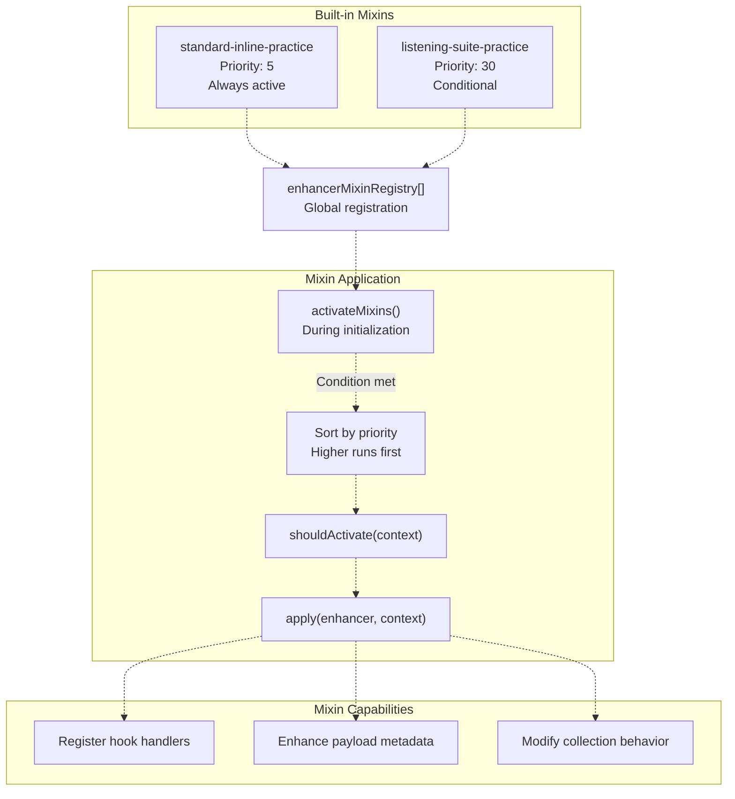

**Sources:** [js/practice-page-enhancer.js L154-L192](https://github.com/sallowayma-git/IELTS-practice/blob/92f64eb8/js/practice-page-enhancer.js#L154-L192)

 [js/practice-page-enhancer.js L937-L949](https://github.com/sallowayma-git/IELTS-practice/blob/92f64eb8/js/practice-page-enhancer.js#L937-L949)

### Mixin Interface

Each mixin must implement this structure:

| Property | Type | Purpose |
| --- | --- | --- |
| `name` | String | Identifier for logging |
| `priority` | Number | Execution order (higher = earlier) |
| `shouldActivate(context, enhancer)` | Function | Returns boolean - whether to apply this mixin |
| `apply(enhancer, context)` | Function | Modifies enhancer behavior via hook registration |

**Sources:** [js/practice-page-enhancer.js L154-L192](https://github.com/sallowayma-git/IELTS-practice/blob/92f64eb8/js/practice-page-enhancer.js#L154-L192)

### Standard Inline Practice Mixin

The default mixin applied to all pages:

```javascript
// From practice-page-enhancer.js:194-221
{
    name: 'standard-inline-practice',
    priority: 5,
    shouldActivate() { return true; },
    apply(enhancer, context) {
        enhancer.registerHook('afterBuildPayload', (payload) => {
            payload.metadata = payload.metadata || {};
            if (!payload.metadata.practiceMode) {
                payload.metadata.practiceMode = 'single';
            }
            if (!payload.metadata.variant) {
                payload.metadata.variant = context.isListening
                    ? 'listening-inline'
                    : 'reading-inline';
            }
        });
    }
}
```

This mixin ensures all payloads have baseline metadata about practice mode and variant.

**Sources:** [js/practice-page-enhancer.js L194-L221](https://github.com/sallowayma-git/IELTS-practice/blob/92f64eb8/js/practice-page-enhancer.js#L194-L221)

### Listening Suite Practice Mixin

The suite mixin activates when multi-suite structure is detected:

```javascript
// From practice-page-enhancer.js:223-272
{
    name: 'listening-suite-practice',
    priority: 30,  // Higher priority = runs first
    shouldActivate() {
        // Detect suite indicators
        if (document.querySelector('[data-submit-suite]')) return true;
        if (document.querySelectorAll('[data-suite-id]').length > 1) return true;
        if (document.querySelectorAll('.test-page').length > 1) return true;
        return false;
    },
    apply(enhancer) {
        const suiteCount = document.querySelectorAll('[data-suite-id]').length;
        
        enhancer.registerHook('afterBuildPayload', (payload) => {
            payload.metadata.practiceMode = 'suite';
            payload.metadata.variant = 'listening-inline';
            payload.metadata.totalSuites = suiteCount;
            payload.practiceMode = 'suite';
        });
        
        enhancer.registerHook('afterSuiteMessageBuilt', (payload) => {
            payload.metadata.practiceMode = 'suite';
            payload.metadata.totalSuites = suiteCount;
        });
    }
}
```

**Sources:** [js/practice-page-enhancer.js L223-L272](https://github.com/sallowayma-git/IELTS-practice/blob/92f64eb8/js/practice-page-enhancer.js#L223-L272)

### Hook System

Mixins register handlers for lifecycle hooks:

```javascript
// Available hooks:
// - afterBuildPayload: Modify final payload before sending
// - afterSuiteMessageBuilt: Enhance suite-specific messages
// - beforeSendMessage: Intercept before postMessage
// - beforeCollectAnswers: Pre-collection customization
// - afterCollectAnswers: Post-collection processing

// Hook registration:
enhancer.registerHook('afterBuildPayload', (payload) => {
    // Modify payload
});

// Hook execution (in enhancer):
this.runHooks('afterBuildPayload', payload);
```

**Sources:** [js/practice-page-enhancer.js L913-L936](https://github.com/sallowayma-git/IELTS-practice/blob/92f64eb8/js/practice-page-enhancer.js#L913-L936)

---

## Multi-Suite Detection and Handling

For pages containing multiple test sections (e.g., "100 P1/P4" with 10 listening tests), the enhancer provides sophisticated multi-suite detection and per-suite submission tracking.

### Detection Logic

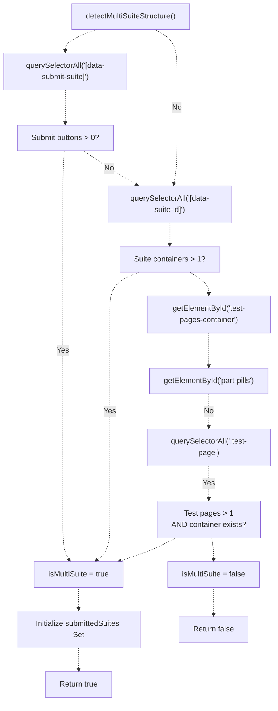

**Sources:** [js/practice-page-enhancer.js L1007-L1099](https://github.com/sallowayma-git/IELTS-practice/blob/92f64eb8/js/practice-page-enhancer.js#L1007-L1099)

### Per-Suite Submission Tracking

When a suite is submitted, the enhancer:

1. **Identifies the suite:** Extracts `data-suite-id` from the submit button or closest container
2. **Checks duplicate:** Verifies suite ID is not in `submittedSuites` Set
3. **Builds suite payload:** Includes `suiteId`, scoped answers with `suiteId::questionId` keys
4. **Sends message:** `postMessage({ type: 'PRACTICE_COMPLETE', data: { suiteId, ... } })`
5. **Records submission:** Adds suite ID to `submittedSuites` Set

```javascript
// From practice-page-enhancer.js:1485-1557 (simplified)
async handleSuiteSubmit(suiteId, event) {
    // Prevent duplicate submissions
    if (this.submittedSuites.has(suiteId)) {
        console.warn('[PracticeEnhancer] Suite already submitted:', suiteId);
        return;
    }
    
    // Mark as submitting
    this.isSubmitting = true;
    
    try {
        // Collect suite-scoped answers
        const suiteAnswers = this.collectSuiteAnswers(suiteId);
        const correctAnswers = this.getSuiteCorrectAnswers(suiteId);
        
        // Build suite payload
        const payload = {
            suiteId: suiteId,
            sessionId: this.sessionId,
            examId: this.examId,
            answers: suiteAnswers,
            correctAnswers: correctAnswers,
            // ... other fields
        };
        
        // Send to parent
        this.sendMessage('PRACTICE_COMPLETE', payload);
        
        // Mark as submitted
        this.submittedSuites.add(suiteId);
        
    } finally {
        this.isSubmitting = false;
    }
}
```

**Sources:** [js/practice-page-enhancer.js L1485-L1557](https://github.com/sallowayma-git/IELTS-practice/blob/92f64eb8/js/practice-page-enhancer.js#L1485-L1557)

### Suite Answer Scoping

In multi-suite mode, question IDs are prefixed with the suite ID to avoid collisions:

```
// Standard mode:
{ "q1": "answer1", "q2": "answer2" }

// Multi-suite mode:
{ 
    "test1::q1": "answer1",
    "test1::q2": "answer2",
    "test2::q1": "answer1",
    "test2::q2": "answer2"
}
```

The scoping is applied during answer collection by detecting the `data-suite-id` attribute on the input element or its ancestors.

**Sources:** [js/practice-page-enhancer.js L1159-L1298](https://github.com/sallowayma-git/IELTS-practice/blob/92f64eb8/js/practice-page-enhancer.js#L1159-L1298)

---

## Payload Construction

The enhancer builds a comprehensive payload containing all collected data when practice is completed. The `buildPayload()` method aggregates information from multiple sources.

### Payload Structure

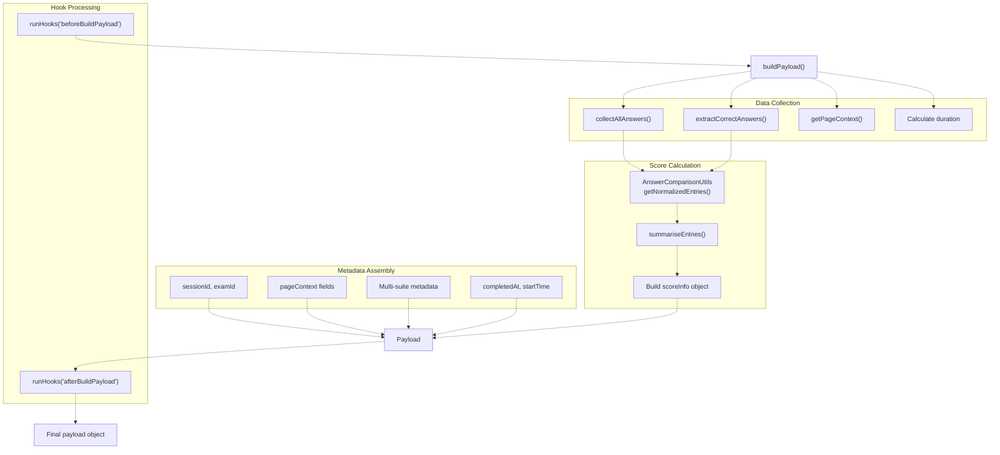

**Sources:** [js/practice-page-enhancer.js L1428-L1557](https://github.com/sallowayma-git/IELTS-practice/blob/92f64eb8/js/practice-page-enhancer.js#L1428-L1557)

### Core Payload Fields

| Field | Type | Source | Purpose |
| --- | --- | --- | --- |
| `sessionId` | String | Set by `INIT_SESSION` message | Links payload to practice session |
| `examId` | String | Set by `INIT_SESSION` message | Identifies the exam |
| `answers` | Object | `collectAllAnswers()` | User-submitted answers |
| `correctAnswers` | Object | `extractCorrectAnswers()` | Correct answers from page |
| `answerComparison` | Object | `AnswerComparisonUtils.getNormalizedEntries()` | Per-question comparison results |
| `scoreInfo` | Object | `AnswerComparisonUtils.summariseEntries()` | Aggregate score statistics |
| `duration` | Number | `(Date.now() - startTime) / 1000` | Practice duration in seconds |
| `completedAt` | String | `new Date().toISOString()` | Completion timestamp |
| `interactions` | Array | Captured during practice | User interaction log |
| `metadata` | Object | Combined from multiple sources | Enriched exam metadata |

**Sources:** [js/practice-page-enhancer.js L1428-L1557](https://github.com/sallowayma-git/IELTS-practice/blob/92f64eb8/js/practice-page-enhancer.js#L1428-L1557)

### Metadata Enrichment

The `metadata` object includes enriched information from page context:

```yaml
metadata: {
    examId: this.examId,
    sessionId: this.sessionId,
    examTitle: pageContext.title,
    category: pageContext.categoryCode,      // "P1", "P2", "P3"
    categoryLabel: pageContext.categoryLabel, // "Part 1"
    frequency: pageContext.frequencyLabel,    // "高频", "次高频", "低频"
    practiceMode: 'single',  // or 'suite' (set by mixins)
    variant: 'listening-inline',  // or 'reading-inline'
    source: 'practice_enhancer',
    completedAt: new Date().toISOString()
}
```

**Sources:** [js/practice-page-enhancer.js L1428-L1557](https://github.com/sallowayma-git/IELTS-practice/blob/92f64eb8/js/practice-page-enhancer.js#L1428-L1557)

 [js/practice-page-enhancer.js L336-L384](https://github.com/sallowayma-git/IELTS-practice/blob/92f64eb8/js/practice-page-enhancer.js#L336-L384)

### Score Information Structure

The `scoreInfo` object provides detailed accuracy metrics:

```yaml
scoreInfo: {
    correct: 7,          // Number of correct answers
    total: 10,           // Total questions
    incorrect: 2,        // Number of incorrect answers
    unanswered: 1,       // Questions left blank
    accuracy: 0.7,       // Fraction correct (0-1)
    percentage: 70,      // Percentage correct (0-100)
    source: 'answer_comparison_utils'
}
```

This information is calculated by `AnswerComparisonUtils` (see [Answer Normalization & Score Calculation](/sallowayma-git/IELTS-practice/5.6-answer-normalization-and-score-calculation)) which handles complex answer normalization and comparison logic.

**Sources:** [js/practice-page-enhancer.js L1428-L1557](https://github.com/sallowayma-git/IELTS-practice/blob/92f64eb8/js/practice-page-enhancer.js#L1428-L1557)

 [js/utils/answerComparisonUtils.js L526-L561](https://github.com/sallowayma-git/IELTS-practice/blob/92f64eb8/js/utils/answerComparisonUtils.js#L526-L561)

---

## Integration with Session Management

The enhancer communicates with the parent window via the `postMessage` API, following a defined protocol for session initialization, progress updates, and completion notification.

### Communication Flow

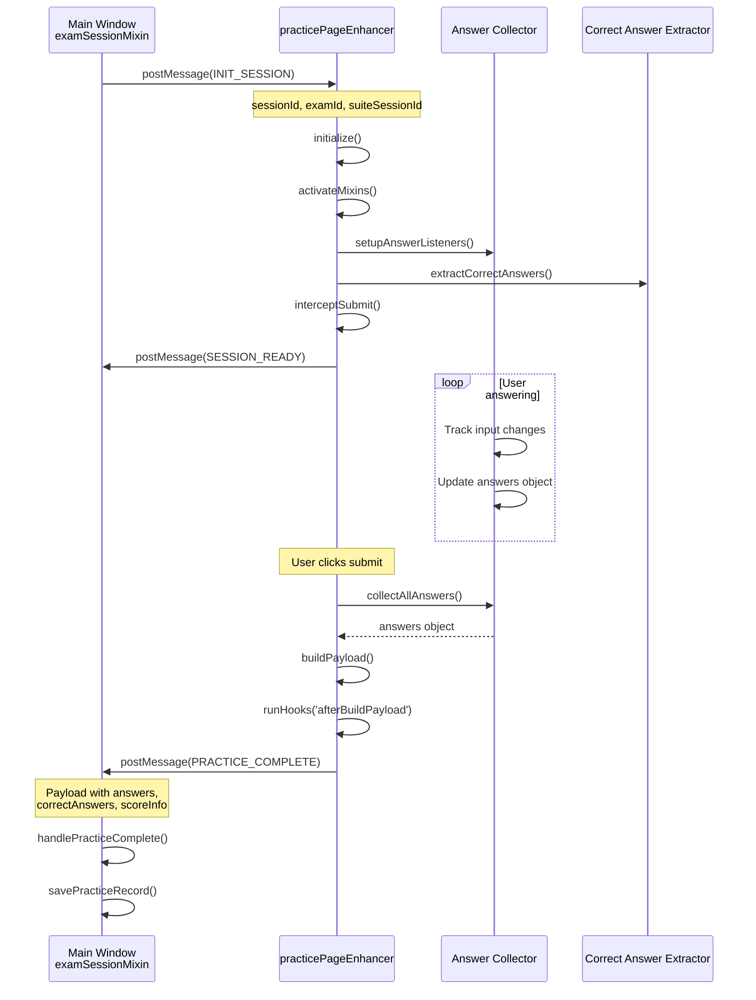

**Sources:** [js/practice-page-enhancer.js L951-L1001](https://github.com/sallowayma-git/IELTS-practice/blob/92f64eb8/js/practice-page-enhancer.js#L951-L1001)

 [js/practice-page-enhancer.js L1102-L1157](https://github.com/sallowayma-git/IELTS-practice/blob/92f64eb8/js/practice-page-enhancer.js#L1102-L1157)

### Message Types

| Message Type | Direction | Purpose | Key Data |
| --- | --- | --- | --- |
| `INIT_SESSION` | Parent → Enhancer | Initialize practice session | `sessionId`, `examId`, `suiteSessionId` |
| `SESSION_READY` | Enhancer → Parent | Confirm initialization complete | `sessionId`, `url`, `title` |
| `PROGRESS_UPDATE` | Enhancer → Parent | Periodic answer updates (optional) | `answers`, `timestamp` |
| `PRACTICE_COMPLETE` | Enhancer → Parent | Submit final results | Full payload with all data |
| `SUITE_NAVIGATE` | Parent → Enhancer | Navigate to next exam in suite | `url`, `examId` |

**Sources:** [js/practice-page-enhancer.js L1102-L1157](https://github.com/sallowayma-git/IELTS-practice/blob/92f64eb8/js/practice-page-enhancer.js#L1102-L1157)

### Session Initialization Handler

The enhancer responds to `INIT_SESSION` messages to establish the session:

```typescript
// From practice-page-enhancer.js:1102-1157
window.addEventListener('message', (event) => {
    const message = event.data;
    if (!message || message.type !== 'INIT_SESSION') return;
    
    const data = message.data || {};
    
    // Store session identifiers
    this.sessionId = data.sessionId || this.sessionId;
    this.examId = data.examId || this.examId;
    this.parentWindow = event.source;
    
    // Handle suite mode
    if (data.suiteSessionId) {
        this.isSuiteMode = true;
        this.suiteSessionId = data.suiteSessionId;
    }
    
    // Begin initialization
    this.initialize()
        .then(() => {
            // Send ready confirmation
            this.sendMessage('SESSION_READY', {
                sessionId: this.sessionId,
                examId: this.examId,
                url: window.location.href,
                title: document.title
            });
        })
        .catch((error) => {
            console.error('[PracticeEnhancer] Initialization failed:', error);
        });
});
```

**Sources:** [js/practice-page-enhancer.js L1102-L1157](https://github.com/sallowayma-git/IELTS-practice/blob/92f64eb8/js/practice-page-enhancer.js#L1102-L1157)

### Completion Message Sending

```javascript
// From practice-page-enhancer.js:1681-1717
sendMessage(type, data) {
    if (!this.parentWindow) {
        console.warn('[PracticeEnhancer] No parent window reference');
        return false;
    }
    
    try {
        // Run pre-send hooks
        this.runHooks('beforeSendMessage', type, data);
        
        // Construct message
        const message = {
            type: type,
            data: data || {},
            timestamp: Date.now(),
            source: 'practice_page_enhancer'
        };
        
        // Send via postMessage
        this.parentWindow.postMessage(message, '*');
        
        console.log('[PracticeEnhancer] Sent message:', type);
        return true;
        
    } catch (error) {
        console.error('[PracticeEnhancer] Failed to send message:', error);
        return false;
    }
}
```

**Sources:** [js/practice-page-enhancer.js L1681-L1717](https://github.com/sallowayma-git/IELTS-practice/blob/92f64eb8/js/practice-page-enhancer.js#L1681-L1717)

---

## Summary

The practice page enhancer provides a comprehensive data collection system that:

1. **Injects cleanly** into exam windows with fallback resilience
2. **Collects answers** from diverse HTML form structures with smart filtering
3. **Extracts correct answers** using multiple strategies (global variables, DOM elements, scripts, tables, transcripts)
4. **Detects page context** automatically from URL and content
5. **Intercepts submissions** to capture completion events
6. **Supports multi-suite mode** with per-suite tracking and scoped question IDs
7. **Provides extensibility** via mixin system with hook-based customization
8. **Builds rich payloads** with answers, correct answers, scores, and metadata
9. **Communicates reliably** with parent window via postMessage protocol

The enhancer serves as the critical data collection agent that enables the IELTS practice system to automatically score exams, track progress, and provide detailed feedback without requiring server-side infrastructure.

**Key Components:**

* `window.practicePageEnhancer` - Core object [js/practice-page-enhancer.js L888-L912](https://github.com/sallowayma-git/IELTS-practice/blob/92f64eb8/js/practice-page-enhancer.js#L888-L912)
* `collectAllAnswers()` - Input scanning [js/practice-page-enhancer.js L1159-L1298](https://github.com/sallowayma-git/IELTS-practice/blob/92f64eb8/js/practice-page-enhancer.js#L1159-L1298)
* `CorrectAnswerExtractor` - Multi-strategy extraction [js/practice-page-enhancer.js L591-L886](https://github.com/sallowayma-git/IELTS-practice/blob/92f64eb8/js/practice-page-enhancer.js#L591-L886)
* `interceptSubmit()` - Form capture [js/practice-page-enhancer.js L1310-L1426](https://github.com/sallowayma-git/IELTS-practice/blob/92f64eb8/js/practice-page-enhancer.js#L1310-L1426)
* `buildPayload()` - Data aggregation [js/practice-page-enhancer.js L1428-L1557](https://github.com/sallowayma-git/IELTS-practice/blob/92f64eb8/js/practice-page-enhancer.js#L1428-L1557)
* `activateMixins()` - Extensibility [js/practice-page-enhancer.js L937-L949](https://github.com/sallowayma-git/IELTS-practice/blob/92f64eb8/js/practice-page-enhancer.js#L937-L949)