# Practice Page Enhancement & Data Collection

> **Relevant source files**
> * [js/practice-page-enhancer.js](https://github.com/sallowayma-git/IELTS-practice/blob/68771116/js/practice-page-enhancer.js)

## Purpose and Scope

This document explains the practice page enhancement system, which runs inside exam windows to capture user answers, extract correct answers, and track user interactions during practice sessions. The enhancer is injected into exam pages and serves as the data collection agent that feeds information back to the parent application window.

For information about how the collected data is persisted and processed after collection, see [PracticeRecorder & ScoreStorage](/sallowayma-git/IELTS-practice/5.1-practicerecorder-and-scorestorage). For details about the communication protocol between the enhancer and parent window, see [Cross-Window Communication Protocol](/sallowayma-git/IELTS-practice/5.3-cross-window-communication-protocol). For exam window lifecycle management, see [Exam Window Management & Resource Resolution](/sallowayma-git/IELTS-practice/5.5-exam-window-management-and-resource-resolution).

**Sources:** [js/practice-page-enhancer.js L1-L10](https://github.com/sallowayma-git/IELTS-practice/blob/68771116/js/practice-page-enhancer.js#L1-L10)

## System Architecture

The practice page enhancer operates as an injected script within exam windows, creating a global `window.practicePageEnhancer` object that manages all data collection activities. It embeds a `CorrectAnswerExtractor` class for extracting answer keys and establishes bidirectional communication with the parent window.

### Core Components

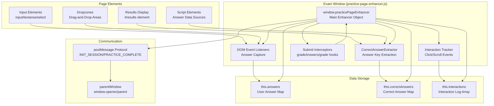

**Sources:** [js/practice-page-enhancer.js L298-L361](https://github.com/sallowayma-git/IELTS-practice/blob/68771116/js/practice-page-enhancer.js#L298-L361)

 [js/practice-page-enhancer.js L19-L296](https://github.com/sallowayma-git/IELTS-practice/blob/68771116/js/practice-page-enhancer.js#L19-L296)

### Initialization Sequence

The enhancer initializes automatically when the page loads, setting up all monitoring systems and establishing communication with the parent window.

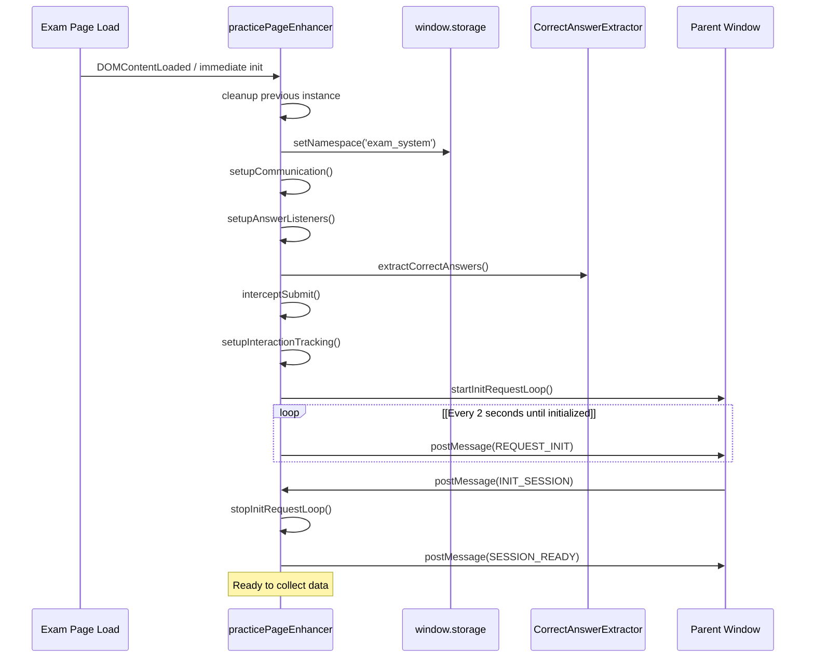

**Sources:** [js/practice-page-enhancer.js L309-L361](https://github.com/sallowayma-git/IELTS-practice/blob/68771116/js/practice-page-enhancer.js#L309-L361)

 [js/practice-page-enhancer.js L372-L418](https://github.com/sallowayma-git/IELTS-practice/blob/68771116/js/practice-page-enhancer.js#L372-L418)

 [js/practice-page-enhancer.js L420-L450](https://github.com/sallowayma-git/IELTS-practice/blob/68771116/js/practice-page-enhancer.js#L420-L450)

## CorrectAnswerExtractor System

The `CorrectAnswerExtractor` class provides multiple strategies for extracting correct answers from exam pages, which may store answer keys in various formats and locations.

### Extraction Strategy Chain

The extractor tries strategies in order until one succeeds:

| Priority | Strategy | Method | Target |
| --- | --- | --- | --- |
| 1 | Global Objects | `extractFromAnswersObject()` | `window.answers`, `window.correctAnswers`, etc. |
| 2 | Results Tables | `extractFromResultsTable()` | `.results-table`, `.answer-table` |
| 3 | DOM Attributes | `extractFromDOM()` | `[data-correct-answer]`, `.correct-answer` |
| 4 | Script Content | `extractFromScripts()` | Parse script tags for JSON/object literals |

**Sources:** [js/practice-page-enhancer.js L20-L47](https://github.com/sallowayma-git/IELTS-practice/blob/68771116/js/practice-page-enhancer.js#L20-L47)

### Strategy 1: Global Answer Objects

Searches for answer data in global JavaScript variables:

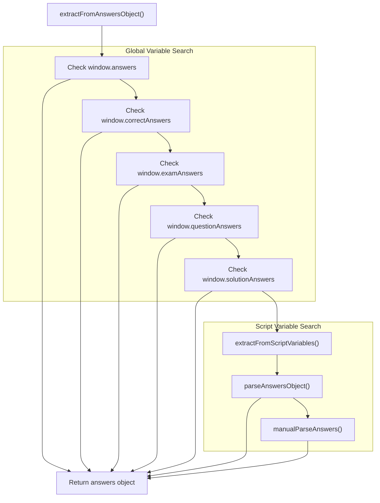

The method searches for common variable names and falls back to parsing script content if direct variable access fails.

**Sources:** [js/practice-page-enhancer.js L49-L64](https://github.com/sallowayma-git/IELTS-practice/blob/68771116/js/practice-page-enhancer.js#L49-L64)

 [js/practice-page-enhancer.js L66-L120](https://github.com/sallowayma-git/IELTS-practice/blob/68771116/js/practice-page-enhancer.js#L66-L120)

### Strategy 2: Results Table Extraction

Parses answer tables that appear after submission:

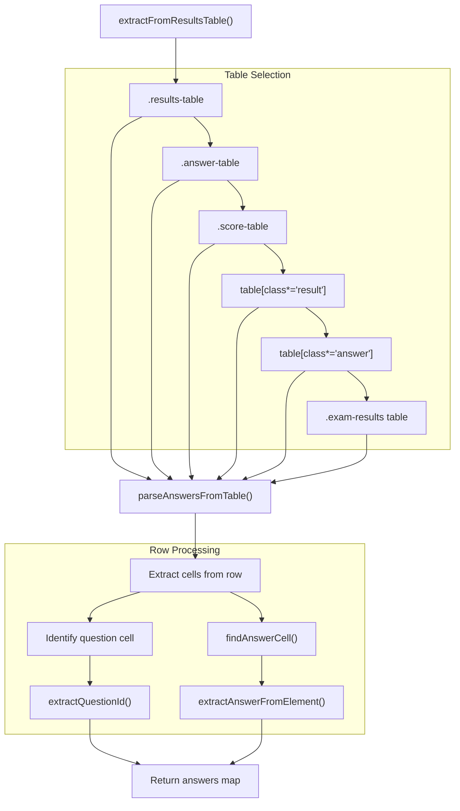

This strategy is particularly effective for exams that display a comparison table after submission showing user answers alongside correct answers.

**Sources:** [js/practice-page-enhancer.js L122-L221](https://github.com/sallowayma-git/IELTS-practice/blob/68771116/js/practice-page-enhancer.js#L122-L221)

 [js/practice-page-enhancer.js L715-L769](https://github.com/sallowayma-git/IELTS-practice/blob/68771116/js/practice-page-enhancer.js#L715-L769)

### Strategy 3: DOM Attribute Extraction

Searches for correct answers stored in DOM element attributes:

The method queries for elements with answer-related attributes and classes:

* `[data-correct-answer]`
* `.correct-answer`
* `.solution`
* `[class*="correct"]`
* `[id*="correct"]`

For each element found, it extracts the question ID using `extractQuestionId()` and the answer value using `extractAnswerFromElement()`.

**Sources:** [js/practice-page-enhancer.js L139-L158](https://github.com/sallowayma-git/IELTS-practice/blob/68771116/js/practice-page-enhancer.js#L139-L158)

 [js/practice-page-enhancer.js L686-L713](https://github.com/sallowayma-git/IELTS-practice/blob/68771116/js/practice-page-enhancer.js#L686-L713)

### Strategy 4: Script Content Parsing

Parses JavaScript in `<script>` tags to find answer data:

The extractor searches script content for patterns like:

```
answers = {...}
correct = {...}
```

It attempts JSON parsing and falls back to regex-based extraction when structured parsing fails.

**Sources:** [js/practice-page-enhancer.js L160-L181](https://github.com/sallowayma-git/IELTS-practice/blob/68771116/js/practice-page-enhancer.js#L160-L181)

### Answer Normalization

All extracted answers are normalized to ensure consistency:

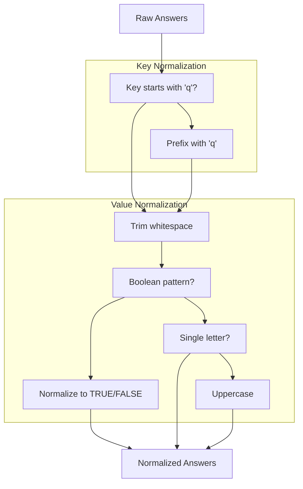

Normalization rules:

* Question keys are prefixed with 'q' if not already present
* Boolean values (true/false/yes/no) are normalized to 'TRUE'/'FALSE'
* Single letter answers are uppercased (A→A, b→B)
* All string values are trimmed

**Sources:** [js/practice-page-enhancer.js L267-L294](https://github.com/sallowayma-git/IELTS-practice/blob/68771116/js/practice-page-enhancer.js#L267-L294)

## Answer Collection Mechanisms

The enhancer uses multiple mechanisms to capture user answers as they interact with the exam page.

### Event Listener System

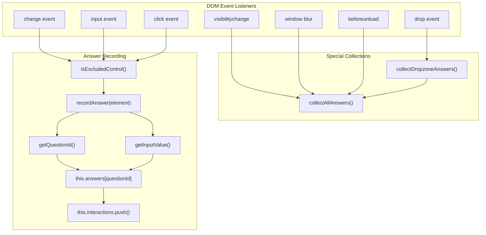

**Sources:** [js/practice-page-enhancer.js L771-L829](https://github.com/sallowayma-git/IELTS-practice/blob/68771116/js/practice-page-enhancer.js#L771-L829)

### Excluded Controls

The enhancer filters out non-answer UI controls to avoid capturing unrelated user interactions:

```
// Example excluded controls
#volume-slider
#playback-speed
#speed-control (container)
#volume-container (container)
```

This prevents audio player controls, speed adjustments, and other UI elements from being recorded as exam answers.

**Sources:** [js/practice-page-enhancer.js L831-L844](https://github.com/sallowayma-git/IELTS-practice/blob/68771116/js/practice-page-enhancer.js#L831-L844)

### Question ID Extraction

The `getQuestionId()` method uses multiple strategies to identify which question an input element belongs to:

| Priority | Source | Example |
| --- | --- | --- |
| 1 | `element.name` | `name="q1"` |
| 2 | `element.id` | `id="q1_input"` → `q1` |
| 3 | `data-question` | `data-question="q1"` |
| 4 | `data-for` | `data-for="q1"` |
| 5 | Parent element | Search up DOM tree |
| 6 | Associated label | `<label for="input1">Question 1</label>` |

**Sources:** [js/practice-page-enhancer.js L1105-L1130](https://github.com/sallowayma-git/IELTS-practice/blob/68771116/js/practice-page-enhancer.js#L1105-L1130)

### Comprehensive Collection Strategy

The `collectAllAnswers()` method performs a complete scan of the page:

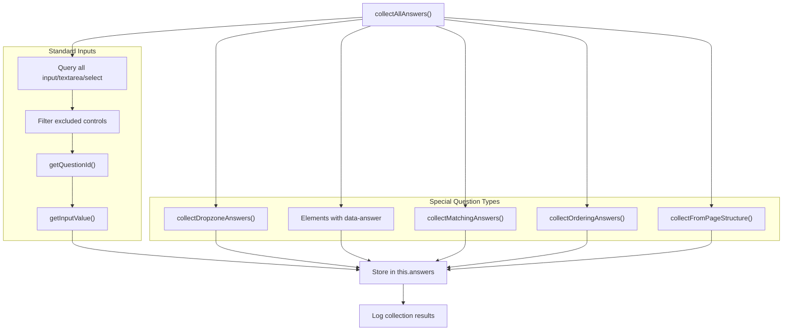

This multi-pronged approach ensures answers are captured regardless of the exam's HTML structure.

**Sources:** [js/practice-page-enhancer.js L1049-L1103](https://github.com/sallowayma-git/IELTS-practice/blob/68771116/js/practice-page-enhancer.js#L1049-L1103)

### Drag-and-Drop Answer Collection

Specialized collection for drag-and-drop question types:

**Dropzone Types:**

1. **Standard dropzones** (`.dropzone`): Collects cards dropped into zones
2. **Paragraph dropzones** (`.paragraph-dropzone`): Collects headings matched to paragraphs
3. **Match dropzones** (`.match-dropzone`): Collects items matched to targets

**Sources:** [js/practice-page-enhancer.js L887-L925](https://github.com/sallowayma-git/IELTS-practice/blob/68771116/js/practice-page-enhancer.js#L887-L925)

### Matching and Ordering Questions

Special collectors for interactive question formats:

**Matching Questions:**

* Searches for `.matching-container`, `.match-exercise`
* Extracts pairs from `.match-pair`, `.matched-item`
* Reads `data-question` and `data-answer` attributes

**Ordering Questions:**

* Searches for `.ordering-container`, `.sort-exercise`
* Collects ordered items from `.order-item`, `.sortable-item`
* Joins values with comma separation

**Sources:** [js/practice-page-enhancer.js L1167-L1200](https://github.com/sallowayma-git/IELTS-practice/blob/68771116/js/practice-page-enhancer.js#L1167-L1200)

## Submit Interception and Data Capture

The enhancer intercepts exam submission to capture final answers and scores before sending data to the parent window.

### Interception Points

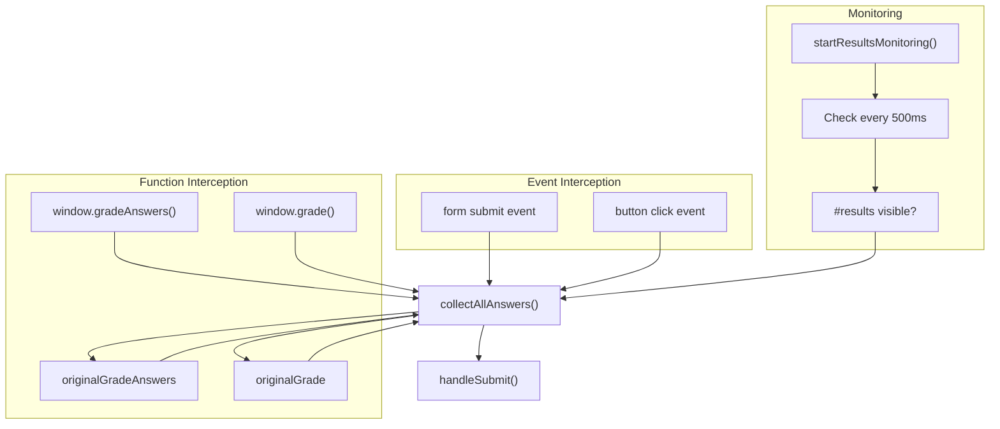

The enhancer wraps native grading functions to intercept calls, while also monitoring the DOM for results display.

**Sources:** [js/practice-page-enhancer.js L927-L991](https://github.com/sallowayma-git/IELTS-practice/blob/68771116/js/practice-page-enhancer.js#L927-L991)

 [js/practice-page-enhancer.js L1024-L1047](https://github.com/sallowayma-git/IELTS-practice/blob/68771116/js/practice-page-enhancer.js#L1024-L1047)

### Submit Button Detection

Button click events are monitored for submission indicators:

```
// Detection criteria
button.textContent includes: 'Submit', '提交', '完成', 'Check'
button.classList contains: 'primary'
button.id === 'submit-btn'
button.onclick contains: 'grade'
```

**Sources:** [js/practice-page-enhancer.js L969-L985](https://github.com/sallowayma-git/IELTS-practice/blob/68771116/js/practice-page-enhancer.js#L969-L985)

### Score Extraction

The `extractScore()` method parses score information from the results display using multiple pattern matching strategies:

| Pattern | Example | Extracted Data |
| --- | --- | --- |
| Final Score | `Final Score: 85% (11/13)` | correct: 11, total: 13, percentage: 85 |
| Simple Score | `Score: 11/13` | correct: 11, total: 13, calculated % |
| Accuracy Percent | `Accuracy: 85%` | percentage: 85 |
| Standalone Percent | `85%` | percentage: 85 |
| Table Cells | `.result-correct` vs `.result-incorrect` | count correct/incorrect cells |

**Sources:** [js/practice-page-enhancer.js L1321-L1433](https://github.com/sallowayma-git/IELTS-practice/blob/68771116/js/practice-page-enhancer.js#L1321-L1433)

### Data Submission Flow

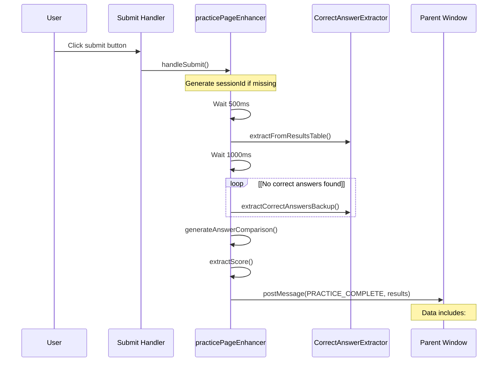

The submission handler includes deliberate delays to ensure the results display is fully rendered and correct answers are available before data collection.

**Sources:** [js/practice-page-enhancer.js L1225-L1276](https://github.com/sallowayma-git/IELTS-practice/blob/68771116/js/practice-page-enhancer.js#L1225-L1276)

## Interaction Tracking

The enhancer logs user interactions to provide context about how the user engaged with the exam.

### Tracked Events

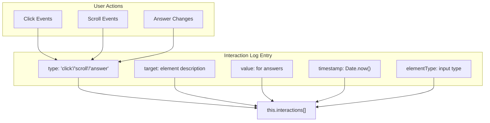

**Interaction Types:**

* **click**: Tracks clicks with target element tag and class
* **scroll**: Records scroll position with 500ms debouncing
* **answer**: Records answer changes with question ID and value

**Sources:** [js/practice-page-enhancer.js L1202-L1223](https://github.com/sallowayma-git/IELTS-practice/blob/68771116/js/practice-page-enhancer.js#L1202-L1223)

 [js/practice-page-enhancer.js L876-L884](https://github.com/sallowayma-git/IELTS-practice/blob/68771116/js/practice-page-enhancer.js#L876-L884)

## Answer Comparison and Validation

The enhancer generates a comprehensive comparison between user answers and correct answers.

### Comparison Generation

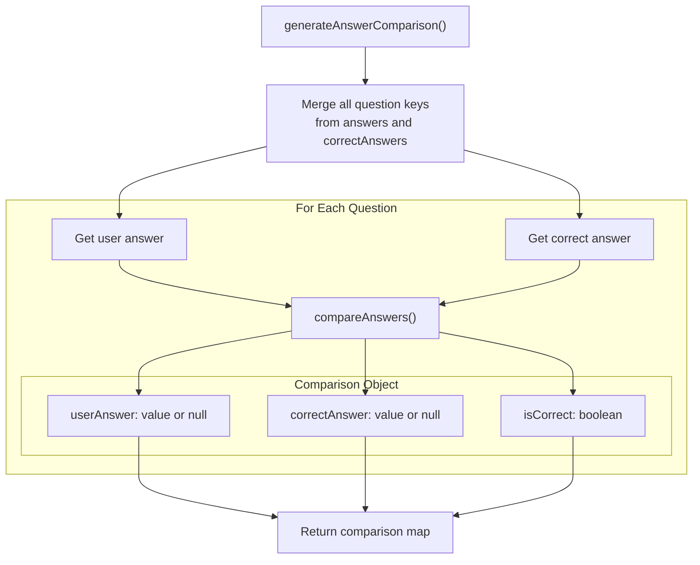

Example comparison output:

```json
{
  "q1": {
    "userAnswer": "A",
    "correctAnswer": "B",
    "isCorrect": false
  },
  "q2": {
    "userAnswer": "TRUE",
    "correctAnswer": "TRUE",
    "isCorrect": true
  }
}
```

**Sources:** [js/practice-page-enhancer.js L1278-L1309](https://github.com/sallowayma-git/IELTS-practice/blob/68771116/js/practice-page-enhancer.js#L1278-L1309)

### Answer Comparison Algorithm

The `compareAnswers()` method normalizes and compares answers:

1. **Null check**: Returns `false` if either answer is missing
2. **Normalization**: Converts both to lowercase trimmed strings
3. **Equality check**: Returns `true` only if normalized values match

This ensures that minor formatting differences (e.g., "A" vs " a ") don't cause false mismatches.

**Sources:** [js/practice-page-enhancer.js L1311-L1319](https://github.com/sallowayma-git/IELTS-practice/blob/68771116/js/practice-page-enhancer.js#L1311-L1319)

## Suite Mode Integration

The enhancer supports suite practice mode, where multiple exams are taken in sequence in the same window.

### Suite Mode Features

```

```

**Sources:** [js/practice-page-enhancer.js L452-L568](https://github.com/sallowayma-git/IELTS-practice/blob/68771116/js/practice-page-enhancer.js#L452-L568)

### Window Guard System

Suite mode installs guards to prevent accidental window closure:

**Intercepted Functions:**

* `window.close()`: Blocked and notifies parent
* `window.self.close()`: Blocked and notifies parent
* `window.top.close()`: Blocked and notifies parent
* `window.open(url, target)`: Blocks self-targeting opens

**Self-Target Detection:**
The guard identifies self-targeting opens by checking if the target matches:

* `_self`, `self`, `_parent`, `parent`, `_top`, `top`
* Empty string or null
* Current window name

**Sources:** [js/practice-page-enhancer.js L462-L517](https://github.com/sallowayma-git/IELTS-practice/blob/68771116/js/practice-page-enhancer.js#L462-L517)

### Suite Navigation Handling

When the parent sends a `SUITE_NAVIGATE` message, the enhancer:

1. Stores the next exam ID if provided
2. Navigates to the new URL via `window.location.href`
3. Maintains suite mode state across navigation

**Sources:** [js/practice-page-enhancer.js L554-L568](https://github.com/sallowayma-git/IELTS-practice/blob/68771116/js/practice-page-enhancer.js#L554-L568)

## Communication Protocol Integration

The enhancer implements a robust initialization protocol with the parent window.

### Initialization Request Loop

```

```

This polling mechanism ensures the enhancer can establish communication even if the parent window's message listener isn't immediately ready.

**Sources:** [js/practice-page-enhancer.js L420-L450](https://github.com/sallowayma-git/IELTS-practice/blob/68771116/js/practice-page-enhancer.js#L420-L450)

### Exam ID Derivation

If the parent doesn't provide an exam ID, the enhancer derives one from the URL and title:

**URL Pattern Matching:**

```yaml
URL: .../97. P3 - The value of literary prizes 文学奖项的价值/...
Extracted: p3-97
```

**Title Pattern Matching:**

```yaml
Title: P2 - Some topic
Extracted: p2-some-topic
```

**Fallback:**
Returns page type (P1/P2/P3/unknown)

**Sources:** [js/practice-page-enhancer.js L585-L618](https://github.com/sallowayma-git/IELTS-practice/blob/68771116/js/practice-page-enhancer.js#L585-L618)

## Data Delivery Structure

The complete data package sent via `PRACTICE_COMPLETE` message:

```yaml
{
  // Session identification
  sessionId: "session_12345_abc",
  examId: "p2-42",
  derivedExamId: "p2-42",
  originalExamId: "p2-42",
  suiteSessionId: "suite_xyz123" | null,
  
  // Timing information
  startTime: 1699876543210,
  endTime: 1699876783450,
  duration: 240, // seconds
  
  // Answer data
  answers: {
    "q1": "B",
    "q2": "TRUE",
    "q3": "habitat"
  },
  correctAnswers: {
    "q1": "A",
    "q2": "TRUE",
    "q3": "habitat"
  },
  answerComparison: {
    "q1": {
      "userAnswer": "B",
      "correctAnswer": "A",
      "isCorrect": false
    },
    "q2": {
      "userAnswer": "TRUE",
      "correctAnswer": "TRUE",
      "isCorrect": true
    }
  },
  
  // Score information
  scoreInfo: {
    correct: 11,
    total: 13,
    accuracy: 0.846,
    percentage: 85,
    source: "final_score_extraction"
  },
  
  // Interaction log
  interactions: [
    {type: "answer", questionId: "q1", value: "B", timestamp: 1699876555000},
    {type: "click", target: "BUTTON.primary", timestamp: 1699876780000}
  ],
  
  // Page metadata
  pageType: "P2",
  url: "https://example.com/exam/p2.html",
  title: "P2 - Sample Exam"
}
```

**Sources:** [js/practice-page-enhancer.js L1253-L1270](https://github.com/sallowayma-git/IELTS-practice/blob/68771116/js/practice-page-enhancer.js#L1253-L1270)

## Debugging and Diagnostic Tools

The enhancer provides global debugging functions:

### Available Debug Functions

| Function | Purpose | Returns |
| --- | --- | --- |
| `window.collectAnswersNow()` | Manually trigger answer collection | User answers object |
| `window.getCorrectAnswers()` | Extract correct answers | Correct answers object |
| `window.debugPracticeEnhancer()` | Print comprehensive debug info | Console output |
| `window.practicePageEnhancer.getStatus()` | Get current enhancer status | Status object |

### Status Object Structure

```yaml
{
  isInitialized: true,
  sessionId: "session_123",
  hasParentWindow: true,
  answersCount: 13,
  correctAnswersCount: 13,
  interactionsCount: 47,
  pageType: "P2"
}
```

**Sources:** [js/practice-page-enhancer.js L1470-L1504](https://github.com/sallowayma-git/IELTS-practice/blob/68771116/js/practice-page-enhancer.js#L1470-L1504)

## Cleanup and Resource Management

The enhancer implements cleanup to prevent memory leaks and conflicts when multiple instances run:

### Cleanup Process

```

```

**Cleanup Actions:**

* Clears answer collection intervals
* Stops initialization request loop
* Removes event listeners (via beforeunload)

**Sources:** [js/practice-page-enhancer.js L7-L14](https://github.com/sallowayma-git/IELTS-practice/blob/68771116/js/practice-page-enhancer.js#L7-L14)

 [js/practice-page-enhancer.js L363-L370](https://github.com/sallowayma-git/IELTS-practice/blob/68771116/js/practice-page-enhancer.js#L363-L370)

 [js/practice-page-enhancer.js L815-L820](https://github.com/sallowayma-git/IELTS-practice/blob/68771116/js/practice-page-enhancer.js#L815-L820)