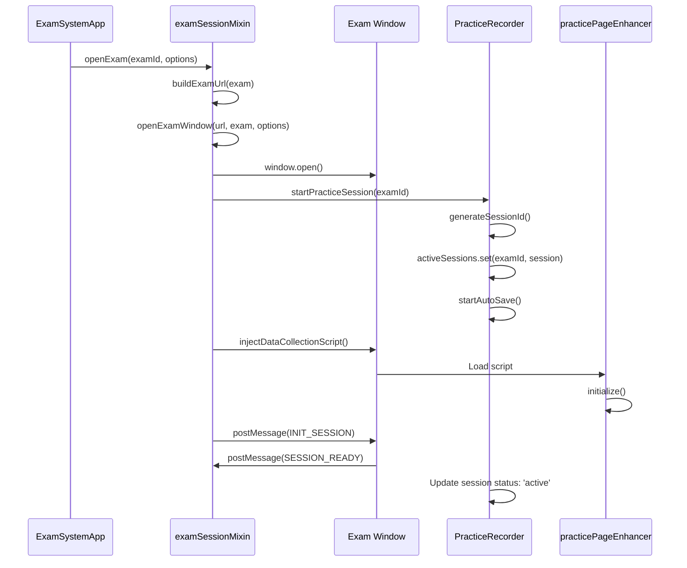
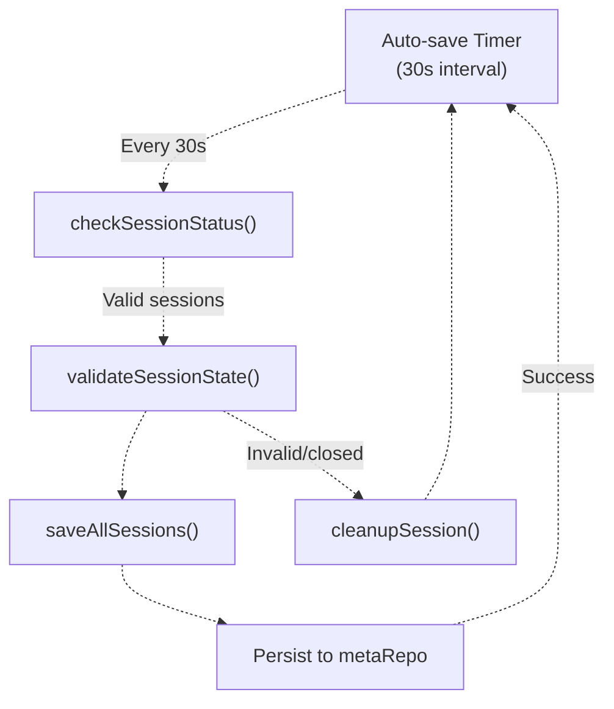
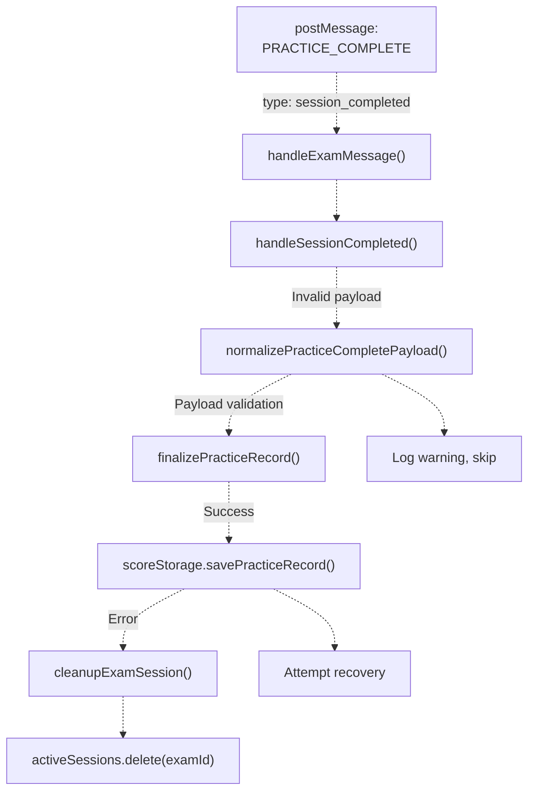
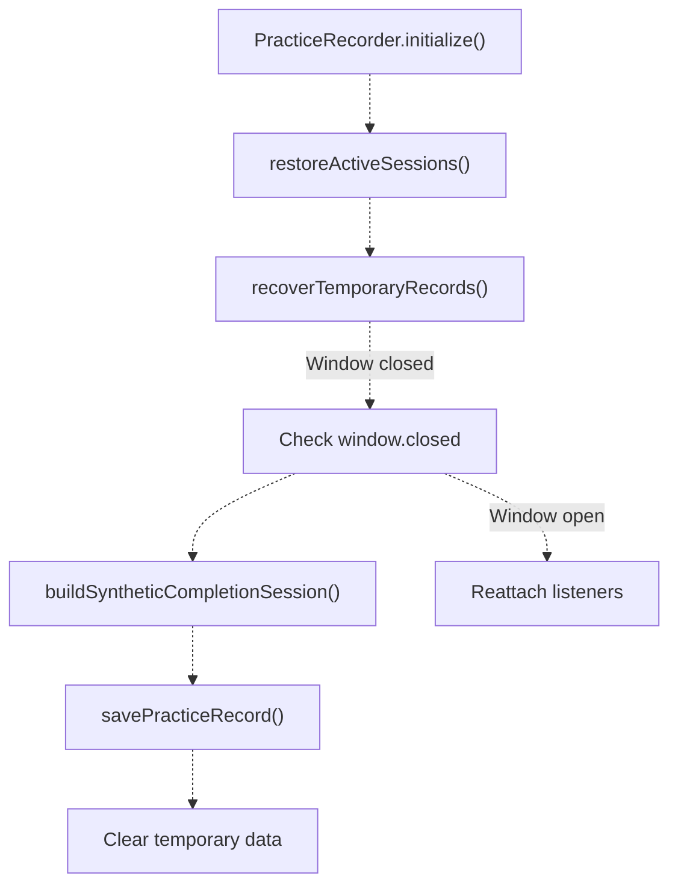
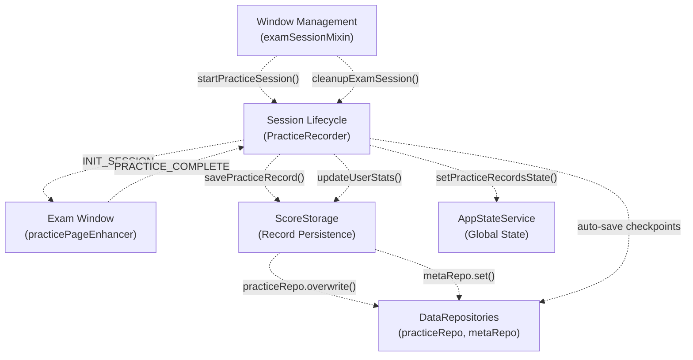

# Practice Session Lifecycle & Management

> **Relevant source files**
> * [js/app/examSessionMixin.js](https://github.com/sallowayma-git/IELTS-practice/blob/92f64eb8/js/app/examSessionMixin.js)
> * [js/app/suitePracticeMixin.js](https://github.com/sallowayma-git/IELTS-practice/blob/92f64eb8/js/app/suitePracticeMixin.js)
> * [js/core/practiceRecorder.js](https://github.com/sallowayma-git/IELTS-practice/blob/92f64eb8/js/core/practiceRecorder.js)
> * [js/core/scoreStorage.js](https://github.com/sallowayma-git/IELTS-practice/blob/92f64eb8/js/core/scoreStorage.js)
> * [js/practice-page-enhancer.js](https://github.com/sallowayma-git/IELTS-practice/blob/92f64eb8/js/practice-page-enhancer.js)
> * [js/services/GlobalStateService.js](https://github.com/sallowayma-git/IELTS-practice/blob/92f64eb8/js/services/GlobalStateService.js)
> * [js/utils/answerComparisonUtils.js](https://github.com/sallowayma-git/IELTS-practice/blob/92f64eb8/js/utils/answerComparisonUtils.js)
> * [js/utils/dataBackupManager.js](https://github.com/sallowayma-git/IELTS-practice/blob/92f64eb8/js/utils/dataBackupManager.js)
> * [js/utils/storage.js](https://github.com/sallowayma-git/IELTS-practice/blob/92f64eb8/js/utils/storage.js)

## Purpose and Scope

This document describes the complete practice session lifecycle, from initialization through active monitoring to completion and persistence. It covers the state machine, auto-save mechanisms, session tracking, and coordination between the main application window and exam windows.

For details on cross-window communication protocols, see [Cross-Window Communication Protocol](/sallowayma-git/IELTS-practice/5.3-cross-window-communication-protocol). For data collection within exam windows, see [Practice Page Enhancement & Data Collection](/sallowayma-git/IELTS-practice/5.2-practice-page-enhancement-and-data-collection). For exam window resource resolution, see [Exam Window Management & Resource Resolution](/sallowayma-git/IELTS-practice/5.4-exam-window-management-and-resource-resolution).

---

## Session State Machine

The practice session lifecycle is managed by `PracticeRecorder` and progresses through distinct states:

```css
#mermaid-saxakkxzp8c{font-family:ui-sans-serif,-apple-system,system-ui,Segoe UI,Helvetica;font-size:16px;fill:#333;}@keyframes edge-animation-frame{from{stroke-dashoffset:0;}}@keyframes dash{to{stroke-dashoffset:0;}}#mermaid-saxakkxzp8c .edge-animation-slow{stroke-dasharray:9,5!important;stroke-dashoffset:900;animation:dash 50s linear infinite;stroke-linecap:round;}#mermaid-saxakkxzp8c .edge-animation-fast{stroke-dasharray:9,5!important;stroke-dashoffset:900;animation:dash 20s linear infinite;stroke-linecap:round;}#mermaid-saxakkxzp8c .error-icon{fill:#dddddd;}#mermaid-saxakkxzp8c .error-text{fill:#222222;stroke:#222222;}#mermaid-saxakkxzp8c .edge-thickness-normal{stroke-width:1px;}#mermaid-saxakkxzp8c .edge-thickness-thick{stroke-width:3.5px;}#mermaid-saxakkxzp8c .edge-pattern-solid{stroke-dasharray:0;}#mermaid-saxakkxzp8c .edge-thickness-invisible{stroke-width:0;fill:none;}#mermaid-saxakkxzp8c .edge-pattern-dashed{stroke-dasharray:3;}#mermaid-saxakkxzp8c .edge-pattern-dotted{stroke-dasharray:2;}#mermaid-saxakkxzp8c .marker{fill:#999;stroke:#999;}#mermaid-saxakkxzp8c .marker.cross{stroke:#999;}#mermaid-saxakkxzp8c svg{font-family:ui-sans-serif,-apple-system,system-ui,Segoe UI,Helvetica;font-size:16px;}#mermaid-saxakkxzp8c p{margin:0;}#mermaid-saxakkxzp8c defs #statediagram-barbEnd{fill:#999;stroke:#999;}#mermaid-saxakkxzp8c g.stateGroup text{fill:#dddddd;stroke:none;font-size:10px;}#mermaid-saxakkxzp8c g.stateGroup text{fill:#333;stroke:none;font-size:10px;}#mermaid-saxakkxzp8c g.stateGroup .state-title{font-weight:bolder;fill:#333;}#mermaid-saxakkxzp8c g.stateGroup rect{fill:#ffffff;stroke:#dddddd;}#mermaid-saxakkxzp8c g.stateGroup line{stroke:#999;stroke-width:1;}#mermaid-saxakkxzp8c .transition{stroke:#999;stroke-width:1;fill:none;}#mermaid-saxakkxzp8c .stateGroup .composit{fill:#f4f4f4;border-bottom:1px;}#mermaid-saxakkxzp8c .stateGroup .alt-composit{fill:#e0e0e0;border-bottom:1px;}#mermaid-saxakkxzp8c .state-note{stroke:#e6d280;fill:#fff5ad;}#mermaid-saxakkxzp8c .state-note text{fill:#333;stroke:none;font-size:10px;}#mermaid-saxakkxzp8c .stateLabel .box{stroke:none;stroke-width:0;fill:#ffffff;opacity:0.5;}#mermaid-saxakkxzp8c .edgeLabel .label rect{fill:#ffffff;opacity:0.5;}#mermaid-saxakkxzp8c .edgeLabel{background-color:#ffffff;text-align:center;}#mermaid-saxakkxzp8c .edgeLabel p{background-color:#ffffff;}#mermaid-saxakkxzp8c .edgeLabel rect{opacity:0.5;background-color:#ffffff;fill:#ffffff;}#mermaid-saxakkxzp8c .edgeLabel .label text{fill:#333;}#mermaid-saxakkxzp8c .label div .edgeLabel{color:#333;}#mermaid-saxakkxzp8c .stateLabel text{fill:#333;font-size:10px;font-weight:bold;}#mermaid-saxakkxzp8c .node circle.state-start{fill:#999;stroke:#999;}#mermaid-saxakkxzp8c .node .fork-join{fill:#999;stroke:#999;}#mermaid-saxakkxzp8c .node circle.state-end{fill:#dddddd;stroke:#f4f4f4;stroke-width:1.5;}#mermaid-saxakkxzp8c .end-state-inner{fill:#f4f4f4;stroke-width:1.5;}#mermaid-saxakkxzp8c .node rect{fill:#ffffff;stroke:#dddddd;stroke-width:1px;}#mermaid-saxakkxzp8c .node polygon{fill:#ffffff;stroke:#dddddd;stroke-width:1px;}#mermaid-saxakkxzp8c #statediagram-barbEnd{fill:#999;}#mermaid-saxakkxzp8c .statediagram-cluster rect{fill:#ffffff;stroke:#dddddd;stroke-width:1px;}#mermaid-saxakkxzp8c .cluster-label,#mermaid-saxakkxzp8c .nodeLabel{color:#333;}#mermaid-saxakkxzp8c .statediagram-cluster rect.outer{rx:5px;ry:5px;}#mermaid-saxakkxzp8c .statediagram-state .divider{stroke:#dddddd;}#mermaid-saxakkxzp8c .statediagram-state .title-state{rx:5px;ry:5px;}#mermaid-saxakkxzp8c .statediagram-cluster.statediagram-cluster .inner{fill:#f4f4f4;}#mermaid-saxakkxzp8c .statediagram-cluster.statediagram-cluster-alt .inner{fill:#f8f8f8;}#mermaid-saxakkxzp8c .statediagram-cluster .inner{rx:0;ry:0;}#mermaid-saxakkxzp8c .statediagram-state rect.basic{rx:5px;ry:5px;}#mermaid-saxakkxzp8c .statediagram-state rect.divider{stroke-dasharray:10,10;fill:#f8f8f8;}#mermaid-saxakkxzp8c .note-edge{stroke-dasharray:5;}#mermaid-saxakkxzp8c .statediagram-note rect{fill:#fff5ad;stroke:#e6d280;stroke-width:1px;rx:0;ry:0;}#mermaid-saxakkxzp8c .statediagram-note rect{fill:#fff5ad;stroke:#e6d280;stroke-width:1px;rx:0;ry:0;}#mermaid-saxakkxzp8c .statediagram-note text{fill:#333;}#mermaid-saxakkxzp8c .statediagram-note .nodeLabel{color:#333;}#mermaid-saxakkxzp8c .statediagram .edgeLabel{color:red;}#mermaid-saxakkxzp8c #dependencyStart,#mermaid-saxakkxzp8c #dependencyEnd{fill:#999;stroke:#999;stroke-width:1;}#mermaid-saxakkxzp8c .statediagramTitleText{text-anchor:middle;font-size:18px;fill:#333;}#mermaid-saxakkxzp8c :root{--mermaid-font-family:"trebuchet ms",verdana,arial,sans-serif;}startPracticeSession()SESSION_READY receivedsession_paused messagesession_resumed messagePRACTICE_COMPLETE messagesession_error messageTimeout/FailureForce completeCleanup completeAbort sessionPROGRESS_UPDATE (auto-save)InitializingActivePausedCompletedError
```

**Sources:** [js/core/practiceRecorder.js L9-L36](https://github.com/sallowayma-git/IELTS-practice/blob/92f64eb8/js/core/practiceRecorder.js#L9-L36)

 [js/app/examSessionMixin.js L91-L184](https://github.com/sallowayma-git/IELTS-practice/blob/92f64eb8/js/app/examSessionMixin.js#L91-L184)

---

## Session Initialization Flow

Session initialization begins when `openExam()` is called and involves multiple coordinated steps:



### startPracticeSession Implementation

The `startPracticeSession()` method in `examSessionMixin` creates and tracks a new practice session:

[js/app/examSessionMixin.js L848-L914](https://github.com/sallowayma-git/IELTS-practice/blob/92f64eb8/js/app/examSessionMixin.js#L848-L914)

Key responsibilities:

* **Session ID Generation:** Uses timestamp-based IDs via `generateSessionId()`
* **Session Object Creation:** Stores `examId`, `sessionId`, `startTime`, `status`, and metadata
* **Session Registration:** Adds to `activeSessions` Map and `fallbackExamSessions` Map
* **Window Tracking:** Associates session with exam window reference
* **Auto-save Initialization:** Starts periodic checkpoint timer

### Session Data Structure

```yaml
{
    examId: string,              // Exam identifier
    sessionId: string,           // Unique session ID (timestamp-based)
    startTime: string,           // ISO timestamp
    lastActivity: string,        // ISO timestamp of last interaction
    status: string,              // 'initializing' | 'active' | 'paused' | 'completed' | 'error'
    progress: {
        currentQuestion: number,
        totalQuestions: number,
        answeredQuestions: number,
        timeSpent: number
    },
    answers: object,             // Current answer map
    metadata: object,            // Exam metadata (title, category, etc.)
    windowRef: Window            // Reference to exam window
}
```

**Sources:** [js/core/practiceRecorder.js L207-L230](https://github.com/sallowayma-git/IELTS-practice/blob/92f64eb8/js/core/practiceRecorder.js#L207-L230)

 [js/app/examSessionMixin.js L848-L914](https://github.com/sallowayma-git/IELTS-practice/blob/92f64eb8/js/app/examSessionMixin.js#L848-L914)

---

## Active Session Management

During an active session, the system maintains continuous monitoring and periodic checkpointing:

### Auto-Save Timer System

The `PracticeRecorder` implements a 30-second auto-save interval:

[js/core/practiceRecorder.js L10-L14](https://github.com/sallowayma-git/IELTS-practice/blob/92f64eb8/js/core/practiceRecorder.js#L10-L14)

[js/core/practiceRecorder.js L1138-L1171](https://github.com/sallowayma-git/IELTS-practice/blob/92f64eb8/js/core/practiceRecorder.js#L1138-L1171)

**Auto-save Configuration:**

* **Interval:** 30,000ms (30 seconds)
* **Trigger:** Timer-based, not event-based
* **Scope:** All active sessions
* **Recovery:** Checkpoints stored in `activeSessionCheckpoints` Map



### Session Validation

Before each auto-save, the system validates session state:

[js/core/practiceRecorder.js L1053-L1076](https://github.com/sallowayma-git/IELTS-practice/blob/92f64eb8/js/core/practiceRecorder.js#L1053-L1076)

**Validation Checks:**

1. Window is not closed (`!windowRef.closed`)
2. Session has valid `examId`
3. Session status is `'active'` or `'paused'`
4. Last activity within timeout threshold (default: 30 minutes)

### Progress Updates

The exam window sends periodic progress updates via `PROGRESS_UPDATE` messages:

[js/core/practiceRecorder.js L270-L301](https://github.com/sallowayma-git/IELTS-practice/blob/92f64eb8/js/core/practiceRecorder.js#L270-L301)

**Progress Message Handling:**

* Updates `lastActivity` timestamp
* Refreshes `progress.answeredQuestions` count
* Updates `answers` map incrementally
* Does NOT trigger full persistence (only checkpoint)

**Sources:** [js/core/practiceRecorder.js L1138-L1171](https://github.com/sallowayma-git/IELTS-practice/blob/92f64eb8/js/core/practiceRecorder.js#L1138-L1171)

 [js/core/practiceRecorder.js L1053-L1076](https://github.com/sallowayma-git/IELTS-practice/blob/92f64eb8/js/core/practiceRecorder.js#L1053-L1076)

 [js/core/practiceRecorder.js L270-L301](https://github.com/sallowayma-git/IELTS-practice/blob/92f64eb8/js/core/practiceRecorder.js#L270-L301)

---

## Session Completion Handling

Session completion is triggered by a `PRACTICE_COMPLETE` message and involves multi-stage processing:



### Message Normalization

The `normalizePracticeCompletePayload()` method standardizes incoming data:

[js/core/practiceRecorder.js L357-L436](https://github.com/sallowayma-git/IELTS-practice/blob/92f64eb8/js/core/practiceRecorder.js#L357-L436)

**Normalization Steps:**

1. **Extract Score Info:** From `scoreInfo`, `realData.scoreInfo`, or payload root
2. **Build Answer Maps:** Normalize `answers` and `correctAnswers` objects
3. **Create Answer Details:** Build per-question comparison data
4. **Calculate Metrics:** Derive `totalQuestions`, `correctAnswers`, `accuracy`
5. **Merge Metadata:** Combine exam metadata from multiple sources

### Record Finalization

The `finalizePracticeRecord()` method prepares the record for persistence:

[js/core/practiceRecorder.js L916-L1050](https://github.com/sallowayma-git/IELTS-practice/blob/92f64eb8/js/core/practiceRecorder.js#L916-L1050)

**Finalization Process:**

* **Merge Session Data:** Combine session state with completion payload
* **Enrich Metadata:** Add exam index lookup data (title, category, frequency)
* **Standardize Timestamps:** Ensure `startTime`, `endTime`, `date` consistency
* **Build Real Data Object:** Preserve raw payload for audit trail
* **Validate Integrity:** Check required fields and data consistency

### Record Persistence

Persistence is delegated to `ScoreStorage.savePracticeRecord()`:

[js/core/scoreStorage.js L569-L685](https://github.com/sallowayma-git/IELTS-practice/blob/92f64eb8/js/core/scoreStorage.js#L569-L685)

**Persistence Steps:**

1. **Standardize Record:** Call `standardizeRecord()` for format consistency
2. **Validate Record:** Run `validateRecord()` checks
3. **Deduplicate:** Check for existing record by `id` or `sessionId`
4. **Update or Insert:** Replace existing or add to front of array
5. **Enforce Limits:** Maintain max 1000 records (configurable)
6. **Persist to Repository:** Save via `practiceRepo.overwrite()`
7. **Update Statistics:** Recalculate user stats incrementally

### Session Cleanup

After successful persistence, the session is cleaned up:

[js/app/examSessionMixin.js L1032-L1083](https://github.com/sallowayma-git/IELTS-practice/blob/92f64eb8/js/app/examSessionMixin.js#L1032-L1083)

**Cleanup Actions:**

* Remove from `activeSessions` Map
* Remove from `fallbackExamSessions` Map
* Clear window reference
* Remove event listeners
* Update UI status indicators
* Trigger record list refresh

**Sources:** [js/core/practiceRecorder.js L357-L436](https://github.com/sallowayma-git/IELTS-practice/blob/92f64eb8/js/core/practiceRecorder.js#L357-L436)

 [js/core/practiceRecorder.js L916-L1050](https://github.com/sallowayma-git/IELTS-practice/blob/92f64eb8/js/core/practiceRecorder.js#L916-L1050)

 [js/core/scoreStorage.js L569-L685](https://github.com/sallowayma-git/IELTS-practice/blob/92f64eb8/js/core/scoreStorage.js#L569-L685)

 [js/app/examSessionMixin.js L1032-L1083](https://github.com/sallowayma-git/IELTS-practice/blob/92f64eb8/js/app/examSessionMixin.js#L1032-L1083)

---

## Session Recovery & Restoration

The system implements recovery mechanisms for interrupted sessions:

### Restore Active Sessions on Startup

During `PracticeRecorder` initialization, previously active sessions are restored:

[js/core/practiceRecorder.js L232-L248](https://github.com/sallowayma-git/IELTS-practice/blob/92f64eb8/js/core/practiceRecorder.js#L232-L248)

**Restoration Process:**

1. Load `active_sessions` from `metaRepo`
2. Reconstruct session objects with `status: 'restored'`
3. Update `lastActivity` timestamp
4. Add to `activeSessions` Map
5. Attempt window reconnection (if still open)

### Temporary Record Recovery

The `recoverTemporaryRecords()` method salvages incomplete sessions:

[js/core/practiceRecorder.js L1173-L1251](https://github.com/sallowayma-git/IELTS-practice/blob/92f64eb8/js/core/practiceRecorder.js#L1173-L1251)

**Recovery Sources:**

* **Session Checkpoints:** From auto-save checkpoints
* **Temporary Storage:** From `sessionStorage` or in-memory cache
* **Partial Answers:** From last known state

**Recovery Criteria:**

* Session has valid `examId` and `startTime`
* At least one answer recorded
* Session interrupted within last 24 hours
* Window closed or unresponsive



**Sources:** [js/core/practiceRecorder.js L232-L248](https://github.com/sallowayma-git/IELTS-practice/blob/92f64eb8/js/core/practiceRecorder.js#L232-L248)

 [js/core/practiceRecorder.js L1173-L1251](https://github.com/sallowayma-git/IELTS-practice/blob/92f64eb8/js/core/practiceRecorder.js#L1173-L1251)

---

## Session Monitoring & Health Checks

The system continuously monitors session health and responds to anomalies:

### Visibility Change Handling

When the main window regains visibility, session status is checked:

[js/core/practiceRecorder.js L259-L264](https://github.com/sallowayma-git/IELTS-practice/blob/92f64eb8/js/core/practiceRecorder.js#L259-L264)

**Check Triggers:**

* Browser tab becomes active
* Window gains focus
* System wakes from sleep

### Session Status Check

The `checkSessionStatus()` method validates all active sessions:

[js/core/practiceRecorder.js L1053-L1076](https://github.com/sallowayma-git/IELTS-practice/blob/92f64eb8/js/core/practiceRecorder.js#L1053-L1076)

**Health Indicators:**

* Window reference validity (`!windowRef.closed`)
* Last activity recency (< 30 minute threshold)
* Session state consistency
* Progress data integrity

### Timeout Handling

Sessions exceeding the activity timeout are automatically finalized:

| Timeout Threshold | Action | Reason |
| --- | --- | --- |
| 30 minutes | Mark as stale | No recent activity |
| 60 minutes | Force complete | Assumed abandoned |
| 2 hours | Discard | Session expired |

**Sources:** [js/core/practiceRecorder.js L259-L264](https://github.com/sallowayma-git/IELTS-practice/blob/92f64eb8/js/core/practiceRecorder.js#L259-L264)

 [js/core/practiceRecorder.js L1053-L1076](https://github.com/sallowayma-git/IELTS-practice/blob/92f64eb8/js/core/practiceRecorder.js#L1053-L1076)

---

## Auto-Save Checkpoint System

Checkpoints provide crash recovery and maintain data integrity:

### Checkpoint Storage

Checkpoints are stored in the `activeSessionCheckpoints` Map:

[js/core/practiceRecorder.js L1138-L1171](https://github.com/sallowayma-git/IELTS-practice/blob/92f64eb8/js/core/practiceRecorder.js#L1138-L1171)

**Checkpoint Data Structure:**

```yaml
{
    sessionId: string,
    examId: string,
    timestamp: string,
    answers: object,
    progress: object,
    metadata: object,
    checkpointNumber: number
}
```

### Checkpoint Creation Triggers

1. **Timer-based:** Every 30 seconds during active session
2. **Progress-based:** After N questions answered (configurable)
3. **Manual:** Via `saveAllSessions()` API call
4. **Event-based:** On `beforeunload` window event

### Checkpoint Restoration Logic

[js/core/practiceRecorder.js L1173-L1251](https://github.com/sallowayma-git/IELTS-practice/blob/92f64eb8/js/core/practiceRecorder.js#L1173-L1251)

**Restoration Priority:**

1. Most recent checkpoint by timestamp
2. Checkpoint with highest question count
3. Checkpoint with largest answer set
4. Any valid checkpoint within timeout window

**Sources:** [js/core/practiceRecorder.js L1138-L1171](https://github.com/sallowayma-git/IELTS-practice/blob/92f64eb8/js/core/practiceRecorder.js#L1138-L1171)

 [js/core/practiceRecorder.js L1173-L1251](https://github.com/sallowayma-git/IELTS-practice/blob/92f64eb8/js/core/practiceRecorder.js#L1173-L1251)

---

## Error Handling & Graceful Degradation

The lifecycle includes comprehensive error handling:

### Error State Transitions

```css
#mermaid-t8zgpztybq{font-family:ui-sans-serif,-apple-system,system-ui,Segoe UI,Helvetica;font-size:16px;fill:#333;}@keyframes edge-animation-frame{from{stroke-dashoffset:0;}}@keyframes dash{to{stroke-dashoffset:0;}}#mermaid-t8zgpztybq .edge-animation-slow{stroke-dasharray:9,5!important;stroke-dashoffset:900;animation:dash 50s linear infinite;stroke-linecap:round;}#mermaid-t8zgpztybq .edge-animation-fast{stroke-dasharray:9,5!important;stroke-dashoffset:900;animation:dash 20s linear infinite;stroke-linecap:round;}#mermaid-t8zgpztybq .error-icon{fill:#dddddd;}#mermaid-t8zgpztybq .error-text{fill:#222222;stroke:#222222;}#mermaid-t8zgpztybq .edge-thickness-normal{stroke-width:1px;}#mermaid-t8zgpztybq .edge-thickness-thick{stroke-width:3.5px;}#mermaid-t8zgpztybq .edge-pattern-solid{stroke-dasharray:0;}#mermaid-t8zgpztybq .edge-thickness-invisible{stroke-width:0;fill:none;}#mermaid-t8zgpztybq .edge-pattern-dashed{stroke-dasharray:3;}#mermaid-t8zgpztybq .edge-pattern-dotted{stroke-dasharray:2;}#mermaid-t8zgpztybq .marker{fill:#999;stroke:#999;}#mermaid-t8zgpztybq .marker.cross{stroke:#999;}#mermaid-t8zgpztybq svg{font-family:ui-sans-serif,-apple-system,system-ui,Segoe UI,Helvetica;font-size:16px;}#mermaid-t8zgpztybq p{margin:0;}#mermaid-t8zgpztybq defs #statediagram-barbEnd{fill:#999;stroke:#999;}#mermaid-t8zgpztybq g.stateGroup text{fill:#dddddd;stroke:none;font-size:10px;}#mermaid-t8zgpztybq g.stateGroup text{fill:#333;stroke:none;font-size:10px;}#mermaid-t8zgpztybq g.stateGroup .state-title{font-weight:bolder;fill:#333;}#mermaid-t8zgpztybq g.stateGroup rect{fill:#ffffff;stroke:#dddddd;}#mermaid-t8zgpztybq g.stateGroup line{stroke:#999;stroke-width:1;}#mermaid-t8zgpztybq .transition{stroke:#999;stroke-width:1;fill:none;}#mermaid-t8zgpztybq .stateGroup .composit{fill:#f4f4f4;border-bottom:1px;}#mermaid-t8zgpztybq .stateGroup .alt-composit{fill:#e0e0e0;border-bottom:1px;}#mermaid-t8zgpztybq .state-note{stroke:#e6d280;fill:#fff5ad;}#mermaid-t8zgpztybq .state-note text{fill:#333;stroke:none;font-size:10px;}#mermaid-t8zgpztybq .stateLabel .box{stroke:none;stroke-width:0;fill:#ffffff;opacity:0.5;}#mermaid-t8zgpztybq .edgeLabel .label rect{fill:#ffffff;opacity:0.5;}#mermaid-t8zgpztybq .edgeLabel{background-color:#ffffff;text-align:center;}#mermaid-t8zgpztybq .edgeLabel p{background-color:#ffffff;}#mermaid-t8zgpztybq .edgeLabel rect{opacity:0.5;background-color:#ffffff;fill:#ffffff;}#mermaid-t8zgpztybq .edgeLabel .label text{fill:#333;}#mermaid-t8zgpztybq .label div .edgeLabel{color:#333;}#mermaid-t8zgpztybq .stateLabel text{fill:#333;font-size:10px;font-weight:bold;}#mermaid-t8zgpztybq .node circle.state-start{fill:#999;stroke:#999;}#mermaid-t8zgpztybq .node .fork-join{fill:#999;stroke:#999;}#mermaid-t8zgpztybq .node circle.state-end{fill:#dddddd;stroke:#f4f4f4;stroke-width:1.5;}#mermaid-t8zgpztybq .end-state-inner{fill:#f4f4f4;stroke-width:1.5;}#mermaid-t8zgpztybq .node rect{fill:#ffffff;stroke:#dddddd;stroke-width:1px;}#mermaid-t8zgpztybq .node polygon{fill:#ffffff;stroke:#dddddd;stroke-width:1px;}#mermaid-t8zgpztybq #statediagram-barbEnd{fill:#999;}#mermaid-t8zgpztybq .statediagram-cluster rect{fill:#ffffff;stroke:#dddddd;stroke-width:1px;}#mermaid-t8zgpztybq .cluster-label,#mermaid-t8zgpztybq .nodeLabel{color:#333;}#mermaid-t8zgpztybq .statediagram-cluster rect.outer{rx:5px;ry:5px;}#mermaid-t8zgpztybq .statediagram-state .divider{stroke:#dddddd;}#mermaid-t8zgpztybq .statediagram-state .title-state{rx:5px;ry:5px;}#mermaid-t8zgpztybq .statediagram-cluster.statediagram-cluster .inner{fill:#f4f4f4;}#mermaid-t8zgpztybq .statediagram-cluster.statediagram-cluster-alt .inner{fill:#f8f8f8;}#mermaid-t8zgpztybq .statediagram-cluster .inner{rx:0;ry:0;}#mermaid-t8zgpztybq .statediagram-state rect.basic{rx:5px;ry:5px;}#mermaid-t8zgpztybq .statediagram-state rect.divider{stroke-dasharray:10,10;fill:#f8f8f8;}#mermaid-t8zgpztybq .note-edge{stroke-dasharray:5;}#mermaid-t8zgpztybq .statediagram-note rect{fill:#fff5ad;stroke:#e6d280;stroke-width:1px;rx:0;ry:0;}#mermaid-t8zgpztybq .statediagram-note rect{fill:#fff5ad;stroke:#e6d280;stroke-width:1px;rx:0;ry:0;}#mermaid-t8zgpztybq .statediagram-note text{fill:#333;}#mermaid-t8zgpztybq .statediagram-note .nodeLabel{color:#333;}#mermaid-t8zgpztybq .statediagram .edgeLabel{color:red;}#mermaid-t8zgpztybq #dependencyStart,#mermaid-t8zgpztybq #dependencyEnd{fill:#999;stroke:#999;stroke-width:1;}#mermaid-t8zgpztybq .statediagramTitleText{text-anchor:middle;font-size:18px;fill:#333;}#mermaid-t8zgpztybq :root{--mermaid-font-family:"trebuchet ms",verdana,arial,sans-serif;}Window closed unexpectedlyNetwork/storage failureInvalid message formatAuto-recovery attemptRecovery successfulRecovery failed (3 attempts)Unrecoverable errorActiveErrorRecoveryAbandoned
```

### Error Recovery Strategies

| Error Type | Recovery Strategy | Fallback |
| --- | --- | --- |
| Window closed | Reconnect attempt | Synthesize completion from checkpoint |
| Storage failure | Retry with exponential backoff | In-memory cache |
| Invalid message | Request retransmission | Use last valid state |
| Network timeout | Queue for retry | Persist locally |

### handleSessionError Implementation

[js/core/practiceRecorder.js L270-L301](https://github.com/sallowayma-git/IELTS-practice/blob/92f64eb8/js/core/practiceRecorder.js#L270-L301)

**Error Handling Flow:**

1. Log error details and context
2. Update session status to `'error'`
3. Attempt recovery based on error type
4. If recovery fails, mark session as abandoned
5. Notify user of data loss risk
6. Preserve partial data if possible

**Sources:** [js/core/practiceRecorder.js L270-L301](https://github.com/sallowayma-git/IELTS-practice/blob/92f64eb8/js/core/practiceRecorder.js#L270-L301)

---

## Session Lifecycle API Reference

### Key Methods in PracticeRecorder

| Method | Purpose | Returns |
| --- | --- | --- |
| `startPracticeSession(examId)` | Initialize new session | `Promise<session>` |
| `handleSessionCompleted(data)` | Process completion message | `Promise<record>` |
| `saveAllSessions()` | Checkpoint all active sessions | `Promise<void>` |
| `cleanupExamSession(examId)` | Remove session and cleanup | `Promise<void>` |
| `restoreActiveSessions()` | Restore on startup | `Promise<void>` |
| `recoverTemporaryRecords()` | Recover interrupted sessions | `Promise<void>` |
| `checkSessionStatus()` | Validate session health | `void` |

### Key Methods in examSessionMixin

| Method | Purpose | Returns |
| --- | --- | --- |
| `openExam(examId, options)` | Open exam and start session | `Promise<Window>` |
| `startPracticeSession(examId)` | Create session record | `Promise<session>` |
| `injectDataCollectionScript(window, examId)` | Inject enhancer | `void` |
| `setupExamWindowManagement(window, examId)` | Setup listeners | `void` |
| `cleanupExamSession(examId)` | Remove session | `Promise<void>` |

**Sources:** [js/core/practiceRecorder.js L9-L36](https://github.com/sallowayma-git/IELTS-practice/blob/92f64eb8/js/core/practiceRecorder.js#L9-L36)

 [js/app/examSessionMixin.js L87-L260](https://github.com/sallowayma-git/IELTS-practice/blob/92f64eb8/js/app/examSessionMixin.js#L87-L260)

---

## Integration with Other Systems

The session lifecycle integrates with multiple subsystems:



**Integration Points:**

* **Window Management:** Session tied to exam window lifecycle
* **Data Persistence:** Records saved via ScoreStorage → DataRepositories
* **State Management:** Global state updated on completion
* **Cross-Window Communication:** Message protocol with exam windows
* **Error Recovery:** Checkpoints stored in repositories

**Sources:** [js/core/practiceRecorder.js L9-L36](https://github.com/sallowayma-git/IELTS-practice/blob/92f64eb8/js/core/practiceRecorder.js#L9-L36)

 [js/core/scoreStorage.js L5-L34](https://github.com/sallowayma-git/IELTS-practice/blob/92f64eb8/js/core/scoreStorage.js#L5-L34)

 [js/app/examSessionMixin.js L87-L184](https://github.com/sallowayma-git/IELTS-practice/blob/92f64eb8/js/app/examSessionMixin.js#L87-L184)

---

## Suite Practice Session Extensions

Suite practice mode extends the standard lifecycle with multi-exam coordination. For full details, see [Suite Practice Mode](/sallowayma-git/IELTS-practice/5.5-suite-practice-mode).

**Key Extensions:**

* **Suite Session Tracking:** `currentSuiteSession` object tracks sequence
* **Cross-Exam State:** Results aggregated across multiple exams
* **Sequential Navigation:** Auto-open next exam on completion
* **Aggregated Records:** Single record with multiple `suiteEntries`

**Sources:** [js/app/suitePracticeMixin.js L1-L125](https://github.com/sallowayma-git/IELTS-practice/blob/92f64eb8/js/app/suitePracticeMixin.js#L1-L125)