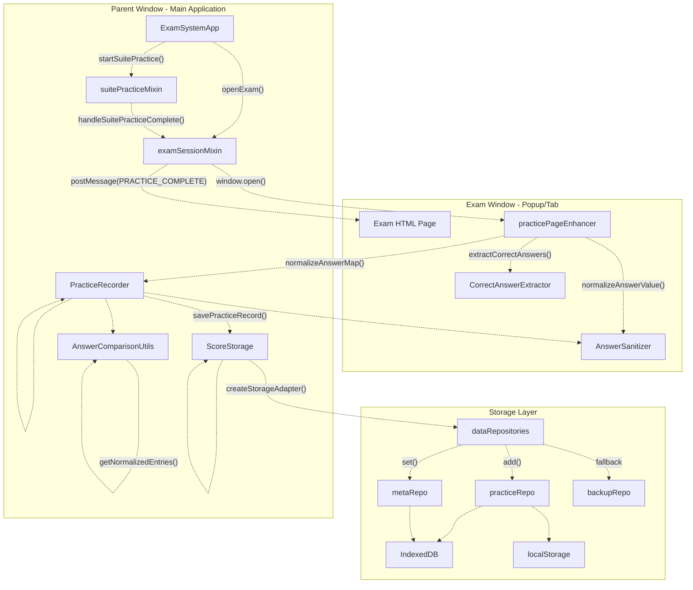
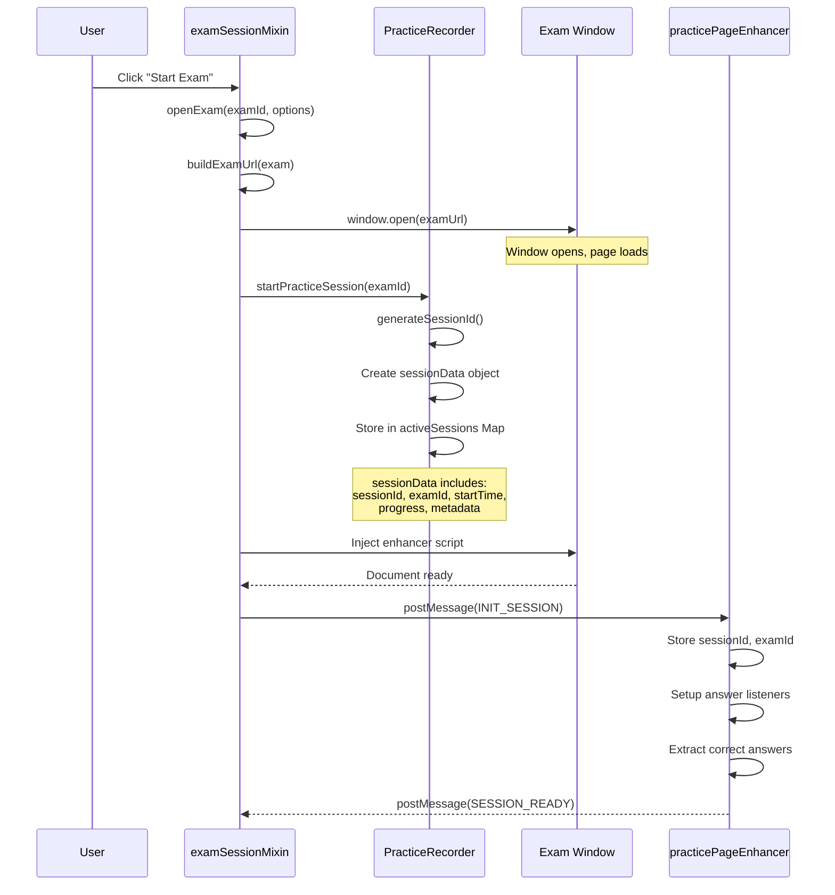
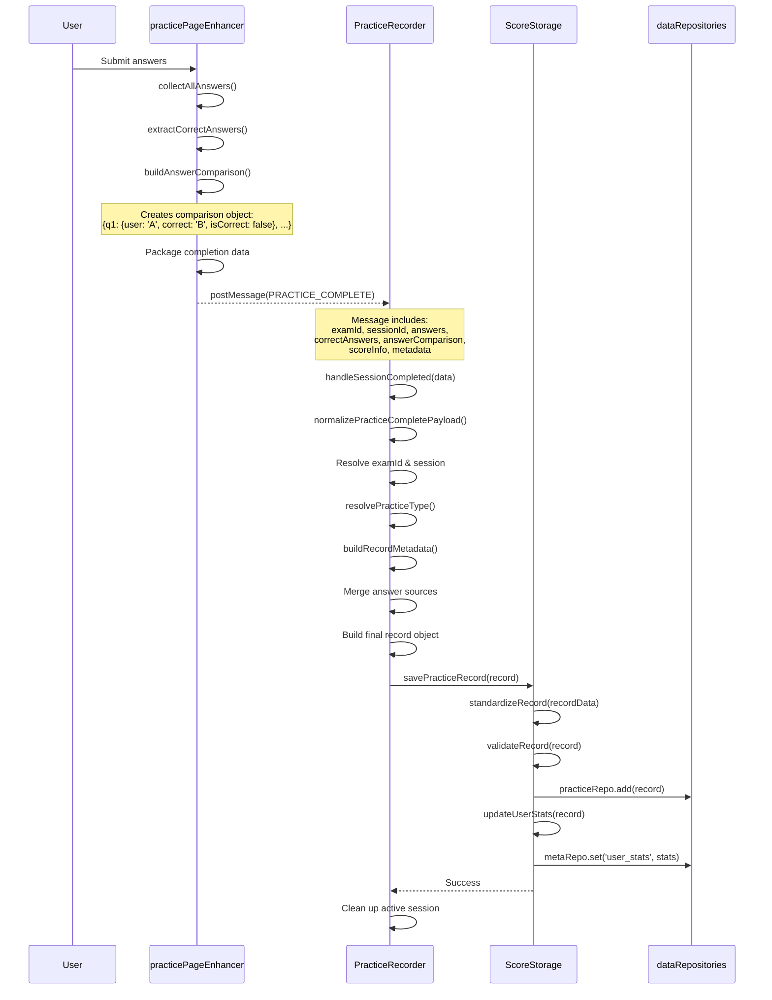
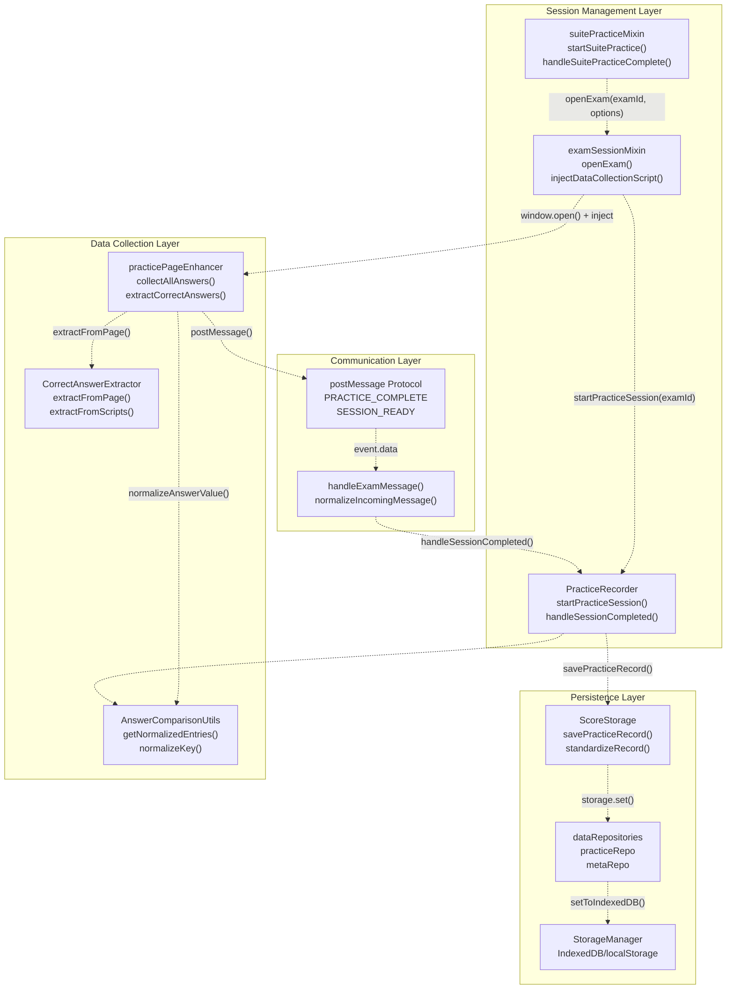
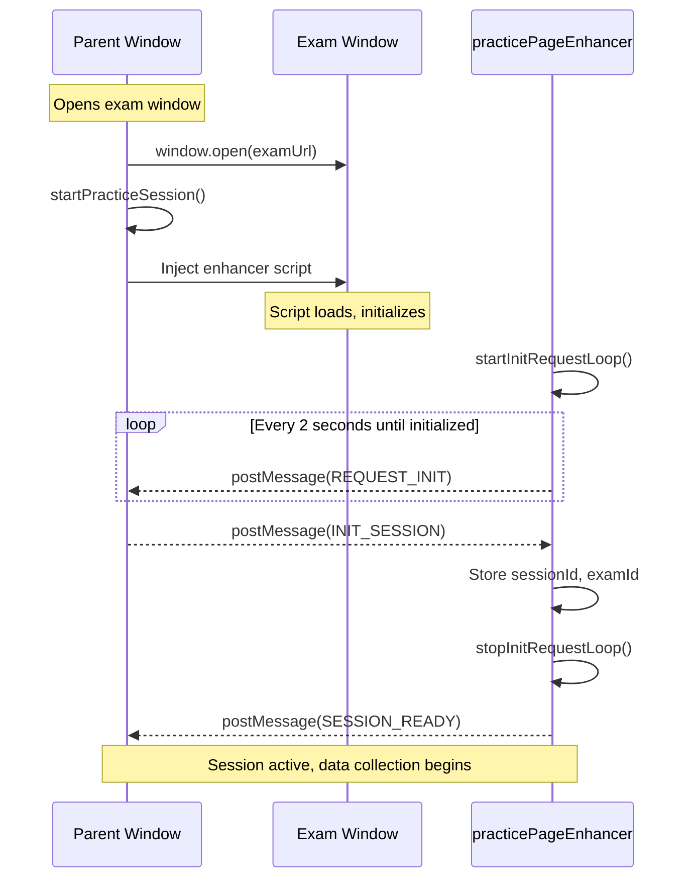
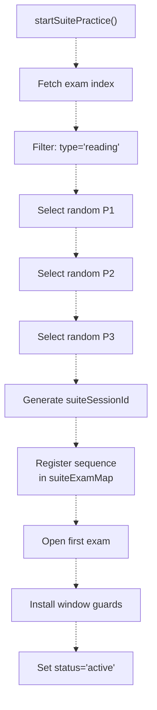
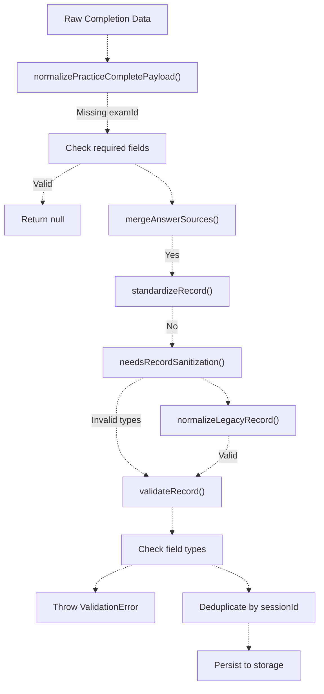

# Practice Session System

> **Relevant source files**
> * [js/app/examSessionMixin.js](https://github.com/sallowayma-git/IELTS-practice/blob/92f64eb8/js/app/examSessionMixin.js)
> * [js/app/suitePracticeMixin.js](https://github.com/sallowayma-git/IELTS-practice/blob/92f64eb8/js/app/suitePracticeMixin.js)
> * [js/core/practiceRecorder.js](https://github.com/sallowayma-git/IELTS-practice/blob/92f64eb8/js/core/practiceRecorder.js)
> * [js/core/scoreStorage.js](https://github.com/sallowayma-git/IELTS-practice/blob/92f64eb8/js/core/scoreStorage.js)
> * [js/practice-page-enhancer.js](https://github.com/sallowayma-git/IELTS-practice/blob/92f64eb8/js/practice-page-enhancer.js)
> * [js/services/GlobalStateService.js](https://github.com/sallowayma-git/IELTS-practice/blob/92f64eb8/js/services/GlobalStateService.js)
> * [js/utils/answerComparisonUtils.js](https://github.com/sallowayma-git/IELTS-practice/blob/92f64eb8/js/utils/answerComparisonUtils.js)
> * [js/utils/dataBackupManager.js](https://github.com/sallowayma-git/IELTS-practice/blob/92f64eb8/js/utils/dataBackupManager.js)
> * [js/utils/storage.js](https://github.com/sallowayma-git/IELTS-practice/blob/92f64eb8/js/utils/storage.js)

## Purpose and Scope

This document describes the complete practice session lifecycle in the IELTS Practice System, covering how user practice attempts are tracked, recorded, and persisted. The system handles both single-exam practice sessions and multi-exam suite practice modes.

**Scope covered by this page:**

* Session initialization and tracking
* Cross-window communication between parent app and exam windows
* Answer collection and correct answer extraction
* Result normalization and validation
* Data persistence to storage

**Related pages:**

* For detailed information about `PracticeRecorder` and `ScoreStorage` classes, see [PracticeRecorder & ScoreStorage](/sallowayma-git/IELTS-practice/5.1-practice-session-lifecycle-and-management)
* For data collection mechanisms in exam pages, see [Practice Page Enhancement & Data Collection](/sallowayma-git/IELTS-practice/5.2-practice-page-enhancement-and-data-collection)
* For the postMessage protocol specification, see [Cross-Window Communication Protocol](/sallowayma-git/IELTS-practice/5.3-cross-window-communication-protocol)
* For suite practice orchestration, see [Suite Practice Mode](/sallowayma-git/IELTS-practice/5.4-exam-window-management-and-resource-resolution)
* For exam window lifecycle management, see [Exam Window Management & Resource Resolution](/sallowayma-git/IELTS-practice/5.5-suite-practice-mode)
* For state management architecture, see [ExamSystemApp & State Management](/sallowayma-git/IELTS-practice/3.1-application-bootstrap-and-initialization-flow)
* For data storage and repositories, see [Storage Architecture & Repositories](/sallowayma-git/IELTS-practice/4.1-storage-architecture-and-multi-backend-system)

---

## System Architecture Overview

The Practice Session System consists of three primary subsystems that work together to track and persist user practice attempts:

**System Architecture Diagram**



**Sources:** [js/core/practiceRecorder.js L1-L36](https://github.com/sallowayma-git/IELTS-practice/blob/92f64eb8/js/core/practiceRecorder.js#L1-L36)

 [js/core/scoreStorage.js L5-L34](https://github.com/sallowayma-git/IELTS-practice/blob/92f64eb8/js/core/scoreStorage.js#L5-L34)

 [js/app/examSessionMixin.js L1-L15](https://github.com/sallowayma-git/IELTS-practice/blob/92f64eb8/js/app/examSessionMixin.js#L1-L15)

 [js/app/suitePracticeMixin.js L1-L18](https://github.com/sallowayma-git/IELTS-practice/blob/92f64eb8/js/app/suitePracticeMixin.js#L1-L18)

 [js/practice-page-enhancer.js L1-L162](https://github.com/sallowayma-git/IELTS-practice/blob/92f64eb8/js/practice-page-enhancer.js#L1-L162)

 [js/utils/answerComparisonUtils.js L1-L63](https://github.com/sallowayma-git/IELTS-practice/blob/92f64eb8/js/utils/answerComparisonUtils.js#L1-L63)

---

## Practice Session Lifecycle (Single Exam)

### Phase 1: Session Initialization

The session lifecycle begins when a user clicks "Start Exam" in the browse view. The flow proceeds through these stages:



**Key Methods:**

* `examSessionMixin.openExam()` [js/app/examSessionMixin.js L89-L176](https://github.com/sallowayma-git/IELTS-practice/blob/92f64eb8/js/app/examSessionMixin.js#L89-L176)  - Entry point for opening an exam
* `examSessionMixin.buildExamUrl()` [js/app/examSessionMixin.js L181-L193](https://github.com/sallowayma-git/IELTS-practice/blob/92f64eb8/js/app/examSessionMixin.js#L181-L193)  - Constructs the exam URL
* `examSessionMixin.openExamWindow()` [js/app/examSessionMixin.js L198-L252](https://github.com/sallowayma-git/IELTS-practice/blob/92f64eb8/js/app/examSessionMixin.js#L198-L252)  - Opens popup/tab window
* `PracticeRecorder.startPracticeSession()` [js/core/practiceRecorder.js L770-L812](https://github.com/sallowayma-git/IELTS-practice/blob/92f64eb8/js/core/practiceRecorder.js#L770-L812)  - Creates session tracking object
* `examSessionMixin.injectDataCollectionScript()` [js/app/examSessionMixin.js L460-L533](https://github.com/sallowayma-git/IELTS-practice/blob/92f64eb8/js/app/examSessionMixin.js#L460-L533)  - Injects enhancer script
* `practicePageEnhancer.initialize()` [js/practice-page-enhancer.js L309-L361](https://github.com/sallowayma-git/IELTS-practice/blob/92f64eb8/js/practice-page-enhancer.js#L309-L361)  - Sets up data collection

**Sources:** [js/app/examSessionMixin.js L89-L252](https://github.com/sallowayma-git/IELTS-practice/blob/92f64eb8/js/app/examSessionMixin.js#L89-L252)

 [js/core/practiceRecorder.js L770-L812](https://github.com/sallowayma-git/IELTS-practice/blob/92f64eb8/js/core/practiceRecorder.js#L770-L812)

 [js/practice-page-enhancer.js L309-L418](https://github.com/sallowayma-git/IELTS-practice/blob/92f64eb8/js/practice-page-enhancer.js#L309-L418)

### Phase 2: Active Practice

During the practice session, the enhancer continuously collects user answers and tracks interactions:

| Activity | Component | Method/Logic |
| --- | --- | --- |
| User enters answer | `practicePageEnhancer` | `setupAnswerListeners()` [js/practice-page-enhancer.js L677-L787](https://github.com/sallowayma-git/IELTS-practice/blob/92f64eb8/js/practice-page-enhancer.js#L677-L787) |
| Answer captured | `practicePageEnhancer` | `collectAnswer()` [js/practice-page-enhancer.js L789-L826](https://github.com/sallowayma-git/IELTS-practice/blob/92f64eb8/js/practice-page-enhancer.js#L789-L826) |
| Periodic collection | `practicePageEnhancer` | `collectAllAnswers()` [js/practice-page-enhancer.js L828-L912](https://github.com/sallowayma-git/IELTS-practice/blob/92f64eb8/js/practice-page-enhancer.js#L828-L912) |
| Progress update | `practicePageEnhancer` | `sendMessage('SESSION_PROGRESS')` |
| Progress received | `PracticeRecorder` | `handleSessionProgress()` [js/core/practiceRecorder.js L842-L861](https://github.com/sallowayma-git/IELTS-practice/blob/92f64eb8/js/core/practiceRecorder.js#L842-L861) |

**Sources:** [js/practice-page-enhancer.js L677-L912](https://github.com/sallowayma-git/IELTS-practice/blob/92f64eb8/js/practice-page-enhancer.js#L677-L912)

 [js/core/practiceRecorder.js L842-L861](https://github.com/sallowayma-git/IELTS-practice/blob/92f64eb8/js/core/practiceRecorder.js#L842-L861)

### Phase 3: Session Completion

When the user submits their answers, the completion flow is triggered:



**Key Data Transformations:**

1. **Raw completion data** → `normalizePracticeCompletePayload()` [js/core/practiceRecorder.js L352-L431](https://github.com/sallowayma-git/IELTS-practice/blob/92f64eb8/js/core/practiceRecorder.js#L352-L431)
2. **Normalized payload** → `buildRecordMetadata()` [js/core/practiceRecorder.js L184-L199](https://github.com/sallowayma-git/IELTS-practice/blob/92f64eb8/js/core/practiceRecorder.js#L184-L199)
3. **Complete record** → `standardizeRecord()` [js/core/scoreStorage.js L591-L707](https://github.com/sallowayma-git/IELTS-practice/blob/92f64eb8/js/core/scoreStorage.js#L591-L707)
4. **Validated record** → Persisted to repositories

**Sources:** [js/practice-page-enhancer.js L914-L1110](https://github.com/sallowayma-git/IELTS-practice/blob/92f64eb8/js/practice-page-enhancer.js#L914-L1110)

 [js/core/practiceRecorder.js L866-L1050](https://github.com/sallowayma-git/IELTS-practice/blob/92f64eb8/js/core/practiceRecorder.js#L866-L1050)

 [js/core/scoreStorage.js L424-L487](https://github.com/sallowayma-git/IELTS-practice/blob/92f64eb8/js/core/scoreStorage.js#L424-L487)

---

## Data Flow Architecture

### Answer Collection Pipeline

The system employs a multi-stage pipeline to ensure data quality and completeness:


**Answer Source Priority:**
The system merges answers from multiple sources in priority order [js/core/practiceRecorder.js L959-L975](https://github.com/sallowayma-git/IELTS-practice/blob/92f64eb8/js/core/practiceRecorder.js#L959-L975)

:

1. `results.answerMap` (explicit answer map from enhancer)
2. `results.answers` (answer array converted to map)
3. `results.realData.answers` (backup source)
4. `session.answers` (accumulated during session)
5. `results.answerComparison` (extracted from comparison object)

**Correct Answer Source Priority:**
The system merges correct answers from [js/core/practiceRecorder.js L967-L975](https://github.com/sallowayma-git/IELTS-practice/blob/92f64eb8/js/core/practiceRecorder.js#L967-L975)

:

1. `results.correctAnswerMap`
2. `results.correctAnswers`
3. `results.realData.correctAnswers`
4. `results.scoreInfo.details` (extracted)
5. `results.answerComparison` (extracted)
6. `session.correctAnswerMap`

**Sources:** [js/core/practiceRecorder.js L600-L749](https://github.com/sallowayma-git/IELTS-practice/blob/92f64eb8/js/core/practiceRecorder.js#L600-L749)

 [js/core/practiceRecorder.js L959-L1026](https://github.com/sallowayma-git/IELTS-practice/blob/92f64eb8/js/core/practiceRecorder.js#L959-L1026)

 [js/practice-page-enhancer.js L677-L912](https://github.com/sallowayma-git/IELTS-practice/blob/92f64eb8/js/practice-page-enhancer.js#L677-L912)

### Answer Normalization Process

The normalization process handles various input formats and edge cases through a multi-stage pipeline:

**Normalization Steps:**

| Step | Method | Purpose |
| --- | --- | --- |
| 1. Value normalization | `normalizeAnswerValue()` [js/core/practiceRecorder.js L478-L532](https://github.com/sallowayma-git/IELTS-practice/blob/92f64eb8/js/core/practiceRecorder.js#L478-L532) | Converts any input type to clean string |
| 2. Key standardization | `normalizeAnswerMap()` [js/core/practiceRecorder.js L534-L559](https://github.com/sallowayma-git/IELTS-practice/blob/92f64eb8/js/core/practiceRecorder.js#L534-L559) | Ensures keys follow `q1`, `q2` format |
| 3. Noise filtering | `isNoiseKey()` [js/core/practiceRecorder.js L561-L603](https://github.com/sallowayma-git/IELTS-practice/blob/92f64eb8/js/core/practiceRecorder.js#L561-L603) | Removes non-answer keys (audio controls, etc.) |
| 4. Answer map creation | `convertAnswerMapToArray()` [js/core/practiceRecorder.js L689-L718](https://github.com/sallowayma-git/IELTS-practice/blob/92f64eb8/js/core/practiceRecorder.js#L689-L718) | Converts map to standardized array format |
| 5. Details building | `buildAnswerDetails()` [js/core/practiceRecorder.js L733-L753](https://github.com/sallowayma-git/IELTS-practice/blob/92f64eb8/js/core/practiceRecorder.js#L733-L753) | Creates detailed comparison object |
| 6. Comparison normalization | `normalizeAnswerComparison()` [js/core/practiceRecorder.js L656-L687](https://github.com/sallowayma-git/IELTS-practice/blob/92f64eb8/js/core/practiceRecorder.js#L656-L687) | Standardizes answer comparison objects |

**Value Normalization Logic:**
The `normalizeAnswerValue()` method handles [js/core/practiceRecorder.js L478-L532](https://github.com/sallowayma-git/IELTS-practice/blob/92f64eb8/js/core/practiceRecorder.js#L478-L532)

:

* `null`/`undefined` → empty string
* Strings → trimmed, filtered for `[object Object]` patterns
* Numbers/booleans → string conversion
* Arrays → comma-joined string via recursive normalization
* Objects → extracts from common properties (`value`, `label`, `text`, `answer`, `content`, `innerText`, `textContent`)

**Answer Comparison Normalization:**
The `normalizeAnswerComparison()` method [js/core/practiceRecorder.js L656-L687](https://github.com/sallowayma-git/IELTS-practice/blob/92f64eb8/js/core/practiceRecorder.js#L656-L687)

 creates structured comparison objects:

```yaml
{
  questionId: {
    questionId: 'q1',
    userAnswer: 'normalized_user_answer',
    correctAnswer: 'normalized_correct_answer',
    isCorrect: true/false/null
  }
}
```

**Noise Key Filtering:**
The system filters out non-answer keys using [js/core/practiceRecorder.js L561-L603](https://github.com/sallowayma-git/IELTS-practice/blob/92f64eb8/js/core/practiceRecorder.js#L561-L603)

:

* Predefined noise keys: `playback-speed`, `volume-slider`, `audio-volume`, `settings`, etc.
* Pattern matching: `/playback/i`, `/volume/i`, `/audio/i`, `/config/i`
* Question number validation: Must be between 1-200

**Sources:** [js/core/practiceRecorder.js L478-L765](https://github.com/sallowayma-git/IELTS-practice/blob/92f64eb8/js/core/practiceRecorder.js#L478-L765)

 [js/core/scoreStorage.js L787-L933](https://github.com/sallowayma-git/IELTS-practice/blob/92f64eb8/js/core/scoreStorage.js#L787-L933)

 [js/utils/answerComparisonUtils.js L1-L63](https://github.com/sallowayma-git/IELTS-practice/blob/92f64eb8/js/utils/answerComparisonUtils.js#L1-L63)

---

## Key Components and Responsibilities

### Component Interaction Map

**Component Responsibilities and Interactions**



**Sources:** [js/core/practiceRecorder.js L1-L36](https://github.com/sallowayma-git/IELTS-practice/blob/92f64eb8/js/core/practiceRecorder.js#L1-L36)

 [js/app/examSessionMixin.js L87-L184](https://github.com/sallowayma-git/IELTS-practice/blob/92f64eb8/js/app/examSessionMixin.js#L87-L184)

 [js/practice-page-enhancer.js L592-L675](https://github.com/sallowayma-git/IELTS-practice/blob/92f64eb8/js/practice-page-enhancer.js#L592-L675)

 [js/utils/answerComparisonUtils.js L69-L206](https://github.com/sallowayma-git/IELTS-practice/blob/92f64eb8/js/utils/answerComparisonUtils.js#L69-L206)

### PracticeRecorder Responsibilities

`PracticeRecorder` [js/core/practiceRecorder.js L9-L36](https://github.com/sallowayma-git/IELTS-practice/blob/92f64eb8/js/core/practiceRecorder.js#L9-L36)

 serves as the central session manager:

**Core Responsibilities:**

| Responsibility | Key Methods | File Location |
| --- | --- | --- |
| Session lifecycle | `startPracticeSession()`, `handleSessionCompleted()` | [js/core/practiceRecorder.js L770-L1050](https://github.com/sallowayma-git/IELTS-practice/blob/92f64eb8/js/core/practiceRecorder.js#L770-L1050) |
| Active session tracking | `activeSessions Map`, `restoreActiveSessions()` | [js/core/practiceRecorder.js L11-L248](https://github.com/sallowayma-git/IELTS-practice/blob/92f64eb8/js/core/practiceRecorder.js#L11-L248) |
| Message routing | `handleExamMessage()`, `normalizeIncomingMessage()` | [js/core/practiceRecorder.js L270-L343](https://github.com/sallowayma-git/IELTS-practice/blob/92f64eb8/js/core/practiceRecorder.js#L270-L343) |
| Data normalization | `normalizePracticeCompletePayload()`, `normalizeAnswerMap()` | [js/core/practiceRecorder.js L357-L559](https://github.com/sallowayma-git/IELTS-practice/blob/92f64eb8/js/core/practiceRecorder.js#L357-L559) |
| Type resolution | `resolvePracticeType()`, `lookupExamIndexEntry()` | [js/core/practiceRecorder.js L46-L99](https://github.com/sallowayma-git/IELTS-practice/blob/92f64eb8/js/core/practiceRecorder.js#L46-L99) |
| Metadata building | `buildRecordMetadata()`, `resolveRecordDate()` | [js/core/practiceRecorder.js L101-L204](https://github.com/sallowayma-git/IELTS-practice/blob/92f64eb8/js/core/practiceRecorder.js#L101-L204) |
| Answer merging | `mergeAnswerSources()`, `buildAnswerDetails()` | [js/core/practiceRecorder.js L605-L753](https://github.com/sallowayma-git/IELTS-practice/blob/92f64eb8/js/core/practiceRecorder.js#L605-L753) |
| Auto-save | `startAutoSave()`, `saveAllSessions()` | [js/core/practiceRecorder.js L1086-L1120](https://github.com/sallowayma-git/IELTS-practice/blob/92f64eb8/js/core/practiceRecorder.js#L1086-L1120) |

**State Management:**

* `activeSessions`: `Map<examId, sessionData>` - tracks ongoing sessions [js/core/practiceRecorder.js L11](https://github.com/sallowayma-git/IELTS-practice/blob/92f64eb8/js/core/practiceRecorder.js#L11-L11)
* `sessionListeners`: `Map` - stores event listeners per session [js/core/practiceRecorder.js L12](https://github.com/sallowayma-git/IELTS-practice/blob/92f64eb8/js/core/practiceRecorder.js#L12-L12)
* `practiceTypeCache`: `Map<examId, examEntry>` - caches exam metadata lookups [js/core/practiceRecorder.js L25](https://github.com/sallowayma-git/IELTS-practice/blob/92f64eb8/js/core/practiceRecorder.js#L25-L25)
* `autoSaveInterval`: 30000ms (30 seconds) [js/core/practiceRecorder.js L13](https://github.com/sallowayma-git/IELTS-practice/blob/92f64eb8/js/core/practiceRecorder.js#L13-L13)

**Session Data Structure:**

```yaml
sessionData = {
  examId: string,
  sessionId: string,
  startTime: Date.now(),
  lastActivity: ISO timestamp,
  status: 'active'|'completed'|'restored',
  progress: {
    currentQuestion: number,
    totalQuestions: number,
    answeredQuestions: number,
    timeSpent: seconds
  },
  answers: {},  // User's answers
  metadata: {}  // Exam metadata
}
```

**Sources:** [js/core/practiceRecorder.js L9-L1120](https://github.com/sallowayma-git/IELTS-practice/blob/92f64eb8/js/core/practiceRecorder.js#L9-L1120)

### ScoreStorage Responsibilities

`ScoreStorage` [js/core/scoreStorage.js L5-L850](https://github.com/sallowayma-git/IELTS-practice/blob/92f64eb8/js/core/scoreStorage.js#L5-L850)

 handles data persistence and validation:

**Core Responsibilities:**

| Responsibility | Key Methods | File Location |
| --- | --- | --- |
| Record standardization | `standardizeRecord()`, `standardizeAnswers()` | [js/core/scoreStorage.js L591-L732](https://github.com/sallowayma-git/IELTS-practice/blob/92f64eb8/js/core/scoreStorage.js#L591-L732) |
| Record validation | `validateRecord()`, `needsRecordSanitization()` | [js/core/scoreStorage.js L824-L915](https://github.com/sallowayma-git/IELTS-practice/blob/92f64eb8/js/core/scoreStorage.js#L824-L915) |
| Legacy record repair | `normalizeLegacyRecord()` | [js/core/scoreStorage.js L489-L570](https://github.com/sallowayma-git/IELTS-practice/blob/92f64eb8/js/core/scoreStorage.js#L489-L570) |
| Statistics calculation | `updateUserStats()`, `updateStreakDays()` | [js/core/scoreStorage.js L917-L1072](https://github.com/sallowayma-git/IELTS-practice/blob/92f64eb8/js/core/scoreStorage.js#L917-L1072) |
| Storage abstraction | `createStorageAdapter()` | [js/core/scoreStorage.js L220-L287](https://github.com/sallowayma-git/IELTS-practice/blob/92f64eb8/js/core/scoreStorage.js#L220-L287) |
| Data migration | `migrateData()`, `migrateToV1()` | [js/core/scoreStorage.js L332-L374](https://github.com/sallowayma-git/IELTS-practice/blob/92f64eb8/js/core/scoreStorage.js#L332-L374) |

**Storage Key Mapping:**

```yaml
storageKeys = {
    practiceRecords: 'practice_records',    // → practiceRepo.list()
    userStats: 'user_stats',                 // → metaRepo.get('user_stats')
    storageVersion: 'storage_version',       // → metaRepo.get('storage_version')
    backupData: 'manual_backups'             // → backupRepo.list()
}
```

**Sources:** [js/core/scoreStorage.js L5-L1070](https://github.com/sallowayma-git/IELTS-practice/blob/92f64eb8/js/core/scoreStorage.js#L5-L1070)

### practicePageEnhancer Responsibilities

`practicePageEnhancer` [js/practice-page-enhancer.js L6-L162](https://github.com/sallowayma-git/IELTS-practice/blob/92f64eb8/js/practice-page-enhancer.js#L6-L162)

 operates inside exam windows:

**Core Responsibilities:**

| Responsibility | Key Methods | File Location |
| --- | --- | --- |
| Communication setup | `setupCommunication()`, `startInitRequestLoop()` | [js/practice-page-enhancer.js L372-L450](https://github.com/sallowayma-git/IELTS-practice/blob/92f64eb8/js/practice-page-enhancer.js#L372-L450) |
| Answer collection | `setupAnswerListeners()`, `collectAllAnswers()` | [js/practice-page-enhancer.js L677-L912](https://github.com/sallowayma-git/IELTS-practice/blob/92f64eb8/js/practice-page-enhancer.js#L677-L912) |
| Correct answer extraction | `extractCorrectAnswers()`, `CorrectAnswerExtractor` | [js/practice-page-enhancer.js L592-L854](https://github.com/sallowayma-git/IELTS-practice/blob/92f64eb8/js/practice-page-enhancer.js#L592-L854) |
| Submit interception | `interceptSubmit()` | [js/practice-page-enhancer.js L914-L1050](https://github.com/sallowayma-git/IELTS-practice/blob/92f64eb8/js/practice-page-enhancer.js#L914-L1050) |
| Suite mode guards | `installSuiteGuards()`, `notifySuiteCloseAttempt()` | [js/practice-page-enhancer.js L462-L551](https://github.com/sallowayma-git/IELTS-practice/blob/92f64eb8/js/practice-page-enhancer.js#L462-L551) |
| Result packaging | `buildAnswerComparison()`, `buildScoreInfo()` | [js/practice-page-enhancer.js L1052-L1170](https://github.com/sallowayma-git/IELTS-practice/blob/92f64eb8/js/practice-page-enhancer.js#L1052-L1170) |
| Mixin registration | `registerPracticeEnhancerMixin()`, `applyMixinsToEnhancer()` | [js/practice-page-enhancer.js L156-L192](https://github.com/sallowayma-git/IELTS-practice/blob/92f64eb8/js/practice-page-enhancer.js#L156-L192) |

**State Tracking:**

```yaml
state = {
    sessionId: null,
    examId: null,
    answers: {},                  // User's answers
    correctAnswers: {},           // Extracted correct answers
    interactions: [],             // User interaction events
    startTime: Date.now(),
    suiteModeActive: false,
    suiteSessionId: null,
    initialized: false,
    dataCollectorReady: false
}
```

**Correct Answer Extraction Strategies:**
The `CorrectAnswerExtractor` [js/practice-page-enhancer.js L592-L771](https://github.com/sallowayma-git/IELTS-practice/blob/92f64eb8/js/practice-page-enhancer.js#L592-L771)

 uses multiple strategies in order:

1. `extractFromAnswersObject()` - Global answer objects (`answers`, `correctAnswers`, `examAnswers`)
2. `extractFromResultsTable()` - HTML tables with class `.results-table`, `.answer-table`
3. `extractFromDOM()` - DOM elements with `[data-correct-answer]`, `.correct-answer` classes
4. `extractFromScripts()` - Inline script variables and JSON patterns
5. `extractFromTranscriptElement()` - Transcript content with `(Q1: answer)` patterns [js/practice-page-enhancer.js L546-L588](https://github.com/sallowayma-git/IELTS-practice/blob/92f64eb8/js/practice-page-enhancer.js#L546-L588)

**Sources:** [js/practice-page-enhancer.js L6-L1170](https://github.com/sallowayma-git/IELTS-practice/blob/92f64eb8/js/practice-page-enhancer.js#L6-L1170)

---

## Communication Protocol Overview

### Message Types and Flow

The parent window and exam window communicate via `postMessage` using a structured protocol:

**Message State Machine**

```css
#mermaid-prs715ylzj{font-family:ui-sans-serif,-apple-system,system-ui,Segoe UI,Helvetica;font-size:16px;fill:#333;}@keyframes edge-animation-frame{from{stroke-dashoffset:0;}}@keyframes dash{to{stroke-dashoffset:0;}}#mermaid-prs715ylzj .edge-animation-slow{stroke-dasharray:9,5!important;stroke-dashoffset:900;animation:dash 50s linear infinite;stroke-linecap:round;}#mermaid-prs715ylzj .edge-animation-fast{stroke-dasharray:9,5!important;stroke-dashoffset:900;animation:dash 20s linear infinite;stroke-linecap:round;}#mermaid-prs715ylzj .error-icon{fill:#dddddd;}#mermaid-prs715ylzj .error-text{fill:#222222;stroke:#222222;}#mermaid-prs715ylzj .edge-thickness-normal{stroke-width:1px;}#mermaid-prs715ylzj .edge-thickness-thick{stroke-width:3.5px;}#mermaid-prs715ylzj .edge-pattern-solid{stroke-dasharray:0;}#mermaid-prs715ylzj .edge-thickness-invisible{stroke-width:0;fill:none;}#mermaid-prs715ylzj .edge-pattern-dashed{stroke-dasharray:3;}#mermaid-prs715ylzj .edge-pattern-dotted{stroke-dasharray:2;}#mermaid-prs715ylzj .marker{fill:#999;stroke:#999;}#mermaid-prs715ylzj .marker.cross{stroke:#999;}#mermaid-prs715ylzj svg{font-family:ui-sans-serif,-apple-system,system-ui,Segoe UI,Helvetica;font-size:16px;}#mermaid-prs715ylzj p{margin:0;}#mermaid-prs715ylzj defs #statediagram-barbEnd{fill:#999;stroke:#999;}#mermaid-prs715ylzj g.stateGroup text{fill:#dddddd;stroke:none;font-size:10px;}#mermaid-prs715ylzj g.stateGroup text{fill:#333;stroke:none;font-size:10px;}#mermaid-prs715ylzj g.stateGroup .state-title{font-weight:bolder;fill:#333;}#mermaid-prs715ylzj g.stateGroup rect{fill:#ffffff;stroke:#dddddd;}#mermaid-prs715ylzj g.stateGroup line{stroke:#999;stroke-width:1;}#mermaid-prs715ylzj .transition{stroke:#999;stroke-width:1;fill:none;}#mermaid-prs715ylzj .stateGroup .composit{fill:#f4f4f4;border-bottom:1px;}#mermaid-prs715ylzj .stateGroup .alt-composit{fill:#e0e0e0;border-bottom:1px;}#mermaid-prs715ylzj .state-note{stroke:#e6d280;fill:#fff5ad;}#mermaid-prs715ylzj .state-note text{fill:#333;stroke:none;font-size:10px;}#mermaid-prs715ylzj .stateLabel .box{stroke:none;stroke-width:0;fill:#ffffff;opacity:0.5;}#mermaid-prs715ylzj .edgeLabel .label rect{fill:#ffffff;opacity:0.5;}#mermaid-prs715ylzj .edgeLabel{background-color:#ffffff;text-align:center;}#mermaid-prs715ylzj .edgeLabel p{background-color:#ffffff;}#mermaid-prs715ylzj .edgeLabel rect{opacity:0.5;background-color:#ffffff;fill:#ffffff;}#mermaid-prs715ylzj .edgeLabel .label text{fill:#333;}#mermaid-prs715ylzj .label div .edgeLabel{color:#333;}#mermaid-prs715ylzj .stateLabel text{fill:#333;font-size:10px;font-weight:bold;}#mermaid-prs715ylzj .node circle.state-start{fill:#999;stroke:#999;}#mermaid-prs715ylzj .node .fork-join{fill:#999;stroke:#999;}#mermaid-prs715ylzj .node circle.state-end{fill:#dddddd;stroke:#f4f4f4;stroke-width:1.5;}#mermaid-prs715ylzj .end-state-inner{fill:#f4f4f4;stroke-width:1.5;}#mermaid-prs715ylzj .node rect{fill:#ffffff;stroke:#dddddd;stroke-width:1px;}#mermaid-prs715ylzj .node polygon{fill:#ffffff;stroke:#dddddd;stroke-width:1px;}#mermaid-prs715ylzj #statediagram-barbEnd{fill:#999;}#mermaid-prs715ylzj .statediagram-cluster rect{fill:#ffffff;stroke:#dddddd;stroke-width:1px;}#mermaid-prs715ylzj .cluster-label,#mermaid-prs715ylzj .nodeLabel{color:#333;}#mermaid-prs715ylzj .statediagram-cluster rect.outer{rx:5px;ry:5px;}#mermaid-prs715ylzj .statediagram-state .divider{stroke:#dddddd;}#mermaid-prs715ylzj .statediagram-state .title-state{rx:5px;ry:5px;}#mermaid-prs715ylzj .statediagram-cluster.statediagram-cluster .inner{fill:#f4f4f4;}#mermaid-prs715ylzj .statediagram-cluster.statediagram-cluster-alt .inner{fill:#f8f8f8;}#mermaid-prs715ylzj .statediagram-cluster .inner{rx:0;ry:0;}#mermaid-prs715ylzj .statediagram-state rect.basic{rx:5px;ry:5px;}#mermaid-prs715ylzj .statediagram-state rect.divider{stroke-dasharray:10,10;fill:#f8f8f8;}#mermaid-prs715ylzj .note-edge{stroke-dasharray:5;}#mermaid-prs715ylzj .statediagram-note rect{fill:#fff5ad;stroke:#e6d280;stroke-width:1px;rx:0;ry:0;}#mermaid-prs715ylzj .statediagram-note rect{fill:#fff5ad;stroke:#e6d280;stroke-width:1px;rx:0;ry:0;}#mermaid-prs715ylzj .statediagram-note text{fill:#333;}#mermaid-prs715ylzj .statediagram-note .nodeLabel{color:#333;}#mermaid-prs715ylzj .statediagram .edgeLabel{color:red;}#mermaid-prs715ylzj #dependencyStart,#mermaid-prs715ylzj #dependencyEnd{fill:#999;stroke:#999;stroke-width:1;}#mermaid-prs715ylzj .statediagramTitleText{text-anchor:middle;font-size:18px;fill:#333;}#mermaid-prs715ylzj :root{--mermaid-font-family:"trebuchet ms",verdana,arial,sans-serif;}"window.open()""Script injection""enhancer loaded""Handshake complete""Session ended"WindowOpenedInjectionWaitHandshake"Send REQUEST_INIT""Wait for INIT_SESSION""Send SESSION_READY"RequestInitAwaitInitReadyActive"Collect answers""Send SESSION_PROGRESS""User submits""Send PRACTICE_COMPLETE"CollectingProgressSubmittingComplete
```

**Message Type Reference:**

| Message Type | Direction | Payload | Handler | File Location |
| --- | --- | --- | --- | --- |
| `REQUEST_INIT` | Exam → Parent | `{examId, url, title}` | Triggers `INIT_SESSION` response | [js/practice-page-enhancer.js L442-L450](https://github.com/sallowayma-git/IELTS-practice/blob/92f64eb8/js/practice-page-enhancer.js#L442-L450) |
| `INIT_SESSION` | Parent → Exam | `{sessionId, examId, suiteSessionId?}` | `setupCommunication()` | [js/practice-page-enhancer.js L372-L418](https://github.com/sallowayma-git/IELTS-practice/blob/92f64eb8/js/practice-page-enhancer.js#L372-L418) |
| `SESSION_READY` | Exam → Parent | `{sessionId, pageType, url}` | Confirms enhancer loaded | [js/practice-page-enhancer.js L406-L418](https://github.com/sallowayma-git/IELTS-practice/blob/92f64eb8/js/practice-page-enhancer.js#L406-L418) |
| `SESSION_PROGRESS` | Exam → Parent | `{examId, progress, answers}` | `handleSessionProgress()` | [js/core/practiceRecorder.js L842-L861](https://github.com/sallowayma-git/IELTS-practice/blob/92f64eb8/js/core/practiceRecorder.js#L842-L861) |
| `PRACTICE_COMPLETE` | Exam → Parent | `{examId, results, answerComparison}` | `handleSessionCompleted()` | [js/core/practiceRecorder.js L866-L1050](https://github.com/sallowayma-git/IELTS-practice/blob/92f64eb8/js/core/practiceRecorder.js#L866-L1050) |
| `SUITE_NAVIGATE` | Parent → Exam | `{url, examId}` | Suite mode navigation | [js/app/suitePracticeMixin.js L176-L241](https://github.com/sallowayma-git/IELTS-practice/blob/92f64eb8/js/app/suitePracticeMixin.js#L176-L241) |
| `SUITE_CLOSE_ATTEMPT` | Exam → Parent | `{examId, reason}` | User tried to close during suite | [js/practice-page-enhancer.js L545-L552](https://github.com/sallowayma-git/IELTS-practice/blob/92f64eb8/js/practice-page-enhancer.js#L545-L552) |
| `SUITE_FORCE_CLOSE` | Parent → Exam | `{}` | Allow window to close | [js/practice-page-enhancer.js L537-L543](https://github.com/sallowayma-git/IELTS-practice/blob/92f64eb8/js/practice-page-enhancer.js#L537-L543) |

**Message Normalization:**
The `normalizeIncomingMessage()` method [js/core/practiceRecorder.js L303-L343](https://github.com/sallowayma-git/IELTS-practice/blob/92f64eb8/js/core/practiceRecorder.js#L303-L343)

 handles multiple message format variations:

* Maps legacy type names to canonical types (e.g., `practice_complete` → `session_completed`)
* Validates payload structure using `ensureCompletionPayloadShape()` [js/core/practiceRecorder.js L345-L355](https://github.com/sallowayma-git/IELTS-practice/blob/92f64eb8/js/core/practiceRecorder.js#L345-L355)
* Returns normalized `{type, data}` object or `null` for invalid messages

**Sources:** [js/practice-page-enhancer.js L372-L450](https://github.com/sallowayma-git/IELTS-practice/blob/92f64eb8/js/practice-page-enhancer.js#L372-L450)

 [js/core/practiceRecorder.js L270-L343](https://github.com/sallowayma-git/IELTS-practice/blob/92f64eb8/js/core/practiceRecorder.js#L270-L343)

 [js/app/examSessionMixin.js L486-L578](https://github.com/sallowayma-git/IELTS-practice/blob/92f64eb8/js/app/examSessionMixin.js#L486-L578)

### Handshake Mechanism

The handshake ensures proper session initialization:



**Handshake Timeout Handling:**

* Enhancer sends `REQUEST_INIT` every 2 seconds [js/practice-page-enhancer.js L442](https://github.com/sallowayma-git/IELTS-practice/blob/92f64eb8/js/practice-page-enhancer.js#L442-L442)
* Timer stops when `INIT_SESSION` received [js/practice-page-enhancer.js L392](https://github.com/sallowayma-git/IELTS-practice/blob/92f64eb8/js/practice-page-enhancer.js#L392-L392)
* Parent waits up to 1500ms before sending init [js/app/examSessionMixin.js L505](https://github.com/sallowayma-git/IELTS-practice/blob/92f64eb8/js/app/examSessionMixin.js#L505-L505)

**Sources:** [js/practice-page-enhancer.js L420-L450](https://github.com/sallowayma-git/IELTS-practice/blob/92f64eb8/js/practice-page-enhancer.js#L420-L450)

 [js/app/examSessionMixin.js L460-L533](https://github.com/sallowayma-git/IELTS-practice/blob/92f64eb8/js/app/examSessionMixin.js#L460-L533)

---

## Single vs Suite Practice Mode

### Mode Comparison Table

| Aspect | Single Practice | Suite Practice |
| --- | --- | --- |
| **Initiator** | `examSessionMixin.openExam()` | `suitePracticeMixin.startSuitePractice()` |
| **Window Strategy** | New window per exam | Reuse same window |
| **Session Tracking** | One `sessionId` | One `suiteSessionId` + multiple sessions |
| **Window Guards** | None | Intercepts `window.close()` and `window.open()` |
| **Navigation** | N/A | Parent sends `SUITE_NAVIGATE` messages |
| **Result Storage** | Single record | Aggregated record + individual entries |
| **Cleanup** | Close window immediately | Cleanup after all exams complete |

**Sources:** [js/app/examSessionMixin.js L89-L176](https://github.com/sallowayma-git/IELTS-practice/blob/92f64eb8/js/app/examSessionMixin.js#L89-L176)

 [js/app/suitePracticeMixin.js L19-L124](https://github.com/sallowayma-git/IELTS-practice/blob/92f64eb8/js/app/suitePracticeMixin.js#L19-L124)

### Suite Practice Sequence Selection

Suite practice selects three reading passages (P1, P2, P3):



**Selection Logic:** [js/app/suitePracticeMixin.js L43-L73](https://github.com/sallowayma-git/IELTS-practice/blob/92f64eb8/js/app/suitePracticeMixin.js#L43-L73)

```javascript
const categories = ['P1', 'P2', 'P3'];
for (const category of categories) {
    const pool = normalizedIndex.filter(item => item.category === category);
    const picked = pool[Math.floor(Math.random() * pool.length)];
    sequence.push({ examId: picked.id, exam: picked });
}
```

**Sources:** [js/app/suitePracticeMixin.js L19-L124](https://github.com/sallowayma-git/IELTS-practice/blob/92f64eb8/js/app/suitePracticeMixin.js#L19-L124)

### Suite Window Guard System

Suite practice prevents accidental window closure:

**Guard Implementation:**

1. **Close interception** [js/practice-page-enhancer.js L499-L507](https://github.com/sallowayma-git/IELTS-practice/blob/92f64eb8/js/practice-page-enhancer.js#L499-L507) : ```javascript window.close = () => {     notifySuiteCloseAttempt('script_request');     return undefined;  // Prevent actual close }; ```
2. **Navigation interception** [js/practice-page-enhancer.js L508-L517](https://github.com/sallowayma-git/IELTS-practice/blob/92f64eb8/js/practice-page-enhancer.js#L508-L517) : ```javascript window.open = (url, target, features) => {     if (isSelfTarget(target)) {         notifySuiteCloseAttempt('self_target_open');         return window;  // Block navigation     }     return originalOpen(url, target, features); }; ```
3. **Parent notification** [js/practice-page-enhancer.js L545-L552](https://github.com/sallowayma-git/IELTS-practice/blob/92f64eb8/js/practice-page-enhancer.js#L545-L552) : * Sends `SUITE_CLOSE_ATTEMPT` message * Parent handles decision to allow/deny

**Teardown:** [js/practice-page-enhancer.js L520-L543](https://github.com/sallowayma-git/IELTS-practice/blob/92f64eb8/js/practice-page-enhancer.js#L520-L543)

* Restores native `window.close` and `window.open`
* Called when suite completes or aborts

**Sources:** [js/practice-page-enhancer.js L462-L568](https://github.com/sallowayma-git/IELTS-practice/blob/92f64eb8/js/practice-page-enhancer.js#L462-L568)

 [js/app/suitePracticeMixin.js L238-L359](https://github.com/sallowayma-git/IELTS-practice/blob/92f64eb8/js/app/suitePracticeMixin.js#L238-L359)

---

## Error Handling and Recovery

### Session Recovery Mechanisms

The system includes multiple fallback paths for robustness:

**Recovery Strategies:**

| Failure Scenario | Detection | Recovery Method | Code Location |
| --- | --- | --- | --- |
| Missing session | No matching `activeSessions` entry | Create synthetic session via `buildSyntheticCompletionSession()` | [js/core/practiceRecorder.js L438-L481](https://github.com/sallowayma-git/IELTS-practice/blob/92f64eb8/js/core/practiceRecorder.js#L438-L481) |
| Missing examId | `examId` null/undefined | Reject payload, return `null` | [js/core/practiceRecorder.js L399-L402](https://github.com/sallowayma-git/IELTS-practice/blob/92f64eb8/js/core/practiceRecorder.js#L399-L402) |
| Window closed prematurely | `examWindow.closed` check | Temporary record storage | [js/core/practiceRecorder.js L1122-L1177](https://github.com/sallowayma-git/IELTS-practice/blob/92f64eb8/js/core/practiceRecorder.js#L1122-L1177) |
| Script injection failure | Timeout on `SESSION_READY` | Inline script fallback via `injectInlineScript()` | [js/app/examSessionMixin.js L673-L828](https://github.com/sallowayma-git/IELTS-practice/blob/92f64eb8/js/app/examSessionMixin.js#L673-L828) |
| Corrupted record data | Validation failure in `validateRecord()` | Skip save, log error | [js/core/scoreStorage.js L824-L915](https://github.com/sallowayma-git/IELTS-practice/blob/92f64eb8/js/core/scoreStorage.js#L824-L915) |
| Suite mode abort | Navigation/close errors | Save partial results via `_abortSuiteSession()` | [js/app/suitePracticeMixin.js L550-L623](https://github.com/sallowayma-git/IELTS-practice/blob/92f64eb8/js/app/suitePracticeMixin.js#L550-L623) |
| Legacy record format | Field missing/invalid | Repair via `normalizeLegacyRecord()` | [js/core/scoreStorage.js L687-L767](https://github.com/sallowayma-git/IELTS-practice/blob/92f64eb8/js/core/scoreStorage.js#L687-L767) |

**Temporary Record Recovery:**
When window closes unexpectedly, records are temporarily stored [js/core/practiceRecorder.js L1122-L1177](https://github.com/sallowayma-git/IELTS-practice/blob/92f64eb8/js/core/practiceRecorder.js#L1122-L1177)

:

1. Store in `temporary_practice_records` key via `metaRepo.set()`
2. Attempt recovery on next initialization via `recoverTemporaryRecords()`
3. Clean up temporary storage after successful save

**Synthetic Session Creation:**
If no active session exists but completion data arrives, the system creates a synthetic session [js/core/practiceRecorder.js L438-L481](https://github.com/sallowayma-git/IELTS-practice/blob/92f64eb8/js/core/practiceRecorder.js#L438-L481)

:

```python
buildSyntheticCompletionSession(examId, results, fallbackSessionId) {
  // Infer startTime from endTime - duration
  // Extract metadata from results
  // Create complete session object
  return sessionData;
}
```

**Sources:** [js/core/practiceRecorder.js L215-L1177](https://github.com/sallowayma-git/IELTS-practice/blob/92f64eb8/js/core/practiceRecorder.js#L215-L1177)

 [js/app/examSessionMixin.js L673-L828](https://github.com/sallowayma-git/IELTS-practice/blob/92f64eb8/js/app/examSessionMixin.js#L673-L828)

 [js/core/scoreStorage.js L687-L915](https://github.com/sallowayma-git/IELTS-practice/blob/92f64eb8/js/core/scoreStorage.js#L687-L915)

### Validation and Sanitization

Records undergo multiple validation stages before persistence:

**Validation Pipeline**



**Required Fields Check:** [js/core/practiceRecorder.js L399-L402](https://github.com/sallowayma-git/IELTS-practice/blob/92f64eb8/js/core/practiceRecorder.js#L399-L402)

```
if (!examId) {
    return null;  // Cannot proceed without examId
}
```

**Field Type Validation:** [js/core/scoreStorage.js L824-L915](https://github.com/sallowayma-git/IELTS-practice/blob/92f64eb8/js/core/scoreStorage.js#L824-L915)

The `validateRecord()` method checks:

* `id`, `examId`, `sessionId`: must be non-empty strings
* `score`, `totalQuestions`, `correctAnswers`, `accuracy`: must be finite numbers
* `startTime`, `endTime`, `date`: must parse to valid Date objects
* `answers`: must be array or object
* `metadata`: must be object with required fields (`examTitle`, `category`, `type`)

**Record Sanitization Check:** [js/core/scoreStorage.js L769-L783](https://github.com/sallowayma-git/IELTS-practice/blob/92f64eb8/js/core/scoreStorage.js#L769-L783)

The `needsRecordSanitization()` method identifies records needing repair:

* Missing `type` or `metadata.type` fields
* Numeric fields that are NaN or non-number type
* Checks fields: `score`, `totalQuestions`, `correctAnswers`, `accuracy`, `duration`

**Legacy Record Repair:** [js/core/scoreStorage.js L687-L767](https://github.com/sallowayma-git/IELTS-practice/blob/92f64eb8/js/core/scoreStorage.js#L687-L767)

When `normalizeLegacyRecord()` is invoked, it:

1. Clones and normalizes `suiteEntries` array
2. Infers `type` from multiple sources (metadata, examId pattern)
3. Builds complete metadata via `buildMetadata()`
4. Standardizes answers via `standardizeAnswers()`
5. Derives correct answer map from `scoreInfo.details` or `answerDetails`
6. Rebuilds `answerDetails` from answer and correct maps
7. Derives `totalQuestions` and `correctAnswers` counts
8. Ensures `startTime`, `endTime`, `status` fields exist
9. Populates `scoreInfo` and `realData` structures

**Deduplication Logic:** [js/core/scoreStorage.js L584-L662](https://github.com/sallowayma-git/IELTS-practice/blob/92f64eb8/js/core/scoreStorage.js#L584-L662)

The `savePracticeRecord()` method deduplicates by `sessionId`:

* Removes duplicates before inserting new record
* Removes old session records with same `sessionId` but different `id`
* Uses `extractSessionId()` helper to find session identifiers

**Sources:** [js/core/practiceRecorder.js L357-L436](https://github.com/sallowayma-git/IELTS-practice/blob/92f64eb8/js/core/practiceRecorder.js#L357-L436)

 [js/core/scoreStorage.js L571-L915](https://github.com/sallowayma-git/IELTS-practice/blob/92f64eb8/js/core/scoreStorage.js#L571-L915)

---

## Performance and Optimization

### Caching Strategies

The system uses targeted caching to reduce redundant operations:

**Cache Types:**

| Cache | Data Stored | Invalidation | Purpose |
| --- | --- | --- | --- |
| `practiceTypeCache` | `Map<examId, examEntry>` | Never (session lifetime) | Avoid repeated exam index lookups |
| `activeSessions` | `Map<examId, sessionData>` | On completion/abort | Track in-progress sessions |
| `suiteExamMap` | `Map<examId, suiteSessionId>` | On suite end | Map exams to suite sessions |

**Exam Index Lookup:** [js/core/practiceRecorder.js L41-L69](https://github.com/sallowayma-git/IELTS-practice/blob/92f64eb8/js/core/practiceRecorder.js#L41-L69)

```
if (this.practiceTypeCache.has(examId)) {
    return this.practiceTypeCache.get(examId);  // Cached
}
// Search through multiple sources, then cache result
this.practiceTypeCache.set(examId, entry);
```

**Sources:** [js/core/practiceRecorder.js L25-L69](https://github.com/sallowayma-git/IELTS-practice/blob/92f64eb8/js/core/practiceRecorder.js#L25-L69)

 [js/app/suitePracticeMixin.js L13-L391](https://github.com/sallowayma-git/IELTS-practice/blob/92f64eb8/js/app/suitePracticeMixin.js#L13-L391)

### Auto-Save and Background Persistence

Sessions are periodically saved to prevent data loss:

**Auto-Save Configuration:**

* Interval: 30 seconds [js/core/practiceRecorder.js L13](https://github.com/sallowayma-git/IELTS-practice/blob/92f64eb8/js/core/practiceRecorder.js#L13-L13)
* Triggers: Timer + `beforeunload` event [js/core/practiceRecorder.js L220-L224](https://github.com/sallowayma-git/IELTS-practice/blob/92f64eb8/js/core/practiceRecorder.js#L220-L224)
* Method: `saveAllSessions()` [js/core/practiceRecorder.js L1086-L1120](https://github.com/sallowayma-git/IELTS-practice/blob/92f64eb8/js/core/practiceRecorder.js#L1086-L1120)

**Background Persistence Flow:**

```javascript
// Periodic save
this.autoSaveTimer = setInterval(() => {
    this.saveAllSessions();
}, this.autoSaveInterval);

// Page unload save
window.addEventListener('beforeunload', () => {
    this.saveAllSessions();
});
```

**Active Session Persistence:**
Sessions are stored in `metaRepo` under `active_sessions` key [js/core/practiceRecorder.js L1099-L1120](https://github.com/sallowayma-git/IELTS-practice/blob/92f64eb8/js/core/practiceRecorder.js#L1099-L1120)

 enabling recovery after page refresh.

**Sources:** [js/core/practiceRecorder.js L13-L1120](https://github.com/sallowayma-git/IELTS-practice/blob/92f64eb8/js/core/practiceRecorder.js#L13-L1120)