# Practice Recorder & Score Storage

> **Relevant source files**
> * [js/core/practiceRecorder.js](https://github.com/sallowayma-git/IELTS-practice/blob/92f64eb8/js/core/practiceRecorder.js)
> * [js/core/scoreStorage.js](https://github.com/sallowayma-git/IELTS-practice/blob/92f64eb8/js/core/scoreStorage.js)
> * [js/utils/dataBackupManager.js](https://github.com/sallowayma-git/IELTS-practice/blob/92f64eb8/js/utils/dataBackupManager.js)
> * [js/utils/storage.js](https://github.com/sallowayma-git/IELTS-practice/blob/92f64eb8/js/utils/storage.js)

## Purpose and Scope

The practice recording system consists of two complementary classes that manage the complete practice session lifecycle and data persistence:

* **`PracticeRecorder`**: Manages active practice sessions, coordinates cross-window communication, handles session state transitions, and implements automatic recovery mechanisms.
* **`ScoreStorage`**: Provides standardized data persistence, record normalization, user statistics aggregation, and backup/restore functionality.

Together, these classes form the core of the practice data management system, with `PracticeRecorder` orchestrating session workflows and `ScoreStorage` ensuring data integrity and persistence. The system employs multi-tiered storage strategies with automatic fallback mechanisms to guarantee data safety under various failure conditions.

For information about the practice page enhancement and data collection mechanisms that interact with practice sessions, see [Practice Page Enhancement & Data Collection](/sallowayma-git/IELTS-practice/5.2-practice-page-enhancement-and-data-collection). For details about the underlying cross-window communication protocols, see [Cross-Window Communication Protocol](/sallowayma-git/IELTS-practice/5.3-cross-window-communication-protocol). For broader data management and storage systems, see [Data Management System](/sallowayma-git/IELTS-practice/4-data-management-system).

Sources: [js/core/practiceRecorder.js L1-L27](https://github.com/sallowayma-git/IELTS-practice/blob/92f64eb8/js/core/practiceRecorder.js#L1-L27)

 [js/core/scoreStorage.js L1-L24](https://github.com/sallowayma-git/IELTS-practice/blob/92f64eb8/js/core/scoreStorage.js#L1-L24)

## Class Relationship and Architecture

The system architecture separates concerns between session orchestration (`PracticeRecorder`) and data persistence (`ScoreStorage`), with clearly defined integration points.

### High-Level Component Relationship

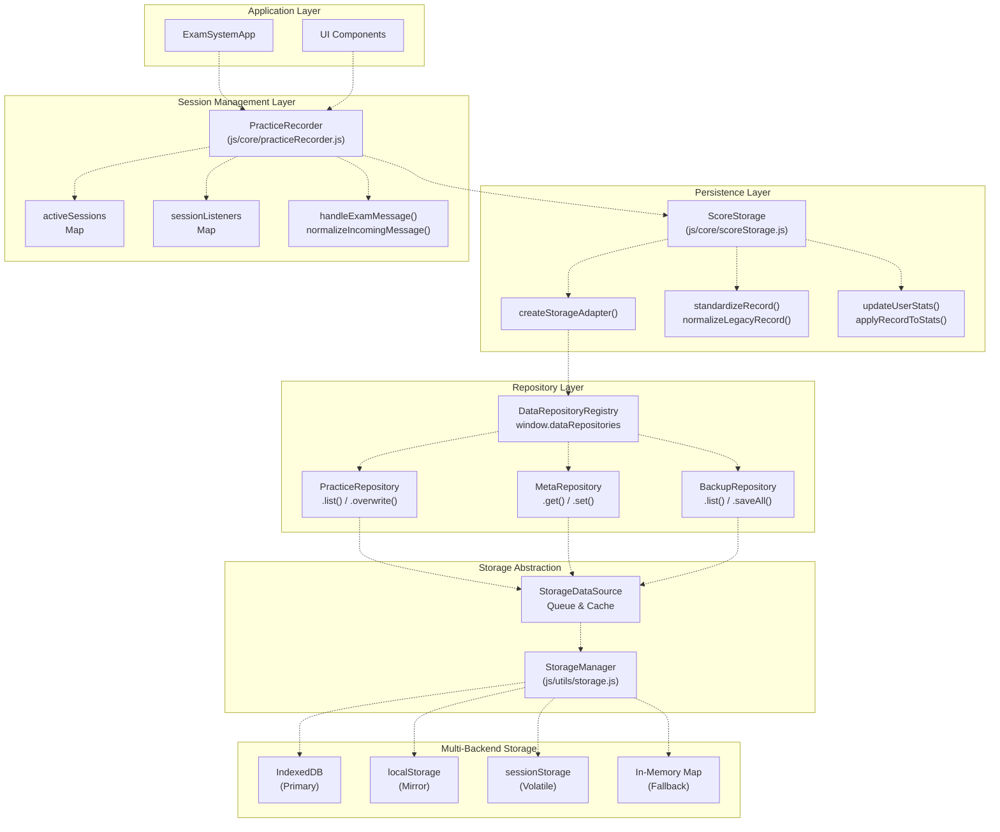

**Key Integration Points:**

* `PracticeRecorder` instantiates `ScoreStorage` during construction [js/core/practiceRecorder.js L16-L17](https://github.com/sallowayma-git/IELTS-practice/blob/92f64eb8/js/core/practiceRecorder.js#L16-L17)  and delegates all persistence operations to it
* `ScoreStorage` uses repository-based storage abstraction via `createStorageAdapter()` [js/core/scoreStorage.js L286-L353](https://github.com/sallowayma-git/IELTS-practice/blob/92f64eb8/js/core/scoreStorage.js#L286-L353)
* Both classes access `window.dataRepositories` (DataRepositoryRegistry) for repository instances
* Repositories use `StorageDataSource` which implements queue and cache mechanisms for write operations
* `StorageDataSource` delegates to `StorageManager` [js/utils/storage.js](https://github.com/sallowayma-git/IELTS-practice/blob/92f64eb8/js/utils/storage.js)  which implements the multi-backend strategy (IndexedDB primary, localStorage mirror, sessionStorage volatile, in-memory fallback)
* `PracticeRecorder` implements multi-retry logic [js/core/practiceRecorder.js L1306-L1348](https://github.com/sallowayma-git/IELTS-practice/blob/92f64eb8/js/core/practiceRecorder.js#L1306-L1348)  that falls back to direct repository access if `ScoreStorage` fails

Sources: [js/core/practiceRecorder.js L5-L27](https://github.com/sallowayma-git/IELTS-practice/blob/92f64eb8/js/core/practiceRecorder.js#L5-L27)

 [js/core/scoreStorage.js L5-L34](https://github.com/sallowayma-git/IELTS-practice/blob/92f64eb8/js/core/scoreStorage.js#L5-L34)

 [js/core/scoreStorage.js L286-L353](https://github.com/sallowayma-git/IELTS-practice/blob/92f64eb8/js/core/scoreStorage.js#L286-L353)

### Key Data Structures

The system manages multiple data structures across different lifecycle stages and storage layers:

#### PracticeRecorder Data Structures

| Data Structure | Type | Purpose | Persistence |
| --- | --- | --- | --- |
| `activeSessions` | `Map<examId, SessionData>` | Track in-progress practice sessions | `MetaRepository` key: `active_sessions` |
| `sessionListeners` | `Map<examId, IntervalId>` | Session health monitoring timers | Memory only (not persisted) |
| `practiceTypeCache` | `Map<examId, ExamEntry>` | Cache exam metadata for type resolution | Memory only |
| `autoSaveTimer` | `IntervalId` | Periodic session state persistence (30s) | Memory only |

**SessionData Structure:**

```yaml
{
  sessionId: string,              // Unique session identifier
  examId: string,                 // Practice exam identifier
  startTime: ISO8601,             // Session start timestamp
  lastActivity: ISO8601,          // Last interaction timestamp
  status: string,                 // 'started' | 'active' | 'paused' | 'completed' | 'error'
  progress: {
    currentQuestion: number,
    totalQuestions: number,
    answeredQuestions: number,
    timeSpent: number
  },
  answers: Array,                 // User responses
  metadata: Object                // Exam context + environment info
}
```

#### ScoreStorage Data Structures

| Data Structure | Repository Key | Purpose | Max Size | Repository |
| --- | --- | --- | --- | --- |
| Practice Records | `practice_records` | Completed practice sessions | 1000 records | PracticeRepository |
| User Statistics | `user_stats` | Aggregated performance metrics | Single object | MetaRepository |
| Storage Version | `storage_version` | Data schema version tracking | Single value | MetaRepository |
| Manual Backups | `manual_backups` | User-initiated data backups | 20 backups | BackupRepository |
| Temporary Records | `temp_practice_records` | Failed save recovery queue | 50 records | MetaRepository |
| Active Sessions | `active_sessions` | In-progress session state | No limit | MetaRepository |

**Practice Record Structure (Standardized):**

```yaml
{
  id: string,                     // Unique record identifier
  examId: string,
  sessionId: string,
  type: 'listening' | 'reading',  // Inferred practice type
  
  // Timing
  startTime: ISO8601,
  endTime: ISO8601,
  duration: number,               // Seconds
  date: ISO8601,                  // Record date (for stats)
  
  // Performance
  status: 'completed' | 'interrupted',
  score: number,
  totalQuestions: number,
  correctAnswers: number,
  accuracy: number,               // 0-1 range
  
  // Details
  answers: Array<AnswerObject>,
  questionTypePerformance: Object,
  
  // Context
  metadata: {
    examTitle: string,
    category: string,
    frequency: string,
    type: string
  },
  
  // System
  version: string,
  createdAt: ISO8601,
  updatedAt: ISO8601
}
```

Sources: [js/core/practiceRecorder.js L5-L27](https://github.com/sallowayma-git/IELTS-practice/blob/92f64eb8/js/core/practiceRecorder.js#L5-L27)

 [js/core/practiceRecorder.js L293-L335](https://github.com/sallowayma-git/IELTS-practice/blob/92f64eb8/js/core/practiceRecorder.js#L293-L335)

 [js/core/scoreStorage.js L5-L34](https://github.com/sallowayma-git/IELTS-practice/blob/92f64eb8/js/core/scoreStorage.js#L5-L34)

 [js/core/scoreStorage.js L15-L20](https://github.com/sallowayma-git/IELTS-practice/blob/92f64eb8/js/core/scoreStorage.js#L15-L20)

 [js/core/practiceRecorder.js L1295-L1299](https://github.com/sallowayma-git/IELTS-practice/blob/92f64eb8/js/core/practiceRecorder.js#L1295-L1299)

## PracticeRecorder: Session Lifecycle Management

The `PracticeRecorder` class orchestrates the complete practice session lifecycle, from initialization through completion, with comprehensive state tracking and automatic recovery.

### Session State Machine

```css
#mermaid-waf3tk4n5w9{font-family:ui-sans-serif,-apple-system,system-ui,Segoe UI,Helvetica;font-size:16px;fill:#333;}@keyframes edge-animation-frame{from{stroke-dashoffset:0;}}@keyframes dash{to{stroke-dashoffset:0;}}#mermaid-waf3tk4n5w9 .edge-animation-slow{stroke-dasharray:9,5!important;stroke-dashoffset:900;animation:dash 50s linear infinite;stroke-linecap:round;}#mermaid-waf3tk4n5w9 .edge-animation-fast{stroke-dasharray:9,5!important;stroke-dashoffset:900;animation:dash 20s linear infinite;stroke-linecap:round;}#mermaid-waf3tk4n5w9 .error-icon{fill:#dddddd;}#mermaid-waf3tk4n5w9 .error-text{fill:#222222;stroke:#222222;}#mermaid-waf3tk4n5w9 .edge-thickness-normal{stroke-width:1px;}#mermaid-waf3tk4n5w9 .edge-thickness-thick{stroke-width:3.5px;}#mermaid-waf3tk4n5w9 .edge-pattern-solid{stroke-dasharray:0;}#mermaid-waf3tk4n5w9 .edge-thickness-invisible{stroke-width:0;fill:none;}#mermaid-waf3tk4n5w9 .edge-pattern-dashed{stroke-dasharray:3;}#mermaid-waf3tk4n5w9 .edge-pattern-dotted{stroke-dasharray:2;}#mermaid-waf3tk4n5w9 .marker{fill:#999;stroke:#999;}#mermaid-waf3tk4n5w9 .marker.cross{stroke:#999;}#mermaid-waf3tk4n5w9 svg{font-family:ui-sans-serif,-apple-system,system-ui,Segoe UI,Helvetica;font-size:16px;}#mermaid-waf3tk4n5w9 p{margin:0;}#mermaid-waf3tk4n5w9 defs #statediagram-barbEnd{fill:#999;stroke:#999;}#mermaid-waf3tk4n5w9 g.stateGroup text{fill:#dddddd;stroke:none;font-size:10px;}#mermaid-waf3tk4n5w9 g.stateGroup text{fill:#333;stroke:none;font-size:10px;}#mermaid-waf3tk4n5w9 g.stateGroup .state-title{font-weight:bolder;fill:#333;}#mermaid-waf3tk4n5w9 g.stateGroup rect{fill:#ffffff;stroke:#dddddd;}#mermaid-waf3tk4n5w9 g.stateGroup line{stroke:#999;stroke-width:1;}#mermaid-waf3tk4n5w9 .transition{stroke:#999;stroke-width:1;fill:none;}#mermaid-waf3tk4n5w9 .stateGroup .composit{fill:#f4f4f4;border-bottom:1px;}#mermaid-waf3tk4n5w9 .stateGroup .alt-composit{fill:#e0e0e0;border-bottom:1px;}#mermaid-waf3tk4n5w9 .state-note{stroke:#e6d280;fill:#fff5ad;}#mermaid-waf3tk4n5w9 .state-note text{fill:#333;stroke:none;font-size:10px;}#mermaid-waf3tk4n5w9 .stateLabel .box{stroke:none;stroke-width:0;fill:#ffffff;opacity:0.5;}#mermaid-waf3tk4n5w9 .edgeLabel .label rect{fill:#ffffff;opacity:0.5;}#mermaid-waf3tk4n5w9 .edgeLabel{background-color:#ffffff;text-align:center;}#mermaid-waf3tk4n5w9 .edgeLabel p{background-color:#ffffff;}#mermaid-waf3tk4n5w9 .edgeLabel rect{opacity:0.5;background-color:#ffffff;fill:#ffffff;}#mermaid-waf3tk4n5w9 .edgeLabel .label text{fill:#333;}#mermaid-waf3tk4n5w9 .label div .edgeLabel{color:#333;}#mermaid-waf3tk4n5w9 .stateLabel text{fill:#333;font-size:10px;font-weight:bold;}#mermaid-waf3tk4n5w9 .node circle.state-start{fill:#999;stroke:#999;}#mermaid-waf3tk4n5w9 .node .fork-join{fill:#999;stroke:#999;}#mermaid-waf3tk4n5w9 .node circle.state-end{fill:#dddddd;stroke:#f4f4f4;stroke-width:1.5;}#mermaid-waf3tk4n5w9 .end-state-inner{fill:#f4f4f4;stroke-width:1.5;}#mermaid-waf3tk4n5w9 .node rect{fill:#ffffff;stroke:#dddddd;stroke-width:1px;}#mermaid-waf3tk4n5w9 .node polygon{fill:#ffffff;stroke:#dddddd;stroke-width:1px;}#mermaid-waf3tk4n5w9 #statediagram-barbEnd{fill:#999;}#mermaid-waf3tk4n5w9 .statediagram-cluster rect{fill:#ffffff;stroke:#dddddd;stroke-width:1px;}#mermaid-waf3tk4n5w9 .cluster-label,#mermaid-waf3tk4n5w9 .nodeLabel{color:#333;}#mermaid-waf3tk4n5w9 .statediagram-cluster rect.outer{rx:5px;ry:5px;}#mermaid-waf3tk4n5w9 .statediagram-state .divider{stroke:#dddddd;}#mermaid-waf3tk4n5w9 .statediagram-state .title-state{rx:5px;ry:5px;}#mermaid-waf3tk4n5w9 .statediagram-cluster.statediagram-cluster .inner{fill:#f4f4f4;}#mermaid-waf3tk4n5w9 .statediagram-cluster.statediagram-cluster-alt .inner{fill:#f8f8f8;}#mermaid-waf3tk4n5w9 .statediagram-cluster .inner{rx:0;ry:0;}#mermaid-waf3tk4n5w9 .statediagram-state rect.basic{rx:5px;ry:5px;}#mermaid-waf3tk4n5w9 .statediagram-state rect.divider{stroke-dasharray:10,10;fill:#f8f8f8;}#mermaid-waf3tk4n5w9 .note-edge{stroke-dasharray:5;}#mermaid-waf3tk4n5w9 .statediagram-note rect{fill:#fff5ad;stroke:#e6d280;stroke-width:1px;rx:0;ry:0;}#mermaid-waf3tk4n5w9 .statediagram-note rect{fill:#fff5ad;stroke:#e6d280;stroke-width:1px;rx:0;ry:0;}#mermaid-waf3tk4n5w9 .statediagram-note text{fill:#333;}#mermaid-waf3tk4n5w9 .statediagram-note .nodeLabel{color:#333;}#mermaid-waf3tk4n5w9 .statediagram .edgeLabel{color:red;}#mermaid-waf3tk4n5w9 #dependencyStart,#mermaid-waf3tk4n5w9 #dependencyEnd{fill:#999;stroke:#999;stroke-width:1;}#mermaid-waf3tk4n5w9 .statediagramTitleText{text-anchor:middle;font-size:18px;fill:#333;}#mermaid-waf3tk4n5w9 :root{--mermaid-font-family:"trebuchet ms",verdana,arial,sans-serif;}startPracticeSession()handleSessionStarted()handleSessionPaused()handleSessionResumed()handleSessionCompleted()handleSessionError()checkSessionActivity()restoreActiveSessions()session_resumedendPracticeSession()endPracticeSession()endPracticeSession()startedactivepausedcompletederrortimeoutrestored
```

**State Descriptions:**

| State | Description | Triggers | Next States |
| --- | --- | --- | --- |
| `started` | Session created, awaiting confirmation | `startPracticeSession()` | `active`, `restored` |
| `active` | Practice in progress, receiving updates | `handleSessionStarted()` | `paused`, `completed`, `error`, `timeout` |
| `paused` | User temporarily stopped | `handleSessionPaused()` | `active` |
| `restored` | Recovered from storage on init | `restoreActiveSessions()` | `active` |
| `completed` | Session finished successfully | `handleSessionCompleted()` | Terminal |
| `error` | Unrecoverable error occurred | `handleSessionError()` | Terminal |
| `timeout` | 30min inactivity detected | `checkSessionActivity()` | Terminal |

Sources: [js/core/practiceRecorder.js L293-L335](https://github.com/sallowayma-git/IELTS-practice/blob/92f64eb8/js/core/practiceRecorder.js#L293-L335)

 [js/core/practiceRecorder.js L340-L360](https://github.com/sallowayma-git/IELTS-practice/blob/92f64eb8/js/core/practiceRecorder.js#L340-L360)

 [js/core/practiceRecorder.js L365-L383](https://github.com/sallowayma-git/IELTS-practice/blob/92f64eb8/js/core/practiceRecorder.js#L365-L383)

 [js/core/practiceRecorder.js L387-L442](https://github.com/sallowayma-git/IELTS-practice/blob/92f64eb8/js/core/practiceRecorder.js#L387-L442)

 [js/core/practiceRecorder.js L447-L506](https://github.com/sallowayma-git/IELTS-practice/blob/92f64eb8/js/core/practiceRecorder.js#L447-L506)

 [js/core/practiceRecorder.js L511-L553](https://github.com/sallowayma-git/IELTS-practice/blob/92f64eb8/js/core/practiceRecorder.js#L511-L553)

 [js/core/practiceRecorder.js L579-L593](https://github.com/sallowayma-git/IELTS-practice/blob/92f64eb8/js/core/practiceRecorder.js#L579-L593)

### Session Initialization and Communication Setup

The `startPracticeSession()` method creates a session and prepares for cross-window communication:

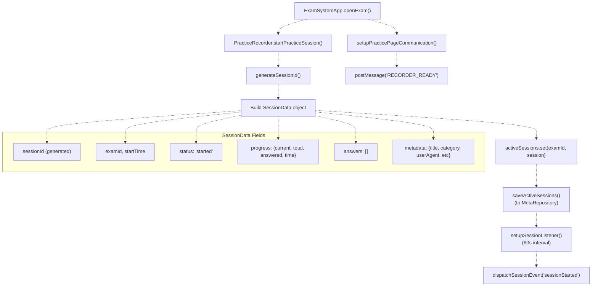

**Key Methods:**

* `startPracticeSession(examId, examData)`: Creates session, stores state, sets up monitoring
* `generateSessionId()`: Creates unique identifier: `session_${timestamp}_${random}`
* `setupSessionListener(examId)`: Creates 60-second interval timer for activity checks
* `saveActiveSessions()`: Persists all active sessions to `MetaRepository` key `active_sessions`

Sources: [js/core/practiceRecorder.js L770-L812](https://github.com/sallowayma-git/IELTS-practice/blob/92f64eb8/js/core/practiceRecorder.js#L770-L812)

 [js/core/practiceRecorder.js L1207-L1214](https://github.com/sallowayma-git/IELTS-practice/blob/92f64eb8/js/core/practiceRecorder.js#L1207-L1214)

 [js/core/practiceRecorder.js L1283-L1286](https://github.com/sallowayma-git/IELTS-practice/blob/92f64eb8/js/core/practiceRecorder.js#L1283-L1286)

### Message Handling and Normalization

The `PracticeRecorder` implements sophisticated message normalization to handle various message formats from practice windows:

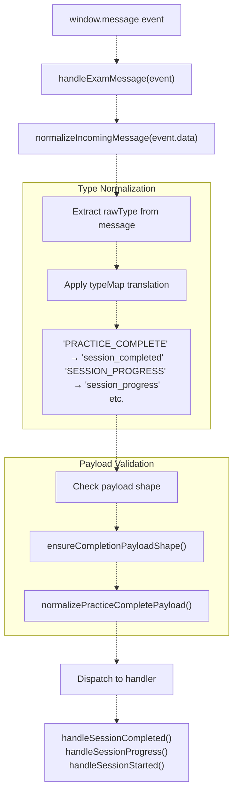

**Message Type Mappings:**

| Raw Type | Normalized Type | Handler |
| --- | --- | --- |
| `PRACTICE_COMPLETE`, `practice_complete`, `practice_completed` | `session_completed` | `handleSessionCompleted()` |
| `SESSION_PROGRESS`, `session_progress`, `practice_progress` | `session_progress` | `handleSessionProgress()` |
| `session_started` | `session_started` | `handleSessionStarted()` |
| `session_paused` | `session_paused` | `handleSessionPaused()` |
| `session_resumed` | `session_resumed` | `handleSessionResumed()` |
| `session_error` | `session_error` | `handleSessionError()` |

**Payload Normalization Process:**

The `normalizePracticeCompletePayload()` method handles diverse data formats:

1. **Score Information Extraction**: Merges `scoreInfo`, `results`, and top-level fields
2. **Answer Map Construction**: Normalizes `answers`, `answerMap`, `realData.answers`
3. **Correct Answer Extraction**: Derives from `correctAnswers`, `answerComparison`, `scoreInfo.details`
4. **Numeric Field Validation**: Ensures `totalQuestions`, `correctAnswers`, `accuracy` are valid numbers
5. **ExamId Resolution**: Tries `examId`, `originalExamId`, `derivedExamId`, `metadata.examId`

Sources: [js/core/practiceRecorder.js L265-L296](https://github.com/sallowayma-git/IELTS-practice/blob/92f64eb8/js/core/practiceRecorder.js#L265-L296)

 [js/core/practiceRecorder.js L298-L338](https://github.com/sallowayma-git/IELTS-practice/blob/92f64eb8/js/core/practiceRecorder.js#L298-L338)

 [js/core/practiceRecorder.js L340-L350](https://github.com/sallowayma-git/IELTS-practice/blob/92f64eb8/js/core/practiceRecorder.js#L340-L350)

 [js/core/practiceRecorder.js L352-L431](https://github.com/sallowayma-git/IELTS-practice/blob/92f64eb8/js/core/practiceRecorder.js#L352-L431)

### Answer Normalization and Validation

The `PracticeRecorder` implements comprehensive answer normalization to handle diverse data formats from practice windows:

#### Answer Value Normalization

The `normalizeAnswerValue()` method sanitizes individual answer values:

**Normalization Rules:**

| Input Type | Processing | Output |
| --- | --- | --- |
| `undefined`, `null` | → | Empty string `''` |
| String | Trim, filter `[object Object]` patterns | Trimmed string or `''` |
| Number, Boolean | Convert to string | String representation |
| Array | Recursive normalize, join with commas | Comma-separated string |
| Object | Extract from `value`, `label`, `text`, `answer`, `content` keys | Extracted string or `''` |

**Special Cases:**

* Filters out `[object Object]` invalid serializations
* Extracts `innerText` or `textContent` from DOM-like objects
* Logs warnings for unparseable objects

#### Answer Map Construction

The `normalizeAnswerMap()` method converts various answer formats to a consistent `{questionId: answer}` map:

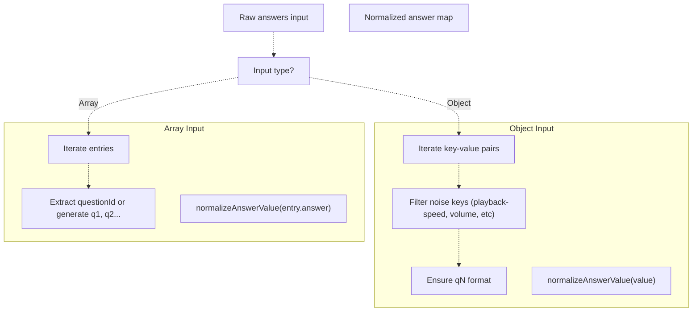

**Noise Key Filtering:**

The `isNoiseKey()` method filters out non-answer keys:

* Audio controls: `playback-speed`, `volume-slider`, `audio-duration`
* Metadata: `sessionid`, `examid`, `metadata`, `config`
* Invalid question numbers: Outside range [1, 200]

#### Answer Comparison Normalization

The `normalizeAnswerComparison()` method standardizes comparison objects:

```
// Input variations
{
  q1: { userAnswer: "A", correctAnswer: "B", isCorrect: false },
  q2: { user: "C", correct: "C" },
  q3: { answer: "D", correct: "D", isCorrect: true }
}

// Normalized output
{
  q1: { questionId: "q1", userAnswer: "A", correctAnswer: "B", isCorrect: false },
  q2: { questionId: "q2", userAnswer: "C", correctAnswer: "C", isCorrect: null },
  q3: { questionId: "q3", userAnswer: "D", correctAnswer: "D", isCorrect: true }
}
```

Sources: [js/core/practiceRecorder.js L478-L527](https://github.com/sallowayma-git/IELTS-practice/blob/92f64eb8/js/core/practiceRecorder.js#L478-L527)

 [js/core/practiceRecorder.js L529-L554](https://github.com/sallowayma-git/IELTS-practice/blob/92f64eb8/js/core/practiceRecorder.js#L529-L554)

 [js/core/practiceRecorder.js L556-L598](https://github.com/sallowayma-git/IELTS-practice/blob/92f64eb8/js/core/practiceRecorder.js#L556-L598)

 [js/core/practiceRecorder.js L651-L682](https://github.com/sallowayma-git/IELTS-practice/blob/92f64eb8/js/core/practiceRecorder.js#L651-L682)

### Auto-Save and Session Monitoring

The `PracticeRecorder` implements multiple monitoring and persistence mechanisms to prevent data loss:

#### Automatic Persistence

| Mechanism | Interval/Trigger | Method | Purpose |
| --- | --- | --- | --- |
| Auto-save timer | 30 seconds | `startAutoSave()` → `saveAllSessions()` | Periodic state persistence |
| Session listeners | 60 seconds per session | `setupSessionListener()` → `checkSessionActivity()` | Detect stale sessions |
| beforeunload event | Page close/navigation | `saveAllSessions()` | Final state save |
| visibilitychange event | Tab becomes visible | `checkSessionStatus()` | Resume monitoring |

#### Session Timeout Detection

The `checkSessionActivity()` method monitors for inactive sessions:

```javascript
// Triggered every 60 seconds per active session
checkSessionActivity(examId) {
  const session = activeSessions.get(examId);
  const inactiveTime = now - lastActivity;
  
  if (inactiveTime > 30 * 60 * 1000) {  // 30 minutes
    endPracticeSession(examId, 'timeout');
  }
}
```

**Timeout Behavior:**

* Sessions with no `lastActivity` updates for 30 minutes are automatically terminated
* Interrupted records are saved with reason: `'timeout'`
* Session listeners and active session entries are cleaned up

Sources: [js/core/practiceRecorder.js L13-L14](https://github.com/sallowayma-git/IELTS-practice/blob/92f64eb8/js/core/practiceRecorder.js#L13-L14)

 [js/core/practiceRecorder.js L1256-L1266](https://github.com/sallowayma-git/IELTS-practice/blob/92f64eb8/js/core/practiceRecorder.js#L1256-L1266)

 [js/core/practiceRecorder.js L1207-L1214](https://github.com/sallowayma-git/IELTS-practice/blob/92f64eb8/js/core/practiceRecorder.js#L1207-L1214)

 [js/core/practiceRecorder.js L1229-L1242](https://github.com/sallowayma-git/IELTS-practice/blob/92f64eb8/js/core/practiceRecorder.js#L1229-L1242)

 [js/core/practiceRecorder.js L1247-L1251](https://github.com/sallowayma-git/IELTS-practice/blob/92f64eb8/js/core/practiceRecorder.js#L1247-L1251)

 [js/core/practiceRecorder.js L248-L260](https://github.com/sallowayma-git/IELTS-practice/blob/92f64eb8/js/core/practiceRecorder.js#L248-L260)

## Session Completion and Data Flow

The `handleSessionCompleted()` method orchestrates the complex process of finalizing a practice session and persisting its data.

### Session Completion Process

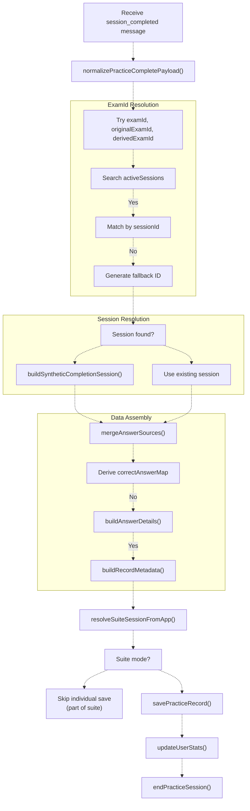

**Suite Practice Handling:**

The `resolveSuiteSessionFromApp()` method checks if the exam is part of a suite:

1. **Check `suiteExamMap`**: Direct mapping from `app.suiteExamMap.get(examId)`
2. **Check `currentSuiteSession`**: Search in `app.currentSuiteSession.sequence`
3. **Check state**: Search in `app.state.suite.sequence`

If a `suiteSessionId` is found, the individual record is **not saved**. Instead, it's returned to the suite orchestrator for aggregation into the suite record.

**Answer Source Merging:**

The `mergeAnswerSources()` method combines answers from multiple sources with priority:

```
mergeAnswerSources(
  results.answerMap,                  // Highest priority
  results.answers,
  results.realData.answers,
  session.answers,
  convertComparisonToAnswerMap(answerComparison)  // Lowest priority
)
```

Sources: [js/core/practiceRecorder.js L866-L1057](https://github.com/sallowayma-git/IELTS-practice/blob/92f64eb8/js/core/practiceRecorder.js#L866-L1057)

 [js/core/practiceRecorder.js L1059-L1092](https://github.com/sallowayma-git/IELTS-practice/blob/92f64eb8/js/core/practiceRecorder.js#L1059-L1092)

 [js/core/practiceRecorder.js L600-L618](https://github.com/sallowayma-git/IELTS-practice/blob/92f64eb8/js/core/practiceRecorder.js#L600-L618)

## Data Persistence Strategy

The system employs a sophisticated multi-tiered storage strategy coordinated between `PracticeRecorder` and `ScoreStorage` to ensure data integrity under various failure conditions.

### Three-Tier Storage Hierarchy

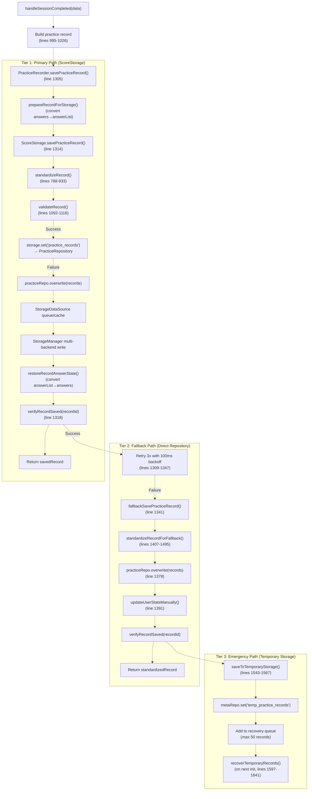

**Tier Characteristics:**

| Tier | Entry Method | Path Through Layers | Verification | Statistics Update | Retry Logic |
| --- | --- | --- | --- | --- | --- |
| Primary | `ScoreStorage.savePracticeRecord()` [line 571](https://github.com/sallowayma-git/IELTS-practice/blob/92f64eb8/line 571) | ScoreStorage → Adapter → Repository → StorageDataSource → StorageManager | Query from PracticeRepository | Automatic via `updateUserStats()` [line 1121](https://github.com/sallowayma-git/IELTS-practice/blob/92f64eb8/line 1121) | 3 attempts with 100ms backoff [lines 1309-1347](https://github.com/sallowayma-git/IELTS-practice/blob/92f64eb8/lines 1309-1347) |
| Fallback | `fallbackSavePracticeRecord()` [line 1356](https://github.com/sallowayma-git/IELTS-practice/blob/92f64eb8/line 1356) | Direct Repository → StorageDataSource → StorageManager | Query from PracticeRepository | Manual via `updateUserStatsManually()` [line 1714](https://github.com/sallowayma-git/IELTS-practice/blob/92f64eb8/line 1714) | Single attempt |
| Emergency | `saveToTemporaryStorage()` [line 1543](https://github.com/sallowayma-git/IELTS-practice/blob/92f64eb8/line 1543) | MetaRepository → StorageDataSource → StorageManager | None (queued for recovery) | Deferred until recovery | None (recovered on next init) |

**Answer Format Conversion:**

* **Before storage**: `prepareRecordForStorage()` converts `answers` object to `answerList` array
* **After retrieval**: `restoreRecordAnswerState()` converts `answerList` back to `answers` object
* This ensures ScoreStorage receives array format while application code uses object format

**Critical Error Detection:**

The `isCriticalError()` method identifies errors requiring immediate fallback:

* `QuotaExceededError`: Storage quota exhausted
* `localStorage not available`: Storage system unavailable
* `Storage quota exceeded`: Capacity limit reached

When critical errors occur, the system skips retries and immediately falls back to the next tier.

Sources: [js/core/practiceRecorder.js L1305-L1351](https://github.com/sallowayma-git/IELTS-practice/blob/92f64eb8/js/core/practiceRecorder.js#L1305-L1351)

 [js/core/practiceRecorder.js L1356-L1402](https://github.com/sallowayma-git/IELTS-practice/blob/92f64eb8/js/core/practiceRecorder.js#L1356-L1402)

 [js/core/practiceRecorder.js L1543-L1567](https://github.com/sallowayma-git/IELTS-practice/blob/92f64eb8/js/core/practiceRecorder.js#L1543-L1567)

 [js/core/practiceRecorder.js L1597-L1641](https://github.com/sallowayma-git/IELTS-practice/blob/92f64eb8/js/core/practiceRecorder.js#L1597-L1641)

 [js/core/scoreStorage.js L571-L685](https://github.com/sallowayma-git/IELTS-practice/blob/92f64eb8/js/core/scoreStorage.js#L571-L685)

### Record Standardization

Both `PracticeRecorder` and `ScoreStorage` implement record standardization to ensure consistent data format, but with different purposes and timing.

#### PracticeRecorder: Fallback Standardization

The `standardizeRecordForFallback()` method normalizes records when the primary storage path fails:

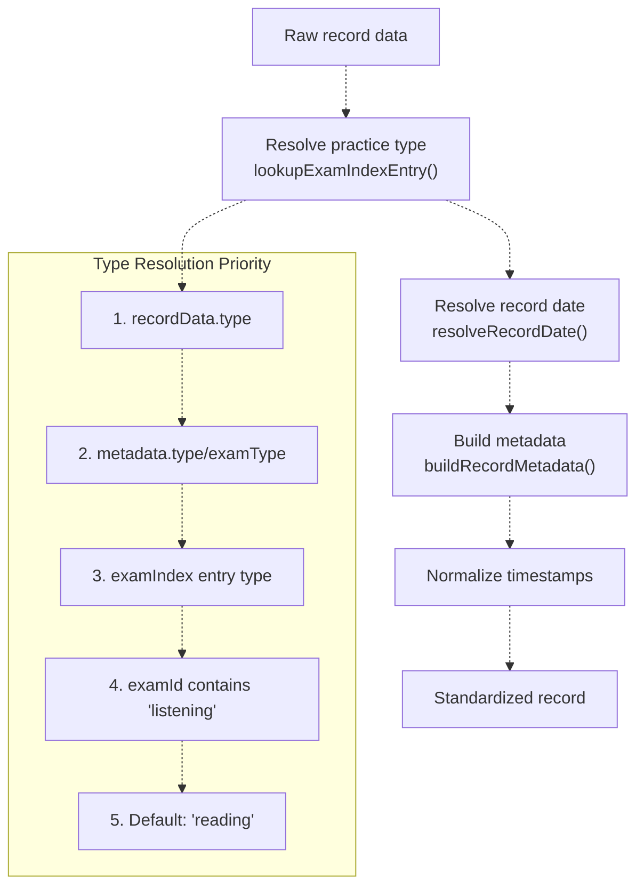

**Key Methods Used:**

* `normalizePracticeType(rawType)`: Converts variations to `'listening'` or `'reading'`
* `lookupExamIndexEntry(examId)`: Searches exam indices with caching
* `resolvePracticeType(session, examEntry)`: Multi-source type determination
* `resolveRecordDate(session, fallbackEndTime)`: Extracts valid date from multiple fields
* `buildRecordMetadata(session, examEntry, type)`: Constructs complete metadata object

**Fallback Markers:**

```yaml
{
  version: '1.0.0',
  savedBy: 'fallback',              // Indicates fallback save path
  fallbackReason: 'ScoreStorage unavailable'
}
```

Sources: [js/core/practiceRecorder.js L728-L798](https://github.com/sallowayma-git/IELTS-practice/blob/92f64eb8/js/core/practiceRecorder.js#L728-L798)

 [js/core/practiceRecorder.js L29-L90](https://github.com/sallowayma-git/IELTS-practice/blob/92f64eb8/js/core/practiceRecorder.js#L29-L90)

 [js/core/practiceRecorder.js L92-L101](https://github.com/sallowayma-git/IELTS-practice/blob/92f64eb8/js/core/practiceRecorder.js#L92-L101)

 [js/core/practiceRecorder.js L180-L195](https://github.com/sallowayma-git/IELTS-practice/blob/92f64eb8/js/core/practiceRecorder.js#L180-L195)

## ScoreStorage: Data Persistence and Normalization

The `ScoreStorage` class provides the primary data persistence layer with comprehensive record normalization, statistics management, and backup functionality.

### Storage Adapter Architecture

`ScoreStorage` uses a repository-based storage adapter to abstract persistence operations:

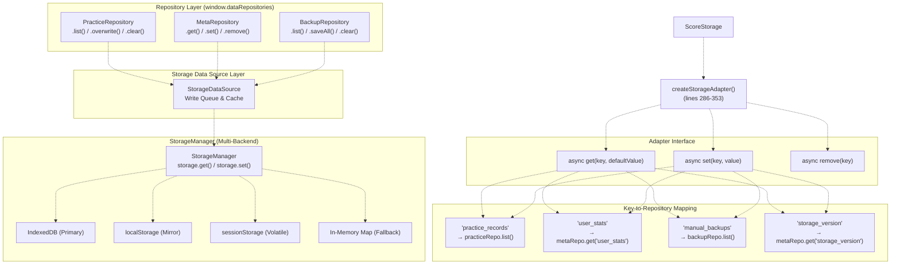

**Storage Key Constants:**

```yaml
// js/core/scoreStorage.js:15-20
storageKeys = {
  practiceRecords: 'practice_records',    // → PracticeRepository
  userStats: 'user_stats',                // → MetaRepository
  storageVersion: 'storage_version',      // → MetaRepository
  backupData: 'manual_backups'            // → BackupRepository
}
```

**Adapter Benefits:**

* Decouples ScoreStorage from specific repository implementations
* Provides async API with error handling
* Handles repository routing based on storage key via switch statement [js/core/scoreStorage.js L295-L350](https://github.com/sallowayma-git/IELTS-practice/blob/92f64eb8/js/core/scoreStorage.js#L295-L350)
* Repositories delegate to StorageDataSource for queue/cache layer
* StorageDataSource delegates to StorageManager for multi-backend persistence
* Enables easy testing and mocking

**Repository Access Pattern:**

```javascript
// Example: Getting practice records
const records = await this.storage.get(this.storageKeys.practiceRecords)
// → Adapter routes to practiceRepo.list()
// → PracticeRepository uses StorageDataSource
// → StorageDataSource uses StorageManager
// → StorageManager tries IndexedDB, then localStorage, then sessionStorage, then in-memory
```

Sources: [js/core/scoreStorage.js L15-L20](https://github.com/sallowayma-git/IELTS-practice/blob/92f64eb8/js/core/scoreStorage.js#L15-L20)

 [js/core/scoreStorage.js L286-L353](https://github.com/sallowayma-git/IELTS-practice/blob/92f64eb8/js/core/scoreStorage.js#L286-L353)

### Record Standardization Pipeline

The `savePracticeRecord()` method processes raw records through a standardization pipeline:

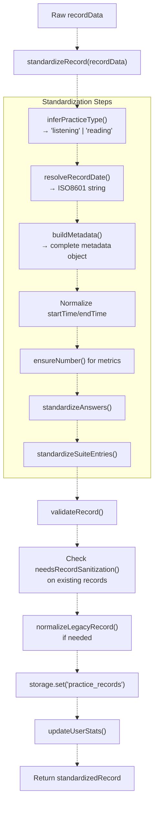

**Type Inference Priority:**

1. `recordData.type`
2. `metadata.type` or `metadata.examType`
3. `examId` contains "listening"
4. Default: `'reading'`

**Date Resolution Priority:**

1. `metadata.date`
2. `recordData.date`
3. `recordData.endTime`
4. `recordData.completedAt`
5. `recordData.startTime`
6. `recordData.timestamp`
7. Current timestamp

**Validation Rules:**

* Required fields: `id`, `examId`, `startTime`, `endTime`
* Valid ISO8601 date formats
* `accuracy` in range [0, 1]
* `duration` ≥ 0

### Legacy Record Sanitization

The `ScoreStorage` automatically detects and repairs legacy records during save operations:

**Detection Criteria (`needsRecordSanitization()`):**

* Missing `type` field or `metadata.type`
* Non-numeric values in numeric fields (`score`, `totalQuestions`, `correctAnswers`, `accuracy`, `duration`)
* `NaN` values in numeric fields

**Normalization Process (`normalizeLegacyRecord()`):**

1. **Array Field Safety**: Clone `suiteEntries` arrays to prevent mutation
2. **Type Inference**: Apply `inferPracticeType()` if type missing
3. **Metadata Enrichment**: Build complete metadata with `buildMetadata()`
4. **Answer Standardization**: Normalize both `answers` and `answerList` formats
5. **Correct Answer Derivation**: Extract from `answerDetails`, `scoreInfo.details`, or `correctAnswerMap`
6. **Numeric Field Completion**: Use `deriveTotalQuestionCount()` and `deriveCorrectAnswerCount()` for missing values
7. **Time Field Defaults**: Fill missing `startTime`, `endTime` with fallbacks
8. **ScoreInfo Construction**: Build from answer details if missing

**Automatic Repair:**

```javascript
// During savePracticeRecord()
records = records.map(record => {
  if (!needsRecordSanitization(record)) return record;
  return normalizeLegacyRecord(record);
});
// Logs: "已自动修复 N 条历史练习记录字段缺失或格式问题"
```

Sources: [js/core/scoreStorage.js L424-L487](https://github.com/sallowayma-git/IELTS-practice/blob/92f64eb8/js/core/scoreStorage.js#L424-L487)

 [js/core/scoreStorage.js L591-L707](https://github.com/sallowayma-git/IELTS-practice/blob/92f64eb8/js/core/scoreStorage.js#L591-L707)

 [js/core/scoreStorage.js L489-L570](https://github.com/sallowayma-git/IELTS-practice/blob/92f64eb8/js/core/scoreStorage.js#L489-L570)

 [js/core/scoreStorage.js L572-L586](https://github.com/sallowayma-git/IELTS-practice/blob/92f64eb8/js/core/scoreStorage.js#L572-L586)

 [js/core/scoreStorage.js L26-L43](https://github.com/sallowayma-git/IELTS-practice/blob/92f64eb8/js/core/scoreStorage.js#L26-L43)

 [js/core/scoreStorage.js L45-L63](https://github.com/sallowayma-git/IELTS-practice/blob/92f64eb8/js/core/scoreStorage.js#L45-L63)

 [js/core/scoreStorage.js L65-L79](https://github.com/sallowayma-git/IELTS-practice/blob/92f64eb8/js/core/scoreStorage.js#L65-L79)

 [js/core/scoreStorage.js L835-L861](https://github.com/sallowayma-git/IELTS-practice/blob/92f64eb8/js/core/scoreStorage.js#L835-L861)

### Record Normalization for Display

The `normalizeRecordFields()` method ensures UI-friendly data format by filling missing fields from multiple sources:

**Normalization Rules:**

| Field | Fallback Chain | Default |
| --- | --- | --- |
| `metadata.examTitle` | `metadata.examTitle` → `title` → `examTitle` → `examId` | `''` |
| `metadata.category` | `metadata.category` → `category` | `''` |
| `startTime` | `startTime` → `realData.startTime` → `date` | - |
| `endTime` | `endTime` → `realData.endTime` → computed from duration | - |
| `duration` | `duration` → `realData.duration` → `timeSpent` → computed | `0` |
| `correctAnswers` | `correctAnswers` → `score` → `scoreInfo.correct` | - |
| `totalQuestions` | `totalQuestions` → `scoreInfo.total` → `answers.length` | - |
| `accuracy` | `accuracy` → `scoreInfo.accuracy` → computed | `0` |

**Purpose:**

* Handles records from multiple data collection sources
* Ensures backward compatibility with old record formats
* Fills missing fields for UI display
* Does not modify stored records, only returned data

Sources: [js/core/scoreStorage.js L734-L858](https://github.com/sallowayma-git/IELTS-practice/blob/92f64eb8/js/core/scoreStorage.js#L734-L858)

## User Statistics Management

Both classes participate in maintaining aggregated user statistics, with `ScoreStorage` providing the primary implementation and `PracticeRecorder` offering a manual fallback.

### Statistics Structure and Updates

```mermaid
flowchart TD

RECORD["New practice record saved"]
GET["Get current stats"]
BASE["Update totalPractices, totalTimeSpent, averageScore"]
CAT["updateCategoryStats()"]
QT["updateQuestionTypeStats()"]
STREAK["updateStreakDays()"]
ACH["checkAchievements()"]
SAVE["Save updated stats"]
DAYS["Extract practiceDays array"]
MIGRATE["Migrate from old streakDays if needed"]
SORT["Sort days chronologically"]
COUNT["Count consecutive days"]

RECORD -.-> GET
STREAK -.-> DAYS

subgraph subGraph1 ["Streak Calculation"]
    DAYS
    MIGRATE
    SORT
    COUNT
    DAYS -.-> MIGRATE
    MIGRATE -.-> SORT
    SORT -.-> COUNT
end

subgraph ScoreStorage.updateUserStats() ["ScoreStorage.updateUserStats()"]
    GET
    BASE
    CAT
    QT
    STREAK
    ACH
    SAVE
    GET -.-> BASE
    BASE -.-> CAT
    CAT -.-> QT
    QT -.-> STREAK
    STREAK -.-> ACH
    ACH -.-> SAVE
end
```

**Default User Statistics Structure:**

```yaml
{
  totalPractices: 0,
  totalTimeSpent: 0,              // Seconds
  averageScore: 0,                // 0-1 range
  
  categoryStats: {
    [category]: {
      practices: 0,
      avgScore: 0,
      timeSpent: 0,
      bestScore: 0,
      totalQuestions: 0,
      correctAnswers: 0
    }
  },
  
  questionTypeStats: {
    [type]: {
      practices: 0,
      accuracy: 0,
      totalQuestions: 0,
      correctAnswers: 0,
      avgTimePerQuestion: 0
    }
  },
  
  streakDays: 0,                  // Current consecutive days
  practiceDays: [],               // Array of 'YYYY-MM-DD' strings
  lastPracticeDate: null,         // 'YYYY-MM-DD'
  
  achievements: [],               // Achievement IDs
  createdAt: ISO8601,
  updatedAt: ISO8601
}
```

**Achievement Detection:**

| Achievement ID | Criteria | Description |
| --- | --- | --- |
| `first-practice` | `totalPractices === 1` | First practice completed |
| `week-streak` | `streakDays >= 7` | 7 consecutive practice days |
| `month-streak` | `streakDays >= 30` | 30 consecutive practice days |
| `high-scorer` | `accuracy >= 0.9` | 90%+ accuracy on a practice |
| `{category}-master` | `practices >= 10 && avgScore >= 0.8` | Category mastery |

Sources: [js/core/scoreStorage.js L296-L316](https://github.com/sallowayma-git/IELTS-practice/blob/92f64eb8/js/core/scoreStorage.js#L296-L316)

 [js/core/scoreStorage.js L466-L500](https://github.com/sallowayma-git/IELTS-practice/blob/92f64eb8/js/core/scoreStorage.js#L466-L500)

 [js/core/scoreStorage.js L505-L530](https://github.com/sallowayma-git/IELTS-practice/blob/92f64eb8/js/core/scoreStorage.js#L505-L530)

 [js/core/scoreStorage.js L535-L565](https://github.com/sallowayma-git/IELTS-practice/blob/92f64eb8/js/core/scoreStorage.js#L535-L565)

 [js/core/scoreStorage.js L570-L629](https://github.com/sallowayma-git/IELTS-practice/blob/92f64eb8/js/core/scoreStorage.js#L570-L629)

 [js/core/scoreStorage.js L634-L669](https://github.com/sallowayma-git/IELTS-practice/blob/92f64eb8/js/core/scoreStorage.js#L634-L669)

### Streak Days Migration

The `updateStreakDays()` method handles migration from legacy single-number `streakDays` to array-based `practiceDays`:

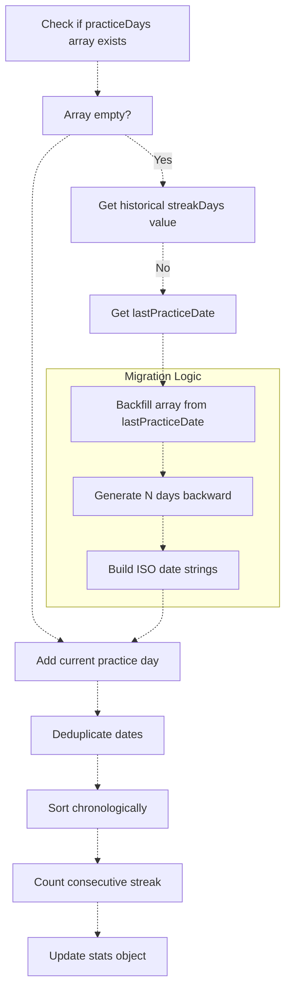

**Migration Example:**

```python
// Before: legacy format
stats.streakDays = 5
stats.lastPracticeDate = '2024-01-15'
stats.practiceDays = []  // Empty

// After: migrated to array
stats.practiceDays = ['2024-01-11', '2024-01-12', '2024-01-13', '2024-01-14', '2024-01-15']
stats.streakDays = 5     // Recalculated from array
```

Sources: [js/core/scoreStorage.js L570-L629](https://github.com/sallowayma-git/IELTS-practice/blob/92f64eb8/js/core/scoreStorage.js#L570-L629)

 [js/core/practiceRecorder.js L134-L178](https://github.com/sallowayma-git/IELTS-practice/blob/92f64eb8/js/core/practiceRecorder.js#L134-L178)

## Data Backup and Recovery

Both classes provide backup functionality with different scopes: `ScoreStorage` handles practice records and statistics, while `PracticeRecorder` delegates to `ScoreStorage` and adds session recovery.

### ScoreStorage Backup System

```mermaid
flowchart TD

EXPORT["exportData(format)"]
JSON["JSON stringify"]
CSV["convertToCSV()"]
IMPORT["importData(data, options)"]
MERGE["Merge or Replace mode"]
RB["restoreBackup(backupId)"]
FIND["Find backup by ID"]
EXTRACT["Extract data"]
RESTORE["Restore to repositories"]
CB["createBackup(backupName)"]
GATHER["Gather practiceRecords, userStats, storageVersion"]
BUILD["Build backup object"]
LOAD["Load existing backups"]
ADD["Add to backups array"]
PRUNE["Keep max 20 backups"]
SAVE["Save to BackupRepository"]

subgraph Import/Export ["Import/Export"]
    EXPORT
    JSON
    CSV
    IMPORT
    MERGE
    EXPORT -.-> JSON
    EXPORT -.-> CSV
    IMPORT -.-> MERGE
end

subgraph subGraph1 ["Backup Restoration"]
    RB
    FIND
    EXTRACT
    RESTORE
    RB -.-> FIND
    FIND -.-> EXTRACT
    EXTRACT -.-> RESTORE
end

subgraph subGraph0 ["Manual Backup Creation"]
    CB
    GATHER
    BUILD
    LOAD
    ADD
    PRUNE
    SAVE
    CB -.-> GATHER
    GATHER -.-> BUILD
    BUILD -.-> LOAD
    LOAD -.-> ADD
    ADD -.-> PRUNE
    PRUNE -.-> SAVE
end
```

**Backup Object Structure:**

```yaml
{
  id: 'score_backup_1234567890',  // Or custom name
  timestamp: ISO8601,
  type: 'score_storage',
  data: {
    practiceRecords: Array,
    userStats: Object,
    storageVersion: String
  }
}
```

**Import Modes:**

| Mode | Option | Behavior |
| --- | --- | --- |
| Merge | `{ merge: true }` | Add new records, keep existing ones, recalculate stats |
| Replace | `{ merge: false }` | Replace all records and stats with imported data |

Sources: [js/core/scoreStorage.js L863-L898](https://github.com/sallowayma-git/IELTS-practice/blob/92f64eb8/js/core/scoreStorage.js#L863-L898)

 [js/core/scoreStorage.js L903-L926](https://github.com/sallowayma-git/IELTS-practice/blob/92f64eb8/js/core/scoreStorage.js#L903-L926)

 [js/core/scoreStorage.js L931-L942](https://github.com/sallowayma-git/IELTS-practice/blob/92f64eb8/js/core/scoreStorage.js#L931-L942)

 [js/core/scoreStorage.js L947-L1048](https://github.com/sallowayma-git/IELTS-practice/blob/92f64eb8/js/core/scoreStorage.js#L947-L1048)

### PracticeRecorder Session Recovery

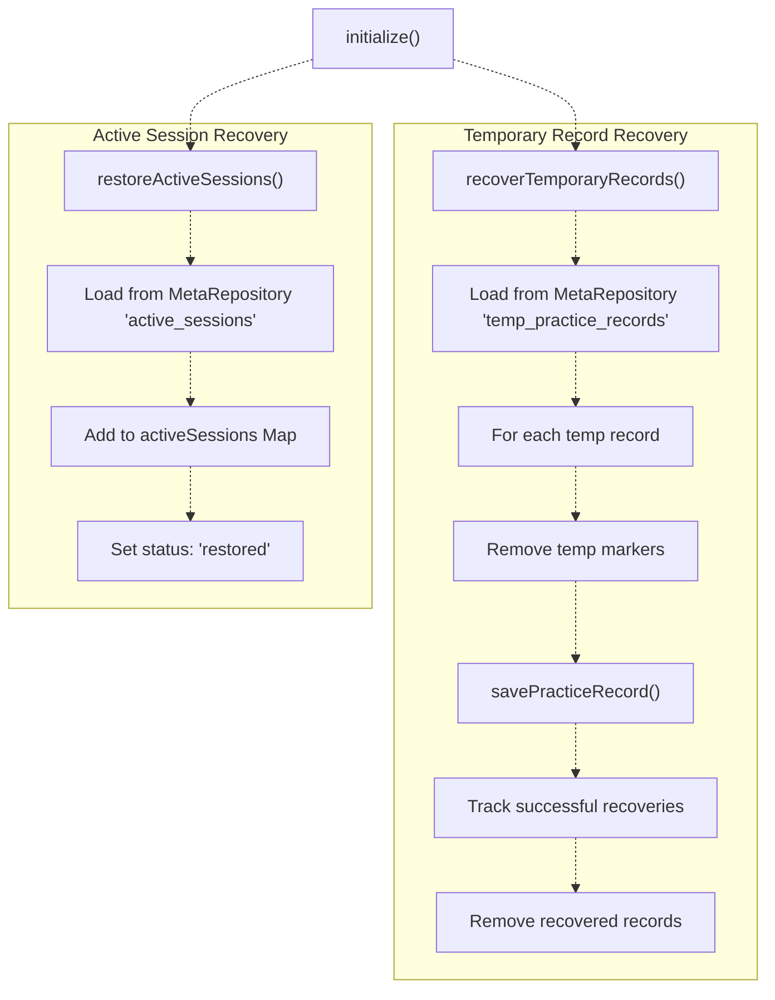

**Recovery Scenarios:**

| Scenario | Storage Location | Recovery Method | Outcome |
| --- | --- | --- | --- |
| Browser crash | `active_sessions` (MetaRepository) | `restoreActiveSessions()` | Sessions marked as 'restored', can resume |
| Failed save | `temp_practice_records` (MetaRepository) | `recoverTemporaryRecords()` | Retry save, remove temp markers |
| Page reload | Both | Both methods called during init | All data restored |

**Temporary Record Structure:**

```yaml
{
  ...practiceRecord,              // Standard record fields
  tempSavedAt: ISO8601,           // When saved to temp storage
  needsRecovery: true             // Recovery flag
}
```

Sources: [js/core/practiceRecorder.js L200-L221](https://github.com/sallowayma-git/IELTS-practice/blob/92f64eb8/js/core/practiceRecorder.js#L200-L221)

 [js/core/practiceRecorder.js L226-L239](https://github.com/sallowayma-git/IELTS-practice/blob/92f64eb8/js/core/practiceRecorder.js#L226-L239)

 [js/core/practiceRecorder.js L1497-L1541](https://github.com/sallowayma-git/IELTS-practice/blob/92f64eb8/js/core/practiceRecorder.js#L1497-L1541)

 [js/core/practiceRecorder.js L879-L898](https://github.com/sallowayma-git/IELTS-practice/blob/92f64eb8/js/core/practiceRecorder.js#L879-L898)

### Event System Integration

The recorder dispatches custom events for system-wide coordination:

| Event Type | Trigger | Data Payload |
| --- | --- | --- |
| `practicesessionStarted` | Session initialization | `{examId, sessionData}` |
| `practicesessionProgress` | Progress updates | `{examId, progress}` |
| `practicesessionCompleted` | Session completion | `{examId, practiceRecord}` |
| `practicesessionError` | Error conditions | `{examId, error}` |
| `practicesessionEnded` | Session termination | `{examId, reason}` |
| `practicerealDataProcessed` | Real data processing | `{examId, practiceRecord, dataSource}` |

Sources: [js/core/practiceRecorder.js L917-L923](https://github.com/sallowayma-git/IELTS-practice/blob/92f64eb8/js/core/practiceRecorder.js#L917-L923)

 [js/core/practiceRecorder.js L149-L151](https://github.com/sallowayma-git/IELTS-practice/blob/92f64eb8/js/core/practiceRecorder.js#L149-L151)

 [js/core/practiceRecorder.js L244-L246](https://github.com/sallowayma-git/IELTS-practice/blob/92f64eb8/js/core/practiceRecorder.js#L244-L246)

### Cross-Window Communication Setup

The `setupPracticePageCommunication()` method establishes bidirectional communication with practice windows:

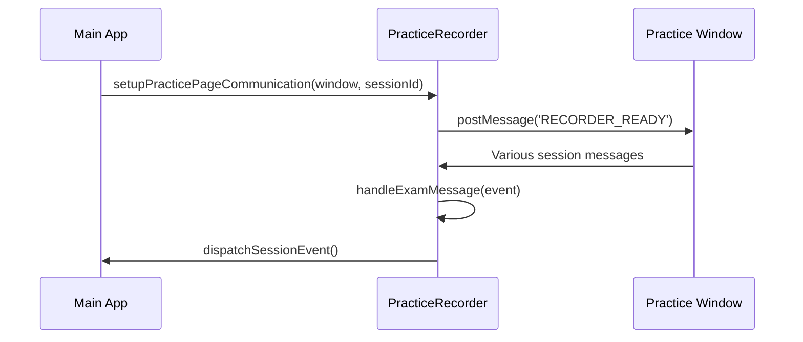

Sources: [js/core/practiceRecorder.js L1256-L1274](https://github.com/sallowayma-git/IELTS-practice/blob/92f64eb8/js/core/practiceRecorder.js#L1256-L1274)

 [js/core/practiceRecorder.js L66-L78](https://github.com/sallowayma-git/IELTS-practice/blob/92f64eb8/js/core/practiceRecorder.js#L66-L78)

 [js/core/practiceRecorder.js L82-L108](https://github.com/sallowayma-git/IELTS-practice/blob/92f64eb8/js/core/practiceRecorder.js#L82-L108)