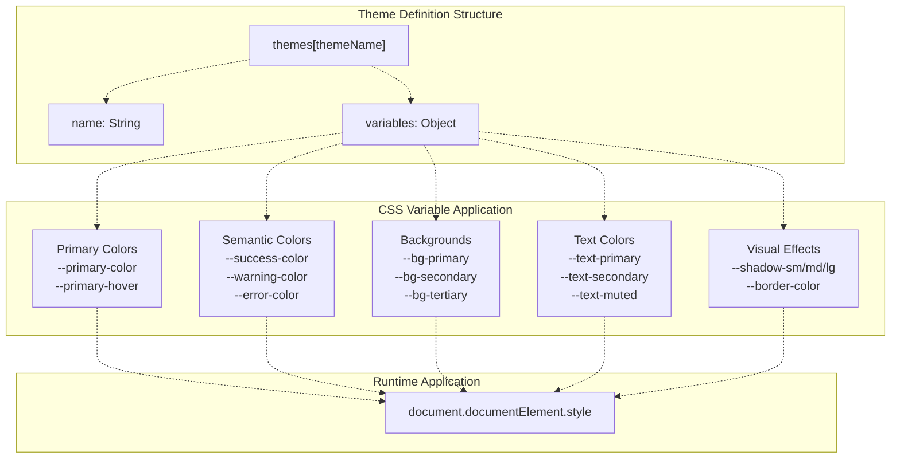

# Runtime Theme Management

> **Relevant source files**
> * [.superdesign/design_iterations/xiaodaidai_dashboard_1.html](https://github.com/sallowayma-git/IELTS-practice/blob/92f64eb8/.superdesign/design_iterations/xiaodaidai_dashboard_1.html)
> * [assets/data/vocabulary.json](https://github.com/sallowayma-git/IELTS-practice/blob/92f64eb8/assets/data/vocabulary.json)
> * [js/components/dataManagementPanel.js](https://github.com/sallowayma-git/IELTS-practice/blob/92f64eb8/js/components/dataManagementPanel.js)
> * [js/components/settingsPanel.js](https://github.com/sallowayma-git/IELTS-practice/blob/92f64eb8/js/components/settingsPanel.js)
> * [js/utils/helpers.js](https://github.com/sallowayma-git/IELTS-practice/blob/92f64eb8/js/utils/helpers.js)
> * [js/utils/themeManager.js](https://github.com/sallowayma-git/IELTS-practice/blob/92f64eb8/js/utils/themeManager.js)

This document describes the runtime theme management system, which enables dynamic theme switching, automatic theme detection based on system preferences, and accessibility customization. The `ThemeManager` class provides centralized control over visual themes, font sizing, motion preferences, and high contrast modes.

For information about the overall theme architecture and adapter pattern, see [Theme Architecture Overview](/sallowayma-git/IELTS-practice/7.1-theme-architecture-overview). For details on specific theme implementations (Melody, Academic, XiaoDai), see [Theme Variants](/sallowayma-git/IELTS-practice/7.3-theme-variants-(melody-academic-xiaodai)). For theme data access and synchronization, see [ThemeAdapterBase & Data Access](/sallowayma-git/IELTS-practice/7.2-themeadapterbase-and-data-access).

---

## ThemeManager Architecture

The `ThemeManager` class serves as the central controller for runtime theme operations. It manages theme definitions, applies CSS variable changes, detects system preferences, persists user choices, and coordinates with the settings UI.


**Sources:** [js/utils/themeManager.js L1-L409](https://github.com/sallowayma-git/IELTS-practice/blob/92f64eb8/js/utils/themeManager.js#L1-L409)

---

## Theme Definitions and CSS Variables

Each theme is defined as an object containing a display name and a map of CSS custom properties (variables). The `ThemeManager` maintains four built-in themes with comprehensive variable sets for colors, shadows, backgrounds, and text.

### Theme Registry Structure

| Theme Key | Display Name | Primary Use Case |
| --- | --- | --- |
| `xiaodaidai` | 小呆呆控制台 | Sun Jelly themed interface with warm gradients |
| `light` | 浅色主题 | Standard light mode with blue accents |
| `dark` | 深色主题 | Dark mode with reduced eye strain |
| `highContrast` | 高对比度主题 | Enhanced readability for visual accessibility |

### CSS Variable Categories

Each theme defines variables across these categories:

* **Primary Colors**: `--primary-color`, `--primary-color-light`, `--primary-hover`
* **Semantic Colors**: `--success-color`, `--warning-color`, `--error-color`, `--accent-color`
* **Backgrounds**: `--bg-primary`, `--bg-secondary`, `--bg-tertiary`
* **Text**: `--text-primary`, `--text-secondary`, `--text-tertiary`, `--text-muted`
* **Effects**: `--border-color`, `--shadow-sm`, `--shadow-md`, `--shadow-lg`



**Example: XiaoDaiDai Theme Definition**

```css
xiaodaidai: {
    name: '小呆呆控制台',
    variables: {
        '--primary-color': '#ffc83d',
        '--primary-color-light': 'rgba(255, 200, 61, 0.18)',
        '--accent-color': '#a1bfff',
        '--bg-primary': '#f7f9fb',
        '--text-primary': '#1f2937',
        // ... additional variables
    }
}
```

**Sources:** [js/utils/themeManager.js L7-L120](https://github.com/sallowayma-git/IELTS-practice/blob/92f64eb8/js/utils/themeManager.js#L7-L120)

---

## Runtime Theme Switching

Theme switching occurs through `setTheme()`, which updates the current theme, applies all CSS variables to the document root, updates body classes, and triggers dependent settings.

### Theme Application Sequence


**Sources:** [js/utils/themeManager.js L265-L280](https://github.com/sallowayma-git/IELTS-practice/blob/92f64eb8/js/utils/themeManager.js#L265-L280)

 [js/utils/themeManager.js L209-L236](https://github.com/sallowayma-git/IELTS-practice/blob/92f64eb8/js/utils/themeManager.js#L209-L236)

### Toggle Mechanism

The `toggleTheme()` method cycles through themes in a predefined order:

```
light → xiaodaidai → dark → highContrast → light
```

This allows keyboard shortcut access (Ctrl+Shift+T) for rapid theme switching during development or user preference exploration.

**Sources:** [js/utils/themeManager.js L282-L291](https://github.com/sallowayma-git/IELTS-practice/blob/92f64eb8/js/utils/themeManager.js#L282-L291)

---

## System Theme Detection and Auto-Theme

The `ThemeManager` integrates with browser media queries to detect system-level dark mode preferences and optionally synchronize the application theme automatically.

### Media Query Listeners


**Implementation Details:**

1. **Initial Detection**: On initialization, if `settings.autoTheme` is true, the manager checks `prefers-color-scheme` and sets the initial theme accordingly.
2. **Dynamic Updates**: Event listeners respond to system preference changes in real-time, automatically switching themes when the user changes their OS-level settings.
3. **Motion Preference**: The `prefers-reduced-motion` query is always monitored, regardless of `autoTheme`, to ensure accessibility compliance.

**Sources:** [js/utils/themeManager.js L163-L192](https://github.com/sallowayma-git/IELTS-practice/blob/92f64eb8/js/utils/themeManager.js#L163-L192)

### Auto-Theme Toggle

Users can enable or disable automatic theme synchronization:

```javascript
toggleAutoTheme() {
    this.settings.autoTheme = !this.settings.autoTheme;
    if (this.settings.autoTheme) {
        const darkModeQuery = window.matchMedia('(prefers-color-scheme: dark)');
        this.setTheme(darkModeQuery.matches ? 'dark' : 'light');
    }
}
```

**Sources:** [js/utils/themeManager.js L349-L365](https://github.com/sallowayma-git/IELTS-practice/blob/92f64eb8/js/utils/themeManager.js#L349-L365)

---

## Accessibility Settings

The `ThemeManager` provides three primary accessibility customizations: font sizing, motion reduction, and high contrast mode. Each setting is independently configurable and persisted.

### Font Size Management

| Size Value | CSS Class | Scale Factor | Use Case |
| --- | --- | --- | --- |
| `small` | `font-small` | 0.875rem | Compact displays, high information density |
| `normal` | *(no class)* | 1rem | Default comfortable reading |
| `large` | `font-large` | 1.125rem | Improved readability |
| `extra-large` | `font-extra-large` | 1.25rem | Maximum accessibility |

```python
#mermaid-axw6jrrk6am{font-family:ui-sans-serif,-apple-system,system-ui,Segoe UI,Helvetica;font-size:16px;fill:#333;}@keyframes edge-animation-frame{from{stroke-dashoffset:0;}}@keyframes dash{to{stroke-dashoffset:0;}}#mermaid-axw6jrrk6am .edge-animation-slow{stroke-dasharray:9,5!important;stroke-dashoffset:900;animation:dash 50s linear infinite;stroke-linecap:round;}#mermaid-axw6jrrk6am .edge-animation-fast{stroke-dasharray:9,5!important;stroke-dashoffset:900;animation:dash 20s linear infinite;stroke-linecap:round;}#mermaid-axw6jrrk6am .error-icon{fill:#dddddd;}#mermaid-axw6jrrk6am .error-text{fill:#222222;stroke:#222222;}#mermaid-axw6jrrk6am .edge-thickness-normal{stroke-width:1px;}#mermaid-axw6jrrk6am .edge-thickness-thick{stroke-width:3.5px;}#mermaid-axw6jrrk6am .edge-pattern-solid{stroke-dasharray:0;}#mermaid-axw6jrrk6am .edge-thickness-invisible{stroke-width:0;fill:none;}#mermaid-axw6jrrk6am .edge-pattern-dashed{stroke-dasharray:3;}#mermaid-axw6jrrk6am .edge-pattern-dotted{stroke-dasharray:2;}#mermaid-axw6jrrk6am .marker{fill:#999;stroke:#999;}#mermaid-axw6jrrk6am .marker.cross{stroke:#999;}#mermaid-axw6jrrk6am svg{font-family:ui-sans-serif,-apple-system,system-ui,Segoe UI,Helvetica;font-size:16px;}#mermaid-axw6jrrk6am p{margin:0;}#mermaid-axw6jrrk6am defs #statediagram-barbEnd{fill:#999;stroke:#999;}#mermaid-axw6jrrk6am g.stateGroup text{fill:#dddddd;stroke:none;font-size:10px;}#mermaid-axw6jrrk6am g.stateGroup text{fill:#333;stroke:none;font-size:10px;}#mermaid-axw6jrrk6am g.stateGroup .state-title{font-weight:bolder;fill:#333;}#mermaid-axw6jrrk6am g.stateGroup rect{fill:#ffffff;stroke:#dddddd;}#mermaid-axw6jrrk6am g.stateGroup line{stroke:#999;stroke-width:1;}#mermaid-axw6jrrk6am .transition{stroke:#999;stroke-width:1;fill:none;}#mermaid-axw6jrrk6am .stateGroup .composit{fill:#f4f4f4;border-bottom:1px;}#mermaid-axw6jrrk6am .stateGroup .alt-composit{fill:#e0e0e0;border-bottom:1px;}#mermaid-axw6jrrk6am .state-note{stroke:#e6d280;fill:#fff5ad;}#mermaid-axw6jrrk6am .state-note text{fill:#333;stroke:none;font-size:10px;}#mermaid-axw6jrrk6am .stateLabel .box{stroke:none;stroke-width:0;fill:#ffffff;opacity:0.5;}#mermaid-axw6jrrk6am .edgeLabel .label rect{fill:#ffffff;opacity:0.5;}#mermaid-axw6jrrk6am .edgeLabel{background-color:#ffffff;text-align:center;}#mermaid-axw6jrrk6am .edgeLabel p{background-color:#ffffff;}#mermaid-axw6jrrk6am .edgeLabel rect{opacity:0.5;background-color:#ffffff;fill:#ffffff;}#mermaid-axw6jrrk6am .edgeLabel .label text{fill:#333;}#mermaid-axw6jrrk6am .label div .edgeLabel{color:#333;}#mermaid-axw6jrrk6am .stateLabel text{fill:#333;font-size:10px;font-weight:bold;}#mermaid-axw6jrrk6am .node circle.state-start{fill:#999;stroke:#999;}#mermaid-axw6jrrk6am .node .fork-join{fill:#999;stroke:#999;}#mermaid-axw6jrrk6am .node circle.state-end{fill:#dddddd;stroke:#f4f4f4;stroke-width:1.5;}#mermaid-axw6jrrk6am .end-state-inner{fill:#f4f4f4;stroke-width:1.5;}#mermaid-axw6jrrk6am .node rect{fill:#ffffff;stroke:#dddddd;stroke-width:1px;}#mermaid-axw6jrrk6am .node polygon{fill:#ffffff;stroke:#dddddd;stroke-width:1px;}#mermaid-axw6jrrk6am #statediagram-barbEnd{fill:#999;}#mermaid-axw6jrrk6am .statediagram-cluster rect{fill:#ffffff;stroke:#dddddd;stroke-width:1px;}#mermaid-axw6jrrk6am .cluster-label,#mermaid-axw6jrrk6am .nodeLabel{color:#333;}#mermaid-axw6jrrk6am .statediagram-cluster rect.outer{rx:5px;ry:5px;}#mermaid-axw6jrrk6am .statediagram-state .divider{stroke:#dddddd;}#mermaid-axw6jrrk6am .statediagram-state .title-state{rx:5px;ry:5px;}#mermaid-axw6jrrk6am .statediagram-cluster.statediagram-cluster .inner{fill:#f4f4f4;}#mermaid-axw6jrrk6am .statediagram-cluster.statediagram-cluster-alt .inner{fill:#f8f8f8;}#mermaid-axw6jrrk6am .statediagram-cluster .inner{rx:0;ry:0;}#mermaid-axw6jrrk6am .statediagram-state rect.basic{rx:5px;ry:5px;}#mermaid-axw6jrrk6am .statediagram-state rect.divider{stroke-dasharray:10,10;fill:#f8f8f8;}#mermaid-axw6jrrk6am .note-edge{stroke-dasharray:5;}#mermaid-axw6jrrk6am .statediagram-note rect{fill:#fff5ad;stroke:#e6d280;stroke-width:1px;rx:0;ry:0;}#mermaid-axw6jrrk6am .statediagram-note rect{fill:#fff5ad;stroke:#e6d280;stroke-width:1px;rx:0;ry:0;}#mermaid-axw6jrrk6am .statediagram-note text{fill:#333;}#mermaid-axw6jrrk6am .statediagram-note .nodeLabel{color:#333;}#mermaid-axw6jrrk6am .statediagram .edgeLabel{color:red;}#mermaid-axw6jrrk6am #dependencyStart,#mermaid-axw6jrrk6am #dependencyEnd{fill:#999;stroke:#999;stroke-width:1;}#mermaid-axw6jrrk6am .statediagramTitleText{text-anchor:middle;font-size:18px;fill:#333;}#mermaid-axw6jrrk6am :root{--mermaid-font-family:"trebuchet ms",verdana,arial,sans-serif;}setFontSize('small')setFontSize('large')setFontSize('extra-large')setFontSize('normal')setFontSize('normal')setFontSize('normal')setFontSize('large')setFontSize('extra-large')setFontSize('small')setFontSize('extra-large')setFontSize('small')setFontSize('large')NormalNo CSS class appliedSmallbody.font-smallLargebody.font-largeExtraLargebody.font-extra-large
```

**Implementation:**

The `applyFontSize()` method removes all font size classes and conditionally adds the appropriate class based on `settings.fontSize`.

**Sources:** [js/utils/themeManager.js L240-L248](https://github.com/sallowayma-git/IELTS-practice/blob/92f64eb8/js/utils/themeManager.js#L240-L248)

 [js/utils/themeManager.js L294-L316](https://github.com/sallowayma-git/IELTS-practice/blob/92f64eb8/js/utils/themeManager.js#L294-L316)

### Motion Reduction

When enabled, the `reduce-motion` class is applied to the body element, which CSS can use to disable or simplify animations:

```
applyMotionSettings() {
    document.body.classList.toggle('reduce-motion', this.settings.reduceMotion);
}
```

This respects both manual user preference and system-level `prefers-reduced-motion` settings. The system preference automatically updates `settings.reduceMotion` when detected.

**Sources:** [js/utils/themeManager.js L250-L254](https://github.com/sallowayma-git/IELTS-practice/blob/92f64eb8/js/utils/themeManager.js#L250-L254)

 [js/utils/themeManager.js L318-L330](https://github.com/sallowayma-git/IELTS-practice/blob/92f64eb8/js/utils/themeManager.js#L318-L330)

### High Contrast Mode

High contrast mode is implemented as a specialized theme switch. When toggled on:

1. The current theme is saved to `previous_theme` storage key
2. Theme switches to `highContrast`
3. The `high-contrast` CSS class is applied

When toggled off, the system restores the previous theme.


**Sources:** [js/utils/themeManager.js L332-L347](https://github.com/sallowayma-git/IELTS-practice/blob/92f64eb8/js/utils/themeManager.js#L332-L347)

 [js/utils/themeManager.js L256-L262](https://github.com/sallowayma-git/IELTS-practice/blob/92f64eb8/js/utils/themeManager.js#L256-L262)

---

## Settings Persistence

All theme and accessibility settings are persisted to storage using the `window.storage` API. This ensures user preferences survive page reloads and browser sessions.

### Storage Keys

| Key | Value Type | Contents |
| --- | --- | --- |
| `theme_settings` | Object | `{fontSize, reduceMotion, highContrast, autoTheme}` |
| `current_theme` | String | Active theme key (e.g., 'xiaodaidai') |
| `previous_theme` | String | Theme before high contrast activation |

### Load and Save Flow


**Sources:** [js/utils/themeManager.js L142-L149](https://github.com/sallowayma-git/IELTS-practice/blob/92f64eb8/js/utils/themeManager.js#L142-L149)

 [js/utils/themeManager.js L151-L159](https://github.com/sallowayma-git/IELTS-practice/blob/92f64eb8/js/utils/themeManager.js#L151-L159)

 [js/utils/themeManager.js L133-L138](https://github.com/sallowayma-git/IELTS-practice/blob/92f64eb8/js/utils/themeManager.js#L133-L138)

---

## Integration with Settings UI

The `SettingsPanel` component provides the user interface for theme management. It uses event delegation to handle theme-related controls and communicates with the `ThemeManager` instance.

### Settings Panel Controls


**UI Construction:**

The settings panel builds theme controls using the `DOMBuilder` utility or fallback methods:

* **Appearance Tab**: Theme selector, auto-theme checkbox, font size selector
* **Accessibility Tab**: High contrast toggle, reduce motion toggle, keyboard navigation options

The panel reads initial values from `ThemeManager.getCurrentTheme()` and `ThemeManager.settings` to populate control states.

**Sources:** [js/components/settingsPanel.js L148-L169](https://github.com/sallowayma-git/IELTS-practice/blob/92f64eb8/js/components/settingsPanel.js#L148-L169)

 [js/components/settingsPanel.js L385-L422](https://github.com/sallowayma-git/IELTS-practice/blob/92f64eb8/js/components/settingsPanel.js#L385-L422)

 [js/components/settingsPanel.js L424-L448](https://github.com/sallowayma-git/IELTS-practice/blob/92f64eb8/js/components/settingsPanel.js#L424-L448)

---

## Theme Lifecycle and Events

The theme system follows a well-defined lifecycle from initialization through user interaction to persistence.

### Initialization Lifecycle


**Sources:** [js/utils/themeManager.js L130-L138](https://github.com/sallowayma-git/IELTS-practice/blob/92f64eb8/js/utils/themeManager.js#L130-L138)

### Theme Change Event

When a theme changes, the `ThemeManager` dispatches a `themeChanged` custom event that other components can observe:

```
document.dispatchEvent(new CustomEvent('themeChanged', {
    detail: { theme: this.currentTheme, settings: this.settings }
}));
```

This enables reactive updates across the application, such as:

* Chart color scheme updates
* Syntax highlighting theme changes
* Third-party component restyling

**Sources:** [js/utils/themeManager.js L232-L235](https://github.com/sallowayma-git/IELTS-practice/blob/92f64eb8/js/utils/themeManager.js#L232-L235)

### Reset to Defaults

The `resetToDefaults()` method restores all settings to initial values:

```yaml
this.currentTheme = 'light';
this.settings = {
    fontSize: 'normal',
    reduceMotion: false,
    highContrast: false,
    autoTheme: true
};
```

**Sources:** [js/utils/themeManager.js L391-L407](https://github.com/sallowayma-git/IELTS-practice/blob/92f64eb8/js/utils/themeManager.js#L391-L407)

---

## Keyboard Shortcuts

The `ThemeManager` registers global keyboard shortcuts for quick access:

| Shortcut | Action | Method |
| --- | --- | --- |
| Ctrl+Shift+T | Cycle through themes | `toggleTheme()` |

Additional shortcuts may be handled by the `SettingsPanel` or other UI components:

| Shortcut | Action | Component |
| --- | --- | --- |
| Ctrl+Shift+S | Open settings panel | `SettingsPanel` |

**Sources:** [js/utils/themeManager.js L197-L205](https://github.com/sallowayma-git/IELTS-practice/blob/92f64eb8/js/utils/themeManager.js#L197-L205)

 [js/components/settingsPanel.js L138-L147](https://github.com/sallowayma-git/IELTS-practice/blob/92f64eb8/js/components/settingsPanel.js#L138-L147)

---

## Theme-Specific Styling (HTML Integration)

Theme variants can define additional styling through HTML files. For example, `xiaodaidai_dashboard_1.html` includes extensive theme-specific CSS for the XiaoDaiDai theme, including high contrast overrides.

### High Contrast Theme CSS Variables

The high contrast theme uses strongly differentiated colors:

```css
:root[data-theme="highContrast"] {
    --bg-base: #1d0001;
    --surface-1: rgba(255, 236, 213, 0.95);
    --accent: #b00105;
    --accent-secondary: #f3f918;
    --text-strong: #2c0204;
}
```

The HTML file also includes specialized gradients, shadows, and component styling that activate when `data-theme="highContrast"` is set on the root element.

**Sources:** [.superdesign/design_iterations/xiaodaidai_dashboard_1.html L1059-L1074](https://github.com/sallowayma-git/IELTS-practice/blob/92f64eb8/.superdesign/design_iterations/xiaodaidai_dashboard_1.html#L1059-L1074)

 [.superdesign/design_iterations/xiaodaidai_dashboard_1.html L1076-L1087](https://github.com/sallowayma-git/IELTS-practice/blob/92f64eb8/.superdesign/design_iterations/xiaodaidai_dashboard_1.html#L1076-L1087)

---

## Message Feedback System

Theme operations provide user feedback through the `window.showMessage()` utility, which displays temporary notifications:

* Theme switch: "已切换到{themeName}"
* Font size change: "字体大小已设置为{size}"
* Motion setting: "已启用/禁用减少动画"
* Auto-theme: "已启用/禁用自动主题"

These messages appear briefly and auto-dismiss, providing non-intrusive confirmation of user actions.

**Sources:** [js/utils/themeManager.js L277-L279](https://github.com/sallowayma-git/IELTS-practice/blob/92f64eb8/js/utils/themeManager.js#L277-L279)

 [js/utils/themeManager.js L308-L315](https://github.com/sallowayma-git/IELTS-practice/blob/92f64eb8/js/utils/themeManager.js#L308-L315)

 [js/utils/themeManager.js L324-L329](https://github.com/sallowayma-git/IELTS-practice/blob/92f64eb8/js/utils/themeManager.js#L324-L329)

 [js/utils/themeManager.js L361-L364](https://github.com/sallowayma-git/IELTS-practice/blob/92f64eb8/js/utils/themeManager.js#L361-L364)