---

## Settings Persistence

Both panels persist their state to storage for cross-session consistency.

### Storage Keys for Settings

**Settings Storage Schema**

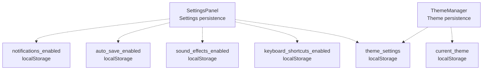

**Sources:**

* [js/components/settingsPanel.js L24-L38](https://github.com/sallowayma-git/IELTS-practice/blob/92f64eb8/js/components/settingsPanel.js#L24-L38)
* [js/components/settingsPanel.js L42-L50](https://github.com/sallowayma-git/IELTS-practice/blob/92f64eb8/js/components/settingsPanel.js#L42-L50)
* [js/utils/themeManager.js L141-L159](https://github.com/sallowayma-git/IELTS-practice/blob/92f64eb8/js/utils/themeManager.js#L141-L159)

### Theme Settings Object Structure

The `theme_settings` key stores:

```yaml
{
  fontSize: 'small' | 'normal' | 'large' | 'extra-large',
  reduceMotion: boolean,
  highContrast: boolean,
  autoTheme: boolean
}
```

**Sources:**

* [js/utils/themeManager.js L123-L128](https://github.com/sallowayma-git/IELTS-practice/blob/92f64eb8/js/utils/themeManager.js#L123-L128)

---

## Progress Indication

The `DataManagementPanel` provides visual feedback during long-running operations using a progress overlay.

### Progress Overlay System

**Progress Overlay Architecture**

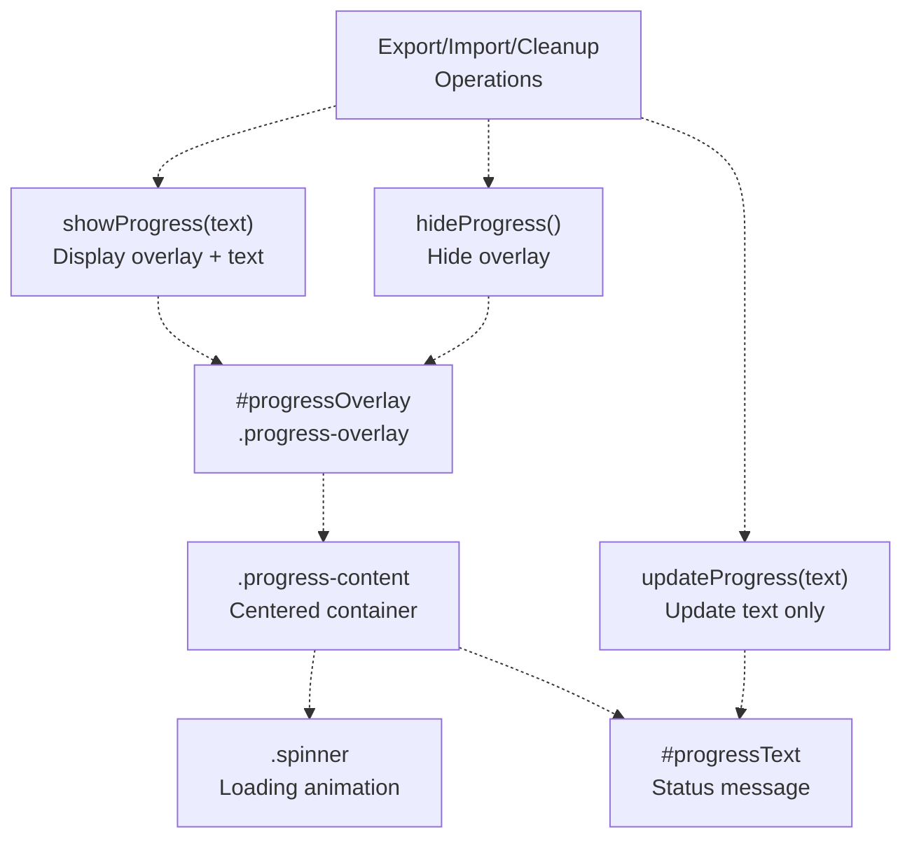

**Sources:**

* [js/components/dataManagementPanel.js L294-L311](https://github.com/sallowayma-git/IELTS-practice/blob/92f64eb8/js/components/dataManagementPanel.js#L294-L311)
* [js/components/dataManagementPanel.js L906-L929](https://github.com/sallowayma-git/IELTS-practice/blob/92f64eb8/js/components/dataManagementPanel.js#L906-L929)

### Progress States

Operations update the progress text to indicate current status:

| Operation | Progress States |
| --- | --- |
| Export | `'准备导出数据...'` |
| Import | `'读取文件...'` → `'验证数据格式...'` → `'导入数据...'` |
| Cleanup | `'清理数据...'` |

**Sources:**

* [js/components/dataManagementPanel.js L545](https://github.com/sallowayma-git/IELTS-practice/blob/92f64eb8/js/components/dataManagementPanel.js#L545-L545)
* [js/components/dataManagementPanel.js L626-L670](https://github.com/sallowayma-git/IELTS-practice/blob/92f64eb8/js/components/dataManagementPanel.js#L626-L670)
* [js/components/dataManagementPanel.js L737](https://github.com/sallowayma-git/IELTS-practice/blob/92f64eb8/js/components/dataManagementPanel.js#L737-L737)

---

## Message Notifications

Both panels use a toast notification system for user feedback about operation results.

### Toast Notification System

**Message Toast Architecture**

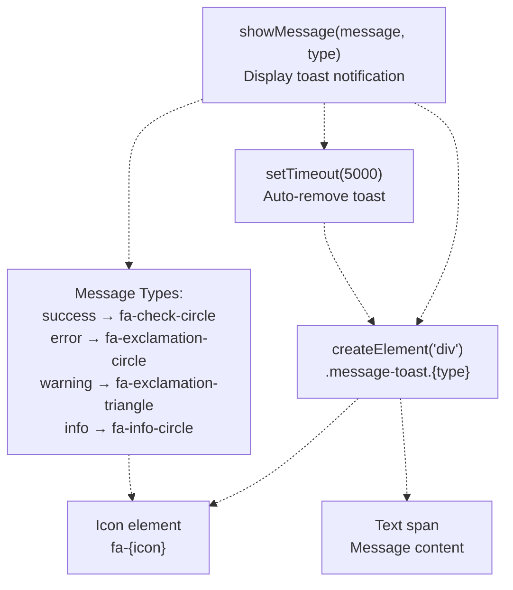

**Sources:**

* [js/components/dataManagementPanel.js L934-L961](https://github.com/sallowayma-git/IELTS-practice/blob/92f64eb8/js/components/dataManagementPanel.js#L934-L961)

### Message Usage Examples

| Operation | Type | Message |
| --- | --- | --- |
| Export Success | `success` | `'数据导出成功！'` |
| Import Success | `success` | `'导入成功！导入 X 条记录'` |
| Cleanup Success | `success` | `'数据清理完成！'` |
| Export Error | `error` | `'导出失败: {error.message}'` |
| Import Error | `error` | `'导入失败: {error.message}'` |
| No Selection | `warning` | `'请选择要清理的数据类型'` |

**Sources:**

* [js/components/dataManagementPanel.js L570](https://github.com/sallowayma-git/IELTS-practice/blob/92f64eb8/js/components/dataManagementPanel.js#L570-L570)
* [js/components/dataManagementPanel.js L687](https://github.com/sallowayma-git/IELTS-practice/blob/92f64eb8/js/components/dataManagementPanel.js#L687-L687)
* [js/components/dataManagementPanel.js L752-L755](https://github.com/sallowayma-git/IELTS-practice/blob/92f64eb8/js/components/dataManagementPanel.js#L752-L755)

# Settings Panel & Data Management UI

> **Relevant source files**
> * [.superdesign/design_iterations/xiaodaidai_dashboard_1.html](https://github.com/sallowayma-git/IELTS-practice/blob/92f64eb8/.superdesign/design_iterations/xiaodaidai_dashboard_1.html)
> * [assets/data/vocabulary.json](https://github.com/sallowayma-git/IELTS-practice/blob/92f64eb8/assets/data/vocabulary.json)
> * [js/components/dataManagementPanel.js](https://github.com/sallowayma-git/IELTS-practice/blob/92f64eb8/js/components/dataManagementPanel.js)
> * [js/components/settingsPanel.js](https://github.com/sallowayma-git/IELTS-practice/blob/92f64eb8/js/components/settingsPanel.js)
> * [js/utils/helpers.js](https://github.com/sallowayma-git/IELTS-practice/blob/92f64eb8/js/utils/helpers.js)
> * [js/utils/themeManager.js](https://github.com/sallowayma-git/IELTS-practice/blob/92f64eb8/js/utils/themeManager.js)

## Purpose and Scope

This document covers the `SettingsPanel` and `DataManagementPanel` components that provide user interfaces for system configuration and data operations. The `SettingsPanel` offers a tabbed interface for appearance, accessibility, interaction, and advanced settings. The `DataManagementPanel` handles import, export, backup, and data cleanup operations.

For the underlying theme management system, see page [7.4](https://github.com/sallowayma-git/IELTS-practice/blob/92f64eb8/7.4)

 For data persistence and storage architecture, see page [4.1](https://github.com/sallowayma-git/IELTS-practice/blob/92f64eb8/4.1)

 For data backup implementation details, see page [4.4](https://github.com/sallowayma-git/IELTS-practice/blob/92f64eb8/4.4)

---

## SettingsPanel Architecture

The `SettingsPanel` class provides a modal-based interface for system configuration with a tabbed layout. It is instantiated on application initialization and registers global event handlers using event delegation.

### SettingsPanel Class Structure

**SettingsPanel Initialization and Components**

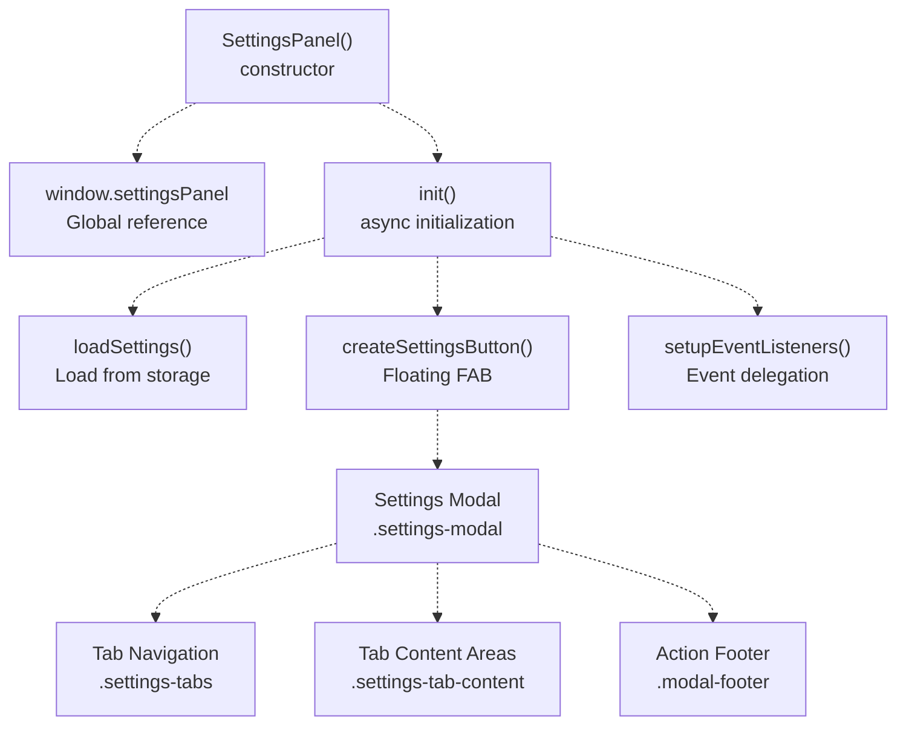

**Sources:**

* [js/components/settingsPanel.js L5-L20](https://github.com/sallowayma-git/IELTS-practice/blob/92f64eb8/js/components/settingsPanel.js#L5-L20)
* [js/components/settingsPanel.js L54-L108](https://github.com/sallowayma-git/IELTS-practice/blob/92f64eb8/js/components/settingsPanel.js#L54-L108)

### Settings Data Structure

The `settings` object persisted to storage contains:

| Property | Type | Default | Purpose |
| --- | --- | --- | --- |
| `theme` | string | `'light'` | Current theme identifier |
| `fontSize` | string | `'normal'` | Font size: small/normal/large/extra-large |
| `reduceMotion` | boolean | `false` | Reduce animations |
| `highContrast` | boolean | `false` | High contrast mode |
| `autoTheme` | boolean | `true` | Follow system theme |
| `keyboardShortcuts` | boolean | `true` | Enable keyboard shortcuts |
| `soundEffects` | boolean | `false` | Enable sound effects |
| `autoSave` | boolean | `true` | Auto-save practice progress |
| `notifications` | boolean | `true` | Enable notifications |

**Sources:**

* [js/components/settingsPanel.js L24-L38](https://github.com/sallowayma-git/IELTS-practice/blob/92f64eb8/js/components/settingsPanel.js#L24-L38)

---

## Tabbed Interface Structure

The `SettingsPanel` uses a four-tab layout for organizing settings by category. Tab switching is handled through event delegation on `.settings-tab` elements.

### Tab Navigation Architecture

**Settings Tabs and Content Areas**

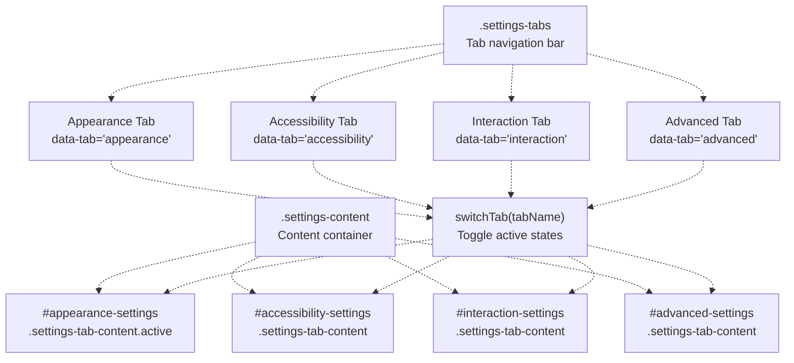

**Sources:**

* [js/components/settingsPanel.js L371-L383](https://github.com/sallowayma-git/IELTS-practice/blob/92f64eb8/js/components/settingsPanel.js#L371-L383)
* [js/components/settingsPanel.js L613-L625](https://github.com/sallowayma-git/IELTS-practice/blob/92f64eb8/js/components/settingsPanel.js#L613-L625)

### Tab Content Generation

Each tab is built using helper methods that create settings sections:

| Helper Method | Purpose | Output |
| --- | --- | --- |
| `createSection(builder, title, items)` | Create settings section | Section with heading and items |
| `createCheckboxItem(builder, opts)` | Create checkbox control | Checkbox with label and description |
| `createSelectItem(builder, opts)` | Create dropdown control | Select element with options |
| `createButtonItem(builder, opts)` | Create action button | Button with description |

**Sources:**

* [js/components/settingsPanel.js L324-L369](https://github.com/sallowayma-git/IELTS-practice/blob/92f64eb8/js/components/settingsPanel.js#L324-L369)

---

## Appearance Tab

The Appearance tab provides theme selection and font size controls, integrating with the `ThemeManager` for applying changes.

### Appearance Settings Components

**Appearance Tab Structure**

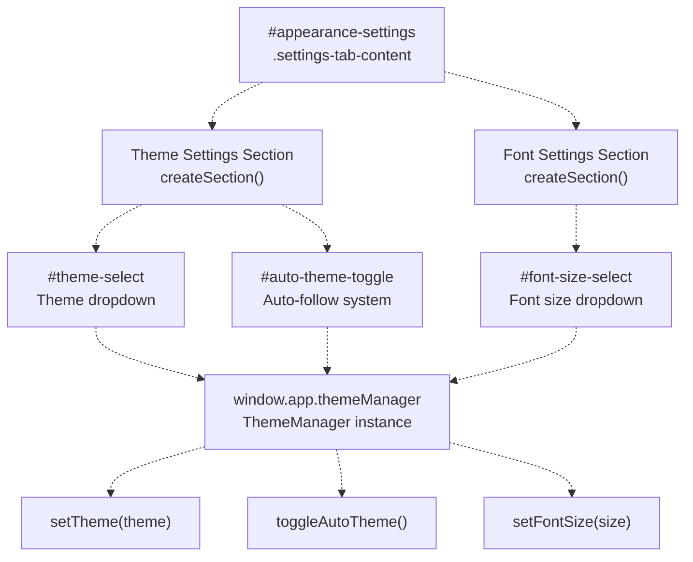

**Sources:**

* [js/components/settingsPanel.js L385-L422](https://github.com/sallowayma-git/IELTS-practice/blob/92f64eb8/js/components/settingsPanel.js#L385-L422)
* [js/utils/themeManager.js L5-L131](https://github.com/sallowayma-git/IELTS-practice/blob/92f64eb8/js/utils/themeManager.js#L5-L131)

### Theme Options

Available themes from `ThemeManager`:

| Theme Key | Display Name | Variables |
| --- | --- | --- |
| `xiaodaidai` | 小呆呆控制台 | Warm yellow/blue gradient palette |
| `light` | 浅色主题 | Standard light mode colors |
| `dark` | 深色主题 | Dark background with lighter text |
| `highContrast` | 高对比度主题 | High contrast for accessibility |

**Sources:**

* [js/utils/themeManager.js L7-L120](https://github.com/sallowayma-git/IELTS-practice/blob/92f64eb8/js/utils/themeManager.js#L7-L120)

---

## Accessibility Tab

The Accessibility tab provides visual and motion settings for users with specific needs, including high contrast mode and reduced motion.

### Accessibility Settings Components

**Accessibility Tab Structure**

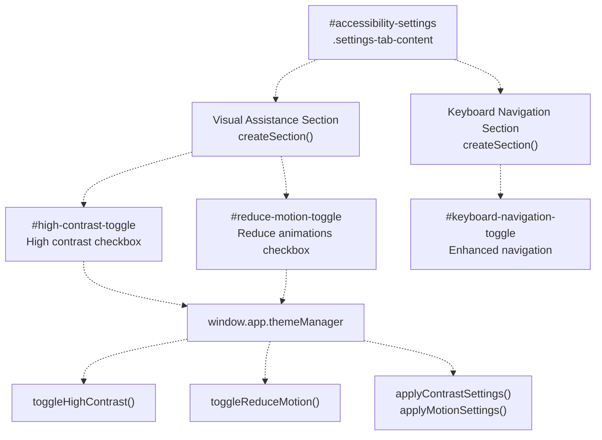

**Sources:**

* [js/components/settingsPanel.js L424-L449](https://github.com/sallowayma-git/IELTS-practice/blob/92f64eb8/js/components/settingsPanel.js#L424-L449)
* [js/utils/themeManager.js L251-L262](https://github.com/sallowayma-git/IELTS-practice/blob/92f64eb8/js/utils/themeManager.js#L251-L262)

### Accessibility Features

| Setting | Effect | Implementation |
| --- | --- | --- |
| High Contrast | Switches to `highContrast` theme | Applies high-contrast color palette |
| Reduce Motion | Adds `.reduce-motion` class | Disables CSS animations |
| Keyboard Navigation | Enhanced focus indicators | Enabled by default |

**Sources:**

* [js/utils/themeManager.js L253-L262](https://github.com/sallowayma-git/IELTS-practice/blob/92f64eb8/js/utils/themeManager.js#L253-L262)
* [js/utils/themeManager.js L335-L347](https://github.com/sallowayma-git/IELTS-practice/blob/92f64eb8/js/utils/themeManager.js#L335-L347)

---

## Interaction Tab

The Interaction tab manages keyboard shortcuts and user feedback settings like sound effects and notifications.

### Interaction Settings Components

**Interaction Tab Structure**

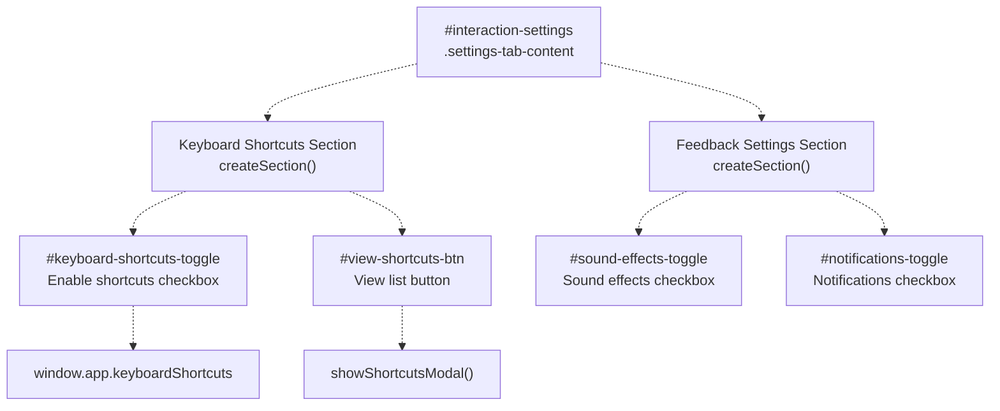

**Sources:**

* [js/components/settingsPanel.js L451-L479](https://github.com/sallowayma-git/IELTS-practice/blob/92f64eb8/js/components/settingsPanel.js#L451-L479)

### Keyboard Shortcuts Integration

The settings panel integrates with the application's keyboard shortcuts system:

| Setting | Storage Key | Effect |
| --- | --- | --- |
| Enable Shortcuts | `keyboard_shortcuts_enabled` | Enables/disables global shortcuts |
| Sound Effects | `sound_effects_enabled` | Enables audio feedback |
| Notifications | `notifications_enabled` | Enables browser notifications |

**Sources:**

* [js/components/settingsPanel.js L170-L189](https://github.com/sallowayma-git/IELTS-practice/blob/92f64eb8/js/components/settingsPanel.js#L170-L189)
* [js/components/settingsPanel.js L43-L49](https://github.com/sallowayma-git/IELTS-practice/blob/92f64eb8/js/components/settingsPanel.js#L43-L49)

---

## Advanced Tab

The Advanced tab provides access to data management, system maintenance, and system information functions.

### Advanced Settings Components

**Advanced Tab Structure**

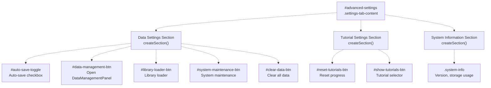

**Sources:**

* [js/components/settingsPanel.js L481-L546](https://github.com/sallowayma-git/IELTS-practice/blob/92f64eb8/js/components/settingsPanel.js#L481-L546)

### Advanced Settings Actions

| Button | Handler | Purpose |
| --- | --- | --- |
| Data Management | `openDataManagement()` | Opens `DataManagementPanel` |
| Library Loader | `openLibraryLoader()` | Opens library configuration |
| System Maintenance | `openSystemMaintenance()` | Opens maintenance panel |
| Clear Data | `confirmClearData()` | Clears all stored data |
| Reset Tutorials | Calls `tutorialSystem.resetTutorialProgress()` | Resets tutorial state |

**Sources:**

* [js/components/settingsPanel.js L191-L215](https://github.com/sallowayma-git/IELTS-practice/blob/92f64eb8/js/components/settingsPanel.js#L191-L215)
* [js/components/settingsPanel.js L777-L800](https://github.com/sallowayma-git/IELTS-practice/blob/92f64eb8/js/components/settingsPanel.js#L777-L800)

---

## DataManagementPanel Architecture

The `DataManagementPanel` class provides a comprehensive interface for data operations including export, import, backup, and cleanup. It is opened from the Advanced tab of `SettingsPanel`.

### DataManagementPanel Class Structure

**DataManagementPanel Components**

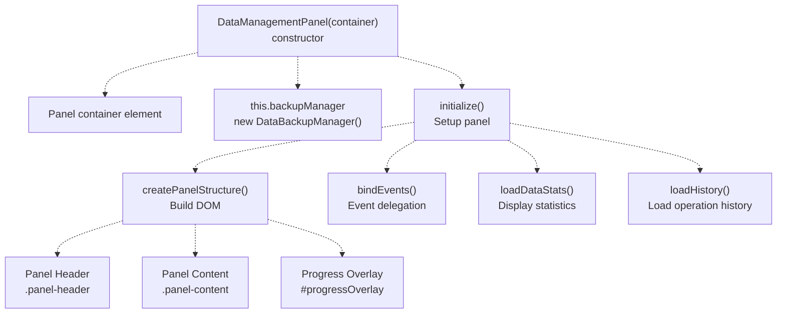

**Sources:**

* [js/components/dataManagementPanel.js L26-L47](https://github.com/sallowayma-git/IELTS-practice/blob/92f64eb8/js/components/dataManagementPanel.js#L26-L47)
* [js/components/dataManagementPanel.js L49-L88](https://github.com/sallowayma-git/IELTS-practice/blob/92f64eb8/js/components/dataManagementPanel.js#L49-L88)

### Panel Sections

The panel is divided into five functional sections:

| Section | Class | Purpose |
| --- | --- | --- |
| Statistics | `.stats-section` | Display record count, time, score, storage |
| Export | `.export-section` | Configure and execute exports |
| Import | `.import-section` | Select files and import data |
| Cleanup | `.cleanup-section` | Clear specific data types |
| History | `.history-section` | View export/import history |

**Sources:**

* [js/components/dataManagementPanel.js L78-L88](https://github.com/sallowayma-git/IELTS-practice/blob/92f64eb8/js/components/dataManagementPanel.js#L78-L88)

---

## Export Operations

The export section allows users to export practice records in JSON or CSV format with optional filtering and additional data.

### Export Configuration and Flow

**Export Process Flow**

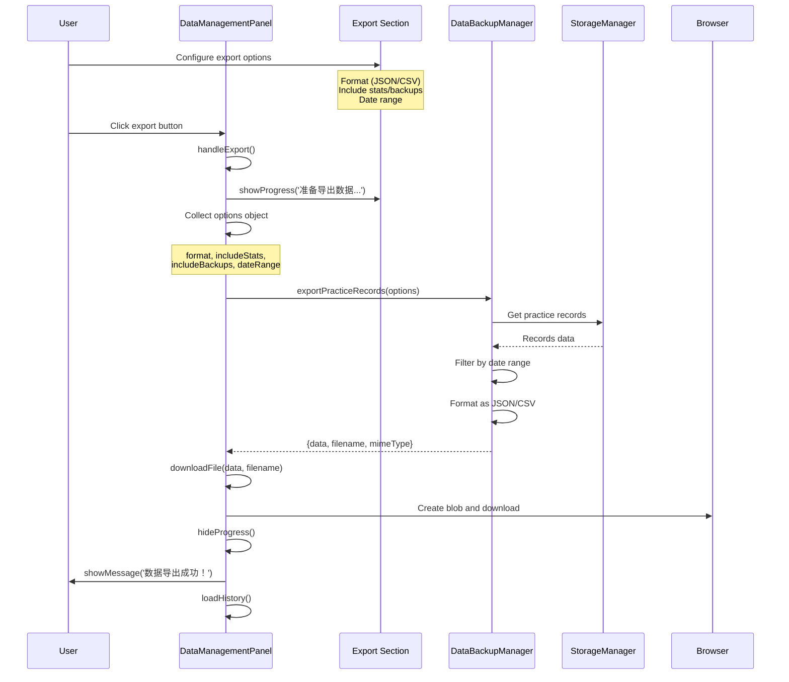

**Sources:**

* [js/components/dataManagementPanel.js L542-L577](https://github.com/sallowayma-git/IELTS-practice/blob/92f64eb8/js/components/dataManagementPanel.js#L542-L577)
* [js/components/dataManagementPanel.js L115-L159](https://github.com/sallowayma-git/IELTS-practice/blob/92f64eb8/js/components/dataManagementPanel.js#L115-L159)

### Export Options

| Option | Element ID | Type | Default | Purpose |
| --- | --- | --- | --- | --- |
| Format | `#exportFormat` | Select | `'json'` | JSON or CSV output |
| Include Stats | `#includeStats` | Checkbox | `true` | Include user statistics |
| Include Backups | `#includeBackups` | Checkbox | `false` | Include backup data |
| Start Date | `#exportStartDate` | Date input | - | Filter start date |
| End Date | `#exportEndDate` | Date input | - | Filter end date |

**Sources:**

* [js/components/dataManagementPanel.js L121-L147](https://github.com/sallowayma-git/IELTS-practice/blob/92f64eb8/js/components/dataManagementPanel.js#L121-L147)
* [js/components/dataManagementPanel.js L543-L563](https://github.com/sallowayma-git/IELTS-practice/blob/92f64eb8/js/components/dataManagementPanel.js#L543-L563)

---

## Import Operations

The import section supports importing data from JSON or CSV files with merge strategies to handle existing records.

### Import Configuration and Flow

**Import Process Flow**

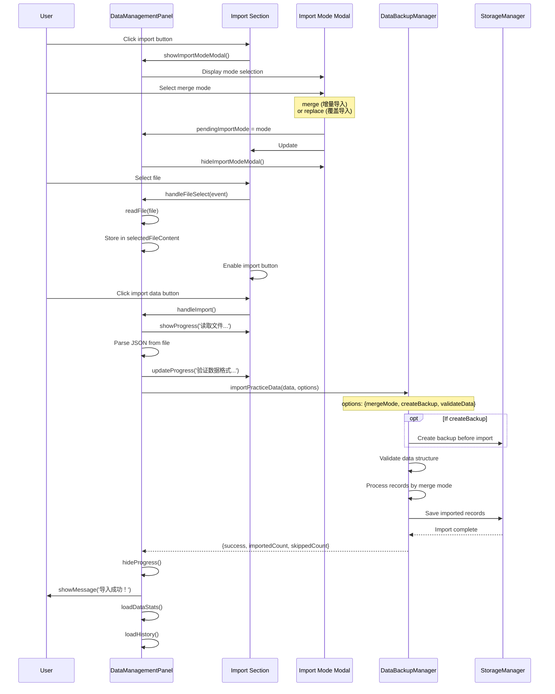

**Sources:**

* [js/components/dataManagementPanel.js L610-L705](https://github.com/sallowayma-git/IELTS-practice/blob/92f64eb8/js/components/dataManagementPanel.js#L610-L705)
* [js/components/dataManagementPanel.js L407-L498](https://github.com/sallowayma-git/IELTS-practice/blob/92f64eb8/js/components/dataManagementPanel.js#L407-L498)

### Import Options

| Option | Element ID | Type | Purpose |
| --- | --- | --- | --- |
| File Selection | `#importFile` | File input | Select JSON/CSV file |
| Import Mode | `#importMode` | Select | merge/replace/skip strategy |
| Create Backup | `#createBackupBeforeImport` | Checkbox | Backup before import |

**Sources:**

* [js/components/dataManagementPanel.js L161-L215](https://github.com/sallowayma-git/IELTS-practice/blob/92f64eb8/js/components/dataManagementPanel.js#L161-L215)

---

## Data Cleanup Operations

The cleanup section allows selective deletion of data types with optional pre-cleanup backup creation.

### Cleanup Configuration and Flow

**Cleanup Process Flow**

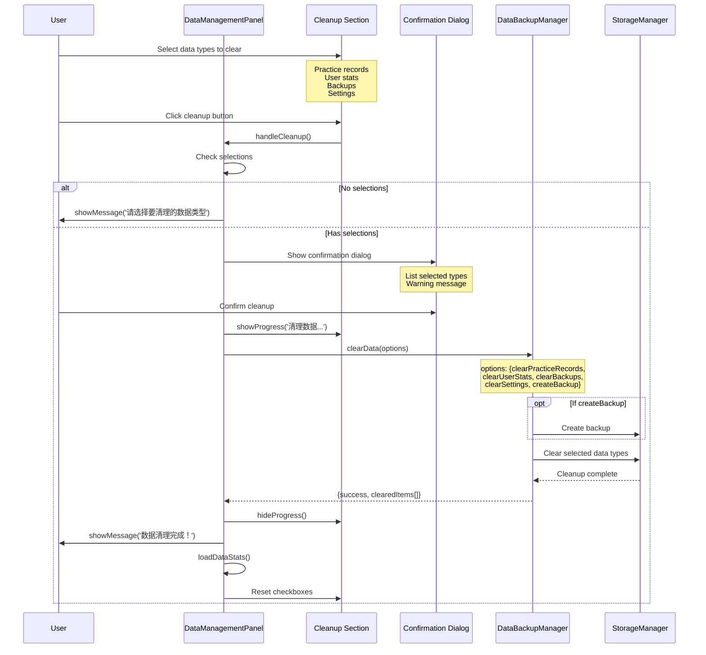

**Sources:**

* [js/components/dataManagementPanel.js L709-L770](https://github.com/sallowayma-git/IELTS-practice/blob/92f64eb8/js/components/dataManagementPanel.js#L709-L770)
* [js/components/dataManagementPanel.js L217-L261](https://github.com/sallowayma-git/IELTS-practice/blob/92f64eb8/js/components/dataManagementPanel.js#L217-L261)

### Cleanup Options

| Checkbox ID | Purpose | Storage Keys Affected |
| --- | --- | --- |
| `#clearRecords` | Clear practice records | `practice_records` |
| `#clearStats` | Clear user statistics | `user_stats` |
| `#clearBackups` | Clear backup data | Backup-related keys |
| `#clearSettings` | Clear system settings | Settings keys |
| `#createBackupBeforeClean` | Backup before cleanup | N/A (creates backup) |

**Sources:**

* [js/components/dataManagementPanel.js L228-L243](https://github.com/sallowayma-git/IELTS-practice/blob/92f64eb8/js/components/dataManagementPanel.js#L228-L243)

---

## Operation History Display

The history section displays logs of past export and import operations, allowing users to track data management activities.

### History Tab Architecture

**History Section Structure**

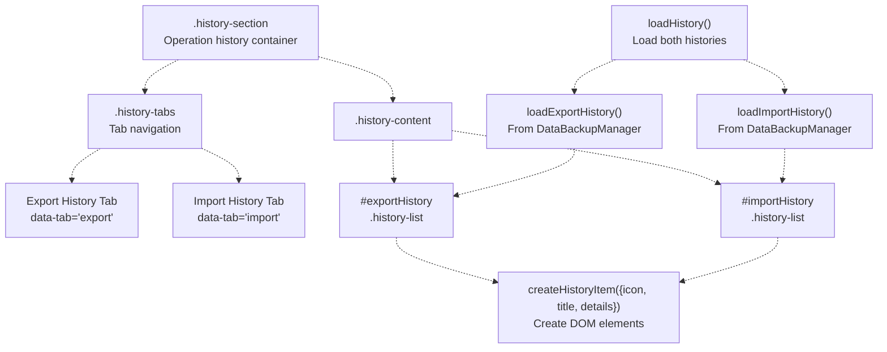

**Sources:**

* [js/components/dataManagementPanel.js L263-L292](https://github.com/sallowayma-git/IELTS-practice/blob/92f64eb8/js/components/dataManagementPanel.js#L263-L292)
* [js/components/dataManagementPanel.js L789-L869](https://github.com/sallowayma-git/IELTS-practice/blob/92f64eb8/js/components/dataManagementPanel.js#L789-L869)

### History Record Structure

Each history item displays:

| Field | Export Display | Import Display |
| --- | --- | --- |
| Icon | `fa-download` | `fa-upload` |
| Title | `{FORMAT} 导出` | `导入操作` |
| Record Count | `记录数: {count}` | `新增记录: {count}` |
| Additional Info | `时间: {timestamp}` | `合并模式: {mode}` |

**Sources:**

* [js/components/dataManagementPanel.js L799-L831](https://github.com/sallowayma-git/IELTS-practice/blob/92f64eb8/js/components/dataManagementPanel.js#L799-L831)
* [js/components/dataManagementPanel.js L836-L869](https://github.com/sallowayma-git/IELTS-practice/blob/92f64eb8/js/components/dataManagementPanel.js#L836-L869)

---

## Query Parameter Handling

The system processes URL query parameters to control theme behavior on page load.

### Theme Query Parameters

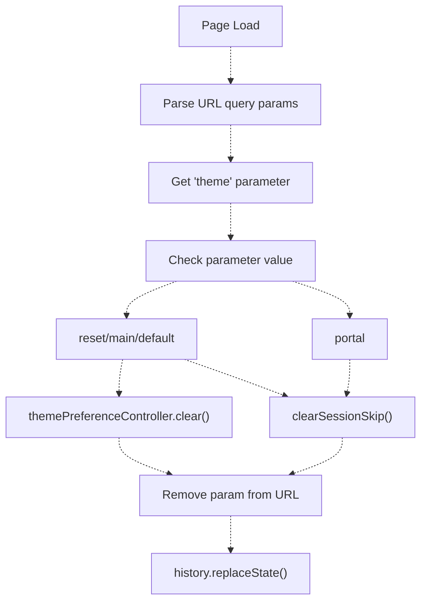

**Sources:**

* [js/theme-switcher.js L175-L204](https://github.com/sallowayma-git/IELTS-practice/blob/92f64eb8/js/theme-switcher.js#L175-L204)

### Supported Query Parameters

| Parameter | Value | Action |
| --- | --- | --- |
| `?theme=reset` | Reset theme preference | Clears stored preference |
| `?theme=main` | Reset to main portal | Clears stored preference |
| `?theme=default` | Reset to default | Clears stored preference |
| `?theme=portal` | Clear skip flag | Allows auto-redirect |

**Sources:**

* [js/theme-switcher.js L186-L193](https://github.com/sallowayma-git/IELTS-practice/blob/92f64eb8/js/theme-switcher.js#L186-L193)