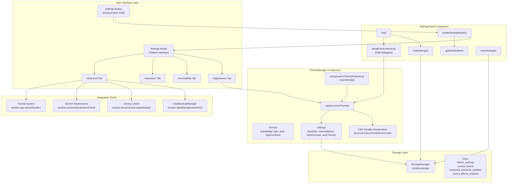
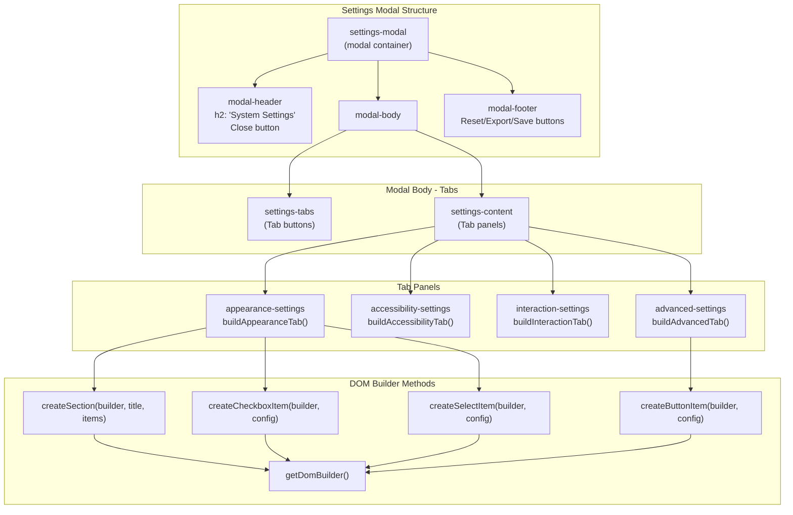
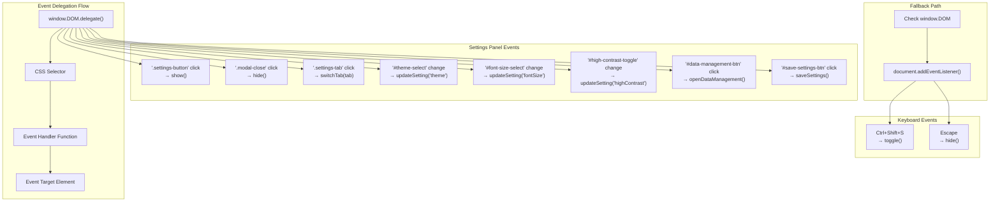
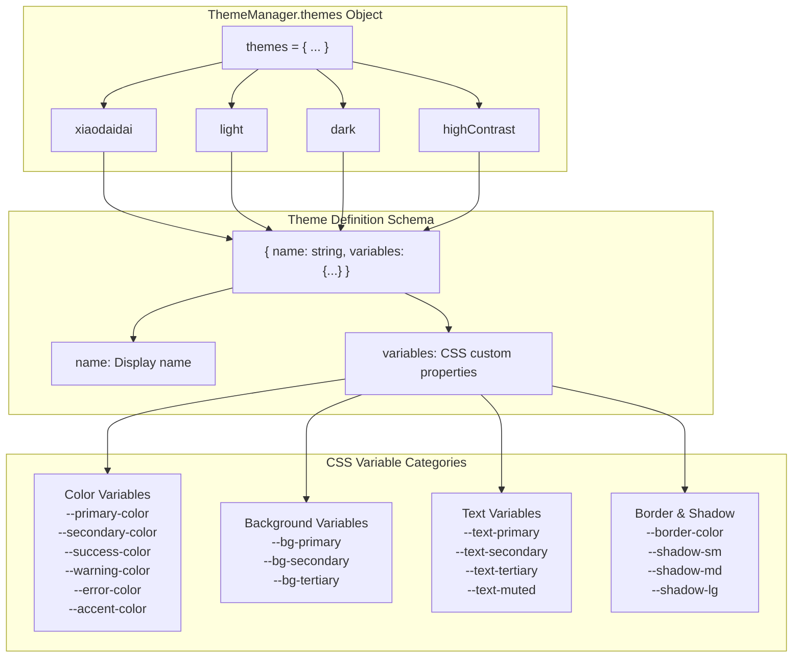
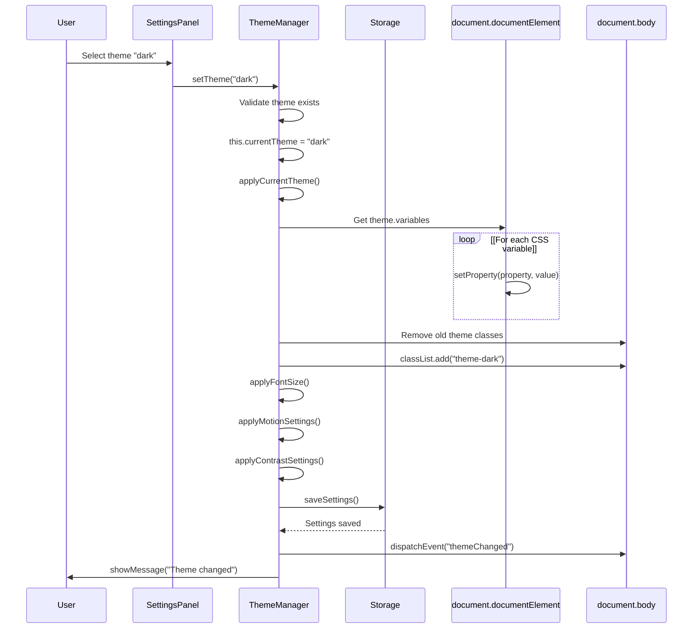
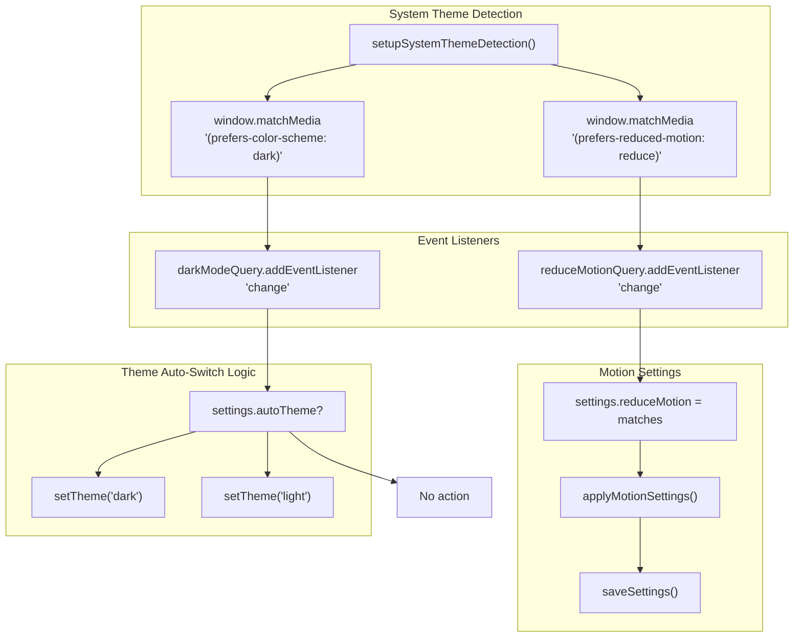
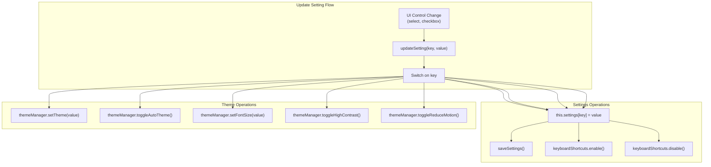
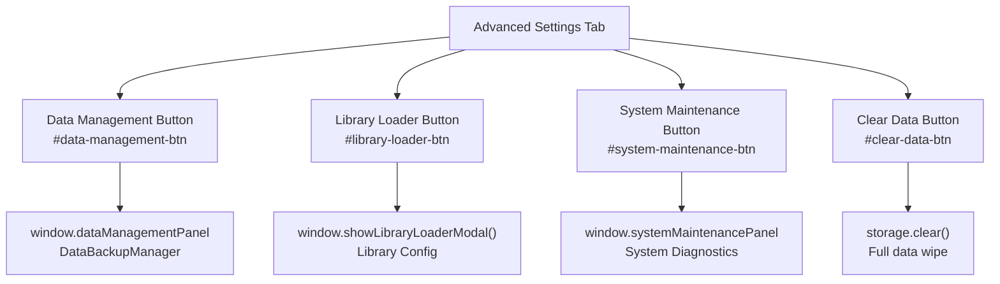

# Settings Panel & Theme Manager

> **Relevant source files**
> * [js/components/practiceHistory.js](https://github.com/sallowayma-git/IELTS-practice/blob/df0c9b8f/js/components/practiceHistory.js)
> * [js/components/practiceRecordModal.js](https://github.com/sallowayma-git/IELTS-practice/blob/df0c9b8f/js/components/practiceRecordModal.js)
> * [js/components/settingsPanel.js](https://github.com/sallowayma-git/IELTS-practice/blob/df0c9b8f/js/components/settingsPanel.js)
> * [js/utils/themeManager.js](https://github.com/sallowayma-git/IELTS-practice/blob/df0c9b8f/js/utils/themeManager.js)

This document describes the user preferences and theme management system, consisting of the `SettingsPanel` component for UI configuration and the `ThemeManager` for theme switching and CSS customization. For information about complete UI redesign theme portals (Academic, Melody, HP, Bloom), see [Theme Portals](/sallowayma-git/IELTS-practice/7.2-theme-portals-(academic-melody-bloom)). For in-app CSS theme variants, see [In-App Theme Variants](/sallowayma-git/IELTS-practice/7.3-in-app-theme-variants-and-css).

**Scope**: This page covers:

* `SettingsPanel` component structure and UI tabs
* `ThemeManager` theme definitions and CSS variable manipulation
* Settings persistence via `StorageManager`
* Event delegation patterns and keyboard shortcuts
* Integration with accessibility features

---

## Architecture Overview

The settings system uses a two-layer architecture: `SettingsPanel` provides the user interface, while `ThemeManager` handles theme logic and CSS manipulation.

### Component Relationship Diagram



**Sources**: [js/components/settingsPanel.js L1-L891](https://github.com/sallowayma-git/IELTS-practice/blob/df0c9b8f/js/components/settingsPanel.js#L1-L891)

 [js/utils/themeManager.js L1-L409](https://github.com/sallowayma-git/IELTS-practice/blob/df0c9b8f/js/utils/themeManager.js#L1-L409)

---

## SettingsPanel Component

The `SettingsPanel` class provides a unified settings interface accessible via a fixed-position floating action button (FAB). It uses a tabbed modal design with four categories of settings.

### Initialization and Lifecycle

```mermaid
sequenceDiagram
  participant Constructor
  participant init()
  participant StorageManager
  participant Document
  participant Event System

  Constructor->>Constructor: Set isVisible = false
  Constructor->>Constructor: window.settingsPanel = this
  Constructor->>init(): Call init()
  init()->>StorageManager: loadSettings()
  StorageManager-->>init(): Return saved settings
  init()->>Document: createSettingsButton()
  Document-->>init(): FAB added to body
  init()->>Event System: setupEventListeners()
  Event System-->>init(): Event delegation configured
  note over init(): Component ready
```

**Initialization Flow**:

1. Constructor sets `isVisible = false` and creates global reference at `window.settingsPanel` [js/components/settingsPanel.js L6-L14](https://github.com/sallowayma-git/IELTS-practice/blob/df0c9b8f/js/components/settingsPanel.js#L6-L14)
2. `init()` method loads settings from storage asynchronously [js/components/settingsPanel.js L16-L20](https://github.com/sallowayma-git/IELTS-practice/blob/df0c9b8f/js/components/settingsPanel.js#L16-L20)
3. `createSettingsButton()` creates floating action button with emoji icon ⚙️ [js/components/settingsPanel.js L55-L108](https://github.com/sallowayma-git/IELTS-practice/blob/df0c9b8f/js/components/settingsPanel.js#L55-L108)
4. `setupEventListeners()` configures event delegation using `window.DOM.delegate` [js/components/settingsPanel.js L113-L244](https://github.com/sallowayma-git/IELTS-practice/blob/df0c9b8f/js/components/settingsPanel.js#L113-L244)

**Sources**: [js/components/settingsPanel.js L5-L244](https://github.com/sallowayma-git/IELTS-practice/blob/df0c9b8f/js/components/settingsPanel.js#L5-L244)

---

### Tab Structure and DOM Builder Pattern

The settings modal uses a four-tab structure with declarative DOM construction via `DOMBuilder`.



**DOM Builder Pattern**:

* `getDomBuilder()` returns `window.DOMBuilder`, `window.DOM.builder`, or fallback implementation [js/components/settingsPanel.js L286-L322](https://github.com/sallowayma-git/IELTS-practice/blob/df0c9b8f/js/components/settingsPanel.js#L286-L322)
* Helper methods wrap common UI patterns: `createSection()`, `createCheckboxItem()`, `createSelectItem()`, `createButtonItem()` [js/components/settingsPanel.js L324-L369](https://github.com/sallowayma-git/IELTS-practice/blob/df0c9b8f/js/components/settingsPanel.js#L324-L369)
* Tab construction methods: `buildAppearanceTab()`, `buildAccessibilityTab()`, `buildInteractionTab()`, `buildAdvancedTab()` [js/components/settingsPanel.js L385-L546](https://github.com/sallowayma-git/IELTS-practice/blob/df0c9b8f/js/components/settingsPanel.js#L385-L546)

**Modal Creation Flow**:

1. `createSettingsModal()` builds overlay and modal container [js/components/settingsPanel.js L551-L582](https://github.com/sallowayma-git/IELTS-practice/blob/df0c9b8f/js/components/settingsPanel.js#L551-L582)
2. `createSettingsContent()` generates tabs and tab panels [js/components/settingsPanel.js L587-L596](https://github.com/sallowayma-git/IELTS-practice/blob/df0c9b8f/js/components/settingsPanel.js#L587-L596)
3. Each tab builder creates settings sections with controls [js/components/settingsPanel.js L385-L546](https://github.com/sallowayma-git/IELTS-practice/blob/df0c9b8f/js/components/settingsPanel.js#L385-L546)

**Sources**: [js/components/settingsPanel.js L286-L596](https://github.com/sallowayma-git/IELTS-practice/blob/df0c9b8f/js/components/settingsPanel.js#L286-L596)

---

### Settings Categories

#### Appearance Settings

| Setting | Control Type | Storage Key | Description |
| --- | --- | --- | --- |
| Theme Selection | `<select>` | `current_theme` | xiaodaidai, light, dark, highContrast |
| Auto Theme | Checkbox | `theme_settings.autoTheme` | Follow system preference |
| Font Size | `<select>` | `theme_settings.fontSize` | small, normal, large, extra-large |

**Implementation**: [js/components/settingsPanel.js L385-L422](https://github.com/sallowayma-git/IELTS-practice/blob/df0c9b8f/js/components/settingsPanel.js#L385-L422)

#### Accessibility Settings

| Setting | Control Type | Storage Key | Description |
| --- | --- | --- | --- |
| High Contrast Mode | Checkbox | `theme_settings.highContrast` | Enhanced visual contrast |
| Reduce Motion | Checkbox | `theme_settings.reduceMotion` | Minimize animations |
| Keyboard Navigation | Checkbox | N/A | Enhanced focus indicators (always on) |

**Implementation**: [js/components/settingsPanel.js L424-L448](https://github.com/sallowayma-git/IELTS-practice/blob/df0c9b8f/js/components/settingsPanel.js#L424-L448)

#### Interaction Settings

| Setting | Control Type | Storage Key | Description |
| --- | --- | --- | --- |
| Keyboard Shortcuts | Checkbox | `keyboard_shortcuts_enabled` | Enable/disable hotkeys |
| Sound Effects | Checkbox | `sound_effects_enabled` | Audio feedback |
| Notifications | Checkbox | `notifications_enabled` | System notifications |

**Implementation**: [js/components/settingsPanel.js L451-L478](https://github.com/sallowayma-git/IELTS-practice/blob/df0c9b8f/js/components/settingsPanel.js#L451-L478)

#### Advanced Settings

**Data Management**:

* Data Management button → Opens `window.dataManagementPanel` [js/components/settingsPanel.js L504-L509](https://github.com/sallowayma-git/IELTS-practice/blob/df0c9b8f/js/components/settingsPanel.js#L504-L509)
* Library Loader button → Opens `window.showLibraryLoaderModal()` [js/components/settingsPanel.js L510-L515](https://github.com/sallowayma-git/IELTS-practice/blob/df0c9b8f/js/components/settingsPanel.js#L510-L515)
* System Maintenance button → Opens `window.systemMaintenancePanel` [js/components/settingsPanel.js L516-L521](https://github.com/sallowayma-git/IELTS-practice/blob/df0c9b8f/js/components/settingsPanel.js#L516-L521)
* Clear Data button → Confirms and calls `storage.clear()` [js/components/settingsPanel.js L522-L527](https://github.com/sallowayma-git/IELTS-practice/blob/df0c9b8f/js/components/settingsPanel.js#L522-L527)

**Tutorial Management**:

* Reset Tutorials → `window.app.tutorialSystem.resetTutorialProgress()` [js/components/settingsPanel.js L529-L536](https://github.com/sallowayma-git/IELTS-practice/blob/df0c9b8f/js/components/settingsPanel.js#L529-L536)
* Show Tutorials → `window.app.tutorialSystem.showTutorialSelector()` [js/components/settingsPanel.js L537-L540](https://github.com/sallowayma-git/IELTS-practice/blob/df0c9b8f/js/components/settingsPanel.js#L537-L540)

**System Information**:

* Browser version display
* Storage usage calculation via `calculateStorageUsage()` [js/components/settingsPanel.js L838-L867](https://github.com/sallowayma-git/IELTS-practice/blob/df0c9b8f/js/components/settingsPanel.js#L838-L867)

**Implementation**: [js/components/settingsPanel.js L481-L546](https://github.com/sallowayma-git/IELTS-practice/blob/df0c9b8f/js/components/settingsPanel.js#L481-L546)

**Sources**: [js/components/settingsPanel.js L385-L546](https://github.com/sallowayma-git/IELTS-practice/blob/df0c9b8f/js/components/settingsPanel.js#L385-L546)

---

### Event Delegation System

The `SettingsPanel` uses the global `window.DOM.delegate()` pattern for event handling, with fallback to traditional listeners.



**Event Delegation Registration**:

```

```

**Implementation Details**:

* Event delegation setup in `setupEventListeners()` [js/components/settingsPanel.js L113-L244](https://github.com/sallowayma-git/IELTS-practice/blob/df0c9b8f/js/components/settingsPanel.js#L113-L244)
* Fallback to traditional listeners if `window.DOM.delegate` unavailable [js/components/settingsPanel.js L231-L243](https://github.com/sallowayma-git/IELTS-practice/blob/df0c9b8f/js/components/settingsPanel.js#L231-L243)
* Keyboard shortcuts always use `document.addEventListener()` (non-delegatable) [js/components/settingsPanel.js L137-L147](https://github.com/sallowayma-git/IELTS-practice/blob/df0c9b8f/js/components/settingsPanel.js#L137-L147)

**Sources**: [js/components/settingsPanel.js L113-L244](https://github.com/sallowayma-git/IELTS-practice/blob/df0c9b8f/js/components/settingsPanel.js#L113-L244)

---

## ThemeManager Component

The `ThemeManager` class handles theme definitions, CSS variable manipulation, and system theme detection.

### Theme Definitions Structure



**Theme Definitions**:

| Theme | Key | Description | Primary Color |
| --- | --- | --- | --- |
| Xiaodaidai Console | `xiaodaidai` | Yellow/blue pastel theme | #ffc83d |
| Light Theme | `light` | Default light mode | #3b82f6 |
| Dark Theme | `dark` | Dark mode variant | #60a5fa |
| High Contrast | `highContrast` | Accessibility mode | #0066cc |

**Each theme defines 20+ CSS custom properties** covering colors, backgrounds, text, borders, and shadows [js/utils/themeManager.js L7-L120](https://github.com/sallowayma-git/IELTS-practice/blob/df0c9b8f/js/utils/themeManager.js#L7-L120)

**Sources**: [js/utils/themeManager.js L7-L120](https://github.com/sallowayma-git/IELTS-practice/blob/df0c9b8f/js/utils/themeManager.js#L7-L120)

---

### Theme Application Flow



**Key Methods**:

1. **`setTheme(themeName)`** - Entry point for theme switching [js/utils/themeManager.js L267-L280](https://github.com/sallowayma-git/IELTS-practice/blob/df0c9b8f/js/utils/themeManager.js#L267-L280)
2. **`applyCurrentTheme()`** - Applies theme variables and classes [js/utils/themeManager.js L210-L236](https://github.com/sallowayma-git/IELTS-practice/blob/df0c9b8f/js/utils/themeManager.js#L210-L236)
3. **`applyFontSize()`** - Adds font size class to body [js/utils/themeManager.js L241-L248](https://github.com/sallowayma-git/IELTS-practice/blob/df0c9b8f/js/utils/themeManager.js#L241-L248)
4. **`applyMotionSettings()`** - Toggles `.reduce-motion` class [js/utils/themeManager.js L253-L255](https://github.com/sallowayma-git/IELTS-practice/blob/df0c9b8f/js/utils/themeManager.js#L253-L255)
5. **`applyContrastSettings()`** - Toggles `.high-contrast` class [js/utils/themeManager.js L260-L262](https://github.com/sallowayma-git/IELTS-practice/blob/df0c9b8f/js/utils/themeManager.js#L260-L262)

**CSS Variable Application**:

```

```

[js/utils/themeManager.js L217-L219](https://github.com/sallowayma-git/IELTS-practice/blob/df0c9b8f/js/utils/themeManager.js#L217-L219)

**Sources**: [js/utils/themeManager.js L210-L280](https://github.com/sallowayma-git/IELTS-practice/blob/df0c9b8f/js/utils/themeManager.js#L210-L280)

---

### System Theme Detection

The `ThemeManager` integrates with browser system preferences using `matchMedia()`.



**Implementation**:

```

```

[js/utils/themeManager.js L164-L192](https://github.com/sallowayma-git/IELTS-practice/blob/df0c9b8f/js/utils/themeManager.js#L164-L192)

**Note**: Media query listeners cannot use event delegation as they are system-level browser APIs [js/utils/themeManager.js L169-L170](https://github.com/sallowayma-git/IELTS-practice/blob/df0c9b8f/js/utils/themeManager.js#L169-L170)

**Sources**: [js/utils/themeManager.js L164-L192](https://github.com/sallowayma-git/IELTS-practice/blob/df0c9b8f/js/utils/themeManager.js#L164-L192)

---

## Settings Persistence

Settings are persisted to `StorageManager` with specific key names.

### Storage Keys and Data Structure

| Storage Key | Data Type | Description | Managed By |
| --- | --- | --- | --- |
| `theme_settings` | Object | Theme-related settings | ThemeManager |
| `current_theme` | String | Active theme key | ThemeManager |
| `keyboard_shortcuts_enabled` | Boolean | Keyboard shortcuts toggle | SettingsPanel |
| `sound_effects_enabled` | Boolean | Sound effects toggle | SettingsPanel |
| `auto_save_enabled` | Boolean | Auto-save toggle | SettingsPanel |
| `notifications_enabled` | Boolean | Notifications toggle | SettingsPanel |

**`theme_settings` Object Structure**:

```

```

[js/utils/themeManager.js L123-L128](https://github.com/sallowayma-git/IELTS-practice/blob/df0c9b8f/js/utils/themeManager.js#L123-L128)

**Settings Load Flow**:

```

```

[js/utils/themeManager.js L143-L149](https://github.com/sallowayma-git/IELTS-practice/blob/df0c9b8f/js/utils/themeManager.js#L143-L149)

**Settings Save Flow**:

```

```

[js/utils/themeManager.js L154-L159](https://github.com/sallowayma-git/IELTS-practice/blob/df0c9b8f/js/utils/themeManager.js#L154-L159)

**Sources**: [js/components/settingsPanel.js L25-L50](https://github.com/sallowayma-git/IELTS-practice/blob/df0c9b8f/js/components/settingsPanel.js#L25-L50)

 [js/utils/themeManager.js L123-L159](https://github.com/sallowayma-git/IELTS-practice/blob/df0c9b8f/js/utils/themeManager.js#L123-L159)

---

## Settings Update and Synchronization

### SettingsPanel.updateSetting() Method

The `updateSetting()` method bridges UI changes to `ThemeManager` operations.



**Implementation** (implied from event handlers):
Event handlers in `setupSettingsEvents()` directly call `ThemeManager` methods [js/components/settingsPanel.js L630-L748](https://github.com/sallowayma-git/IELTS-practice/blob/df0c9b8f/js/components/settingsPanel.js#L630-L748)

**Example - Theme Selection**:

```

```

[js/components/settingsPanel.js L643-L645](https://github.com/sallowayma-git/IELTS-practice/blob/df0c9b8f/js/components/settingsPanel.js#L643-L645)

**Example - Font Size**:

```

```

[js/components/settingsPanel.js L649-L651](https://github.com/sallowayma-git/IELTS-practice/blob/df0c9b8f/js/components/settingsPanel.js#L649-L651)

**Sources**: [js/components/settingsPanel.js L630-L748](https://github.com/sallowayma-git/IELTS-practice/blob/df0c9b8f/js/components/settingsPanel.js#L630-L748)

---

## Keyboard Shortcuts

### Global Settings Shortcuts

| Shortcut | Action | Implementation |
| --- | --- | --- |
| `Ctrl+Shift+S` | Toggle settings panel | `settingsPanel.toggle()` |
| `Escape` | Close settings panel | `settingsPanel.hide()` (when visible) |
| `Ctrl+Shift+T` | Cycle through themes | `themeManager.toggleTheme()` |

**Settings Panel Shortcuts**:

```

```

[js/components/settingsPanel.js L138-L147](https://github.com/sallowayma-git/IELTS-practice/blob/df0c9b8f/js/components/settingsPanel.js#L138-L147)

**ThemeManager Shortcuts**:

```

```

[js/utils/themeManager.js L199-L204](https://github.com/sallowayma-git/IELTS-practice/blob/df0c9b8f/js/utils/themeManager.js#L199-L204)

**Theme Toggle Cycle**: light → xiaodaidai → dark → highContrast → light [js/utils/themeManager.js L286-L290](https://github.com/sallowayma-git/IELTS-practice/blob/df0c9b8f/js/utils/themeManager.js#L286-L290)

**Sources**: [js/components/settingsPanel.js L138-L147](https://github.com/sallowayma-git/IELTS-practice/blob/df0c9b8f/js/components/settingsPanel.js#L138-L147)

 [js/utils/themeManager.js L199-L204](https://github.com/sallowayma-git/IELTS-practice/blob/df0c9b8f/js/utils/themeManager.js#L199-L204)

---

## Integration with Other Systems

### Data Management Integration

The Advanced Settings tab provides navigation to data-related panels:



**Button Handlers**:

1. **Data Management** - Opens `window.dataManagementPanel.show()` for backup/restore operations [js/components/settingsPanel.js L686-L691](https://github.com/sallowayma-git/IELTS-practice/blob/df0c9b8f/js/components/settingsPanel.js#L686-L691)
2. **Library Loader** - Calls `window.showLibraryLoaderModal()` for exam index reloading [js/components/settingsPanel.js L692-L699](https://github.com/sallowayma-git/IELTS-practice/blob/df0c9b8f/js/components/settingsPanel.js#L692-L699)
3. **System Maintenance** - Opens `window.systemMaintenancePanel.show()` for diagnostics [js/components/settingsPanel.js L700-L705](https://github.com/sallowayma-git/IELTS-practice/blob/df0c9b8f/js/components/settingsPanel.js#L700-L705)
4. **Clear Data** - Confirms and executes `storage.clear()` with page reload [js/components/settingsPanel.js L778-L800](https://github.com/sallowayma-git/IELTS-practice/blob/df0c9b8f/js/components/settingsPanel.js#L778-L800)

**Sources**: [js/components/settingsPanel.js L686-L800](https://github.com/sallowayma-git/IELTS-practice/blob/df0c9b8f/js/components/settingsPanel.js#L686-L800)

---

### Tutorial System Integration

Tutorial-related buttons in Advanced Settings:

```

```

[js/components/settingsPanel.js L709-L719](https://github.com/sallowayma-git/IELTS-practice/blob/df0c9b8f/js/components/settingsPanel.js#L709-L719)

**Sources**: [js/components/settingsPanel.js L709-L719](https://github.com/sallowayma-git/IELTS-practice/blob/df0c9b8f/js/components/settingsPanel.js#L709-L719)

---

## Accessibility Features

### High Contrast Mode

When enabled, high contrast mode:

1. Switches to `highContrast` theme automatically [js/utils/themeManager.js L339-L340](https://github.com/sallowayma-git/IELTS-practice/blob/df0c9b8f/js/utils/themeManager.js#L339-L340)
2. Saves current theme to `previous_theme` for restoration [js/utils/themeManager.js L339](https://github.com/sallowayma-git/IELTS-practice/blob/df0c9b8f/js/utils/themeManager.js#L339-L339)
3. Applies `.high-contrast` class to body [js/utils/themeManager.js L261](https://github.com/sallowayma-git/IELTS-practice/blob/df0c9b8f/js/utils/themeManager.js#L261-L261)
4. Uses strongly contrasted color palette with black borders [js/utils/themeManager.js L92-L119](https://github.com/sallowayma-git/IELTS-practice/blob/df0c9b8f/js/utils/themeManager.js#L92-L119)

**Toggle Implementation**:

```

```

[js/utils/themeManager.js L335-L347](https://github.com/sallowayma-git/IELTS-practice/blob/df0c9b8f/js/utils/themeManager.js#L335-L347)

**Sources**: [js/utils/themeManager.js L335-L347](https://github.com/sallowayma-git/IELTS-practice/blob/df0c9b8f/js/utils/themeManager.js#L335-L347)

---

### Reduced Motion Mode

When enabled, reduced motion:

1. Sets `settings.reduceMotion = true` [js/utils/themeManager.js L322](https://github.com/sallowayma-git/IELTS-practice/blob/df0c9b8f/js/utils/themeManager.js#L322-L322)
2. Adds `.reduce-motion` class to body [js/utils/themeManager.js L254](https://github.com/sallowayma-git/IELTS-practice/blob/df0c9b8f/js/utils/themeManager.js#L254-L254)
3. CSS applies `animation: none` and `transition: none` to affected elements

**System Preference Detection**:

```

```

[js/utils/themeManager.js L167-L183](https://github.com/sallowayma-git/IELTS-practice/blob/df0c9b8f/js/utils/themeManager.js#L167-L183)

**Sources**: [js/utils/themeManager.js L167-L183](https://github.com/sallowayma-git/IELTS-practice/blob/df0c9b8f/js/utils/themeManager.js#L167-L183)

 [js/utils/themeManager.js L253-L255](https://github.com/sallowayma-git/IELTS-practice/blob/df0c9b8f/js/utils/themeManager.js#L253-L255)

 [js/utils/themeManager.js L321-L330](https://github.com/sallowayma-git/IELTS-practice/blob/df0c9b8f/js/utils/themeManager.js#L321-L330)

---

### Font Size Adjustment

Supports four font size levels via body classes:

| Size | Value | Class | Description |
| --- | --- | --- | --- |
| Small | `small` | `.font-small` | Compact text |
| Normal | `normal` | (none) | Default size |
| Large | `large` | `.font-large` | Enlarged text |
| Extra Large | `extra-large` | `.font-extra-large` | Maximum enlargement |

**Application Method**:

```

```

[js/utils/themeManager.js L241-L248](https://github.com/sallowayma-git/IELTS-practice/blob/df0c9b8f/js/utils/themeManager.js#L241-L248)

**Sources**: [js/utils/themeManager.js L241-L248](https://github.com/sallowayma-git/IELTS-practice/blob/df0c9b8f/js/utils/themeManager.js#L241-L248)

 [js/utils/themeManager.js L296-L316](https://github.com/sallowayma-git/IELTS-practice/blob/df0c9b8f/js/utils/themeManager.js#L296-L316)

---

## Error Handling and Fallbacks

### DOM Builder Fallback

The `getDomBuilder()` method provides a three-tier fallback:

```

```

[js/components/settingsPanel.js L286-L322](https://github.com/sallowayma-git/IELTS-practice/blob/df0c9b8f/js/components/settingsPanel.js#L286-L322)

**Fallback Logic**:

1. Try `window.DOMBuilder.create` (preferred)
2. Try `window.DOM.builder` (alternative)
3. Use inline fallback implementation

**Sources**: [js/components/settingsPanel.js L286-L322](https://github.com/sallowayma-git/IELTS-practice/blob/df0c9b8f/js/components/settingsPanel.js#L286-L322)

---

### Storage Unavailability

Both components handle `window.storage` unavailability:

**SettingsPanel**:

```

```

[js/components/settingsPanel.js L25-L38](https://github.com/sallowayma-git/IELTS-practice/blob/df0c9b8f/js/components/settingsPanel.js#L25-L38)

**ThemeManager**:

```

```

[js/utils/themeManager.js L154-L159](https://github.com/sallowayma-git/IELTS-practice/blob/df0c9b8f/js/utils/themeManager.js#L154-L159)

**Sources**: [js/components/settingsPanel.js L25-L50](https://github.com/sallowayma-git/IELTS-practice/blob/df0c9b8f/js/components/settingsPanel.js#L25-L50)

 [js/utils/themeManager.js L143-L159](https://github.com/sallowayma-git/IELTS-practice/blob/df0c9b8f/js/utils/themeManager.js#L143-L159)

---

## Advanced Operations

### Export Settings

Exports all settings as JSON file:

```

```

[js/components/settingsPanel.js L871-L890](https://github.com/sallowayma-git/IELTS-practice/blob/df0c9b8f/js/components/settingsPanel.js#L871-L890)

**Export Structure**:

```

```

**Sources**: [js/components/settingsPanel.js L869-L890](https://github.com/sallowayma-git/IELTS-practice/blob/df0c9b8f/js/components/settingsPanel.js#L869-L890)

---

### Reset to Defaults

Resets all theme and accessibility settings:

**SettingsPanel Reset**:

```

```

[js/components/settingsPanel.js L805-L833](https://github.com/sallowayma-git/IELTS-practice/blob/df0c9b8f/js/components/settingsPanel.js#L805-L833)

**ThemeManager Reset**:

```

```

[js/utils/themeManager.js L392-L407](https://github.com/sallowayma-git/IELTS-practice/blob/df0c9b8f/js/utils/themeManager.js#L392-L407)

**Sources**: [js/components/settingsPanel.js L805-L833](https://github.com/sallowayma-git/IELTS-practice/blob/df0c9b8f/js/components/settingsPanel.js#L805-L833)

 [js/utils/themeManager.js L392-L407](https://github.com/sallowayma-git/IELTS-practice/blob/df0c9b8f/js/utils/themeManager.js#L392-L407)

---

### Storage Usage Calculation

Calculates total storage usage across all keys:

```

```

[js/components/settingsPanel.js L838-L867](https://github.com/sallowayma-git/IELTS-practice/blob/df0c9b8f/js/components/settingsPanel.js#L838-L867)

Displayed in Advanced Settings → System Information section.

**Sources**: [js/components/settingsPanel.js L838-L867](https://github.com/sallowayma-git/IELTS-practice/blob/df0c9b8f/js/components/settingsPanel.js#L838-L867)