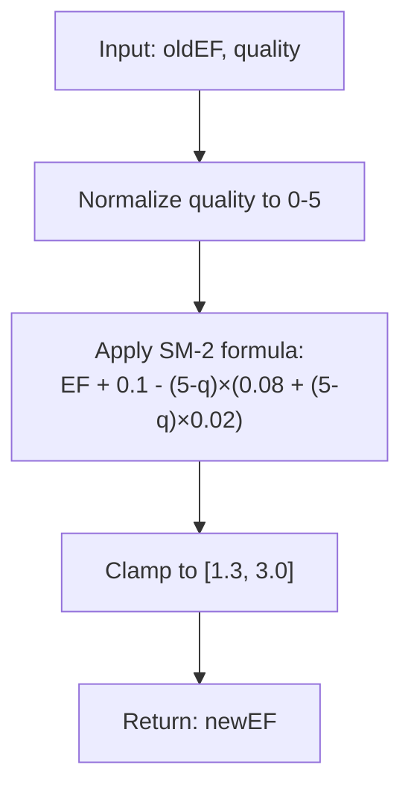
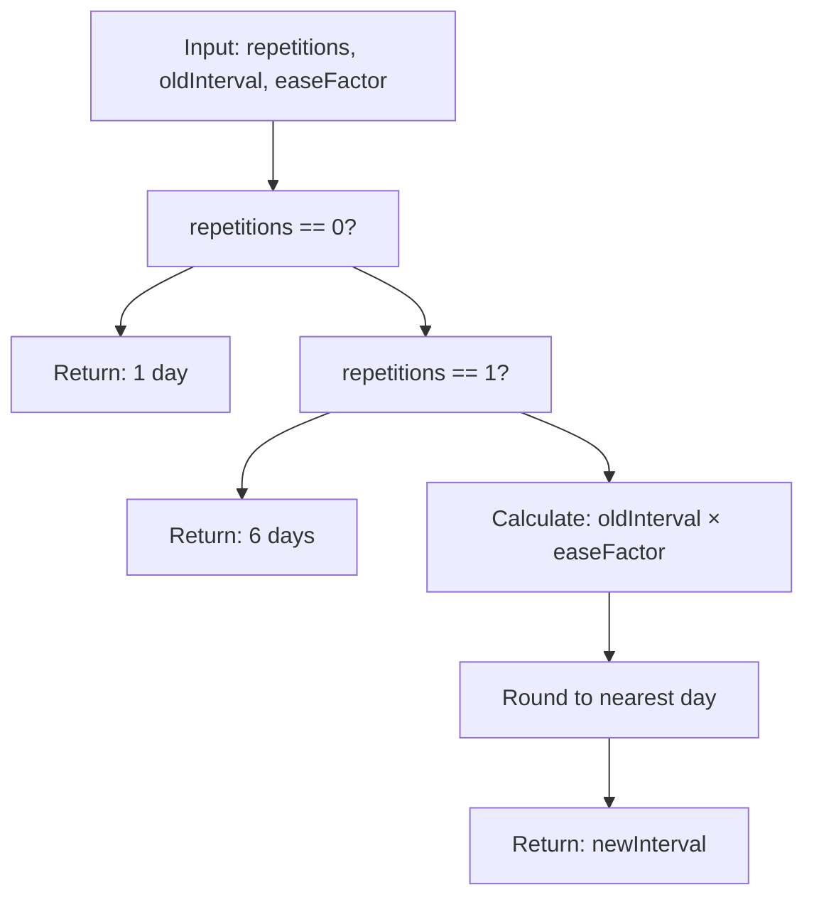
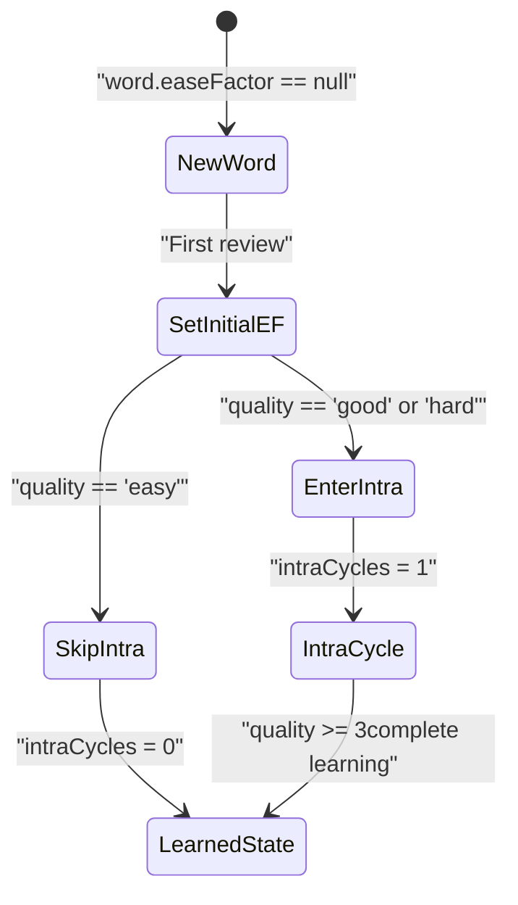
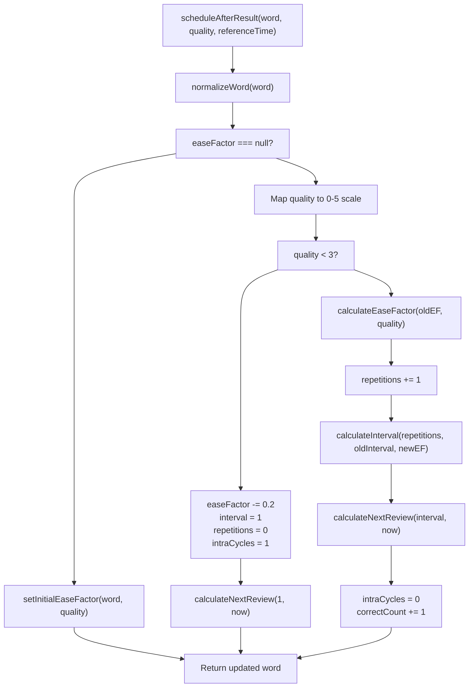
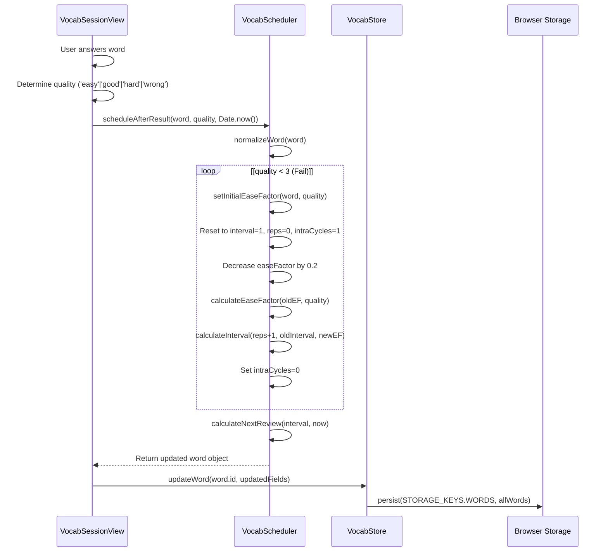
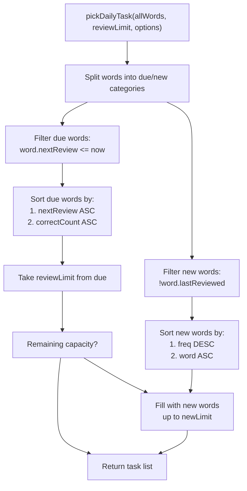

# Spaced Repetition Algorithm (SM-2)

> **Relevant source files**
> * [js/components/vocabSessionView.js](https://github.com/sallowayma-git/IELTS-practice/blob/68771116/js/components/vocabSessionView.js)
> * [js/core/vocabScheduler.js](https://github.com/sallowayma-git/IELTS-practice/blob/68771116/js/core/vocabScheduler.js)
> * [js/core/vocabStore.js](https://github.com/sallowayma-git/IELTS-practice/blob/68771116/js/core/vocabStore.js)
> * [js/utils/vocabDataIO.js](https://github.com/sallowayma-git/IELTS-practice/blob/68771116/js/utils/vocabDataIO.js)
> * [js/views/overviewView.js](https://github.com/sallowayma-git/IELTS-practice/blob/68771116/js/views/overviewView.js)

## Purpose and Scope

This document details the `VocabScheduler` implementation of the SuperMemo SM-2 spaced repetition algorithm used in the vocabulary learning module. The scheduler calculates optimal review intervals based on user performance, adjusting difficulty factors to maximize long-term retention.

This page focuses specifically on the scheduling algorithm itself. For information about the learning session flow and UI interactions, see [Vocabulary Session & Learning Flow](/sallowayma-git/IELTS-practice/6.1-vocabulary-session-and-learning-flow). For storage and persistence of vocabulary data, see [Vocabulary Data Storage & Import/Export](/sallowayma-git/IELTS-practice/6.3-vocabulary-data-storage-and-importexport).

**Sources:** [js/core/vocabScheduler.js L1-L360](https://github.com/sallowayma-git/IELTS-practice/blob/68771116/js/core/vocabScheduler.js#L1-L360)

---

## SM-2 Algorithm Overview

The SM-2 (SuperMemo 2) algorithm is a scientifically-backed spaced repetition system that optimizes review timing based on individual word difficulty. The implementation tracks three core parameters per word:

| Parameter | Range | Purpose |
| --- | --- | --- |
| `easeFactor` | 1.3 - 3.0 | Difficulty coefficient; higher = easier word, longer intervals |
| `interval` | 1+ days | Days until next review |
| `repetitions` | 0+ | Consecutive correct answers; resets on failure |

Additional tracking includes `intraCycles` for new word conditioning, `correctCount` for lifetime statistics, and `lastReviewed`/`nextReview` timestamps for scheduling.

**Sources:** [js/core/vocabScheduler.js L2-L35](https://github.com/sallowayma-git/IELTS-practice/blob/68771116/js/core/vocabScheduler.js#L2-L35)

 [js/core/vocabStore.js L84-L100](https://github.com/sallowayma-git/IELTS-practice/blob/68771116/js/core/vocabStore.js#L84-L100)

---

## Core Constants and Parameters

### SM-2 Algorithm Constants

The scheduler defines fundamental bounds and initial values:

```javascript
const SM2_CONSTANTS = {
    MIN_EASE_FACTOR: 1.3,      // Minimum difficulty coefficient
    MAX_EASE_FACTOR: 3.0,      // Maximum difficulty coefficient
    INITIAL_INTERVAL_DAYS: 1,  // First review after 1 day
    SECOND_INTERVAL_DAYS: 6,   // Second review after 6 days
    MAX_INTRA_CYCLES: 12       // Maximum conditioning loops for new words
}
```

**Sources:** [js/core/vocabScheduler.js L3-L9](https://github.com/sallowayma-git/IELTS-practice/blob/68771116/js/core/vocabScheduler.js#L3-L9)

### Quality Rating System

User performance is mapped to a 0-5 quality scale:

| Rating | Quality | SM-2 Value | Effect |
| --- | --- | --- | --- |
| `wrong` | Completely incorrect | 0 | Resets progress, decreases ease factor by 0.2 |
| `hard` | Correct but difficult | 3 | Minimum passing grade, slight ease factor increase |
| `good` | Correct with hesitation | 4 | Standard progression |
| `easy` | Perfect recall | 5 | Maximum ease factor increase |

Quality values < 3 are considered failures and trigger progress reset.

**Sources:** [js/core/vocabScheduler.js L26-L31](https://github.com/sallowayma-git/IELTS-practice/blob/68771116/js/core/vocabScheduler.js#L26-L31)

### Initial Ease Factors for New Words

New words receive different starting ease factors based on initial recognition:

```javascript
const INITIAL_EASE_FACTORS = {
    easy: 2.8,    // High starting factor, longer intervals
    good: 2.5,    // Standard starting factor
    hard: 1.8     // Low starting factor, requires more reviews
}
```

Words marked as "easy" on first encounter skip the intra-cycle conditioning phase.

**Sources:** [js/core/vocabScheduler.js L12-L16](https://github.com/sallowayma-git/IELTS-practice/blob/68771116/js/core/vocabScheduler.js#L12-L16)

### Intra-Cycle Adjustments

During the conditioning phase (before a word becomes "learned"), ease factors are adjusted incrementally:

```javascript
const INTRA_EF_ADJUSTMENTS = {
    easy: +0.15,   // Boost factor significantly
    good: +0.05,   // Small boost
    hard: -0.10    // Reduce factor, require more reviews
}
```

**Sources:** [js/core/vocabScheduler.js L19-L23](https://github.com/sallowayma-git/IELTS-practice/blob/68771116/js/core/vocabScheduler.js#L19-L23)

---

## Ease Factor Calculation

### Standard SM-2 Formula

The `calculateEaseFactor` function implements the original SM-2 formula:

```
EF' = EF + (0.1 - (5 - q) × (0.08 + (5 - q) × 0.02))
```

Where:

* `EF` = current ease factor
* `q` = quality rating (0-5)
* `EF'` = new ease factor (clamped to [1.3, 3.0])



**Calculation Details:**

* Quality 5 (easy): EF increases by ~0.1
* Quality 4 (good): EF increases by ~0.0
* Quality 3 (hard): EF decreases by ~0.14
* Quality 0-2 (wrong): EF decreases by ~0.8

The clamping ensures difficulty stays within bounds even with extreme performance patterns.

**Sources:** [js/core/vocabScheduler.js L52-L69](https://github.com/sallowayma-git/IELTS-practice/blob/68771116/js/core/vocabScheduler.js#L52-L69)

---

## Interval Calculation

### Interval Progression Rules

The `calculateInterval` function determines days until next review based on repetition count:

| Repetitions | Formula | Typical Result |
| --- | --- | --- |
| 0 | Fixed | 1 day |
| 1 | Fixed | 6 days |
| 2+ | `interval × easeFactor` | Exponential growth |



**Example Progression:**

* First review: 1 day
* Second review: 6 days
* Third review (EF=2.5): 6 × 2.5 = 15 days
* Fourth review (EF=2.5): 15 × 2.5 = 38 days
* Fifth review (EF=2.5): 38 × 2.5 = 95 days

The exponential growth ensures learned words appear less frequently while new/difficult words are reviewed more often.

**Sources:** [js/core/vocabScheduler.js L71-L91](https://github.com/sallowayma-git/IELTS-practice/blob/68771116/js/core/vocabScheduler.js#L71-L91)

### Next Review Date Calculation

The `calculateNextReview` function adds the interval to a reference time:

```javascript
function calculateNextReview(intervalDays, referenceTime) {
    const base = toDate(referenceTime, new Date());
    const days = Math.max(0, Number(intervalDays) || 0);
    const next = new Date(base.getTime());
    next.setDate(next.getDate() + days);
    return next;
}
```

This produces an ISO timestamp stored in `word.nextReview`.

**Sources:** [js/core/vocabScheduler.js L93-L105](https://github.com/sallowayma-git/IELTS-practice/blob/68771116/js/core/vocabScheduler.js#L93-L105)

---

## New Word Handling and Intra-Cycles

### Initial Recognition Phase

New words (with `easeFactor === null`) follow a special initialization path:



The `setInitialEaseFactor` function assigns starting values:

```javascript
function setInitialEaseFactor(word, initialQuality) {
    const initialEF = INITIAL_EASE_FACTORS[initialQuality] || INITIAL_EASE_FACTORS.good;
    return {
        ...normalized,
        easeFactor: initialEF,
        intraCycles: initialQuality === 'easy' ? 0 : 1  // Skip or enter conditioning
    };
}
```

**Sources:** [js/core/vocabScheduler.js L144-L163](https://github.com/sallowayma-git/IELTS-practice/blob/68771116/js/core/vocabScheduler.js#L144-L163)

 [js/core/vocabScheduler.js L199-L208](https://github.com/sallowayma-git/IELTS-practice/blob/68771116/js/core/vocabScheduler.js#L199-L208)

### Intra-Cycle Conditioning

While `intraCycles > 0`, the word is in a "learning" phase with short-interval reviews. The `adjustIntraCycleEF` function fine-tunes the ease factor:

```javascript
function adjustIntraCycleEF(word, quality) {
    const adjustment = INTRA_EF_ADJUSTMENTS[quality] || 0;
    const newEF = clamp(
        normalized.easeFactor + adjustment,
        SM2_CONSTANTS.MIN_EASE_FACTOR,
        SM2_CONSTANTS.MAX_EASE_FACTOR
    );
    const newCycles = normalized.intraCycles + 1;
    return { ...normalized, easeFactor: newEF, intraCycles: newCycles };
}
```

This allows the algorithm to calibrate difficulty before committing the word to long-term scheduling.

**Sources:** [js/core/vocabScheduler.js L165-L190](https://github.com/sallowayma-git/IELTS-practice/blob/68771116/js/core/vocabScheduler.js#L165-L190)

---

## Complete Scheduling Algorithm

### Main Scheduling Function

The `scheduleAfterResult` function is the primary entry point for updating word state after a review:



**Failure Path (quality < 3):**

* Ease factor reduced by 0.2 (but clamped to MIN_EASE_FACTOR)
* Interval reset to 1 day
* Repetition counter reset to 0
* Re-enter intra-cycle conditioning (`intraCycles = 1`)

**Success Path (quality >= 3):**

* Calculate new ease factor using SM-2 formula
* Increment repetition counter
* Calculate new interval (1 day → 6 days → exponential)
* Exit intra-cycle phase (`intraCycles = 0`)

**Sources:** [js/core/vocabScheduler.js L192-L249](https://github.com/sallowayma-git/IELTS-practice/blob/68771116/js/core/vocabScheduler.js#L192-L249)

### Data Flow Integration



**Sources:** [js/components/vocabSessionView.js L1063-L1114](https://github.com/sallowayma-git/IELTS-practice/blob/68771116/js/components/vocabSessionView.js#L1063-L1114)

 [js/core/vocabStore.js L352-L371](https://github.com/sallowayma-git/IELTS-practice/blob/68771116/js/core/vocabStore.js#L352-L371)

---

## Daily Task Selection

### Task Queue Generation

The `pickDailyTask` function generates the daily review queue by combining due words and new words:



**Sorting Logic:**

**Due words:** Prioritizes most overdue (earliest `nextReview`), breaking ties with words that have fewer correct answers.

**New words:** Prioritizes high-frequency words (assuming `freq` represents word importance), then alphabetically.

**Example Configuration:**

* `reviewLimit = 100`: Maximum total words per session
* `newLimit = 20`: Maximum new words to introduce
* Actual task count: `min(dueCount + newCount, reviewLimit)`

**Sources:** [js/core/vocabScheduler.js L267-L328](https://github.com/sallowayma-git/IELTS-practice/blob/68771116/js/core/vocabScheduler.js#L267-L328)

---

## Word Data Structure

### Normalized Word Schema

The scheduler expects and produces word objects with the following structure:

```yaml
{
    // Identifier
    id: "word-uuid-or-generated",
    word: "vocabulary",
    meaning: "a person's vocabulary",
    example: "Reading expands your vocabulary.",
    note: "",  // User-added mnemonic
    
    // SM-2 Algorithm Fields
    easeFactor: 2.5,        // [1.3, 3.0] or null for new words
    interval: 1,            // Days until next review
    repetitions: 0,         // Consecutive correct count
    intraCycles: 0,         // Conditioning phase counter
    
    // Statistics
    correctCount: 0,        // Lifetime correct answers
    
    // Timestamps (ISO 8601)
    lastReviewed: null,     // Last review datetime or null
    nextReview: null,       // Scheduled review datetime or null
    createdAt: "2024-01-15T10:30:00.000Z",
    updatedAt: "2024-01-15T10:30:00.000Z",
    
    // Optional
    freq: 0.85              // Word importance/frequency [0, 1]
}
```

**Field Relationships:**

| Condition | Interpretation |
| --- | --- |
| `easeFactor === null` | New word, never reviewed |
| `lastReviewed === null` | New word, never reviewed |
| `nextReview === null` | Not scheduled (new word or error state) |
| `nextReview <= now` | Due for review |
| `intraCycles > 0` | In conditioning phase (short intervals) |
| `repetitions >= 4` | Typically considered "mastered" |

**Sources:** [js/core/vocabStore.js L70-L141](https://github.com/sallowayma-git/IELTS-practice/blob/68771116/js/core/vocabStore.js#L70-L141)

 [js/core/vocabScheduler.js L108-L142](https://github.com/sallowayma-git/IELTS-practice/blob/68771116/js/core/vocabScheduler.js#L108-L142)

---

## Word State Normalization

### Normalization Function

The `normalizeWord` function sanitizes and provides defaults for word objects:

```javascript
function normalizeWord(word) {
    if (!word || typeof word !== 'object') {
        return null;
    }

    const easeFactor = typeof word.easeFactor === 'number' 
        ? word.easeFactor 
        : null; // New words have no EF initially
    
    const interval = typeof word.interval === 'number' 
        ? word.interval 
        : SM2_CONSTANTS.INITIAL_INTERVAL_DAYS;
    
    const repetitions = typeof word.repetitions === 'number' 
        ? word.repetitions 
        : 0;

    const intraCycles = typeof word.intraCycles === 'number'
        ? word.intraCycles
        : 0;

    return { ...word, easeFactor, interval, repetitions, intraCycles };
}
```

This ensures all scheduler functions receive valid input, handling legacy data formats and missing fields gracefully.

**Sources:** [js/core/vocabScheduler.js L108-L142](https://github.com/sallowayma-git/IELTS-practice/blob/68771116/js/core/vocabScheduler.js#L108-L142)

---

## Integration Points

### VocabStore Integration

The `VocabStore` persists scheduler-updated words to browser storage:

```javascript
// In VocabStore
async function updateWord(id, patch = {}) {
    const original = state.wordIndex.get(id);
    const updated = normalizeWordRecord({
        ...original,
        ...patch,
        id,
        updatedAt: getNow()
    });
    state.words.splice(index, 1, updated);
    state.wordIndex.set(id, updated);
    await persist(STORAGE_KEYS.WORDS, state.words);
    return { ...updated };
}
```

The `normalizeWordRecord` function in VocabStore applies additional validation:

* Clamps `easeFactor` to [1.3, 3.0]
* Ensures `interval`, `repetitions`, `intraCycles` are non-negative integers
* Validates timestamps

**Sources:** [js/core/vocabStore.js L352-L371](https://github.com/sallowayma-git/IELTS-practice/blob/68771116/js/core/vocabStore.js#L352-L371)

 [js/core/vocabStore.js L70-L141](https://github.com/sallowayma-git/IELTS-practice/blob/68771116/js/core/vocabStore.js#L70-L141)

### Session View Integration

The `VocabSessionView` component calls the scheduler after each answer:

```javascript
// In vocabSessionView.js (simplified)
function handleAnswerResult(quality) {
    const updatedWord = window.VocabScheduler.scheduleAfterResult(
        state.session.currentWord,
        quality,
        new Date()
    );
    
    // Update in store
    await state.store.updateWord(updatedWord.id, updatedWord);
    
    // Move to next word
    proceedToNextWord();
}
```

The session maintains a queue of words and progresses through them, collecting quality ratings and applying scheduler updates.

**Sources:** [js/components/vocabSessionView.js L1063-L1114](https://github.com/sallowayma-git/IELTS-practice/blob/68771116/js/components/vocabSessionView.js#L1063-L1114)

---

## Legacy Compatibility

### Deprecated Functions

The scheduler maintains backward compatibility with an older box-based system:

```javascript
// Deprecated: Use scheduleAfterResult(word, 'good') instead
function promote(word) {
    return scheduleAfterResult(word, 'good');
}

// Deprecated: Use scheduleAfterResult(word, 'wrong') instead
function demote(word) {
    return scheduleAfterResult(word, 'wrong');
}

const MAX_BOX = 5;  // Legacy Leitner box system
const MIN_BOX = 1;
```

These functions are exported for compatibility but should not be used in new code. The SM-2 algorithm supersedes the box-based approach.

**Sources:** [js/core/vocabScheduler.js L252-L266](https://github.com/sallowayma-git/IELTS-practice/blob/68771116/js/core/vocabScheduler.js#L252-L266)

 [js/core/vocabScheduler.js L34-L35](https://github.com/sallowayma-git/IELTS-practice/blob/68771116/js/core/vocabScheduler.js#L34-L35)

---

## Performance Characteristics

### Algorithm Complexity

| Operation | Complexity | Notes |
| --- | --- | --- |
| `scheduleAfterResult` | O(1) | Pure calculation, no loops |
| `calculateEaseFactor` | O(1) | Simple arithmetic |
| `calculateInterval` | O(1) | Simple arithmetic |
| `normalizeWord` | O(1) | Object field access |
| `pickDailyTask` | O(n log n) | Sorting all words, where n = total word count |

The scheduler itself is highly efficient. The bottleneck is typically the sorting in `pickDailyTask`, but this runs only once per session start, not per word.

### Memory Footprint

Each word object consumes approximately 300-500 bytes in memory (depending on string lengths). For a vocabulary of 5,000 words, this represents ~1.5-2.5 MB of memory, which is negligible for modern browsers.

**Sources:** [js/core/vocabScheduler.js L52-L328](https://github.com/sallowayma-git/IELTS-practice/blob/68771116/js/core/vocabScheduler.js#L52-L328)

---

## API Reference

### Public Functions

```
window.VocabScheduler = {
    // Core SM-2 Algorithm
    scheduleAfterResult(word, quality, referenceTime),
    calculateEaseFactor(oldEF, quality),
    calculateInterval(repetitions, oldInterval, easeFactor),
    calculateNextReview(intervalDays, referenceTime),
    
    // New Word Handling
    setInitialEaseFactor(word, initialQuality),
    adjustIntraCycleEF(word, quality),
    normalizeWord(word),
    
    // Task Generation
    pickDailyTask(allWords, reviewLimit, options),
    
    // Constants
    SM2_CONSTANTS,
    QUALITY_RATINGS,
    INITIAL_EASE_FACTORS,
    INTRA_EF_ADJUSTMENTS,
    
    // Deprecated
    promote(word),
    demote(word),
    MAX_BOX,
    MIN_BOX
}
```

**Sources:** [js/core/vocabScheduler.js L330-L359](https://github.com/sallowayma-git/IELTS-practice/blob/68771116/js/core/vocabScheduler.js#L330-L359)

---

## Configuration and Tuning

### User-Configurable Parameters

While the SM-2 constants are fixed in code, users can configure:

| Setting | Default | Range | Effect on Scheduler |
| --- | --- | --- | --- |
| `dailyNew` | 20 | 0-200 | Max new words per day; passed to `pickDailyTask` |
| `reviewLimit` | 100 | 1-300 | Total words per session; caps task queue size |
| `masteryCount` | 4 | 1-10 | UI threshold; doesn't affect scheduling directly |

These are stored in `vocab_user_config` and accessed via `VocabStore.getConfig()`.

**Sources:** [js/core/vocabStore.js L8-L14](https://github.com/sallowayma-git/IELTS-practice/blob/68771116/js/core/vocabStore.js#L8-L14)

 [js/components/vocabSessionView.js L533-L626](https://github.com/sallowayma-git/IELTS-practice/blob/68771116/js/components/vocabSessionView.js#L533-L626)

---

## Summary

The `VocabScheduler` implements a feature-complete SM-2 algorithm with enhancements:

1. **Standard SM-2 Core**: Ease factor and interval calculations follow the proven SuperMemo formula
2. **New Word Conditioning**: Intra-cycle system calibrates difficulty before long-term scheduling
3. **Flexible Quality Ratings**: 4-level system (wrong/hard/good/easy) maps to 0-5 scale
4. **Intelligent Task Selection**: Combines due reviews and new introductions with frequency-based prioritization
5. **Robust Normalization**: Handles legacy data formats and missing fields gracefully

The algorithm operates independently of UI concerns, accepting word objects and returning updated versions. Integration with `VocabStore` ensures persistence, while `VocabSessionView` drives the learning loop.

**Sources:** [js/core/vocabScheduler.js L1-L360](https://github.com/sallowayma-git/IELTS-practice/blob/68771116/js/core/vocabScheduler.js#L1-L360)