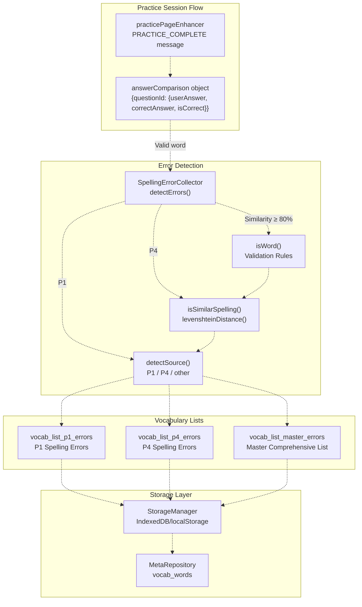
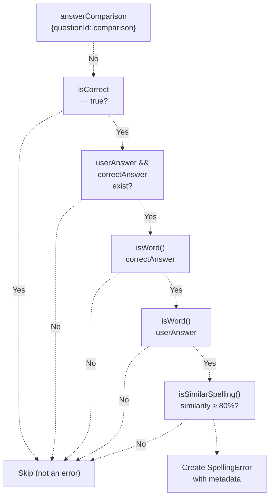
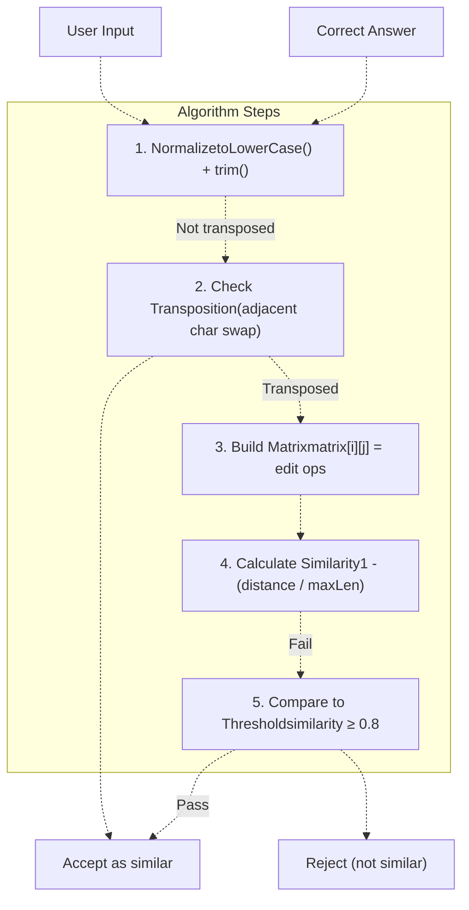
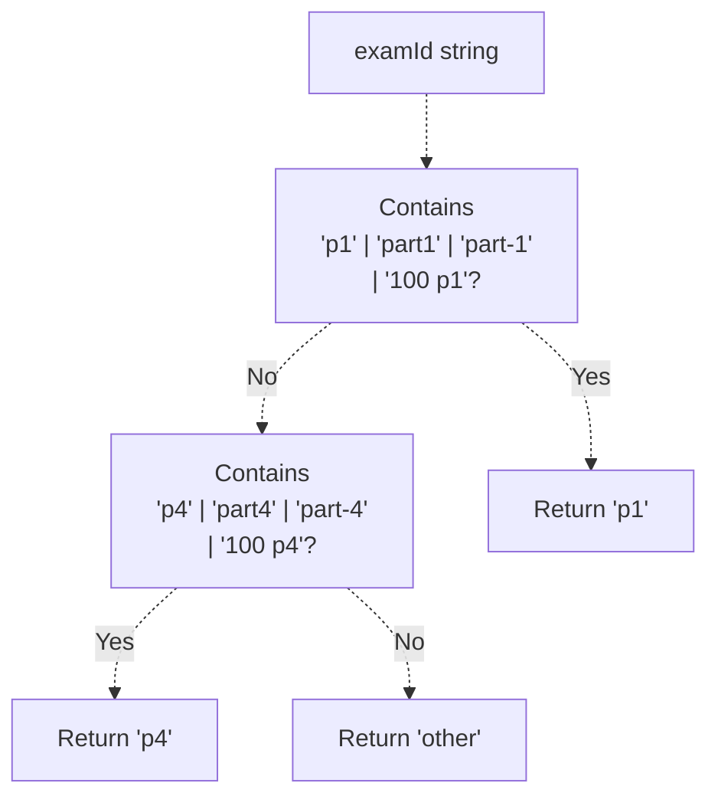
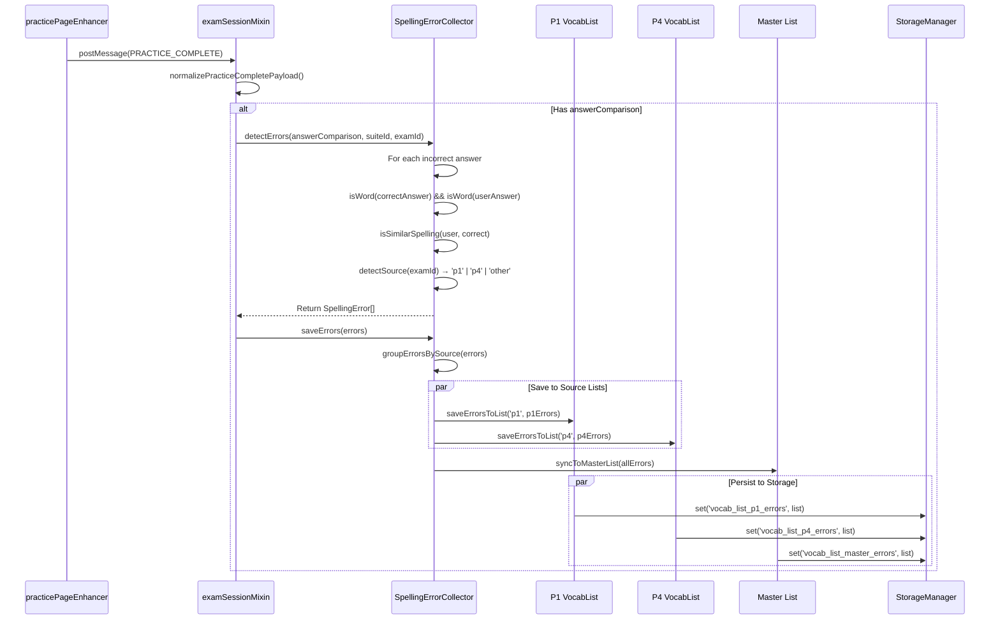
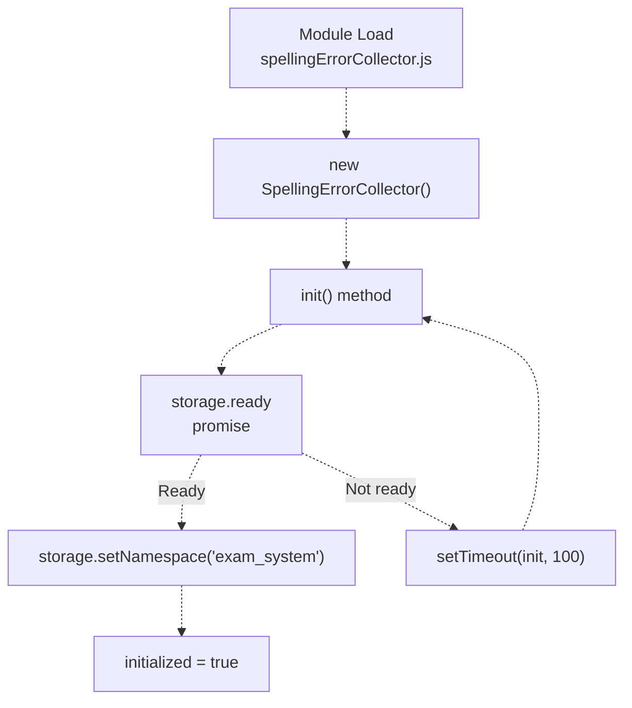

# Spelling Error Collection & Vocabulary

> **Relevant source files**
> * [js/app/browseController.js](https://github.com/sallowayma-git/IELTS-practice/blob/92f64eb8/js/app/browseController.js)
> * [js/app/examActions.js](https://github.com/sallowayma-git/IELTS-practice/blob/92f64eb8/js/app/examActions.js)
> * [js/app/main-entry.js](https://github.com/sallowayma-git/IELTS-practice/blob/92f64eb8/js/app/main-entry.js)
> * [js/app/navigationMixin.js](https://github.com/sallowayma-git/IELTS-practice/blob/92f64eb8/js/app/navigationMixin.js)
> * [js/app/spellingErrorCollector.js](https://github.com/sallowayma-git/IELTS-practice/blob/92f64eb8/js/app/spellingErrorCollector.js)
> * [js/components/practiceHistory.js](https://github.com/sallowayma-git/IELTS-practice/blob/92f64eb8/js/components/practiceHistory.js)
> * [js/components/practiceHistoryEnhancer.js](https://github.com/sallowayma-git/IELTS-practice/blob/92f64eb8/js/components/practiceHistoryEnhancer.js)
> * [js/components/practiceRecordModal.js](https://github.com/sallowayma-git/IELTS-practice/blob/92f64eb8/js/components/practiceRecordModal.js)
> * [js/data/dataSources/storageDataSource.js](https://github.com/sallowayma-git/IELTS-practice/blob/92f64eb8/js/data/dataSources/storageDataSource.js)
> * [js/data/index.js](https://github.com/sallowayma-git/IELTS-practice/blob/92f64eb8/js/data/index.js)
> * [js/runtime/lazyLoader.js](https://github.com/sallowayma-git/IELTS-practice/blob/92f64eb8/js/runtime/lazyLoader.js)
> * [js/utils/markdownExporter.js](https://github.com/sallowayma-git/IELTS-practice/blob/92f64eb8/js/utils/markdownExporter.js)

This document describes the spelling error collection system, which automatically detects and catalogs single-word spelling errors from listening practice sessions. The system uses algorithmic similarity detection to identify misspelled words, maintains separate vocabulary lists for different practice categories (P1, P4, and a master list), and integrates with the broader practice session workflow to provide automatic error tracking.

For information about the practice session system that triggers error collection, see [Practice Session System](/sallowayma-git/IELTS-practice/5-practice-session-system). For vocabulary practice features using the collected words, see [Vocabulary List Management](/sallowayma-git/IELTS-practice/11.2-vocabulary-list-management).

---

## System Architecture

The spelling error collection system consists of three main components: error detection, vocabulary list management, and storage persistence.



**Sources:** [js/app/spellingErrorCollector.js L1-L762](https://github.com/sallowayma-git/IELTS-practice/blob/92f64eb8/js/app/spellingErrorCollector.js#L1-L762)

 [js/runtime/lazyLoader.js L14-L26](https://github.com/sallowayma-git/IELTS-practice/blob/92f64eb8/js/runtime/lazyLoader.js#L14-L26)

---

## Data Structures

### SpellingError Object

The `SpellingError` object represents a single detected spelling error with complete metadata for tracking and review.

| Field | Type | Description |
| --- | --- | --- |
| `word` | string | Correct spelling of the word |
| `userInput` | string | User's incorrect spelling |
| `questionId` | string | Question identifier (e.g., "q1", "q14") |
| `suiteId` | string \| null | Suite identifier for multi-suite sessions |
| `examId` | string | Exam identifier for source tracking |
| `timestamp` | number | Unix timestamp when error occurred |
| `errorCount` | number | Number of times this word was misspelled |
| `source` | string | Source category: 'p1', 'p4', or 'other' |
| `metadata` | Object | Additional context (optional) |

**Sources:** [js/app/spellingErrorCollector.js L19-L32](https://github.com/sallowayma-git/IELTS-practice/blob/92f64eb8/js/app/spellingErrorCollector.js#L19-L32)

### VocabularyList Object

The `VocabularyList` structure organizes spelling errors by source with comprehensive metadata.

| Field | Type | Description |
| --- | --- | --- |
| `id` | string | List identifier: 'p1', 'p4', 'master', 'custom' |
| `name` | string | Human-readable list name |
| `source` | string | Source category for filtering |
| `words` | SpellingError[] | Array of spelling error records |
| `createdAt` | number | Unix timestamp of list creation |
| `updatedAt` | number | Unix timestamp of last modification |
| `stats.totalWords` | number | Total unique words in list |
| `stats.masteredWords` | number | Count of mastered words |
| `stats.reviewingWords` | number | Count of words under review |

**Sources:** [js/app/spellingErrorCollector.js L34-L47](https://github.com/sallowayma-git/IELTS-practice/blob/92f64eb8/js/app/spellingErrorCollector.js#L34-L47)

---

## Error Detection Algorithm

### Detection Pipeline

The error detection system processes answer comparisons through a multi-stage validation pipeline.



**Sources:** [js/app/spellingErrorCollector.js L263-L310](https://github.com/sallowayma-git/IELTS-practice/blob/92f64eb8/js/app/spellingErrorCollector.js#L263-L310)

 [js/app/spellingErrorCollector.js L312-L341](https://github.com/sallowayma-git/IELTS-practice/blob/92f64eb8/js/app/spellingErrorCollector.js#L312-L341)

### Word Validation Rules

The `isWord()` method applies comprehensive validation to distinguish words from non-word content.

**Exclusion Criteria:**

| Rule | Pattern | Example Rejected |
| --- | --- | --- |
| Empty/null | `!text \|\| !text.trim()` | "", null, undefined |
| Pure numbers | `/^\d+$/` | "123", "2023" |
| Dates | `/^\d{1,4}[-/]\d{1,2}[-/]\d{1,4}$/` | "2023-01-01", "01/01/2023" |
| Times | `/^\d{1,2}:\d{2}(:\d{2})?$/` | "10:30", "10:30:45" |
| Long phrases | `words.length > 3` | "the quick brown fox" |
| Special characters | `/[^a-zA-Z\s'-]/` | "test@123", "value#1" |
| Too short | `length < 2` | "a", "I" |
| Too long | `length > 50` | Long sentences |
| No letters | `!/[a-zA-Z]/` | "123-456" |

**Acceptance Criteria:**

* Contains at least one letter
* Length between 2-50 characters
* Only letters, spaces, hyphens, and apostrophes
* Maximum 3 words (allows compound phrases)

**Sources:** [js/app/spellingErrorCollector.js L343-L405](https://github.com/sallowayma-git/IELTS-practice/blob/92f64eb8/js/app/spellingErrorCollector.js#L343-L405)

### Levenshtein Distance Algorithm

The similarity checker uses the Levenshtein distance algorithm to calculate edit distance between the user input and correct answer.



**Distance Calculation:**

* `matrix[i][j]` = minimum operations to transform `a[0..i-1]` to `b[0..j-1]`
* Operations: insert (cost 1), delete (cost 1), replace (cost 1)
* Same character: no cost (`matrix[i-1][j-1]`)

**Similarity Threshold:**

* Similarity = `1 - (editDistance / maxLength)`
* Threshold = 80% (allows up to 20% edit distance)

**Sources:** [js/app/spellingErrorCollector.js L407-L476](https://github.com/sallowayma-git/IELTS-practice/blob/92f64eb8/js/app/spellingErrorCollector.js#L407-L476)

 [js/app/spellingErrorCollector.js L478-L528](https://github.com/sallowayma-git/IELTS-practice/blob/92f64eb8/js/app/spellingErrorCollector.js#L478-L528)

---

## Vocabulary List Management

### List Types and Storage Keys

The system maintains three primary vocabulary lists stored with distinct keys in the persistence layer.

| List ID | Storage Key | Purpose |
| --- | --- | --- |
| `p1` | `vocab_list_p1_errors` | P1 listening practice errors |
| `p4` | `vocab_list_p4_errors` | P4 listening practice errors |
| `master` | `vocab_list_master_errors` | Comprehensive list (all sources) |
| `custom` | `vocab_list_custom` | User-created custom lists |

**Sources:** [js/app/spellingErrorCollector.js L59-L65](https://github.com/sallowayma-git/IELTS-practice/blob/92f64eb8/js/app/spellingErrorCollector.js#L59-L65)

### Source Detection

The `detectSource()` method analyzes the `examId` to categorize errors by practice type.

**Detection Logic:**



**Sources:** [js/app/spellingErrorCollector.js L119-L151](https://github.com/sallowayma-git/IELTS-practice/blob/92f64eb8/js/app/spellingErrorCollector.js#L119-L151)

### Word Deduplication and Error Count Tracking

When saving errors to a vocabulary list, the system merges duplicates and tracks error frequency.

**Merge Logic:**

1. **Normalize word:** Convert to lowercase and trim whitespace
2. **Search existing:** Find word in `vocabList.words` by normalized form
3. **If exists:** * Increment `errorCount` * Update `timestamp` to latest occurrence * Update `userInput` to most recent misspelling * Update `questionId`, `examId`, `suiteId` to latest context
4. **If new:** * Add to `vocabList.words` with `errorCount = 1`

**Sources:** [js/app/spellingErrorCollector.js L613-L654](https://github.com/sallowayma-git/IELTS-practice/blob/92f64eb8/js/app/spellingErrorCollector.js#L613-L654)

---

## Integration with Practice Sessions

### Lazy Loading

The `SpellingErrorCollector` is loaded as part of the `practice-suite` group, ensuring availability before practice sessions complete.

**Load Order in practice-suite group:**

```
1. js/app/spellingErrorCollector.js
2. js/utils/markdownExporter.js
3. js/components/practiceRecordModal.js
4. js/components/practiceHistoryEnhancer.js
5. js/core/scoreStorage.js
6. js/utils/answerSanitizer.js
7. js/core/practiceRecorder.js
8. js/core/legacyStateBridge.js
9. js/utils/legacyStateAdapter.js
10. js/services/GlobalStateService.js
```

**Sources:** [js/runtime/lazyLoader.js L14-L26](https://github.com/sallowayma-git/IELTS-practice/blob/92f64eb8/js/runtime/lazyLoader.js#L14-L26)

### Collection Trigger Points

Spelling error collection occurs during practice session completion when answer comparison data becomes available.



**Sources:** [js/app/spellingErrorCollector.js L263-L310](https://github.com/sallowayma-git/IELTS-practice/blob/92f64eb8/js/app/spellingErrorCollector.js#L263-L310)

 [js/app/spellingErrorCollector.js L530-L563](https://github.com/sallowayma-git/IELTS-practice/blob/92f64eb8/js/app/spellingErrorCollector.js#L530-L563)

---

## Storage and Persistence

### Storage Manager Integration

The vocabulary lists are persisted through the `StorageManager` multi-backend system with namespace isolation.

**Namespace Configuration:**

* All vocabulary data uses namespace: `exam_system`
* Applied during initialization via `storage.setNamespace('exam_system')`

**Storage Keys:**

```
// Vocabulary Lists
'vocab_list_p1_errors'      → P1 spelling errors
'vocab_list_p4_errors'      → P4 spelling errors  
'vocab_list_master_errors'  → Master comprehensive list
'vocab_list_custom'         → User custom lists

// Metadata (via MetaRepository)
'vocab_words'               → Array of vocabulary words
'vocab_user_config'         → User vocabulary configuration
'vocab_review_queue'        → Review scheduling queue
```

**Sources:** [js/app/spellingErrorCollector.js L59-L65](https://github.com/sallowayma-git/IELTS-practice/blob/92f64eb8/js/app/spellingErrorCollector.js#L59-L65)

 [js/app/spellingErrorCollector.js L74-L96](https://github.com/sallowayma-git/IELTS-practice/blob/92f64eb8/js/app/spellingErrorCollector.js#L74-L96)

 [js/data/index.js L92-L109](https://github.com/sallowayma-git/IELTS-practice/blob/92f64eb8/js/data/index.js#L92-L109)

### Data Repository Access

Vocabulary data can be accessed through the `MetaRepository` which provides typed access with validation.

**MetaRepository Configuration:**

| Key | Default Value | Validators |
| --- | --- | --- |
| `vocab_words` | `[]` | Must be array |
| `vocab_user_config` | `{ dailyNew: 20, reviewLimit: 100, masteryCount: 4, theme: 'auto', notify: true }` | Must be object |
| `vocab_review_queue` | `[]` | Must be array |

**Sources:** [js/data/index.js L92-L109](https://github.com/sallowayma-git/IELTS-practice/blob/92f64eb8/js/data/index.js#L92-L109)

---

## API Reference

### SpellingErrorCollector Class

The main class for error detection and vocabulary list management.

#### Constructor

```
new SpellingErrorCollector()
```

Creates a new instance and initializes the error cache and storage system. Automatically called on module load to create `window.spellingErrorCollector`.

**Sources:** [js/app/spellingErrorCollector.js L52-L72](https://github.com/sallowayma-git/IELTS-practice/blob/92f64eb8/js/app/spellingErrorCollector.js#L52-L72)

 [js/app/spellingErrorCollector.js L755-L760](https://github.com/sallowayma-git/IELTS-practice/blob/92f64eb8/js/app/spellingErrorCollector.js#L755-L760)

#### detectErrors()

```
detectErrors(answerComparison, suiteId, examId) → SpellingError[]
```

Analyzes answer comparison data to identify spelling errors.

**Parameters:**

* `answerComparison` (Object): Answer comparison object with format `{ questionId: { userAnswer, correctAnswer, isCorrect } }`
* `suiteId` (string, optional): Suite identifier for multi-suite sessions
* `examId` (string): Exam identifier for source detection

**Returns:** Array of `SpellingError` objects

**Sources:** [js/app/spellingErrorCollector.js L263-L310](https://github.com/sallowayma-git/IELTS-practice/blob/92f64eb8/js/app/spellingErrorCollector.js#L263-L310)

#### saveErrors()

```
saveErrors(errors) → Promise<boolean>
```

Saves detected spelling errors to appropriate vocabulary lists with deduplication.

**Parameters:**

* `errors` (SpellingError[]): Array of spelling error objects to save

**Returns:** Promise resolving to `true` if successful, `false` otherwise

**Process:**

1. Groups errors by source ('p1', 'p4', 'other')
2. Saves to source-specific lists with `saveErrorsToList()`
3. Syncs all errors to master list with `syncToMasterList()`

**Sources:** [js/app/spellingErrorCollector.js L530-L563](https://github.com/sallowayma-git/IELTS-practice/blob/92f64eb8/js/app/spellingErrorCollector.js#L530-L563)

#### loadVocabList()

```
loadVocabList(listId) → Promise<VocabularyList|null>
```

Loads a vocabulary list from storage.

**Parameters:**

* `listId` (string): List identifier ('p1', 'p4', 'master', 'custom')

**Returns:** Promise resolving to `VocabularyList` object or `null` if not found

**Sources:** [js/app/spellingErrorCollector.js L181-L211](https://github.com/sallowayma-git/IELTS-practice/blob/92f64eb8/js/app/spellingErrorCollector.js#L181-L211)

#### saveVocabList()

```
saveVocabList(vocabList) → Promise<boolean>
```

Saves a vocabulary list to storage with updated statistics.

**Parameters:**

* `vocabList` (VocabularyList): Vocabulary list object to save

**Returns:** Promise resolving to `true` if successful, `false` otherwise

**Updates:**

* `stats.totalWords` = `words.length`
* `updatedAt` = current timestamp

**Sources:** [js/app/spellingErrorCollector.js L212-L247](https://github.com/sallowayma-git/IELTS-practice/blob/92f64eb8/js/app/spellingErrorCollector.js#L212-L247)

#### removeWord()

```
removeWord(listId, word) → Promise<boolean>
```

Removes a specific word from a vocabulary list.

**Parameters:**

* `listId` (string): List identifier
* `word` (string): Word to remove (case-insensitive)

**Returns:** Promise resolving to `true` if word was found and removed, `false` otherwise

**Sources:** [js/app/spellingErrorCollector.js L687-L722](https://github.com/sallowayma-git/IELTS-practice/blob/92f64eb8/js/app/spellingErrorCollector.js#L687-L722)

#### clearList()

```
clearList(listId) → Promise<boolean>
```

Clears all words from a vocabulary list while preserving list metadata.

**Parameters:**

* `listId` (string): List identifier

**Returns:** Promise resolving to `true` if successful, `false` otherwise

**Sources:** [js/app/spellingErrorCollector.js L724-L749](https://github.com/sallowayma-git/IELTS-practice/blob/92f64eb8/js/app/spellingErrorCollector.js#L724-L749)

#### getWordCount()

```
getWordCount(listId) → Promise<number>
```

Returns the number of words in a vocabulary list.

**Parameters:**

* `listId` (string): List identifier

**Returns:** Promise resolving to word count (0 if list doesn't exist)

**Sources:** [js/app/spellingErrorCollector.js L249-L262](https://github.com/sallowayma-git/IELTS-practice/blob/92f64eb8/js/app/spellingErrorCollector.js#L249-L262)

---

## Error Detection Edge Cases

### Case Sensitivity Handling

The system treats case differences as spelling errors and collects them for review.

**Example:**

* Correct: "receive"
* User input: "Receive"
* Result: Collected as spelling error (case mismatch)

**Rationale:** Listening practice often requires exact case matching, so capitalizing lowercase words or vice versa is considered an error worth tracking.

**Sources:** [js/app/spellingErrorCollector.js L419-L427](https://github.com/sallowayma-git/IELTS-practice/blob/92f64eb8/js/app/spellingErrorCollector.js#L419-L427)

### Character Transposition Detection

Adjacent character swaps are detected before general edit distance calculation as a common spelling error pattern.

**Algorithm:**

1. Check if strings have same length
2. Count differing positions
3. If exactly 2 positions differ and characters are swapped: immediate match

**Example:**

* Correct: "receive"
* User input: "recieve"
* Positions differ: index 3 ('e'→'i'), index 4 ('i'→'e')
* Result: Detected as transposition, marked as spelling error

**Sources:** [js/app/spellingErrorCollector.js L430-L450](https://github.com/sallowayma-git/IELTS-practice/blob/92f64eb8/js/app/spellingErrorCollector.js#L430-L450)

### Compound Word Handling

The system allows up to 3 words in a phrase, enabling collection of compound terms and short phrases common in listening practice.

**Accepted Examples:**

* "ice cream" (2 words)
* "New York City" (3 words)
* "mother-in-law" (hyphens allowed)

**Rejected Examples:**

* "the quick brown fox" (4 words - too long)

**Sources:** [js/app/spellingErrorCollector.js L378-L381](https://github.com/sallowayma-git/IELTS-practice/blob/92f64eb8/js/app/spellingErrorCollector.js#L378-L381)

---

## Performance Considerations

### Initialization Timing

The `SpellingErrorCollector` initialization waits for `StorageManager` readiness to avoid race conditions.

**Initialization Sequence:**



**Timeout Protection:**

* Maximum 50 retry attempts (5 seconds total)
* Throws error if initialization doesn't complete

**Sources:** [js/app/spellingErrorCollector.js L74-L117](https://github.com/sallowayma-git/IELTS-practice/blob/92f64eb8/js/app/spellingErrorCollector.js#L74-L117)

### Levenshtein Distance Optimization

The edit distance calculation has O(m×n) time complexity where m and n are string lengths. To prevent performance issues:

**Early Exit Conditions:**

1. Empty string checks return immediately
2. Transposition detection (O(n)) runs before matrix building
3. Matrix building only occurs if transposition check fails

**Memory:** O(m×n) space for the distance matrix

**Sources:** [js/app/spellingErrorCollector.js L487-L528](https://github.com/sallowayma-git/IELTS-practice/blob/92f64eb8/js/app/spellingErrorCollector.js#L487-L528)

---

## Global Instance

A singleton instance is automatically created and exposed as `window.spellingErrorCollector` for use throughout the application.

**Initialization Check:**

```
if (!window.spellingErrorCollector) {
    window.spellingErrorCollector = new SpellingErrorCollector();
}
```

This ensures only one instance exists, preventing duplicate error collection and storage operations.

**Sources:** [js/app/spellingErrorCollector.js L755-L760](https://github.com/sallowayma-git/IELTS-practice/blob/92f64eb8/js/app/spellingErrorCollector.js#L755-L760)