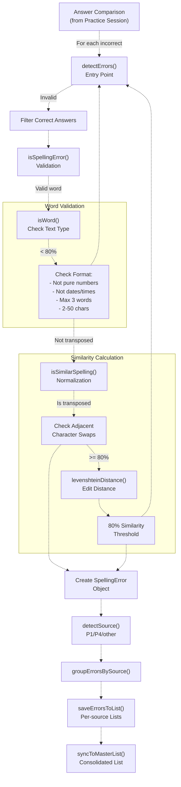
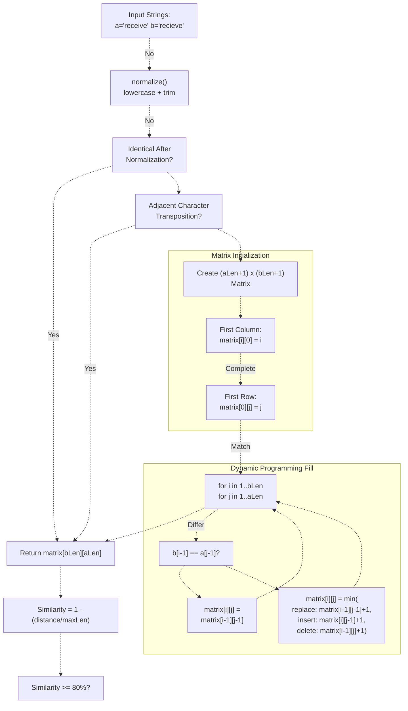
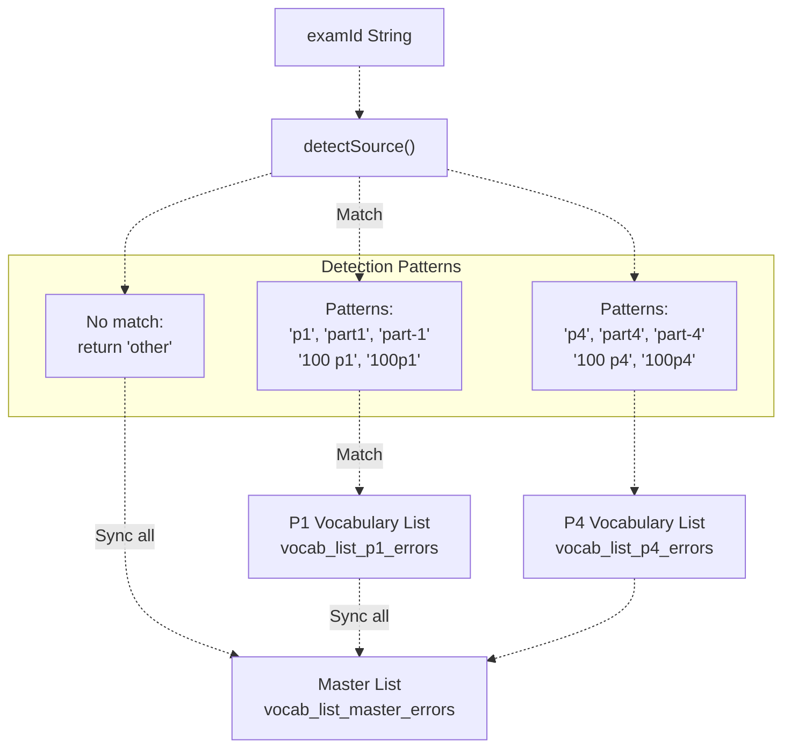
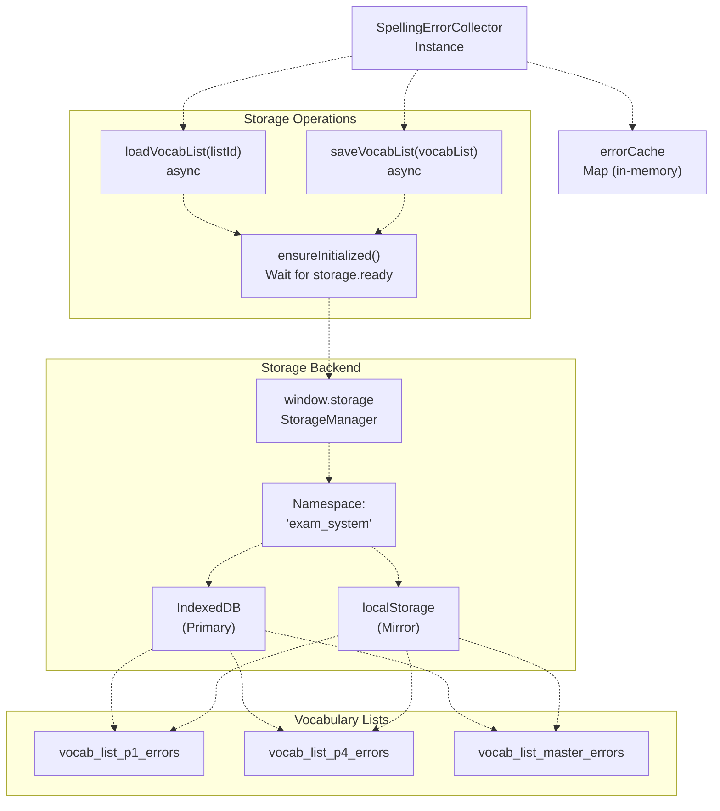
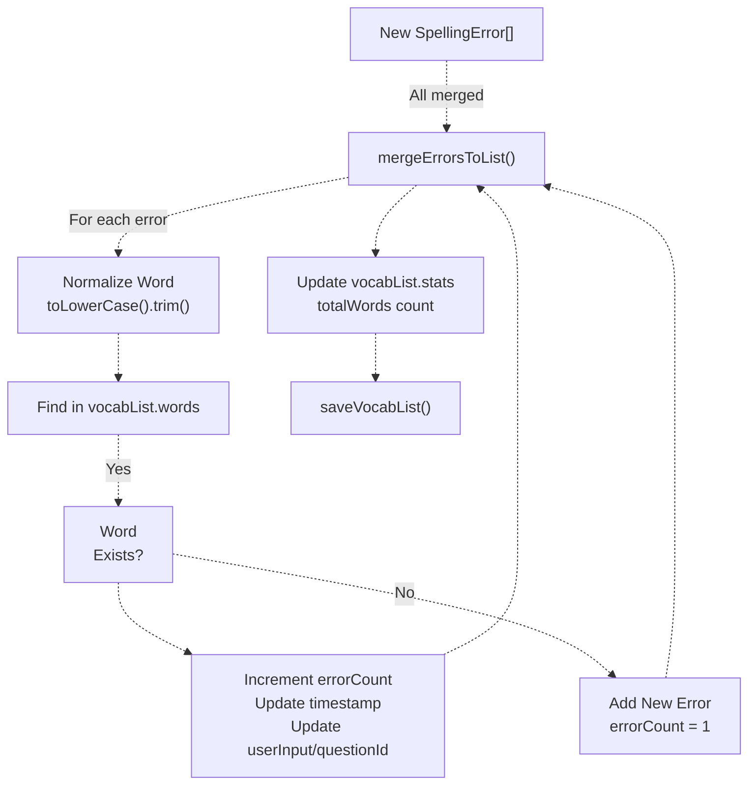
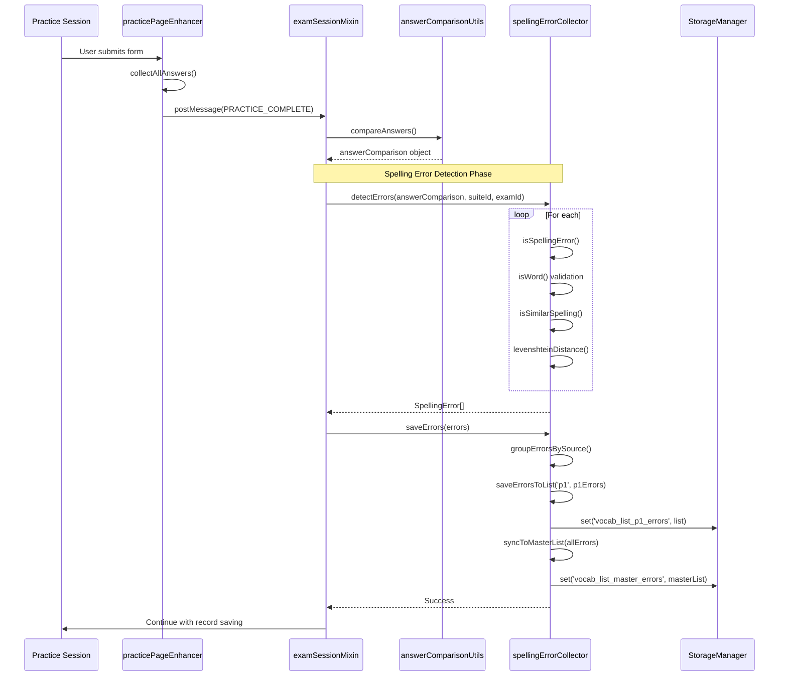

# Spelling Error Detection System

> **Relevant source files**
> * [js/app/browseController.js](https://github.com/sallowayma-git/IELTS-practice/blob/92f64eb8/js/app/browseController.js)
> * [js/app/examActions.js](https://github.com/sallowayma-git/IELTS-practice/blob/92f64eb8/js/app/examActions.js)
> * [js/app/main-entry.js](https://github.com/sallowayma-git/IELTS-practice/blob/92f64eb8/js/app/main-entry.js)
> * [js/app/navigationMixin.js](https://github.com/sallowayma-git/IELTS-practice/blob/92f64eb8/js/app/navigationMixin.js)
> * [js/app/spellingErrorCollector.js](https://github.com/sallowayma-git/IELTS-practice/blob/92f64eb8/js/app/spellingErrorCollector.js)
> * [js/runtime/lazyLoader.js](https://github.com/sallowayma-git/IELTS-practice/blob/92f64eb8/js/runtime/lazyLoader.js)

## Purpose and Scope

This document describes the spelling error detection system implemented in `SpellingErrorCollector`, which automatically identifies and collects spelling mistakes from listening fill-in-the-blank practice sessions. The system uses Levenshtein distance to detect similar spellings, categorizes errors by source (P1/P4), and maintains separate vocabulary lists for review.

For information about how spelling errors integrate with practice sessions, see [Practice Session Lifecycle & Management](/sallowayma-git/IELTS-practice/5.1-practice-session-lifecycle-and-management). For vocabulary list management features, see [Vocabulary List Management](/sallowayma-git/IELTS-practice/11.2-vocabulary-list-management).

---

## System Overview

The spelling error detection system operates as a post-processing step after practice completion. When a user submits answers that are incorrect but lexically similar to the correct answers, the system identifies these as spelling errors rather than comprehension failures.

**Key Design Principles:**

* **Automatic Detection**: Runs transparently during answer comparison
* **Source Segregation**: Maintains separate lists for P1, P4, and master vocabulary
* **Smart Filtering**: Distinguishes words from numbers, dates, phrases, and special characters
* **Similarity-Based**: Uses edit distance with 80% similarity threshold
* **Incremental Storage**: Tracks error frequency for repeated mistakes

The system is initialized globally as `window.spellingErrorCollector` and loaded as part of the `practice-suite` lazy loading group [js/runtime/lazyLoader.js L14-L26](https://github.com/sallowayma-git/IELTS-practice/blob/92f64eb8/js/runtime/lazyLoader.js#L14-L26)

**Sources:** [js/app/spellingErrorCollector.js L1-L762](https://github.com/sallowayma-git/IELTS-practice/blob/92f64eb8/js/app/spellingErrorCollector.js#L1-L762)

---

## Detection Pipeline

The error detection process follows a multi-stage pipeline from answer comparison to persisted vocabulary lists:



**Detection Entry Point:**

```javascript
// Called from practice completion handler with answer comparison
const errors = spellingErrorCollector.detectErrors(
    answerComparison,  // { questionId: { userAnswer, correctAnswer, isCorrect } }
    suiteId,           // Optional suite identifier
    examId             // Exam identifier for source detection
);
```

The pipeline applies three validation layers:

1. **Correctness Filter**: Skip answers already marked correct
2. **Word Validation**: Ensure both user input and correct answer are words [js/app/spellingErrorCollector.js L344-L405](https://github.com/sallowayma-git/IELTS-practice/blob/92f64eb8/js/app/spellingErrorCollector.js#L344-L405)
3. **Similarity Check**: Apply edit distance threshold [js/app/spellingErrorCollector.js L414-L476](https://github.com/sallowayma-git/IELTS-practice/blob/92f64eb8/js/app/spellingErrorCollector.js#L414-L476)

**Sources:** [js/app/spellingErrorCollector.js L265-L310](https://github.com/sallowayma-git/IELTS-practice/blob/92f64eb8/js/app/spellingErrorCollector.js#L265-L310)

 [js/app/spellingErrorCollector.js L313-L341](https://github.com/sallowayma-git/IELTS-practice/blob/92f64eb8/js/app/spellingErrorCollector.js#L313-L341)

---

## Word Validation Rules

The `isWord()` function applies comprehensive filtering to distinguish legitimate words from other text types:

| Validation | Rule | Example (Rejected) |
| --- | --- | --- |
| **Empty/Null** | Must have content | `""`, `null`, `undefined` |
| **Pure Numbers** | Must contain letters | `"123"`, `"42"` |
| **Dates** | Exclude date formats | `"2023-01-01"`, `"01/01/2023"` |
| **Times** | Exclude time formats | `"10:30"`, `"10:30:45"` |
| **Long Phrases** | Max 3 words | `"the quick brown fox"` |
| **Special Characters** | Only letters, hyphens, apostrophes | `"hello@world"`, `"test#123"` |
| **Length** | 2-50 characters | `"a"`, `"this is a very long sentence..."` |
| **Letter Requirement** | At least one letter | `"---"`, `"''"` |

**Implementation Details:**

* Regex patterns for format detection [js/app/spellingErrorCollector.js L363-L375](https://github.com/sallowayma-git/IELTS-practice/blob/92f64eb8/js/app/spellingErrorCollector.js#L363-L375)
* Word count via `split(/\s+/)` [js/app/spellingErrorCollector.js L378-L381](https://github.com/sallowayma-git/IELTS-practice/blob/92f64eb8/js/app/spellingErrorCollector.js#L378-L381)
* Character class validation with `/[^a-zA-Z\s'-]/` [js/app/spellingErrorCollector.js L384-L386](https://github.com/sallowayma-git/IELTS-practice/blob/92f64eb8/js/app/spellingErrorCollector.js#L384-L386)

**Sources:** [js/app/spellingErrorCollector.js L343-L405](https://github.com/sallowayma-git/IELTS-practice/blob/92f64eb8/js/app/spellingErrorCollector.js#L343-L405)

---

## Levenshtein Distance Algorithm

The system uses the Levenshtein edit distance to measure spelling similarity. This algorithm calculates the minimum number of single-character operations (insertion, deletion, substitution) needed to transform one string into another.

### Algorithm Diagram



### Example Calculation

For `"recieve"` → `"receive"`:

|  | ε | r | e | c | e | i | v | e |
| --- | --- | --- | --- | --- | --- | --- | --- | --- |
| **ε** | 0 | 1 | 2 | 3 | 4 | 5 | 6 | 7 |
| **r** | 1 | 0 | 1 | 2 | 3 | 4 | 5 | 6 |
| **e** | 2 | 1 | 0 | 1 | 2 | 3 | 4 | 5 |
| **c** | 3 | 2 | 1 | 0 | 1 | 2 | 3 | 4 |
| **i** | 4 | 3 | 2 | 1 | 1 | 1 | 2 | 3 |
| **e** | 5 | 4 | 3 | 2 | 1 | 2 | 2 | 2 |
| **v** | 6 | 5 | 4 | 3 | 2 | 2 | 2 | 3 |
| **e** | 7 | 6 | 5 | 4 | 3 | 3 | 3 | 2 |

**Edit Distance:** 2 (swap 'i' and 'e' positions)
**Similarity:** 1 - (2/7) = 71.4% → Below 80% threshold

However, the transposition check detects the adjacent character swap and accepts it as a spelling error [js/app/spellingErrorCollector.js L430-L450](https://github.com/sallowayma-git/IELTS-practice/blob/92f64eb8/js/app/spellingErrorCollector.js#L430-L450)

**Sources:** [js/app/spellingErrorCollector.js L478-L528](https://github.com/sallowayma-git/IELTS-practice/blob/92f64eb8/js/app/spellingErrorCollector.js#L478-L528)

 [js/app/spellingErrorCollector.js L414-L476](https://github.com/sallowayma-git/IELTS-practice/blob/92f64eb8/js/app/spellingErrorCollector.js#L414-L476)

---

## Source Detection and Categorization

The system categorizes errors by their source to maintain separate practice lists for different exam sections:



**Detection Logic:**

```javascript
detectSource(examId) {
    const lowerExamId = examId.toLowerCase();
    
    // Check P1 patterns
    if (lowerExamId.includes('p1') || lowerExamId.includes('part1') ||
        lowerExamId.includes('100 p1')) {
        return 'p1';
    }
    
    // Check P4 patterns
    if (lowerExamId.includes('p4') || lowerExamId.includes('part4') ||
        lowerExamId.includes('100 p4')) {
        return 'p4';
    }
    
    return 'other';
}
```

**Storage Key Mapping:**

| Source | Storage Key | Description |
| --- | --- | --- |
| `p1` | `vocab_list_p1_errors` | P1-specific errors |
| `p4` | `vocab_list_p4_errors` | P4-specific errors |
| `master` | `vocab_list_master_errors` | All errors consolidated |
| `custom` | `vocab_list_custom` | User-defined lists |

**Sources:** [js/app/spellingErrorCollector.js L119-L151](https://github.com/sallowayma-git/IELTS-practice/blob/92f64eb8/js/app/spellingErrorCollector.js#L119-L151)

 [js/app/spellingErrorCollector.js L60-L66](https://github.com/sallowayma-git/IELTS-practice/blob/92f64eb8/js/app/spellingErrorCollector.js#L60-L66)

---

## Data Structures

### SpellingError Object

```
interface SpellingError {
    word: string;              // Correct word (e.g., "receive")
    userInput: string;         // User's incorrect spelling (e.g., "recieve")
    questionId: string;        // Question identifier
    suiteId: string | null;    // Suite identifier (optional)
    examId: string;            // Exam identifier
    timestamp: number;         // Error occurrence timestamp
    errorCount: number;        // Number of times this error occurred
    source: 'p1' | 'p4' | 'other';  // Source category
    metadata?: {               // Optional metadata
        context?: string;      // Question context
        difficulty?: string;   // Difficulty level
    };
}
```

### VocabularyList Structure

```
interface VocabularyList {
    id: string;                // List identifier ('p1', 'p4', 'master')
    name: string;              // Display name
    source: 'p1' | 'p4' | 'all' | 'user';  // Source category
    words: SpellingError[];    // Error records
    createdAt: number;         // Creation timestamp
    updatedAt: number;         // Last modification timestamp
    stats: {
        totalWords: number;        // Total word count
        masteredWords: number;     // Words marked as mastered
        reviewingWords: number;    // Words in review
    };
}
```

**List Creation:**

```yaml
createEmptyList(listId, source) {
    return {
        id: listId,
        name: this.getListName(source),
        source: source,
        words: [],
        createdAt: Date.now(),
        updatedAt: Date.now(),
        stats: {
            totalWords: 0,
            masteredWords: 0,
            reviewingWords: 0
        }
    };
}
```

**Sources:** [js/app/spellingErrorCollector.js L19-L47](https://github.com/sallowayma-git/IELTS-practice/blob/92f64eb8/js/app/spellingErrorCollector.js#L19-L47)

 [js/app/spellingErrorCollector.js L158-L180](https://github.com/sallowayma-git/IELTS-practice/blob/92f64eb8/js/app/spellingErrorCollector.js#L158-L180)

---

## Storage and Persistence

### Storage Architecture



### Deduplication and Merging

When saving errors, the system deduplicates based on normalized word (lowercase, trimmed) and increments error counts:



**Merge Logic:**

```javascript
mergeErrorsToList(vocabList, errors) {
    for (const error of errors) {
        const normalizedWord = error.word.toLowerCase().trim();
        const existingIndex = vocabList.words.findIndex(w => 
            w.word.toLowerCase().trim() === normalizedWord
        );
        
        if (existingIndex !== -1) {
            // Update existing word
            const existing = vocabList.words[existingIndex];
            existing.errorCount = (existing.errorCount || 1) + 1;
            existing.timestamp = error.timestamp;
            existing.userInput = error.userInput;
        } else {
            // Add new word
            vocabList.words.push({ ...error, errorCount: 1 });
        }
    }
}
```

**Sources:** [js/app/spellingErrorCollector.js L183-L247](https://github.com/sallowayma-git/IELTS-practice/blob/92f64eb8/js/app/spellingErrorCollector.js#L183-L247)

 [js/app/spellingErrorCollector.js L613-L654](https://github.com/sallowayma-git/IELTS-practice/blob/92f64eb8/js/app/spellingErrorCollector.js#L613-L654)

---

## Integration with Practice Sessions

The spelling error collector integrates into the practice completion flow through the `practice-suite` lazy loading group:



**Lazy Loading Setup:**
The collector is loaded as part of the `practice-suite` group [js/runtime/lazyLoader.js L14-L26](https://github.com/sallowayma-git/IELTS-practice/blob/92f64eb8/js/runtime/lazyLoader.js#L14-L26)

:

```
manifest['practice-suite'] = [
    'js/app/spellingErrorCollector.js',  // First in suite
    'js/utils/markdownExporter.js',
    'js/components/practiceRecordModal.js',
    // ... other suite components
];
```

**Initialization:**

```
// Global instance created on module load
if (!window.spellingErrorCollector) {
    window.spellingErrorCollector = new SpellingErrorCollector();
}

// Waits for storage system
async init() {
    if (window.storage && window.storage.ready) {
        await window.storage.ready;
    }
    window.storage.setNamespace('exam_system');
    this.initialized = true;
}
```

**Sources:** [js/app/spellingErrorCollector.js L73-L96](https://github.com/sallowayma-git/IELTS-practice/blob/92f64eb8/js/app/spellingErrorCollector.js#L73-L96)

 [js/app/spellingErrorCollector.js L752-L759](https://github.com/sallowayma-git/IELTS-practice/blob/92f64eb8/js/app/spellingErrorCollector.js#L752-L759)

 [js/runtime/lazyLoader.js L14-L26](https://github.com/sallowayma-git/IELTS-practice/blob/92f64eb8/js/runtime/lazyLoader.js#L14-L26)

---

## API Reference

### Core Methods

| Method | Parameters | Returns | Description |
| --- | --- | --- | --- |
| `detectErrors()` | `answerComparison`, `suiteId`, `examId` | `SpellingError[]` | Detect spelling errors from answer comparison |
| `saveErrors()` | `errors: SpellingError[]` | `Promise<boolean>` | Persist errors to vocabulary lists |
| `isSpellingError()` | `comparison` | `boolean` | Check if an answer is a spelling error |
| `isWord()` | `text` | `boolean` | Validate if text is a word |
| `isSimilarSpelling()` | `input`, `correct` | `boolean` | Check spelling similarity (80% threshold) |
| `levenshteinDistance()` | `a`, `b` | `number` | Calculate edit distance |
| `detectSource()` | `examId` | `'p1'\|'p4'\|'other'` | Detect error source from exam ID |

### Storage Methods

| Method | Parameters | Returns | Description |
| --- | --- | --- | --- |
| `loadVocabList()` | `listId` | `Promise<VocabularyList\|null>` | Load vocabulary list from storage |
| `saveVocabList()` | `vocabList` | `Promise<boolean>` | Save vocabulary list to storage |
| `getWordCount()` | `listId` | `Promise<number>` | Get word count in list |
| `removeWord()` | `listId`, `word` | `Promise<boolean>` | Remove word from list |
| `clearList()` | `listId` | `Promise<boolean>` | Clear all words from list |
| `syncToMasterList()` | `errors` | `Promise<boolean>` | Sync errors to master list |

### List Management

| Method | Parameters | Returns | Description |
| --- | --- | --- | --- |
| `createEmptyList()` | `listId`, `source` | `VocabularyList` | Create empty vocabulary list |
| `mergeErrorsToList()` | `vocabList`, `errors` | `void` | Merge errors into list with deduplication |
| `groupErrorsBySource()` | `errors` | `Object` | Group errors by source category |

**Sources:** [js/app/spellingErrorCollector.js L52-L750](https://github.com/sallowayma-git/IELTS-practice/blob/92f64eb8/js/app/spellingErrorCollector.js#L52-L750)

---

## Configuration and Thresholds

### Similarity Threshold

* **Default:** 80% (edit distance ≤ 20% of max length)
* **Location:** [js/app/spellingErrorCollector.js L467](https://github.com/sallowayma-git/IELTS-practice/blob/92f64eb8/js/app/spellingErrorCollector.js#L467-L467)
* **Formula:** `similarity = 1 - (editDistance / maxLength)`

### Word Validation Constraints

* **Minimum Length:** 2 characters [js/app/spellingErrorCollector.js L389](https://github.com/sallowayma-git/IELTS-practice/blob/92f64eb8/js/app/spellingErrorCollector.js#L389-L389)
* **Maximum Length:** 50 characters [js/app/spellingErrorCollector.js L394](https://github.com/sallowayma-git/IELTS-practice/blob/92f64eb8/js/app/spellingErrorCollector.js#L394-L394)
* **Maximum Word Count:** 3 words [js/app/spellingErrorCollector.js L379](https://github.com/sallowayma-git/IELTS-practice/blob/92f64eb8/js/app/spellingErrorCollector.js#L379-L379)
* **Required Character:** At least one letter [js/app/spellingErrorCollector.js L399](https://github.com/sallowayma-git/IELTS-practice/blob/92f64eb8/js/app/spellingErrorCollector.js#L399-L399)

### Storage Keys

* **P1 List:** `vocab_list_p1_errors`
* **P4 List:** `vocab_list_p4_errors`
* **Master List:** `vocab_list_master_errors`
* **Custom List:** `vocab_list_custom`

[js/app/spellingErrorCollector.js L60-L66](https://github.com/sallowayma-git/IELTS-practice/blob/92f64eb8/js/app/spellingErrorCollector.js#L60-L66)

---

## Error Handling and Resilience

The system implements multiple layers of error handling:

| Failure Point | Handling Strategy | Fallback |
| --- | --- | --- |
| **Storage Unavailable** | Check `window.storage` existence | Return `null`, log warning |
| **Initialization Timeout** | Retry initialization up to 50 times (5 seconds) | Throw error after timeout |
| **Invalid Input** | Validate parameters, early return | Return empty array or `false` |
| **Storage Operation Failure** | Try-catch with error logging | Return `false` or `null` |
| **Namespace Setup Failure** | Catch and log, continue without namespace | Proceed with default namespace |

**Initialization Resilience:**

```javascript
async ensureInitialized() {
    if (this.initialized) return;
    
    let attempts = 0;
    while (!this.initialized && attempts < 50) {
        await new Promise(resolve => setTimeout(resolve, 100));
        attempts++;
    }
    
    if (!this.initialized) {
        throw new Error('SpellingErrorCollector 初始化超时');
    }
}
```

**Sources:** [js/app/spellingErrorCollector.js L98-L117](https://github.com/sallowayma-git/IELTS-practice/blob/92f64eb8/js/app/spellingErrorCollector.js#L98-L117)

 [js/app/spellingErrorCollector.js L183-L210](https://github.com/sallowayma-git/IELTS-practice/blob/92f64eb8/js/app/spellingErrorCollector.js#L183-L210)

 [js/app/spellingErrorCollector.js L217-L247](https://github.com/sallowayma-git/IELTS-practice/blob/92f64eb8/js/app/spellingErrorCollector.js#L217-L247)