# Storage Architecture & Multi-Backend System

> **Relevant source files**
> * [js/core/practiceRecorder.js](https://github.com/sallowayma-git/IELTS-practice/blob/92f64eb8/js/core/practiceRecorder.js)
> * [js/core/scoreStorage.js](https://github.com/sallowayma-git/IELTS-practice/blob/92f64eb8/js/core/scoreStorage.js)
> * [js/utils/dataBackupManager.js](https://github.com/sallowayma-git/IELTS-practice/blob/92f64eb8/js/utils/dataBackupManager.js)
> * [js/utils/storage.js](https://github.com/sallowayma-git/IELTS-practice/blob/92f64eb8/js/utils/storage.js)

## Purpose and Scope

This document details the multi-tier storage architecture that provides reliable, performant data persistence for the IELTS practice system. It covers the `StorageManager` backend hierarchy (IndexedDB → localStorage → sessionStorage → in-memory), the repository abstraction layer, and integration with higher-level components like `ScoreStorage`. For information about how practice records flow through the system and are processed before storage, see [PracticeRecorder & ScoreStorage](/sallowayma-git/IELTS-practice/4.2-practicerecorder-and-scorestorage). For backup and import/export operations, see [Data Backup, Import & Export](/sallowayma-git/IELTS-practice/4.4-data-backup-import-and-export).

---

## System Overview

The storage system implements a resilient, multi-backend architecture with automatic fallback capabilities. Data flows through three distinct layers:

1. **Repository Layer**: High-level abstractions (`PracticeRepository`, `MetaRepository`, `BackupRepository`) that provide structured access patterns
2. **Storage Adapter Layer**: `StorageDataSource` queues operations and delegates to the backend
3. **Backend Layer**: `StorageManager` manages the physical storage backends with automatic fallback

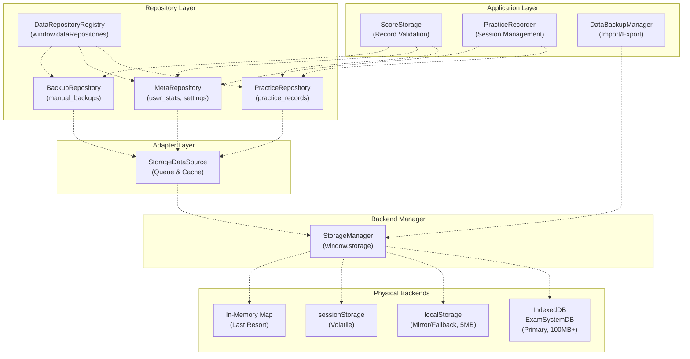

**Sources:** [js/utils/storage.js L1-L234](https://github.com/sallowayma-git/IELTS-practice/blob/92f64eb8/js/utils/storage.js#L1-L234)

 [js/core/scoreStorage.js L1-L34](https://github.com/sallowayma-git/IELTS-practice/blob/92f64eb8/js/core/scoreStorage.js#L1-L34)

 [js/core/practiceRecorder.js L1-L36](https://github.com/sallowayma-git/IELTS-practice/blob/92f64eb8/js/core/practiceRecorder.js#L1-L36)

---

## StorageManager: Multi-Backend Core

The `StorageManager` class [js/utils/storage.js L5-L2089](https://github.com/sallowayma-git/IELTS-practice/blob/92f64eb8/js/utils/storage.js#L5-L2089)

 implements the foundational storage layer with multi-tier backend support, automatic fallback, and namespace isolation.

### Backend Hierarchy

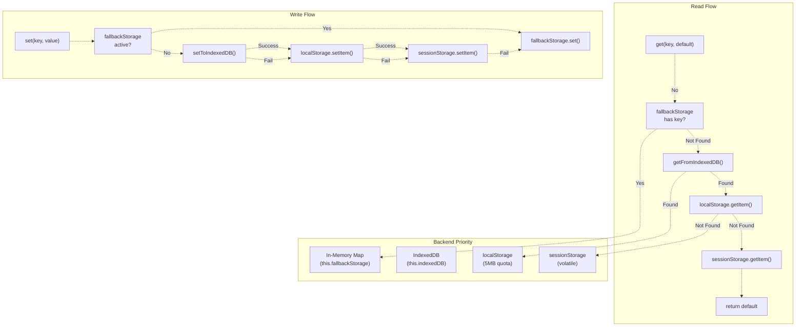

**Sources:** [js/utils/storage.js L594-L721](https://github.com/sallowayma-git/IELTS-practice/blob/92f64eb8/js/utils/storage.js#L594-L721)

 [js/utils/storage.js L796-L853](https://github.com/sallowayma-git/IELTS-practice/blob/92f64eb8/js/utils/storage.js#L796-L853)

### Key Storage Features

| Feature | Implementation | Purpose |
| --- | --- | --- |
| **Namespace Isolation** | `this.prefix = 'exam_system_'` | Prevents key collisions with other apps |
| **Persistent Key Set** | `this.persistentKeys` Set | Marks keys requiring durable storage |
| **Backend Preference** | `exam_system_storage_backend` | Remembers user's preferred backend |
| **IndexedDB Schema** | `ExamSystemDB` v1, `keyValueStore` objectStore | Structured storage for key-value pairs |
| **Quota Monitoring** | `checkStorageQuota()`, periodic cleanup | Prevents quota exceeded errors |
| **Hybrid Mode** | IndexedDB + localStorage dual-write | Ensures data availability across backends |

**Sources:** [js/utils/storage.js L6-L31](https://github.com/sallowayma-git/IELTS-practice/blob/92f64eb8/js/utils/storage.js#L6-L31)

 [js/utils/storage.js L149-L234](https://github.com/sallowayma-git/IELTS-practice/blob/92f64eb8/js/utils/storage.js#L149-L234)

### Initialization Sequence

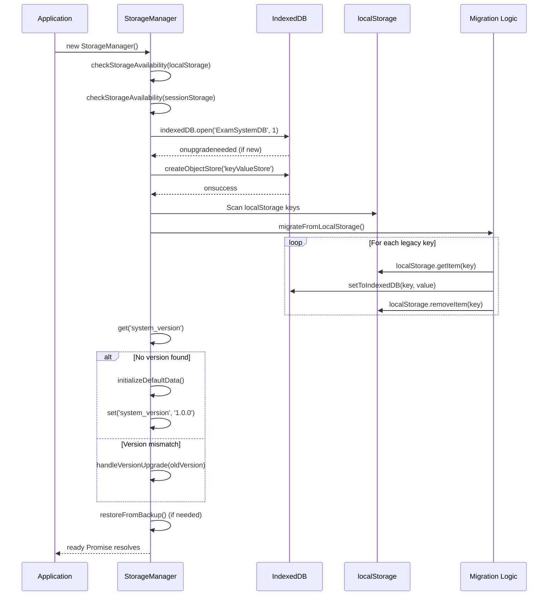

**Sources:** [js/utils/storage.js L89-L144](https://github.com/sallowayma-git/IELTS-practice/blob/92f64eb8/js/utils/storage.js#L89-L144)

 [js/utils/storage.js L149-L234](https://github.com/sallowayma-git/IELTS-practice/blob/92f64eb8/js/utils/storage.js#L149-L234)

 [js/utils/storage.js L273-L312](https://github.com/sallowayma-git/IELTS-practice/blob/92f64eb8/js/utils/storage.js#L273-L312)

---

## Write Path: Persistent vs Volatile Keys

The storage system distinguishes between **persistent keys** (must survive browser restarts) and **volatile keys** (can use session storage). This distinction drives the fallback logic.

### Persistent Key Write Path

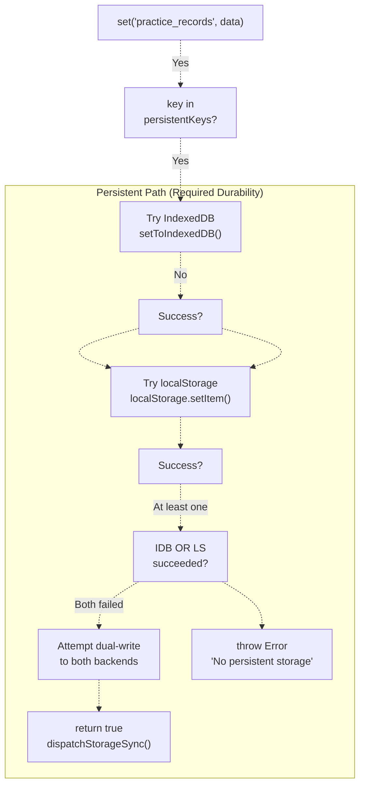

**Persistent Keys:** [js/utils/storage.js L14-L26](https://github.com/sallowayma-git/IELTS-practice/blob/92f64eb8/js/utils/storage.js#L14-L26)

```
this.persistentKeys = new Set([
    'practice_records',
    'user_stats',
    'manual_backups',
    'backup_settings',
    'export_history',
    'import_history',
    'exam_index',
    'exam_index_configurations',
    'active_exam_index_key',
    'settings',
    'learning_goals'
]);
```

**Write Logic:** [js/utils/storage.js L594-L721](https://github.com/sallowayma-git/IELTS-practice/blob/92f64eb8/js/utils/storage.js#L594-L721)

### Volatile Key Write Path

For non-persistent keys, the system can fall back to sessionStorage:

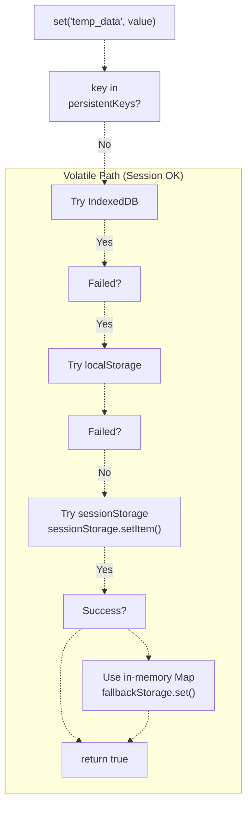

**Sources:** [js/utils/storage.js L676-L721](https://github.com/sallowayma-git/IELTS-practice/blob/92f64eb8/js/utils/storage.js#L676-L721)

---

## Read Path & Backend Selection

Reads follow a priority order optimized for speed: in-memory → IndexedDB → localStorage → sessionStorage.

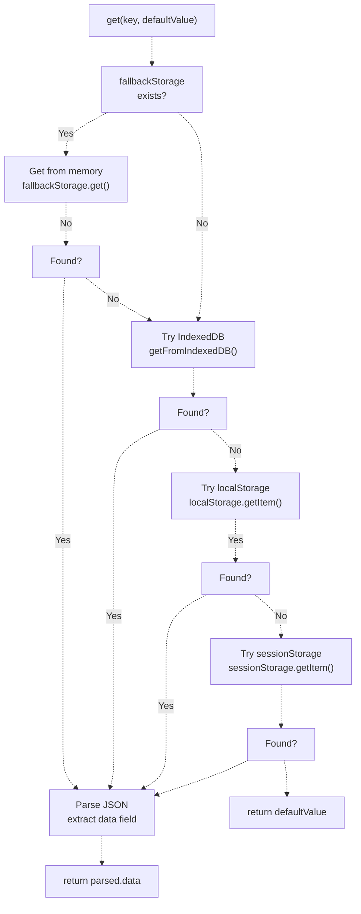

**Data Envelope Format:** All stored values are wrapped in a metadata envelope [js/utils/storage.js L625-L630](https://github.com/sallowayma-git/IELTS-practice/blob/92f64eb8/js/utils/storage.js#L625-L630)

:

```yaml
{
    data: compressedValue,
    timestamp: Date.now(),
    version: this.version,
    compressed: compressedValue !== value
}
```

**Sources:** [js/utils/storage.js L796-L853](https://github.com/sallowayma-git/IELTS-practice/blob/92f64eb8/js/utils/storage.js#L796-L853)

---

## Repository Abstraction Layer

The repository layer provides structured access patterns and transaction support. `ScoreStorage` uses repositories instead of accessing `StorageManager` directly.

### Repository Structure

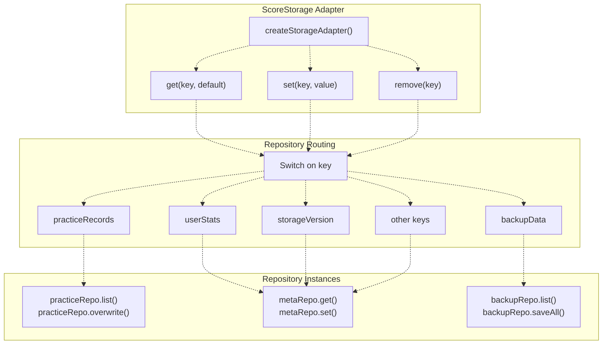

**ScoreStorage Adapter Implementation:** [js/core/scoreStorage.js L286-L353](https://github.com/sallowayma-git/IELTS-practice/blob/92f64eb8/js/core/scoreStorage.js#L286-L353)

The adapter translates between `ScoreStorage`'s key-based API and the repository pattern:

| Key | Repository | Operation Mapping |
| --- | --- | --- |
| `practiceRecords` | `PracticeRepository` | `get` → `list()`, `set` → `overwrite()` |
| `userStats` | `MetaRepository` | `get` → `get('user_stats')`, `set` → `set('user_stats')` |
| `storageVersion` | `MetaRepository` | Direct pass-through |
| `backupData` / `manual_backups` | `BackupRepository` | `get` → `list()`, `set` → `saveAll()` |
| Other keys | `MetaRepository` | Direct pass-through |

**Sources:** [js/core/scoreStorage.js L286-L353](https://github.com/sallowayma-git/IELTS-practice/blob/92f64eb8/js/core/scoreStorage.js#L286-L353)

### Repository Initialization

Repositories are initialized separately from `StorageManager` and must be available before `ScoreStorage` construction:

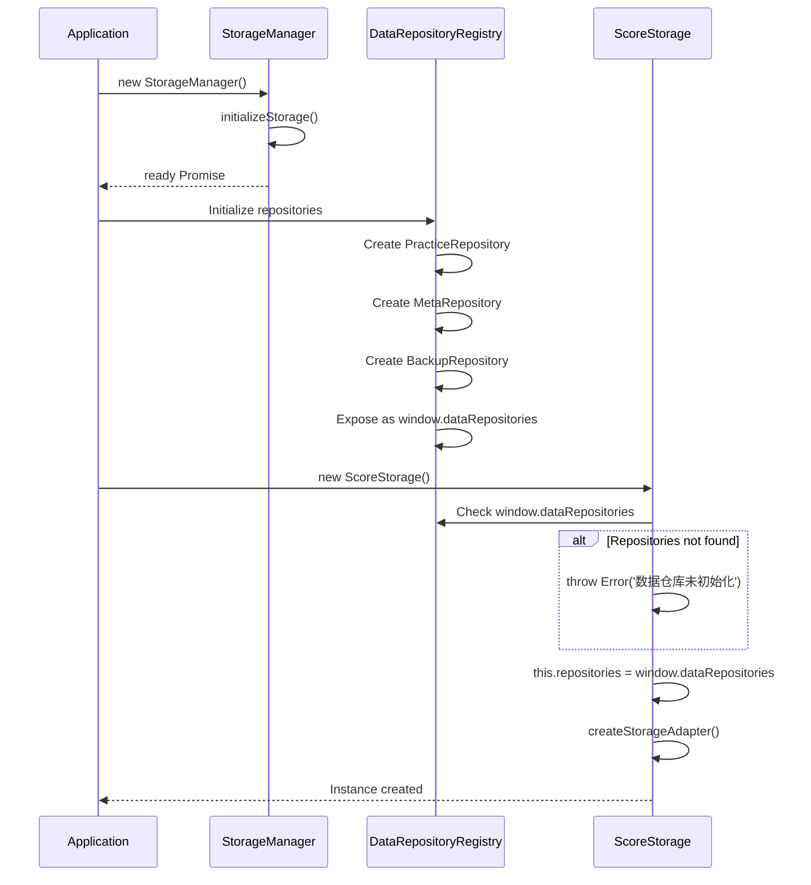

**Sources:** [js/core/scoreStorage.js L6-L34](https://github.com/sallowayma-git/IELTS-practice/blob/92f64eb8/js/core/scoreStorage.js#L6-L34)

 [js/core/practiceRecorder.js L16-L23](https://github.com/sallowayma-git/IELTS-practice/blob/92f64eb8/js/core/practiceRecorder.js#L16-L23)

---

## Quota Management & Data Compression

The storage system actively manages quota to prevent `QuotaExceededError` and ensure writes succeed.

### Quota Checking Flow

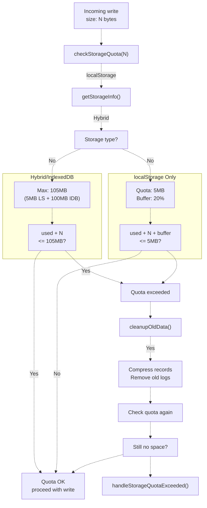

**Sources:** [js/utils/storage.js L955-L1000](https://github.com/sallowayma-git/IELTS-practice/blob/92f64eb8/js/utils/storage.js#L955-L1000)

 [js/utils/storage.js L1111-L1157](https://github.com/sallowayma-git/IELTS-practice/blob/92f64eb8/js/utils/storage.js#L1111-L1157)

### Data Compression Strategy

Large objects (>1000 bytes) are compressed by removing non-essential fields [js/utils/storage.js L470-L589](https://github.com/sallowayma-git/IELTS-practice/blob/92f64eb8/js/utils/storage.js#L470-L589)

:

**Compression Rules:**

* **Arrays**: Never compressed (preserves list integrity)
* **Objects >1000 bytes**: Core fields only, compress `realData`
* **Core Fields Retained**: `id`, `examId`, `title`, `score`, `accuracy`, `duration`, timestamps
* **realData Compression**: Keep latest answers, trim interactions to last 50

**Sources:** [js/utils/storage.js L470-L589](https://github.com/sallowayma-git/IELTS-practice/blob/92f64eb8/js/utils/storage.js#L470-L589)

---

## Backend Preference System

The system remembers which backend is working and prioritizes it on subsequent operations.

```css
#mermaid-r8kcl8tfz1{font-family:ui-sans-serif,-apple-system,system-ui,Segoe UI,Helvetica;font-size:16px;fill:#333;}@keyframes edge-animation-frame{from{stroke-dashoffset:0;}}@keyframes dash{to{stroke-dashoffset:0;}}#mermaid-r8kcl8tfz1 .edge-animation-slow{stroke-dasharray:9,5!important;stroke-dashoffset:900;animation:dash 50s linear infinite;stroke-linecap:round;}#mermaid-r8kcl8tfz1 .edge-animation-fast{stroke-dasharray:9,5!important;stroke-dashoffset:900;animation:dash 20s linear infinite;stroke-linecap:round;}#mermaid-r8kcl8tfz1 .error-icon{fill:#dddddd;}#mermaid-r8kcl8tfz1 .error-text{fill:#222222;stroke:#222222;}#mermaid-r8kcl8tfz1 .edge-thickness-normal{stroke-width:1px;}#mermaid-r8kcl8tfz1 .edge-thickness-thick{stroke-width:3.5px;}#mermaid-r8kcl8tfz1 .edge-pattern-solid{stroke-dasharray:0;}#mermaid-r8kcl8tfz1 .edge-thickness-invisible{stroke-width:0;fill:none;}#mermaid-r8kcl8tfz1 .edge-pattern-dashed{stroke-dasharray:3;}#mermaid-r8kcl8tfz1 .edge-pattern-dotted{stroke-dasharray:2;}#mermaid-r8kcl8tfz1 .marker{fill:#999;stroke:#999;}#mermaid-r8kcl8tfz1 .marker.cross{stroke:#999;}#mermaid-r8kcl8tfz1 svg{font-family:ui-sans-serif,-apple-system,system-ui,Segoe UI,Helvetica;font-size:16px;}#mermaid-r8kcl8tfz1 p{margin:0;}#mermaid-r8kcl8tfz1 defs #statediagram-barbEnd{fill:#999;stroke:#999;}#mermaid-r8kcl8tfz1 g.stateGroup text{fill:#dddddd;stroke:none;font-size:10px;}#mermaid-r8kcl8tfz1 g.stateGroup text{fill:#333;stroke:none;font-size:10px;}#mermaid-r8kcl8tfz1 g.stateGroup .state-title{font-weight:bolder;fill:#333;}#mermaid-r8kcl8tfz1 g.stateGroup rect{fill:#ffffff;stroke:#dddddd;}#mermaid-r8kcl8tfz1 g.stateGroup line{stroke:#999;stroke-width:1;}#mermaid-r8kcl8tfz1 .transition{stroke:#999;stroke-width:1;fill:none;}#mermaid-r8kcl8tfz1 .stateGroup .composit{fill:#f4f4f4;border-bottom:1px;}#mermaid-r8kcl8tfz1 .stateGroup .alt-composit{fill:#e0e0e0;border-bottom:1px;}#mermaid-r8kcl8tfz1 .state-note{stroke:#e6d280;fill:#fff5ad;}#mermaid-r8kcl8tfz1 .state-note text{fill:#333;stroke:none;font-size:10px;}#mermaid-r8kcl8tfz1 .stateLabel .box{stroke:none;stroke-width:0;fill:#ffffff;opacity:0.5;}#mermaid-r8kcl8tfz1 .edgeLabel .label rect{fill:#ffffff;opacity:0.5;}#mermaid-r8kcl8tfz1 .edgeLabel{background-color:#ffffff;text-align:center;}#mermaid-r8kcl8tfz1 .edgeLabel p{background-color:#ffffff;}#mermaid-r8kcl8tfz1 .edgeLabel rect{opacity:0.5;background-color:#ffffff;fill:#ffffff;}#mermaid-r8kcl8tfz1 .edgeLabel .label text{fill:#333;}#mermaid-r8kcl8tfz1 .label div .edgeLabel{color:#333;}#mermaid-r8kcl8tfz1 .stateLabel text{fill:#333;font-size:10px;font-weight:bold;}#mermaid-r8kcl8tfz1 .node circle.state-start{fill:#999;stroke:#999;}#mermaid-r8kcl8tfz1 .node .fork-join{fill:#999;stroke:#999;}#mermaid-r8kcl8tfz1 .node circle.state-end{fill:#dddddd;stroke:#f4f4f4;stroke-width:1.5;}#mermaid-r8kcl8tfz1 .end-state-inner{fill:#f4f4f4;stroke-width:1.5;}#mermaid-r8kcl8tfz1 .node rect{fill:#ffffff;stroke:#dddddd;stroke-width:1px;}#mermaid-r8kcl8tfz1 .node polygon{fill:#ffffff;stroke:#dddddd;stroke-width:1px;}#mermaid-r8kcl8tfz1 #statediagram-barbEnd{fill:#999;}#mermaid-r8kcl8tfz1 .statediagram-cluster rect{fill:#ffffff;stroke:#dddddd;stroke-width:1px;}#mermaid-r8kcl8tfz1 .cluster-label,#mermaid-r8kcl8tfz1 .nodeLabel{color:#333;}#mermaid-r8kcl8tfz1 .statediagram-cluster rect.outer{rx:5px;ry:5px;}#mermaid-r8kcl8tfz1 .statediagram-state .divider{stroke:#dddddd;}#mermaid-r8kcl8tfz1 .statediagram-state .title-state{rx:5px;ry:5px;}#mermaid-r8kcl8tfz1 .statediagram-cluster.statediagram-cluster .inner{fill:#f4f4f4;}#mermaid-r8kcl8tfz1 .statediagram-cluster.statediagram-cluster-alt .inner{fill:#f8f8f8;}#mermaid-r8kcl8tfz1 .statediagram-cluster .inner{rx:0;ry:0;}#mermaid-r8kcl8tfz1 .statediagram-state rect.basic{rx:5px;ry:5px;}#mermaid-r8kcl8tfz1 .statediagram-state rect.divider{stroke-dasharray:10,10;fill:#f8f8f8;}#mermaid-r8kcl8tfz1 .note-edge{stroke-dasharray:5;}#mermaid-r8kcl8tfz1 .statediagram-note rect{fill:#fff5ad;stroke:#e6d280;stroke-width:1px;rx:0;ry:0;}#mermaid-r8kcl8tfz1 .statediagram-note rect{fill:#fff5ad;stroke:#e6d280;stroke-width:1px;rx:0;ry:0;}#mermaid-r8kcl8tfz1 .statediagram-note text{fill:#333;}#mermaid-r8kcl8tfz1 .statediagram-note .nodeLabel{color:#333;}#mermaid-r8kcl8tfz1 .statediagram .edgeLabel{color:red;}#mermaid-r8kcl8tfz1 #dependencyStart,#mermaid-r8kcl8tfz1 #dependencyEnd{fill:#999;stroke:#999;stroke-width:1;}#mermaid-r8kcl8tfz1 .statediagramTitleText{text-anchor:middle;font-size:18px;fill:#333;}#mermaid-r8kcl8tfz1 :root{--mermaid-font-family:"trebuchet ms",verdana,arial,sans-serif;}StorageManager initStored preference = 'local'Stored preference = 'session'No preference storedlocalStorage availableOnly sessionStorage availableIndexedDB + localStoragesessionStorage onlyWrite succeedsWrite failssetBackendPreference('local')Fallback to sessionStoragesetBackendPreference('session')CheckPreferenceLocalPreferredSessionPreferredAutoDetectUseHybridUseSessionWriteSuccessWriteFailSetLocalPrefTrySessionSetSessionPref
```

**Backend Preference Keys:** [js/utils/storage.js L12](https://github.com/sallowayma-git/IELTS-practice/blob/92f64eb8/js/utils/storage.js#L12-L12)

 [js/utils/storage.js L57-L87](https://github.com/sallowayma-git/IELTS-practice/blob/92f64eb8/js/utils/storage.js#L57-L87)

* Stored as: `exam_system_storage_backend`
* Values: `'local'` (IndexedDB+localStorage) or `'session'` (sessionStorage only)
* Checked on initialization and after each successful write

**Sources:** [js/utils/storage.js L12](https://github.com/sallowayma-git/IELTS-practice/blob/92f64eb8/js/utils/storage.js#L12-L12)

 [js/utils/storage.js L57-L87](https://github.com/sallowayma-git/IELTS-practice/blob/92f64eb8/js/utils/storage.js#L57-L87)

 [js/utils/storage.js L106-L113](https://github.com/sallowayma-git/IELTS-practice/blob/92f64eb8/js/utils/storage.js#L106-L113)

---

## Legacy Data Migration

The system performs one-time migrations to consolidate data from previous storage schemes.

### Migration Phases

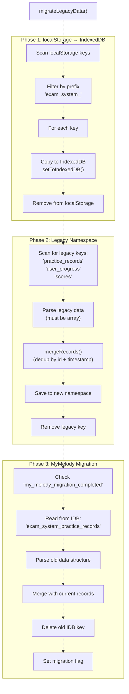

**Migration Flags:**

* `migration_completed`: Tracks localStorage → new namespace migration
* `my_melody_migration_completed`: Tracks old IndexedDB key migration

**Record Merging Logic:** [js/utils/storage.js L523-L541](https://github.com/sallowayma-git/IELTS-practice/blob/92f64eb8/js/utils/storage.js#L523-L541)

```javascript
mergeRecords(current, legacy) {
    const mergedMap = new Map();
    [...current, ...legacy].forEach(record => {
        if (record && record.id) {
            const existing = mergedMap.get(record.id);
            // Keep the record with newer timestamp
            if (!existing || (record.timestamp > existing.timestamp)) {
                mergedMap.set(record.id, record);
            }
        }
    });
    return Array.from(mergedMap.values())
        .sort((a, b) => (b.timestamp || 0) - (a.timestamp || 0));
}
```

**Sources:** [js/utils/storage.js L1163-L1283](https://github.com/sallowayma-git/IELTS-practice/blob/92f64eb8/js/utils/storage.js#L1163-L1283)

 [js/utils/storage.js L523-L541](https://github.com/sallowayma-git/IELTS-practice/blob/92f64eb8/js/utils/storage.js#L523-L541)

---

## Import/Export & Backup System

`DataBackupManager` handles data portability and backup restoration independently of the core storage layer.

### Export Architecture

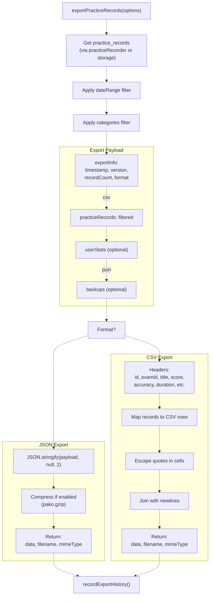

**Sources:** [js/utils/dataBackupManager.js L87-L213](https://github.com/sallowayma-git/IELTS-practice/blob/92f64eb8/js/utils/dataBackupManager.js#L87-L213)

### Import Architecture with Backup

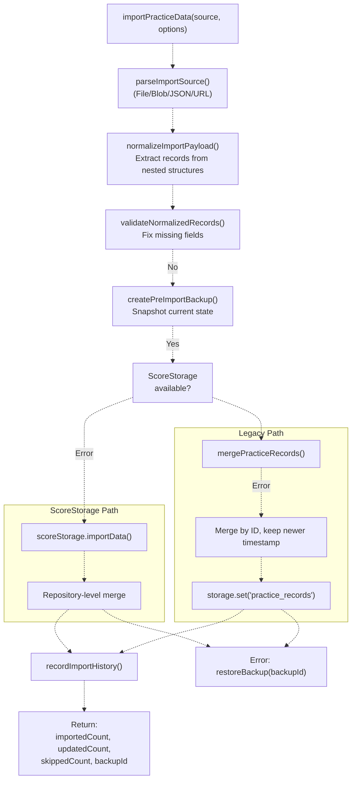

**Import Payload Normalization:** [js/utils/dataBackupManager.js L374-L491](https://github.com/sallowayma-git/IELTS-practice/blob/92f64eb8/js/utils/dataBackupManager.js#L374-L491)

The normalizer traverses arbitrary JSON structures to find arrays that look like practice records:

**Heuristics:**

1. Check common paths: `practiceRecords`, `data.practice_records`, `data.exam_system_practice_records.data`
2. Traverse all object properties recursively
3. Detect record arrays using `looksLikePracticeRecord()` on sample items
4. Extract and deduplicate by ID
5. Also extract `userStats` if found

**Sources:** [js/utils/dataBackupManager.js L217-L327](https://github.com/sallowayma-git/IELTS-practice/blob/92f64eb8/js/utils/dataBackupManager.js#L217-L327)

 [js/utils/dataBackupManager.js L374-L491](https://github.com/sallowayma-git/IELTS-practice/blob/92f64eb8/js/utils/dataBackupManager.js#L374-L491)

 [js/utils/dataBackupManager.js L642-L712](https://github.com/sallowayma-git/IELTS-practice/blob/92f64eb8/js/utils/dataBackupManager.js#L642-L712)

---

## Storage Monitoring & Maintenance

The storage system includes automatic monitoring and cleanup to maintain health.

### Periodic Monitoring

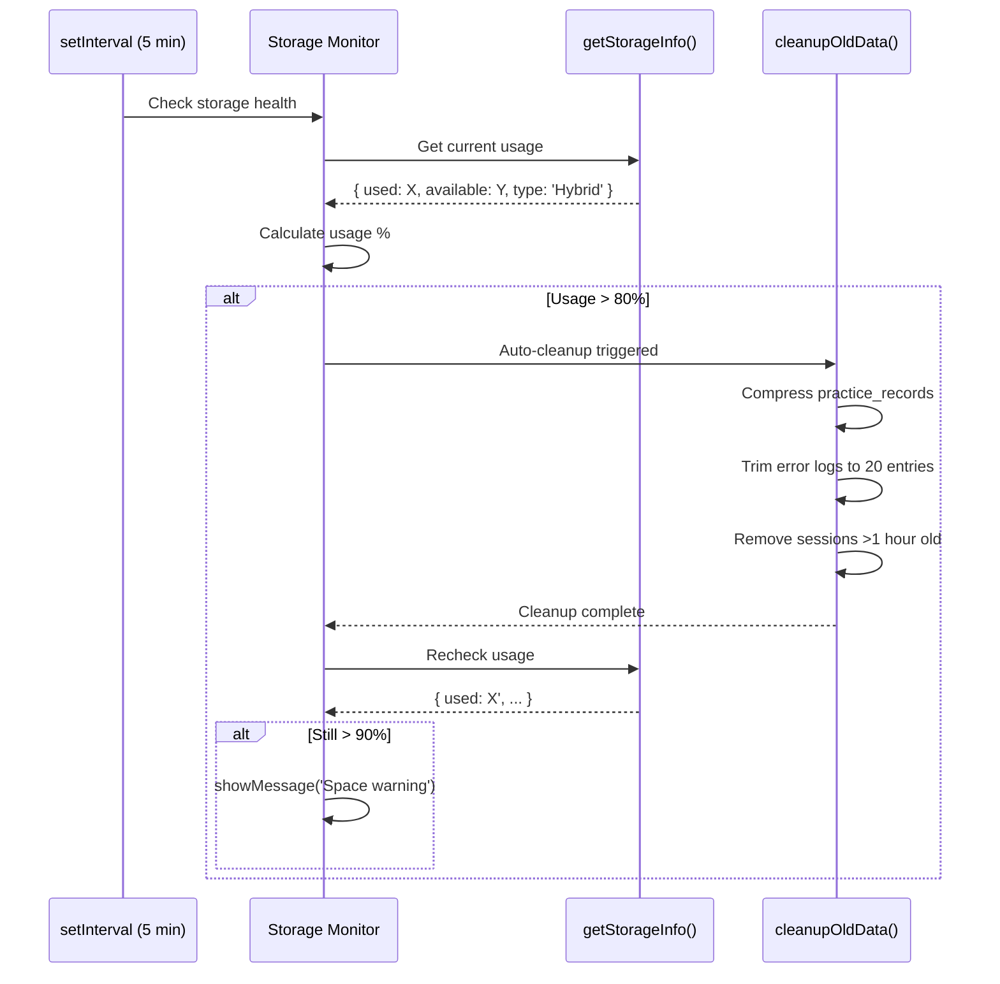

**Monitoring Setup:** [js/utils/storage.js L1532-L1588](https://github.com/sallowayma-git/IELTS-practice/blob/92f64eb8/js/utils/storage.js#L1532-L1588)

**Cleanup Operations:** [js/utils/storage.js L1111-L1157](https://github.com/sallowayma-git/IELTS-practice/blob/92f64eb8/js/utils/storage.js#L1111-L1157)

1. Compress all `practice_records` using `compressObject()`
2. Trim `injection_errors` to last 20 entries
3. Trim `collection_errors` to last 20 entries
4. Remove `active_sessions` older than 1 hour

**Sources:** [js/utils/storage.js L1111-L1157](https://github.com/sallowayma-git/IELTS-practice/blob/92f64eb8/js/utils/storage.js#L1111-L1157)

 [js/utils/storage.js L1532-L1588](https://github.com/sallowayma-git/IELTS-practice/blob/92f64eb8/js/utils/storage.js#L1532-L1588)

---

## Error Handling & Resilience

The storage system implements multiple layers of resilience to ensure data is never lost.

### Error Recovery Strategy

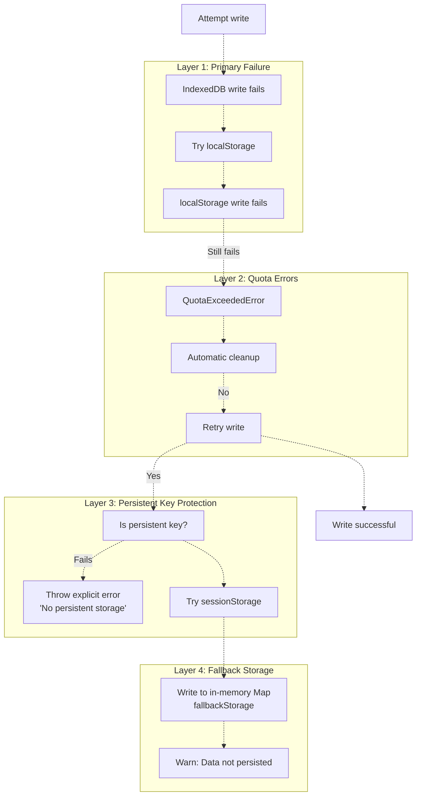

**Error Handlers:** [js/utils/storage.js L1329-L1362](https://github.com/sallowayma-git/IELTS-practice/blob/92f64eb8/js/utils/storage.js#L1329-L1362)

**Resilience Features:**

* **Multi-backend fallback**: Automatic cascade through all available backends
* **Quota-aware**: Auto-cleanup before reporting quota errors
* **Persistent key protection**: Refuse to use volatile storage for critical keys
* **In-memory safety net**: Always accepts writes even if all backends fail
* **Event dispatching**: Fires `storageQuotaExceeded` and `storageError` events for UI handling

**Sources:** [js/utils/storage.js L716-L721](https://github.com/sallowayma-git/IELTS-practice/blob/92f64eb8/js/utils/storage.js#L716-L721)

 [js/utils/storage.js L1329-L1362](https://github.com/sallowayma-git/IELTS-practice/blob/92f64eb8/js/utils/storage.js#L1329-L1362)

---

## Integration with ScoreStorage

`ScoreStorage` sits atop the repository layer and adds domain-specific logic for practice records.

### ScoreStorage Responsibilities

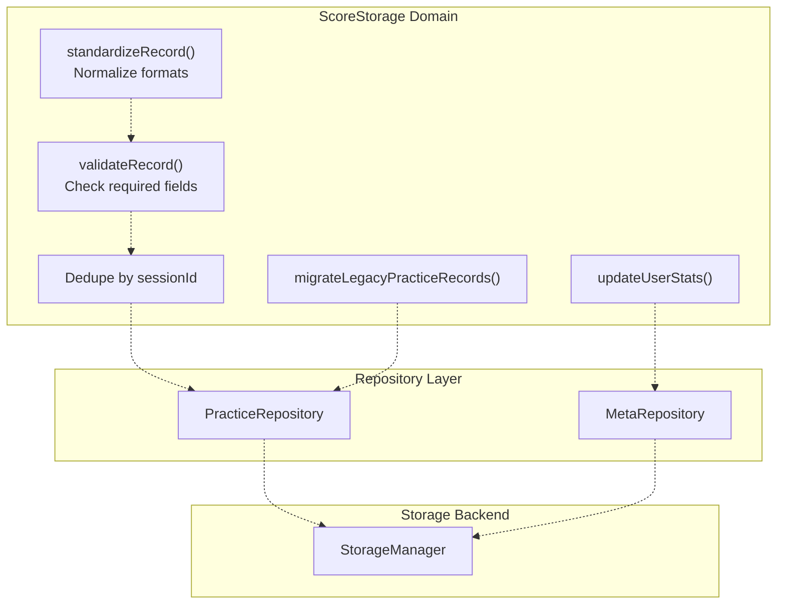

**Key Operations:**

| Operation | ScoreStorage Method | Backend Flow |
| --- | --- | --- |
| **Save Record** | `savePracticeRecord()` | Standardize → Validate → Dedupe → `practiceRepo.overwrite()` |
| **Load Records** | `storage.get('practiceRecords')` | `practiceRepo.list()` → StorageManager |
| **Update Stats** | `updateUserStats()` | Calculate → `metaRepo.set('user_stats')` |
| **Backup** | `createBackup()` | Export → `backupRepo.saveAll()` |
| **Version Check** | `checkStorageVersion()` | `metaRepo.get('storage_version')` → Compare → Migrate |

**Sources:** [js/core/scoreStorage.js L571-L685](https://github.com/sallowayma-git/IELTS-practice/blob/92f64eb8/js/core/scoreStorage.js#L571-L685)

 [js/core/scoreStorage.js L788-L933](https://github.com/sallowayma-git/IELTS-practice/blob/92f64eb8/js/core/scoreStorage.js#L788-L933)

 [js/core/scoreStorage.js L1121-L1154](https://github.com/sallowayma-git/IELTS-practice/blob/92f64eb8/js/core/scoreStorage.js#L1121-L1154)

### Record Standardization Pipeline

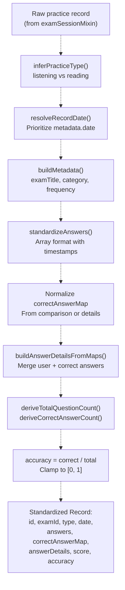

**Sources:** [js/core/scoreStorage.js L49-L128](https://github.com/sallowayma-git/IELTS-practice/blob/92f64eb8/js/core/scoreStorage.js#L49-L128)

 [js/core/scoreStorage.js L788-L933](https://github.com/sallowayma-git/IELTS-practice/blob/92f64eb8/js/core/scoreStorage.js#L788-L933)

 [js/core/scoreStorage.js L938-L958](https://github.com/sallowayma-git/IELTS-practice/blob/92f64eb8/js/core/scoreStorage.js#L938-L958)

---

## Summary: Key Takeaways

1. **Multi-Tier Backend**: IndexedDB (primary, 100MB+) → localStorage (mirror/fallback, 5MB) → sessionStorage (volatile) → in-memory Map (last resort)
2. **Repository Abstraction**: `ScoreStorage` uses repositories (`PracticeRepository`, `MetaRepository`, `BackupRepository`) instead of direct `StorageManager` access, enabling transactional operations and structured access patterns.
3. **Persistent Key Protection**: Critical keys like `practice_records` will **never** use volatile storage. Writes fail explicitly if no persistent backend is available.
4. **Automatic Fallback**: Reads cascade through all backends until data is found. Writes attempt all backends and succeed if at least one works (for persistent keys, at least one durable backend required).
5. **Quota Management**: Automatic monitoring every 5 minutes, auto-cleanup at 80% usage, compression for large objects, explicit errors at 90%+ usage.
6. **Legacy Migration**: One-time migrations consolidate data from old namespaces, deduplicate by ID + timestamp, preserve all data.
7. **Import/Export**: `DataBackupManager` operates independently, supports JSON/CSV formats, creates pre-import backups automatically, restores on import failure.
8. **Resilience**: In-memory fallback ensures writes always succeed, though data may not persist. UI events (`storageQuotaExceeded`, `storageError`) enable graceful degradation.

**Sources:** [js/utils/storage.js L1-L2089](https://github.com/sallowayma-git/IELTS-practice/blob/92f64eb8/js/utils/storage.js#L1-L2089)

 [js/core/scoreStorage.js L1-L1590](https://github.com/sallowayma-git/IELTS-practice/blob/92f64eb8/js/core/scoreStorage.js#L1-L1590)

 [js/utils/dataBackupManager.js L1-L1347](https://github.com/sallowayma-git/IELTS-practice/blob/92f64eb8/js/utils/dataBackupManager.js#L1-L1347)

 [js/core/practiceRecorder.js L1-L1500](https://github.com/sallowayma-git/IELTS-practice/blob/92f64eb8/js/core/practiceRecorder.js#L1-L1500)