# Repository Architecture & Data Layer

> **Relevant source files**
> * [js/core/practiceRecorder.js](https://github.com/sallowayma-git/IELTS-practice/blob/68771116/js/core/practiceRecorder.js)
> * [js/core/scoreStorage.js](https://github.com/sallowayma-git/IELTS-practice/blob/68771116/js/core/scoreStorage.js)
> * [js/utils/logger.js](https://github.com/sallowayma-git/IELTS-practice/blob/68771116/js/utils/logger.js)

This document covers the repository pattern implementation that abstracts data persistence operations. The repository layer sits between application components and the storage backend, providing a unified API for practice records, settings, backups, and metadata management with transaction support and consistency validation.

For information about data backup and import/export operations, see [Data Backup & Import/Export](/sallowayma-git/IELTS-practice/4.2-data-backup-and-importexport). For details about data validation and integrity checking, see [Data Integrity & Quality Management](/sallowayma-git/IELTS-practice/4.3-data-normalization-and-quality). For information about the underlying storage backend, see the StorageManager implementation in `js/utils/storage.js`.

## Repository Pattern Architecture

The repository pattern provides a clean abstraction layer that separates data access logic from business logic. Application components interact with repositories instead of directly accessing storage APIs.

**Title:** Repository Layer Architecture

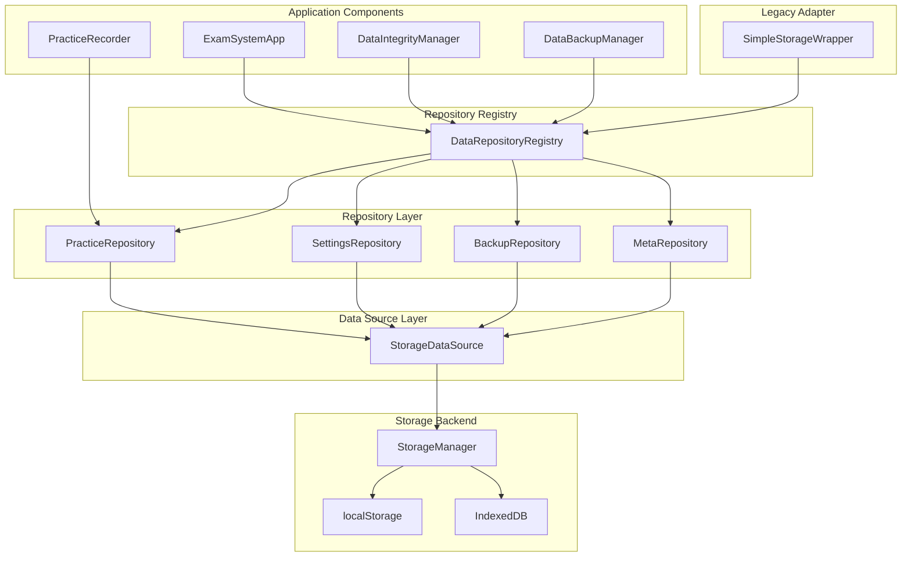

Sources: [js/data/index.js L1-L119](https://github.com/sallowayma-git/IELTS-practice/blob/68771116/js/data/index.js#L1-L119)

 [js/data/repositories/dataRepositoryRegistry.js L1-L150](https://github.com/sallowayma-git/IELTS-practice/blob/68771116/js/data/repositories/dataRepositoryRegistry.js#L1-L150)

 [js/data/dataSources/storageDataSource.js L1-L80](https://github.com/sallowayma-git/IELTS-practice/blob/68771116/js/data/dataSources/storageDataSource.js#L1-L80)

 [js/utils/simpleStorageWrapper.js L1-L65](https://github.com/sallowayma-git/IELTS-practice/blob/68771116/js/utils/simpleStorageWrapper.js#L1-L65)

## DataRepositoryRegistry

The `DataRepositoryRegistry` class serves as the central coordinator for all repositories, providing dependency injection, transaction management, and consistency checking.

**Title:** Repository Registration and Initialization

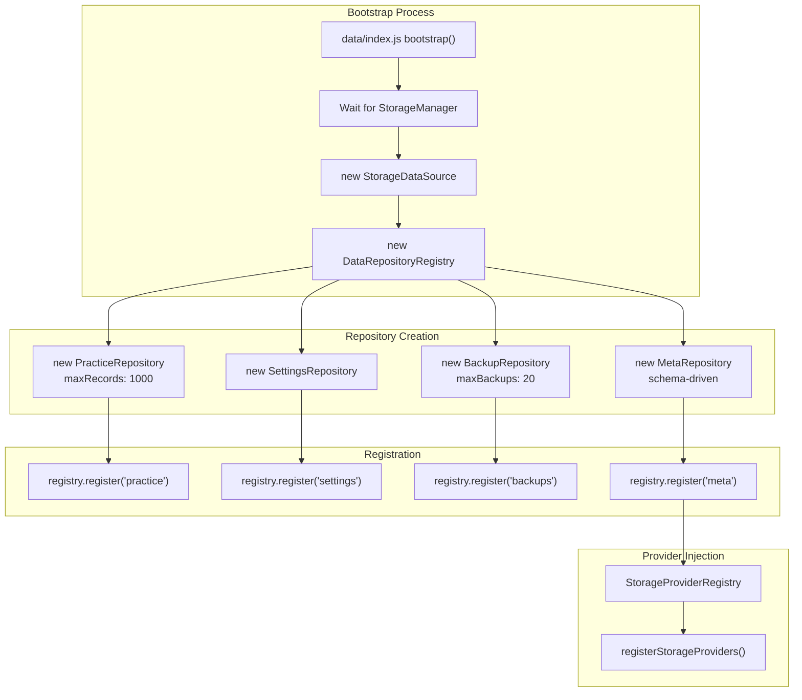

Sources: [js/data/index.js L20-L118](https://github.com/sallowayma-git/IELTS-practice/blob/68771116/js/data/index.js#L20-L118)

 [js/data/repositories/dataRepositoryRegistry.js L1-L150](https://github.com/sallowayma-git/IELTS-practice/blob/68771116/js/data/repositories/dataRepositoryRegistry.js#L1-L150)

 [js/core/storageProviderRegistry.js L1-L71](https://github.com/sallowayma-git/IELTS-practice/blob/68771116/js/core/storageProviderRegistry.js#L1-L71)

### Registry API

| Method | Purpose | Return Type |
| --- | --- | --- |
| `register(name, repository)` | Register a repository instance | void |
| `get(name)` | Retrieve a registered repository | Repository instance |
| `transaction(names, handler)` | Execute operations atomically | Promise<any> |
| `runConsistencyChecks(names)` | Validate data integrity across repositories | Promise<Report> |

Sources: [js/data/repositories/dataRepositoryRegistry.js L15-L80](https://github.com/sallowayma-git/IELTS-practice/blob/68771116/js/data/repositories/dataRepositoryRegistry.js#L15-L80)

## StorageDataSource

The `StorageDataSource` class provides the abstraction layer connecting repositories to the underlying `StorageManager`. It wraps all storage operations in async interfaces and handles namespacing.

**Title:** StorageDataSource Operations

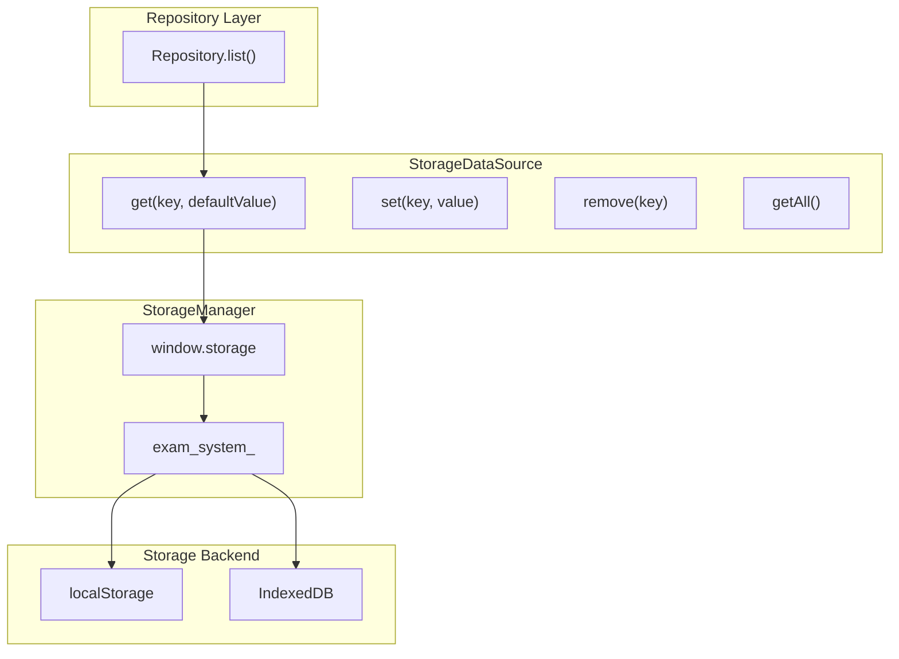

Sources: [js/data/dataSources/storageDataSource.js L1-L80](https://github.com/sallowayma-git/IELTS-practice/blob/68771116/js/data/dataSources/storageDataSource.js#L1-L80)

### Storage Operations

| Method | Parameters | Description |
| --- | --- | --- |
| `get(key, defaultValue)` | key: string, defaultValue: any | Retrieves value with fallback |
| `set(key, value)` | key: string, value: any | Stores value asynchronously |
| `remove(key)` | key: string | Removes key from storage |
| `getAll()` | none | Returns all keys in namespace |

All operations return Promises and handle storage errors gracefully by falling back to in-memory storage when necessary.

Sources: [js/data/dataSources/storageDataSource.js L15-L75](https://github.com/sallowayma-git/IELTS-practice/blob/68771116/js/data/dataSources/storageDataSource.js#L15-L75)

## Individual Repositories

### BaseRepository

The `BaseRepository` class provides common functionality inherited by all specialized repositories.

**Title:** BaseRepository Common Operations

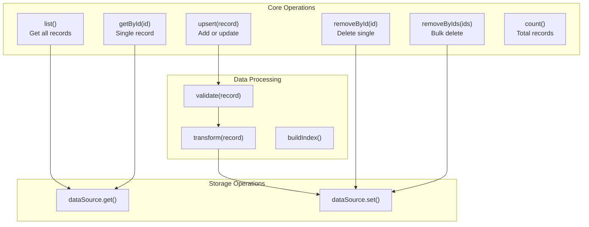

Sources: [js/data/repositories/baseRepository.js L1-L200](https://github.com/sallowayma-git/IELTS-practice/blob/68771116/js/data/repositories/baseRepository.js#L1-L200)

### PracticeRepository

The `PracticeRepository` manages practice records with a maximum limit of 1000 records. When the limit is exceeded, the oldest records are automatically pruned.

**Title:** PracticeRepository Record Management

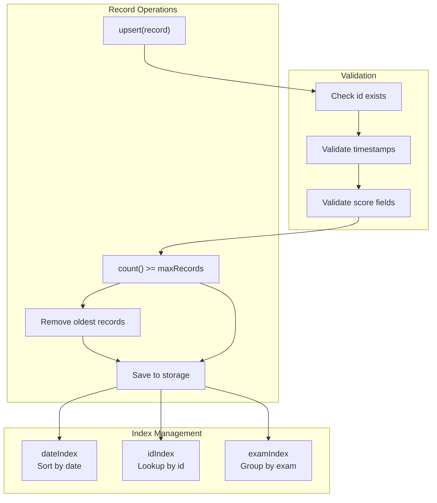

Key configuration:

* `maxRecords`: 1000 (enforced at write time)
* `storageKey`: 'practice_records'
* Automatic pruning of oldest records
* Maintains sorted date index for efficient queries

Sources: [js/data/repositories/practiceRepository.js L1-L250](https://github.com/sallowayma-git/IELTS-practice/blob/68771116/js/data/repositories/practiceRepository.js#L1-L250)

### SettingsRepository

The `SettingsRepository` manages user settings with key-value storage and default value support.

**Title:** SettingsRepository Key-Value Operations

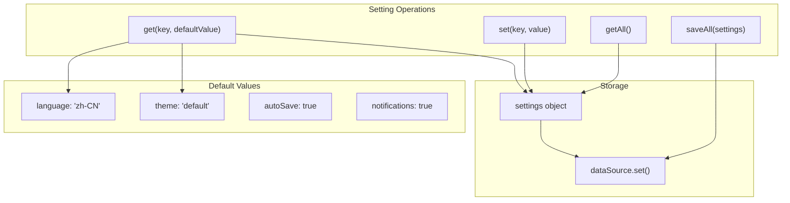

Sources: [js/data/repositories/settingsRepository.js L1-L150](https://github.com/sallowayma-git/IELTS-practice/blob/68771116/js/data/repositories/settingsRepository.js#L1-L150)

### BackupRepository

The `BackupRepository` manages backup snapshots with automatic pruning when the maximum of 20 backups is exceeded.

**Title:** BackupRepository Lifecycle

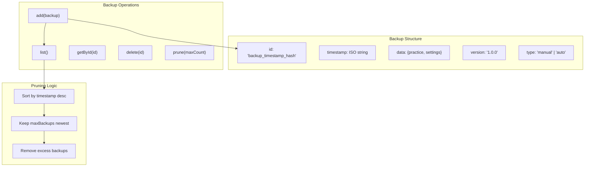

Key features:

* `maxBackups`: 20 (configured at construction)
* `storageKey`: 'data_backups'
* Automatic pruning of oldest backups
* Supports manual and automatic backup types

Sources: [js/data/repositories/backupRepository.js L1-L180](https://github.com/sallowayma-git/IELTS-practice/blob/68771116/js/data/repositories/backupRepository.js#L1-L180)

### MetaRepository

The `MetaRepository` provides schema-driven storage with per-key validation and default value generation.

**Title:** MetaRepository Schema System

```mermaid
flowchart TD

Set["set(key, value)"]
Validate["Run validators"]
UpdateCache["Update cache"]
Persist["Persist to storage"]
Get["get(key, defaultValue)"]
CheckCache["Check in-memory cache"]
FetchStorage["Fetch from storage"]
ApplyDefault["Apply defaultValue()"]
RunValidators["Run validators"]
CloneValue["Clone if configured"]
Return["Return value"]
Key["Key: 'user_stats'"]
Default["defaultValue: function"]
Validators["validators: array"]
Clone["cloneOnRead: boolean"]

subgraph subGraph2 ["Write Operation"]
    Set
    Validate
    UpdateCache
    Persist
    Set --> Validate
    Validate --> UpdateCache
    UpdateCache --> Persist
end

subgraph subGraph1 ["Read Operation"]
    Get
    CheckCache
    FetchStorage
    ApplyDefault
    RunValidators
    CloneValue
    Return
    Get --> CheckCache
    CheckCache --> FetchStorage
    FetchStorage --> ApplyDefault
    ApplyDefault --> RunValidators
    RunValidators --> CloneValue
    CloneValue --> Return
end

subgraph subGraph0 ["Schema Definition"]
    Key
    Default
    Validators
    Clone
    Key --> Default
    Key --> Validators
    Key --> Clone
end
```

Predefined schemas (from [js/data/index.js L36-L82](https://github.com/sallowayma-git/IELTS-practice/blob/68771116/js/data/index.js#L36-L82)

):

| Key | Default Value | Validators | Clone on Read |
| --- | --- | --- | --- |
| `user_stats` | `createDefaultUserStats()` | Must be object | Yes |
| `storage_version` | `null` | String or null | No |
| `data_restored` | `false` | Must be boolean | No |
| `active_sessions` | `[]` | Must be array | Yes |
| `temp_practice_records` | `[]` | Must be array | Yes |
| `interrupted_records` | `[]` | Must be array | Yes |
| `exam_index` | `[]` | Must be array | Yes |

Sources: [js/data/repositories/metaRepository.js L1-L200](https://github.com/sallowayma-git/IELTS-practice/blob/68771116/js/data/repositories/metaRepository.js#L1-L200)

 [js/data/index.js L3-L82](https://github.com/sallowayma-git/IELTS-practice/blob/68771116/js/data/index.js#L3-L82)

## Transaction Support

The `DataRepositoryRegistry` provides transaction support for atomic operations across multiple repositories.

**Title:** Repository Transaction Flow

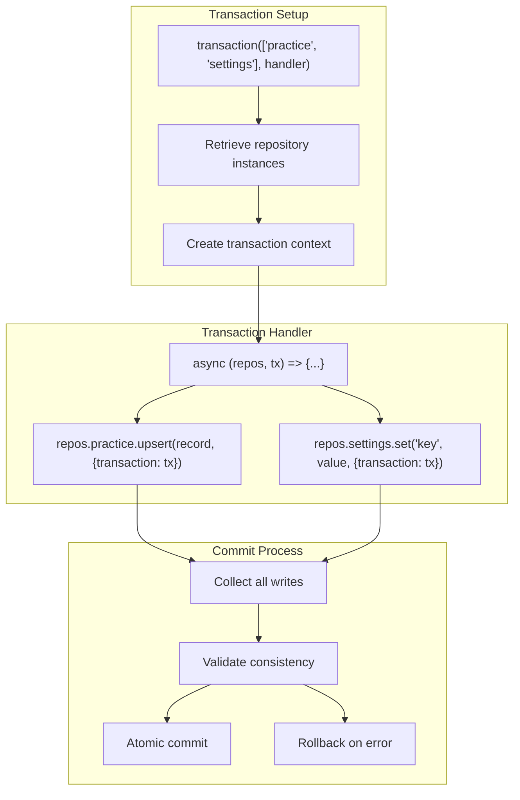

Example transaction usage:

```javascript
await registry.transaction(['practice', 'settings'], async (repos, tx) => {
    // All operations use the same transaction context
    await repos.practice.upsert(record, { transaction: tx });
    await repos.settings.set('last_practice_date', new Date().toISOString(), { transaction: tx });
    // If any operation fails, entire transaction rolls back
});
```

Sources: [js/data/repositories/dataRepositoryRegistry.js L85-L130](https://github.com/sallowayma-git/IELTS-practice/blob/68771116/js/data/repositories/dataRepositoryRegistry.js#L85-L130)

## Consistency Checking

The `DataRepositoryRegistry` provides automated consistency checking across all registered repositories.

**Title:** Consistency Check Process

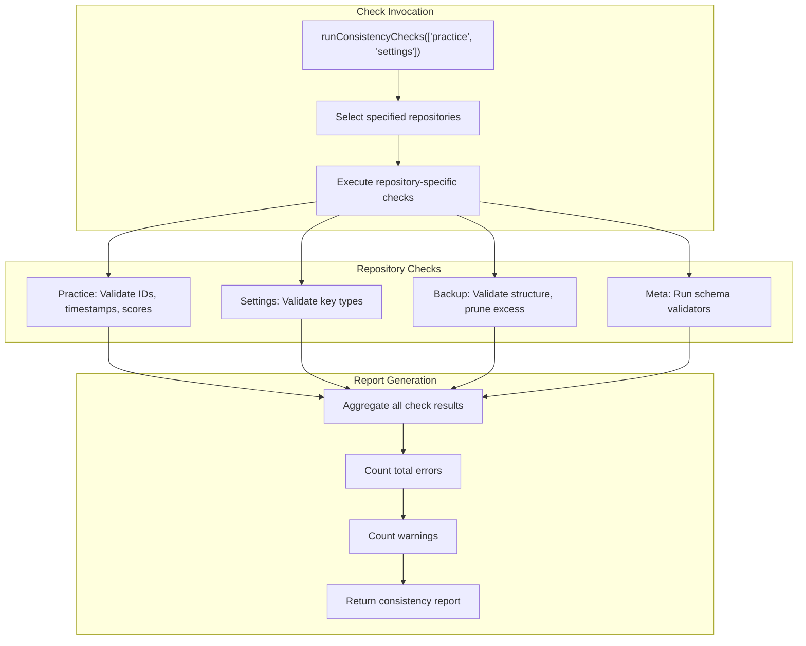

Consistency report structure:

```yaml
{
    timestamp: "2025-01-15T10:30:00.000Z",
    repositories: {
        practice: {
            totalRecords: 450,
            errors: [],
            warnings: ["Record 123 missing duration field"]
        },
        settings: {
            errors: [],
            warnings: []
        }
    },
    summary: {
        totalErrors: 0,
        totalWarnings: 1
    }
}
```

Sources: [js/data/repositories/dataRepositoryRegistry.js L135-L150](https://github.com/sallowayma-git/IELTS-practice/blob/68771116/js/data/repositories/dataRepositoryRegistry.js#L135-L150)

 [js/components/DataIntegrityManager.js L66-L87](https://github.com/sallowayma-git/IELTS-practice/blob/68771116/js/components/DataIntegrityManager.js#L66-L87)

## SimpleStorageWrapper: Legacy Adapter

The `SimpleStorageWrapper` class provides a legacy-compatible API that wraps repository operations, allowing older code to use the repository pattern without modification.

**Title:** SimpleStorageWrapper Adapter Pattern

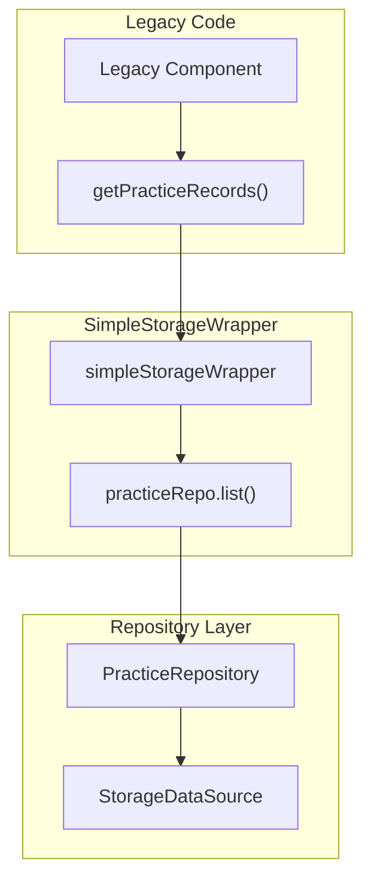

Key method mappings:

| Legacy Method | Repository Operation | Target Repository |
| --- | --- | --- |
| `getPracticeRecords()` | `practiceRepo.list()` | PracticeRepository |
| `savePracticeRecords(records)` | `practiceRepo.overwrite(records)` | PracticeRepository |
| `addPracticeRecord(record)` | `practiceRepo.upsert(record)` | PracticeRepository |
| `getById(id)` | `practiceRepo.getById(id)` | PracticeRepository |
| `update(id, updates)` | `practiceRepo.update(id, updates)` | PracticeRepository |
| `delete(id)` | `practiceRepo.removeById(id)` | PracticeRepository |
| `deletePracticeRecords(ids)` | `practiceRepo.removeByIds(ids)` | PracticeRepository |
| `getUserSettings()` | `settingsRepo.getAll()` | SettingsRepository |
| `saveUserSettings(settings)` | `settingsRepo.saveAll(settings)` | SettingsRepository |
| `getUserSetting(key, default)` | `settingsRepo.get(key, default)` | SettingsRepository |
| `setUserSetting(key, value)` | `settingsRepo.set(key, value)` | SettingsRepository |
| `get(key, default)` | `metaRepo.get(key, default)` | MetaRepository |
| `set(key, value)` | `metaRepo.set(key, value)` | MetaRepository |

Sources: [js/utils/simpleStorageWrapper.js L1-L65](https://github.com/sallowayma-git/IELTS-practice/blob/68771116/js/utils/simpleStorageWrapper.js#L1-L65)

## Error Handling and Recovery

The storage system implements comprehensive error handling with automatic recovery mechanisms.

### Error Recovery Flow

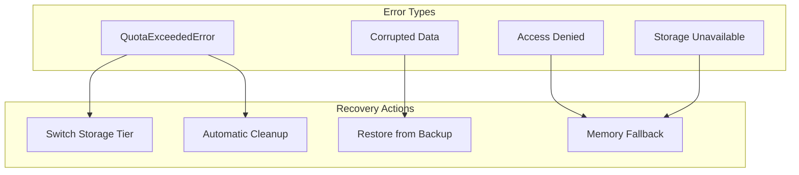

Sources: [js/utils/storage.js L1036-L1070](https://github.com/sallowayma-git/IELTS-practice/blob/68771116/js/utils/storage.js#L1036-L1070)

 [js/utils/storage.js L1053-L1070](https://github.com/sallowayma-git/IELTS-practice/blob/68771116/js/utils/storage.js#L1053-L1070)