# Suite Practice Mode

> **Relevant source files**
> * [js/app/examSessionMixin.js](https://github.com/sallowayma-git/IELTS-practice/blob/92f64eb8/js/app/examSessionMixin.js)
> * [js/app/suitePracticeMixin.js](https://github.com/sallowayma-git/IELTS-practice/blob/92f64eb8/js/app/suitePracticeMixin.js)
> * [js/practice-page-enhancer.js](https://github.com/sallowayma-git/IELTS-practice/blob/92f64eb8/js/practice-page-enhancer.js)
> * [js/services/GlobalStateService.js](https://github.com/sallowayma-git/IELTS-practice/blob/92f64eb8/js/services/GlobalStateService.js)
> * [js/utils/answerComparisonUtils.js](https://github.com/sallowayma-git/IELTS-practice/blob/92f64eb8/js/utils/answerComparisonUtils.js)

## Purpose and Scope

This document describes the suite practice mode system, which enables users to practice multiple IELTS exams in sequence or as a batch. The system supports two distinct modes:

1. **Sequential Suite Mode**: Automatically opens P1, P2, P3 reading exams one after another in the same window/tab
2. **Multi-Suite Mode**: Handles HTML pages containing multiple test sets on a single page (e.g., "100 Listening P1" pages with 10 practice tests)

For information about single exam practice sessions, see [Practice Session Lifecycle & Management](/sallowayma-git/IELTS-practice/5.1-practice-session-lifecycle-and-management). For cross-window communication protocols, see [Cross-Window Communication Protocol](/sallowayma-git/IELTS-practice/5.3-cross-window-communication-protocol).

---

## Suite Practice Concepts

### Sequential Suite Mode

Sequential suite mode randomly selects one exam from each category (P1, P2, P3) and presents them in sequence within a single browser tab. After completing each exam, the window navigates to the next exam automatically.

**Key characteristics:**

* One window reused across all three exams
* Sequential progression: P1 → P2 → P3
* Automatic navigation between exams
* Single aggregated record saved at completion
* Window close guards prevent accidental exit

### Multi-Suite Mode

Multi-suite mode handles HTML pages that contain multiple complete practice tests on a single page. Each test is called a "suite" and has its own set of questions with a dedicated submit button.

**Key characteristics:**

* Multiple independent test sets on one HTML page
* Each suite submits separately via `PRACTICE_COMPLETE` message
* Results aggregated when all suites complete
* Suite ID used to distinguish and track each test
* Common in "100 Listening" practice pages

**Sources:** [js/app/suitePracticeMixin.js L1-L1344](https://github.com/sallowayma-git/IELTS-practice/blob/92f64eb8/js/app/suitePracticeMixin.js#L1-L1344)

---

## Suite Practice Data Structures

### Sequential Suite Session

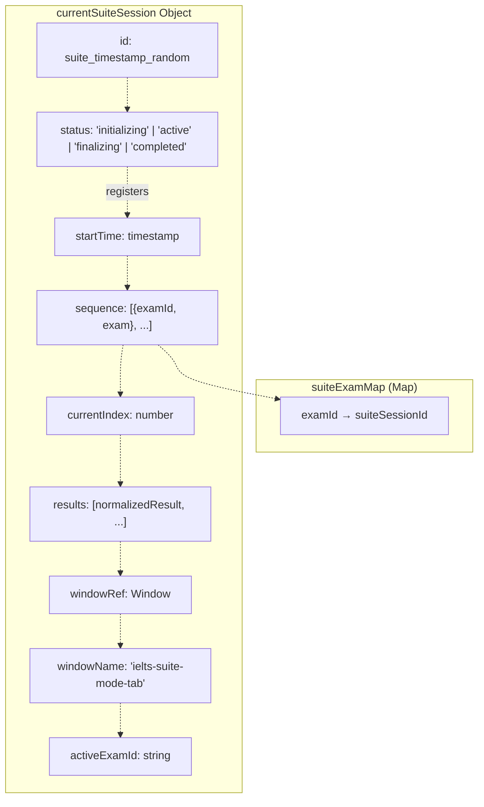

**Sources:** [js/app/suitePracticeMixin.js L78-L89](https://github.com/sallowayma-git/IELTS-practice/blob/92f64eb8/js/app/suitePracticeMixin.js#L78-L89)

 [js/app/suitePracticeMixin.js L789-L796](https://github.com/sallowayma-git/IELTS-practice/blob/92f64eb8/js/app/suitePracticeMixin.js#L789-L796)

### Multi-Suite Session

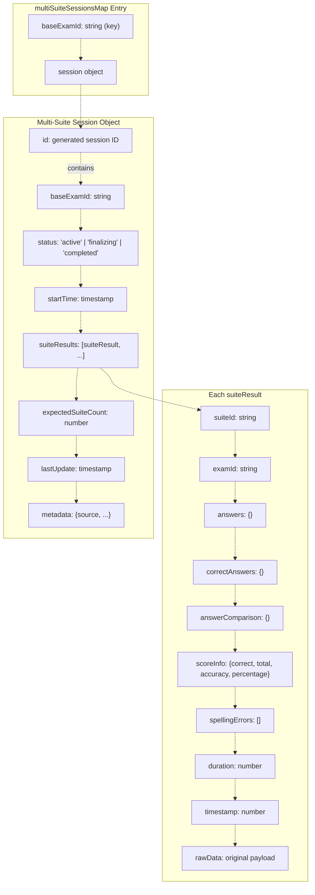

**Sources:** [js/app/suitePracticeMixin.js L14](https://github.com/sallowayma-git/IELTS-practice/blob/92f64eb8/js/app/suitePracticeMixin.js#L14-L14)

 [js/app/suitePracticeMixin.js L1114-L1136](https://github.com/sallowayma-git/IELTS-practice/blob/92f64eb8/js/app/suitePracticeMixin.js#L1114-L1136)

---

## Sequential Suite Practice Lifecycle

### Initialization and Startup

The sequential suite practice begins when `startSuitePractice()` is invoked, typically by the user clicking a "开始套题练习" button.

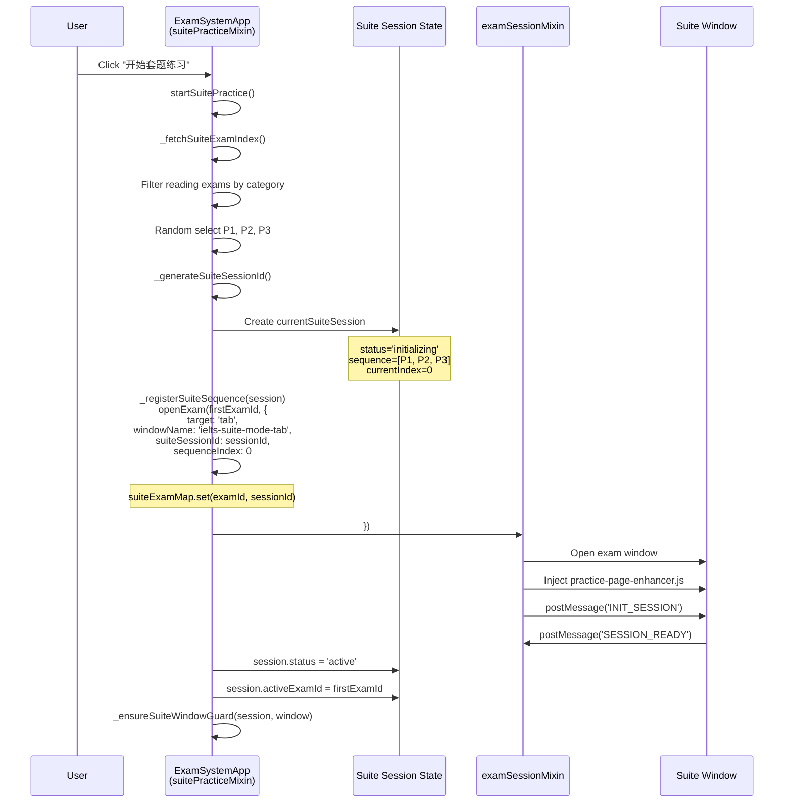

**Sources:** [js/app/suitePracticeMixin.js L20-L125](https://github.com/sallowayma-git/IELTS-practice/blob/92f64eb8/js/app/suitePracticeMixin.js#L20-L125)

 [js/app/suitePracticeMixin.js L766-L782](https://github.com/sallowayma-git/IELTS-practice/blob/92f64eb8/js/app/suitePracticeMixin.js#L766-L782)

 [js/app/suitePracticeMixin.js L788-L796](https://github.com/sallowayma-git/IELTS-practice/blob/92f64eb8/js/app/suitePracticeMixin.js#L788-L796)

### Suite Practice Completion and Navigation

When a user completes an exam in the suite, the system receives a `PRACTICE_COMPLETE` message. The `handleSuitePracticeComplete()` function processes this and either navigates to the next exam or finalizes the suite record.

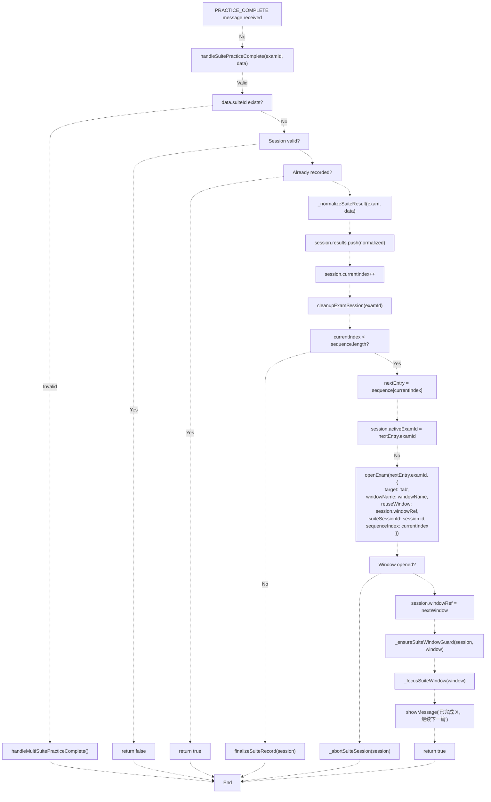

**Sources:** [js/app/suitePracticeMixin.js L127-L242](https://github.com/sallowayma-git/IELTS-practice/blob/92f64eb8/js/app/suitePracticeMixin.js#L127-L242)

### Result Normalization

The `_normalizeSuiteResult()` function standardizes result data from each exam before adding it to the suite session.

| Field | Source | Fallback |
| --- | --- | --- |
| `correct` | `rawData.scoreInfo.correct` | 0 |
| `total` | `rawData.scoreInfo.total` | `Object.keys(answers).length` |
| `accuracy` | `rawData.scoreInfo.accuracy` | `correct / total` |
| `percentage` | `rawData.scoreInfo.percentage` | `accuracy * 100` |
| `duration` | `rawData.duration` | 0 |
| `answers` | `rawData.answers` | `{}` |
| `answerComparison` | `rawData.answerComparison` | `scoreInfo.details` or `{}` |

**Sources:** [js/app/suitePracticeMixin.js L814-L866](https://github.com/sallowayma-git/IELTS-practice/blob/92f64eb8/js/app/suitePracticeMixin.js#L814-L866)

---

## Multi-Suite Practice Flow

### Detection and Session Creation

Multi-suite mode is detected when `practicePageEnhancer` finds a page structure indicating multiple test sets, or when the `PRACTICE_COMPLETE` payload includes a `suiteId` field.

```

```

**Sources:** [js/app/suitePracticeMixin.js L244-L319](https://github.com/sallowayma-git/IELTS-practice/blob/92f64eb8/js/app/suitePracticeMixin.js#L244-L319)

 [js/app/suitePracticeMixin.js L1110-L1160](https://github.com/sallowayma-git/IELTS-practice/blob/92f64eb8/js/app/suitePracticeMixin.js#L1110-L1160)

### Suite Count Detection

The system attempts to determine how many suites are expected on a page using multiple strategies:

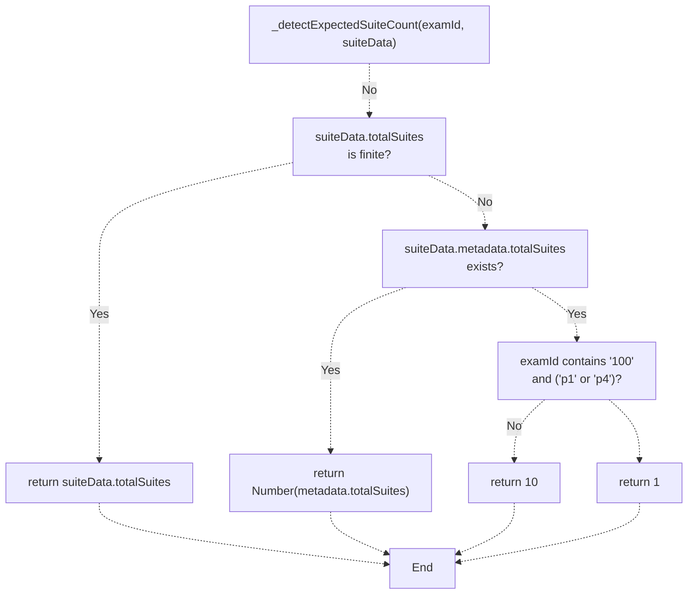

**Sources:** [js/app/suitePracticeMixin.js L321-L349](https://github.com/sallowayma-git/IELTS-practice/blob/92f64eb8/js/app/suitePracticeMixin.js#L321-L349)

### Completion Detection

Multi-suite completion is determined by comparing the number of submitted suites against the expected count:

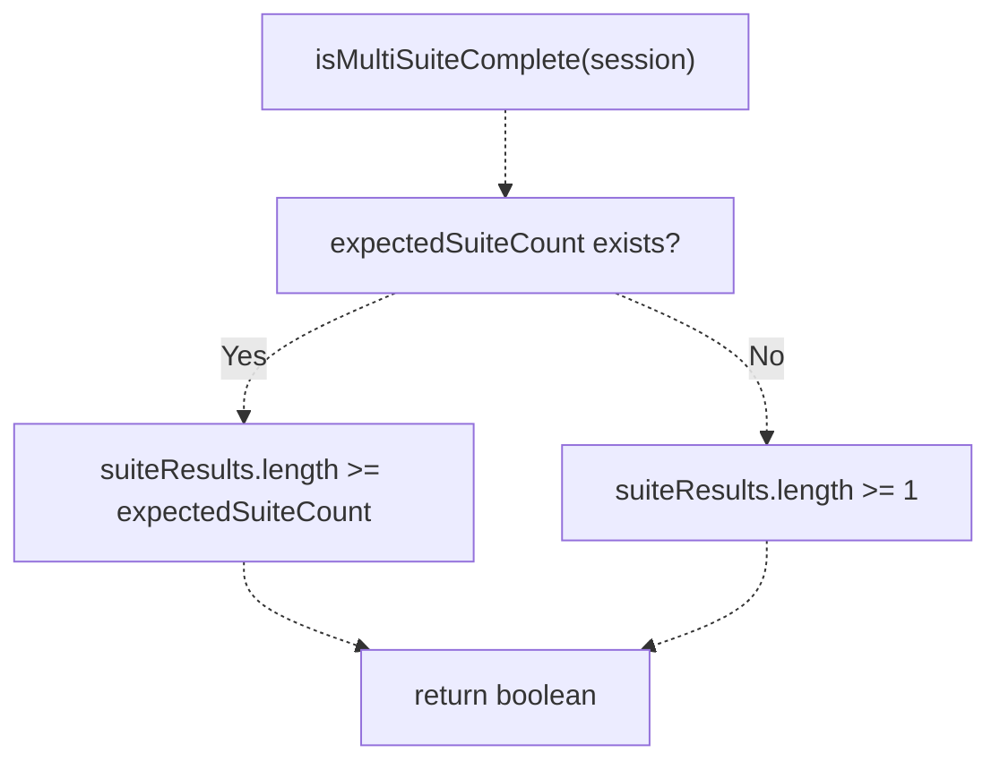

**Sources:** [js/app/suitePracticeMixin.js L1162-L1180](https://github.com/sallowayma-git/IELTS-practice/blob/92f64eb8/js/app/suitePracticeMixin.js#L1162-L1180)

---

## Suite Guards and Window Management

Suite guards prevent users from accidentally closing the exam window during suite practice, which would interrupt the flow and lose progress.

### Guard Installation

Guards are installed when a suite session becomes active:

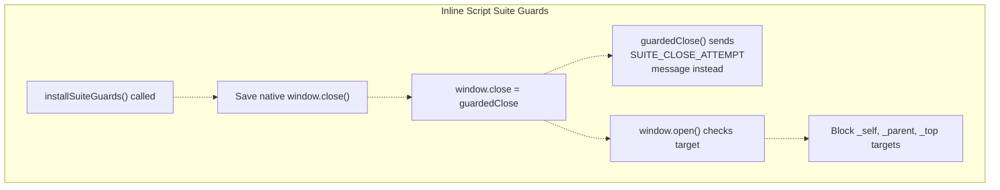

The inline script in `injectInlineScript()` implements suite guards for fallback scenarios:

**Key functions:**

* `installSuiteGuards()`: Replaces `window.close()` and intercepts `window.open()` [js/app/examSessionMixin.js L638-L701](https://github.com/sallowayma-git/IELTS-practice/blob/92f64eb8/js/app/examSessionMixin.js#L638-L701)
* `teardownSuiteGuards()`: Restores native functions when suite completes [js/app/examSessionMixin.js L703-L721](https://github.com/sallowayma-git/IELTS-practice/blob/92f64eb8/js/app/examSessionMixin.js#L703-L721)
* `notifySuiteCloseAttempt(reason)`: Sends `SUITE_CLOSE_ATTEMPT` message to main window [js/app/examSessionMixin.js L626-L636](https://github.com/sallowayma-git/IELTS-practice/blob/92f64eb8/js/app/examSessionMixin.js#L626-L636)

**Guard behavior:**

1. `window.close()` calls send `SUITE_CLOSE_ATTEMPT` message instead of closing
2. `window.open()` with self-targeting (`_self`, `_parent`, `_top`) is blocked
3. Main window can force close via `SUITE_FORCE_CLOSE` message
4. Guards are removed after suite completes or is aborted

**Sources:** [js/app/examSessionMixin.js L638-L721](https://github.com/sallowayma-git/IELTS-practice/blob/92f64eb8/js/app/examSessionMixin.js#L638-L721)

 [js/app/suitePracticeMixin.js L1234-L1280](https://github.com/sallowayma-git/IELTS-practice/blob/92f64eb8/js/app/suitePracticeMixin.js#L1234-L1280)

### Window Reacquisition

If the suite window reference is lost (e.g., user manually navigates), the system attempts to reacquire it:

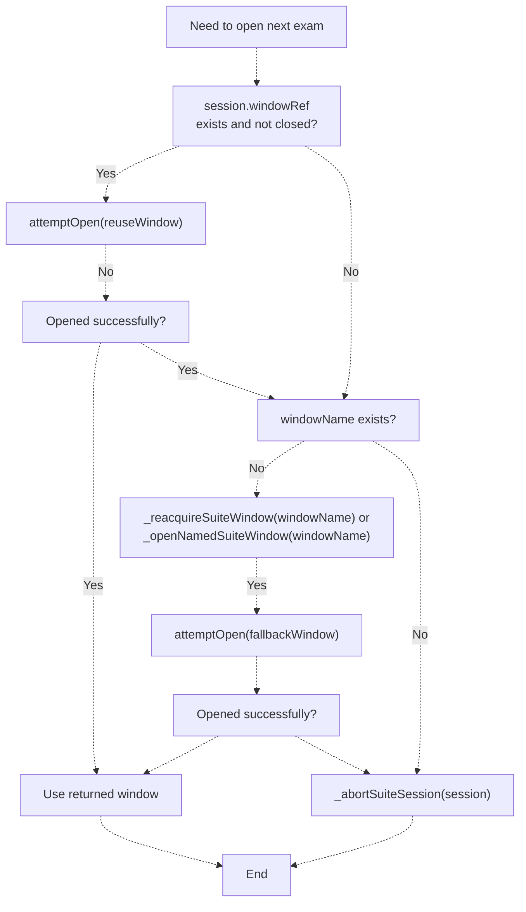

**Sources:** [js/app/suitePracticeMixin.js L186-L238](https://github.com/sallowayma-git/IELTS-practice/blob/92f64eb8/js/app/suitePracticeMixin.js#L186-L238)

---

## Result Aggregation

### Sequential Suite Aggregation

When all exams in a sequential suite are completed, `finalizeSuiteRecord()` aggregates the results:

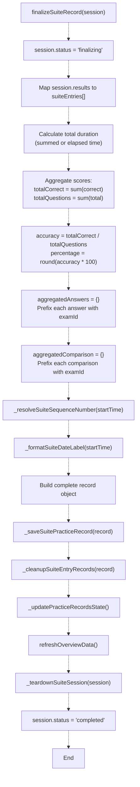

**Aggregated record structure:**

| Field | Content |
| --- | --- |
| `id` | `session.id` |
| `examId` | `"suite-{session.id}"` |
| `title` | `"{date}套题练习{sequence}"` (e.g., "12月25日套题练习1") |
| `type` | `"reading"` |
| `suiteMode` | `true` |
| `duration` | Sum of all exam durations or elapsed time |
| `totalQuestions` | Sum of all questions |
| `correctAnswers` | Sum of correct answers |
| `accuracy` | Overall accuracy (0-1) |
| `percentage` | Overall percentage (0-100) |
| `answers` | `{examId::questionId: answer}` format |
| `answerComparison` | `{examId::questionId: comparison}` format |
| `suiteEntries` | Array of individual exam results |

**Sources:** [js/app/suitePracticeMixin.js L643-L764](https://github.com/sallowayma-git/IELTS-practice/blob/92f64eb8/js/app/suitePracticeMixin.js#L643-L764)

### Multi-Suite Aggregation

Multi-suite aggregation combines results from multiple test sets on a single page:

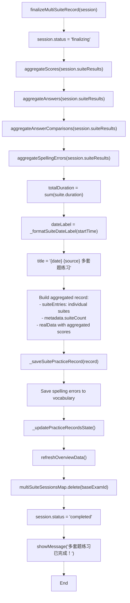

**Score aggregation:**

* `correct`: Sum of all suite correct counts
* `total`: Sum of all suite question counts
* `accuracy`: `correct / total`
* `percentage`: `round(accuracy * 100)`

**Answer aggregation:**

* Keys use format: `{suiteId}::{questionId}`
* Handles pre-prefixed keys from child pages
* Preserves all question-answer mappings

**Spelling error aggregation:**

* Deduplicates by word (case-insensitive)
* Increments `errorCount` for repeated errors
* Preserves most recent `userInput` and `timestamp`

**Sources:** [js/app/suitePracticeMixin.js L351-L489](https://github.com/sallowayma-git/IELTS-practice/blob/92f64eb8/js/app/suitePracticeMixin.js#L351-L489)

 [js/app/suitePracticeMixin.js L491-L641](https://github.com/sallowayma-git/IELTS-practice/blob/92f64eb8/js/app/suitePracticeMixin.js#L491-L641)

---

## Practice Page Enhancer Support

The `practicePageEnhancer` detects and supports suite modes through mixins:

### Listening Suite Mixin

```

```

**Mixin priorities:**

* `listening-suite-practice`: Priority 30
* `standard-inline-practice`: Priority 5

Higher priority mixins are applied first.

**Sources:** [js/practice-page-enhancer.js L222-L272](https://github.com/sallowayma-git/IELTS-practice/blob/92f64eb8/js/practice-page-enhancer.js#L222-L272)

 [js/practice-page-enhancer.js L154-L192](https://github.com/sallowayma-git/IELTS-practice/blob/92f64eb8/js/practice-page-enhancer.js#L154-L192)

### Multi-Suite Detection

The enhancer detects multi-suite pages during initialization:

```

```

**Sources:** [js/practice-page-enhancer.js L1007-L1108](https://github.com/sallowayma-git/IELTS-practice/blob/92f64eb8/js/practice-page-enhancer.js#L1007-L1108)

---

## Suite Record Cleanup

After saving a suite record, the system removes individual exam records to avoid duplication:

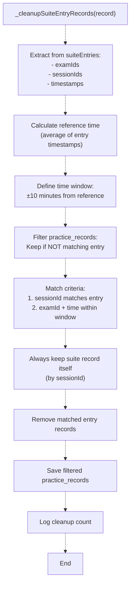

This prevents the UI from showing both the aggregated suite record and the individual exam records.

**Sources:** [js/app/suitePracticeMixin.js L905-L996](https://github.com/sallowayma-git/IELTS-practice/blob/92f64eb8/js/app/suitePracticeMixin.js#L905-L996)

---

## Error Handling and Abort

### Abort Scenarios

Suite sessions can be aborted in several scenarios:

| Scenario | Trigger | Action |
| --- | --- | --- |
| Startup failure | `startSuitePractice()` throws | Abort via `_abortSuiteSession()` |
| Window unavailable | Cannot open next exam window | Abort with reason `'open_next_failed'` |
| Missing sequence | Exam not found in sequence | Abort with reason `'missing_sequence'` |
| System error | `openExam` function missing | Abort with reason `'missing_open_exam'` |

### Abort Flow

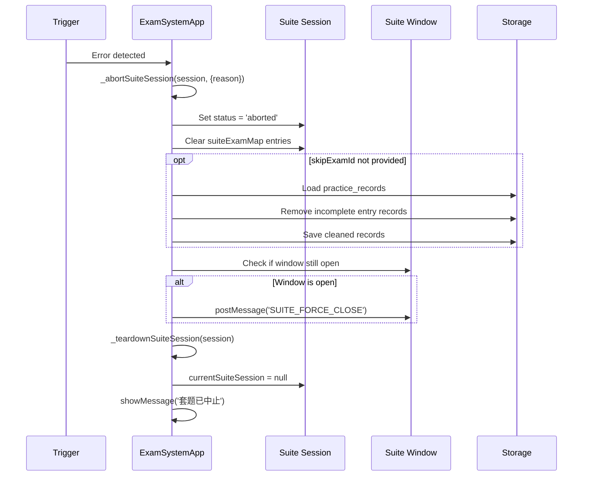

**Sources:** [js/app/suitePracticeMixin.js L1282-L1344](https://github.com/sallowayma-git/IELTS-practice/blob/92f64eb8/js/app/suitePracticeMixin.js#L1282-L1344)

---

## Integration with PracticeRecorder

Suite records are saved through the `PracticeRecorder` service when available:

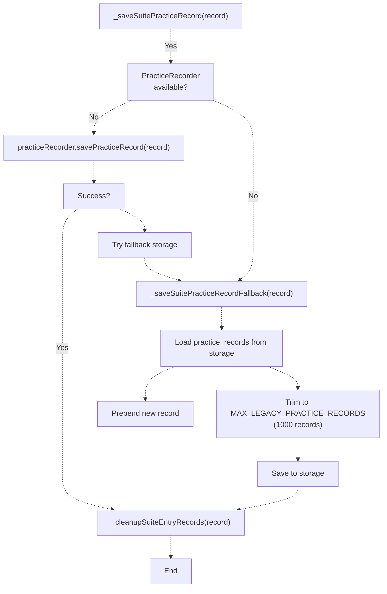

**Sources:** [js/app/suitePracticeMixin.js L868-L903](https://github.com/sallowayma-git/IELTS-practice/blob/92f64eb8/js/app/suitePracticeMixin.js#L868-L903)