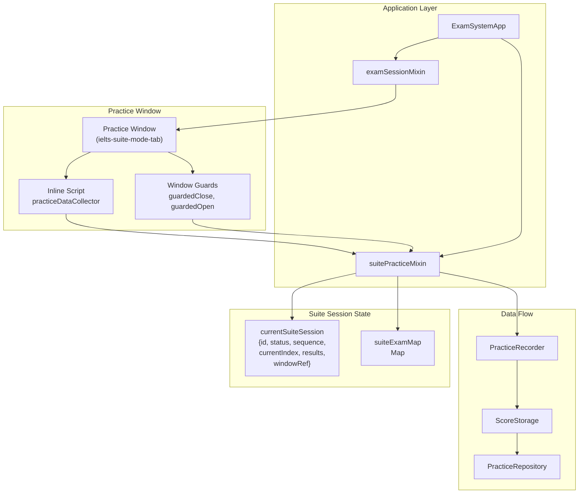
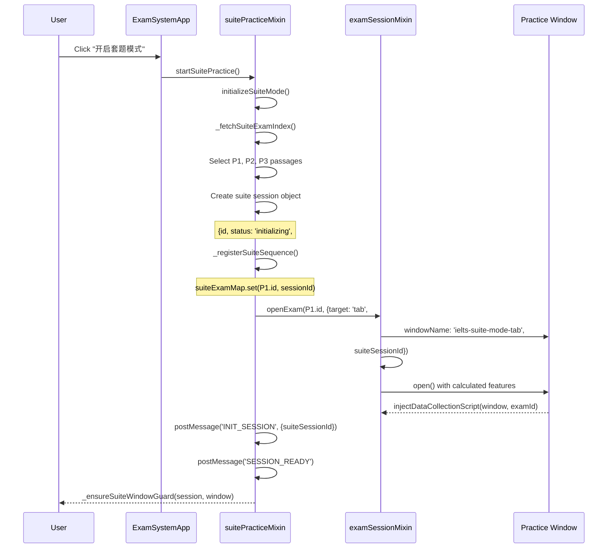
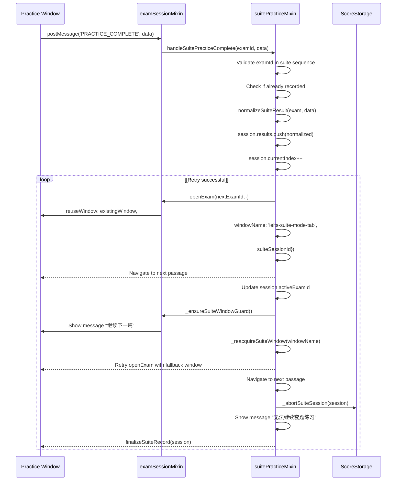
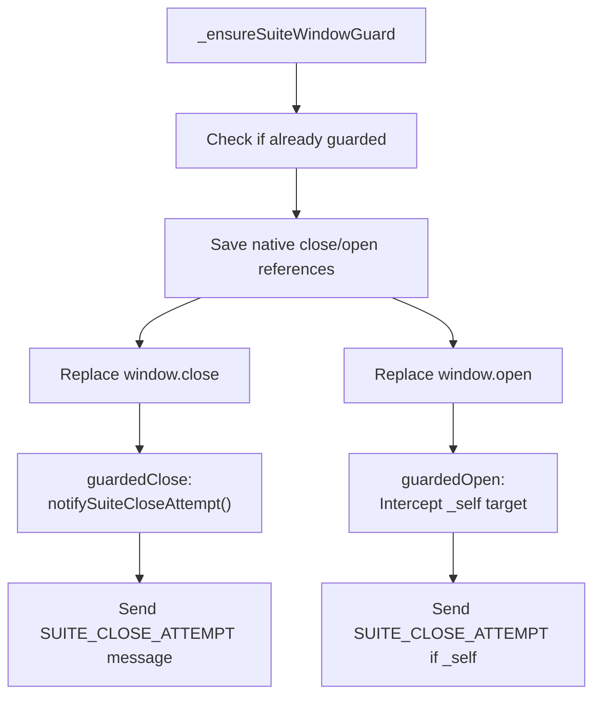
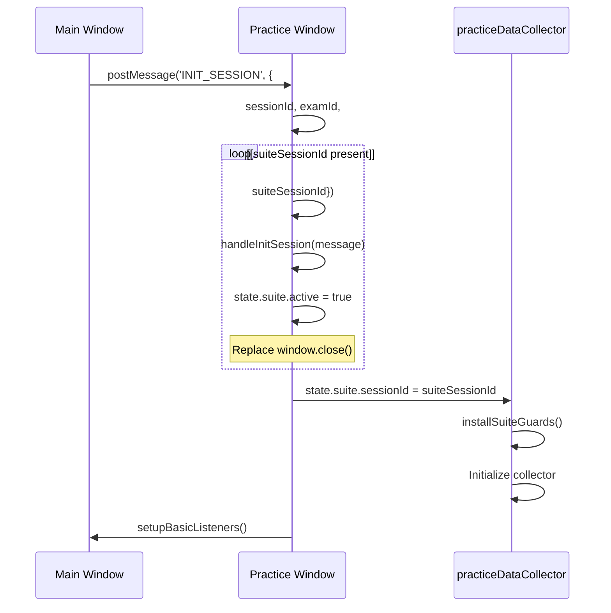
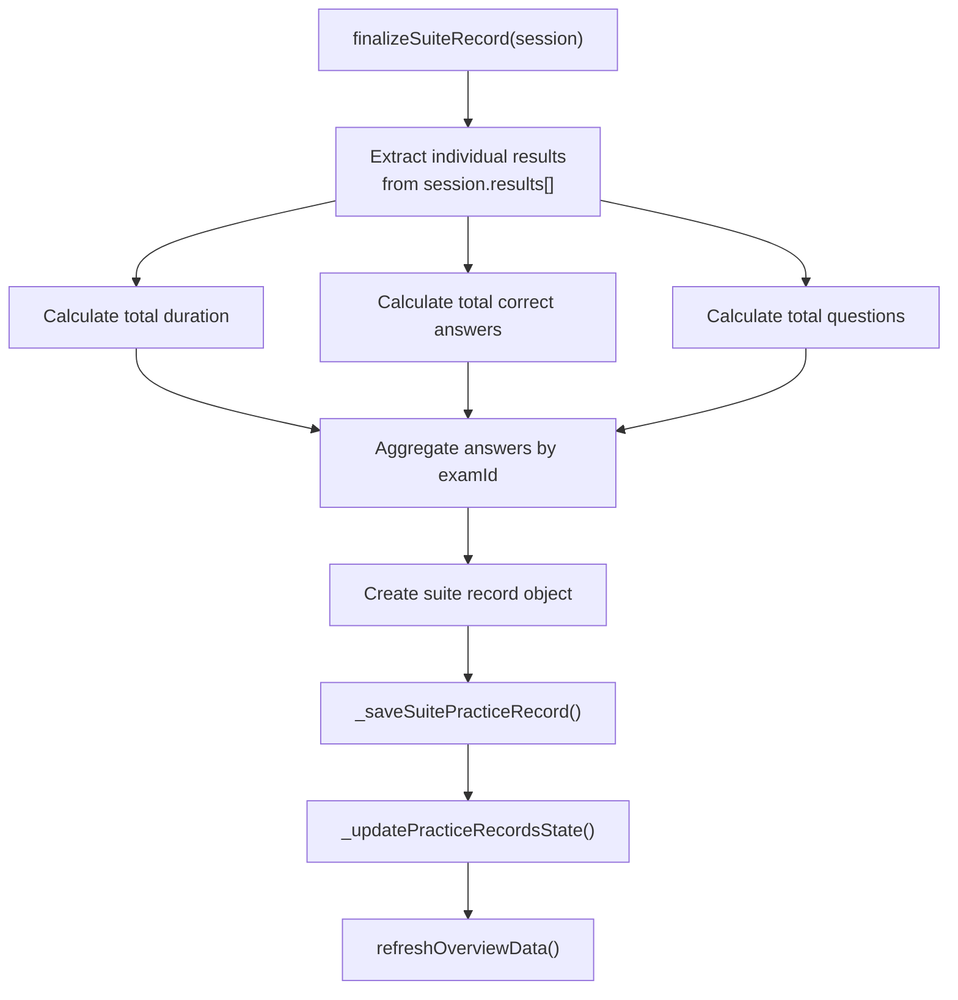
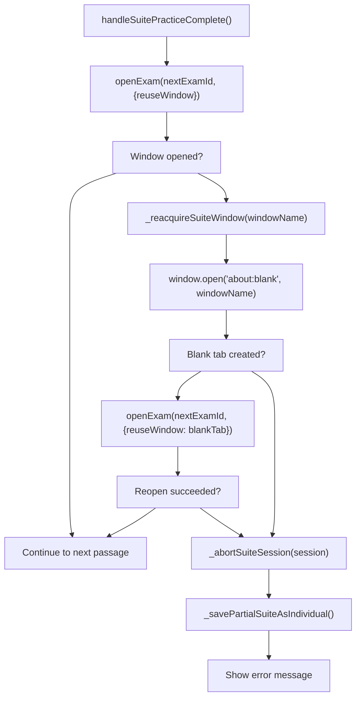
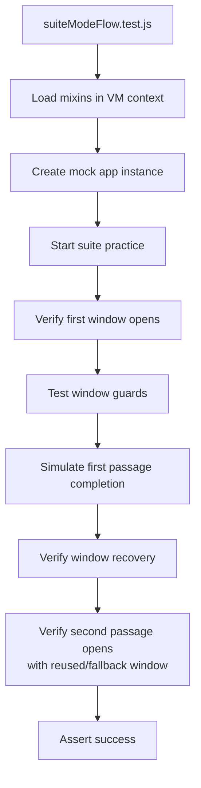
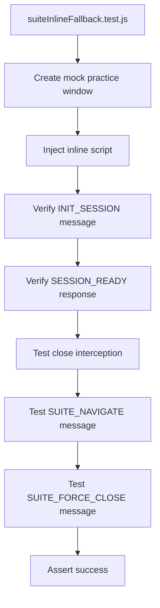
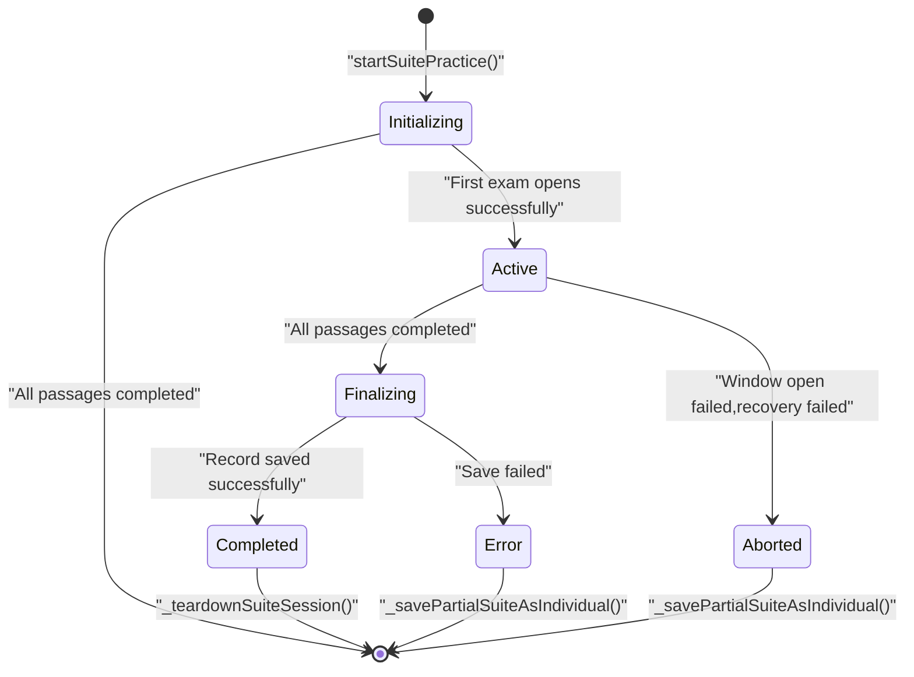

# Suite Practice Mode

> **Relevant source files**
> * [AGENTS.md](https://github.com/sallowayma-git/IELTS-practice/blob/68771116/AGENTS.md)
> * [js/app/examSessionMixin.js](https://github.com/sallowayma-git/IELTS-practice/blob/68771116/js/app/examSessionMixin.js)
> * [js/app/suitePracticeMixin.js](https://github.com/sallowayma-git/IELTS-practice/blob/68771116/js/app/suitePracticeMixin.js)
> * [js/utils/environmentDetector.js](https://github.com/sallowayma-git/IELTS-practice/blob/68771116/js/utils/environmentDetector.js)

## Purpose and Scope

Suite Practice Mode enables users to complete three reading passages (P1, P2, P3) consecutively in a single session, simulating a real IELTS reading exam. This document covers the suite mode implementation, including session management, window guards, script injection, and result aggregation.

For information about individual practice sessions, see [Practice Recorder & Score Storage](/sallowayma-git/IELTS-practice/5.1-practicerecorder-and-scorestorage). For cross-window communication protocols used during practice, see [Cross-Window Communication Protocol](/sallowayma-git/IELTS-practice/5.3-cross-window-communication-protocol).

**Sources:** [js/app/suitePracticeMixin.js L1-L800](https://github.com/sallowayma-git/IELTS-practice/blob/68771116/js/app/suitePracticeMixin.js#L1-L800)

---

## System Overview

Suite Practice Mode orchestrates a multi-exam session where three reading passages are completed sequentially in a single browser tab. The system automatically transitions between passages, prevents premature window closure, and aggregates results into a unified practice record.

### Key Capabilities

| Capability | Description |
| --- | --- |
| **Automatic Sequencing** | Randomly selects one passage from P1, P2, P3 categories and opens them in order |
| **Window Guards** | Prevents `window.close()` and `window.open(..., '_self')` to maintain session continuity |
| **Tab Reuse** | Navigates within the same browser tab to preserve context |
| **Inline Fallback** | Injects data collection script directly when file:// protocol prevents external script loading |
| **Result Aggregation** | Combines scores, durations, and answers from all three passages into a single record |
| **Session Recovery** | Attempts to reopen closed tabs and continue the session |

**Sources:** [js/app/suitePracticeMixin.js L1-L50](https://github.com/sallowayma-git/IELTS-practice/blob/68771116/js/app/suitePracticeMixin.js#L1-L50)

 [js/app/examSessionMixin.js L280-L522](https://github.com/sallowayma-git/IELTS-practice/blob/68771116/js/app/examSessionMixin.js#L280-L522)

---

## Architecture Components



**Component Responsibilities:**

| Component | File | Responsibility |
| --- | --- | --- |
| `suitePracticeMixin` | [js/app/suitePracticeMixin.js](https://github.com/sallowayma-git/IELTS-practice/blob/68771116/js/app/suitePracticeMixin.js) | Suite session lifecycle, sequencing, result aggregation |
| `examSessionMixin` | [js/app/examSessionMixin.js](https://github.com/sallowayma-git/IELTS-practice/blob/68771116/js/app/examSessionMixin.js) | Window opening, script injection, message handling |
| `currentSuiteSession` | [js/app/suitePracticeMixin.js L9-L10](https://github.com/sallowayma-git/IELTS-practice/blob/68771116/js/app/suitePracticeMixin.js#L9-L10) | Active suite session state object |
| `suiteExamMap` | [js/app/suitePracticeMixin.js L10-L11](https://github.com/sallowayma-git/IELTS-practice/blob/68771116/js/app/suitePracticeMixin.js#L10-L11) | Maps examId to suiteSessionId for routing messages |
| Inline Script | [js/app/examSessionMixin.js L281-L522](https://github.com/sallowayma-git/IELTS-practice/blob/68771116/js/app/examSessionMixin.js#L281-L522) | Data collection script injected into practice pages |
| Window Guards | [js/app/examSessionMixin.js L345-L388](https://github.com/sallowayma-git/IELTS-practice/blob/68771116/js/app/examSessionMixin.js#L345-L388) | Prevents window closure during suite practice |

**Sources:** [js/app/suitePracticeMixin.js L1-L100](https://github.com/sallowayma-git/IELTS-practice/blob/68771116/js/app/suitePracticeMixin.js#L1-L100)

 [js/app/examSessionMixin.js L1-L100](https://github.com/sallowayma-git/IELTS-practice/blob/68771116/js/app/examSessionMixin.js#L1-L100)

---

## Suite Session Lifecycle

### Initialization Flow



**Key Functions:**

| Function | Location | Purpose |
| --- | --- | --- |
| `startSuitePractice()` | [js/app/suitePracticeMixin.js L13-L117](https://github.com/sallowayma-git/IELTS-practice/blob/68771116/js/app/suitePracticeMixin.js#L13-L117) | Entry point for initiating suite practice |
| `initializeSuiteMode()` | [js/app/suitePracticeMixin.js L3-L11](https://github.com/sallowayma-git/IELTS-practice/blob/68771116/js/app/suitePracticeMixin.js#L3-L11) | Initializes suite mode state structures |
| `_fetchSuiteExamIndex()` | [js/app/suitePracticeMixin.js L317-L333](https://github.com/sallowayma-git/IELTS-practice/blob/68771116/js/app/suitePracticeMixin.js#L317-L333) | Retrieves exam index from state or storage |
| `_registerSuiteSequence()` | [js/app/suitePracticeMixin.js L339-L347](https://github.com/sallowayma-git/IELTS-practice/blob/68771116/js/app/suitePracticeMixin.js#L339-L347) | Populates `suiteExamMap` with examId→sessionId mappings |
| `_ensureSuiteWindowGuard()` | [js/app/suitePracticeMixin.js L576-L668](https://github.com/sallowayma-git/IELTS-practice/blob/68771116/js/app/suitePracticeMixin.js#L576-L668) | Installs window close/open interception |

**Sources:** [js/app/suitePracticeMixin.js L13-L117](https://github.com/sallowayma-git/IELTS-practice/blob/68771116/js/app/suitePracticeMixin.js#L13-L117)

 [js/app/suitePracticeMixin.js L317-L347](https://github.com/sallowayma-git/IELTS-practice/blob/68771116/js/app/suitePracticeMixin.js#L317-L347)

 [js/app/suitePracticeMixin.js L576-L668](https://github.com/sallowayma-git/IELTS-practice/blob/68771116/js/app/suitePracticeMixin.js#L576-L668)

### Session State Object

```yaml
// currentSuiteSession structure
{
  id: "suite_${timestamp}_${random}",
  status: "initializing" | "active" | "finalizing" | "completed" | "error",
  startTime: 1234567890,
  sequence: [
    { examId: "reading-p1-01", exam: {...} },
    { examId: "reading-p2-15", exam: {...} },
    { examId: "reading-p3-22", exam: {...} }
  ],
  currentIndex: 0,
  activeExamId: "reading-p1-01",
  results: [
    { examId, title, duration, scoreInfo, answers, answerComparison }
  ],
  windowRef: Window,
  windowName: "ielts-suite-mode-tab"
}
```

**Sources:** [js/app/suitePracticeMixin.js L72-L82](https://github.com/sallowayma-git/IELTS-practice/blob/68771116/js/app/suitePracticeMixin.js#L72-L82)

### Passage Transition Flow



**Key Functions:**

| Function | Location | Purpose |
| --- | --- | --- |
| `handleSuitePracticeComplete()` | [js/app/suitePracticeMixin.js L119-L221](https://github.com/sallowayma-git/IELTS-practice/blob/68771116/js/app/suitePracticeMixin.js#L119-L221) | Handles passage completion and transitions |
| `_normalizeSuiteResult()` | [js/app/suitePracticeMixin.js L512-L543](https://github.com/sallowayma-git/IELTS-practice/blob/68771116/js/app/suitePracticeMixin.js#L512-L543) | Normalizes practice data for suite context |
| `_reacquireSuiteWindow()` | [js/app/suitePracticeMixin.js L670-L708](https://github.com/sallowayma-git/IELTS-practice/blob/68771116/js/app/suitePracticeMixin.js#L670-L708) | Attempts to recover closed suite window |
| `_abortSuiteSession()` | [js/app/suitePracticeMixin.js L710-L754](https://github.com/sallowayma-git/IELTS-practice/blob/68771116/js/app/suitePracticeMixin.js#L710-L754) | Gracefully aborts suite session on error |

**Sources:** [js/app/suitePracticeMixin.js L119-L221](https://github.com/sallowayma-git/IELTS-practice/blob/68771116/js/app/suitePracticeMixin.js#L119-L221)

 [js/app/suitePracticeMixin.js L512-L543](https://github.com/sallowayma-git/IELTS-practice/blob/68771116/js/app/suitePracticeMixin.js#L512-L543)

 [js/app/suitePracticeMixin.js L670-L754](https://github.com/sallowayma-git/IELTS-practice/blob/68771116/js/app/suitePracticeMixin.js#L670-L754)

---

## Window Management and Guards

Suite Practice Mode prevents premature window closure to maintain session continuity. This is achieved through runtime interception of `window.close()` and `window.open(..., '_self')`.

### Guard Installation



**Guard Implementation:**

```javascript
// From inline script (examSessionMixin.js:345-388)
function installSuiteGuards() {
    state.suite.nativeClose = window.close.bind(window);
    
    var guardedClose = function() {
        notifySuiteCloseAttempt('script_request');
        return undefined; // Prevent closure
    };
    
    window.close = guardedClose;
    window.self.close = guardedClose;
    window.top.close = guardedClose;
    
    state.suite.nativeOpen = window.open.bind(window);
    window.open = function(url, target, features) {
        var normalizedTarget = typeof target === 'string' ? target.trim() : '';
        if (!normalizedTarget || normalizedTarget === '_self' || 
            normalizedTarget === window.name) {
            notifySuiteCloseAttempt('self_target_open');
            return window; // Return current window instead
        }
        return state.suite.nativeOpen.call(window, url, target, features);
    };
}
```

**Guard Teardown:**

```javascript
// From inline script (examSessionMixin.js:370-388)
function teardownSuiteGuards() {
    if (state.suite.nativeClose) {
        window.close = state.suite.nativeClose;
        window.self.close = state.suite.nativeClose;
        window.top.close = state.suite.nativeClose;
    }
    
    if (state.suite.nativeOpen) {
        window.open = state.suite.nativeOpen;
    }
}
```

**Sources:** [js/app/examSessionMixin.js L335-L388](https://github.com/sallowayma-git/IELTS-practice/blob/68771116/js/app/examSessionMixin.js#L335-L388)

 [js/app/suitePracticeMixin.js L576-L668](https://github.com/sallowayma-git/IELTS-practice/blob/68771116/js/app/suitePracticeMixin.js#L576-L668)

### Close Attempt Tracking

When a guarded close attempt occurs, the practice window sends a `SUITE_CLOSE_ATTEMPT` message to the main application:

```yaml
// Message structure
{
  type: 'SUITE_CLOSE_ATTEMPT',
  data: {
    examId: 'reading-p1-01',
    suiteSessionId: 'suite_abc123',
    reason: 'script_request' | 'self_target_open',
    timestamp: 1234567890
  }
}
```

The main application logs these attempts but allows the suite to continue:

```
// From examSessionMixin.js:889-891
case 'SUITE_CLOSE_ATTEMPT':
    console.warn('[SuitePractice] 练习页尝试关闭套题窗口:', data);
    break;
```

**Sources:** [js/app/examSessionMixin.js L323-L333](https://github.com/sallowayma-git/IELTS-practice/blob/68771116/js/app/examSessionMixin.js#L323-L333)

 [js/app/examSessionMixin.js L889-L891](https://github.com/sallowayma-git/IELTS-practice/blob/68771116/js/app/examSessionMixin.js#L889-L891)

---

## Data Collection and Script Injection

Suite Practice Mode uses two script injection strategies depending on the execution environment:

### Strategy 1: External Script Loading

```javascript
// From examSessionMixin.js:236-243
const enhancerScript = await fetch('./js/practice-page-enhancer.js')
    .then(r => r.text());

const enhancerScriptEl = doc.createElement('script');
enhancerScriptEl.type = 'text/javascript';
enhancerScriptEl.textContent = enhancerScript;
doc.head.appendChild(enhancerScriptEl);
```

**Used when:** HTTP/HTTPS protocol allows fetch operations.

**Sources:** [js/app/examSessionMixin.js L206-L255](https://github.com/sallowayma-git/IELTS-practice/blob/68771116/js/app/examSessionMixin.js#L206-L255)

### Strategy 2: Inline Script Injection (Fallback)

```typescript
// From examSessionMixin.js:281-522
injectInlineScript(examWindow, examId) {
    const sessionToken = `${examId}_${Date.now()}`;
    const inlineScript = examWindow.document.createElement('script');
    inlineScript.type = 'text/javascript';
    inlineScript.textContent = `
        (function() {
            if (window.__IELTS_INLINE_ENHANCER__) return;
            window.__IELTS_INLINE_ENHANCER__ = true;
            
            var state = {
                sessionId: ${JSON.stringify(sessionToken)},
                examId: ${JSON.stringify(examId)},
                startTime: Date.now(),
                answers: {},
                suite: {
                    active: false,
                    sessionId: null,
                    guarded: false,
                    nativeClose: null,
                    nativeOpen: null
                }
            };
            
            // ... collector implementation
        })();
    `;
    examWindow.document.head.appendChild(inlineScript);
}
```

**Used when:** file:// protocol prevents fetch operations, or external script loading fails.

**Sources:** [js/app/examSessionMixin.js L281-L522](https://github.com/sallowayma-git/IELTS-practice/blob/68771116/js/app/examSessionMixin.js#L281-L522)

### Suite Mode Initialization in Practice Window



**Sources:** [js/app/examSessionMixin.js L401-L421](https://github.com/sallowayma-git/IELTS-practice/blob/68771116/js/app/examSessionMixin.js#L401-L421)

 [js/app/examSessionMixin.js L527-L600](https://github.com/sallowayma-git/IELTS-practice/blob/68771116/js/app/examSessionMixin.js#L527-L600)

### Navigation Between Passages

When transitioning to the next passage, the main window sends a `SUITE_NAVIGATE` message:

```javascript
// From inline script (examSessionMixin.js:390-399)
function handleSuiteNavigate(data) {
    if (!data || !data.url) return;
    try {
        window.location.href = data.url;
    } catch (error) {
        console.warn('[InlineEnhancer] 套题导航失败:', error);
    }
}
```

**Sources:** [js/app/examSessionMixin.js L390-L399](https://github.com/sallowayma-git/IELTS-practice/blob/68771116/js/app/examSessionMixin.js#L390-L399)

---

## Result Aggregation

After all three passages are completed, Suite Practice Mode aggregates individual results into a unified practice record.

### Aggregation Process



**Aggregated Record Structure:**

```yaml
// From suitePracticeMixin.js:262-300
{
  id: "suite_abc123",
  examId: "suite-suite_abc123",
  title: "2025-01-15 20:30 套题练习",
  type: "reading",
  suiteMode: true,
  date: "2025-01-15T12:30:00.000Z",
  startTime: "2025-01-15T12:00:00.000Z",
  endTime: "2025-01-15T12:30:00.000Z",
  duration: 1800, // Total seconds across all passages
  totalQuestions: 40,
  correctAnswers: 35,
  accuracy: 0.875,
  percentage: 88,
  scoreInfo: {
    correct: 35,
    total: 40,
    accuracy: 0.875,
    percentage: 88
  },
  answers: {
    "reading-p1-01": { q1: "A", q2: "B", ... },
    "reading-p2-15": { q1: "C", q2: "D", ... },
    "reading-p3-22": { q1: "E", q2: "F", ... }
  },
  answerComparison: {
    "reading-p1-01": { q1: { correct: "A", user: "A" }, ... },
    "reading-p2-15": { q1: { correct: "C", user: "C" }, ... },
    "reading-p3-22": { q1: { correct: "E", user: "E" }, ... }
  },
  suiteEntries: [
    { examId, title, category, duration, scoreInfo, answers, answerComparison },
    { examId, title, category, duration, scoreInfo, answers, answerComparison },
    { examId, title, category, duration, scoreInfo, answers, answerComparison }
  ],
  frequency: "suite",
  metadata: {
    examTitle: "2025-01-15 20:30 套题练习",
    category: "套题练习",
    frequency: "suite",
    suiteSessionId: "suite_abc123",
    suiteEntries: [...],
    startedAt: "2025-01-15T12:00:00.000Z",
    completedAt: "2025-01-15T12:30:00.000Z"
  },
  realData: {
    isRealData: true,
    source: "suite_mode",
    duration: 1800,
    correct: 35,
    total: 40,
    accuracy: 0.875,
    percentage: 88,
    suiteEntries: [...]
  }
}
```

**Key Functions:**

| Function | Location | Purpose |
| --- | --- | --- |
| `finalizeSuiteRecord()` | [js/app/suitePracticeMixin.js L223-L315](https://github.com/sallowayma-git/IELTS-practice/blob/68771116/js/app/suitePracticeMixin.js#L223-L315) | Aggregates passage results into suite record |
| `_normalizeSuiteResult()` | [js/app/suitePracticeMixin.js L512-L543](https://github.com/sallowayma-git/IELTS-practice/blob/68771116/js/app/suitePracticeMixin.js#L512-L543) | Normalizes individual passage data |
| `_saveSuitePracticeRecord()` | [js/app/suitePracticeMixin.js L756-L799](https://github.com/sallowayma-git/IELTS-practice/blob/68771116/js/app/suitePracticeMixin.js#L756-L799) | Saves aggregated record to storage |
| `_formatSuiteTimeLabel()` | [js/app/suitePracticeMixin.js L545-L552](https://github.com/sallowayma-git/IELTS-practice/blob/68771116/js/app/suitePracticeMixin.js#L545-L552) | Formats timestamp for suite title |

**Sources:** [js/app/suitePracticeMixin.js L223-L315](https://github.com/sallowayma-git/IELTS-practice/blob/68771116/js/app/suitePracticeMixin.js#L223-L315)

 [js/app/suitePracticeMixin.js L512-L552](https://github.com/sallowayma-git/IELTS-practice/blob/68771116/js/app/suitePracticeMixin.js#L512-L552)

 [js/app/suitePracticeMixin.js L756-L799](https://github.com/sallowayma-git/IELTS-practice/blob/68771116/js/app/suitePracticeMixin.js#L756-L799)

---

## Fallback Mechanisms

Suite Practice Mode includes several fallback mechanisms to handle failures gracefully:

### Window Recovery



**Window Recovery Implementation:**

```javascript
// From suitePracticeMixin.js:670-708
_reacquireSuiteWindow(windowName, session) {
    if (!windowName) return null;
    
    try {
        // Attempt to reopen the named window with blank page
        const blankWindow = window.open('about:blank', windowName);
        
        if (!blankWindow || blankWindow.closed) {
            console.warn('[SuitePractice] 无法重建套题标签');
            return null;
        }
        
        return blankWindow;
    } catch (error) {
        console.error('[SuitePractice] 重建窗口失败:', error);
        return null;
    }
}
```

**Sources:** [js/app/suitePracticeMixin.js L670-L708](https://github.com/sallowayma-git/IELTS-practice/blob/68771116/js/app/suitePracticeMixin.js#L670-L708)

 [js/app/suitePracticeMixin.js L172-L221](https://github.com/sallowayma-git/IELTS-practice/blob/68771116/js/app/suitePracticeMixin.js#L172-L221)

### Partial Suite Saving

If the suite session fails mid-way, completed passages are saved as individual practice records:

```javascript
// From suitePracticeMixin.js:801-868
async _savePartialSuiteAsIndividual(session) {
    if (!session || !session.results || !session.results.length) {
        return;
    }
    
    console.warn('[SuitePractice] 套题会话异常，保存已完成的篇目为独立记录');
    
    for (const result of session.results) {
        try {
            const record = {
                id: `${result.examId}_${Date.now()}`,
                examId: result.examId,
                title: result.title,
                type: 'reading',
                category: result.category,
                date: new Date().toISOString(),
                duration: result.duration,
                totalQuestions: result.scoreInfo.total,
                correctAnswers: result.scoreInfo.correct,
                accuracy: result.scoreInfo.accuracy,
                percentage: result.scoreInfo.percentage,
                scoreInfo: result.scoreInfo,
                answers: result.answers,
                answerComparison: result.answerComparison,
                frequency: 'partial_suite',
                metadata: {
                    originalSuiteId: session.id,
                    partialSave: true,
                    suiteAborted: true
                }
            };
            
            await this._saveSinglePracticeRecord(record);
        } catch (error) {
            console.error('[SuitePractice] 保存单篇记录失败:', error);
        }
    }
    
    window.showMessage && window.showMessage(
        '套题未完成，已保存完成的篇目', 
        'warning'
    );
}
```

**Sources:** [js/app/suitePracticeMixin.js L801-L868](https://github.com/sallowayma-git/IELTS-practice/blob/68771116/js/app/suitePracticeMixin.js#L801-L868)

### Session Abortion

```javascript
// From suitePracticeMixin.js:710-754
async _abortSuiteSession(session, options = {}) {
    if (!session) return;
    
    const reason = options.reason || 'unspecified';
    console.warn('[SuitePractice] 终止套题会话:', reason);
    
    session.status = 'aborted';
    session.abortReason = reason;
    session.abortTime = Date.now();
    
    // Save partial results
    if (session.results && session.results.length > 0) {
        await this._savePartialSuiteAsIndividual(session);
    }
    
    // Cleanup
    await this._teardownSuiteSession(session);
    
    window.showMessage && window.showMessage(
        '套题练习已终止', 
        'warning'
    );
}
```

**Sources:** [js/app/suitePracticeMixin.js L710-L754](https://github.com/sallowayma-git/IELTS-practice/blob/68771116/js/app/suitePracticeMixin.js#L710-L754)

---

## Testing

Suite Practice Mode is tested through two comprehensive Node.js test files:

### Suite Mode Flow Test



**Test Coverage:**

| Test Case | Location | Validates |
| --- | --- | --- |
| Suite initialization | [developer/tests/js/suiteModeFlow.test.js L277-L278](https://github.com/sallowayma-git/IELTS-practice/blob/68771116/developer/tests/js/suiteModeFlow.test.js#L277-L278) | Session object creation |
| First exam opens | [developer/tests/js/suiteModeFlow.test.js L287-L290](https://github.com/sallowayma-git/IELTS-practice/blob/68771116/developer/tests/js/suiteModeFlow.test.js#L287-L290) | Initial window opening |
| Window guards active | [developer/tests/js/suiteModeFlow.test.js L293-L297](https://github.com/sallowayma-git/IELTS-practice/blob/68771116/developer/tests/js/suiteModeFlow.test.js#L293-L297) | Close interception works |
| Self-target open blocked | [developer/tests/js/suiteModeFlow.test.js L299-L303](https://github.com/sallowayma-git/IELTS-practice/blob/68771116/developer/tests/js/suiteModeFlow.test.js#L299-L303) | Self-navigation blocked |
| New tab open allowed | [developer/tests/js/suiteModeFlow.test.js L305-L309](https://github.com/sallowayma-git/IELTS-practice/blob/68771116/developer/tests/js/suiteModeFlow.test.js#L305-L309) | Regular popups still work |
| Passage transition | [developer/tests/js/suiteModeFlow.test.js L320-L325](https://github.com/sallowayma-git/IELTS-practice/blob/68771116/developer/tests/js/suiteModeFlow.test.js#L320-L325) | Continues to next passage |
| Window recovery | [developer/tests/js/suiteModeFlow.test.js L332-L340](https://github.com/sallowayma-git/IELTS-practice/blob/68771116/developer/tests/js/suiteModeFlow.test.js#L332-L340) | Reopens closed window |

**Sources:** [developer/tests/js/suiteModeFlow.test.js L1-L352](https://github.com/sallowayma-git/IELTS-practice/blob/68771116/developer/tests/js/suiteModeFlow.test.js#L1-L352)

### Inline Fallback Test



**Test Coverage:**

| Test Case | Location | Validates |
| --- | --- | --- |
| Inline script injection | [developer/tests/js/suiteInlineFallback.test.js L191-L192](https://github.com/sallowayma-git/IELTS-practice/blob/68771116/developer/tests/js/suiteInlineFallback.test.js#L191-L192) | Script successfully injected |
| Session handshake | [developer/tests/js/suiteInlineFallback.test.js L193-L198](https://github.com/sallowayma-git/IELTS-practice/blob/68771116/developer/tests/js/suiteInlineFallback.test.js#L193-L198) | INIT_SESSION/SESSION_READY exchange |
| Data collector presence | [developer/tests/js/suiteInlineFallback.test.js L200](https://github.com/sallowayma-git/IELTS-practice/blob/68771116/developer/tests/js/suiteInlineFallback.test.js#L200-L200) | `practiceDataCollector` object created |
| Close attempt blocked | [developer/tests/js/suiteInlineFallback.test.js L202-L207](https://github.com/sallowayma-git/IELTS-practice/blob/68771116/developer/tests/js/suiteInlineFallback.test.js#L202-L207) | Window remains open after close() |
| Navigation works | [developer/tests/js/suiteInlineFallback.test.js L209-L211](https://github.com/sallowayma-git/IELTS-practice/blob/68771116/developer/tests/js/suiteInlineFallback.test.js#L209-L211) | SUITE_NAVIGATE changes location |
| Force close works | [developer/tests/js/suiteInlineFallback.test.js L213-L216](https://github.com/sallowayma-git/IELTS-practice/blob/68771116/developer/tests/js/suiteInlineFallback.test.js#L213-L216) | SUITE_FORCE_CLOSE calls native close |

**Sources:** [developer/tests/js/suiteInlineFallback.test.js L1-L226](https://github.com/sallowayma-git/IELTS-practice/blob/68771116/developer/tests/js/suiteInlineFallback.test.js#L1-L226)

### CI Integration

Both tests are executed by the static CI suite:

```css
# From run_static_suite.py:472-496
suite_flow_test = REPO_ROOT / "developer" / "tests" / "js" / "suiteModeFlow.test.js"
if suite_flow_test.exists():
    try:
        completed = subprocess.run(
            ["node", str(suite_flow_test)],
            check=True,
            capture_output=True,
            text=True,
        )
    except subprocess.CalledProcessError as exc:
        output_text = exc.stdout or exc.stderr or str(exc)
        result_detail = f"执行失败: {output_text.strip()}"
        suite_passed = False
    else:
        raw_output = completed.stdout.strip() or completed.stderr.strip()
        try:
            payload = json.loads(raw_output or "{}")
        except json.JSONDecodeError as parse_error:
            suite_passed = False
            result_detail = f"输出解析失败: {parse_error}"
        else:
            suite_passed = payload.get("status") == "pass"
            result_detail = payload.get("detail", payload)
```

**Sources:** [developer/tests/ci/run_static_suite.py L472-L496](https://github.com/sallowayma-git/IELTS-practice/blob/68771116/developer/tests/ci/run_static_suite.py#L472-L496)

---

## State Transitions



**State Definitions:**

| State | Condition | Next States |
| --- | --- | --- |
| `initializing` | Suite started, selecting passages | `active`, aborted |
| `active` | At least one passage opened | `active`, `finalizing`, `aborted` |
| `finalizing` | All passages completed, aggregating results | `completed`, `error` |
| `completed` | Record saved successfully | terminal |
| `error` | Record save failed | terminal (with partial save) |
| `aborted` | Session terminated early | terminal (with partial save) |

**Sources:** [js/app/suitePracticeMixin.js L13-L315](https://github.com/sallowayma-git/IELTS-practice/blob/68771116/js/app/suitePracticeMixin.js#L13-L315)

 [js/app/suitePracticeMixin.js L710-L754](https://github.com/sallowayma-git/IELTS-practice/blob/68771116/js/app/suitePracticeMixin.js#L710-L754)