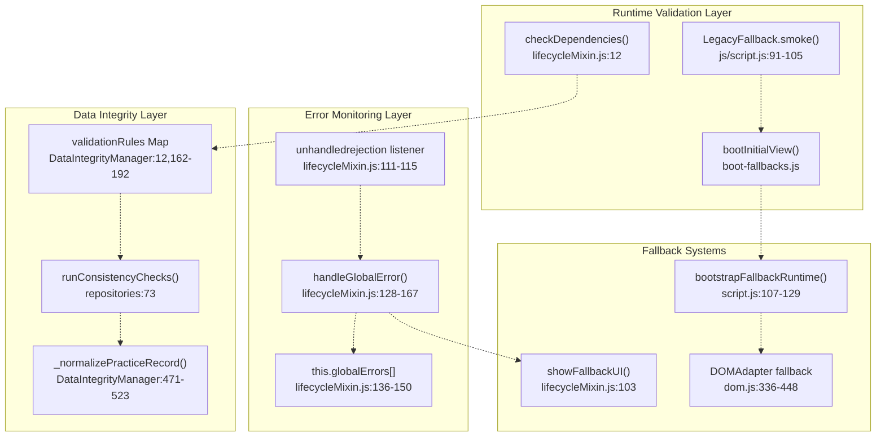
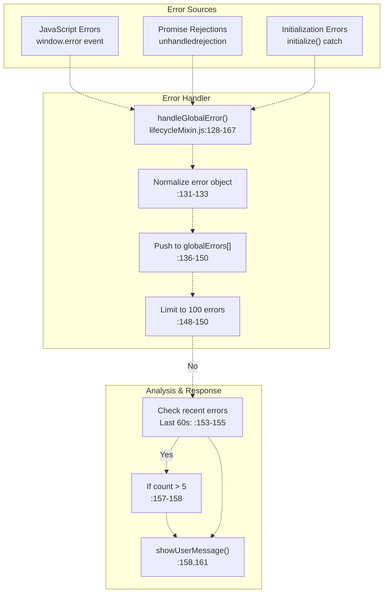
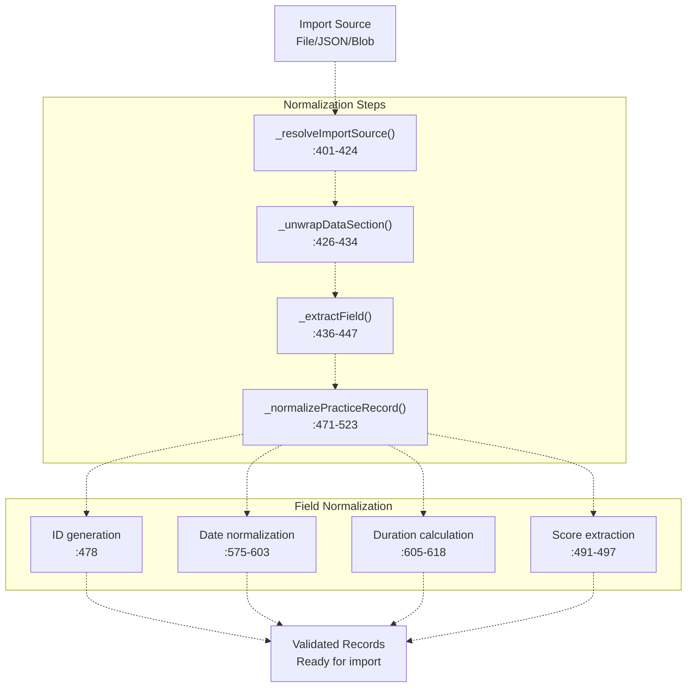
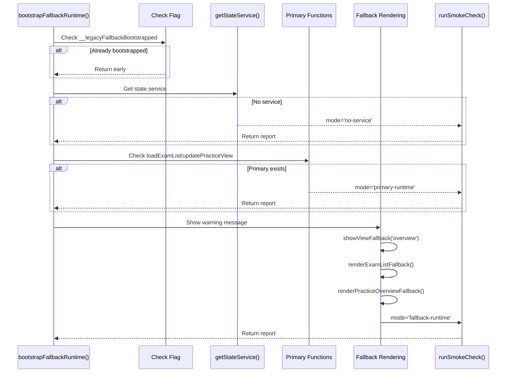
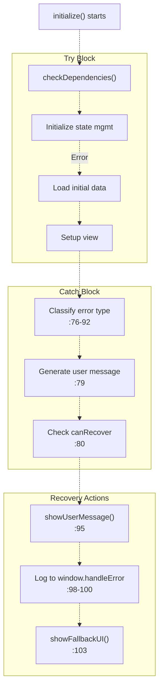
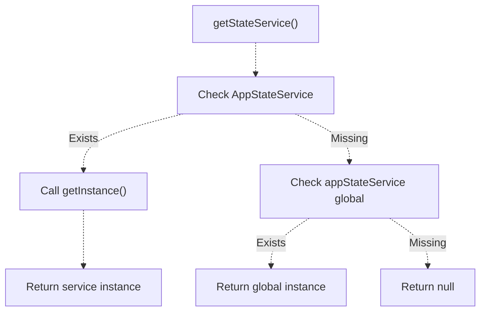
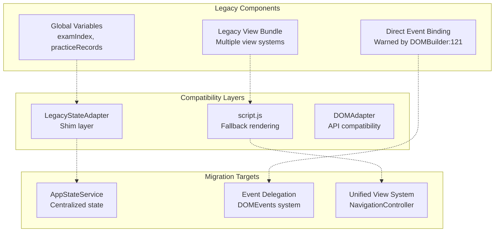
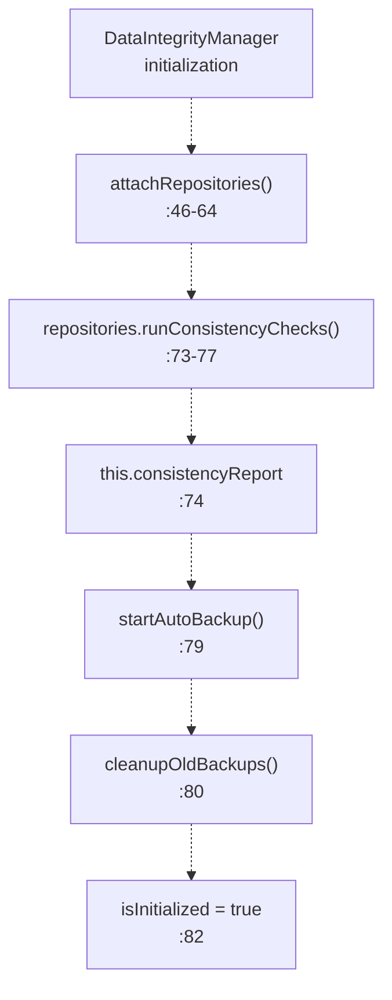

# Testing & Development

> **Relevant source files**
> * [js/app/lifecycleMixin.js](https://github.com/sallowayma-git/IELTS-practice/blob/92f64eb8/js/app/lifecycleMixin.js)
> * [js/components/DataIntegrityManager.js](https://github.com/sallowayma-git/IELTS-practice/blob/92f64eb8/js/components/DataIntegrityManager.js)
> * [js/core/goalManager.js](https://github.com/sallowayma-git/IELTS-practice/blob/92f64eb8/js/core/goalManager.js)
> * [js/script.js](https://github.com/sallowayma-git/IELTS-practice/blob/92f64eb8/js/script.js)
> * [js/utils/dom.js](https://github.com/sallowayma-git/IELTS-practice/blob/92f64eb8/js/utils/dom.js)

This page documents the testing infrastructure, development practices, error handling systems, and ongoing optimization efforts in the IELTS Practice System. It covers runtime validation, smoke testing, data integrity verification, and the technical debt management strategy.

For information about data backup and recovery operations, see [Data Backup, Import & Export](/sallowayma-git/IELTS-practice/4.4-data-backup-import-and-export). For details on data normalization and quality assurance, see [Data Normalization & Quality Assurance](/sallowayma-git/IELTS-practice/4.5-data-normalization-and-quality-assurance).

---

## Testing Infrastructure Overview

The IELTS Practice System employs a multi-layered testing and validation approach focused on runtime verification, data integrity, and graceful degradation. The architecture prioritizes resilience over comprehensive pre-deployment testing, with extensive error recovery mechanisms built into production code.

### Testing Layers



**Sources:** [js/script.js L91-L105](https://github.com/sallowayma-git/IELTS-practice/blob/92f64eb8/js/script.js#L91-L105)

 [js/app/lifecycleMixin.js L12-L70](https://github.com/sallowayma-git/IELTS-practice/blob/92f64eb8/js/app/lifecycleMixin.js#L12-L70)

 [js/components/DataIntegrityManager.js L162-L192](https://github.com/sallowayma-git/IELTS-practice/blob/92f64eb8/js/components/DataIntegrityManager.js#L162-L192)

 [js/utils/dom.js L336-L448](https://github.com/sallowayma-git/IELTS-practice/blob/92f64eb8/js/utils/dom.js#L336-L448)

---

## Smoke Testing System

The smoke testing system validates basic system functionality at runtime through the `LegacyFallback` module.

### Smoke Check Implementation

The `runSmokeCheck` function [js/script.js L91-L105](https://github.com/sallowayma-git/IELTS-practice/blob/92f64eb8/js/script.js#L91-L105)

 performs lightweight validation:

```javascript
function runSmokeCheck(mode, service) {
    const result = {
        mode,                          // 'no-service', 'primary-runtime', 'fallback-runtime', 'manual'
        timestamp: new Date().toISOString(),
        hasService: !!service,
        hasMessageCenter: typeof global.getMessageCenter === 'function',
        examCount: service ? service.getExamIndex().length : 
                   (Array.isArray(global.examIndex) ? global.examIndex.length : 0),
        recordCount: service ? service.getPracticeRecords().length : 
                     (Array.isArray(global.practiceRecords) ? global.practiceRecords.length : 0)
    };
    global.__legacySmokeReport = result;
    return result;
}
```

### Smoke Check Execution Points

| Execution Point | Mode | Condition | Location |
| --- | --- | --- | --- |
| No State Service | `no-service` | `!stateService` | [js/script.js L115](https://github.com/sallowayma-git/IELTS-practice/blob/92f64eb8/js/script.js#L115-L115) |
| Primary Runtime | `primary-runtime` | Core functions exist | [js/script.js L120](https://github.com/sallowayma-git/IELTS-practice/blob/92f64eb8/js/script.js#L120-L120) |
| Fallback Runtime | `fallback-runtime` | Using degraded mode | [js/script.js L128](https://github.com/sallowayma-git/IELTS-practice/blob/92f64eb8/js/script.js#L128-L128) |
| Manual Trigger | `manual` | `LegacyFallback.smoke()` call | [js/script.js L146](https://github.com/sallowayma-git/IELTS-practice/blob/92f64eb8/js/script.js#L146-L146) |

**Sources:** [js/script.js L91-L147](https://github.com/sallowayma-git/IELTS-practice/blob/92f64eb8/js/script.js#L91-L147)

---

## Error Handling & Monitoring

### Global Error Handler Architecture



**Sources:** [js/app/lifecycleMixin.js L109-L167](https://github.com/sallowayma-git/IELTS-practice/blob/92f64eb8/js/app/lifecycleMixin.js#L109-L167)

### Error Categorization

The initialization error handler [js/app/lifecycleMixin.js L75-L103](https://github.com/sallowayma-git/IELTS-practice/blob/92f64eb8/js/app/lifecycleMixin.js#L75-L103)

 classifies errors:

| Error Type | User Message | Recovery | Detection |
| --- | --- | --- | --- |
| Timeout | "系统组件加载超时，请刷新页面重试" | Yes | `.includes('组件加载超时')` |
| Dependency | "系统依赖检查失败" | No | `.includes('依赖')` |
| Network | "网络连接问题" | Yes | `.includes('网络')` |
| Unknown | "系统遇到未知错误" | No | Default case |

### Error Tracking Structure

```css
// Error tracking array structure <FileRef file-url="https://github.com/sallowayma-git/IELTS-practice/blob/92f64eb8/js/app/lifecycleMixin.js#L136-L145" min=136 max=145 file-path="js/app/lifecycleMixin.js">Hii</FileRef>
this.globalErrors.push({
    error: normalizedError.message || String(error),
    context: context,               // e.g., "Promise拒绝", "JavaScript错误"
    timestamp: Date.now(),
    stack: normalizedError.stack
});
```

**Sources:** [js/app/lifecycleMixin.js L66-L167](https://github.com/sallowayma-git/IELTS-practice/blob/92f64eb8/js/app/lifecycleMixin.js#L66-L167)

---

## Data Validation & Consistency

### Validation Rules System

The `DataIntegrityManager` defines validation rules for critical data structures [js/components/DataIntegrityManager.js L162-L192](https://github.com/sallowayma-git/IELTS-practice/blob/92f64eb8/js/components/DataIntegrityManager.js#L162-L192)

:

```javascript
this.validationRules.set('practice_records', {
    required: ['id', 'startTime'],
    types: {
        id: 'string',
        startTime: 'string',
        endTime: 'string',
        date: 'string',
        duration: 'number',
        examId: 'string',
        examTitle: 'string',
        scoreInfo: 'object'
    },
    validators: {
        startTime: (value) => !isNaN(new Date(value).getTime()),
        date: (value) => !value || !isNaN(new Date(value).getTime()),
        endTime: (value) => !value || !isNaN(new Date(value).getTime()),
        duration: (value) => typeof value === 'number' && value >= 0,
        id: (value) => typeof value === 'string' && value.length > 0
    }
});
```

### Data Normalization Pipeline



**Sources:** [js/components/DataIntegrityManager.js L390-L618](https://github.com/sallowayma-git/IELTS-practice/blob/92f64eb8/js/components/DataIntegrityManager.js#L390-L618)

### Field Normalization Methods

| Field | Method | Fallback Strategy | Location |
| --- | --- | --- | --- |
| `id` | `_stringify()` | Generate `imported_{timestamp}_{random}` | [js/components/DataIntegrityManager.js L478](https://github.com/sallowayma-git/IELTS-practice/blob/92f64eb8/js/components/DataIntegrityManager.js#L478-L478) |
| `examId` | `_stringify()` | Try `sessionId`, fallback `'imported_exam'` | [js/components/DataIntegrityManager.js L479](https://github.com/sallowayma-git/IELTS-practice/blob/92f64eb8/js/components/DataIntegrityManager.js#L479-L479) |
| `date` | `_normalizeDate()` | Try multiple formats, fallback `now` | [js/components/DataIntegrityManager.js L575-L603](https://github.com/sallowayma-git/IELTS-practice/blob/92f64eb8/js/components/DataIntegrityManager.js#L575-L603) |
| `duration` | `_pickDuration()` | Calculate from `startTime`/`endTime` | [js/components/DataIntegrityManager.js L605-L618](https://github.com/sallowayma-git/IELTS-practice/blob/92f64eb8/js/components/DataIntegrityManager.js#L605-L618) |
| `score` | `_pickNumber()` | Try multiple sources, fallback `0` | [js/components/DataIntegrityManager.js L491-L497](https://github.com/sallowayma-git/IELTS-practice/blob/92f64eb8/js/components/DataIntegrityManager.js#L491-L497) |

**Sources:** [js/components/DataIntegrityManager.js L471-L618](https://github.com/sallowayma-git/IELTS-practice/blob/92f64eb8/js/components/DataIntegrityManager.js#L471-L618)

---

## Dependency Checking

### Initialization Dependency Validation

The `checkDependencies` method [js/app/lifecycleMixin.js L12](https://github.com/sallowayma-git/IELTS-practice/blob/92f64eb8/js/app/lifecycleMixin.js#L12-L12)

 is called during initialization but implementation is not shown in provided files. It's invoked before state management initialization:

```css
// Initialization sequence <FileRef file-url="https://github.com/sallowayma-git/IELTS-practice/blob/92f64eb8/js/app/lifecycleMixin.js#L6-L49" min=6 max=49 file-path="js/app/lifecycleMixin.js">Hii</FileRef>
async initialize() {
    this.updateLoadingMessage('正在检查系统依赖...');
    this.checkDependencies();
    
    this.updateLoadingMessage('正在初始化状态管理...');
    this.initializeGlobalCompatibility();
    
    this.updateLoadingMessage('正在加载持久化状态...');
    await this.loadPersistedState();
    // ...
}
```

**Sources:** [js/app/lifecycleMixin.js L6-L49](https://github.com/sallowayma-git/IELTS-practice/blob/92f64eb8/js/app/lifecycleMixin.js#L6-L49)

---

## Integration Testing Patterns

### Fallback Runtime Testing

The fallback runtime [js/script.js L107-L129](https://github.com/sallowayma-git/IELTS-practice/blob/92f64eb8/js/script.js#L107-L129)

 tests degraded functionality:



**Sources:** [js/script.js L107-L129](https://github.com/sallowayma-git/IELTS-practice/blob/92f64eb8/js/script.js#L107-L129)

### Fallback Rendering Functions

| Function | Purpose | Fallback Behavior | Location |
| --- | --- | --- | --- |
| `showViewFallback()` | View switching | Basic CSS class toggling | [js/script.js L30-L40](https://github.com/sallowayma-git/IELTS-practice/blob/92f64eb8/js/script.js#L30-L40) |
| `renderExamListFallback()` | Exam list | Simple button list | [js/script.js L42-L73](https://github.com/sallowayma-git/IELTS-practice/blob/92f64eb8/js/script.js#L42-L73) |
| `renderPracticeOverviewFallback()` | Statistics | Basic stat display | [js/script.js L75-L89](https://github.com/sallowayma-git/IELTS-practice/blob/92f64eb8/js/script.js#L75-L89) |

**Sources:** [js/script.js L30-L89](https://github.com/sallowayma-git/IELTS-practice/blob/92f64eb8/js/script.js#L30-L89)

---

## Development Practices

### Error Recovery Patterns

#### Initialization Error Recovery



**Sources:** [js/app/lifecycleMixin.js L66-L104](https://github.com/sallowayma-git/IELTS-practice/blob/92f64eb8/js/app/lifecycleMixin.js#L66-L104)

#### Storage Quota Exceeded Recovery

When backup creation fails due to quota limits [js/components/DataIntegrityManager.js L132-L135](https://github.com/sallowayma-git/IELTS-practice/blob/92f64eb8/js/components/DataIntegrityManager.js#L132-L135)

:

```
if (error.name === 'QuotaExceededError' && data) {
    this.exportDataAsFallback(data);
}
```

The `exportDataAsFallback` method [js/components/DataIntegrityManager.js L139-L159](https://github.com/sallowayma-git/IELTS-practice/blob/92f64eb8/js/components/DataIntegrityManager.js#L139-L159)

 triggers an automatic browser download of the backup data.

**Sources:** [js/components/DataIntegrityManager.js L107-L159](https://github.com/sallowayma-git/IELTS-practice/blob/92f64eb8/js/components/DataIntegrityManager.js#L107-L159)

---

## Debugging Utilities

### DOM Event Delegation Warnings

The `DOMBuilder` warns about anti-patterns [js/utils/dom.js L121](https://github.com/sallowayma-git/IELTS-practice/blob/92f64eb8/js/utils/dom.js#L121-L121)

:

```
if (key.startsWith('on') && typeof value === 'function') {
    console.warn(`[DOMBuilder] Use event delegation instead of direct event binding`);
}
```

### Initialization Progress Tracking

Loading messages provide visibility into initialization stages [js/app/lifecycleMixin.js L9-L49](https://github.com/sallowayma-git/IELTS-practice/blob/92f64eb8/js/app/lifecycleMixin.js#L9-L49)

:

```
this.updateLoadingMessage('正在检查系统依赖...');
this.updateLoadingMessage('正在初始化状态管理...');
this.updateLoadingMessage('正在加载持久化状态...');
this.updateLoadingMessage('正在初始化响应式功能...');
this.updateLoadingMessage('正在加载系统组件...');
```

**Sources:** [js/app/lifecycleMixin.js L172-L177](https://github.com/sallowayma-git/IELTS-practice/blob/92f64eb8/js/app/lifecycleMixin.js#L172-L177)

 [js/utils/dom.js L121](https://github.com/sallowayma-git/IELTS-practice/blob/92f64eb8/js/utils/dom.js#L121-L121)

---

## Performance Monitoring

### Error Frequency Analysis

The global error handler monitors error frequency to detect systemic issues [js/app/lifecycleMixin.js L153-L162](https://github.com/sallowayma-git/IELTS-practice/blob/92f64eb8/js/app/lifecycleMixin.js#L153-L162)

:

```javascript
// Filter errors from last 60 seconds
const recentErrors = this.globalErrors.filter(
    e => Date.now() - e.timestamp < 60000
);

// Alert if too many recent errors
if (recentErrors.length > 5) {
    this.showUserMessage('系统遇到多个错误，建议刷新页面', 'warning');
}
```

### Event Delegation System

The `DOMEvents` class [js/utils/dom.js L10-L82](https://github.com/sallowayma-git/IELTS-practice/blob/92f64eb8/js/utils/dom.js#L10-L82)

 provides centralized event handling to reduce memory overhead:

```javascript
class DOMEvents {
    constructor() {
        this.delegates = new Map();
        this.setupGlobalDelegates();
    }
    
    // Global listeners for click, change, input, mouseenter, mouseleave
    setupGlobalDelegates() {
        document.addEventListener('click', (e) => {
            this.handleDelegatedEvent('click', e);
        });
        // ...
    }
}
```

**Sources:** [js/app/lifecycleMixin.js L153-L162](https://github.com/sallowayma-git/IELTS-practice/blob/92f64eb8/js/app/lifecycleMixin.js#L153-L162)

 [js/utils/dom.js L10-L82](https://github.com/sallowayma-git/IELTS-practice/blob/92f64eb8/js/utils/dom.js#L10-L82)

---

## Legacy Compatibility Layers

### State Service Adapter

The `getStateService` function [js/script.js L7-L17](https://github.com/sallowayma-git/IELTS-practice/blob/92f64eb8/js/script.js#L7-L17)

 provides backward compatibility:



This allows code to work with either:

* Modern `AppStateService.getInstance()`
* Legacy `window.appStateService` global

**Sources:** [js/script.js L7-L17](https://github.com/sallowayma-git/IELTS-practice/blob/92f64eb8/js/script.js#L7-L17)

### DOM Adapter Fallback

The `DOMAdapter` [js/utils/dom.js L336-L448](https://github.com/sallowayma-git/IELTS-practice/blob/92f64eb8/js/utils/dom.js#L336-L448)

 provides fallback implementations:

```sql
global.DOMAdapter = {
    create: function(tag, attributes, children) {
        if (global.DOM && typeof global.DOM.create === 'function') {
            return global.DOM.create(tag, attributes, children);
        }
        return fallbackCreate(tag, attributes, children);
    },
    // Similar fallbacks for replaceContent, fragment, text
};
```

**Sources:** [js/utils/dom.js L336-L448](https://github.com/sallowayma-git/IELTS-practice/blob/92f64eb8/js/utils/dom.js#L336-L448)

---

## Technical Debt & Refactoring

### Known Technical Debt Areas



**Sources:** [js/script.js L1-L148](https://github.com/sallowayma-git/IELTS-practice/blob/92f64eb8/js/script.js#L1-L148)

 [js/utils/dom.js L121](https://github.com/sallowayma-git/IELTS-practice/blob/92f64eb8/js/utils/dom.js#L121-L121)

 [js/utils/dom.js L336-L448](https://github.com/sallowayma-git/IELTS-practice/blob/92f64eb8/js/utils/dom.js#L336-L448)

### Deprecated Patterns

| Pattern | Location | Migration Path | Status |
| --- | --- | --- | --- |
| Global variables for data | `window.examIndex`, `window.practiceRecords` | Use `AppStateService` | Shimmed |
| Direct event binding | `element.onclick = handler` | Use `DOM.delegate()` | Warned |
| Inline event handlers | `<button onclick="...">` | Use event delegation | Deprecated |
| Manual DOM manipulation | `innerHTML` assignments | Use `DOMBuilder` | Migrating |

**Sources:** [js/utils/dom.js L121](https://github.com/sallowayma-git/IELTS-practice/blob/92f64eb8/js/utils/dom.js#L121-L121)

---

## Cleanup & Resource Management

### Application Destruction Sequence

The `destroy` method [js/app/lifecycleMixin.js L549-L601](https://github.com/sallowayma-git/IELTS-practice/blob/92f64eb8/js/app/lifecycleMixin.js#L549-L601)

 performs comprehensive cleanup:

```javascript
destroy() {
    // 1. Persist state
    this.persistMultipleState({...});
    
    // 2. Remove event listeners
    window.removeEventListener('resize', this.handleResize);
    
    // 3. Clear intervals
    if (this.sessionMonitorInterval) {
        clearInterval(this.sessionMonitorInterval);
    }
    
    // 4. Close exam windows
    this.examWindows.forEach((windowData, examId) => {
        if (windowData.window && !windowData.window.closed) {
            windowData.window.close();
        }
        this.cleanupExamSession(examId);
    });
    
    // 5. Clear collections
    this.state.practice.selectedRecords.clear();
    this.state.system.processedSessions.clear();
    
    // 6. Destroy components
    Object.values(this.components).forEach(component => {
        if (component && typeof component.destroy === 'function') {
            component.destroy();
        }
    });
    
    this.isInitialized = false;
}
```

**Sources:** [js/app/lifecycleMixin.js L549-L601](https://github.com/sallowayma-git/IELTS-practice/blob/92f64eb8/js/app/lifecycleMixin.js#L549-L601)

---

## Data Integrity Verification

### Consistency Check Integration



**Sources:** [js/components/DataIntegrityManager.js L46-L87](https://github.com/sallowayma-git/IELTS-practice/blob/92f64eb8/js/components/DataIntegrityManager.js#L46-L87)

### Automatic Backup Verification

The automatic backup system [js/components/DataIntegrityManager.js L194-L224](https://github.com/sallowayma-git/IELTS-practice/blob/92f64eb8/js/components/DataIntegrityManager.js#L194-L224)

 runs every 10 minutes:

```javascript
this.backupInterval = 600000; // 10分钟自动备份
this.maxBackups = 5;          // 最多保留5个备份

startAutoBackup() {
    if (this.backupTimer) {
        clearInterval(this.backupTimer);
    }
    this.backupTimer = setInterval(() => {
        this.performAutoBackup();
    }, this.backupInterval);
}
```

**Sources:** [js/components/DataIntegrityManager.js L8-L224](https://github.com/sallowayma-git/IELTS-practice/blob/92f64eb8/js/components/DataIntegrityManager.js#L8-L224)

---

## Summary

The IELTS Practice System testing infrastructure emphasizes:

1. **Runtime Validation** - Smoke checks and dependency validation at multiple initialization stages
2. **Error Recovery** - Comprehensive error handling with frequency analysis and automatic fallback modes
3. **Data Integrity** - Multi-stage validation, normalization, and consistency checking for all imported data
4. **Legacy Support** - Compatibility layers and adapters maintain backward compatibility during migration
5. **Resource Management** - Systematic cleanup and disposal of resources, timers, and window references
6. **Development Tools** - Warning systems, debug logging, and progress tracking for development visibility

The architecture prioritizes **graceful degradation** over comprehensive testing, with fallback implementations ensuring basic functionality even when modern components fail to load.

**Sources:** [js/script.js L1-L148](https://github.com/sallowayma-git/IELTS-practice/blob/92f64eb8/js/script.js#L1-L148)

 [js/app/lifecycleMixin.js L1-L607](https://github.com/sallowayma-git/IELTS-practice/blob/92f64eb8/js/app/lifecycleMixin.js#L1-L607)

 [js/components/DataIntegrityManager.js L1-L636](https://github.com/sallowayma-git/IELTS-practice/blob/92f64eb8/js/components/DataIntegrityManager.js#L1-L636)

 [js/utils/dom.js L1-L448](https://github.com/sallowayma-git/IELTS-practice/blob/92f64eb8/js/utils/dom.js#L1-L448)