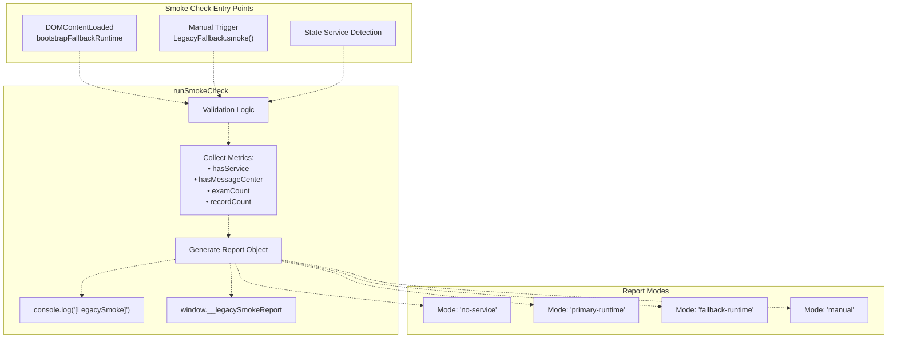
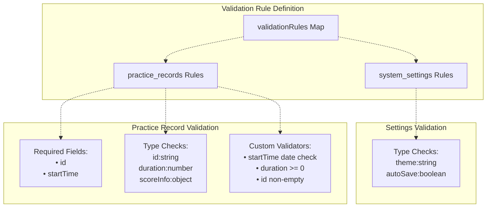
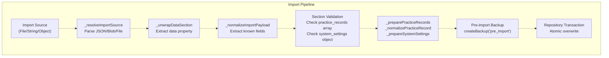
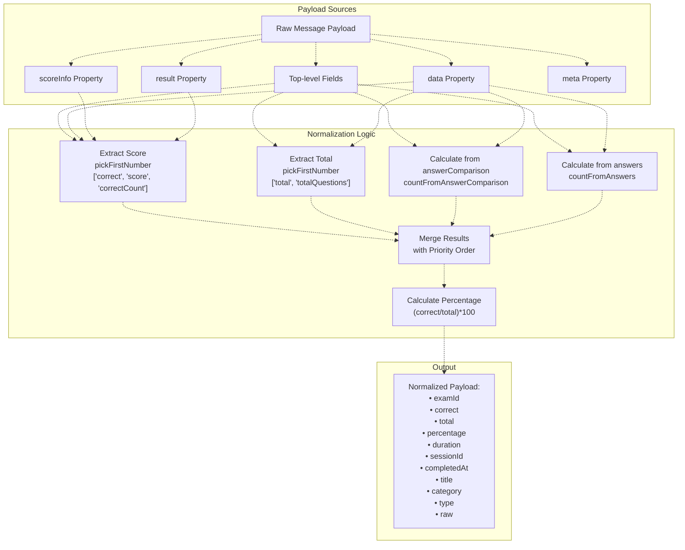
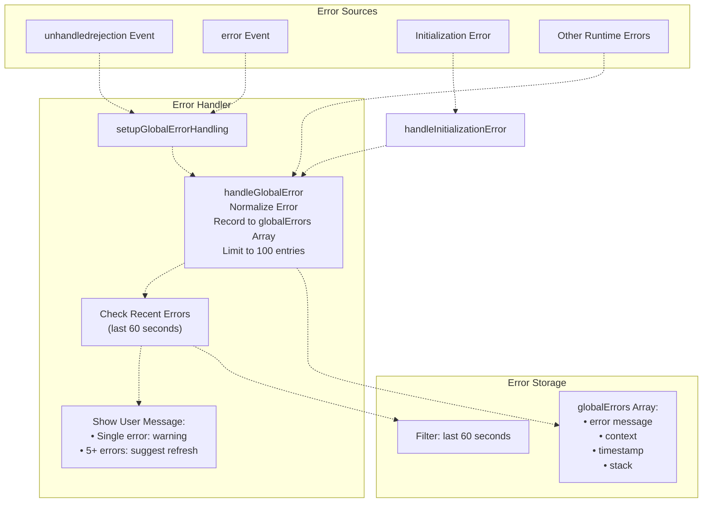

# Testing Infrastructure

> **Relevant source files**
> * [js/app/lifecycleMixin.js](https://github.com/sallowayma-git/IELTS-practice/blob/92f64eb8/js/app/lifecycleMixin.js)
> * [js/components/DataIntegrityManager.js](https://github.com/sallowayma-git/IELTS-practice/blob/92f64eb8/js/components/DataIntegrityManager.js)
> * [js/plugins/themes/theme-adapter-base.js](https://github.com/sallowayma-git/IELTS-practice/blob/92f64eb8/js/plugins/themes/theme-adapter-base.js)
> * [js/script.js](https://github.com/sallowayma-git/IELTS-practice/blob/92f64eb8/js/script.js)

## Purpose and Scope

This document describes the testing infrastructure of the IELTS practice system. The system employs a pragmatic testing approach focused on runtime validation, data integrity verification, and smoke testing rather than traditional unit test frameworks. The testing infrastructure is integrated directly into the production codebase to provide continuous validation of system state, data consistency, and component initialization.

For information about data quality assurance during normal operations, see [Data Normalization & Quality Assurance](/sallowayma-git/IELTS-practice/4.5-data-normalization-and-quality-assurance). For backup and recovery testing, see [Data Backup, Import & Export](/sallowayma-git/IELTS-practice/4.4-data-backup-import-and-export).

---

## Testing Philosophy

The IELTS practice system uses an **embedded testing approach** where validation logic is integrated into production components rather than maintained as separate test suites. This design prioritizes:

| Priority | Description | Implementation |
| --- | --- | --- |
| **Runtime Validation** | Continuous checking during normal operation | Validation rules in `DataIntegrityManager`, error handlers in `lifecycleMixin` |
| **Data Integrity** | Ensuring data consistency across storage backends | Consistency checks in repositories, normalization utilities |
| **Smoke Testing** | Quick validation of system health | `runSmokeCheck` function in `script.js` |
| **Graceful Degradation** | System remains functional despite errors | Fallback modes, error boundaries, compatibility layers |
| **Development Feedback** | Rich console logging for debugging | Structured logging throughout all components |

The system does not currently include:

* Traditional unit test frameworks (Jest, Mocha, etc.)
* Automated E2E test suites (though Playwright is mentioned in documentation)
* Code coverage measurement
* Continuous integration test pipelines

---

## Smoke Testing System

### Overview

The smoke testing system provides rapid validation of core functionality during initialization and after major state changes. It verifies that critical components are loaded and data structures are accessible.

### LegacySmokeReport Structure



**Diagram: Smoke Testing Flow**

Sources: [js/script.js L91-L105](https://github.com/sallowayma-git/IELTS-practice/blob/92f64eb8/js/script.js#L91-L105)

 [js/script.js L107-L129](https://github.com/sallowayma-git/IELTS-practice/blob/92f64eb8/js/script.js#L107-L129)

### Smoke Check Implementation

The `runSmokeCheck` function validates system health:

[js/script.js L91-L105](https://github.com/sallowayma-git/IELTS-practice/blob/92f64eb8/js/script.js#L91-L105)

**Smoke Check Metrics:**

| Metric | Type | Purpose |
| --- | --- | --- |
| `mode` | String | Execution context ('no-service', 'primary-runtime', 'fallback-runtime', 'manual') |
| `timestamp` | ISO String | When the check was performed |
| `hasService` | Boolean | Whether `AppStateService` is available |
| `hasMessageCenter` | Boolean | Whether message center utility is loaded |
| `examCount` | Number | Total exams in index (from service or global) |
| `recordCount` | Number | Total practice records (from service or global) |

### Bootstrap Smoke Testing

The system performs smoke checks during fallback bootstrap:

[js/script.js L107-L129](https://github.com/sallowayma-git/IELTS-practice/blob/92f64eb8/js/script.js#L107-L129)

The bootstrap process attempts to:

1. Detect if `AppStateService` is available
2. Check if primary runtime functions (`loadExamList`, `updatePracticeView`) exist
3. Fall back to degraded mode if primary runtime is unavailable
4. Render fallback UI with available data
5. Log the smoke report for debugging

Sources: [js/script.js L91-L129](https://github.com/sallowayma-git/IELTS-practice/blob/92f64eb8/js/script.js#L91-L129)

---

## Data Validation Framework

### Validation Rules System

The `DataIntegrityManager` implements a comprehensive validation framework using rule-based validation:



**Diagram: Validation Rule Architecture**

### Practice Record Validation Rules

[js/components/DataIntegrityManager.js L162-L182](https://github.com/sallowayma-git/IELTS-practice/blob/92f64eb8/js/components/DataIntegrityManager.js#L162-L182)

**Validation Rule Structure:**

| Component | Description | Example |
| --- | --- | --- |
| `required` | Array of mandatory field names | `['id', 'startTime']` |
| `types` | Expected type for each field | `{ id: 'string', duration: 'number' }` |
| `validators` | Custom validation functions | `startTime: (v) => !isNaN(new Date(v))` |

### Import Data Validation

The import process performs multi-stage validation:



**Diagram: Import Validation Pipeline**

### Record Normalization Process

The `_normalizePracticeRecord` method performs extensive field normalization:

[js/components/DataIntegrityManager.js L471-L523](https://github.com/sallowayma-git/IELTS-practice/blob/92f64eb8/js/components/DataIntegrityManager.js#L471-L523)

**Normalization Strategy:**

| Field | Fallback Chain | Transformation |
| --- | --- | --- |
| `id` | `record.id` → generated | Stringify, or generate `imported_${timestamp}_${random}` |
| `examId` | `examId` → `sessionId` → default | Stringify, default to 'imported_exam' |
| `title` | `title` → `examTitle` → `examId` | Stringify |
| `date` | `date` → `startTime` → `createdAt` → now | ISO string normalization |
| `duration` | `duration` → `realData.duration` → calculated | Seconds or ms to seconds, calculate from timestamps |
| `score` | `score` → `realData.score` → `percentage` | Pick first valid number, default 0 |

### Normalization Utility Methods

The manager includes helper methods for safe value extraction:

* `_stringify(value)` - Safe string conversion [js/components/DataIntegrityManager.js L539-L544](https://github.com/sallowayma-git/IELTS-practice/blob/92f64eb8/js/components/DataIntegrityManager.js#L539-L544)
* `_pickString(values)` - First non-empty string from array [js/components/DataIntegrityManager.js L546-L553](https://github.com/sallowayma-git/IELTS-practice/blob/92f64eb8/js/components/DataIntegrityManager.js#L546-L553)
* `_pickNumber(values, fallback)` - First finite number [js/components/DataIntegrityManager.js L555-L563](https://github.com/sallowayma-git/IELTS-practice/blob/92f64eb8/js/components/DataIntegrityManager.js#L555-L563)
* `_pickInteger(values, fallback)` - First integer [js/components/DataIntegrityManager.js L565-L573](https://github.com/sallowayma-git/IELTS-practice/blob/92f64eb8/js/components/DataIntegrityManager.js#L565-L573)
* `_normalizeDate(value)` - Flexible date parsing [js/components/DataIntegrityManager.js L575-L603](https://github.com/sallowayma-git/IELTS-practice/blob/92f64eb8/js/components/DataIntegrityManager.js#L575-L603)
* `_pickDuration(values, start, end)` - Duration extraction with calculation [js/components/DataIntegrityManager.js L605-L618](https://github.com/sallowayma-git/IELTS-practice/blob/92f64eb8/js/components/DataIntegrityManager.js#L605-L618)

Sources: [js/components/DataIntegrityManager.js L162-L619](https://github.com/sallowayma-git/IELTS-practice/blob/92f64eb8/js/components/DataIntegrityManager.js#L162-L619)

---

## Consistency Checking

### Repository-Level Consistency

The `DataIntegrityManager` performs consistency checks across repositories:

[js/components/DataIntegrityManager.js L66-L87](https://github.com/sallowayma-git/IELTS-practice/blob/92f64eb8/js/components/DataIntegrityManager.js#L66-L87)

The initialization process:

1. Attaches to repositories when available
2. Runs initial consistency checks via `repositories.runConsistencyChecks()`
3. Stores report in `this.consistencyReport`
4. Continues initialization even if checks fail (logged warning)
5. Starts automatic backup after successful initialization

### Consistency Report Structure

The consistency report tracks:

* Cross-repository data integrity
* Orphaned references (practice records referencing non-existent exams)
* Duplicate detection
* Schema version compatibility
* Storage backend synchronization status

The report is accessible at runtime via the manager instance.

Sources: [js/components/DataIntegrityManager.js L66-L87](https://github.com/sallowayma-git/IELTS-practice/blob/92f64eb8/js/components/DataIntegrityManager.js#L66-L87)

---

## Cross-Window Message Validation

### Practice Payload Normalization

The `ThemeAdapterBase` includes sophisticated payload normalization for practice completion messages:



**Diagram: Practice Payload Normalization**

### Message Type Validation

The adapter validates message types against known completion types:

[js/plugins/themes/theme-adapter-base.js L33-L44](https://github.com/sallowayma-git/IELTS-practice/blob/92f64eb8/js/plugins/themes/theme-adapter-base.js#L33-L44)

**Recognized Completion Message Types:**

* `PRACTICE_COMPLETE`
* `PRACTICE_COMPLETED`
* `SESSION_COMPLETE`
* `SESSION_COMPLETED`
* `EXAM_FINISHED`
* `QUIZ_COMPLETE`
* `QUIZ_COMPLETED`
* `TEST_COMPLETE`
* `LESSON_COMPLETE`
* `WORKOUT_COMPLETE`

### Answer Comparison Validation

The normalization process includes sophisticated answer comparison:

[js/plugins/themes/theme-adapter-base.js L317-L346](https://github.com/sallowayma-git/IELTS-practice/blob/92f64eb8/js/plugins/themes/theme-adapter-base.js#L317-L346)

This function:

1. Extracts answer entries from arrays or objects
2. Checks each entry for boolean `true` value
3. Parses JSON strings that might contain result objects
4. Validates object properties (`isCorrect`, `correct`, `result`)
5. Returns `{ total, correct }` counts

Sources: [js/plugins/themes/theme-adapter-base.js L33-L493](https://github.com/sallowayma-git/IELTS-practice/blob/92f64eb8/js/plugins/themes/theme-adapter-base.js#L33-L493)

---

## Runtime Error Monitoring

### Global Error Handling

The `lifecycleMixin` implements comprehensive runtime error monitoring:



**Diagram: Runtime Error Monitoring Architecture**

### Error Tracking Implementation

[js/app/lifecycleMixin.js L109-L123](https://github.com/sallowayma-git/IELTS-practice/blob/92f64eb8/js/app/lifecycleMixin.js#L109-L123)

The system:

1. Installs listeners for `unhandledrejection` and `error` events
2. Prevents default browser error handling
3. Normalizes all errors to a consistent format
4. Routes to `handleGlobalError` for processing

### Error Recording and Thresholds

[js/app/lifecycleMixin.js L128-L167](https://github.com/sallowayma-git/IELTS-practice/blob/92f64eb8/js/app/lifecycleMixin.js#L128-L167)

**Error Management Strategy:**

| Threshold | Action | Purpose |
| --- | --- | --- |
| 100 errors | Trim to last 50 | Prevent memory bloat |
| 5 errors in 60s | Show "multiple errors" warning | Alert user to systemic issues |
| 1 error | Show "can continue" warning | Inform but don't alarm |
| Cross-origin errors | Silent (logged only) | Avoid noise from external scripts |

### Initialization Error Classification

[js/app/lifecycleMixin.js L75-L104](https://github.com/sallowayma-git/IELTS-practice/blob/92f64eb8/js/app/lifecycleMixin.js#L75-L104)

The system classifies initialization errors by type:

| Error Pattern | User Message | Recoverable |
| --- | --- | --- |
| "组件加载超时" (timeout) | Component loading timeout, refresh | Yes |
| "依赖" (dependency) | Dependency check failed | No |
| "网络" (network) | Network connection issue | Yes |
| Unknown | Contact technical support | No |

Sources: [js/app/lifecycleMixin.js L75-L167](https://github.com/sallowayma-git/IELTS-practice/blob/92f64eb8/js/app/lifecycleMixin.js#L75-L167)

---

## Development Testing Utilities

### Type Normalization Testing

The `ThemeAdapterBase` includes exportable utilities for testing:

[js/plugins/themes/theme-adapter-base.js L1416-L1427](https://github.com/sallowayma-git/IELTS-practice/blob/92f64eb8/js/plugins/themes/theme-adapter-base.js#L1416-L1427)

**Exported Test Utilities:**

| Utility | Purpose | Usage |
| --- | --- | --- |
| `normalizeType` | Test type field normalization | Validate 'reading'/'listening' conversion |
| `normalizeExamTypes` | Test bulk exam normalization | Validate array processing |
| `deduplicateRecords` | Test deduplication logic | Validate sessionId-based dedup |
| `getRecordTimestamp` | Test timestamp extraction | Validate date parsing priority |
| `normalizeMessageType` | Test message type conversion | Validate uppercase normalization |
| `normalizePracticePayload` | Test payload normalization | Validate multi-source field extraction |
| `STORAGE_KEYS` | Storage key constants | Reference for test data setup |
| `VALID_TYPES` | Valid type set | Reference for validation tests |
| `PATH_FALLBACK_ORDER` | Path resolution order | Reference for path testing |
| `PRACTICE_COMPLETE_TYPES` | Completion message types | Reference for message validation |

These utilities are accessible via `ThemeAdapterBase._utils` and can be used in browser console for ad-hoc testing:

```typescript
// Example: Test type normalization
ThemeAdapterBase._utils.normalizeType('read'); // => 'reading'
ThemeAdapterBase._utils.normalizeType('listening'); // => 'listening'

// Example: Test payload normalization
const testPayload = {
  data: { correct: 8, total: 10 },
  sessionId: 'test_123'
};
const normalized = ThemeAdapterBase._utils.normalizePracticePayload(testPayload);
console.log(normalized.percentage); // => 80
```

### Dependency Checking

The lifecycle mixin checks for required dependencies:

[js/app/lifecycleMixin.js L12](https://github.com/sallowayma-git/IELTS-practice/blob/92f64eb8/js/app/lifecycleMixin.js#L12-L12)

This check validates that critical components are loaded before proceeding with initialization. If dependencies are missing, the system triggers the fallback error path.

### Loading State Validation

The initialization process includes progress tracking:

[js/app/lifecycleMixin.js L8-L49](https://github.com/sallowayma-git/IELTS-practice/blob/92f64eb8/js/app/lifecycleMixin.js#L8-L49)

Each initialization stage updates a loading message, providing visibility into where failures occur:

* "正在检查系统依赖..." (Checking dependencies)
* "正在初始化状态管理..." (Initializing state management)
* "正在加载持久化状态..." (Loading persisted state)
* "正在初始化响应式功能..." (Initializing responsive features)
* "正在加载系统组件..." (Loading system components)
* "正在设置事件监听器..." (Setting up event listeners)
* "正在初始化遗留组件..." (Initializing legacy components)
* "正在加载初始数据..." (Loading initial data)
* "正在设置用户界面..." (Setting up user interface)

Sources: [js/app/lifecycleMixin.js L1-L70](https://github.com/sallowayma-git/IELTS-practice/blob/92f64eb8/js/app/lifecycleMixin.js#L1-L70)

 [js/plugins/themes/theme-adapter-base.js L1416-L1427](https://github.com/sallowayma-git/IELTS-practice/blob/92f64eb8/js/plugins/themes/theme-adapter-base.js#L1416-L1427)

---

## Testing Recommendations

### Current Testing Gaps

The system would benefit from:

1. **Automated E2E Tests**: Playwright tests for critical user flows (opening exams, completing practice, viewing history)
2. **Unit Test Coverage**: Jest/Mocha tests for data normalization utilities, validation rules, and calculation logic
3. **Integration Test Suite**: Tests for import/export workflows, cross-window communication, storage backend fallbacks
4. **Performance Testing**: Baseline measurements for large dataset operations (1000+ records)
5. **Accessibility Testing**: Automated checks for ARIA compliance, keyboard navigation

### Manual Testing Procedures

**Smoke Test Procedure:**

1. Open developer console
2. Run `LegacyFallback.smoke()`
3. Verify `__legacySmokeReport.examCount > 0`
4. Verify `__legacySmokeReport.hasService === true`

**Import Validation Procedure:**

1. Export current data via Settings Panel
2. Modify exported JSON (change record counts, add invalid fields)
3. Import modified data
4. Check console for normalization warnings
5. Verify `DataIntegrityManager` created pre-import backup
6. Verify data appears correct in Practice History

**Error Recovery Procedure:**

1. Trigger intentional error (modify global function)
2. Observe error captured in console with `[App]` prefix
3. Verify user sees warning message
4. Verify system continues operating (degraded mode if necessary)
5. Check `window.app.globalErrors` array for error record

Sources: [js/script.js L91-L148](https://github.com/sallowayma-git/IELTS-practice/blob/92f64eb8/js/script.js#L91-L148)

 [js/components/DataIntegrityManager.js L290-L342](https://github.com/sallowayma-git/IELTS-practice/blob/92f64eb8/js/components/DataIntegrityManager.js#L290-L342)

 [js/app/lifecycleMixin.js L109-L167](https://github.com/sallowayma-git/IELTS-practice/blob/92f64eb8/js/app/lifecycleMixin.js#L109-L167)