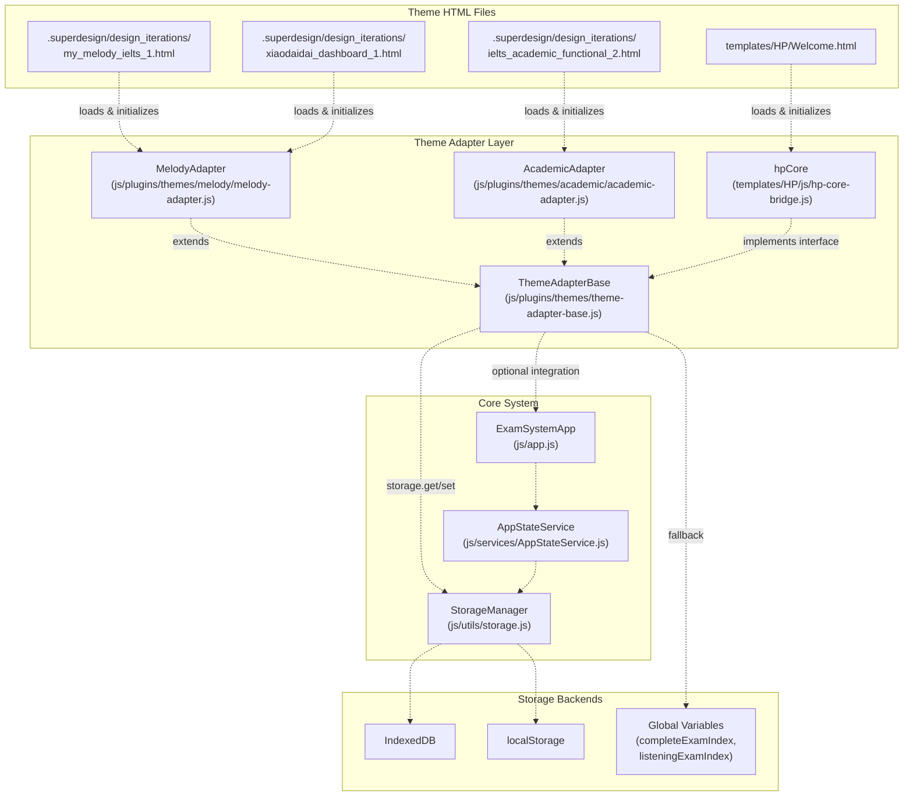
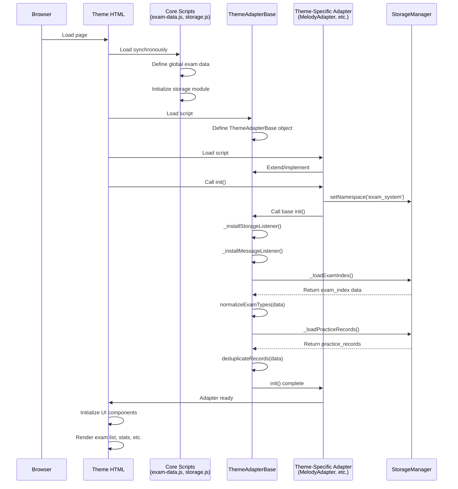
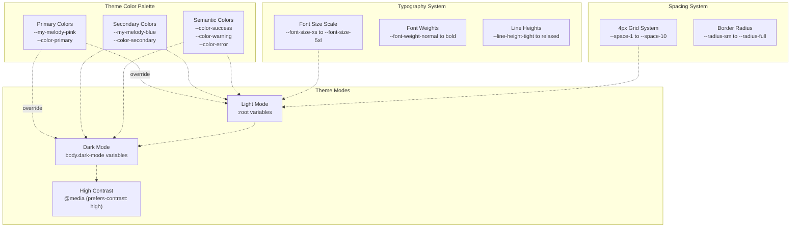
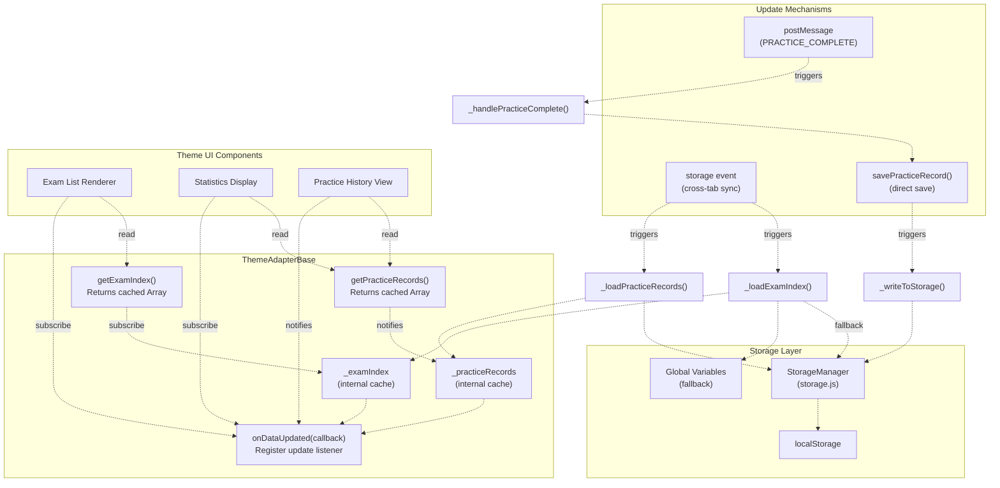
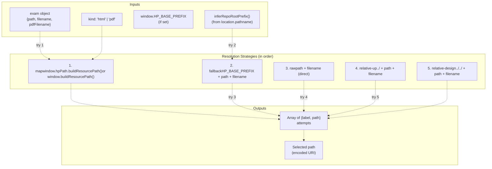
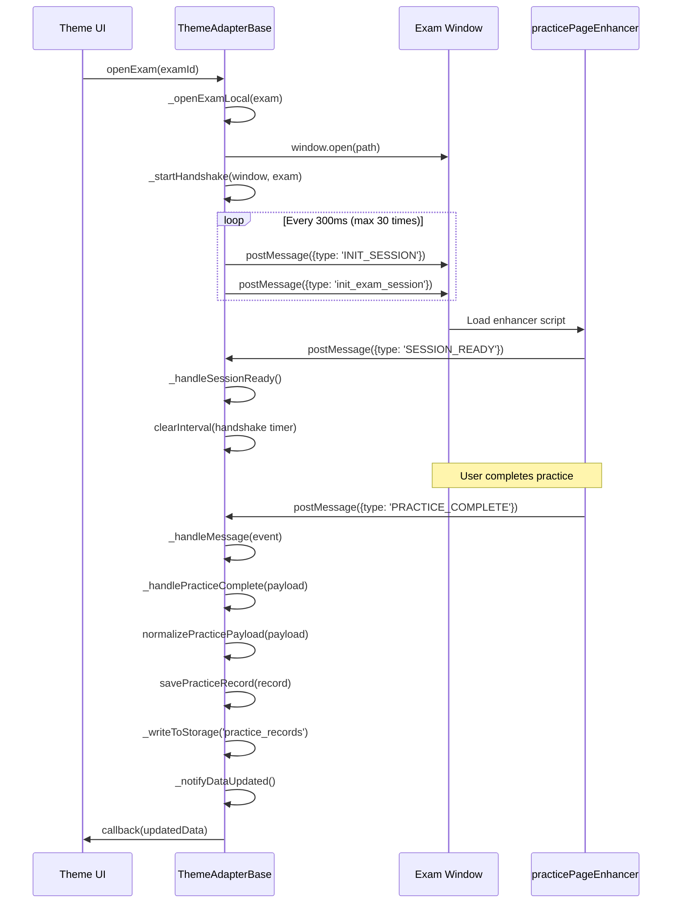
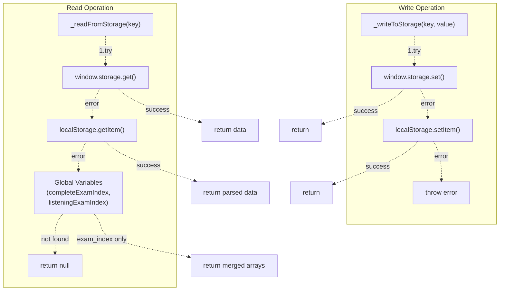

# Theme Architecture Overview

> **Relevant source files**
> * [.gitignore](https://github.com/sallowayma-git/IELTS-practice/blob/92f64eb8/.gitignore)
> * [.superdesign/design_iterations/ielts_academic_functional_2.html](https://github.com/sallowayma-git/IELTS-practice/blob/92f64eb8/.superdesign/design_iterations/ielts_academic_functional_2.html)
> * [.superdesign/design_iterations/my_melody_ielts_1.html](https://github.com/sallowayma-git/IELTS-practice/blob/92f64eb8/.superdesign/design_iterations/my_melody_ielts_1.html)
> * [js/plugins/themes/theme-adapter-base.js](https://github.com/sallowayma-git/IELTS-practice/blob/92f64eb8/js/plugins/themes/theme-adapter-base.js)

## Purpose and Scope

This document describes the theme architecture that enables the IELTS practice system to support multiple visual variants (My Melody, Academic, HP, XiaoDai) while maintaining a unified interface to the core application. It covers:

* The **ThemeAdapterBase** abstraction that provides consistent data access across themes
* The relationship between theme HTML files and their corresponding adapters
* Theme initialization and bootstrap sequences
* Data synchronization between themes and the core storage system

For details on specific theme implementations, see [Theme Variants](/sallowayma-git/IELTS-practice/7.3-theme-variants-(melody-academic-xiaodai)). For runtime theme switching functionality, see [Runtime Theme Management](/sallowayma-git/IELTS-practice/7.4-runtime-theme-management). For HP theme-specific architecture, see [HP Core Bridge Architecture](/sallowayma-git/IELTS-practice/8.2-hp-core-bridge-architecture).

## Architecture Overview

The theme system uses an adapter pattern to decouple theme-specific UI implementations from the core application logic. Each theme HTML file loads a theme-specific adapter that implements the `ThemeAdapterBase` interface, providing unified access to exam data, practice records, and system functions.

### Theme System Component Diagram



**Sources:** [.superdesign/design_iterations/my_melody_ielts_1.html L17-L30](https://github.com/sallowayma-git/IELTS-practice/blob/92f64eb8/.superdesign/design_iterations/my_melody_ielts_1.html#L17-L30)

 [js/plugins/themes/theme-adapter-base.js L1-L1434](https://github.com/sallowayma-git/IELTS-practice/blob/92f64eb8/js/plugins/themes/theme-adapter-base.js#L1-L1434)

## ThemeAdapterBase: The Unified Interface

The `ThemeAdapterBase` object (not a class) provides a consistent API for all theme variants to access system data and functionality without tight coupling to the core application. It serves as a compatibility layer that works whether the full `ExamSystemApp` is loaded or not.

### Core Responsibilities

| Responsibility | Methods | Storage Keys |
| --- | --- | --- |
| **Data Access** | `getExamIndex()`, `getPracticeRecords()`, `getExamById(id)` | `exam_index`, `practice_records`, `active_exam_index_key` |
| **Data Persistence** | `savePracticeRecord(record)` | `practice_records` |
| **Resource Resolution** | `buildResourcePath(exam, kind)`, `getResourceAttempts(exam, kind)` | N/A |
| **Window Management** | `openExam(examOrId, options)` | N/A |
| **Event Synchronization** | `onDataUpdated(callback)`, `onMessage(type, callback)` | Listens to `storage` events |
| **UI Feedback** | `showMessage(message, type, duration)` | N/A |

### ThemeAdapterBase API Structure

```mermaid
flowchart TD

Init["init(options)"]
GetExamIndex["getExamIndex()"]
GetRecords["getPracticeRecords()"]
GetExamById["getExamById(id)"]
SaveRecord["savePracticeRecord(record)"]
BuildPath["buildResourcePath(exam, kind)"]
OpenExam["openExam(examOrId, options)"]
OnDataUpdated["onDataUpdated(callback)"]
OnMessage["onMessage(type, callback)"]
ShowMessage["showMessage(message, type)"]
ExamIndex["_examIndex: Array"]
PracticeRecords["_practiceRecords: Array"]
Callbacks["_callbacks: Array"]
MessageCallbacks["_messageCallbacks: Array"]
ActiveSessions["_activeSessions: Map"]
LoadExamIndex["_loadExamIndex()"]
LoadRecords["_loadPracticeRecords()"]
ReadStorage["_readFromStorage(key)"]
WriteStorage["_writeToStorage(key, value)"]
HandleMessage["_handleMessage(event)"]
HandleComplete["_handlePracticeComplete(payload)"]
StartHandshake["_startHandshake(window, exam)"]
NotifyCallbacks["_notifyDataUpdated(data)"]

Init -.-> LoadExamIndex
Init -.-> LoadRecords
GetExamIndex -.-> ExamIndex
GetRecords -.-> PracticeRecords
SaveRecord -.-> WriteStorage
SaveRecord -.-> NotifyCallbacks
OpenExam -.-> StartHandshake
HandleComplete -.-> SaveRecord

subgraph subGraph2 ["Internal Methods"]
    LoadExamIndex
    LoadRecords
    ReadStorage
    WriteStorage
    HandleMessage
    HandleComplete
    StartHandshake
    NotifyCallbacks
    LoadExamIndex -.-> ReadStorage
    LoadRecords -.-> ReadStorage
    HandleMessage -.-> HandleComplete
end

subgraph subGraph1 ["Internal State"]
    ExamIndex
    PracticeRecords
    Callbacks
    MessageCallbacks
    ActiveSessions
end

subgraph subGraph0 ["Public API"]
    Init
    GetExamIndex
    GetRecords
    GetExamById
    SaveRecord
    BuildPath
    OpenExam
    OnDataUpdated
    OnMessage
    ShowMessage
end
```



**Sources:** [js/plugins/themes/theme-adapter-base.js L499-L1413](https://github.com/sallowayma-git/IELTS-practice/blob/92f64eb8/js/plugins/themes/theme-adapter-base.js#L499-L1413)

### Storage Keys and Constants

The adapter uses consistent storage keys to maintain compatibility with the core system:

```javascript
// From theme-adapter-base.js:17-22
const STORAGE_KEYS = {
  EXAM_INDEX: 'exam_index',
  ACTIVE_EXAM_INDEX_KEY: 'active_exam_index_key',
  EXAM_INDEX_CONFIGURATIONS: 'exam_index_configurations',
  PRACTICE_RECORDS: 'practice_records'
};
```

**Sources:** [js/plugins/themes/theme-adapter-base.js L17-L22](https://github.com/sallowayma-git/IELTS-practice/blob/92f64eb8/js/plugins/themes/theme-adapter-base.js#L17-L22)

## Theme HTML Structure and Initialization

Each theme HTML file follows a consistent initialization pattern:

1. Load core data scripts (`complete-exam-data.js`, `listening-exam-data.js`)
2. Load utility scripts (`storage.js`, `dataBackupManager.js`)
3. Load `ThemeAdapterBase`
4. Load theme-specific adapter
5. Initialize adapter with namespace
6. Initialize theme-specific UI

### Theme Initialization Sequence



**Sources:** [.superdesign/design_iterations/my_melody_ielts_1.html L10-L30](https://github.com/sallowayma-git/IELTS-practice/blob/92f64eb8/.superdesign/design_iterations/my_melody_ielts_1.html#L10-L30)

 [js/plugins/themes/theme-adapter-base.js L524-L547](https://github.com/sallowayma-git/IELTS-practice/blob/92f64eb8/js/plugins/themes/theme-adapter-base.js#L524-L547)

### Example: My Melody Theme Initialization

```javascript
<!-- From my_melody_ielts_1.html:10-30 -->
<script src="../../assets/scripts/complete-exam-data.js"></script>
<script src="../../assets/scripts/listening-exam-data.js"></script>
<script src="../../js/components/PerformanceOptimizer.js"></script>
<script src="../../js/boot-fallbacks.js"></script>
<script src="../../js/utils/storage.js"></script>
<script src="../../js/utils/dataBackupManager.js"></script>
<script src="../../js/plugins/themes/theme-adapter-base.js"></script>
<script src="../../js/plugins/themes/melody/melody-adapter.js"></script>
<script>
if (window.storage && storage.setNamespace) storage.setNamespace('exam_system');
if (window.MelodyAdapter) {
    window.MelodyAdapter.init().then(function() {
        console.log('[Melody] 适配器初始化完成');
    }).catch(function(err) {
        console.error('[Melody] 适配器初始化失败:', err);
    });
}
</script>
```

**Sources:** [.superdesign/design_iterations/my_melody_ielts_1.html L10-L30](https://github.com/sallowayma-git/IELTS-practice/blob/92f64eb8/.superdesign/design_iterations/my_melody_ielts_1.html#L10-L30)

## Theme CSS Architecture

Each theme defines its visual identity through CSS custom properties (CSS variables) organized into logical groups:

### Theme Variable System



**Sources:** [.superdesign/design_iterations/my_melody_ielts_1.html L32-L102](https://github.com/sallowayma-git/IELTS-practice/blob/92f64eb8/.superdesign/design_iterations/my_melody_ielts_1.html#L32-L102)

 [.superdesign/design_iterations/ielts_academic_functional_2.html L16-L100](https://github.com/sallowayma-git/IELTS-practice/blob/92f64eb8/.superdesign/design_iterations/ielts_academic_functional_2.html#L16-L100)

### Example: My Melody Theme Variables

The My Melody theme uses a pastel color palette with gradient backgrounds:

| Variable Category | Examples | Values |
| --- | --- | --- |
| **Primary Colors** | `--my-melody-pink`, `--my-melody-blue`, `--my-melody-purple` | `#FFB6E1`, `#87CEEB`, `#DDA0DD` |
| **Background Gradients** | `--gradient-bg` | `linear-gradient(135deg, #FFE4F1 0%, #E6F3FF 25%, ...)` |
| **Shadows** | `--shadow-soft`, `--shadow-strong`, `--shadow-card` | `0 8px 32px rgba(255, 182, 225, 0.3)`, ... |
| **Dark Mode** | `body.dark-mode --my-melody-pink` | `#FF8FC7` (adjusted saturation) |

**Sources:** [.superdesign/design_iterations/my_melody_ielts_1.html L33-L102](https://github.com/sallowayma-git/IELTS-practice/blob/92f64eb8/.superdesign/design_iterations/my_melody_ielts_1.html#L33-L102)

### Example: Academic Theme Variables

The Academic theme uses a professional blue color scheme with serif typography:

| Variable Category | Examples | Values |
| --- | --- | --- |
| **Primary Colors** | `--color-primary`, `--color-primary-light`, `--color-primary-dark` | `#1e3a8a`, `#2563eb`, `#1e293b` |
| **Neutral Colors** | `--color-gray-50` to `--color-gray-900` | `#f8fafc` to `#0f172a` |
| **Spacing Grid** | `--space-1` to `--space-10` | `0.25rem` (4px) to `4rem` (64px) |
| **Typography** | Font family | `'Georgia', serif` for headings, `'Source Sans Pro'` for body |

**Sources:** [.superdesign/design_iterations/ielts_academic_functional_2.html L16-L100](https://github.com/sallowayma-git/IELTS-practice/blob/92f64eb8/.superdesign/design_iterations/ielts_academic_functional_2.html#L16-L100)

## Data Access Patterns

The `ThemeAdapterBase` provides two primary data access patterns: synchronous cached access and event-driven updates.

### Data Access Flow



**Sources:** [js/plugins/themes/theme-adapter-base.js L552-L563](https://github.com/sallowayma-git/IELTS-practice/blob/92f64eb8/js/plugins/themes/theme-adapter-base.js#L552-L563)

 [js/plugins/themes/theme-adapter-base.js L942-L958](https://github.com/sallowayma-git/IELTS-practice/blob/92f64eb8/js/plugins/themes/theme-adapter-base.js#L942-L958)

 [js/plugins/themes/theme-adapter-base.js L1264-L1317](https://github.com/sallowayma-git/IELTS-practice/blob/92f64eb8/js/plugins/themes/theme-adapter-base.js#L1264-L1317)

### Data Normalization

The adapter normalizes data from multiple sources to ensure consistency:

#### Type Normalization

```javascript
// From theme-adapter-base.js:150-169
function normalizeType(type) {
  if (!type) return 'reading'; // default
  const normalized = String(type).toLowerCase().trim();
  
  if (VALID_TYPES.has(normalized)) return normalized; // 'reading' | 'listening'
  
  // Alias mapping
  if (normalized === 'read' || normalized === 'r') return 'reading';
  if (normalized === 'listen' || normalized === 'l' || normalized === 'audio') return 'listening';
  
  return 'reading'; // default
}
```

**Sources:** [js/plugins/themes/theme-adapter-base.js L150-L169](https://github.com/sallowayma-git/IELTS-practice/blob/92f64eb8/js/plugins/themes/theme-adapter-base.js#L150-L169)

#### Record Deduplication

The adapter deduplicates practice records based on `sessionId`, keeping the most recent:

```javascript
// From theme-adapter-base.js:200-232
function deduplicateRecords(records) {
  if (!Array.isArray(records)) return [];
  
  const recordMap = new Map();
  
  records.forEach(record => {
    const key = record.sessionId || record.id;
    if (!key) {
      recordMap.set(Symbol(), record); // no identifier -> keep as-is
      return;
    }
    
    const existing = recordMap.get(key);
    if (!existing) {
      recordMap.set(key, record);
      return;
    }
    
    // Keep newer record
    const existingTime = getRecordTimestamp(existing);
    const currentTime = getRecordTimestamp(record);
    
    if (currentTime > existingTime) {
      recordMap.set(key, record);
    }
  });
  
  return Array.from(recordMap.values());
}
```

**Sources:** [js/plugins/themes/theme-adapter-base.js L200-L257](https://github.com/sallowayma-git/IELTS-practice/blob/92f64eb8/js/plugins/themes/theme-adapter-base.js#L200-L257)

## Resource Path Resolution

The adapter implements a sophisticated multi-strategy path resolution system to handle various deployment scenarios (file://, http://, relative paths, design iterations directory).

### Path Resolution Strategies



**Sources:** [js/plugins/themes/theme-adapter-base.js L644-L695](https://github.com/sallowayma-git/IELTS-practice/blob/92f64eb8/js/plugins/themes/theme-adapter-base.js#L644-L695)

 [js/plugins/themes/theme-adapter-base.js L28-L30](https://github.com/sallowayma-git/IELTS-practice/blob/92f64eb8/js/plugins/themes/theme-adapter-base.js#L28-L30)

### Repository Root Inference

The adapter infers the repository root based on the current page location:

```javascript
// From theme-adapter-base.js:120-143
function inferRepoRootPrefix() {
  try {
    const path = String(window.location.pathname).replace(/\\/g, '/');
    
    const prefixFromAnchor = (anchor, baseUps) => {
      const idx = path.indexOf(anchor);
      if (idx === -1) return '';
      const after = path.slice(idx + anchor.length);
      const parts = after.split('/').filter(Boolean);
      const depth = Math.max(0, parts.length - 1);
      const ups = new Array(baseUps + depth).fill('..');
      return ups.length ? ups.join('/') : '.';
    };
    
    // Check for design iterations directory (2 levels up)
    const design = prefixFromAnchor('/.superdesign/design_iterations/', 2);
    if (design) return design;
    
    // Check for .superdesign directory (1 level up)
    const superdesign = prefixFromAnchor('/.superdesign/', 1);
    if (superdesign) return superdesign;
  } catch (_) {}
  
  return './'; // default
}
```

**Sources:** [js/plugins/themes/theme-adapter-base.js L120-L143](https://github.com/sallowayma-git/IELTS-practice/blob/92f64eb8/js/plugins/themes/theme-adapter-base.js#L120-L143)

### Resource Path Encoding

The adapter properly encodes paths to handle special characters:

```javascript
// From theme-adapter-base.js:110-115
function encodeResourcePath(path) {
  if (!path) return '';
  if (isAbsolutePath(path)) return path; // don't encode absolute URLs
  return encodeURI(path).replace(/#/g, '%23'); // encode # for anchor conflicts
}
```

**Sources:** [js/plugins/themes/theme-adapter-base.js L110-L115](https://github.com/sallowayma-git/IELTS-practice/blob/92f64eb8/js/plugins/themes/theme-adapter-base.js#L110-L115)

## Cross-Window Communication

The `ThemeAdapterBase` handles the `postMessage` protocol for communicating with exam windows opened by the theme.

### Practice Session Message Flow



**Sources:** [js/plugins/themes/theme-adapter-base.js L842-L897](https://github.com/sallowayma-git/IELTS-practice/blob/92f64eb8/js/plugins/themes/theme-adapter-base.js#L842-L897)

 [js/plugins/themes/theme-adapter-base.js L1044-L1089](https://github.com/sallowayma-git/IELTS-practice/blob/92f64eb8/js/plugins/themes/theme-adapter-base.js#L1044-L1089)

### Message Type Recognition

The adapter recognizes multiple message type variants for practice completion:

```javascript
// From theme-adapter-base.js:33-44
const PRACTICE_COMPLETE_TYPES = new Set([
  'PRACTICE_COMPLETE',
  'PRACTICE_COMPLETED',
  'SESSION_COMPLETE',
  'SESSION_COMPLETED',
  'EXAM_FINISHED',
  'QUIZ_COMPLETE',
  'QUIZ_COMPLETED',
  'TEST_COMPLETE',
  'LESSON_COMPLETE',
  'WORKOUT_COMPLETE'
]);
```

**Sources:** [js/plugins/themes/theme-adapter-base.js L33-L44](https://github.com/sallowayma-git/IELTS-practice/blob/92f64eb8/js/plugins/themes/theme-adapter-base.js#L33-L44)

### Practice Payload Normalization

The adapter extracts score information from multiple possible payload structures:

```javascript
// From theme-adapter-base.js:373-493
function normalizePracticePayload(payload) {
  const envelope = asObject(payload);
  const nestedData = asObject(envelope.data);
  const scoreInfo = asObject(envelope.scoreInfo);
  const result = asObject(envelope.result);
  // ... multiple source objects
  
  // Extract correct/total from multiple strategies:
  // 1. Direct fields (scoreInfo, result, etc.)
  // 2. answerComparison object
  // 3. answers vs correctAnswers comparison
  
  let correct = pickFirstNumber(correctKeys, sources);
  let total = pickFirstNumber(totalKeys, sources);
  
  // Fallback calculations...
  
  return {
    examId, correct, total, percentage, duration,
    sessionId, completedAt, title, category, type, raw
  };
}
```

**Sources:** [js/plugins/themes/theme-adapter-base.js L373-L493](https://github.com/sallowayma-git/IELTS-practice/blob/92f64eb8/js/plugins/themes/theme-adapter-base.js#L373-L493)

## Integration with Core System

The adapter gracefully integrates with the core `ExamSystemApp` when available, but provides standalone functionality when not.

### Integration Priority Chain

```mermaid
flowchart TD

OpenExamCall["openExam(examId)"]
SaveRecordCall["savePracticeRecord()"]
BuildPathCall["buildResourcePath()"]
AppOpenExam["window.app.openExam()"]
AppSaveRecord["window.savePracticeRecordFallback()"]
AppBuildPath["window.buildResourcePath()"]
GlobalOpenExam["window.openExam()"]
GlobalBuildPath["window.hpPath.buildResourcePath()"]
LocalOpenExam["_openExamLocal()"]
LocalSaveRecord["_saveLocalPracticeRecord()"]
LocalBuildPath["_buildFallbackPath()"]

OpenExamCall -.->|"2.try"| AppOpenExam
OpenExamCall -.->|"3.fallback"| GlobalOpenExam
OpenExamCall -.->|"2.fallback"| LocalOpenExam
SaveRecordCall -.->|"1.try"| AppSaveRecord
SaveRecordCall -.->|"2.try"| LocalSaveRecord
BuildPathCall -.->|"1.try"| AppBuildPath
BuildPathCall -.-> GlobalBuildPath
BuildPathCall -.-> LocalBuildPath

subgraph subGraph3 ["Priority 3: Adapter Fallback"]
    LocalOpenExam
    LocalSaveRecord
    LocalBuildPath
end

subgraph subGraph2 ["Priority 2: Global Functions"]
    GlobalOpenExam
    GlobalBuildPath
end

subgraph subGraph1 ["Priority 1: Core App"]
    AppOpenExam
    AppSaveRecord
    AppBuildPath
end

subgraph subGraph0 ["Theme Adapter Actions"]
    OpenExamCall
    SaveRecordCall
    BuildPathCall
end
```



**Sources:** [js/plugins/themes/theme-adapter-base.js L710-L745](https://github.com/sallowayma-git/IELTS-practice/blob/92f64eb8/js/plugins/themes/theme-adapter-base.js#L710-L745)

 [js/plugins/themes/theme-adapter-base.js L578-L610](https://github.com/sallowayma-git/IELTS-practice/blob/92f64eb8/js/plugins/themes/theme-adapter-base.js#L578-L610)

 [js/plugins/themes/theme-adapter-base.js L617-L642](https://github.com/sallowayma-git/IELTS-practice/blob/92f64eb8/js/plugins/themes/theme-adapter-base.js#L617-L642)

### Standalone vs Integrated Mode

| Feature | Standalone Mode | Integrated Mode |
| --- | --- | --- |
| **Exam Opening** | `window.open()` + manual handshake | `app.openExam()` (full session management) |
| **Record Saving** | Direct `_writeToStorage()` | `savePracticeRecordFallback()` (validation + enrichment) |
| **Path Resolution** | `_buildFallbackPath()` | `buildResourcePath()` (with path map support) |
| **State Management** | Internal cache only | Synced with `AppStateService` |
| **Message Handling** | `_handlePracticeComplete()` | `startHandshakeFallback()` handles messages |

**Sources:** [js/plugins/themes/theme-adapter-base.js L724-L741](https://github.com/sallowayma-git/IELTS-practice/blob/92f64eb8/js/plugins/themes/theme-adapter-base.js#L724-L741)

 [js/plugins/themes/theme-adapter-base.js L1120-L1153](https://github.com/sallowayma-git/IELTS-practice/blob/92f64eb8/js/plugins/themes/theme-adapter-base.js#L1120-L1153)

## Error Handling and Fallbacks

The adapter implements multiple layers of fallback logic to ensure resilience:

### Storage Fallback Chain



**Sources:** [js/plugins/themes/theme-adapter-base.js L1322-L1381](https://github.com/sallowayma-git/IELTS-practice/blob/92f64eb8/js/plugins/themes/theme-adapter-base.js#L1322-L1381)

### Global Variable Fallback for Exam Index

When storage is empty, the adapter falls back to global variables populated by data scripts:

```javascript
// From theme-adapter-base.js:1278-1283
if (!data || !Array.isArray(data) || data.length === 0) {
  console.log('[ThemeAdapterBase] 存储中无题库索引，尝试全局变量');
  const reading = Array.isArray(window.completeExamIndex) ? window.completeExamIndex : [];
  const listening = Array.isArray(window.listeningExamIndex) ? window.listeningExamIndex : [];
  data = [...markType(reading, 'reading'), ...markType(listening, 'listening')];
}
```

**Sources:** [js/plugins/themes/theme-adapter-base.js L1278-L1283](https://github.com/sallowayma-git/IELTS-practice/blob/92f64eb8/js/plugins/themes/theme-adapter-base.js#L1278-L1283)

## Summary

The theme architecture achieves:

1. **Decoupling**: Themes operate independently through `ThemeAdapterBase`, not requiring full core app initialization
2. **Consistency**: Unified data access API across all theme variants
3. **Resilience**: Multiple fallback strategies for storage, path resolution, and integration
4. **Flexibility**: Support for both standalone and integrated modes
5. **Maintainability**: Single source of truth (`ThemeAdapterBase`) for theme-system interaction patterns

Key files:

* **Base adapter**: [js/plugins/themes/theme-adapter-base.js L1-L1434](https://github.com/sallowayma-git/IELTS-practice/blob/92f64eb8/js/plugins/themes/theme-adapter-base.js#L1-L1434)
* **Theme HTML examples**: [.superdesign/design_iterations/my_melody_ielts_1.html L1-L2500](https://github.com/sallowayma-git/IELTS-practice/blob/92f64eb8/.superdesign/design_iterations/my_melody_ielts_1.html#L1-L2500)  [.superdesign/design_iterations/ielts_academic_functional_2.html L1-L2000](https://github.com/sallowayma-git/IELTS-practice/blob/92f64eb8/.superdesign/design_iterations/ielts_academic_functional_2.html#L1-L2000)